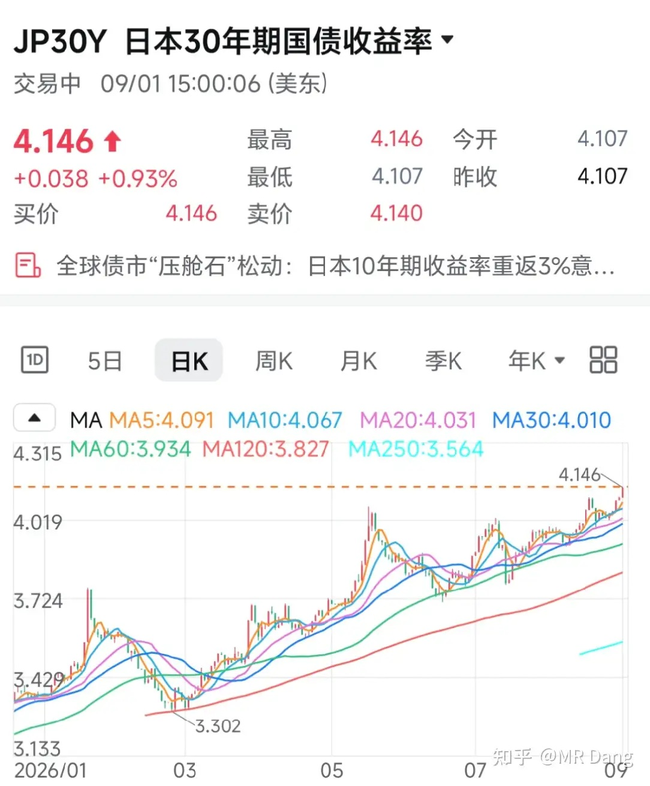
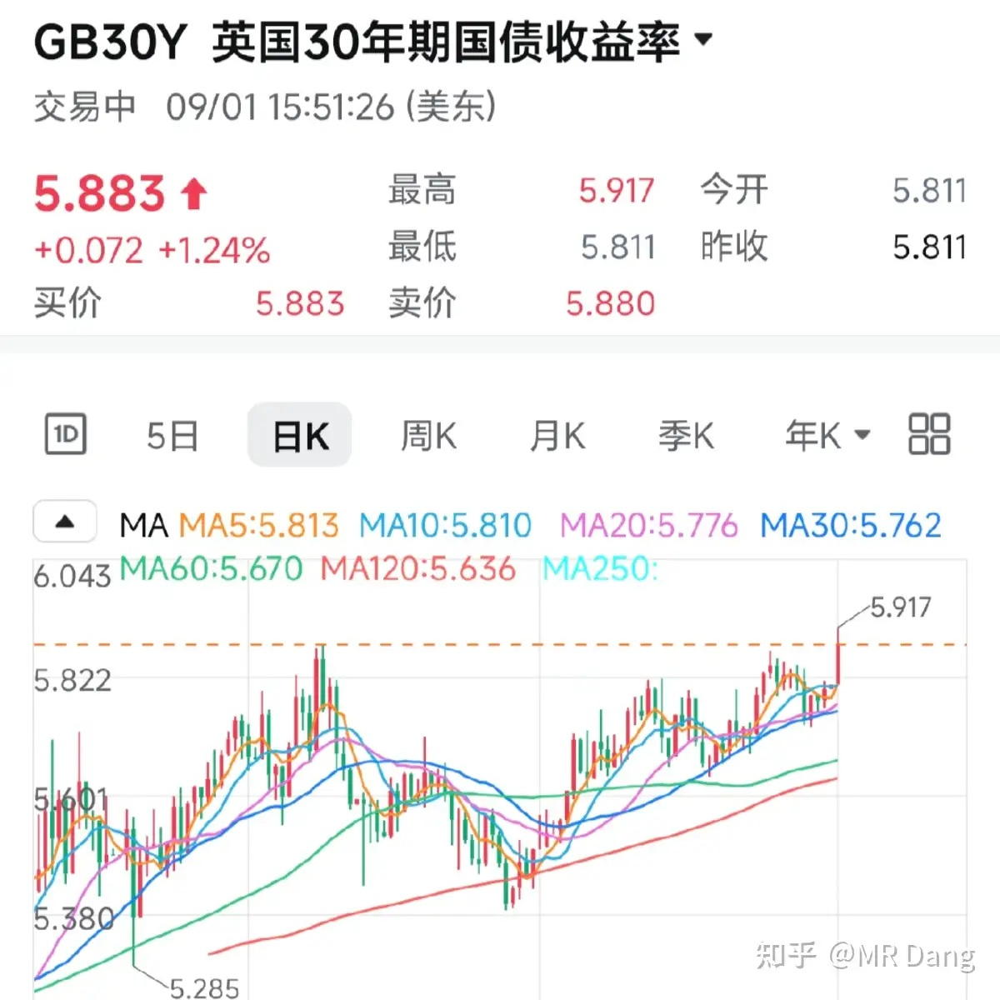
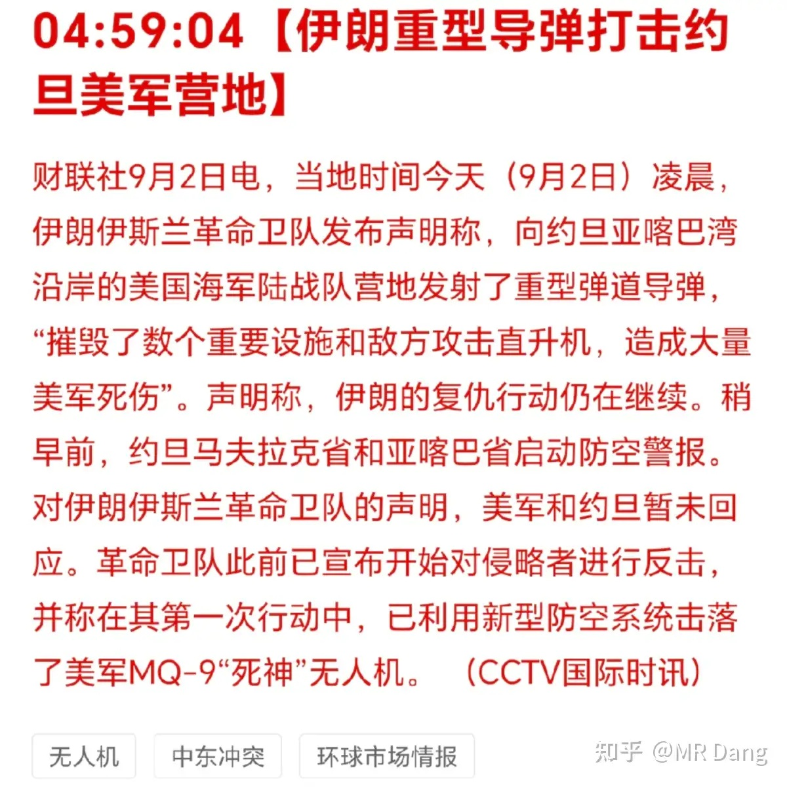
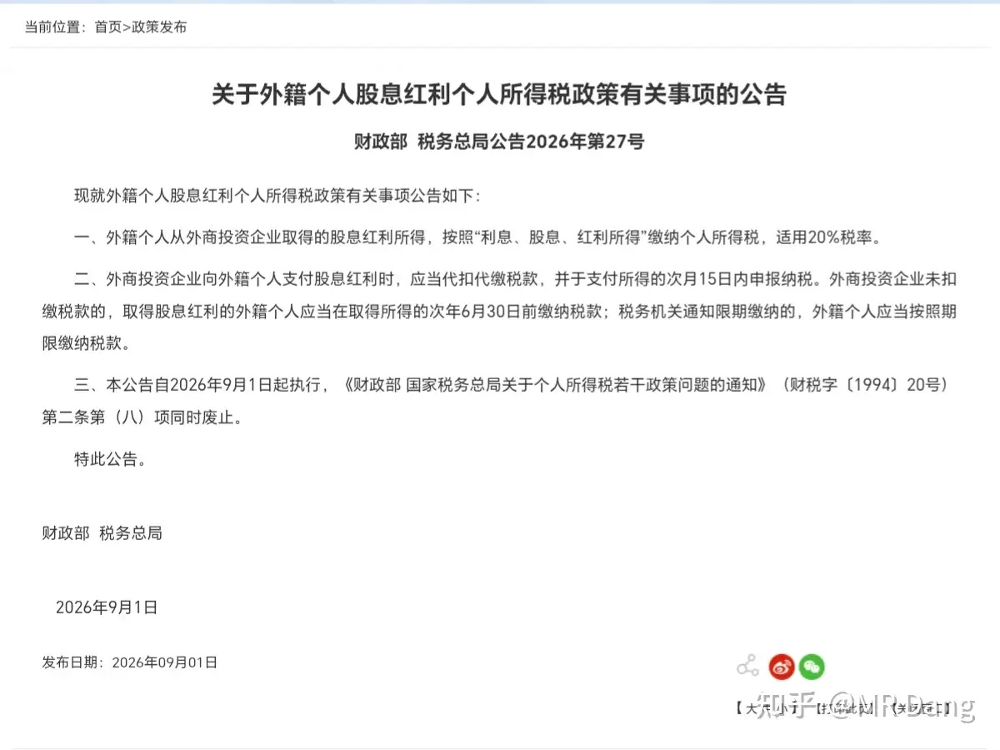
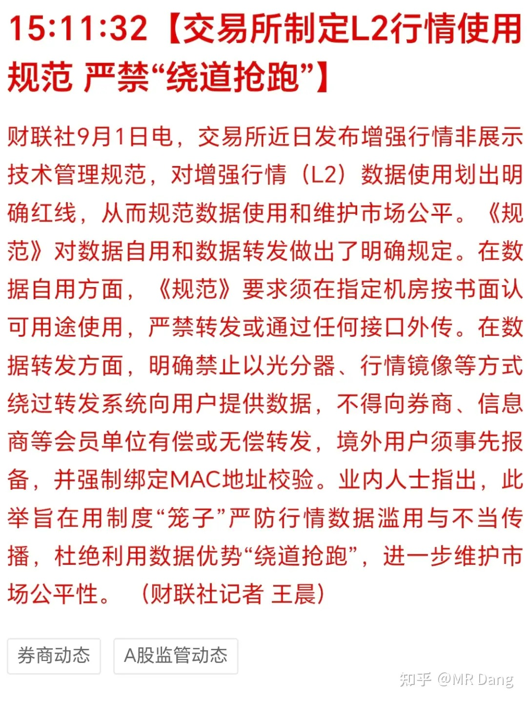
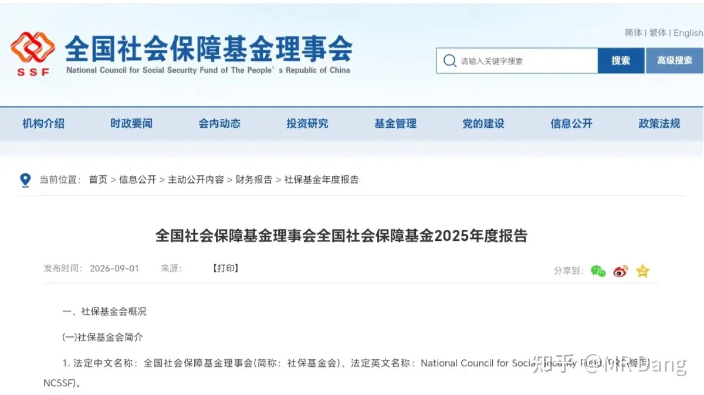
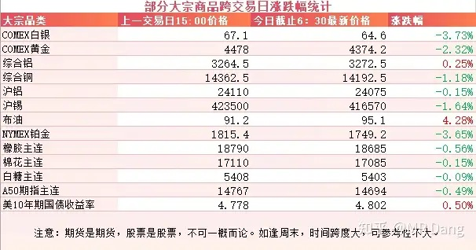
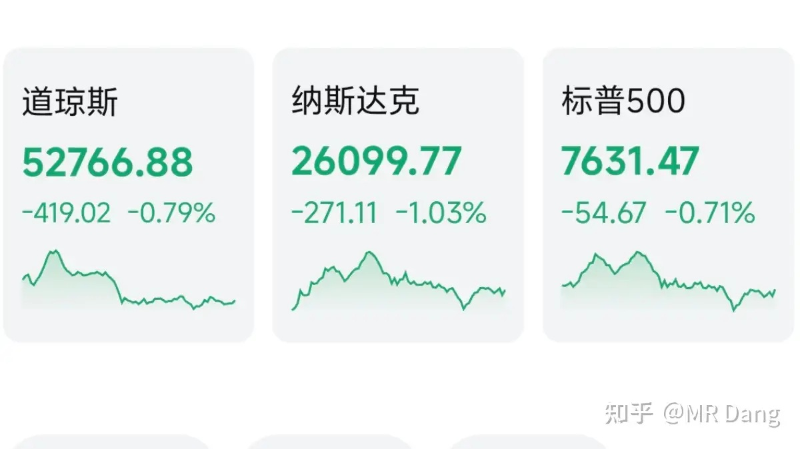

# 大家对2026年9月2日A股市场行情都怎么看待？

---

**发布时间**: 2026-09-02 07:30  |  **原文链接**: https://www.zhihu.com/question/2078045916519461176/answer/2078384204111418734  |  **点赞数**: 200 人赞同

**作者信息**: MR Dang | 证券从业资格证持证人

---

## 正文内容

今天最大的消息就是债市风云：

### 首先是岛国

30年长债收益率创历史新高。

长端收益率大幅上行，代表市场已经充分计价9月18日加息25bp到1.25%，后续还要继续加息 。

昨天还有报道G20 财长会议期间，贝森特连续释放强硬信号，称相信岛国政府和央行将"采取措施推动日元走强"，并表示"我掌握着市场没有的信息"。

岛国债务/GDP的比值超过260%，是主要经济体中比例最高的，一旦外界对岛国还款能力产生担忧，很容易形成负螺旋，最后加息的边际效用会递减。

过去多年来，日元都是最便宜的钱，日元套息交易下的受益资产都会受到影响，流动性趋紧。

对咱们来说，影响不大，可能港股相对更开放一些，大A现在理论上没什么套息交易，因为资本管制，而且红票子现在利率也很低。

### 其次是英国

英30年期国债收益率也在创新高。

和岛国不一样的地方在于，英国债市收益率走高的主要推手是通胀粘性和发债规模的增加。

以及公共政策研究所提议对银行在英国央行的储备金利润征收暴利税，引发财政可持续性担忧。

但无论是哪种情形，全球债市收益率集体走高会使得无风险收益率上行，贴现率抬升，压制资产价格，对投资者来说可不是什么好消息。

---

### 美伊局势

两边又掐起来了，目前规模不算大，不过油价又涨了起来。

---

### 取消老外税收优惠

有关部门发了个公告，取消外籍个人股息的优惠，和咱们一样，都是20%。

估计不发这个公告，很多投资者都不知道老外还有这个超国民待遇。

这个政策是从1994年就出台的，本意是促进开放，吸引外资。

三十多年过去了，现在经济环境发生了很大的变化，如果不一视同仁，入个外籍就不用缴纳红利税，会被有些人卡BUG的。

比如一些上市公司的老板，人都跑了，结果分红反而不需要纳税了，这明显有失公允吧。

最近税务有关的问题频频上新闻，大家也做点心理建设吧，说不定啥时候就轮到了。

---

### L2 行情收紧

L2行情，很多普通投资者可能也不经常使用，一般属于券商的增值服务。

简单的说，就是平时看行情是五档，L2能看到十档的盘口。

说实在的，这个对普通投资者用处不大。

因为多看几档盘口也并不能怎样，交易频率又不高，对投资决策也没啥用。

对大户倒是有些用，比如逃命的时候，怕下面五档接不住，如果能看到十档行情，就可以对准下面的买盘扔下去。

这次规范管的不是L2行情本身，而是L2的"非展示用途"，也就是机构买了L2数据后，不展示给人看，而是直接喂给计算机程序做量化交易的场景。

直接把L2数据喂给量化还绕过了转发系统，时间上有优势，相当于抢跑，明显有失公平，堵住这个口子可以让市场更公平。

---

### 社保

社保基金发布了2025年的年报，大家关心的投资收益去年是13.22%，成立以来年均收益率是7.62%。

讲道理，真心还不错了，这么大规模，能做到这个投资收益率，已经相当不错了。

当然去年的话，主要是整个市场表现好，所以收益率也高一些。

---

### 大宗商品

贵金属承压，金银铂跳水，都是两三个点的跌幅。

工业金属稍好一些，铜锡一个点左右的回调，铝相对稳一些。

原油涨了四个点，95美元了，又逼近三位数的油价了。

A50期指承压，农产品回调。

美长债收益率看着更吓人了，昨天瞅着就感觉不太妙，还想着为什么资本市场不担心呢。

### 外围市场

美三大股指集体回调，纳指领跌，科技股走弱。

板块上除了油气，药品，消费电子，其他行业几乎全军覆没。

mRNA疫苗走强，戴尔盘后也公布了财报，数据不错，市场给的反应还可以。

---

昨天个人组合净值回血近一个点，银行红一个半点，资源红一个半，消费基本打平，电网绿近一个点。

还不错，有点像回合制游戏，七月回血，八月吐出来大半，九月才开始，好像又来到了回血的回合。

可惜伤的有点重了，得好一段时间才能缓过来。

最近市场没啥热点，逮着一个厄尔尼诺狠狠地薅。

刀尖舔血不过如此了，本身农业是财务造假重灾区，主粮更是敏感地带，还敢这么炒作，到时候又是一地鸡毛。

很多投资者之前还是坚定的科学家，航天员，追光者，这两天已经开始想当农场主了。

大A这么多年了，玄学梗，生肖梗，谐音梗，层出不穷，究根到底，还是有相应的受众群体作为土壤。

我最大的感受就是很多市场参与者非常情绪化，很容易被市场的情绪裹挟着走。

至于今天的话，看着各种利空，有点瑟瑟发抖，好在自己拿的都是下水道，已经在坑里了，随缘去吧。

---

### 一个喜欢保护韭菜的博主，希望大家少少踩坑，多多赚钱！！！

> [!comment]- 点击展开评论
>
> | 用户 | 时间 | 内容 |
> | :--- | :--- | :--- |
> | 小虾球 |  | 以前是农业从业者，农业种植这方面的账很难算，洗钱也很好洗，毕竟随便一个虫害都能让一块地产量大减[捂脸][捂脸][捂脸] |
> | &nbsp;&nbsp;&nbsp;&nbsp;MR Dang |  | [感谢] |
> | &nbsp;&nbsp;&nbsp;&nbsp;草长莺飞 |  | 养贝那个獐子岛不就是吗 |
> | 等亿会儿就去学习 |  | 进大A后，投资者都变成消费者了 |
> | &nbsp;&nbsp;&nbsp;&nbsp;MR Dang |  | [感谢] |
> | william |  | 两边又开始画线 |
> | &nbsp;&nbsp;&nbsp;&nbsp;MR Dang |  | [感谢] |
> | 空杯 |  | 佬，当初买入逻辑是锚定股息率，既然股息不稳定了，那么买入逻辑不存在了，按理说应该清啊，这点俺不理解[调皮]还有看核心一级资本净额是每年增高的，单看数额分红钱是有的[吃瓜]但是公司得考虑监管红线，RWA增速这么快，分母增速快于分子，比率就下来了[衰]另外不良贷款率是下降了，但是关注类贷款占比，逾期贷款占比，关注类贷款迁移率，拨备覆盖率对比其他行差距太大了，零售不良率是上升的，结合这些指标接下来计提压力是很大的且会持续一段时间（感觉得以年为单位[可怜]），想问下佬，这样的资产质量年报分红我看不出来有啥惊喜，是有什么是我还没关注到的吗[好奇] |
> | &nbsp;&nbsp;&nbsp;&nbsp;冷眸 |  | 不会回复你的，我真的是半仓银行，只能躺平装死了 |
> | 红.德仔 |  | [滑稽][滑稽] |
> | &nbsp;&nbsp;&nbsp;&nbsp;MR Dang |  | [感谢] |
> | 北纬31度没有诗 |  | [感谢] |
> | &nbsp;&nbsp;&nbsp;&nbsp;MR Dang |  | [感谢] |
> | 无为 |  | [感谢]早 |
> | &nbsp;&nbsp;&nbsp;&nbsp;MR Dang |  | [感谢] |
> | horsemc |  | 油价一跌下来他俩就开始打，他俩商量好的吧！ |
> | 我是一颗桃子吖 |  | 早[感谢] |
> | &nbsp;&nbsp;&nbsp;&nbsp;MR Dang |  | [感谢]早啊 |
> | &nbsp;&nbsp;&nbsp;&nbsp;我是一颗桃子吖 |  | d哥，我不行了，8月最后一周回撤好多[大哭]我打算跑路一半存到银行，装死平复一下心情了[大哭][大哭][大哭] |
> | &nbsp;&nbsp;&nbsp;&nbsp;MR Dang |  | [捂脸]欢迎来一起蹲着 |
> | &nbsp;&nbsp;&nbsp;&nbsp;我是一颗桃子吖 |  | 没眼看了，一起蹲一起蹲，正好看看d哥上次推荐的书单[酷] |
> | 晨雾 |  | [感谢][感谢][感谢] |

---

*本文件从 MR Dang 知乎页面转载*

**作者**: MR Dang  
**链接**: https://www.zhihu.com/question/2078045916519461176/answer/2078384204111418734  
**来源**: 知乎

*著作权归作者所有。商业转载请联系作者获得授权，非商业转载请注明出处。*

---

## 相关阅读

- [[20260901-如何看待2026年9月1日A股行情？|上一篇：如何看待2026年9月1日A股行情？]]
- [[20260903-如何看待2026年9月3日A股市场行情？|下一篇：如何看待2026年9月3日A股市场行情？]]
