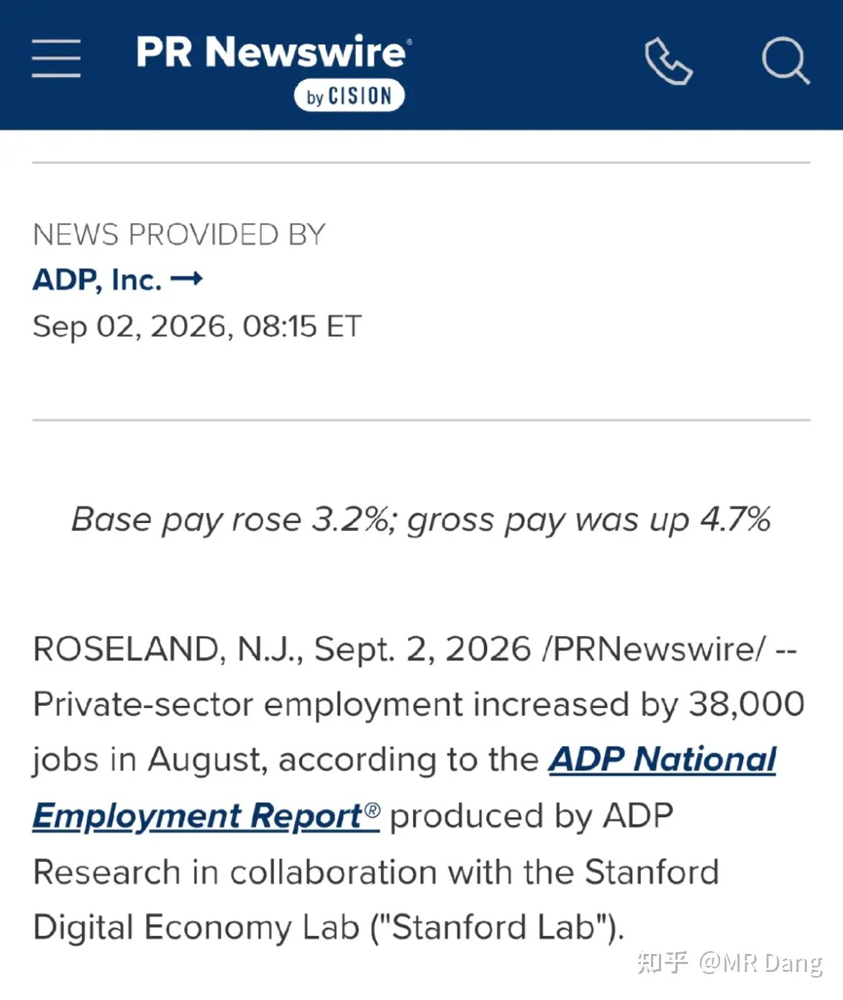
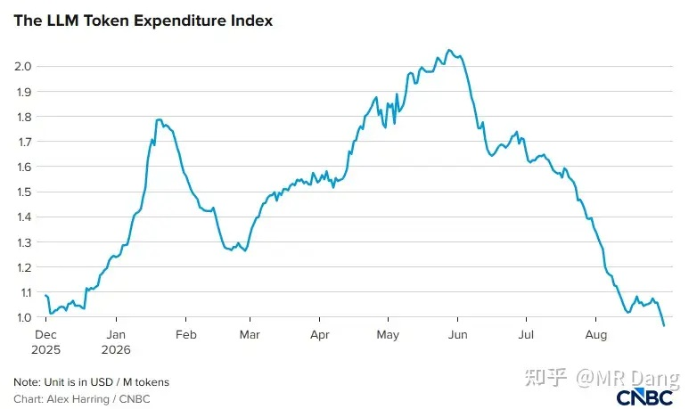
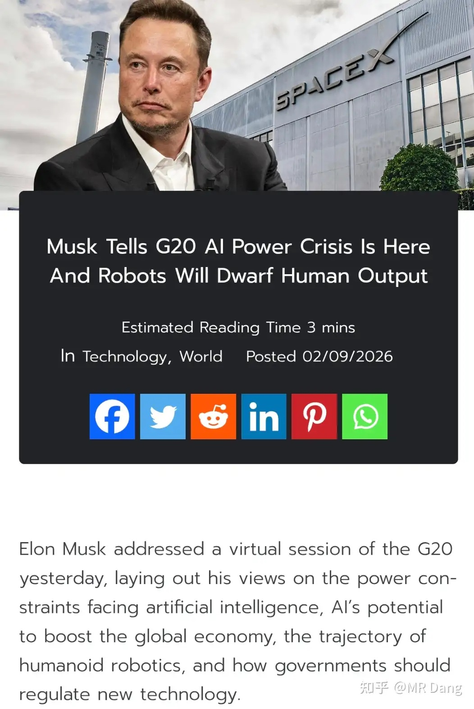
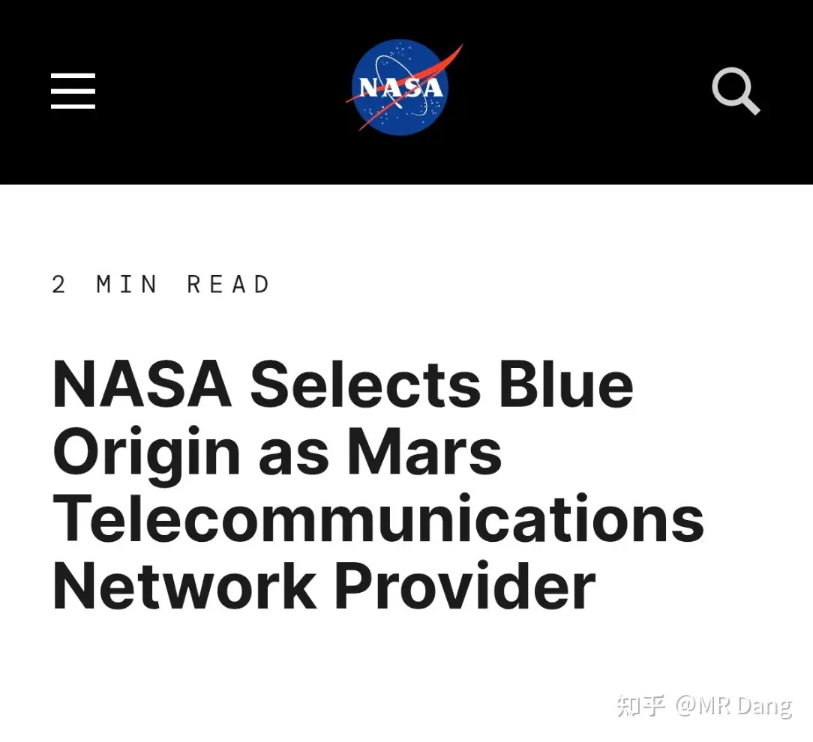
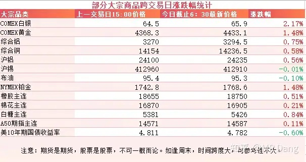
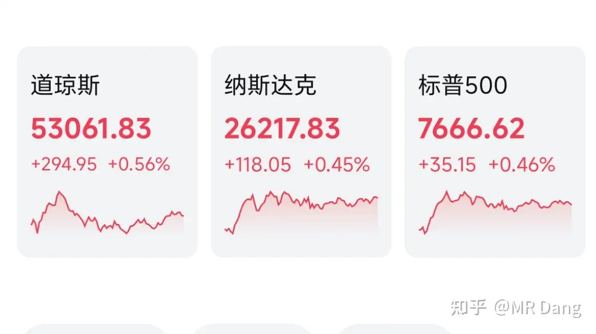

# 如何看待2026年9月3日A股市场行情？

---

**发布时间**: 2026-09-03 07:30  |  **原文链接**: https://www.zhihu.com/question/2075967797956555612/answer/2078746581659037835  |  **点赞数**: 178 人赞同

**作者信息**: MR Dang | 证券从业资格证持证人

---

## 正文内容

### 西大ADP就业数据公布

8月增加就业38000人，创一年以来新低。

低于市场预期的47000人，也低于此前的44000人。

数据出炉后，9月加息概率大概下滑了十个点左右，目前是65%左右。

---

### 算力过剩疑云

国外知名媒体报道Silicon Data LLM Token支出指数已经从高位腰斩。

今年六月的时候还保持在两美元每百万token，如今已经跌破一美元了。

这个指数编制规则是按照加权平均法进行计算的，受两方面的影响，一方面是算力价格的下降，另一方面是结构的变化，从贵的模型转移到了便宜的模型。

如果是别的行业，就直接宣判算力过剩了，然后相关产业链就开始崩塌。

但是算力的话，有一个杰文斯悖论。

大意是瓦特改进蒸汽机后，每单位产出对煤炭消耗量大幅下降。

按常理，煤炭应该用得更少了，但实际情况是煤炭总消耗量反而暴增。

因为成本降低让以前不用蒸汽机的领域也可以用了，以前用不起蒸汽机的人也开始用了，总需求暴增。

现在算力能不能复刻以前蒸汽机的路径，市场还有争议，价格下降能不能让大家养成使用token的习惯，从而需求爆发，还有待观察。

整体利好下游应用软件企业，成本压降。

---

### 老马又在画饼了

在最近的一次演讲中，马斯克预测AI或推动全球经济增长20%至30%，每年可带来高达30万亿美元的经济产出。

他对机器人领域最为乐观，预测未来十年内，全球人形机器人数量将达到10亿台。

这些机器人的产出至少是人类的五倍。

我对他的预测持怀疑态度，感觉更像是给自家机器人做广告。

---

### 火星也要有网了

NASA发了个公告，把火星上的通信网络订单给了蓝色起源。

订单金额并不大，也就7亿绿票子，

但是蓝色起源击败SpaceX获得NASA大单，标志着贝索斯的深空战略开始兑现。

尽管它已经在近地轨道上输的一败涂地，今年五月份的时候火箭还炸了一次。

---

### 大宗商品

有色集体反弹，贵金属金银铂都有一两个点的涨幅，工业金属也多多少少涨了一些。

农产品和原油高位震荡。

美债收益率回来一些，能缓解部分焦虑。

A50期指看着还凑合。

### 外围市场

美三大股指集体上涨，道指领涨。

行业上表现都还可以，存储，有色，银行走强。

博通盘后发布了财报，四季度指引不及预期，股价跳水。

---

昨天个人组合净值回撤一个半点，银行绿近一个半，资源绿两个多，消费绿一个半，电网绿大半个。

市场情绪很低落，也没什么热点，3900多只待涨，1500多只上涨，中位数大概也是绿了一个多点。

前期热点农业熄火了，有些投资者好不容易当上农场主，就发现手里多了几朵棉花，耳边传来鞭子划破空气的声音。。。。。。

---

### 一个喜欢保护韭菜的博主，希望大家少少踩坑，多多赚钱！！！

> [!comment]- 点击展开评论
>
> | 用户 | 时间 | 内容 |
> | :--- | :--- | :--- |
> | 一尔 |  | 完了，今天开盘全红上千，一个电话再看，基本绿了。 |
> | 安静 |  | 为啥降息预期了，恒科还跳水，真的不想混了。 |
> | 开心的张同学 |  | 现在要轻指数重个股，还是科技为主线，液冷将要扬帆远航！ |
> | 范团团 |  | 煤炭会怎么样走 |
> | 乐妈 |  | [感谢][感谢][感谢] |
> | &nbsp;&nbsp;&nbsp;&nbsp;MR Dang |  | [感谢] |
> | 木子一 |  | [感谢] |
> | &nbsp;&nbsp;&nbsp;&nbsp;MR Dang |  | [感谢] |
> | 我是一颗桃子吖 |  | 早[感谢] |
> | &nbsp;&nbsp;&nbsp;&nbsp;MR Dang |  | [感谢]早啊 |
> | 知乎用户nAF89 |  | [感谢][感谢][感谢] |
> | &nbsp;&nbsp;&nbsp;&nbsp;MR Dang |  | [感谢] |
> | Dewey |  | 老师早[感谢][感谢]感谢 |
> | &nbsp;&nbsp;&nbsp;&nbsp;MR Dang |  | [感谢] |
> | 要走多少路 |  | 看完点赞是品质，谢谢老师。[感谢][感谢] |
> | &nbsp;&nbsp;&nbsp;&nbsp;MR Dang |  | [感谢] |

---

*本文件从 MR Dang 知乎页面转载*

**作者**: MR Dang  
**链接**: https://www.zhihu.com/question/2075967797956555612/answer/2078746581659037835  
**来源**: 知乎

*著作权归作者所有。商业转载请联系作者获得授权，非商业转载请注明出处。*

---

## 相关阅读

- [[20260902-大家对2026年9月2日A股市场行情都怎么看待？|上一篇：大家对2026年9月2日A股市场行情都怎么看待？]]
- [[20260904-怎么看待2026年9月4日A股市场行情？|下一篇：怎么看待2026年9月4日A股市场行情？]]
