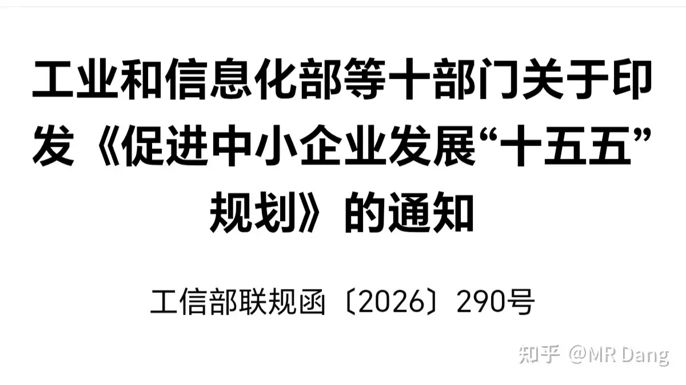
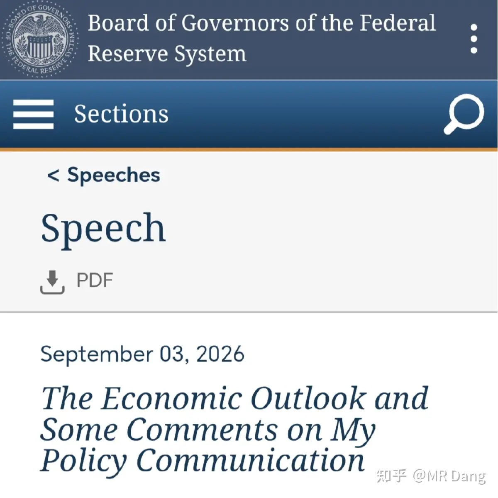
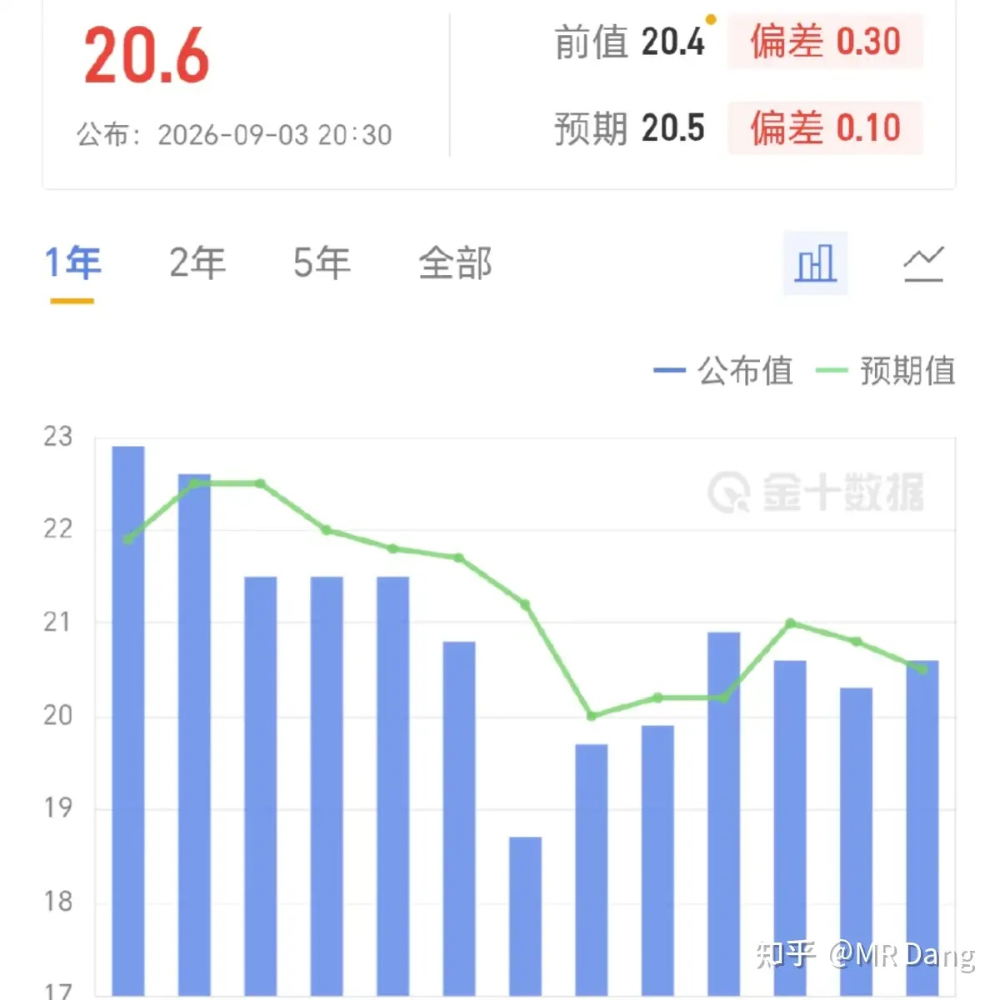
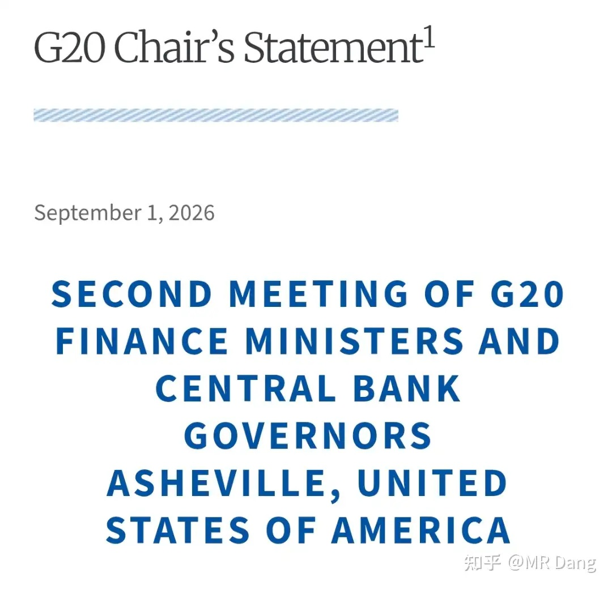
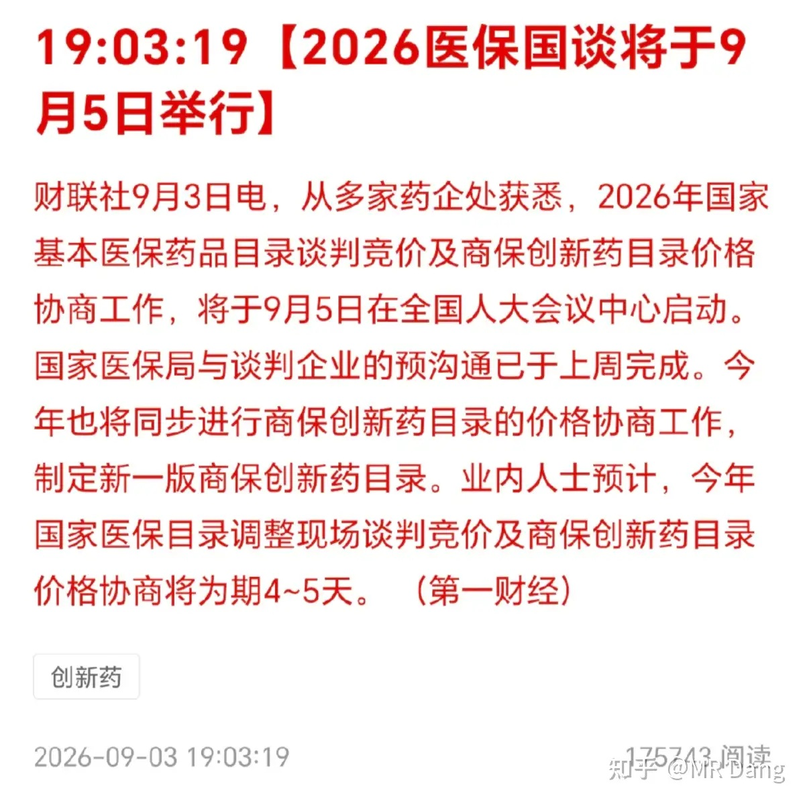
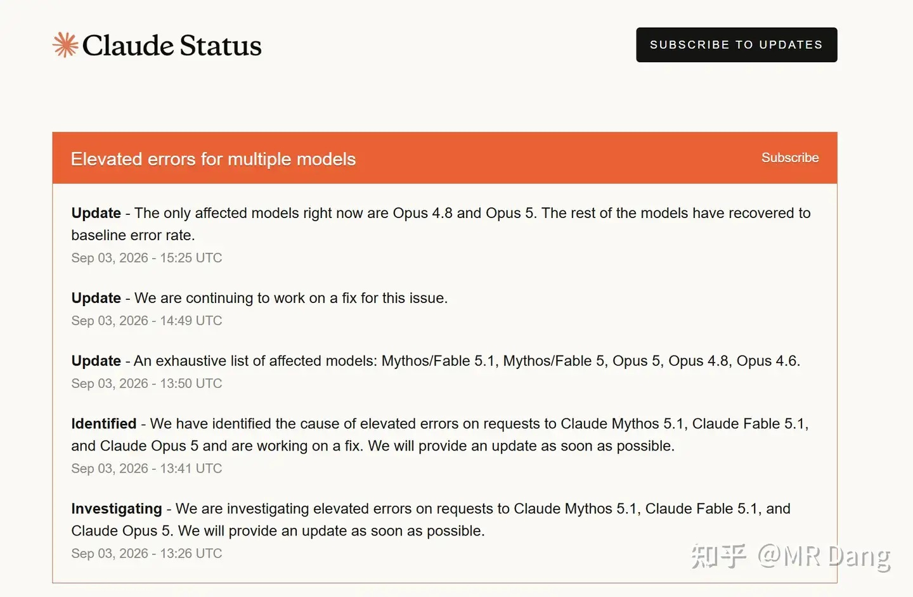
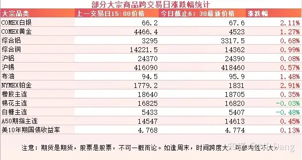
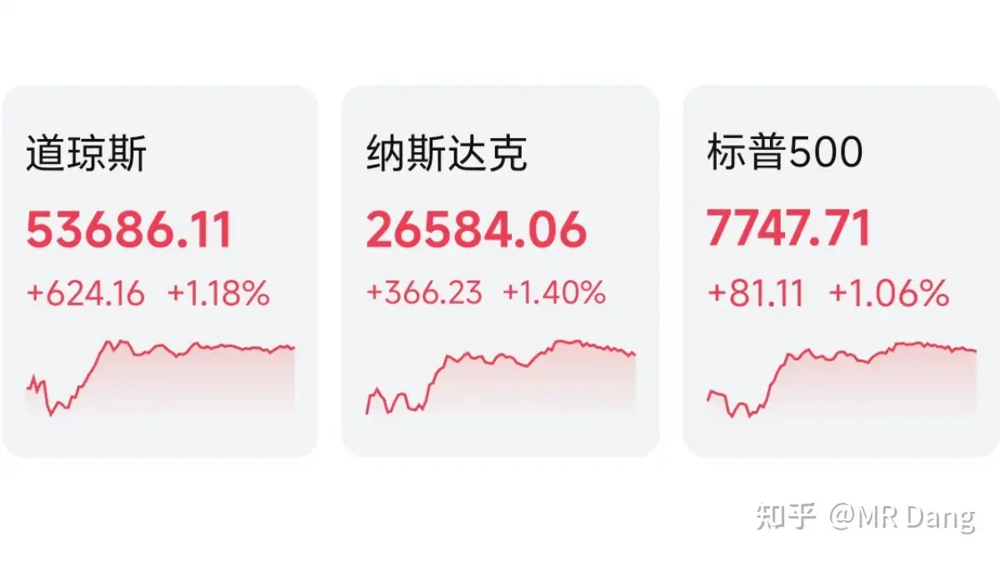

# 怎么看待2026年9月4日A股市场行情？

---

**发布时间**: 2026-09-04 07:30  |  **原文链接**: https://www.zhihu.com/question/2076335433173169622/answer/2079109008909251332  |  **点赞数**: 137 人赞同

**作者信息**: MR Dang | 证券从业资格证持证人

---

## 正文内容

### 中小企业发展十五五规划

有关部门发了一个《促进中小企业发展十五五规划》的通知。

还是那句话，顶层设计一定要看原文才能理解到精髓

没时间的话我可以讲一下个人见解。

我个人觉得最超预期的表述是高质量建设债券市场科技板，支持符合条件的中小企业债券融资。

这个之前没有任何风声或者预期。

债券市场凭空多了一个板块出来，以后可能会多出来一个科技债的品种。

不单资本市场里有创业板，科创板，债券市场也会有。

另外就是在股权融资这块，国家中小企业发展基金二期要落地了，这里可能也是几千亿的规模。

总的来说，利好中小企业，利好券商，有利于券商增加收入。

资本市场里，北交所里的企业是平均最小的，所以可能受益更明显。

但是长期的话，有个隐忧，就是这么多中小企业，以后可能会排着队上市，会让流动性承压，不过这都是后话了。

---

### 沃勒表态

美联储理事沃勒周四在华盛顿Reuters NEXT活动上发表讲话，释放了明显的鸽派信号。

他倾向9月维持利率不变：如果未来两周通胀数据继续降温，他将支持在9月15-16日议息会议上把联邦基金利率维持不变 。

"给通胀回落一个机会"，他明确表示"可以等一个议息会议再做决定"，不会在通胀回落阶段继续加息。

他表示会关注下周公布的8月CPI数据。

沃勒说完话以后，加息概率从63%降低到了50%左右。

---

### 西大周初请失业金人数

西大公布了周初请失业金人数的最新数据，20.6万人的数据高于预期值20.5万人，也高于前值20.4万人。

叠加沃勒的鸽派表态，整体情绪有所好转。

---

### G20主席文件

由于东大的反对，G20没有发共同声明，仅发布了一个主席文件，这是前几天的事情了，昨天东大各部门正式回应。

东大反对这个文件中的四个议题，分别是霍尔木兹海峡，全球贸易失衡，IMF监管权和主权债务重组。

这个文件里透漏出来一股比较酸的味道，指责东大在贸易中赚了太多钱，应该少赚一点。

---

### 2026医保国谈

媒体爆料今年的医保国谈将在明天启动。

今年的特殊之处在于双目录并行，也就是基本医保目录和商保创新药目录同步调整。

每年谈判期间，相关药企的股价都会大幅波动，根据谈判结果，会有很大的变数。

特别是依赖单一品种的企业，是际遇，更是风险。

---

### 史上最大规模宕机事件

昨晚到今天凌晨，ChatGPT、Claude、Grok三大AI在92分钟内相继宕机，持续4小时，史无前例。

可能的原因是共享基础设施故障，或者电力供应的扰动。

这一事件暴露了AI行业看似多家竞争，实则底层集中的系统性风险。

对行业的启示是多模型冗余成为刚需。

对投资来说，利好算力底座，网络安全，国产大模型之类的。

不过算不上特别大的利好，大部分投资者可能还是看乐子人的心态。

---

### 大宗商品

受加息预期的降温影响，贵金属走强，黄金白银铂金都有一两个点的反弹。

工业金属也不赖，铜铝锡同步上涨。

原油依然维持在95美元附近。

A50期指看着还挺喜人的，可能今天会有个开门红。

美债收益率和农产品都是高位运行。

### 外围市场

受消息面影响，美三大股指集体走强，纳指领涨，大型科技公司强势，黄金相关企业也不赖。

但也不是所有科技相关的都在涨，比如存储和光通信表现就不太好。

---

昨天个人组合净值回血一个多点，银行红大半个，资源红两个半，消费红一个半，电网红小半个。

指数很有意思，都是红的刚刚好，就是那么巧。

整个市场有近3600家下跌，1800多家上涨，中位数大概是下跌了大半个点左右。

确实也没什么热点，东边一榔头，西边一棒槌的，互掏口袋都没什么好的方向。

有的投资者想埋伏到十一板块里，认为这个十一和中秋是连着的，假期比较长，可能旅游和消费数据会好比较好看。

逻辑上没大的硬伤，埋伏总比追热点强一些。

不过要注意的是，这种互掏口袋的需要果断一些，节后风险会显著加大。

---

### 一个喜欢保护韭菜的博主，希望大家少少踩坑，多多赚钱！！！

> [!comment]- 点击展开评论
>
> | 用户 | 时间 | 内容 |
> | :--- | :--- | :--- |
> | 探索 |  | 看了一篇报道今年端午旅游75%都是去公园游玩的 |
> | 小小酥 |  | 乏善可陈的最近 |
> | kevin | 10 小时前 | 谁知道电网投资那个票吗？ |
> | 乐妈 |  | [感谢][感谢][感谢] |
> | &nbsp;&nbsp;&nbsp;&nbsp;MR Dang |  | [感谢] |
> | 小白爬楼梯 |  | 老师早[感谢] |
> | &nbsp;&nbsp;&nbsp;&nbsp;MR Dang |  | [感谢] |
> | 知乎用户nAF89 |  | [感谢][感谢][感谢] |
> | &nbsp;&nbsp;&nbsp;&nbsp;MR Dang |  | [感谢] |
> | 如来熊掌 |  | [感谢] |
> | &nbsp;&nbsp;&nbsp;&nbsp;MR Dang |  | [感谢] |
> | 孤独风月 |  | [感谢][感谢] |
> | &nbsp;&nbsp;&nbsp;&nbsp;MR Dang |  | [感谢] |
> | 回声 |  | 早[感谢] |
> | &nbsp;&nbsp;&nbsp;&nbsp;MR Dang |  | [感谢] |
> | 要走多少路 |  | [感谢][感谢][感谢]看完送花。 |
> | &nbsp;&nbsp;&nbsp;&nbsp;MR Dang |  | [感谢] |

---

*本文件从 MR Dang 知乎页面转载*

**作者**: MR Dang  
**链接**: https://www.zhihu.com/question/2076335433173169622/answer/2079109008909251332  
**来源**: 知乎

*著作权归作者所有。商业转载请联系作者获得授权，非商业转载请注明出处。*

---

## 相关阅读

- [[20260903-如何看待2026年9月3日A股市场行情？|上一篇：如何看待2026年9月3日A股市场行情？]]
