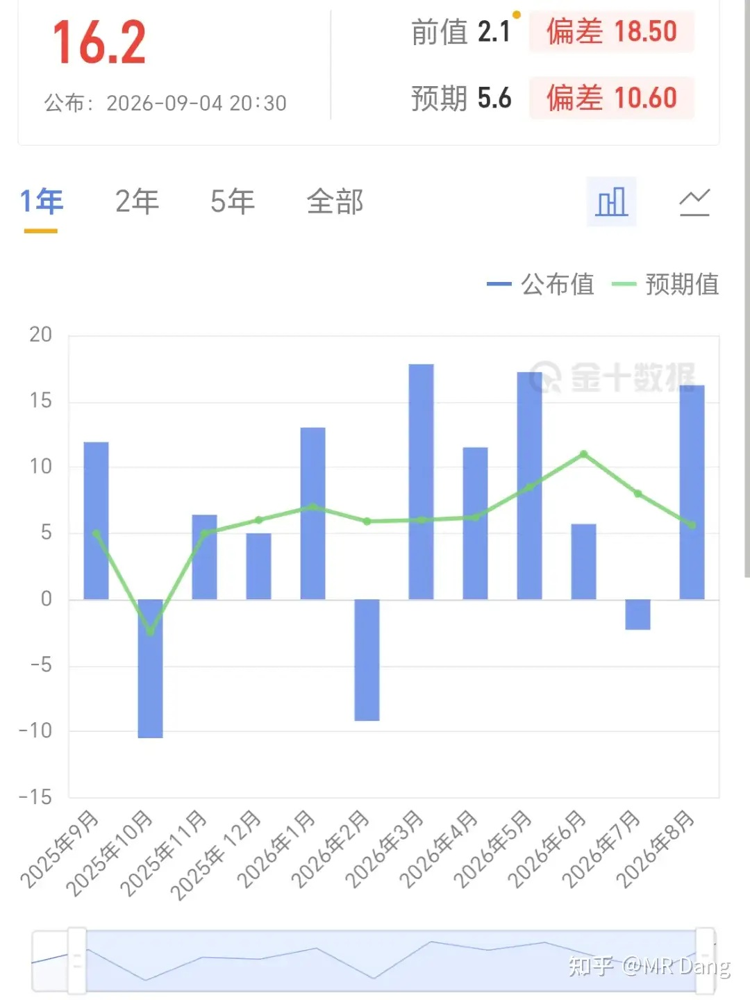
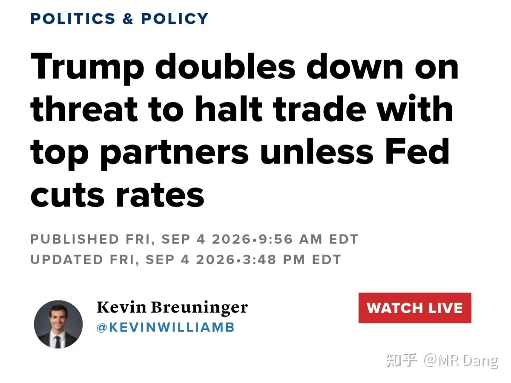
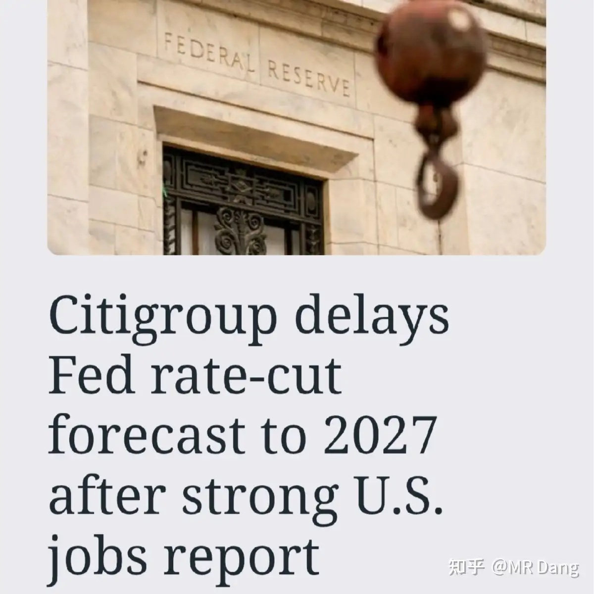
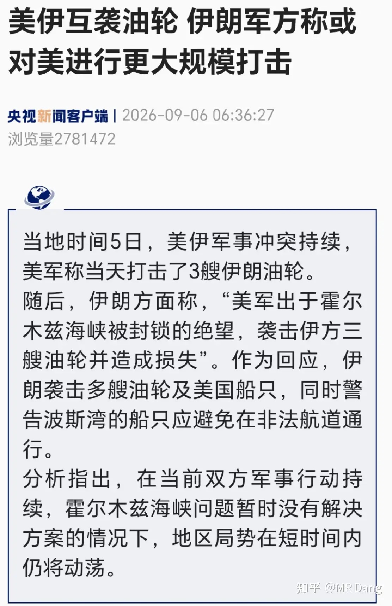
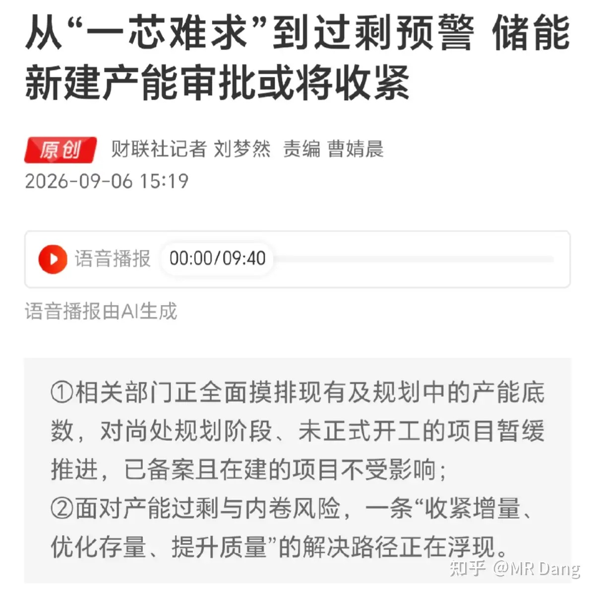
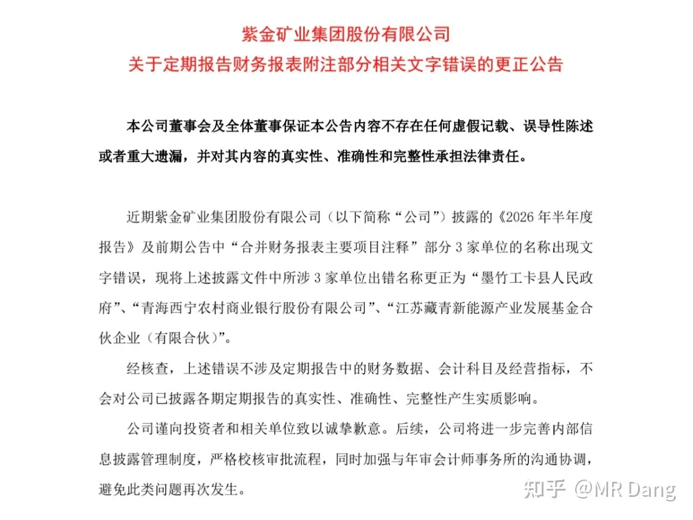
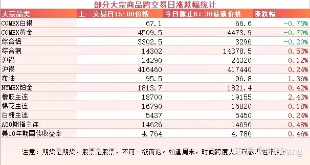
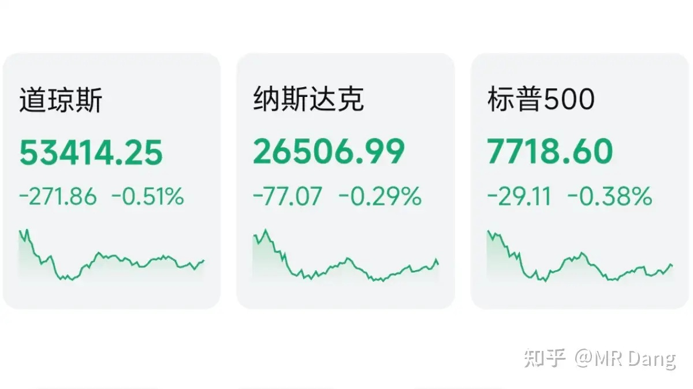

# 如何看待2026年9月7日A股市场行情？

---

**发布时间**: 2026-09-07 07:30  |  **原文链接**: https://www.zhihu.com/question/2076692956254300158/answer/2080196169611866545  |  **点赞数**: 168 人赞同

**作者信息**: MR Dang | 证券从业资格证持证人

---

## 正文内容

还是先把周末重要的新闻过一遍吧。

### 西大非农数据出炉

西大非农数据周五出炉，增加16.2万人的数据远超预期。

预期是增加5.6万人，所以这个数据出炉后，加息预期升温，又回到了60%左右，金银直线跳水。

同时还上修了6月数据1.1万人，7月数据4.4万人，合计上修了5.5万人。

所有数据里相对来说比较偏鸽的只有整体时薪同比增长3.1%，环比增长0.3%，通胀压力有所缓解。

另外还有一个数据是新增就业人数里98%来自女性，新增的16.2万人当中女性有15.8万人。

有说是开学影响，教师里女性占比高。

也有说是服务业影响，餐饮服务从业者里女性占比高。

在数据发布后，懂王对市场进行了安抚，表态称“我们应该支付全球最低的利率”，“我们应该在1%或0.5%，而不是4%”，同时还确认和美联储主席沃什有沟通相关事宜。

金银本来一度大幅跳水，在懂王这一番表态后，又V回来一些。

---

### 花旗推迟降息预期

在以上信息发布后，花旗推迟了美联储降息的预期。

看清楚，不是推迟了加息的时间预测，而是降息的。

花旗是去年对美联储预测最准确的机构，此前预期2026年10月，12月，2027年1月各降息25Bp 。

现在预测2027年6月，9月，12月分别降息25Bp，时间上进行了推迟，没提加息的事，

---

### 美伊局势

国内权威媒体报道了美伊在周末互炸油轮的消息。

伊朗现在越打越自信，可能要一直对抗到中期选举以后，借此给懂王施压。

论吃苦能力，西大的民众可能比不上伊朗的十分之一，所以哪怕伊朗用自身的十倍痛苦去换西大的一份痛苦，最后先忍不住的可能还是西大。

---

### 储能产业链

有媒体报道储能新建产能或将收紧。

这个在今年三月的时候有关部门预警过，现在算正式落地。

储能目前来说，供需还算平衡，甚至短期内还是供不应求。

但是在建和规划产能实在太高了，远超需求。

现在把规划产能收紧，对已经获批的企业是好事。

整体上利好头部企业，利空二线及正在进入这个赛道的小企业。

对上游的产业链，比如碳酸锂，正负极，电解液，都是利空。

---

### 公告速递

某有色龙头企业发布了一个更正财报文字错误的公告。

这是之前时代周报记者发现的，给公司发了采访提纲，过了几天就出了更正公告。

往好里想，公司知错能改，态度还行。

往坏处想，这么大公司连这种低级错误都能犯，信披质量让人担忧。

我个人一直觉得这家公司治理水平挺高的，信披质量也很高，发生这种事情确实让人大跌眼镜。

这次的事件还有一个巧合在于把“新能源”写成了“新熊源”，如果不说笔误，还挺有梗的其实。

---

### 大宗商品

受上述消息面的影响，金银在跳水后V起来一些，目前整体回调大概一个点不到。

铜铝锡等工业金属基本没受到波及，还有少许涨幅。

原油维持高位，逼近三位数。

农产品，特别是橡胶走强，除了表格里的天然橡胶，作为替代品的合成橡胶也大幅走强。

包括周末复盘里屡次提到的丁二烯和乙二醇，供应都偏紧。

A50期指看着又行了，希望今天有个开门红。

### 外围市场

上个交易日美三大股指集体回调，道指领跌。

板块上存储，半导体，农业比较强，其他表现不佳。

今天美股劳工节放假一天。

---

上个交易日个人组合净值回血小半个，银行红大半个，资源绿一个，消费红一个，电网绿半个。

只看结果还凑合，不过要是看过程，会有一定的失落感。

失落在哪里呢，主要是一开始给的太多，结果收盘都拿回去了。

就像一个无能的丈夫，听到楼上楼下都如火如荼的进行着，然后鼓足勇气磕了几片蓝色小药丸，最后还是草草了事。

大A到底是器质性的还是心因性的，有没有懂的老中医给调理一下。。。。。

---

### 本周前瞻

1，今天公布咱们这边的外汇储备。

2，周二公布贸易账。

3，周三公布咱们的CPI数据，可能对消费板块有一定影响。

4，周四西大周初请失业金人数。

5，周五公布西大CPI数据，这个是本周最重要的宏观数据了。

6，小米，华为，苹果都在本周开新品发布会。

---

### 一个喜欢保护韭菜的博主，希望大家少少踩坑，多多赚钱！！！

> [!comment]- 点击展开评论
>
> | 用户 | 时间 | 内容 |
> | :--- | :--- | :--- |
> | 的的 |  | d大，财政部向8家企业增资咋看？ |
> | &nbsp;&nbsp;&nbsp;&nbsp;王子晋 |  | 属于莫谈国事了 |
> | &nbsp;&nbsp;&nbsp;&nbsp;画不尽晚风 |  | 往好了想属于“未雨绸缪”的前瞻性、系统性安排，也彰显了对于金融行业未来发展的信心[机智] 往深了想风险来了扛得住，金融体系更稳固，具体哪来的风险，我不知道，你别管[酷] |
> | 蘇湄 |  | 伊朗现在越打越自信，可能要一直对抗到中期选举以后，借此给懂王施压，伊朗是懂操作的[飙泪笑] |
> | &nbsp;&nbsp;&nbsp;&nbsp;MR Dang |  | [感谢] |
> | &nbsp;&nbsp;&nbsp;&nbsp;yzhd |  | 主要是为美国继续搞好输入性通胀做出最大的努力，鼓励美联储在加息问题上勇往直前，让共和党政府一举夺得参众两院少数党的胜利 |
> | captainleo |  | 女性就业多不是林肯号马上要回去了[滑稽] |
> | &nbsp;&nbsp;&nbsp;&nbsp;MR Dang |  | [感谢] |
> | 言不可弥 |  | 储能产能过剩会顺着当初数据中心产业链蔓延下来一样蔓延上去，慢慢会有数据中心过剩，算力过剩。储能一开始就是被算力-数据中心-储能这条线带出来的。 |
> | 陌上愚翁 |  | [感谢] |
> | 我是一颗桃子吖 |  | 早[感谢] |
> | &nbsp;&nbsp;&nbsp;&nbsp;MR Dang |  | [感谢]早啊 |
> | 帅小伙 |  | [感谢] |
> | &nbsp;&nbsp;&nbsp;&nbsp;MR Dang |  | [感谢] |
> | 顾越 |  | [感谢] |
> | &nbsp;&nbsp;&nbsp;&nbsp;MR Dang |  | [感谢] |
> | 木子一 |  | [感谢] |
> | &nbsp;&nbsp;&nbsp;&nbsp;MR Dang |  | [感谢] |
> | icing77 |  | [哇][感谢] |
> | &nbsp;&nbsp;&nbsp;&nbsp;MR Dang |  | [感谢] |

---

*本文件从 MR Dang 知乎页面转载*

**作者**: MR Dang  
**链接**: https://www.zhihu.com/question/2076692956254300158/answer/2080196169611866545  
**来源**: 知乎

*著作权归作者所有。商业转载请联系作者获得授权，非商业转载请注明出处。*

---

## 相关阅读

- [[20260904-怎么看待2026年9月4日A股市场行情？|上一篇：怎么看待2026年9月4日A股市场行情？]]
- [[20260908-如何看待2026年9月8日A股市场行情？|下一篇：如何看待2026年9月8日A股市场行情？]]
