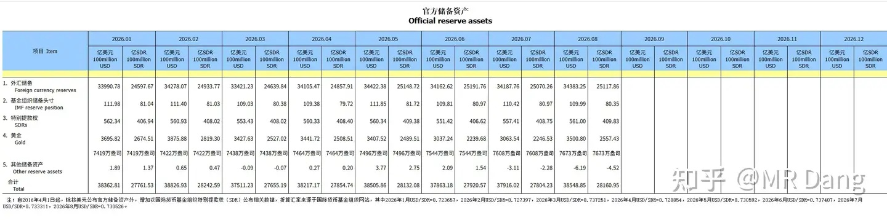
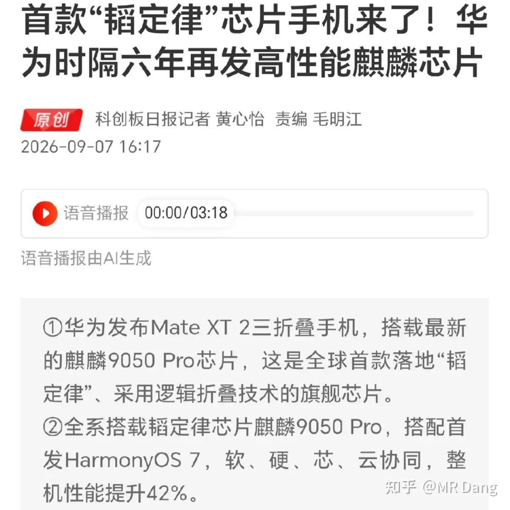
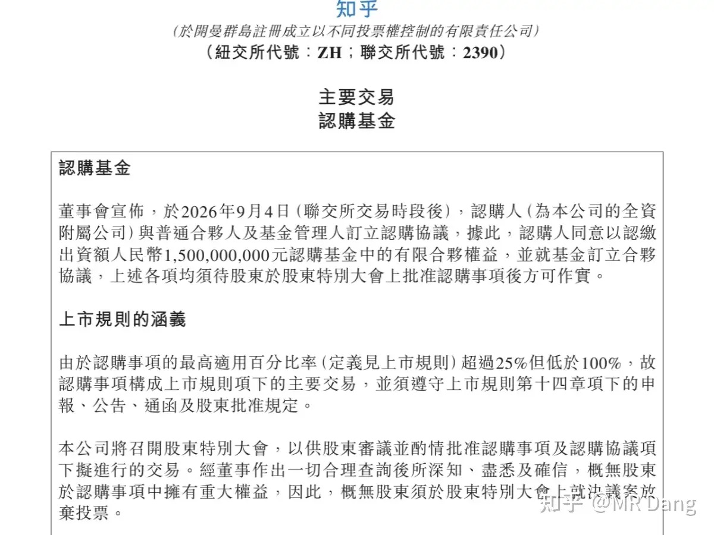
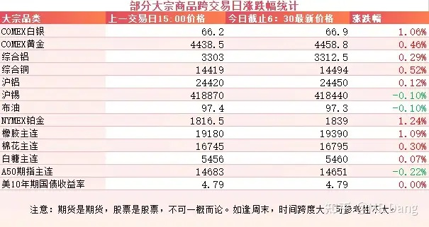
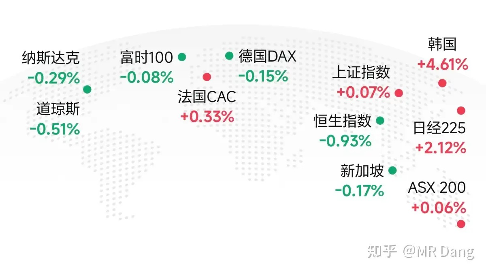
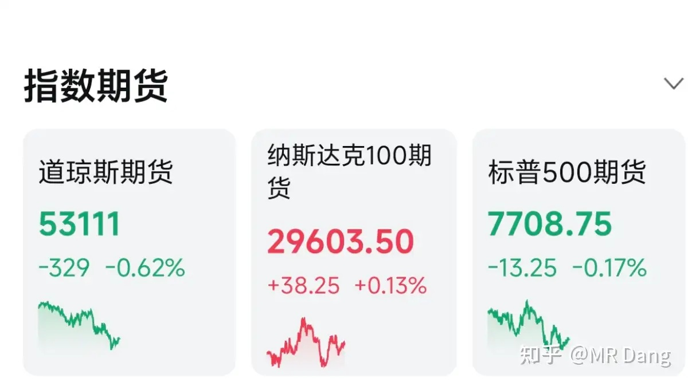

# 如何看待2026年9月8日A股市场行情？

---

**发布时间**: 2026-09-08 07:30  |  **原文链接**: https://www.zhihu.com/question/2077780769116894055/answer/2080558530432602909  |  **点赞数**: 161 人赞同

**作者信息**: MR Dang | 证券从业资格证持证人

---

## 正文内容

### 央行公布了最新的黄金储备

8月央行再次增持65万盎司，比上个月的64万盎司还要猛，折合下来有20多吨黄金。

同时央行公布的外汇储备也增加了195亿，不过这不是增持了美元资产，主要是因为美元指数下跌和资产价格变化引起的。

央行买金真的是有定力，无限子弹真的爽，无惧各种消息，到点了就买。

---

### 消费电子

昨天华为，小米都开了新品发布会。

华为这边带来的有三折叠的二代机型，Mate XT 2非凡大师，售价19999起，相比第一代，采用了展翼折叠，多了一块外屏。

同时这也是首款“韬定律”手机，搭载了最新的麒麟9050 Pro芯片。

针对囊中羞涩的消费者，还准备了另一款5999的阔屏手机，屏幕比例是矮胖矮胖的。

小米这边带来的是小米18Fold，样子的话，走的是阔折叠路线，矮胖×2。

参数几乎堆满了，是小米有史以来最高端的手机，售价10999起，首发搭载了长鑫的LPDDR6。

同时小米还带来了几款20万到30万区间的增程车，其中最出圈的应该是带升顶的澎程N90探索版，不到30万的原生升顶，目前国内唯一。

增程这个赛道现在也堆满了人，竞争压力不小，对原有厂家不是好消息。

在昨天豆包手机二代的发布会时间也官宣了，9月16日发布。

之前豆包一代手机当时在海鲜市场可是炒到上万块的。

后续使用过程中，因为模仿人类点击页面的操作，被各大平台给禁了，体验下滑。

这次听说是通过标准化接口调用，部分解决了此类问题，同时首发搭载了长鑫的LPDDR5X。

从投资视角来看，以上事件可能短期利好消费电子行业，比如折叠屏，存储之类的环节。

但是由于存储价格涨太多，现在手机的售价真的太贵了，感觉这些高端机很难走量，所以利好个人觉得还是情绪为主，实际上有限。

我个人的话，其实还是对豆包手机更感兴趣，很想看看手机Ai和Ai手机的区别是什么，如果不是很贵的话，会考虑入手一个。

（非广，没收广告费）

---

### 某乎

乎的财报一直没说，因为变化不大，没啥好说的，不过最近发的一份公告倒是引起了我的注意。

之前公司账上有大概30亿左右的现金，这次直接拿出一半家底，15亿，梭哈Ai基金了。

这个基金管理人是砺思资本，在Ai领域战绩可查，投出过月之暗面，宇树，Deepseek这样的明星企业。

考虑到乎的市值大概也是15亿左右，3大概相当于除了这个基金，剩下的全部家当是赠品，里面包含15亿左右现金。

在二级市场可以买到一级市场的Ai战投基金，不但没有溢价，甚至还有赠品，是不是有点倒反天罡的感觉。

当一个市场流动性有问题的时候，这种怪事可能就不是孤例了，也就是所谓的流动性陷阱。

---

### 大宗商品

有色集体回暖，金银铜铝铂都有不同程度的上涨，其中伦铜创历史新高。

铝的话还差点事，以沪铝进行测算，距离新高还有7个点左右。

橡胶等农产品继续走强。

A50期指看着有点压力。

美债收益率一直在高位徘徊，看着挺渗人的。

### 外围市场

### 昨晚美股休市，所以大概看一眼其他市场和美股期货

整体感觉上波动不是很大。

---

昨天个人组合净值回撤近一个点，银行绿一个多，资源绿一个，消费绿一个，电网红大半个。

体验不太好的一个交易日，除了个别和科技沾点边的，其他基本上是满屏皆绿。

整个市场的跷跷板行情又开始了，还是原来的配方，还是熟悉的味道。

大A的波动率在全球都是靠前的，而像老登和科技这种二选一的选边站也是一大特色。

最后的结果就是在80%时间内，对交易来说都是毫无意义的垃圾时间。看盘就是纯浪费精力的一种行为，这也是我个人不爱看盘的一个原因。

而想要赚钱就要熬过这80%的时间，抓住那20%时间内市场给的机会。

这80%和20%还不是穿插着分布的，不是8天和2天这样的关系，而是比如4年和1年这样的关系。

所以投资大A的一门必修课就是怎么熬过这段无聊甚至让人感到痛苦恶心反胃的80%的时间。

---

### 一个喜欢保护韭菜的博主，希望大家少少踩坑，多多赚钱！！！

> [!comment]- 点击展开评论
>
> | 用户 | 时间 | 内容 |
> | :--- | :--- | :--- |
> | 笨小鸡不会飞 |  | 补一句: 小米搭载长鑫内存的货只有1500台 而且价格还是最贵的那款 总结一句，依旧耍猴[魔性笑][魔性笑][魔性笑] |
> | 暖暖 |  | [感谢] |
> | &nbsp;&nbsp;&nbsp;&nbsp;MR Dang |  | [感谢] |
> | 帅小伙 |  | 老师早[感谢] |
> | &nbsp;&nbsp;&nbsp;&nbsp;MR Dang |  | [感谢] |
> | 晨雾 |  | [感谢][感谢][感谢] |
> | 大千世界的尘埃 |  | [感谢] |
> | &nbsp;&nbsp;&nbsp;&nbsp;MR Dang |  | [感谢] |
> | 木子一 |  | [感谢] |
> | &nbsp;&nbsp;&nbsp;&nbsp;MR Dang |  | [感谢] |
> | 张开花 |  | [感谢] |
> | &nbsp;&nbsp;&nbsp;&nbsp;MR Dang |  | [感谢] |
> | 莫飞 |  | 买金应该是用那几万亿美元外汇储备去买的，美元贬值加快 |
> | &nbsp;&nbsp;&nbsp;&nbsp;MR Dang |  | [感谢] |
> | &nbsp;&nbsp;&nbsp;&nbsp;骑上龙头看星空 |  | 不然呢？就是用的 |
> | 我是一颗桃子吖 |  | 早[感谢] |
> | &nbsp;&nbsp;&nbsp;&nbsp;MR Dang |  | [感谢]早啊 |
> | 乐妈 |  | [感谢] |
> | &nbsp;&nbsp;&nbsp;&nbsp;MR Dang |  | [感谢] |

---

*本文件从 MR Dang 知乎页面转载*

**作者**: MR Dang  
**链接**: https://www.zhihu.com/question/2077780769116894055/answer/2080558530432602909  
**来源**: 知乎

*著作权归作者所有。商业转载请联系作者获得授权，非商业转载请注明出处。*

---

## 相关阅读

- [[20260907-如何看待2026年9月7日A股市场行情？|上一篇：如何看待2026年9月7日A股市场行情？]]
- [[20260909-大家怎么看待2026年9月9日A股市场行情？|下一篇：大家怎么看待2026年9月9日A股市场行情？]]
