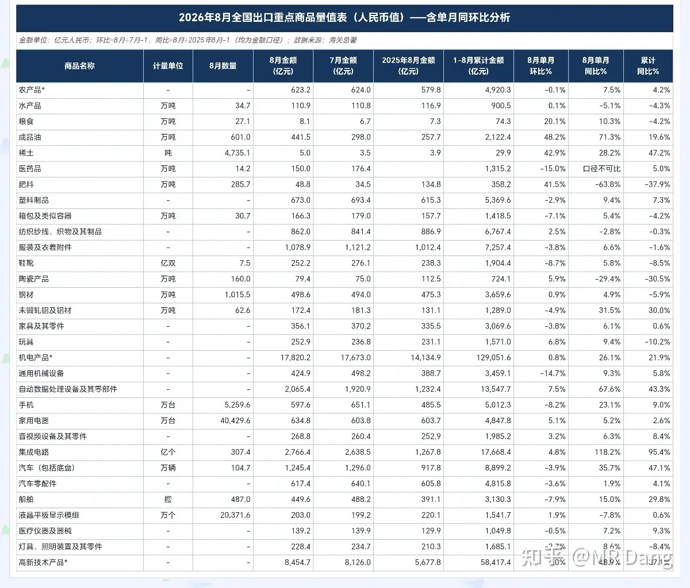
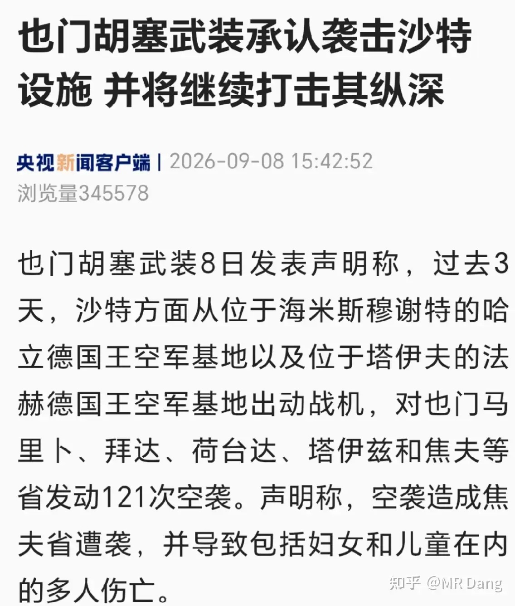
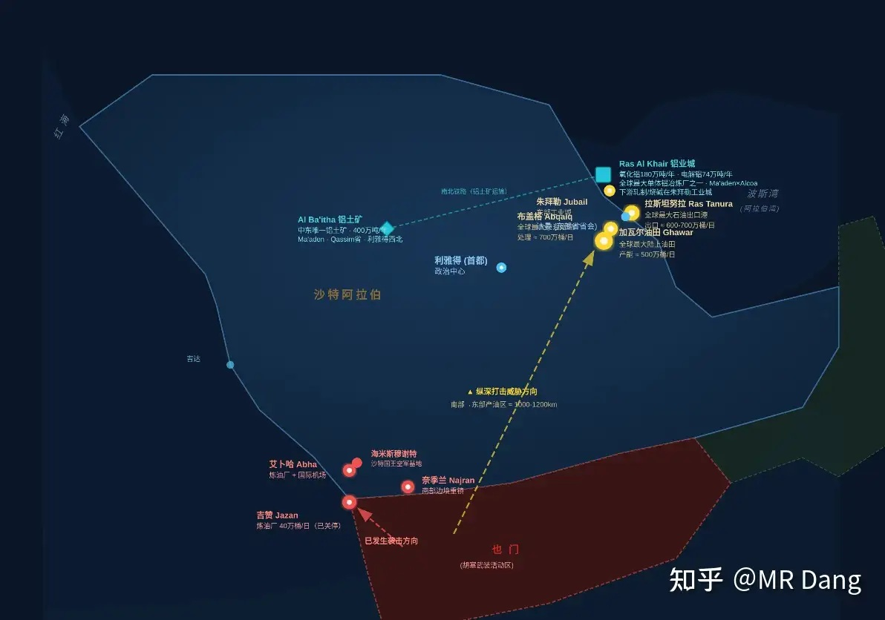
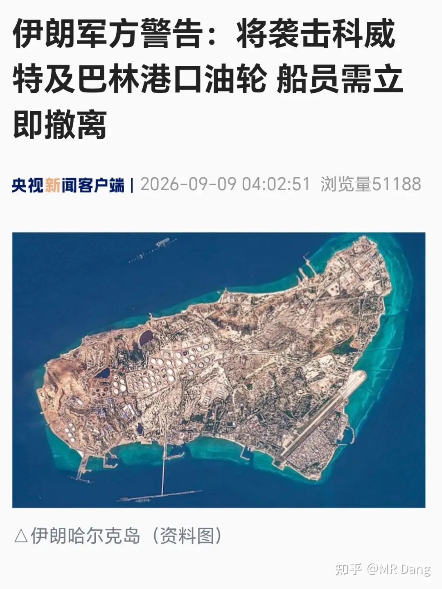
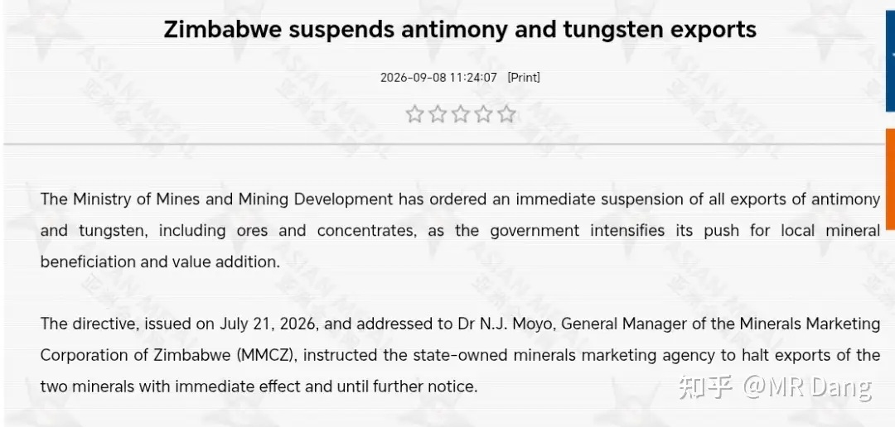
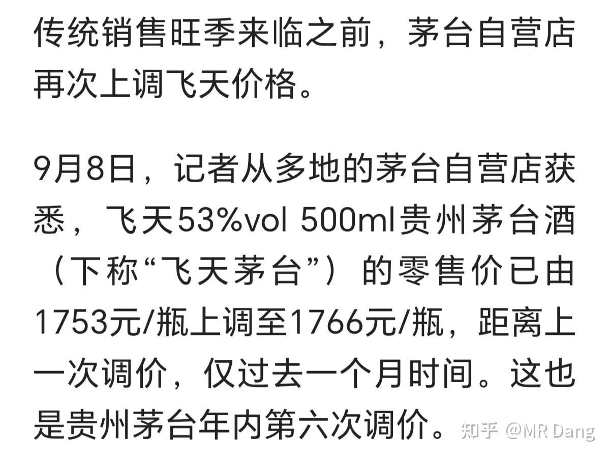
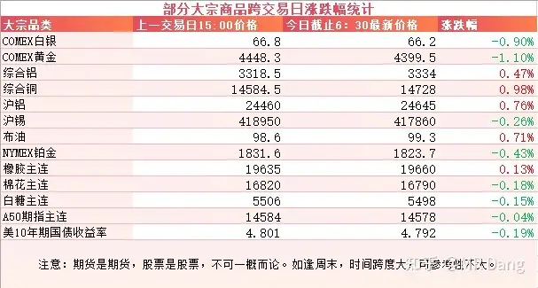
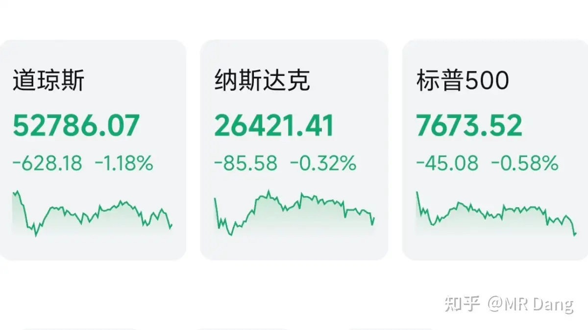

# 大家怎么看待2026年9月9日A股市场行情？

---

**发布时间**: 2026-09-09 07:31  |  **原文链接**: https://www.zhihu.com/question/2080575872470459396/answer/2080921156840862803  |  **点赞数**: 187 人赞同

**作者信息**: MR Dang | 证券从业资格证持证人

---

## 正文内容

先从进出口数据说起：

昨天有关部门发布了今年前8个月的进出口贸易数据。

整体上出口数据相当炸裂，8月出口同比增长18.6%，大幅高于前八月的14.6%。

分行业看，我加入了8月单月同比和单月环比的数据进行对比。

高新技术产品，自动数据处理设备，集成电路，成品油这四个是表现最好的产品。

前三个是Ai需求刺激的，证据就是同时公布的对美出口数据单月增长34%，顺差增长44%。

一个月就把前7个月的坑填上了，8月过后，对美年内出口额和贸易顺差从负增长变成了正增长。

对美出口增长异常的主要驱动因素还有一个是抢出口的原因，现在西大关税政策飘忽不定，趁着没落地之前，先抢出口一波也是可能的。

至于成品油，很多人看到会觉得数据不对，咱们不是石油进口国么，怎么还出口？

其实咱们进口的叫原油，供炼厂进行加工，最后的主要产品就是成品油，可以用来出口。

出口是有配额的，大概每年在五六千万吨左右。今年八月刚好碰到油价比较高，一个月就出口了600多万吨，量价齐升，所以数据比较好看。

从出口结构来看，无论是成品油还是集成电路，都有抢出口的驱动因素，所以持续性是存疑的。

---

### 美伊局势

昨天发生了一件对美伊局势影响不大，但是对资本市场有影响的事情，就是胡赛开始袭击沙特，并且威胁打击沙特的纵深。

这里有个示意图，靠近胡赛的炼油厂已经遇袭，加起来不到沙特产能5%，以情绪影响为主。

但是如果胡赛点出什么黑科技，越过中部区域，突破了拦截，打到了后面那些黄色的油田，产能受损，油价估计就按不住了，TACO都未必好使。

如果打到的是蓝色的铝企，那么铝价可能就会起飞。

伊朗这边也没闲着，有消息称伊朗哈尔克岛附近的油轮被西大攻击了，伊朗现在威胁要袭击科威特和巴林港口的油轮。

科威特产油量也是两百万桶级别的，如果供应受影响，油价和通胀压力又会增加。

油运股东看着互炸油轮估计睡觉都会笑醒。

---

### 津巴布韦禁止锑和钨出口

津巴布韦还是那一套资源民族主义的说辞，原矿出口受限，配套加工产能以后再出口。

短期来说，可能有点情绪影响。

长期来看，几乎没什么实质性影响，因为津巴布韦锑和钨的产能都不到全球的1%，属于可有可无的小角色。

---

### 茅子涨价

昨天有报道称53度飞天茅台自营零售价格从1753涨到了1766。

现在白酒需求不振，涨价可以保住毛利率，但是保不住营收，最后落在财报上，可能营收就会承压。

---

### 大宗商品

受消息面影响，原油走强，哆嗦一下就能上三位数了。

黄金白银铂金等贵金属回调，大约一个点左右。

铜铝走强，伦铜和美铜双双在盘中创历史新高。

沪铝还差6个多点才能创历史新高。

农产品高位震荡。

美债收益率本来上去了，最后又跌回来一些。

### 外围市场

美三大股指集体回调，道指领跌。

板块上科技比较强势，存储，半导体还有马斯克的两家公司表现都不错。

英特尔PC用CPU计划于10月再度涨价约10%，这一消息刺激了二级市场表现。

---

昨天个人组合净值回血近一个半点，银行近一个点，资源两个半，消费两个半，电网绿半个。

最近的一大热点是厄尔尼诺预期升温，农产品强势。

其实这个厄尔尼诺怎么说呢，不是现在才有的，早半年前大概四月份的时候，就有相关消息了，我也算是最早跟进的财经博主之一。

但是为什么到现在突然炒作起来了，其实也没什么必然的原因，市场就是这么不可捉摸。

至于哪些品种受影响比较大，其实已经来来回回分析过很多回了，每天的大宗商品跟踪里也一直是那几个品种。

如果有人可以在四月份发现这个消息，并且精准预测到九月份开始炒作，那很有可能是穿越者。

而作为普通的投资者，能做的只有在四月份发现以后，开始不停的跟踪，期间历经各种波折，磨难，怀疑人生，最后在半年后的某一天，发现半年前射出的箭矢正中靶心。

没什么先见之明，也没什么深谋远虑，有的只是日复一日的勤勉，不懈，努力。

资本市场从不缺聪明人，世界上最聪明的一批人刚好就在这里。

反观取得最辉煌成绩的那批投资者，除了聪明，还有很多特质是普通投资者所不具备的——比如异于常人的耐心。

但是农业这个行业历来没什么持续性，这种短期内大幅上涨后，积累的风险也会增加，这个时候应该考虑一下值搏率了。

---

### 一个喜欢保护韭菜的博主，希望大家少少踩坑，多多赚钱！！！

> [!comment]- 点击展开评论
>
> | 用户 | 时间 | 内容 |
> | :--- | :--- | :--- |
> | 今晚回家吃饭 |  | 党大，能分析下西大制造业回流的速度吗？现在很少看到这块的分析，可能不是我们想的赢赢的剧本 |
> | &nbsp;&nbsp;&nbsp;&nbsp;night |  | 我也想看！或者有什么博主有分析这块吗 |
> | &nbsp;&nbsp;&nbsp;&nbsp;九雨 |  | 记得是早就黄了 |
> | &nbsp;&nbsp;&nbsp;&nbsp;momo7752 |  | 虽然没达建国预期 但确实在慢慢回流 |
> | &nbsp;&nbsp;&nbsp;&nbsp;大森林 |  | 拉爆全球通胀，美资入股，自然而然就回流了 |
> | &nbsp;&nbsp;&nbsp;&nbsp;实名用户 |  | 制造业的竞争力要么靠高科技，这个美国已经到顶了，而且相关制造业本来就强于我国，要么靠低成本，这个美国那平均工资，无解啊，除非廉价机器人大量替代人工，但是廉价机器人方面美国也没啥优势，所以只能赢赢了。 |
> | 对对队 |  | 看到党大这么说释然了哈，我也是四月看您发开始跟踪，当时我记得还说炒民生粮食的容易进去，跟踪几个月确实没人炒，这9月突然起来了[捂脸] |
> | &nbsp;&nbsp;&nbsp;&nbsp;MR Dang |  | [感谢] |
> | 等 远航的你 |  | 我就是4月的埋伏亚盛，然后中了埋伏一直到现在一路补仓吃到了4连板。好像也不亏 |
> | &nbsp;&nbsp;&nbsp;&nbsp;MR Dang |  | [感谢] |
> | 零度 |  | [爱][爱] |
> | 没什么不同 |  | [感谢] |
> | 大森林 |  | [感谢][感谢] |
> | 从岭南到长安 |  | [感谢][感谢][感谢] |
> | 鲲鹏 |  | [感谢] |
> | &nbsp;&nbsp;&nbsp;&nbsp;MR Dang |  | [感谢] |
> | 知乎用户wzAmg8 |  | 证券是怎么回事[捂脸] |

---

*本文件从 MR Dang 知乎页面转载*

**作者**: MR Dang  
**链接**: https://www.zhihu.com/question/2080575872470459396/answer/2080921156840862803  
**来源**: 知乎

*著作权归作者所有。商业转载请联系作者获得授权，非商业转载请注明出处。*

---

## 相关阅读

- [[20260908-如何看待2026年9月8日A股市场行情？|上一篇：如何看待2026年9月8日A股市场行情？]]
- [[20260910-大家如何看待2026年9月10日A股市场行情？|下一篇：大家如何看待2026年9月10日A股市场行情？]]
