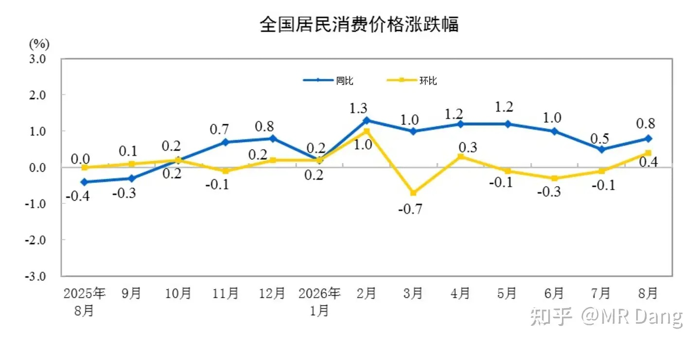
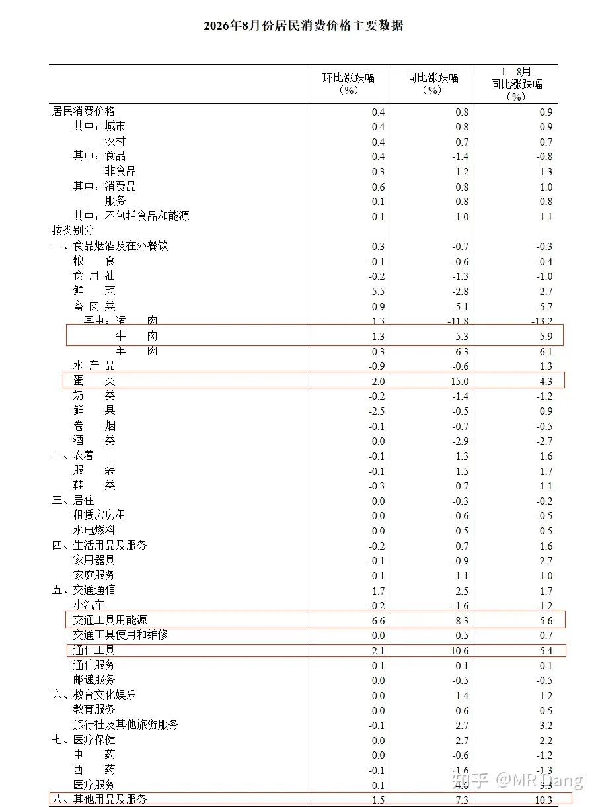
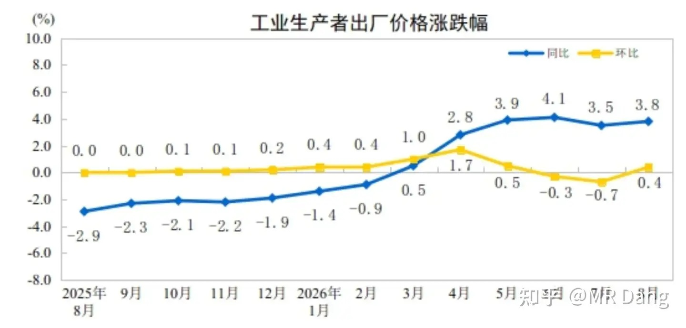
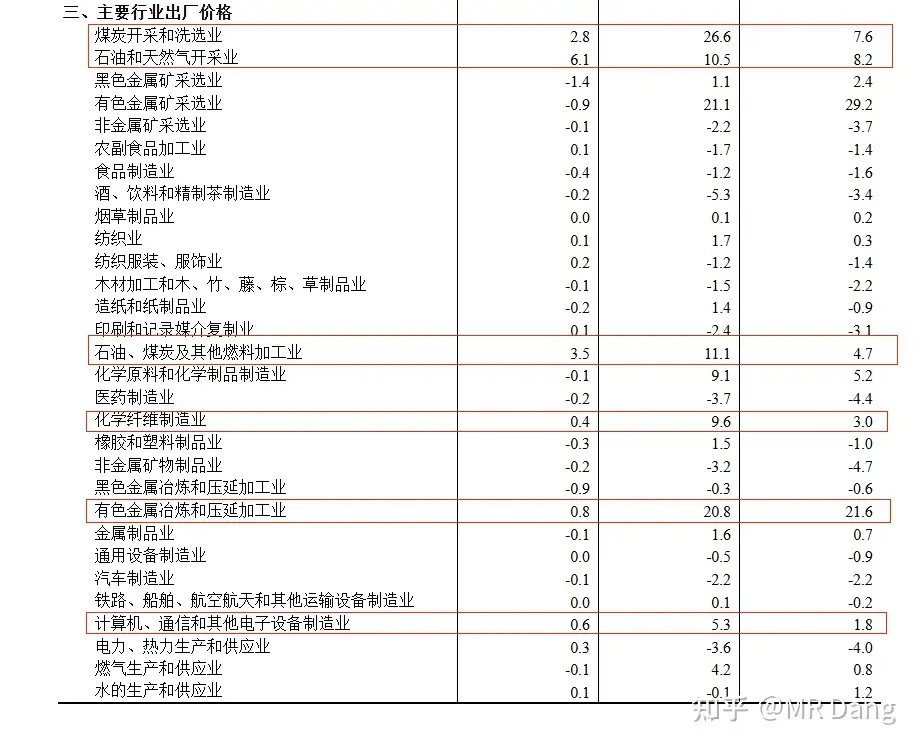
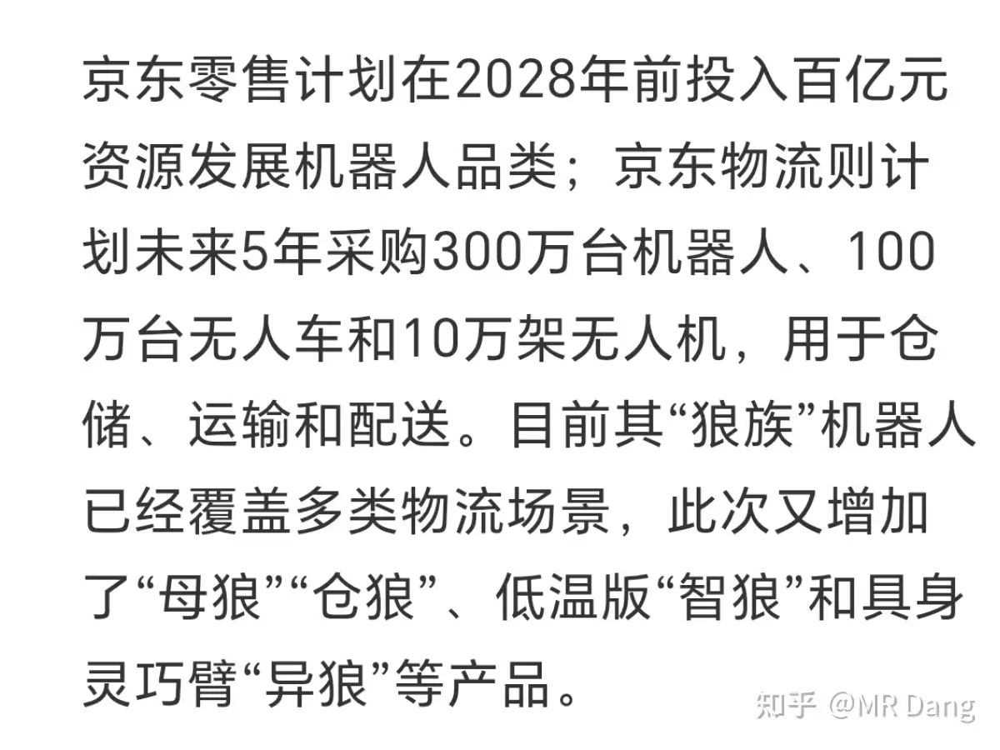
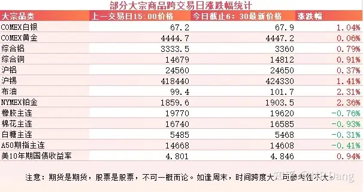
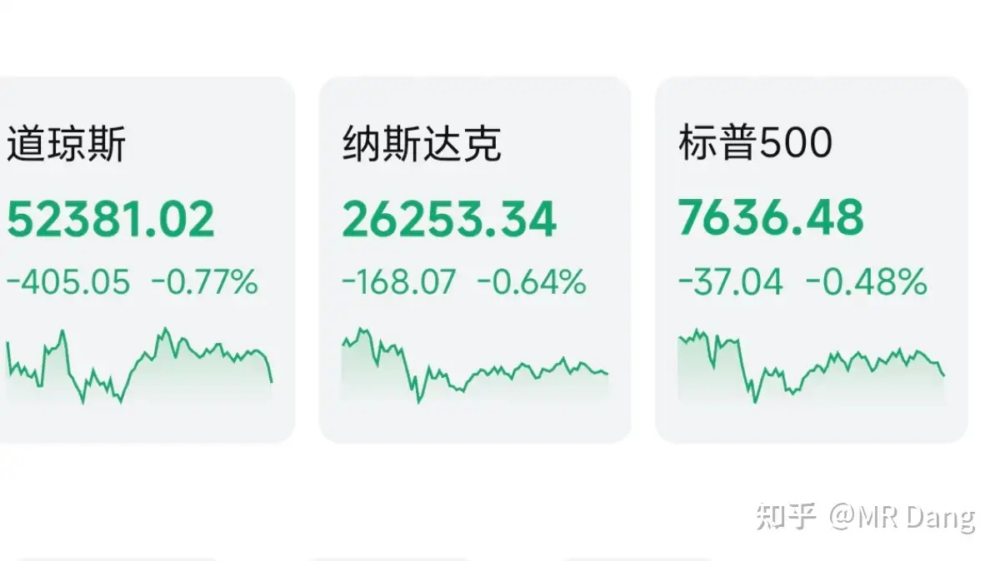

# 大家如何看待2026年9月10日A股市场行情？

---

**发布时间**: 2026-09-10 07:30  |  **原文链接**: https://www.zhihu.com/question/2080737046264541355/answer/2081283291710239007  |  **点赞数**: 163 人赞同

**作者信息**: MR Dang | 证券从业资格证持证人

---

## 正文内容

### 还是统计局数据开始

昨天统计局发布了8月的CPI数据，同比增长0.8%，环比增长0.4%。

还不错的数据，特别是环比负增长的态势得到了遏制，看着有点温和复苏的样子。

具体到商品的话，牛肉，蛋类，能源，通信工具（手机之类的），其他用品及服务，属于同环比数据都不错的几个品类。

这里的“其他用品及服务”已经说过很多次了，主要影响因素就是黄金珠宝等首饰。

从结构来看，这些偏向于成本推动引起的上涨，而不是需求增加引起的。

PPI数据也不错，同比增长3.8%，高于前值，环比增长0.4%，扭转了颓势。

分行业看，同环比数据都不错的有煤炭，石油，化学纤维制造业，有色加工，和电子设备制造业。

和平时获取的数据基本都是可以交叉印证的，没有太超预期的数据。

无论是CPI还是PPI，看起来都更偏向于输入型的，需求端感觉复苏的还不明显。

---

### Deepseek

知名外媒报道Deepseek准备在科创板上市，已经接洽某头部券商。

4月的时候估值100亿绿票子，目前最新一轮融资估值5000亿红票子。

这还只是一级市场的估值。

如果和港股的两个大模型进行对比，考虑到港股是全球估值最低的市场，而科创板是几乎全球估值的天花板市场。

再考虑到公司本身质地的区别，估计到二级市场一万亿是打不住的，可能会往两万亿去。

考虑到创始人的股份占比，上市的时候梁圣很可能把首富的宝座给抢过来，成就新的造富神话。

希望大家打新都能薅到羊毛吧。

哦对了，Deepseek最近还会发布一个V4.1 Flash模型，按照惯例，可能上市前后还会放个大招，给Ai圈一点小小的震撼。

---

### 京东

昨天京东开了个全球科技探索者大会，会上宣布未来5年采购300万台机器人，100万台无人车和10万架无人机。

很多机器人股东看到300万这个数字，肯定兴奋的要去查供应商。

我替大家查了，是自研的狼系列机器人，有什么天狼地狼母狼等9款狼，不是人形机器人。

零部件供应商倒是有几家上市企业，至于能影响多少业绩，没有公开资料，也不好算。

机器人行业最近还有个小道消息是以后未来的上市会收紧，提高标准，可能是最近上的某个公司跌的太多了，舆论压力比较大。

---

### 苹果

苹果在今天凌晨开了新品发布会，带来了几样新产品。

关注度最高的是折叠屏手机，命名为iPhone Duo。

很科学的名字，多了一个屏幕，所以就叫Duo，简单粗暴。

看了真机的上手视频，折痕似乎不明显，翻过去的时候屏幕有一种透明的感觉，质感不错。

国行起售价15999元，国外是1999绿票子。

然后就是常规升级的iPhone18 pro和max，一个定价9999，另一个定价10999，比上一代涨价1000块。

新发布的两个手表，一个2999，另一个6499。

新的耳机999元。

整体看下来没什么超预期的地方，果子也顶不住供应链的压力涨价了，资本市场对此反响平平，没什么动静，都对销量没什么太高的预期。

---

### 大宗商品

原油来到了三位数时代。

有色整体还不错，扛着三位数的原油都多多少少有点涨幅。

工业金属表现强势，伦铜连续第三天创历史新高，锡和铝也都有少许涨幅。

农产品走弱，高位震荡，A50期指承压。

美债收益率创近三年以来新高。

看着头皮发麻啊，现在都在抛弃金融资产，拥抱实物资产。

### 外围市场

美三大股指集体回调，道指领跌。

板块上只有存储，有色，油气还算不错，其他都是绿的。

---

昨天个人组合净值回血大半个点，银行红大半个，资源红两个点，消费微绿，电网红近两个点。

还不错的一个交易日，红多绿少，全面回血。

今天是教师节，希望教师读者可以节日愉快，不被资本市场添堵。。。。因为今天同时还是周四。

---

### 一个喜欢保护韭菜的博主，希望大家少少踩坑，多多赚钱！！！

> [!comment]- 点击展开评论
>
> | 用户 | 时间 | 内容 |
> | :--- | :--- | :--- |
> | 言不可弥 |  | 虽然已经说了无数遍但还是再强调一次，机器人行业无限可能，但是人形机器人行业无可能，人形对于机器人是负收益。 |
> | &nbsp;&nbsp;&nbsp;&nbsp;MR Dang |  | [感谢] |
> | &nbsp;&nbsp;&nbsp;&nbsp;Eleven |  | 是的，除了和人陪伴型的机器人，其他都没有必要做成人形，应该怎么实用怎么来 |
> | &nbsp;&nbsp;&nbsp;&nbsp;考拉的糖果 |  | 所以格外keyi强调人形和拟人动作的基本都是吹 |
> | zhiegVLUl |  | 老师，早啊。[感谢] 你说的京东机器人是具身智能相关的话，我就知道相关情况。[赞同] |
> | &nbsp;&nbsp;&nbsp;&nbsp;MR Dang |  | [感谢] |
> | 红.德仔 |  | [发呆] |
> | &nbsp;&nbsp;&nbsp;&nbsp;MR Dang |  | [感谢] |
> | Solitude SisyphE |  | [感谢] |
> | &nbsp;&nbsp;&nbsp;&nbsp;MR Dang |  | [感谢] |
> | 冷凝子 |  | [感谢] |
> | &nbsp;&nbsp;&nbsp;&nbsp;MR Dang |  | [感谢] |
> | 今晚回家吃饭 |  | 苹果这个手机应该叫Da，就是大 |
> | &nbsp;&nbsp;&nbsp;&nbsp;MR Dang |  | [感谢] |
> | 酒鸠 |  | [感谢] |
> | &nbsp;&nbsp;&nbsp;&nbsp;MR Dang |  | [感谢] |
> | 无为 |  | [感谢]早 |
> | &nbsp;&nbsp;&nbsp;&nbsp;MR Dang |  | [感谢] |
> | 18一枝花 |  | [感谢] |
> | &nbsp;&nbsp;&nbsp;&nbsp;MR Dang |  | [感谢] |
> | 晨雾 |  | [感谢][感谢][感谢] |
> | &nbsp;&nbsp;&nbsp;&nbsp;MR Dang |  | [感谢] |

---

*本文件从 MR Dang 知乎页面转载*

**作者**: MR Dang  
**链接**: https://www.zhihu.com/question/2080737046264541355/answer/2081283291710239007  
**来源**: 知乎

*著作权归作者所有。商业转载请联系作者获得授权，非商业转载请注明出处。*

---

## 相关阅读

- [[20260909-大家怎么看待2026年9月9日A股市场行情？|上一篇：大家怎么看待2026年9月9日A股市场行情？]]
- [[20260911-如何看待2026年9月11日A股行情走势？|下一篇：如何看待2026年9月11日A股行情走势？]]
