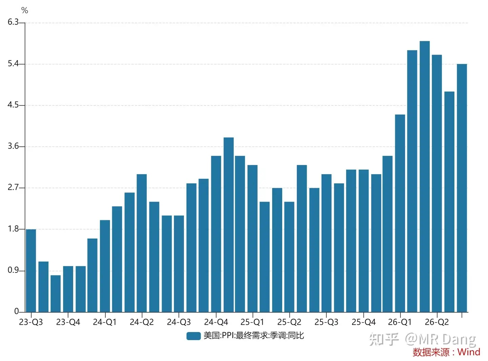
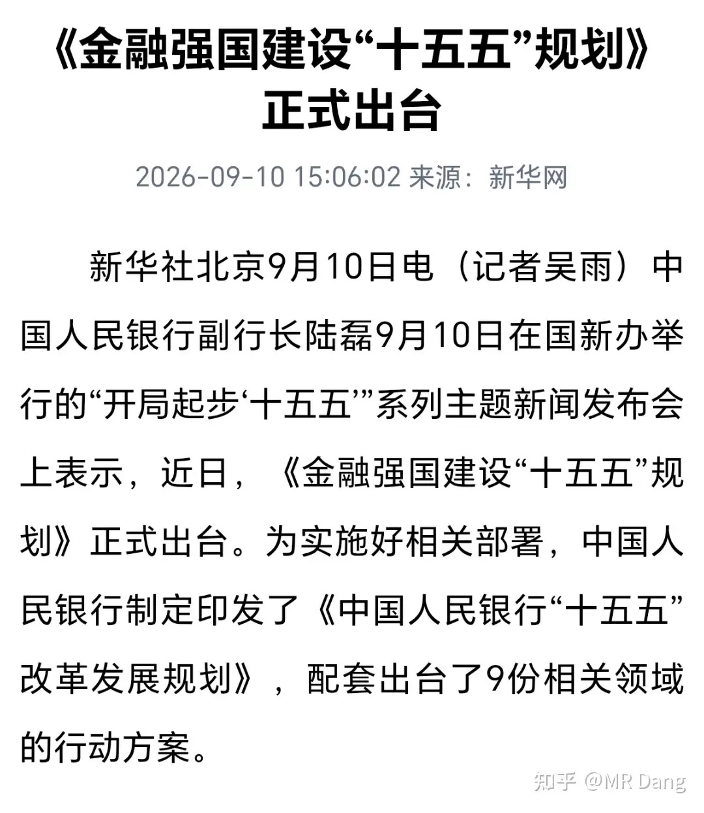
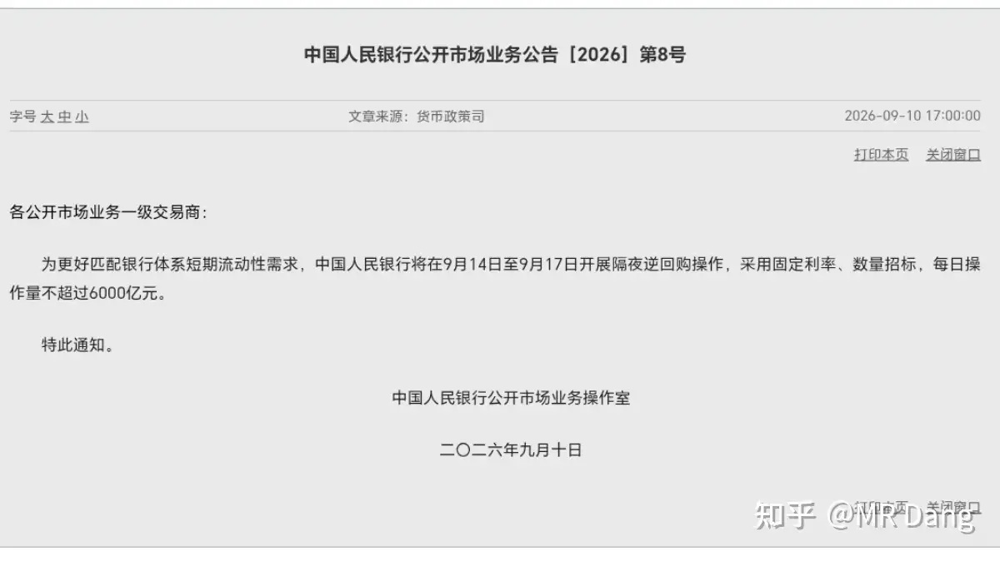
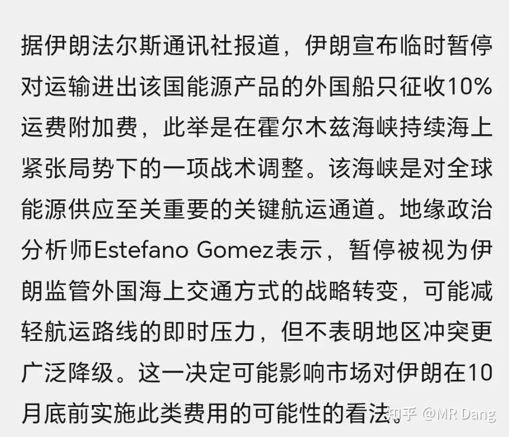
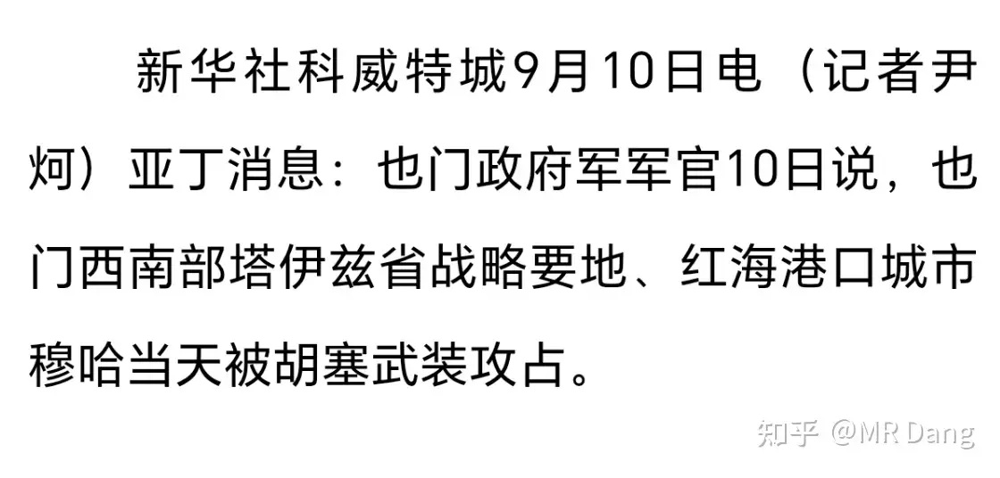
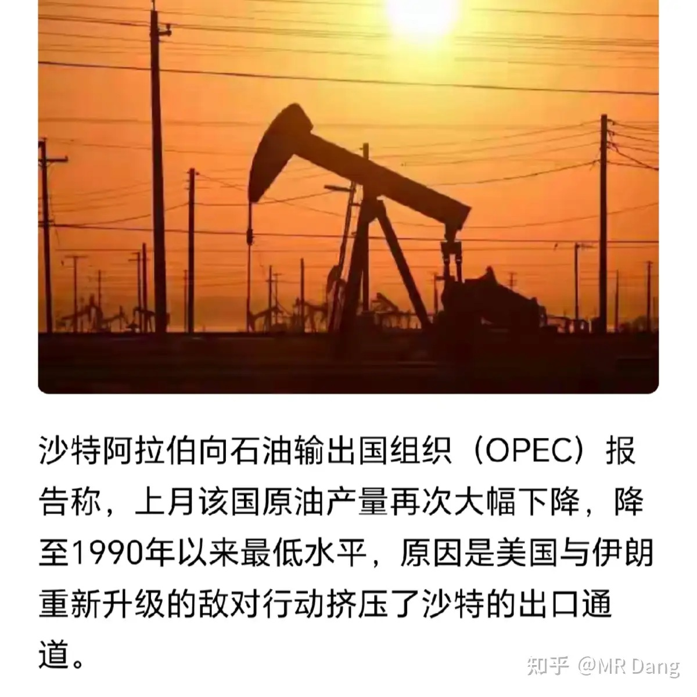
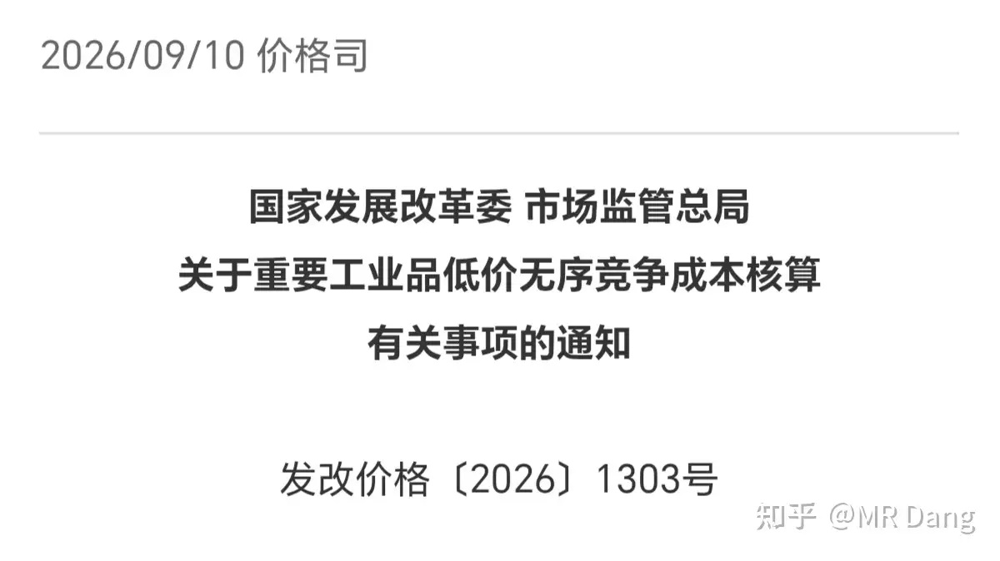
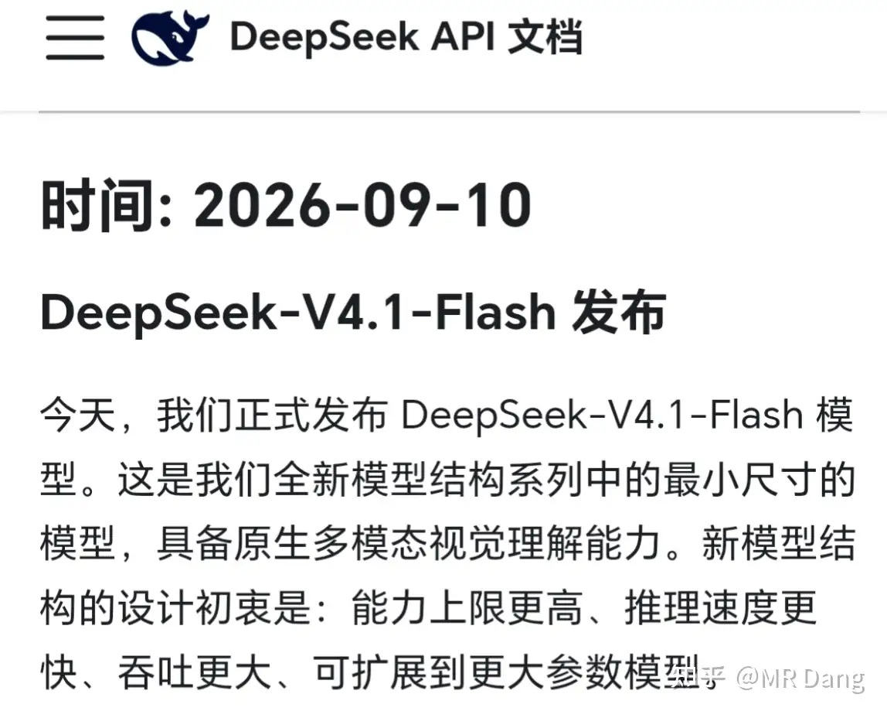
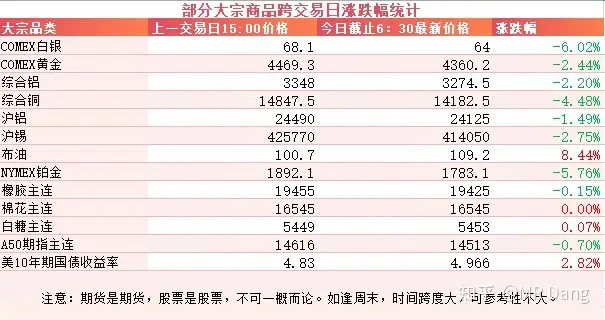
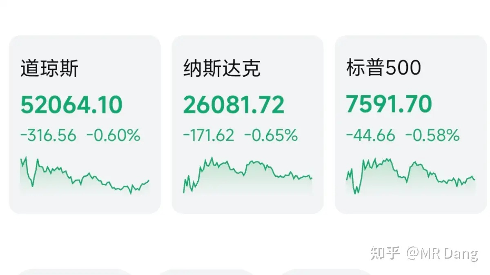

# 如何看待2026年9月11日A股行情走势？

---

**发布时间**: 2026-09-11 07:30  |  **原文链接**: https://www.zhihu.com/question/2081286565058422564/answer/2081645667919967317  |  **点赞数**: 191 人赞同

**作者信息**: MR Dang | 证券从业资格证持证人

---

## 正文内容

### 今天最大的新闻就是西大发布了PPI数据

5.4%的数据高于预期的5.3%，也高于前值4.7%。

PPI是CPI的先行指标，数据发布后，美债收益率继续上行。

目前定价9月加息概率74%，10月加息完全定价。

---

### 有关部门昨天收盘后开了个金融强国十五五的会议

目前的情况是已经宣布正式出台了，但是具体的细则还没发布。

发布会上有很多重要的信息和新提法，我个人的话，比较关注的央行谈及货币政策目标时表示：“逐步淡化数量型中介目标，更加注重发挥利率调控的作用。”

所谓的数量型货币政策目标，就是指M2之类的，而利率调控一般指的是7天逆回购操作利率。

现在的情况，如果要利率调控的话，个人感觉可能会出降准降息的组合拳。

原语境中表达的是调控框架的改变，而非一次两次的调整，这个降息是我自己脑补出来的，非本来含义，望周知。

另外我个人对这个金融强国已经期盼已久了，可以说是望眼欲穿。

咱们的经济在蓝星上已经是坐二望一了，但是资本市场大而不强。

在投资者中间，如果说自己是投资A股的，往往会沦为鄙视链的倒数第二名，被美股投资者嘲讽。

为啥不是倒数第一？

大A隔壁的市场还有话说。。。

---

### 央行

9月14到9月17隔夜逆回购，每天不超过6000亿。

很多人又开始算投放多少流动性了。

其实看到隔夜两个字，基本可以不用管，那是货币市场的事情，和资本市场没什么太大关系。

---

### 美伊局势

伊朗宣布临时暂停征收10%的运费附加费。

嗯。。。。很难评，伊朗现在在我心里的信誉度和懂王是坐一桌的，反复无常，前言不搭后语。

还有个挺重要的信息是穆哈港在昨天被胡赛攻占，沙特系武装大溃败。

一说穆哈港，少有人清楚。

但是我换个名字，摩卡港，知道的人就多了，没错，摩卡咖啡那个摩卡，正是来自于此。

这个港口自古以来就是交通枢纽，距离曼德海峡也就是几十公里，胡赛占领以后对路过的油轮会形成很大的威胁。

与之相应的是沙特的原油产量大幅下降，从800多万桶降低到了623万桶，创1990年以来最低水平。

胡赛甚至放出话来要进行地面行动，可能会更加加剧这一态势。

---

### 反内卷

有关部门发了个《关于重要工业品低价无序竞争成本核算有关事项的通知》。

其实看关键词，工业品，低价，无序竞争，好几个行业就自动出现在我脑海里了，比如光伏，汽车，钢铁，甚至水泥，玻璃。

此前一直说反内卷，也提出了平均价格的概念，但是一直没什么统一量化的标准，所以这个成本价格都是各说各话，

现在把这个敲定，有利于以后执行，利好这些行业的龙头企业，集中度可能提升，利空打价格战的搅局者。

---

### Deepseek 发布V4.1Flash

根据官方消息，V4.1 Flash全面超越了V4 pro，用更低的成本，取得了更快的效果。

在Agent执行、编程、数学等实用场景已追平甚至超越GPT/Claude顶级模型，仅在最硬核的科学推理上仍有差距。

同时KV Cache压缩至1/4，部署成本大幅下降。

之所以能取得这种突破，是采用了全新的架构，在输入理解阶段和输出生成阶段不再采用对称计算路径。

理解用8B，生成用16B，在保证生成质量的同时大幅降低推理成本。

---

### 大宗商品

受PPI和美伊局势的影响，有色昨晚重挫，白银铂金回调6个点左右。

黄金回调两个多点，铜回调4个多点，铝回调一个半点。

原油大幅上升，才站稳100美元大关，就剑指110美元了。

农产品高位震荡。

美十年期国债收益率大幅上涨，逼近5%。

A50期指看着不太行，今日承压。

### 外围市场

美三大股指继续回调，纳指领跌。

板块上消费电子比较强，果子表现可以，银行，医疗，油气类也相对比较强，科技和有色走弱。

---

昨天个人组合纳米绿，银行红一个多点，资源绿两个，消费绿大半个，电网绿近两个。

比指数能强一些，但强的十分有限。

整个市场4500多家回调，900多家上涨，市场中位数是跌了一个多点。

从涨跌数量上来看，市场情绪比较低落。

其实低落才是正常反应，美债收益率这么高，谁看了都会觉得凉飕飕的。

至于今天的话，消息面上已经是风雨欲来了，不知道资本市场能不能顶住压力，展现一下大A的韧性。

少亏当赢吧。

---

### 一个喜欢保护韭菜的博主，希望大家少少踩坑，多多赚钱！！！

> [!comment]- 点击展开评论
>
> | 用户 | 时间 | 内容 |
> | :--- | :--- | :--- |
> | 顾越 |  | 今天很细了[感谢]，股灾日了 |
> | &nbsp;&nbsp;&nbsp;&nbsp;MR Dang |  | [感谢] |
> | 潭轩 |  | 金融强国对于货币的控制就不能强。不知道是不是乐意如此。 |
> | &nbsp;&nbsp;&nbsp;&nbsp;MR Dang |  | [感谢] |
> | 吃我一记大拂尘 |  | 准备俯冲[doge] |
> | &nbsp;&nbsp;&nbsp;&nbsp;MR Dang |  | [感谢] |
> | 卡夫卡卡 |  | 利好煤化工？昨天加仓了。[感谢] |
> | &nbsp;&nbsp;&nbsp;&nbsp;MR Dang |  | [感谢] |
> | &nbsp;&nbsp;&nbsp;&nbsp;爱美的丫 |  | 为啥利好煤化工？ |
> | &nbsp;&nbsp;&nbsp;&nbsp;浪里小白马 |  | 煤也涨价，还不如直接买煤炭 |
> | 南江水暖 |  | 今天很细了[感谢]，股灾日了[惊喜] |
> | &nbsp;&nbsp;&nbsp;&nbsp;MR Dang |  | [感谢] |
> | 我是一颗桃子吖 |  | 忙死了，我讨厌出差，我要回家我要混我要摸鱼qwq |
> | 何人不起故园情 |  | 调仓位了？ |
> | &nbsp;&nbsp;&nbsp;&nbsp;MR Dang |  | [感谢] |
> | 在人间 |  | 前几天买了小云，连跌几天了。 |
> | &nbsp;&nbsp;&nbsp;&nbsp;MR Dang |  | [感谢] |
> | 北国神风 |  | 抱头蹲好[捂脸] |
> | &nbsp;&nbsp;&nbsp;&nbsp;MR Dang |  | [感谢] |
> | 簌簌 |  | 有本事加息就加吧，一天天的，吊人胃口 |
> | &nbsp;&nbsp;&nbsp;&nbsp;MR Dang |  | [感谢] |

---

*本文件从 MR Dang 知乎页面转载*

**作者**: MR Dang  
**链接**: https://www.zhihu.com/question/2081286565058422564/answer/2081645667919967317  
**来源**: 知乎

*著作权归作者所有。商业转载请联系作者获得授权，非商业转载请注明出处。*

---

## 相关阅读

- [[20260910-大家如何看待2026年9月10日A股市场行情？|上一篇：大家如何看待2026年9月10日A股市场行情？]]
- [[20260914-大家如何看待2026年9月14日A股市场行情？|下一篇：大家如何看待2026年9月14日A股市场行情？]]
