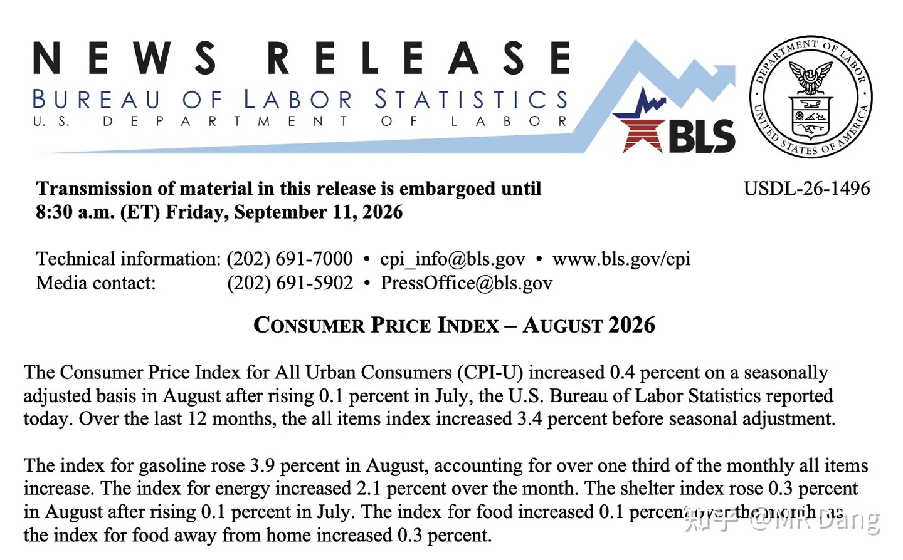
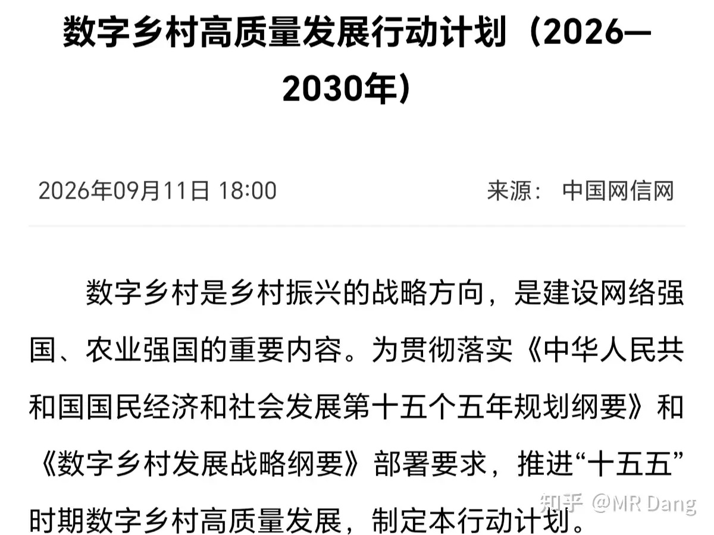
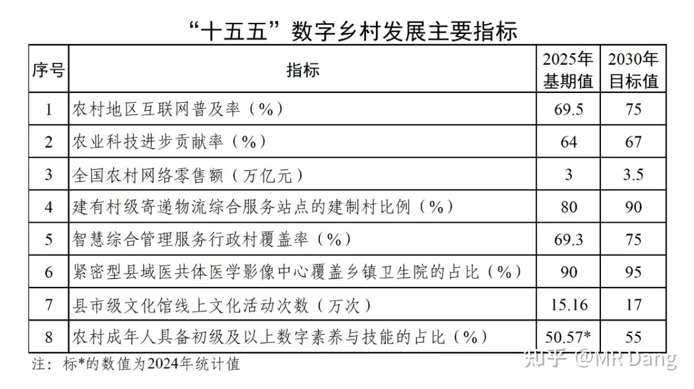
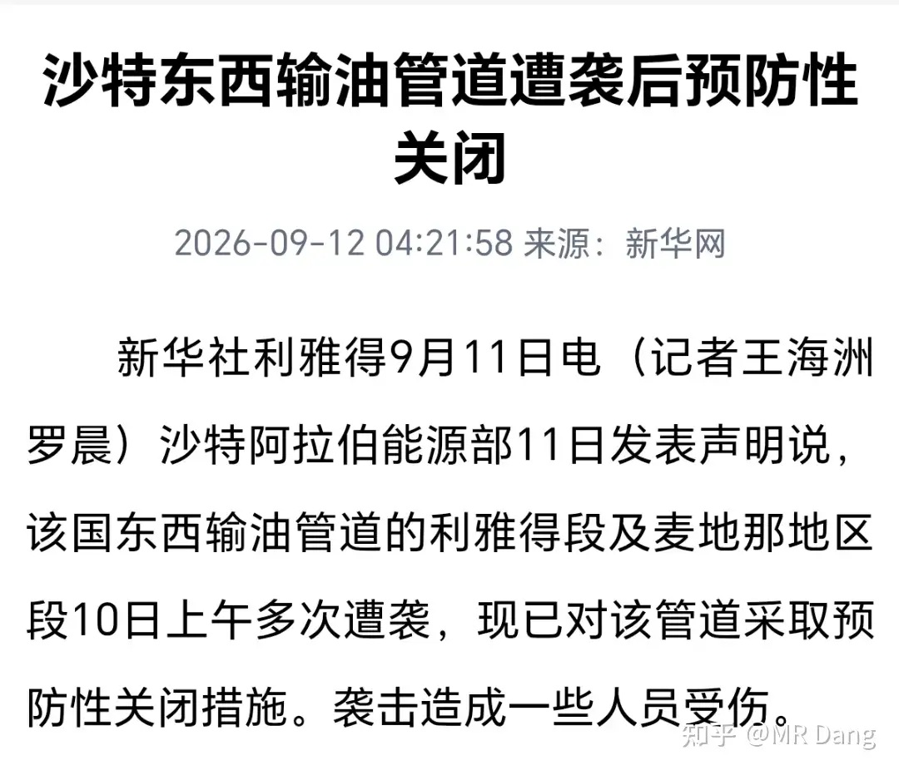
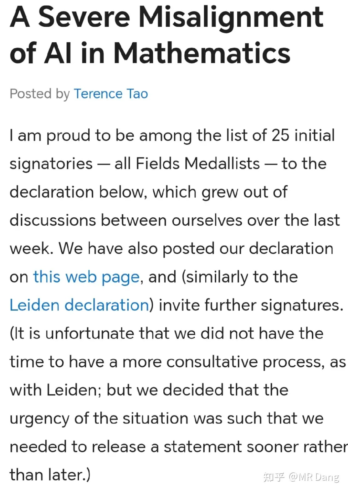
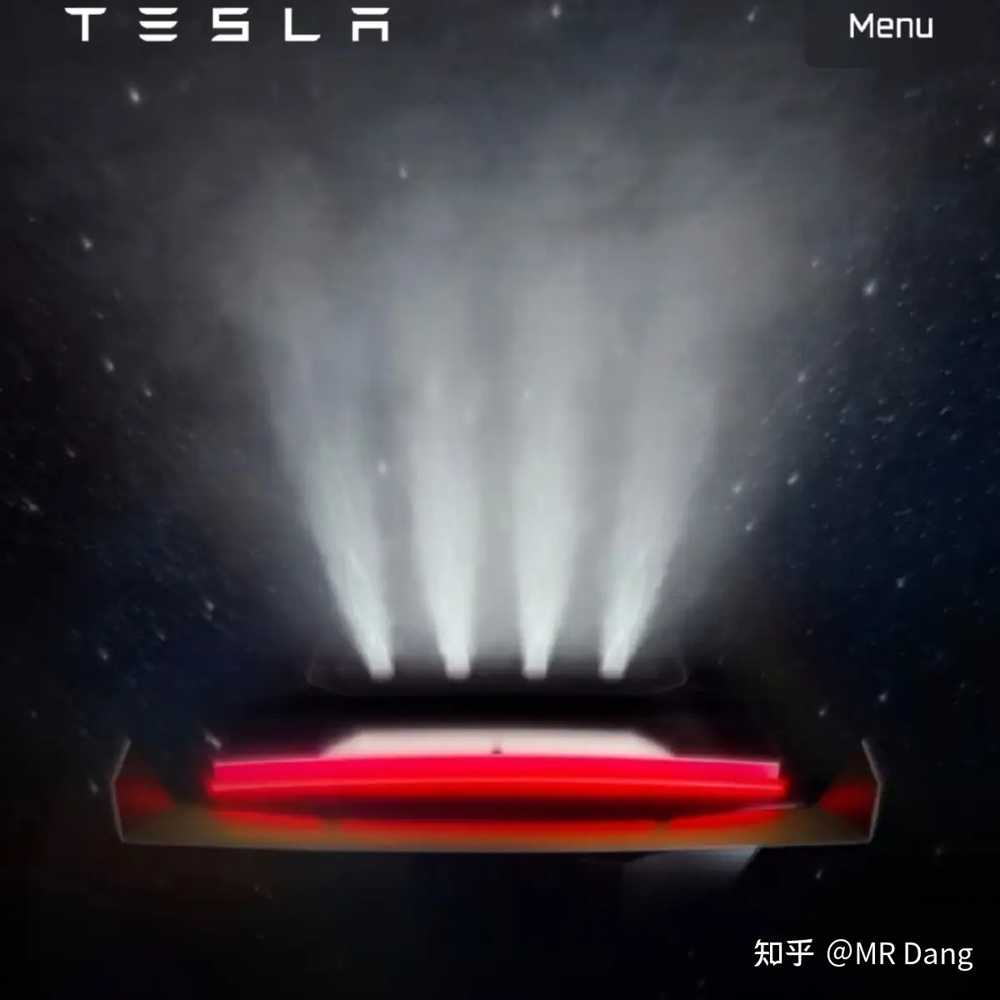
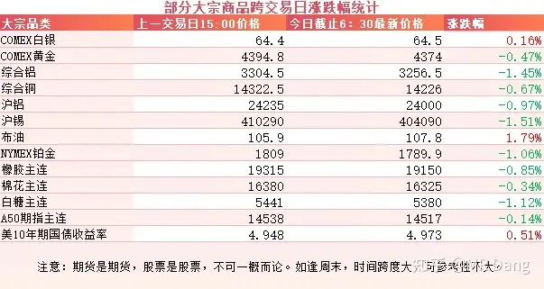
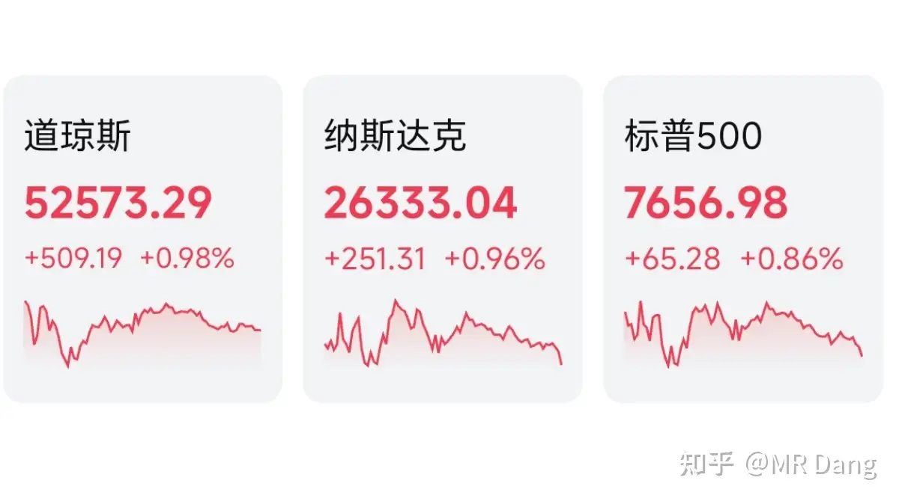

# 大家如何看待2026年9月14日A股市场行情？

---

**发布时间**: 2026-09-14 07:30  |  **原文链接**: https://www.zhihu.com/question/2081063139915912078/answer/2082732876194395831  |  **点赞数**: 163 人赞同

**作者信息**: MR Dang | 证券从业资格证持证人

---

## 正文内容

### 周末最大的新闻莫过于西大的CPI数据

整体数据上符合预期，3.4%的同比涨幅以及0.4%的环比涨幅与市场预期完全一致。

唯一比预期数据还高的是核心CPI的环比涨幅，预期0.2%，实际0.3%，略高于预期。这里的主要推手是服务推动，而非商品价格上涨。

报告公布后，利率市场对美联储9月加息的押注进一步上升，加息25个基点的概率由数据公布前的约70%一度升至接近90%。

基本上市场已经默认大加息时代已经开始了，岛国，欧洲都在加息，西大为了维持利差，也有加息的动机。

---

### 数字乡村

有关部门发布了《数字乡村高质量发展行动计划》。

文件中列出了一些领域的主要发展指标。

其中最出乎我意料的一点是首次在文件中提到了“数字游民”的概念，任务21中写到：“培育乡村数字人才，吸引数字游民等新群体投身乡村创业就业。”

除此之外，还有数据标注行业的下沉，扩展农民就业新渠道，这个对数据标注行业算小利好，可以降低人力成本。

还有低空经济赋能农业这方面，也比较超预期，比如农业植保无人机，配送无人机。

低空经济在大A属于比较坑的板块之一了，每次都热不起来。

我个人还是觉得安全隐患制约了发展，但是放在农村地区的话，地广人稀，感觉发展潜力相对会更大。

---

### 沙特输油管道遇袭后关闭

根据权威媒体报道，沙特的东西输油管道多必遇袭后进行了预防性关闭。

后续报道证实了袭击是来自伊拉克境内的无人机，袭击者目前身份不明，被袭击的设施主要是泵站，卫星图显示有大面积过火。

该东西输油管道运输能力700万桶，是沙特绕过霍尔木兹海峡的主要渠道。

---

### Ai圈

这个周末的Ai圈十分热闹，一边是包括陶哲轩在内的25名菲尔兹奖数学家联名信抵制Ai，另一边是Ai在数学难题上势如破竹。

今年7月份多个Ai在IMO中已经可以获得满分。

8月1日OpenAI Astra一次性公布10项数学成果，成本约2000美元。

但这次两项核心成果的关键推导来自已有研究，未恰当引用，引发了外界对其学术不端的指控，是联名信的导火索。

9月8日OpenAI又宣布AI生成 N-S方程存在性与光滑性问题的解决方案，这是七大千禧年大奖难题之一。

而就在9月11日，UCLA两名高中生在Ai重度辅助下，解决菲尔兹奖得主许埈珥都未攻克的洛伦兹相关问题。

可以看出来数学家就像当年的围棋棋手一样，面对Ai也感到了一丝迷茫。

除了这些，Anthropic、OpenAI、xAI 三家AI公司的CEO都公开表示要放缓Ai的步伐，因为Ai迭代实在太快了。

克劳德还污蔑东大的模型对其进行蒸馏。

在克劳德的口中，某些k模型在处理难度问题时，碰到自己不会的，就直接把数据和请求丢给克劳德，甚至还包括一些敏感数据。

从商业逻辑上来说，克劳德的模型比k贵多了。

这就像你点了个国服陪玩，发现打不过对面，直接在不告诉你的情况下给换成了职业选手，格局拉满了。

这个时间点比较敏感，刚好是k要上市的关键窗口期，可能会影响一些进度。

另外咱们这边有个《智能体时代 AI 基础设施发展研究报告（2026）》，其中最出圈的是预计到2030年为止，Token年复合增长率接近12倍。

我以为看错了，然后又看了一遍，确实是预计年复合增长率，不是总的。

这种属于一家之言，看看就好。

---

### 马斯克

老马在周末宣布了新车型roadster二代将会在10月1日发布。

目前已知的消息是电池容量达到了惊人的二百度电，部分车型可选配space x的火箭推进器，类似飞车游戏里的氮气加速器一样。

百公里加速最快可能一到两秒左右，普通人估计承受不住这样的G值，一脚油门可能就晕过去了。

除此以外，也有可能做到短暂的跳跃或者是悬停这样的花活。

如果是真的，那确实太酷了。

---

### 大宗商品

在上个交易日盘后，有色整体上大约有一个点左右的调整幅度。

原油的消息比较多，目前整体上是涨了一两个点左右。

农产品整体回调，也是一个点左右。

美长债收益率像高血压一样，距离5%又进一步。

A50期指看着也一般。

### 外围市场

上个交易日美三大股指集体上涨，道指领涨。

板块上除了油气，所有行业都在普涨。

---

上个交易日个人组合净值回撤一个半点还要多，银行绿一个多点，资源绿四个，消费绿一个半，电网绿小半个。

市场上近4900家公司冒绿光，大概600多家是红的，市场中位数大概是跌了两个多点。

所以大多数投资者是肯定没跑过指数的，不必气馁，不是你一个人的问题。

---

### 本周前瞻

1，今天伊朗和阿曼本来计划有个会议，但是目前的消息是会议延迟了。

2，本周二公布咱们这边的社零数据和工业增加值。

3，本周四是美联储的议息会议，目前市场基本上已经定价了加息的可能性，并且发明了一个“鸽派加息”的词语来进行自我安慰。

---

### 一个喜欢保护韭菜的博主，希望大家少少踩坑，多多赚钱！！！

> [!comment]- 点击展开评论
>
> | 用户 | 时间 | 内容 |
> | :--- | :--- | :--- |
> | 北国神风 |  | 感觉市场已经对加息进行反应了，大概率会加息25个基点 |
> | &nbsp;&nbsp;&nbsp;&nbsp;MR Dang |  | [感谢] |
> | 簌簌 |  | 日子不好过，尤其本周还只休息一天[大哭]早安[感谢] |
> | &nbsp;&nbsp;&nbsp;&nbsp;MR Dang |  | [感谢] |
> | 我是一颗桃子吖 |  | 早[感谢] |
> | &nbsp;&nbsp;&nbsp;&nbsp;MR Dang |  | [感谢]早啊 |
> | 玉书 |  | 今天估计又悬了 |
> | &nbsp;&nbsp;&nbsp;&nbsp;MR Dang |  | [感谢] |
> | 乐妈 |  | 老师早啊[感谢] |
> | &nbsp;&nbsp;&nbsp;&nbsp;MR Dang |  | [感谢] |
> | 知乎用户nAF89 |  | [感谢][感谢][感谢] |
> | &nbsp;&nbsp;&nbsp;&nbsp;MR Dang |  | [感谢] |
> | 陈陈陈 |  | [感谢] |
> | jincsjin |  | 早 |
> | &nbsp;&nbsp;&nbsp;&nbsp;MR Dang |  | [感谢] |
> | 朱瓜皮 |  | [感谢] |
> | &nbsp;&nbsp;&nbsp;&nbsp;MR Dang |  | [感谢] |
> | 大千世界的尘埃 |  | 早 |
> | &nbsp;&nbsp;&nbsp;&nbsp;MR Dang |  | [感谢] |

---

*本文件从 MR Dang 知乎页面转载*

**作者**: MR Dang  
**链接**: https://www.zhihu.com/question/2081063139915912078/answer/2082732876194395831  
**来源**: 知乎

*著作权归作者所有。商业转载请联系作者获得授权，非商业转载请注明出处。*

---

## 相关阅读

- [[20260911-如何看待2026年9月11日A股行情走势？|上一篇：如何看待2026年9月11日A股行情走势？]]
- [[20260915-如何看待2026年9月15日A股市场行情？|下一篇：如何看待2026年9月15日A股市场行情？]]
