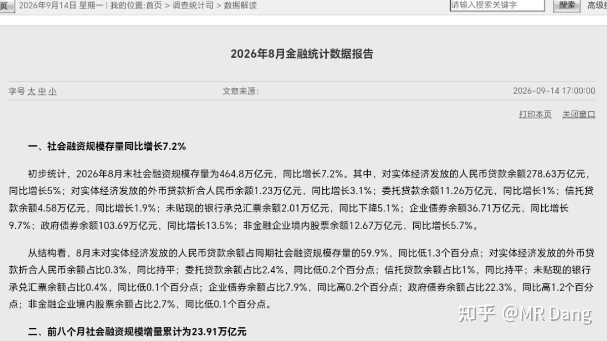
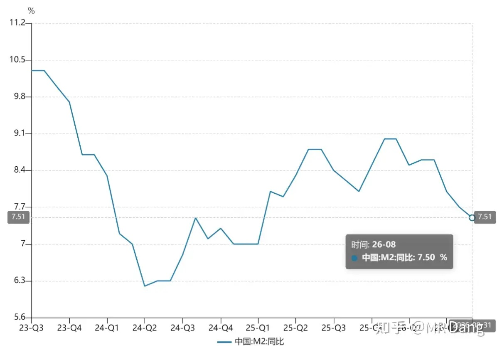
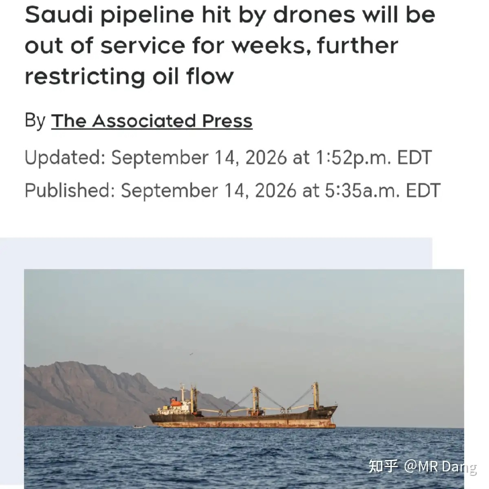
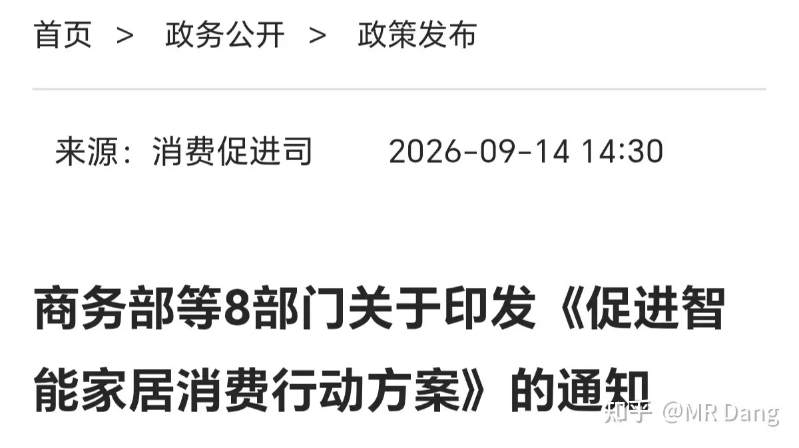
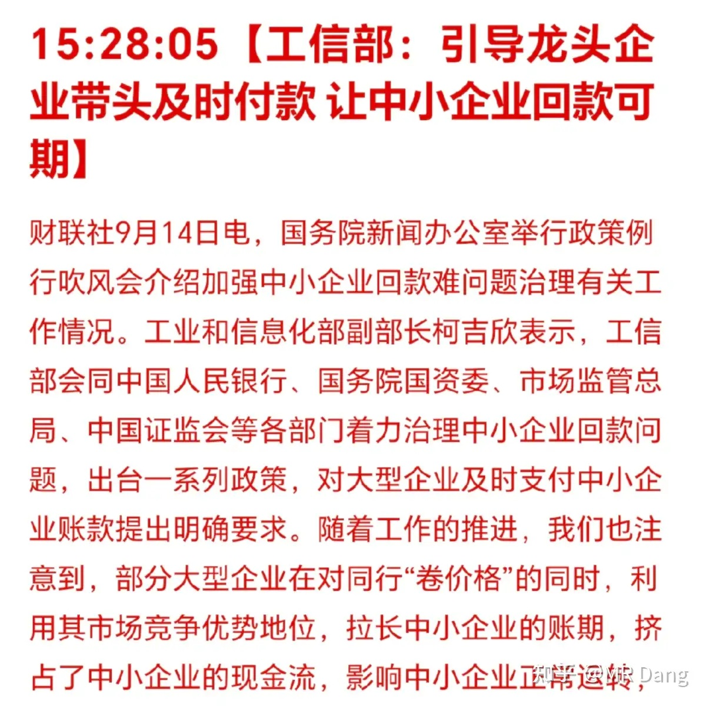
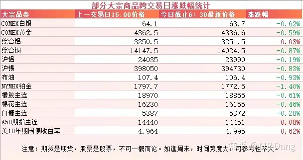
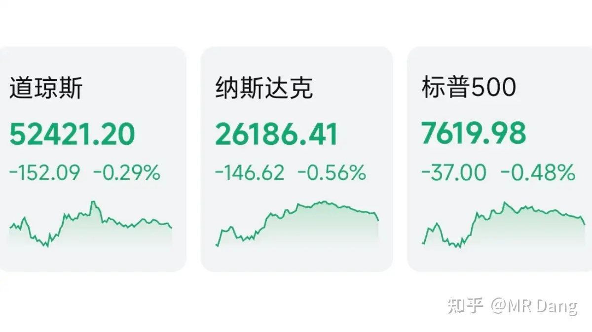

# 如何看待2026年9月15日A股市场行情？

---

**发布时间**: 2026-09-15 07:30  |  **原文链接**: https://www.zhihu.com/question/2080317474894100179/answer/2083095234800571804  |  **点赞数**: 165 人赞同

**作者信息**: MR Dang | 证券从业资格证持证人

---

## 正文内容

### 头条给到央行

昨天下午收盘后央行发布了最新的8月金融统计数据报告。

总体上M2，社融，贷款余额环比7月份，增速都减缓了0.2%。

这和之前的减少总量政策工具的表述基本上是一致的。

结构上的话，虽然M2增速较上月减缓了0.2%，但是M1增速反而增加了0.1%。

M1-M2剪刀差收窄至3.4%（7月为3.7%），是为数不多的积极信号，说明企业活期存款活跃度边际改善。

8月单月新增存款约1.20万亿，相较于前7个月的17.79万亿，这一数据也偏保守。

其中只有400亿是住户贡献的，另外大约5600亿是非银存款。

什么叫非银存款呢？

也就是理财，基金之类的，说明低利率时代，存款意愿有所下降。

8月新增贷款只有600亿，其中企业贷款贡献了2600多亿，这意味着住户贷款减少了2000亿左右。

说人话就是企业在贷款，老百姓在还钱。

而在社融数据方面，前8月债券+股票融资占社融比重升至50.31%，历史性首超贷款。

咱们的资本市场还是很强大的，融资功能遥遥领先。

大概总结一下，整体偏弱，但M1边际改善是积极信号，个人觉得后续降准降息还是有可能的。

---

### 美伊局势

此前报道的沙特输油管道遇袭有了后续报道，有消息人士透漏维修好大概需要3到5周的时间，而港口处的库存仅够大概一周的出口所需。

---

### 智能家居

昨天有关部门发布了一个《促进智能家居消费行动方案》的通知。

和其他文件有点不同的是，这个文件的指向比较清晰，行业范围也窄，就一个智能家居。

我打开学习了一圈，发现确实有两个地方比较超预期。

一个是文件中有“加快制定实施智能家居互联互通等强制性国家标准”这样的表述。

现在智能家居行业的一个痛点就是各有各的协议，各有各的生态，如果强制标准落地，并且让整个行业的硬件可以通用，协议标准化，那行业发展速度会明显加快。

另一个是对新建全装修住宅，明确户内设置基本智能产品要求。

这个表述其实也很积极，相当于对精装交付的新房来说，智能家居是标配了，这里的行业增量相当可观。

落实到投资上的话，智能家居听起来很洋气的样子，其实都是一些耳熟能详的电器公司，或者是手机公司什么的，业务占比都很低。

业务占比高的主要是一些AloT主控芯片，智能控制模块和智能家居操作系统这样的细分领域。

从长远来看，这个行业目前渗透率还比较低，也没有形成消费习惯，所以想象空间还是有一些的。

---

### 中小企业回款

关注中小企业的回款问题是近来的工作重点。

9月10日的时候有关部门就发了一个《关于加强中小企业回款难问题治理有关工作的通知》。

昨天针对这个问题，又开了个吹风会，会上有很多增量信息，比如要求央企对中小企业全部现金支付，列为硬杠杆。

同时有关部门点名汽车行业，认为重点车企平均账期有所改善，但仍有差距。

整体看下来，对长账期行业的下游头部企业是利空，对上游企业是利好。

我这么一说，大家心里应该会浮现出一些企业的名字。

---

### 大宗商品

有色整体有少许调整，但是幅度不大，大多数都没超过一个点。

原油冲高后回落，整体也是调整了一个点不到。

懂王似乎有TACO的迹象，自称愿意和伊朗坐下来好好说话，还要向其他小弟收取“护航补偿”。

农产品也在集体调整。

A50期指看不出什么苗头。

美长债收益率进一步提高，盘中一度破5。

### 外围市场

美三大股指集体回调，纳指领跌。

板块上半导体，光通信等Ai硬件大幅回调，可能是受ai三大巨头喊话放缓进度的情绪影响。

医药，医疗，消费，软件等板块表现相对较好。

---

昨天个人组合净值纳米红，银行红小半个点，资源绿一个多，消费红一个半，电网绿大半个点。

平平无奇的一个交易日，感觉大家都麻木了。

整个市场上也没什么大的热点，创新药算是相对有点人气的板块。

---

### 一个喜欢保护韭菜的博主，希望大家少少踩坑，多多赚钱！！！

> [!comment]- 点击展开评论
>
> | 用户 | 时间 | 内容 |
> | :--- | :--- | :--- |
> | nihaonihai |  | 从年初就在喊降准降息吧，到现在都没动静 |
> | &nbsp;&nbsp;&nbsp;&nbsp;MR Dang |  | [感谢] |
> | &nbsp;&nbsp;&nbsp;&nbsp;眉清目秀的佐助 |  | 可别降了[捂脸] |
> | 野望笔记 |  | 之前您提到的啤酒我砸里了、石化也砸里了，现在压上您提过的电影[感谢] |
> | 朱瓜皮 |  | [哇][感谢] |
> | &nbsp;&nbsp;&nbsp;&nbsp;MR Dang |  | [感谢] |
> | 花泥 |  | 早上好 |
> | &nbsp;&nbsp;&nbsp;&nbsp;MR Dang |  | [感谢] |
> | 红.德仔 |  | [可怜] |
> | &nbsp;&nbsp;&nbsp;&nbsp;MR Dang |  | [感谢] |
> | 回声 |  | 早[感谢] |
> | &nbsp;&nbsp;&nbsp;&nbsp;MR Dang |  | [感谢] |
> | 无为 |  | [感谢]早 |
> | &nbsp;&nbsp;&nbsp;&nbsp;MR Dang |  | [感谢] |
> | 阿民呀 |  | [感谢] |
> | &nbsp;&nbsp;&nbsp;&nbsp;MR Dang |  | [感谢] |
> | 陈陈陈 |  | [感谢] |
> | 尊龙roy |  | 早[感谢] |
> | &nbsp;&nbsp;&nbsp;&nbsp;MR Dang |  | [感谢] |

---

*本文件从 MR Dang 知乎页面转载*

**作者**: MR Dang  
**链接**: https://www.zhihu.com/question/2080317474894100179/answer/2083095234800571804  
**来源**: 知乎

*著作权归作者所有。商业转载请联系作者获得授权，非商业转载请注明出处。*

---

## 相关阅读

- [[20260914-大家如何看待2026年9月14日A股市场行情？|上一篇：大家如何看待2026年9月14日A股市场行情？]]
- [[20260916-如何看待2026年9月16日A股市场行情？|下一篇：如何看待2026年9月16日A股市场行情？]]
