# 如何看待2026年9月16日A股市场行情？

---

**发布时间**: 2026-09-16 07:30  |  **原文链接**: https://www.zhihu.com/question/2080675379224765050/answer/2083457610645357481  |  **点赞数**: 156 人赞同

**作者信息**: MR Dang | 证券从业资格证持证人

---

## 正文内容

### 今天还是老样子，从统计局数据说起

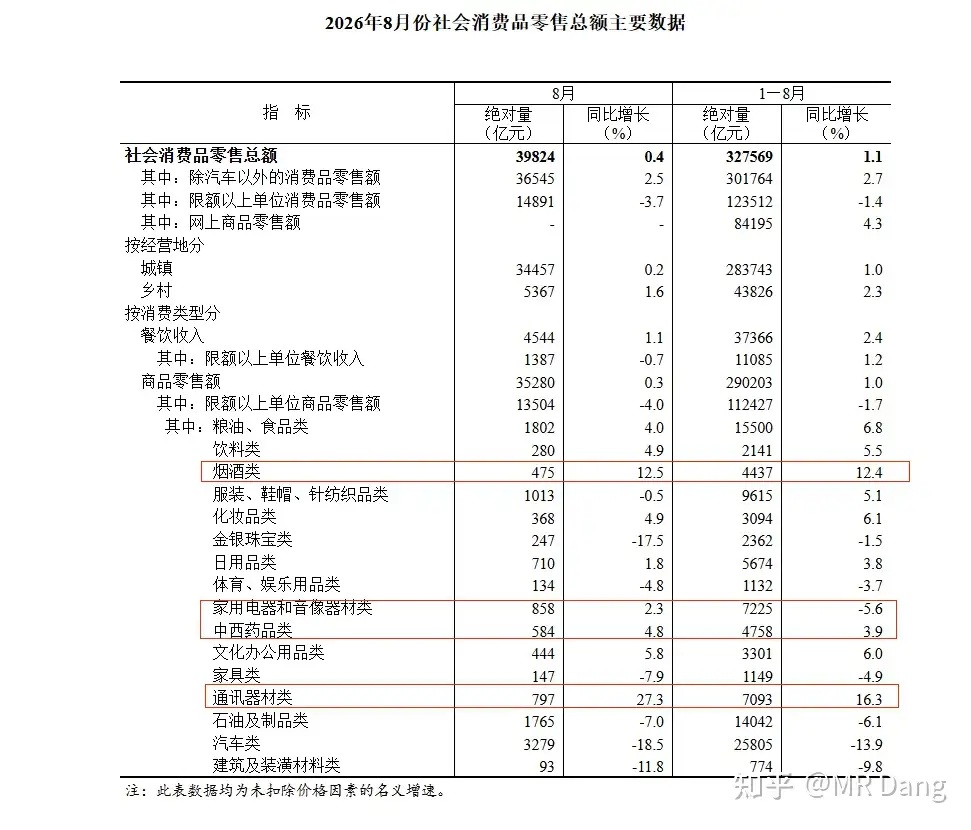

社零数据是我个人比较关注的，0.4%的整体数据相较于上个月的0.6%，还是偏弱一些，同环比都谈不上景气。

拖累整体数据的主要是汽车，单月负增长18个点。

汽车这行业，尤其是电车实在太卷了。昨天还有菊花厂的某界品牌改轻资产运营的消息，资本市场更是跌的没眼看。

通讯器材是数据最猛的，这个老读者已经可以自行补充下一句话了，成本推动。

药品数据相当不错，同比4.8%，增速也比前8个月的均值高一些。

烟酒数据也还可以。

不过这几个都不是主角，8月最出乎我个人预期的是电器类，同比增长2.3%。

看着不起眼，但是前8月总体可是负增长的，单月转正已经是有些超预期了。

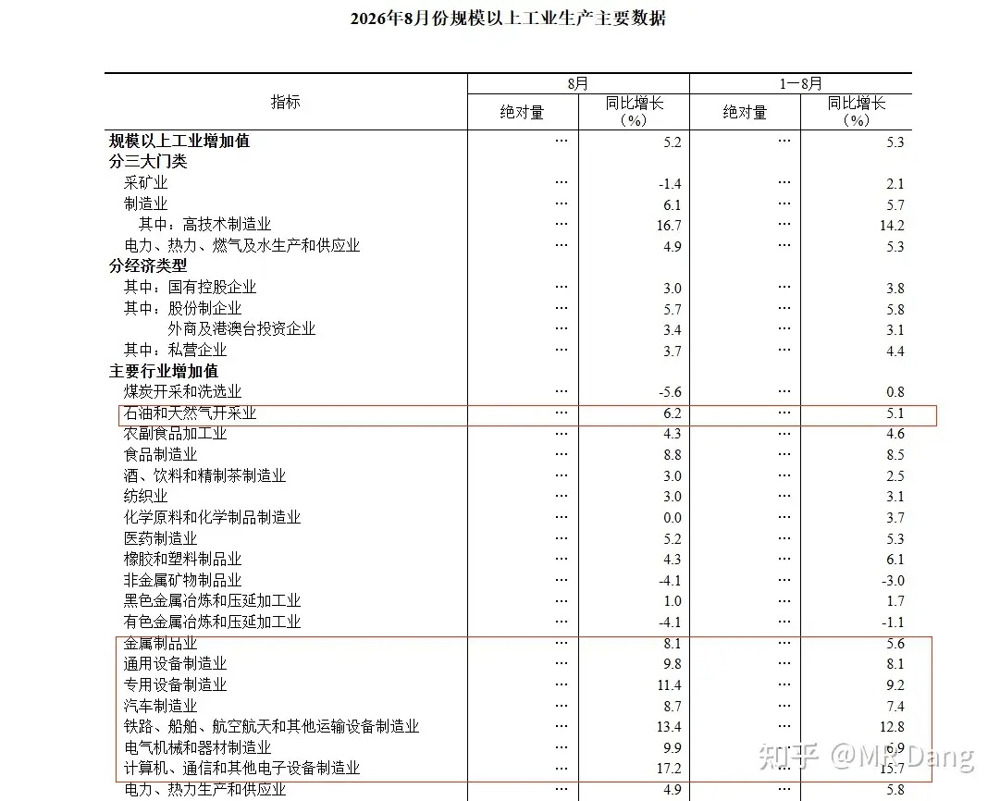

工业增加值的数据还不错，上个月是4.5%，这个月已经来到了5.2%，有边际改善的趋势。

景气的行业和上个月差不多，还是专用设备，运输设备，电子设备三大制造业为主。

整体数据出入不大。

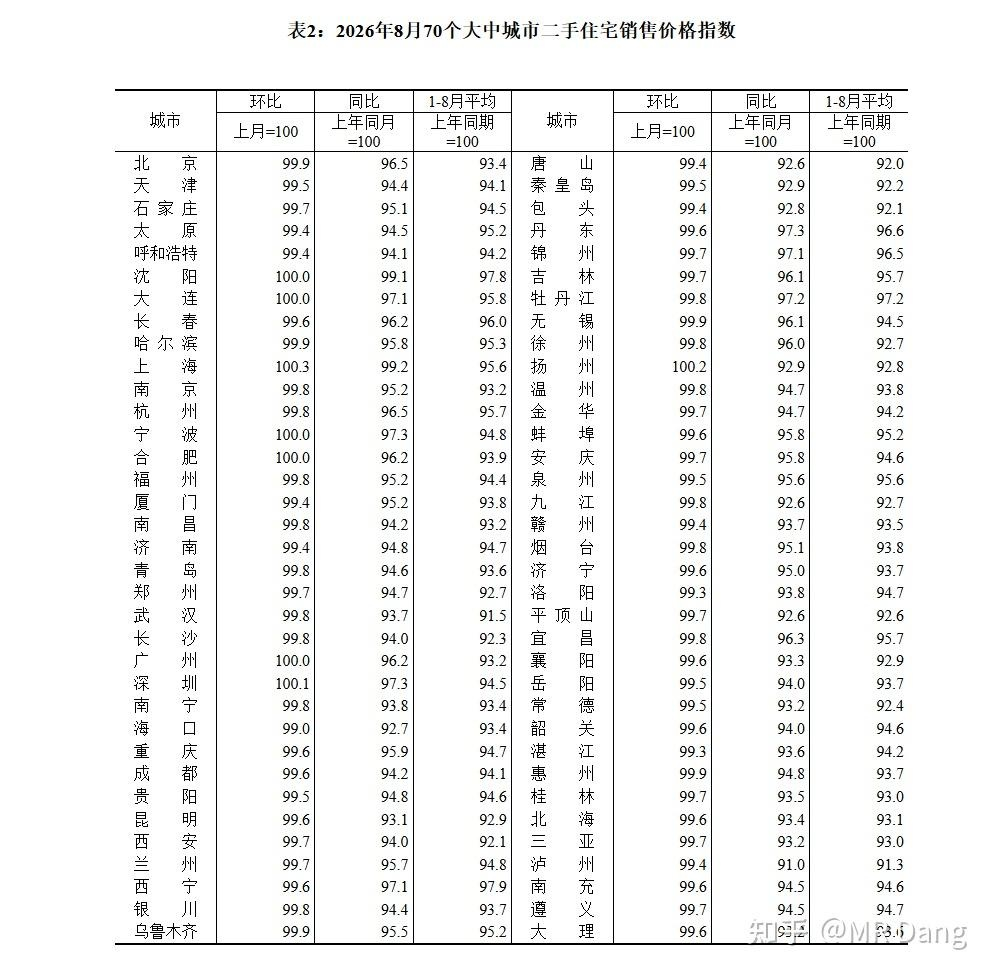

至于喜闻乐见的二手住宅价格指数，环比破百的城市依然是8个，和上个月持平。

但如果去掉刚好100%，只统计超过100%的，就只剩三个城市了。

不动产作为一项资产，也是要锚定现金回报的，租金起来了才能更好的推动不动产的预期变好。

如果整体消费氛围偏弱，光涨租金也挺难的。

---

### 美伊局势

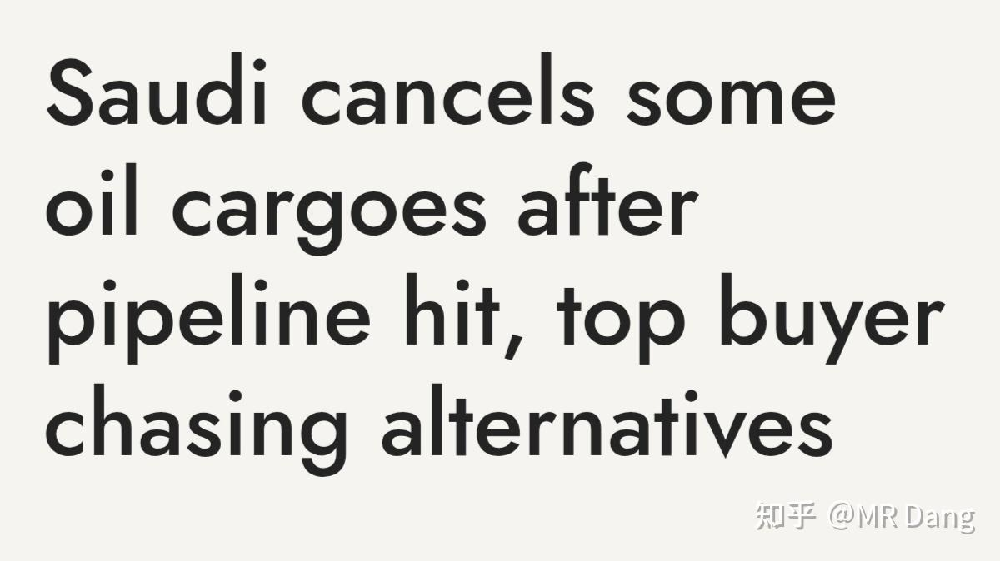

据外媒报道，沙特管道遇袭后，向欧洲炼油客户交付的原定于9月装船的货物推迟到了11月以后。

这可能会加剧短期内原油紧缺的态势，推高油价。

---

### 商业航天

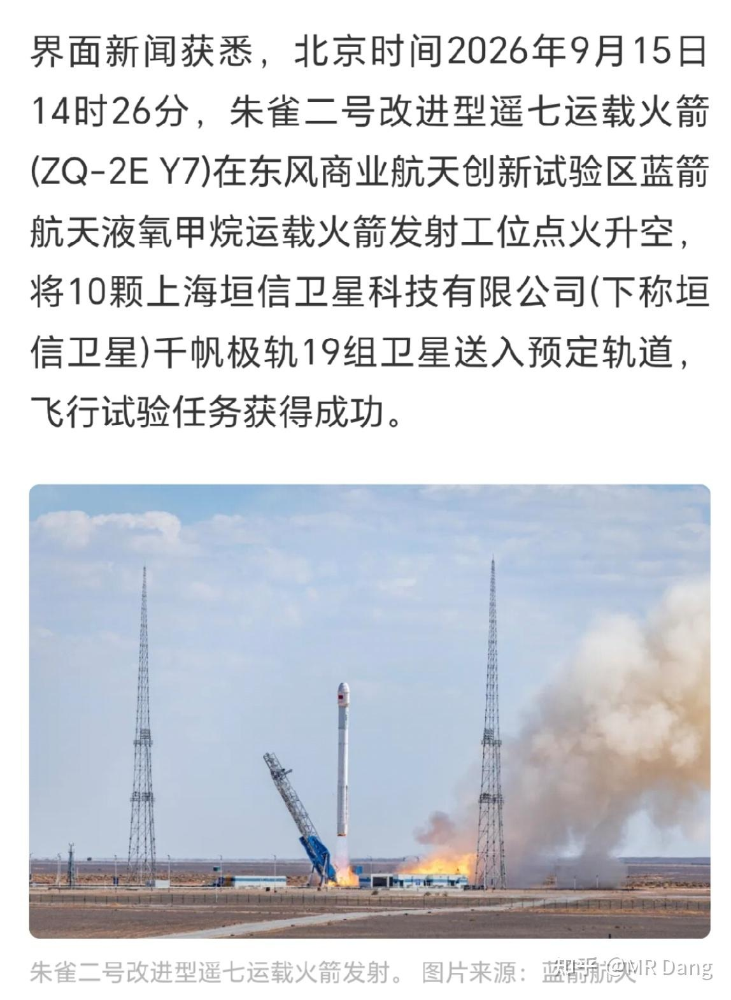

昨天下午朱雀二号改遥7完成了一箭十星的发射。

这是民营火箭首次承担千帆星座的规模化组网任务，咱们这边的商业航天又向前踏出了一小步。

不过这次发射的不是可复用的火箭，所以没有什么回收过程。

对资本市场的影响的话。。。嗯。。。就现在这情绪，不研究也罢。

说到卫星，最近其实还有个新闻，西大那边首次公开承认在太空上部署了太空控制武器。

西大的太空武器涵盖动能和非动能两种手段，动能就是直接撞击、拦截等物理摧毁。

非动能就是电子干扰，激光致盲，通信阻断等等。

至于西大部署这些武器的假想敌是谁，应该不言而喻了。

---

### 银行业

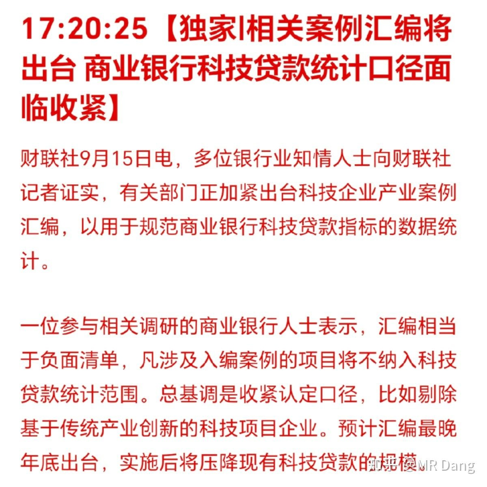

财联社独家报道，有关部门正加紧出台科技企业产业案例汇编，用来规范商业银行的放贷。

这啥意思呢？就是缩紧科技企业的认定标准，让一些挂羊头卖狗肉的伪科技原形毕露。

汇编大致等同于负面清单，上了这个汇编的行业从银行融资的难度就会增加。

对银行业来说，好坏参半吧，坏处是少了部分业务的增长渠道，好处是监管层面一刀切，一些风控不过关的中小银行被动的提高资产质量。

---

### 钢铁业

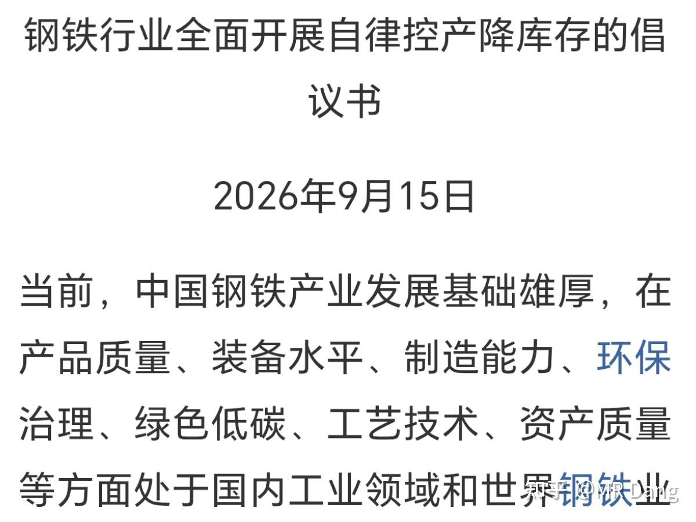

昨天中钢协发了个自律控产的倡议书。

熟悉这行业的投资者都知道这种倡议书基本就是面子工程，没什么用，没有强制力。

现在很多类似的行业都是这样的境地，囚徒困境，谁先停手就丢市场份额。

可以从极度内卷中走出来的行业毕竟还是少数。

---

### 公告速递

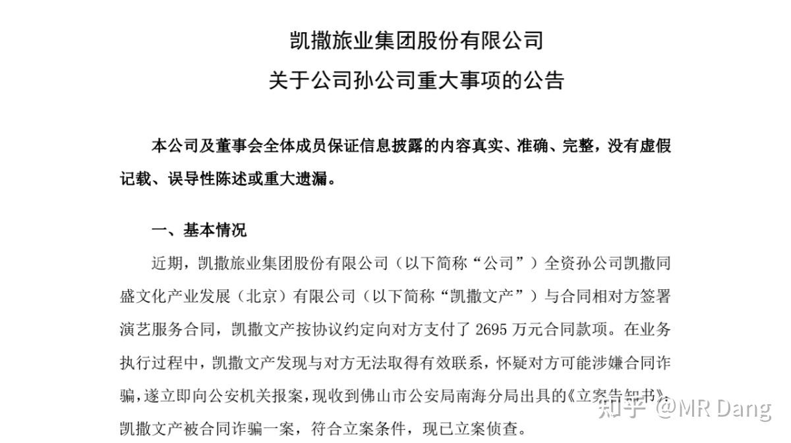

昨天没事的时候吃到一家上市企业的瓜。

这家上市公司的孙公司向对方签了合同，付了2695万的合同款以后，找不到人了，怀疑被诈骗，已经报案。

让子弹再飞一会儿吧，有些阴谋论的投资者联想到了扇贝跑路的事情，不过不管怎么样都挺草台班子的。

---

### 大宗商品

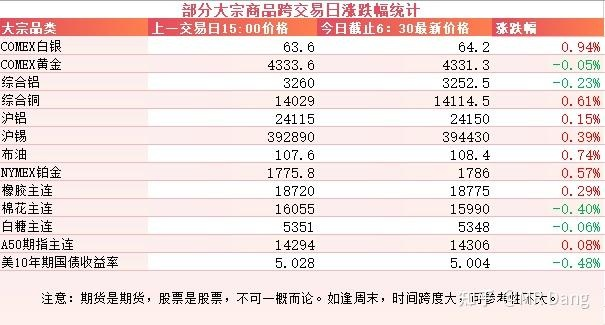

昨天到今天最大的变化就是美长债收益率正式破5，创2007年以来，也就是近20年以来的新高。

一提到2007年，不免让人联想到2008年的金融危机，确实对情绪上是个打压。

原油，有色和农产品都属于正常波动，涨跌互现，小幅波动，市场在等待一个声音。

A50期指看着也没明确的信号。

### 外围市场

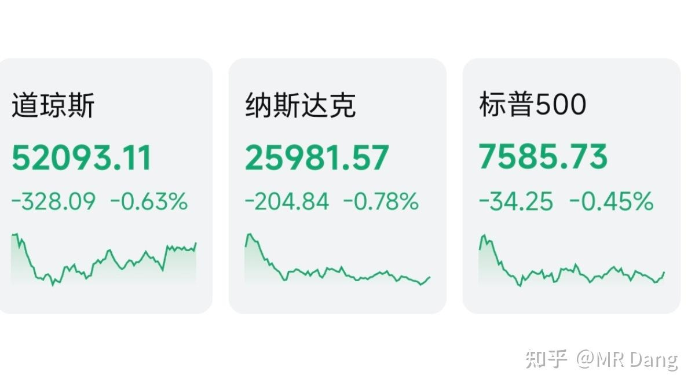

美三大股指继续回调，纳指领跌。

板块上都不怎么样，只有油气有色医疗等少数几个行业表现尚可。

---

昨天个人组合净值回撤近一个点，银行绿一个，消费微红，资源绿一个半，电网绿小半个。

体验不佳的一个交易日，大家都在等着美联储议息的靴子落地。

整个市场有1100多家上涨，4400多家回调，中位数是回调了1.5%左右。

成交额也创了年内新低，大家都被磨平了棱角，坠了心气。

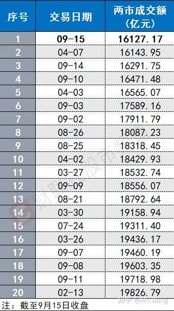

---

### 一个喜欢保护韭菜的博主，希望大家少少踩坑，多多赚钱！！！

> [!comment]- 点击展开评论
>
> | 用户 | 时间 | 内容 |
> | :--- | :--- | :--- |
> | 浪里小白马 |  | 躺平[感谢] |
> | &nbsp;&nbsp;&nbsp;&nbsp;MR Dang |  | [感谢] |
> | 橘生淮南 |  | 老祖，塑料王现在可以进吗？怎么油价涨，他没啥反应 |
> | &nbsp;&nbsp;&nbsp;&nbsp;曼吉克斯 |  | 感觉现在啥王都顶不住了[飙泪笑]只能看懂王了 |
> | &nbsp;&nbsp;&nbsp;&nbsp;爱吃的小k龙 |  | 确实[捂脸][捂脸] |
> | 我是一颗桃子吖 |  | 早[感谢] |
> | &nbsp;&nbsp;&nbsp;&nbsp;MR Dang |  | [感谢]早啊 |
> | 华灯初上 |  | [感谢] |
> | &nbsp;&nbsp;&nbsp;&nbsp;MR Dang |  | [感谢] |
> | 苜蓿花儿 |  | [感谢] |
> | 薛定谔的猫耳朵 |  | [感谢] |
> | &nbsp;&nbsp;&nbsp;&nbsp;MR Dang |  | [感谢] |
> | 卡啦哒 |  | [感谢] |
> | &nbsp;&nbsp;&nbsp;&nbsp;MR Dang |  | [感谢] |
> | 让自己慢下来 |  | [感谢] |
> | 蛮王石头人 |  | 地量见地价，地价被碾碎在天花板上[生气] |
> | &nbsp;&nbsp;&nbsp;&nbsp;MR Dang |  | [感谢] |
> | 乐妈 |  | [感谢][感谢][感谢] |
> | &nbsp;&nbsp;&nbsp;&nbsp;MR Dang |  | [感谢] |

---

*本文件从 MR Dang 知乎页面转载*

**作者**: MR Dang  
**链接**: https://www.zhihu.com/question/2080675379224765050/answer/2083457610645357481  
**来源**: 知乎

*著作权归作者所有。商业转载请联系作者获得授权，非商业转载请注明出处。*

---

## 相关阅读

- [[20260915-如何看待2026年9月15日A股市场行情？|上一篇：如何看待2026年9月15日A股市场行情？]]
- [[20260917-怎么看待2026年9月17日A股行情？|下一篇：怎么看待2026年9月17日A股行情？]]
