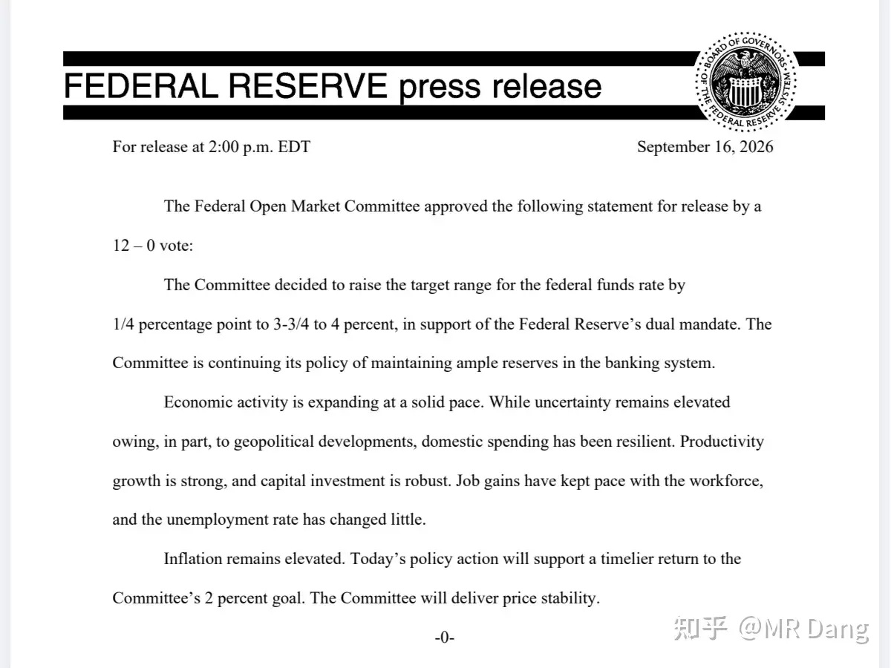
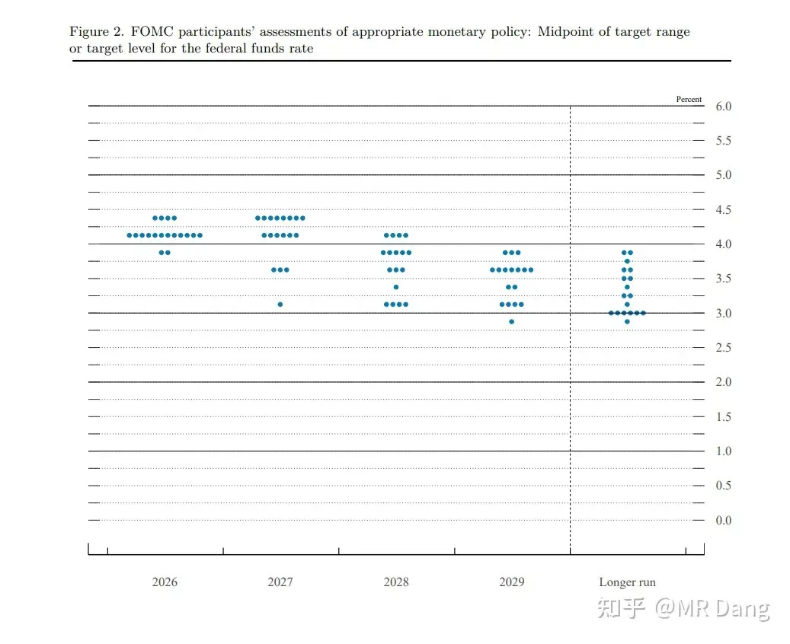
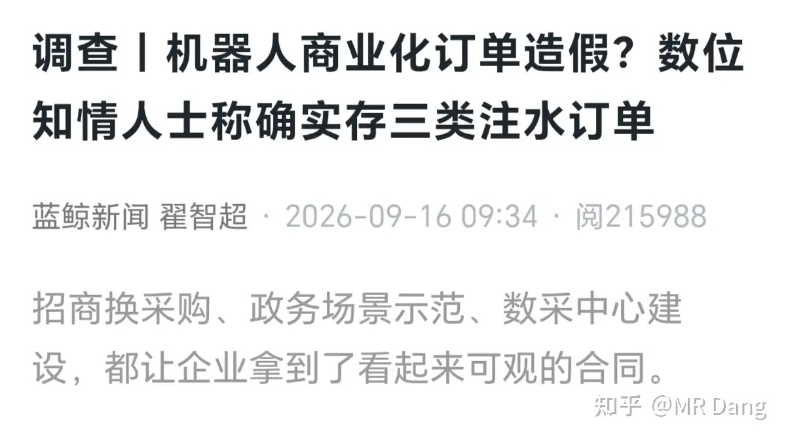
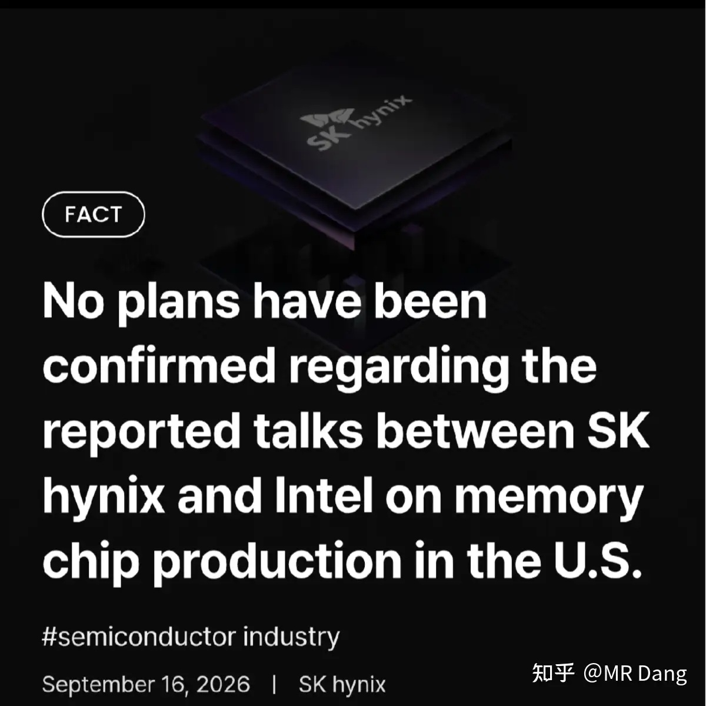
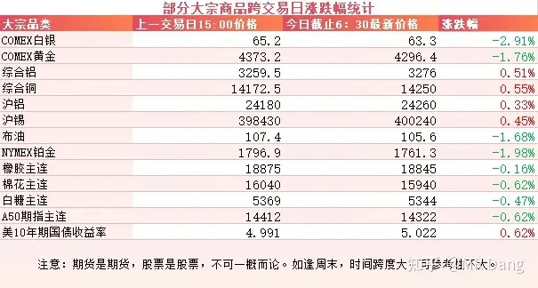
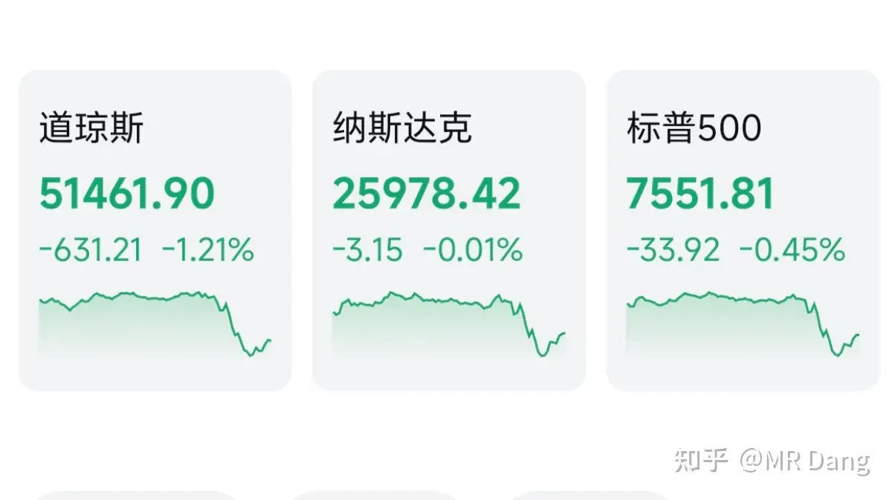

# 怎么看待2026年9月17日A股行情？

---

**发布时间**: 2026-09-17 07:38  |  **原文链接**: https://www.zhihu.com/question/2083575311925565413/answer/2083822156593508988  |  **点赞数**: 211 人赞同

**作者信息**: MR Dang | 证券从业资格证持证人

---

## 正文内容

### 今天的目光只能先给到美联储

先说结论：比市场预期的更鹰。

本身加息25个基点已经是市场预期内的了，但是沃什并没有安抚市场情绪，反而在加息后扔出一张点阵图。

从点阵图来看，2026年底利率中位数4.1%，比6月的3.8%上调了30个基点。

说人话就是：点阵图认为12月大概率还要再加一次25bp。

6月份的时候，对2026到2028这三年的利率水平预期是3.8%，3.6%，3.4%，长期中性利率3.1%。

现在根据点阵图，变成了4.1%，4.1%，3.9%，长期中性利率3.2%。

三年利率分别提高了0.3%，0.5%，0.5%，长期中性利率提高了0.1%。

本来预期2027年还有降息的，现在根据点阵图，推迟到2028年去了。

这就是所谓的"higher for longer"——更高，而且更久。

为什么美联储这次这么鹰呢？

美联储同时发布了经济预测摘要（SEP），里面把GDP增速预测从2.2%上修到了2.3%，失业率预测从4.3%下修到了4.1%，PCE和核心PCE同时上修了0.1%。

经济比预期的强，就业比预期的稳，通胀比预期的高。

这三个加在一起，是美联储放鹰的底气。

这次点阵图最值得玩味的一点是市场之前已经定价了9月加息，但完全没定价2027年不降息。

所以现在市场需要重新定价这个"更久"的部分。

后面市场要消化的核心矛盾就变成了美联储说要高利率维持更久，但经济能不能扛住这么久的高利率？

这两个之间的博弈，会是接下来几个月市场的主线。

至于咱们这边，美联储越鹰，国内政策反而越有发力的必要和空间。

毕竟，外面越紧，里面越要松，不然经济压力太大。

所以也不用太慌，美联储的鹰，某种程度上可能反而是国内政策的催化剂。

我这么说也不是刻意安慰大家，2022年的时候美联储可是加息加了425个基点的。

25个基点算一次，那就是相当于17次加息的力度。

同期东大这边反而降了35个基点，最后的结果也只是汇率从6.3贬值到7.3。

美联储加息降息，其实就是水多了加面，面多了加水，现在从各方面来看，这次加息并不是一个新加息周期的开端，不用过于恐慌了。

---

### 机器人

最近有个和人形机器人相关的新闻火了。

起因是一家M港股上市企业的老板在朋友圈吐槽：“攒局型具身智能创业靠各种关联交易制造虚假、不可持续的收入，没有PMF，只会发布各种大新闻炒作，成立两三年就要上市”。

还点名了某Y企业，Y企业随后报警。

随后媒体记者去采访业内人士，了解到人形机器人目前订单有三种注水方式。

一是展示项目变相补贴。地方为了招商引资，给机器人企业一些文旅，数字中心的订单，其实没什么真实需求，主要是为了把企业留住。

二是上下游互保订单。人形机器人也有类似西大Ai的玩法，互相开票，做大营收。

三是海外意向单。很多企业把海外客户下的样机测试单和意向协议包装成采购合同，夸大宣传。

但是要注意，这只是M企业老板的一面之词，M企业是做工业机器人的，和人形机器人天然存在竞争关系，所以他的话可信度也是要打折扣的。

我个人其实挺看好人形机器人，特别是灵巧手这种可以作为生产资料的细分方向。

不过我看好的是这个行业未来的发展，而不是目前市面上的跳舞机器人，使用场景还是太单一了。

---

### 半导体

昨天存储企业海力士发了个辟谣声明，否认了在西大建厂的相关传闻。

在辟谣的时候措辞比较谨慎，没有说不建厂，而是说还没下最后的决定。

此前外媒一直在传海力士和英特尔要合作，初步定下来两种方案：方案一是租用英特尔在俄亥俄州的部分厂房，方案二是联合英特尔成立合资公司。

假设海力士在美扩产为真，对这两公司是利好。对行业里的其他竞争对手是一个潜在的威胁，相当于增加了潜在的供应，远期比较偏利空一些。

---

### 大宗商品

受美联储鹰派加息影响，贵金属跳水，金银铂等承压。

工业金属相对较好，不过表格里的数据是截止到加息之前的数据，加息后还没开始交易，交易后可能会补跌一些。

原油也有一个多点的回调。

在给出新的指引前，美长债收益率可能会长期维持在5%左右了。

A50期指看着承压，叠加今天周四。。。。。。抱头为妙。。。。

### 外围市场

美三大股指继续回调，道指领跌。

行业板块上商业航天和半导体表现相对更好。

---

昨天个人组合净值回血半个点，银行红小半个，资源红一个半，消费绿半个，电网红一个多。

就现在这风声鹤唳的环境里，能有这表现也不奢望太多了，知足常乐。

---

### 一个喜欢保护韭菜的博主，希望大家少少踩坑，多多赚钱！！！

> [!comment]- 点击展开评论
>
> | 用户 | 时间 | 内容 |
> | :--- | :--- | :--- |
> | 等亿会儿就去学习 |  | 等今天一个高开就跑[生气] |
> | &nbsp;&nbsp;&nbsp;&nbsp;MR Dang |  | [感谢] |
> | &nbsp;&nbsp;&nbsp;&nbsp;昨天的月亮不睡 |  | 肯定会拉一下，老头小孩先走。 |
> | &nbsp;&nbsp;&nbsp;&nbsp;叫可可的姑娘 |  | 哈哈哈哈哈哈，今天的第一个哈哈哈哈是你这句话给的 |
> | 安静 |  | 这一波可以慢慢加仓了 |
> | &nbsp;&nbsp;&nbsp;&nbsp;MR Dang |  | [感谢] |
> | 夜色下的荣耀 |  | 快快加息，不加息哪有便宜筹码 |
> | &nbsp;&nbsp;&nbsp;&nbsp;MR Dang |  | [感谢] |
> | 回声 |  | 早[感谢] |
> | &nbsp;&nbsp;&nbsp;&nbsp;MR Dang |  | [感谢] |
> | momo |  | [感谢] |
> | 浪里小白马 |  | 幸好昨天忍住加仓了[感谢] |
> | &nbsp;&nbsp;&nbsp;&nbsp;MR Dang |  | [感谢] |
> | &nbsp;&nbsp;&nbsp;&nbsp;今晚回家吃饭 |  | 幸好没忍住，[酷] |
> | &nbsp;&nbsp;&nbsp;&nbsp;浪里小白马 |  | 说不定有反转[感谢] |
> | &nbsp;&nbsp;&nbsp;&nbsp;一根葱 |  | 没忍住[尴尬] |
> | 没什么不同 |  | [感谢] |
> | &nbsp;&nbsp;&nbsp;&nbsp;MR Dang |  | [感谢] |
> | masculine |  | 这日子还能不能好好过了[捂脸] |
> | &nbsp;&nbsp;&nbsp;&nbsp;MR Dang |  | [感谢] |
> | 乐妈 |  | 吃面[感谢][感谢][感谢] |
> | &nbsp;&nbsp;&nbsp;&nbsp;MR Dang |  | [感谢] |
> | 如来熊掌 |  | [感谢] |
> | &nbsp;&nbsp;&nbsp;&nbsp;MR Dang |  | [感谢] |

---

*本文件从 MR Dang 知乎页面转载*

**作者**: MR Dang  
**链接**: https://www.zhihu.com/question/2083575311925565413/answer/2083822156593508988  
**来源**: 知乎

*著作权归作者所有。商业转载请联系作者获得授权，非商业转载请注明出处。*

---

## 相关阅读

- [[20260916-如何看待2026年9月16日A股市场行情？|上一篇：如何看待2026年9月16日A股市场行情？]]
- [[20260918-大家怎么看待2026年9月18日A股市场行情？|下一篇：大家怎么看待2026年9月18日A股市场行情？]]
