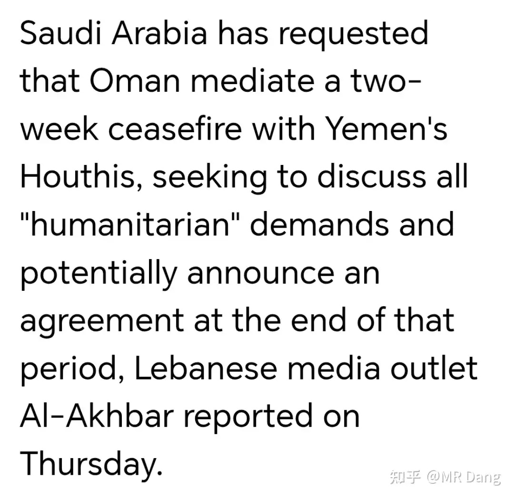
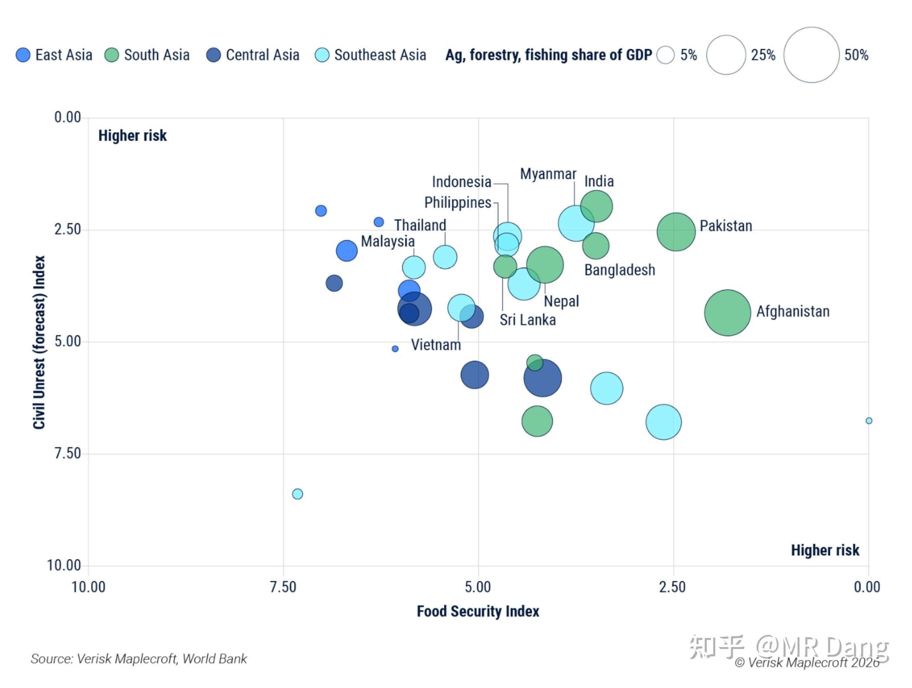
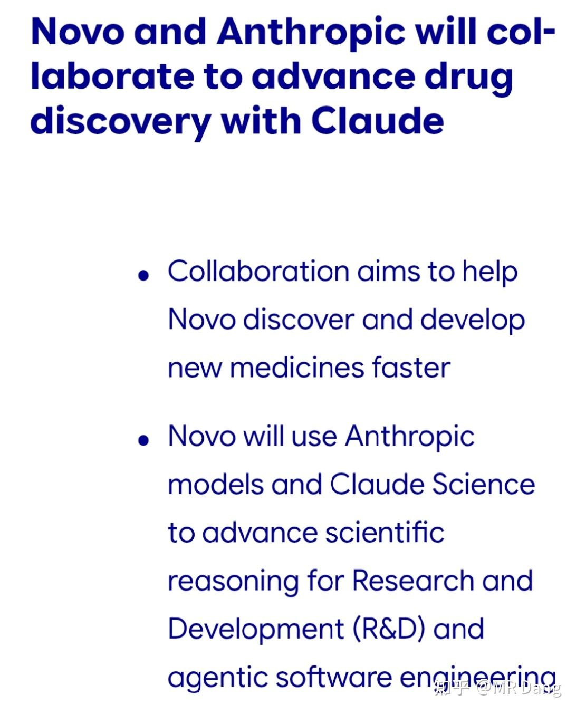
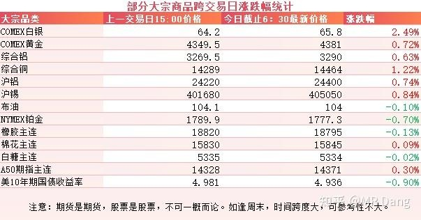
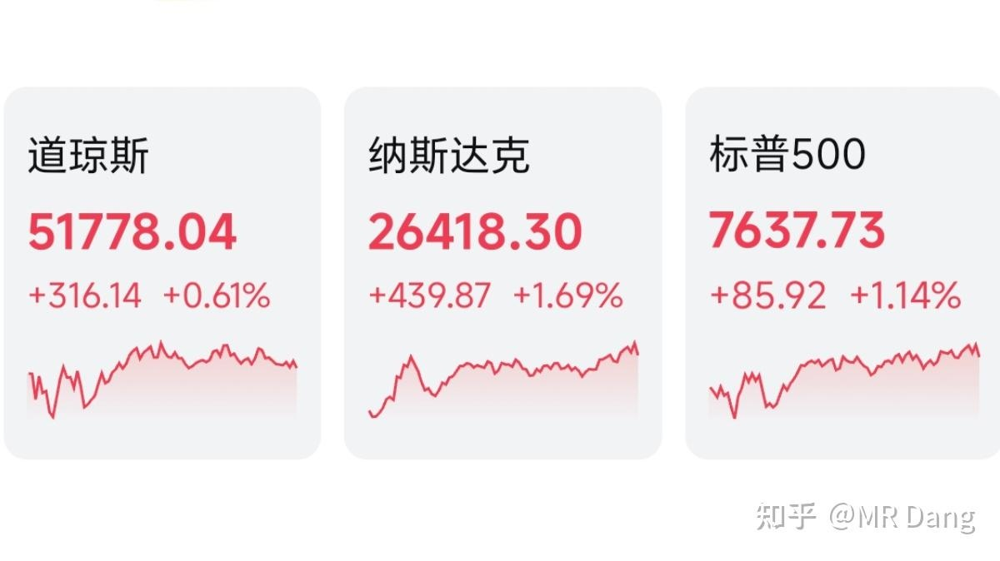

# 大家怎么看待2026年9月18日A股市场行情？

---

**发布时间**: 2026-09-18 07:30  |  **原文链接**: https://www.zhihu.com/question/2083847698130658451/answer/2084182411701703174  |  **点赞数**: 146 人赞同

**作者信息**: MR Dang | 证券从业资格证持证人

---

## 正文内容

### 昨天到今早为止，没什么太重要的事情，捡几个相对有意思的说说

一家偏向伊朗的外媒报道，沙特请求阿曼出面协调，想要和胡赛达成为期两周的停火协议。

胡赛现在真的是成气候了，不单最近拿下了摩卡港在内的大片区域，还把沙特系的武装力量按在地上摩擦，前一段时间胡赛的无人机甚至都飞到了麦加附近。

中东王爷为什么这个时候想停火了呢，主要是两方面的原因。

一是真的打不过，还不敢派出地面力量，只能炸一下充当个氛围组。

胡赛啥样的炸弹没见过，西大的大宝贝拿他们也没办法，所以沙特的空袭根本没啥用。

二是前一段时间有报道称胡赛和西大达成了秘密协议，西大不参与沙特对胡赛的袭击，胡赛也不会攻击西大的船只。

胡赛就是光脚的对穿鞋的，优势在我，沙特单方面完全奈何不了。

这个消息传出来以后，市场对原油供应紧张的情绪得到了部分缓解。

---

### 厄尔尼诺

全球最大的保险数据和风险分析公司Verisk最近出了一份有关厄尔尼诺的研究报告。

报告的结论已经包含在上面这张图里了，怎么看呢，我大概介绍下。

首先横坐标从左往右，食品安全风险越来越大。

纵坐标从下往上，动荡风险越来越高。

图里不同的颜色代表不同的地区，圈圈大小代表对农业的依赖程度，圈圈越大代表农业占GDP比例越高。

所以圈越大，越往右上角，代表潜在的风险越高，圈越小，越往左下角，代表潜在的风险越低。

最后的结论就是阿富汗和巴铁最危险，马来和印度也好不到哪里去。

很多人感兴趣的国家可以自己找哈，我也看的不是很懂，总感觉这报告在夹带私货。

那根据这个报告，对投资有什么指导呢？

根据报告里提到的地区，再结合他们当地的的出产农产品，大概率是指向糖，油之类的品种。

以上不代表真实情况，只是顺着这家机构的结论往下推测，最终影响大小还要看天气情况。

其实有一些职业投资者，就喜欢投黑天鹅事件，比如农业，传染病，天灾什么的。

但不是现在，而是在大家都乐观的时候。

他们的逻辑很简单，就三个字“我不信”。

“我就不信这天气还能连续三五年一直风调雨顺。”

“我就不信每隔几年来一次的疾病流行，以后就没了。”

在这种投资逻辑下，大部分时候他们的收益是跑不赢指数的，胜率低。

但是只要来一次极端事件就能赚的盆满钵满，赔率高。

很多看起来发生概率不高的事情，只要把时间拉的长一些，几乎是必然发生的。

---

### Ai制药

就在最近，Ai制药这个行业在东西两边都有了实质性进展。

西边是诺和诺德和克劳德合作，诺和诺德采用了Claude Science这个全新的垂直平台研发新药。

此前二者的合作仅限于生成文档，可以把临床研究文档的生成时间从10周缩短到10分钟。

现在是直接进入新药的发现阶段，从辅助工具进入了核心研发流程。

而在咱们这边，字节跳动把内部的Ai制药公司 Anew Labs独立了出来，投后估值15亿绿票子。

一般来说，创新药这个估值不算贵，毕竟管线值钱。

但是这家企业目前还没有管线，仅靠平台就估值这么多，是一件相当了不起的成就。

不在业内的投资者可能不知道Ai制药有多猛，在前期研发这一块，Ai的效率远不是传统流程可以比的：涉及到分子预测，寻找靶点，寻找蛋白质结构的工作，Ai既省时间又省钱。

当然临床实验这种必要的步骤还是跳不过去的。

Ai制药失败的例子也数不胜数：BenevolentAI 的 AD（特应性皮炎）管线临床就失败了，Exscientia 的 AI 分子也设计了个寂寞。

Ai制药是未来的大方向，但这毕竟是创新药行业，行业风险天然就高，不是加了Ai两个字就能解决一切问题的。

---

### 大宗商品

有色集体反弹，原油震荡，农产品没啥变化。

最大的好消息是美债收益率又回来一些。

A50期指看着还不错。

### 外围市场

美三大股指集体收红，纳指领涨。

行业板块上生物制药，半导体，有色等比较强势一些。

---

昨天个人组合净值回撤大半个点，银行绿大半个，资源绿两个多，消费基本打平，电网微红。

要搁平时高低得哼哼两声，但是昨天心理建设做的比较充分，所以就还好，甚至有点庆幸。

市场上绿多红少，整体情绪也一般般，又在农业里搞事情了。

美联储加息最大的受害者就是黄金白银之类的贵金属，因为持有成本会提高。

很多投资者不太清楚什么叫持有成本。

黄金本身不产生利息，买它会占用资金。

这些资金如果放着不动也能产生利息，那持有黄金就相当于舍弃了这些利息，所以无风险利率水平越高，黄金持有成本越高，就会压制短期价格。

除了像央行那种无限子弹模式的，大部分投资者囤金的时候还是会琢磨一下这个成本的。

工业金属就相对好一些，因为很少有人买铝锭或者铜锭是为了埋起来坐等升值的，大部分还是当时就用掉了，变成了工业品。

有些铝水甚至还没落地就变成了车子，所以受到的影响是比较间接的，主要还是情绪推动。

---

### 一个喜欢保护韭菜的博主，希望大家少少踩坑，多多赚钱！！！

> [!comment]- 点击展开评论
>
> | 用户 | 时间 | 内容 |
> | :--- | :--- | :--- |
> | 程草丶 | 7 小时前 | 哦，今天才周日，我说怎么没有早报[飙泪笑]打工人太惨了 |
> | zc婉儿 |  | 总结就是说铝问题不大 |
> | &nbsp;&nbsp;&nbsp;&nbsp;黑默丁格 |  | 套进去就知道大不大了 |
> | bear white |  | 最近大A聪明资金跑得快，踩点很准 |
> | &nbsp;&nbsp;&nbsp;&nbsp;MR Dang |  | [感谢] |
> | rey i |  | 早[感谢] |
> | &nbsp;&nbsp;&nbsp;&nbsp;MR Dang |  | [感谢] |
> | 奶片 |  | 哥早[感谢] |
> | &nbsp;&nbsp;&nbsp;&nbsp;MR Dang |  | [感谢]早啊 |
> | &nbsp;&nbsp;&nbsp;&nbsp;奶片 |  | 我开始买yh了，买了后感觉想法都开始变踏实了[捂脸] |
> | &nbsp;&nbsp;&nbsp;&nbsp;MR Dang |  | 哈哈哈，慢慢来 |
> | 乐妈 |  | [感谢][感谢][感谢] |
> | &nbsp;&nbsp;&nbsp;&nbsp;MR Dang |  | [感谢] |
> | 等风 |  | [感谢] |
> | &nbsp;&nbsp;&nbsp;&nbsp;MR Dang |  | [感谢] |
> | 向潇湘 |  | 跌了一周[大笑][大笑] |
> | &nbsp;&nbsp;&nbsp;&nbsp;MR Dang |  | [感谢] |
> | &nbsp;&nbsp;&nbsp;&nbsp;我喜欢花生米 |  | 跌了一个月了，那是一周了 |
> | 无为 |  | [感谢]早 |
> | &nbsp;&nbsp;&nbsp;&nbsp;MR Dang |  | [感谢] |
> | 晨雾 |  | [感谢][感谢][感谢] |
> | &nbsp;&nbsp;&nbsp;&nbsp;MR Dang |  | [感谢] |

---

*本文件从 MR Dang 知乎页面转载*

**作者**: MR Dang  
**链接**: https://www.zhihu.com/question/2083847698130658451/answer/2084182411701703174  
**来源**: 知乎

*著作权归作者所有。商业转载请联系作者获得授权，非商业转载请注明出处。*

---

## 相关阅读

- [[20260917-怎么看待2026年9月17日A股行情？|上一篇：怎么看待2026年9月17日A股行情？]]
