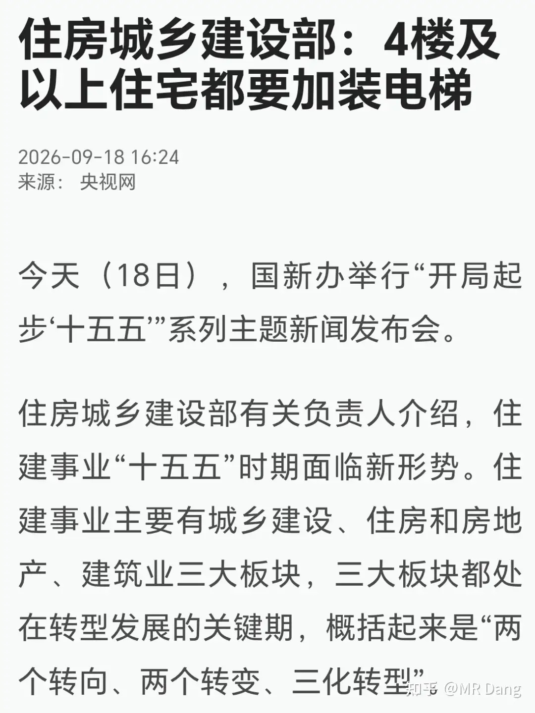
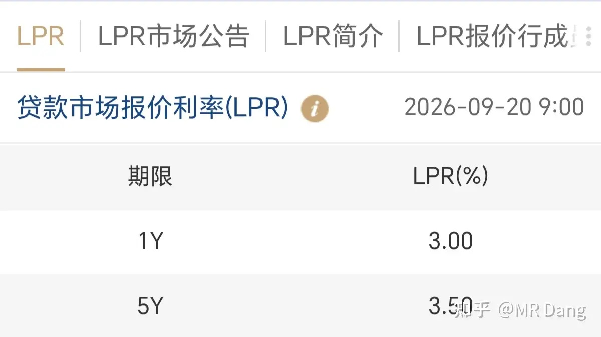
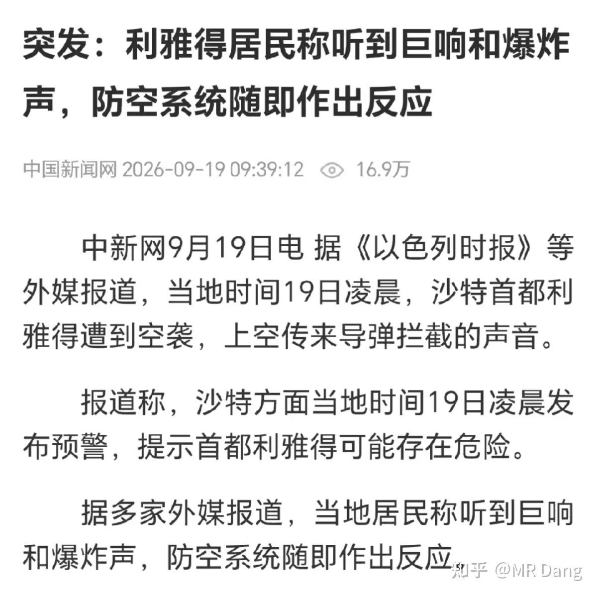
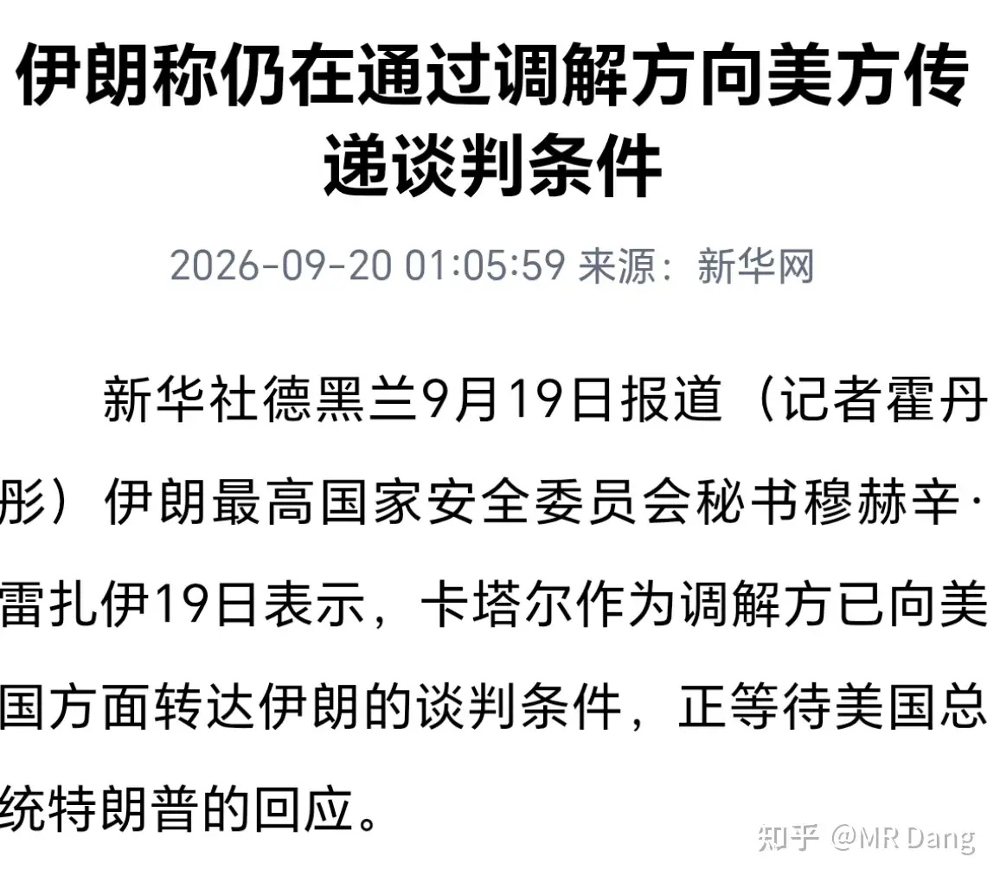
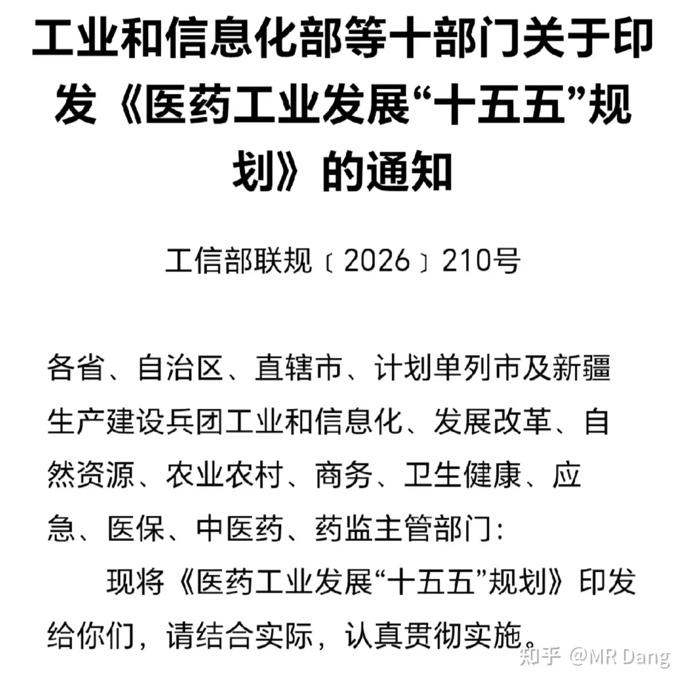
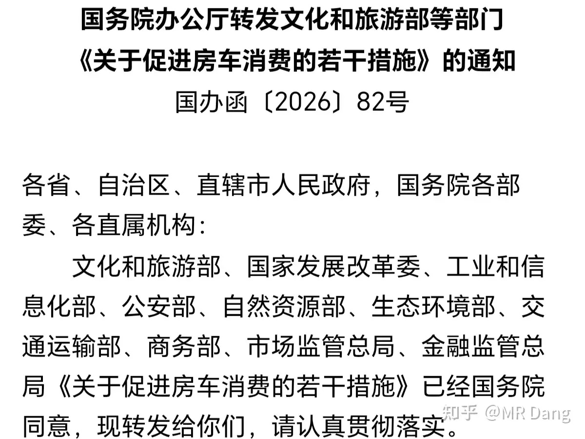
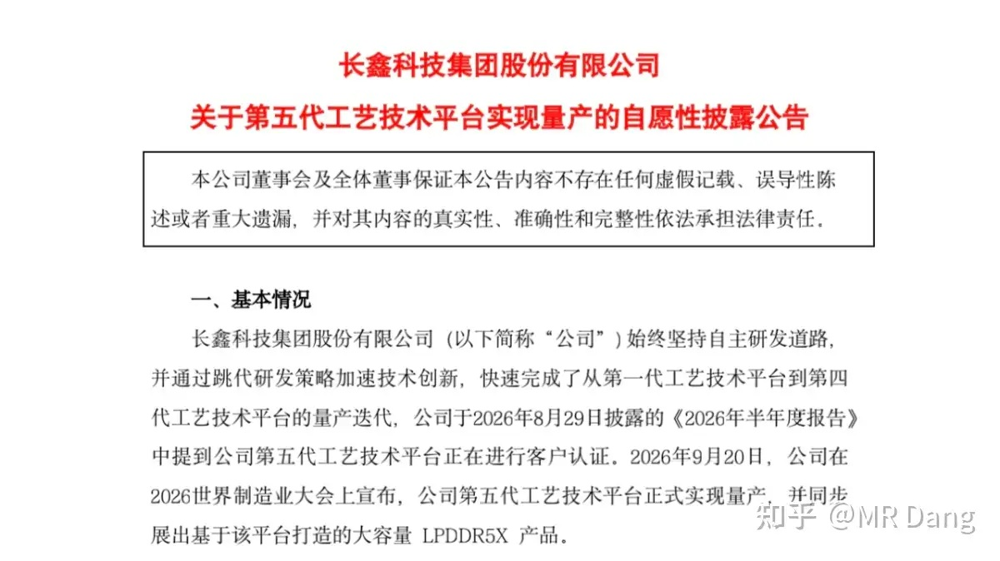
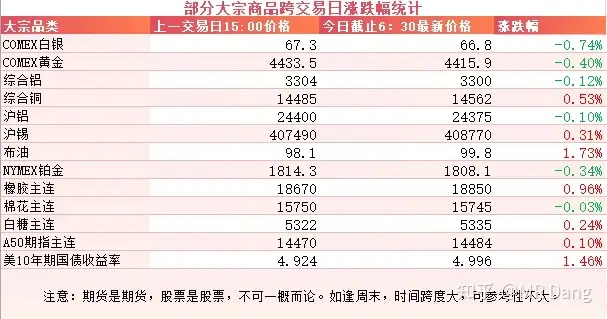
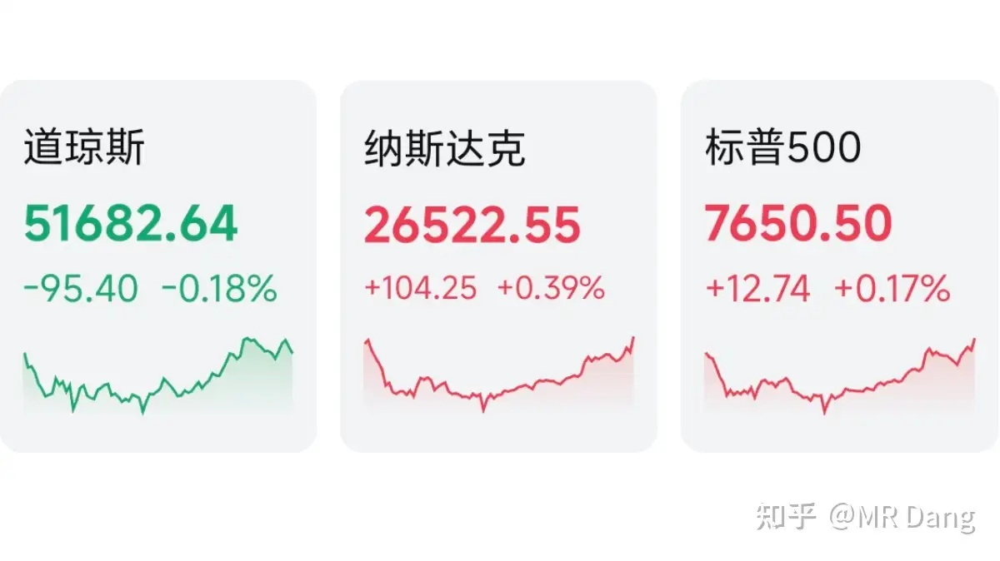

# 如何看待2026年9月21日A股行情？

---

**发布时间**: 2026-09-21 07:31  |  **原文链接**: https://www.zhihu.com/question/2084184643553727874/answer/2085269828856701324  |  **点赞数**: 150 人赞同

**作者信息**: MR Dang | 证券从业资格证持证人

---

## 正文内容

周末刷短视频，刷到各种解读四层楼要加装电梯的政策。

比如图中的标题，“都要加装电梯”，很容易让人以为是所有的4层楼及以上要加电梯。

而实际上，当时有关部门进行这一表述的语境是“好房子”，也就是新房语境下的表达。

针对的是新建住宅，和此前发布的《住房和城乡建设部公告2025年第39号》有关规定是一致的，并非新增的政策。

新房新办法，4层楼强制加电梯早就开始实施了。

老房的存量改造还是以鼓励和补贴为主，并没有强制一说，需要甄别。

---

### LPR

昨天发布了新一期的LPR报价，1年期和5年期都维持原有利率水平不变。

---

### 美伊局势

周末有权威媒体报道沙特的首都遭到了空袭。

从理论上来说，沙特全境都在胡赛的射程覆盖范围内，当然能不能突防再两说。

另有报道称伊朗扔出了七个条件作为谈判的前提，目前网传的条件十分的苛刻，近乎于呓语。

嗯。。。第几次了来着？记不清了。。。

---

### 医药工业十五五

上周有关部门发了个医药工业发展十五五规划。

其中最超预期的部分就是第三章主要目标里提到的“创新药产业规模年均增速20%以上”。

除此以外，首创新药（FIC）占全球比例25%以上也是一个令人感到振奋的目标。

这可是五年规划，连续5年20%，意味着行业会增长到现有规模的2.5倍左右。

这个增速意味着按照PEG估值，创新药整体行业市盈率到了20倍以下就挺有投资价值了。

而FIC这里门道多，只看管线数量的话，东大目前的占比可能有40%左右。

不过这40%对应的是只有7%左右的新靶点数量，咱们善于对靶点进行重新排列组合做出自己的FIC，在发现靶点这一块还是短板。

创新药个股风险大，具体到投资的话，要么考虑行业ETF减少个股风险，要么考虑投铲子行业也是可行的方向。

---

### 房车

有关部门发了个《关于促进房车消费的若干措施》。

文件里利好措施挺多的，其中最重要的一条是修改了房车的报废年限，从以前的15年改到了现在的不设年限，和私家车一样60万公里引导报废。

房车的一大痛点就是它作为一项资产，折旧率奇高，保值率太低。

这有消费心理方面的因素，也有报废年限的因素，现在改了以后可以稍微降低一些折旧速度，可能会增加部分需求。

具体到投资的话，大A没有主营是房车的企业，都是客车企业顺带做的，港股倒是有那么一两家，但是年内涨幅都快十倍了，风险着实不小的。

---

### 半导体

某存储公司宣布第五代工艺技术平台实现量产。

其实这个不意外，招股公告书里的技术路径里都提到过。

比较超预期的是在没有EUV光刻机的情况下量产了，通过四重曝光的技术路径暂时达到了EUV才能达到的效果。

好的说完了，说一点点隐忧吧。

四重曝光做出来的良率肯定和国外大厂的没法比。

现在是行业上行期，毛利率高，成本高一些无伤大雅。

如果碰到产业下行周期，毛利率走低，那良率的差距就会成为掣肘。

---

### 大宗商品

部分有色品种有少许回调，幅度不大，都在一个点以内，工业金属较好。

原油在100美元附近，美债收益在5附近，农产品里橡胶较强。

A50期指看不出太明显的倾向。

### 外围市场

上个交易日美三大股指涨跌不一，纳指领涨。

板块上科技强势，半导体和金融等行业表现比较好。

---

上个交易日个人组合净值微红，银行绿半个多，资源红近两个点，消费微红，电网红一个多。

整体市场还是延续了科技强势的风格，不过比之前的跷跷板行情还是强不少，起码没有以鞭打老登来取乐。

地产板块算是比较猛的，很多企业涨幅都不小。

比地产更疯狂的是次新板块，又出了个妖股。

像这种通过流动性稀缺人为造成的暴涨，最后的结果往往都比较惨烈，很多投资者追高进去的，当天就是一碗大面。

---

### 本周前瞻

1，本周只有四个交易日，周五放假一天，投资者应该注意一下现金管理，要用钱的提前做好规划。

2，周四公布西大周初请失业金人数。

3，本周会有一堆美联储的理事发表讲话。

4，最近中美经贸谈判在进行中，随时可能会有消息传出。

---

### 一个喜欢保护韭菜的博主，希望大家少少踩坑，多多赚钱！！！

> [!comment]- 点击展开评论
>
> | 用户 | 时间 | 内容 |
> | :--- | :--- | :--- |
> | 精神涣散 |  | 感谢博主整理发布一周重要交易信息 |
> | &nbsp;&nbsp;&nbsp;&nbsp;MR Dang |  | [感谢] |
> | 两江的雨季 |  | 美国这打得我都着急，看来不派地面部队根本搞不定伊朗。我对川普的这次表现相当失望 |
> | &nbsp;&nbsp;&nbsp;&nbsp;MR Dang |  | [感谢] |
> | 思达尔 |  | 22号的咋没啦 |
> | 请向我讲述你 |  | [感谢][感谢] |
> | 晨雾 |  | [感谢][感谢][感谢] |
> | 小蒋 |  | 早安 |
> | &nbsp;&nbsp;&nbsp;&nbsp;MR Dang |  | [感谢] |
> | 簌簌 |  | 早安[感谢] |
> | &nbsp;&nbsp;&nbsp;&nbsp;MR Dang |  | [感谢] |
> | 何须多言 |  | 辛苦您 |
> | &nbsp;&nbsp;&nbsp;&nbsp;MR Dang |  | [感谢] |
> | 回声 |  | 早[感谢] |
> | &nbsp;&nbsp;&nbsp;&nbsp;MR Dang |  | [感谢] |
> | 薛定谔的猫耳朵 |  | [感谢][感谢] |
> | &nbsp;&nbsp;&nbsp;&nbsp;MR Dang |  | [感谢] |

---

*本文件从 MR Dang 知乎页面转载*

**作者**: MR Dang  
**链接**: https://www.zhihu.com/question/2084184643553727874/answer/2085269828856701324  
**来源**: 知乎

*著作权归作者所有。商业转载请联系作者获得授权，非商业转载请注明出处。*

---

## 相关阅读

- [[20260918-大家怎么看待2026年9月18日A股市场行情？|上一篇：大家怎么看待2026年9月18日A股市场行情？]]
- [[20260923-如何看待2026年9月23日A股市场行情？|下一篇：如何看待2026年9月23日A股市场行情？]]
