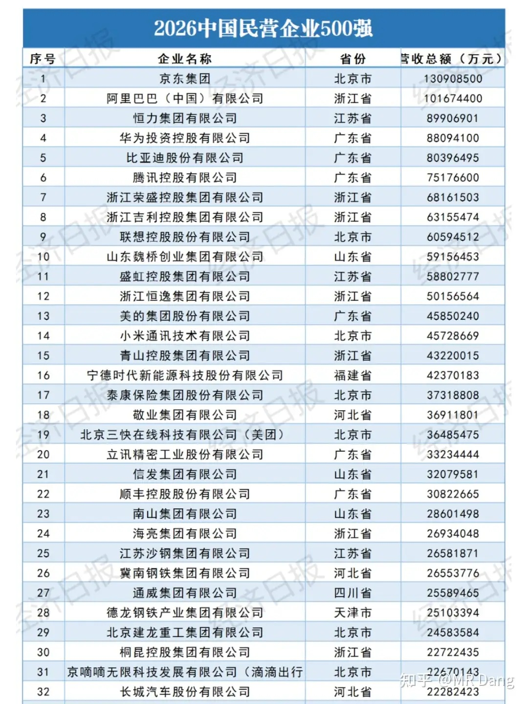
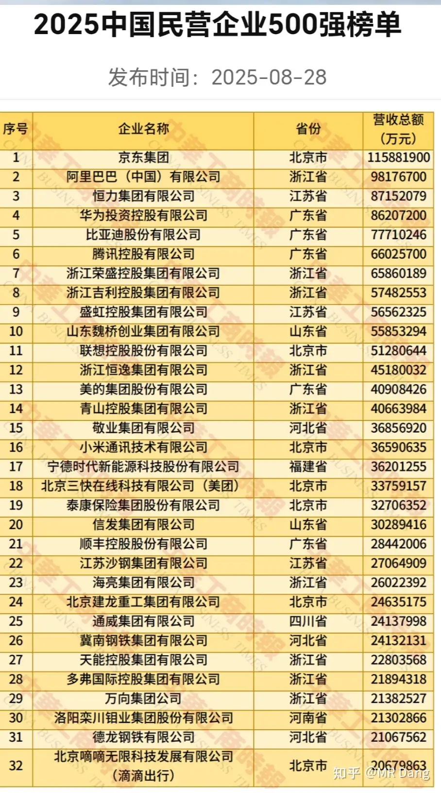
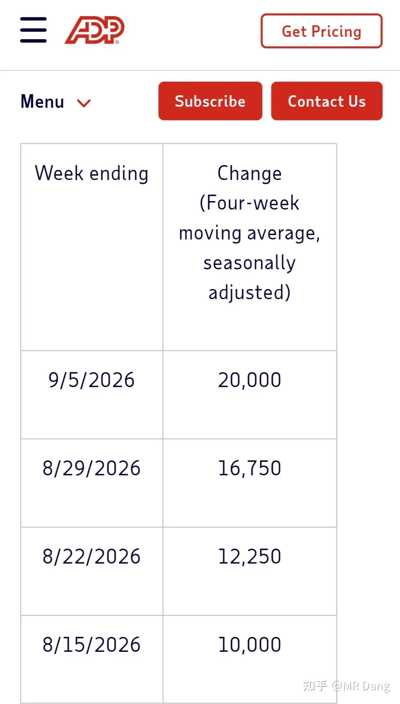
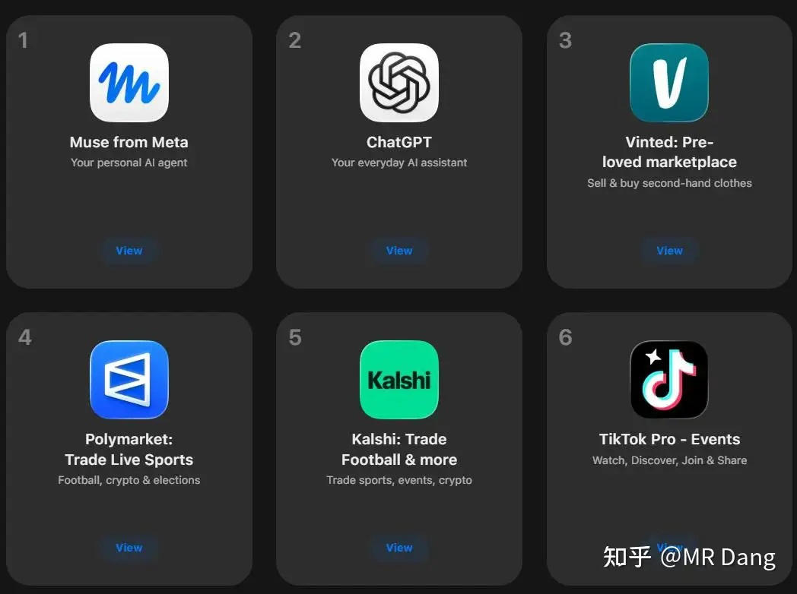
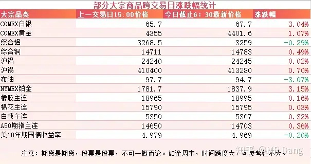
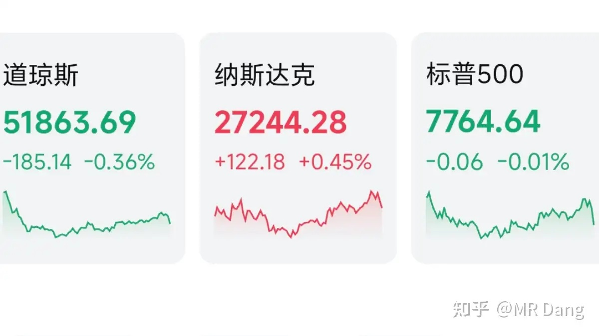

# 如何看待2026年9月23日A股市场行情？

---

**发布时间**: 2026-09-23 07:30  |  **原文链接**: https://www.zhihu.com/question/2083219557511066191/answer/2085994328468541959  |  **点赞数**: 149 人赞同

**作者信息**: MR Dang | 证券从业资格证持证人

---

## 正文内容

### 昨天全国工商联发布了2026民营企业500强名单

篇幅所限，我这里就贴前30多名，完整名单可以搜相关报道。

这个排名不按照净利润来，而是按照营业收入进行降序，简单粗暴，相对来说也算公平。

和去年相比，前10名里只有第9名发生了变化，联想从去年的第11上升到了第9。

整体数据的话，500强营收加起来近45万亿，同比增长4.35%，平均下来每家大概是900亿左右。

净利润合计1.83万亿，同比增长1.3%，增速不及营收，平均下来每家大概是36亿多。

有点增收不增利的倾向。

---

### 美伊局势

昨晚有媒体报道沙特重启输油管道，延布港的原油出口也将恢复，油价随后应声而落。

另有媒体报道伊朗总统佩泽希齐扬昨天搭乘专机，从德黑兰飞赴美国纽约，出席第81届联合国大会高级别周活动。

他预计将于今天晚上在联大一般性辩论上发表讲话。

由于他去的这个时间比较巧，外界猜测是不是有可能在第三方的斡旋下达成什么协议。

---

### 西大ADP数据

昨晚ADP就业数据公布了，四周移动平均水平来到了两万，说人话就是可以理解成每月新增8万。

这个数据有边际改善的倾向，稍微偏鹰一些，不过息都加了，也不在乎这种小数据了。

---

### Meta Muse登顶App Store

这是目前美区免费App Store的实时排名，Muse已然登顶。

从9月8日上线算起来，到今天也只是半个月时间，这个爆火的速度算得上迅疾了。

和排名第二的ChatGpt不同的是，Muse的主要功能不是聊天，而是后台干活，类似于手机版的小龙虾或者workbuddy，是个人生活的小助理。

Meta这家公司的流量大，可以借助自己的用户数据直接冷启动。

Muse目前分三档，免费，20美元/月，100美元/月。

由于它的定位是个人生活助手，比如订酒店，购物，点外卖，所以商业变现的想象空间也比较大，最不济也能接入广告进行变现，不完全依赖订阅费。

具体到投资的话，和大A没什么直接联系。

有的投资者认为国内某互联网巨头和他商业模式类似，workboddy珠玉在前，又有社交网络优势，做一个类似的东西很容易。

至于CPU概念的话，因为这玩意儿的计算不在手机上运行，而是在云端，要占用大量的CPU资源，所以对CPU确实是利好。

但是这个订单还是要给那几个巨头，国内很多企业算是蹭概念的。

---

### 大宗商品

有色整体表现较好，美铜创历史新高。

原油因为消息面有所回落。

农产品高位震荡，美债收益率也回来一些，A50期指看着还行。

### 外围市场

美三大股指涨跌不一，纳指领涨。

板块上半导体，有色，生物制药等行业表现比较好。

---

昨天个人组合净值纳米绿，银行没动，资源微红，消费微绿，电网绿大半个点。

整体市场氛围也差不多，绿多红少，中位数稍微有点绿。

热热闹闹一天就这么过去了，钱没挣到，但是参与感还是要有的，一会儿涨上去了，一会儿又跌回来了，主打一个好玩但不挣钱。

---

### 一个喜欢保护韭菜的博主，希望大家少少踩坑，多多赚钱！！！

> [!comment]- 点击展开评论
>
> | 用户 | 时间 | 内容 |
> | :--- | :--- | :--- |
> | 审核 |  | 评论关了？ |
> | 无限 |  | 老师早[感谢] |
> | &nbsp;&nbsp;&nbsp;&nbsp;MR Dang |  | [感谢] |
> | 功成树下的庆功 |  | 看了又有什么用？我知道美股新高了，a股新高是多少呢？6000点？ |
> | &nbsp;&nbsp;&nbsp;&nbsp;潇夏 |  | 还没到晚上睡觉时间[捂脸] |
> | 大千世界的尘埃 |  | [感谢] |
> | &nbsp;&nbsp;&nbsp;&nbsp;MR Dang |  | [感谢] |
> | 我是一颗桃子吖 |  | 早[感谢] |
> | &nbsp;&nbsp;&nbsp;&nbsp;MR Dang |  | [感谢]早啊 |
> | 乐妈 |  | [感谢][感谢][感谢] |
> | &nbsp;&nbsp;&nbsp;&nbsp;MR Dang |  | [感谢] |
> | 于志文 |  | 早！ |
> | &nbsp;&nbsp;&nbsp;&nbsp;MR Dang |  | [感谢] |
> | 簌簌 |  | 再坚持五天！早安[感谢] |
> | &nbsp;&nbsp;&nbsp;&nbsp;MR Dang |  | [感谢] |
> | 奶片 |  | 哥早[感谢] |
> | &nbsp;&nbsp;&nbsp;&nbsp;MR Dang |  | [感谢]早啊 |
> | gfhk |  | 早哦[感谢] |
> | &nbsp;&nbsp;&nbsp;&nbsp;MR Dang |  | [感谢] |

---

*本文件从 MR Dang 知乎页面转载*

**作者**: MR Dang  
**链接**: https://www.zhihu.com/question/2083219557511066191/answer/2085994328468541959  
**来源**: 知乎

*著作权归作者所有。商业转载请联系作者获得授权，非商业转载请注明出处。*

---

## 相关阅读

- [[20260921-如何看待2026年9月21日A股行情？|上一篇：如何看待2026年9月21日A股行情？]]
- [[20260924-如何看待2026年9月24日A股市场行情？|下一篇：如何看待2026年9月24日A股市场行情？]]
