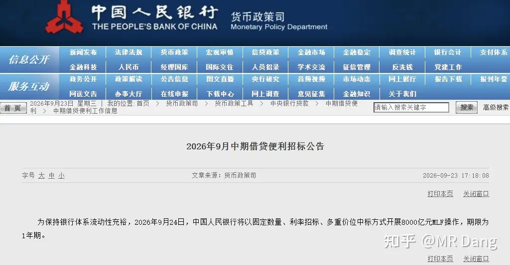
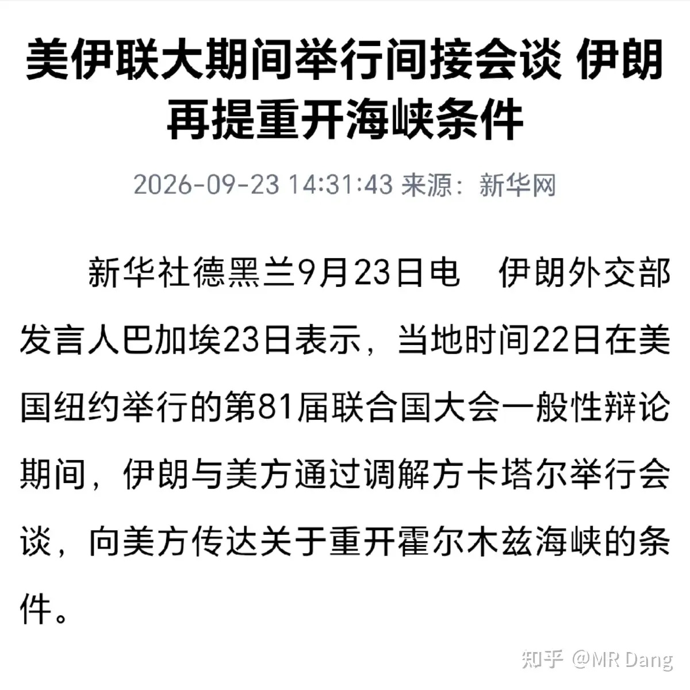
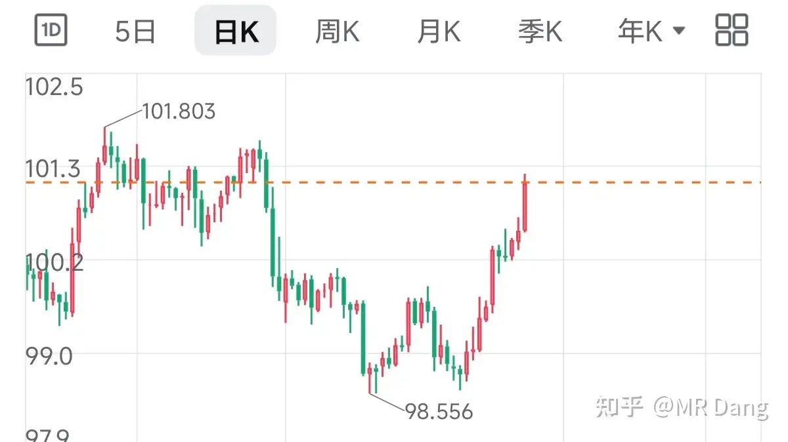
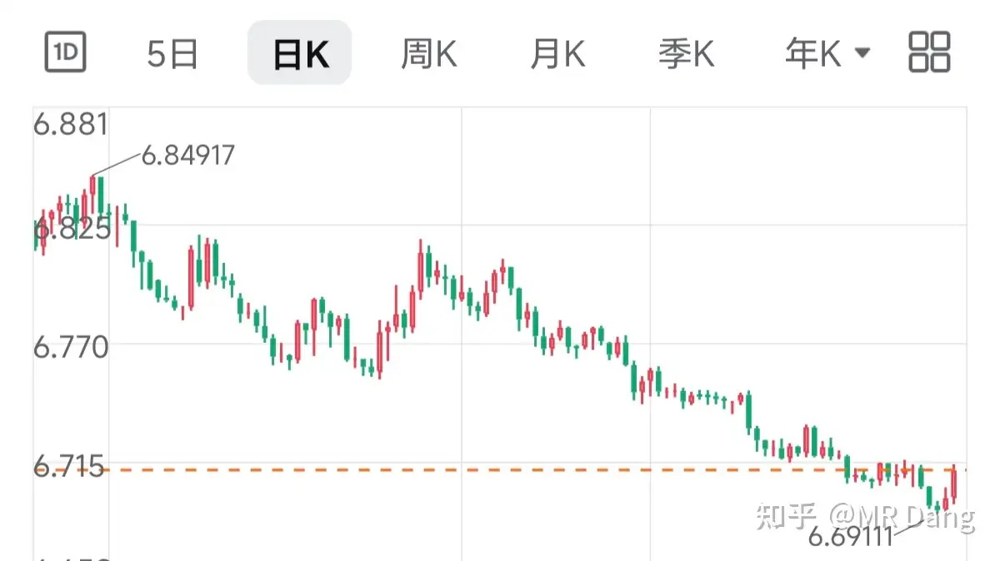
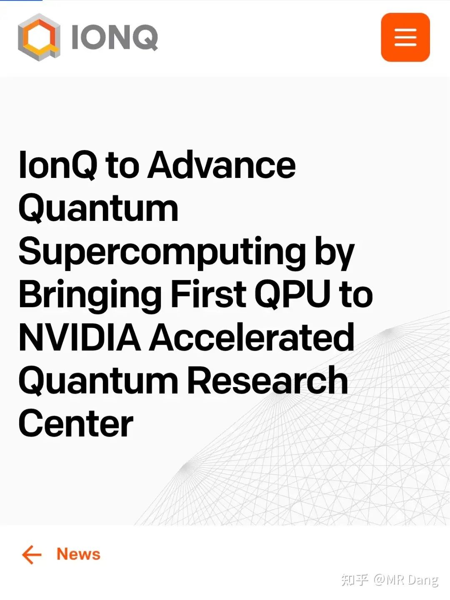
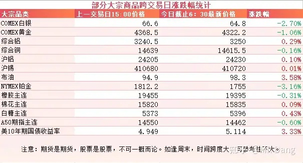
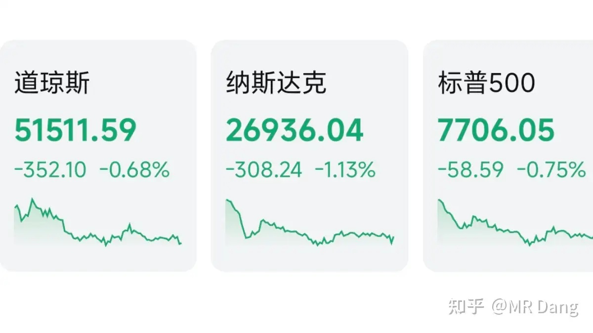

# 如何看待2026年9月24日A股市场行情？

---

**发布时间**: 2026-09-24 07:30  |  **原文链接**: https://www.zhihu.com/question/2083579595715098483/answer/2086356732184359061  |  **点赞数**: 151 人赞同

**作者信息**: MR Dang | 证券从业资格证持证人

---

## 正文内容

### 央行

央行发了很多公告，比如有隔夜逆回购的，每日不超过一万亿。

图中的这个是8000亿麻辣粉，一年期。

对应的是9月28到期的6000亿麻辣粉，相当于加量续作2000亿。

很多读者看了很久了，还搞不清楚这个MLF是什么东西。

简单的说就是央行批发给商业银行的钱，通过商业银行再投放到市场。

这个数字投放的超过到期的，就是加量续作，属于边际宽松，对资本市场来说是一个小利好。

---

### 美伊局势

两边谈了三小时，什么都没达成，伊朗那边还是永久停止侵略，立即解除封锁，立即解冻资产这些诉求。

原油价格再度上涨，据CME美联储观察工具，10月加息概率来到了7成左右。

---

### 美元指数

美元指数持续走强，创近期新高。

### 但与此同时，绿票子兑红票子的汇率画风是这样的

这里很多人不理解，美元指数上涨表示绿票子强势，是升值，为什么兑红票子的汇率一直在贬值？

这里其实是被“美元指数”这个名字给误导了，以为美元指数和大盘指数一样，综合反应美元的强弱。

而实际上美元指数是美元和六种货币汇率的几何平均值，这6种货币里欧元权重占了近6成，日，英，加拿大各一成左右，瑞典瑞士加起来也是一成左右。

所以美元指数反映的是美元对发达经济体货币的强弱，无法体现美元对新兴市场货币的走势。

通过这两张图大概可以看出来，整个世界范围内，红绿票子都在相对升值，而欧元区则在快速贬值。

---

### QPU

美国量子计算公司IonQ宣布完成了业界首个端到端实时量子纠错解码器演示。

量子计算机最大的毛病就是算着算着就出错。

量子比特太脆弱，稍微有点干扰就乱套。

以前算完了以后要停下来检查进行纠错，效率极低，还容易修着修着又错了。

IonQ这次搞的东西相当于让量子计算机一边算一边修，效率大幅提升，不用频繁停机检修。

正是因为有了容错，IonQ计划把自己的256比特量子计算机搬进英伟达的实验室，和英伟达最顶级的AI超算用专用高速线直接连在一起。

英伟达副总裁还说了句很狂的话：“每一台超级计算机都将成为量子超级计算机”。

以后除了CPU，GPU，又多了个QPU。

嗯。。。可能利好量子板块吧。。。

新世界的大船上，也有了量子的一席之地。

---

### 大宗商品

有色整体有点分化，加息预期升温，贵金属走弱，工业金属还行。

原油又逼近100美元大关了。

农产品高位震荡，橡胶距离两万大关也不是很远了。

美十年期长债收益率飙升，来到了5.11，看着着实令人不安。

A50期指承压。

### 外围市场

美三大股指回调，纳指领跌。

行业上除了油气，没什么热点，大部分都是绿的。

然后现在有个比较重要的商业模式的逻辑正在变化，就是Muse上线以后，资本市场正在重新定价中间商赚差价的商业逻辑。

如果个人Ai助手以后成为主流，会占据很大一部分流量入口，那以前凭借信息不对称，中间商赚差价的模式就会被直接冲击。

美股现在有这苗头了，我估摸着要不了多久东大这边也会有Muse的竞品出现，到时候这些行业也面临尴尬的境地，比如旅游平台，订酒店，订机票，网约车这些。

还有外卖平台，这个感觉上也会受到影响。

---

昨天个人组合净值回撤小半个点，银行纳米绿，资源绿一个半，消费微红，电网绿一个多。

绿多红少，体感不太好。

行情给人的感觉就是真的要放假了，心思已经完全不在资本市场上了。

整个市场大概是1800多家企业上涨，另外近3600家下跌，市场中位数大概是跌了0.6%左右，赚钱效应一般般。

市场人气比较高的还是在地产板块，小作文越传越离谱，很多投资者一看板块内波动比较大，都在期待会放什么大招。

我个人看法是基本上能给的政策都给了，再挤也很难挤出什么天大的利好了。

现在主要是靠想象力，就像美女戴了墨镜和口罩一样，有一种朦胧美。

而大多数情况下摘了墨镜和口罩，颜值是会下降的，最后还是要回归基本面的。

---

### 一个喜欢保护韭菜的博主，希望大家少少踩坑，多多赚钱！！！

> [!comment]- 点击展开评论
>
> | 用户 | 时间 | 内容 |
> | :--- | :--- | :--- |
> | 有屎不拉夹着玩 |  | 最后一句说的太好了，就靠想象力过日子呢[捂脸] |
> | &nbsp;&nbsp;&nbsp;&nbsp;MR Dang |  | [感谢] |
> | 等亿会儿就去学习 |  | 又是一年924，可惜今时不同往日了[流泪] |
> | &nbsp;&nbsp;&nbsp;&nbsp;MR Dang |  | [感谢] |
> | MCC |  | 这波行情结束后我就等2700回收破烂了 |
> | &nbsp;&nbsp;&nbsp;&nbsp;MR Dang |  | [感谢] |
> | &nbsp;&nbsp;&nbsp;&nbsp;明心见性 |  | 很难回到2700 体量不一样 |
> | 冷眸 | 22 小时前 | 宏桥还拿着没。拿了半年了，亏死了[感谢][感谢][感谢][感谢] |
> | &nbsp;&nbsp;&nbsp;&nbsp;disco | 22 小时前 | 都说了嘛！硬逻辑！闭眼入 |
> | &nbsp;&nbsp;&nbsp;&nbsp;冷眸 | 22 小时前 | 哈哈😃 |
> | legend1506 |  | 之前豆包不是和联通就做过这个模式吗？ |
> | 红.德仔 | 3 小时前 | 中秋大吉大利 |
> | momo |  | [感谢] |
> | &nbsp;&nbsp;&nbsp;&nbsp;MR Dang |  | [感谢] |
> | 酒鸠 |  | 早上好 |
> | &nbsp;&nbsp;&nbsp;&nbsp;MR Dang |  | [感谢] |
> | Spring day |  | [感谢]早 |
> | &nbsp;&nbsp;&nbsp;&nbsp;MR Dang |  | [感谢] |
> | 薛定谔的猫耳朵 |  | [哇][感谢] |
> | &nbsp;&nbsp;&nbsp;&nbsp;MR Dang |  | [感谢] |

---

*本文件从 MR Dang 知乎页面转载*

**作者**: MR Dang  
**链接**: https://www.zhihu.com/question/2083579595715098483/answer/2086356732184359061  
**来源**: 知乎

*著作权归作者所有。商业转载请联系作者获得授权，非商业转载请注明出处。*

---

## 相关阅读

- [[20260923-如何看待2026年9月23日A股市场行情？|上一篇：如何看待2026年9月23日A股市场行情？]]
