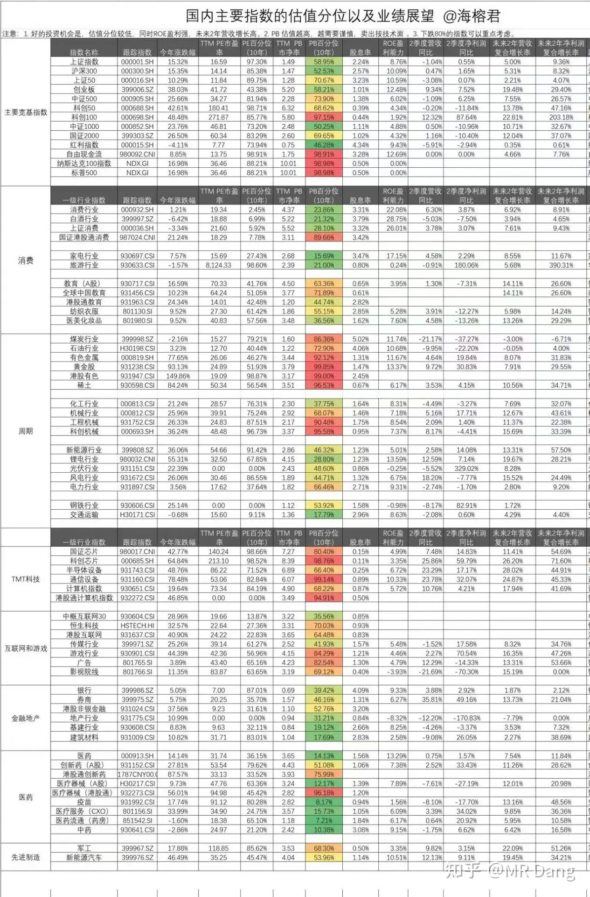

# 如何看待2025年11月3日股市行情？

---

**发布时间**: 2025-11-01 08:26  |  **原文链接**: https://www.zhihu.com/question/1967541565548392967/answer/1967870035449091044  |  **点赞数**: 551 人赞同

**作者信息**: MR Dang​独立投资人，全网无其他平台，无小号无私域，不接广不卖课

---

## 正文内容

三季报结束了。

根据目前的估值情况和三季报情况。

两条线，一个是景气度挖掘。

另一个是困境反转埋伏。

1，景气度挖掘这块儿。

钾肥，有色，磷矿(不是磷化工)都处于比较景气的周期，涨幅情况的话，有色有些提前透支预期了，另外两个基本和周期同频，所以还存在个别低估品种，可以发掘，特别是钾磷资源的确定性高，估值尚可，要重点关注。

2，困境反转埋伏这块儿。

家电，旅游，白酒估值处于20分位左右，目前看还处于L形探底中。地产下行周期下，中产消费能力被大幅限制，可能房产止跌后，随着股市的景气也许可以激发消费欲望。目前个别优秀品种可以作为长期分红股配置防守，等待时机，平滑周期。

最让我关注的是药房这块儿的估值，从数据来看，整个行业目前也是缓慢出清中，但是个别龙头已经释放出明显的拐点信号，三季报数据极好，可能是消费类最先v形反转的标的，同时估值在10分位以下。

值搏率极高，长期来看，几乎想不到输的理由，个人非常看好，目前市场上的关注度低，结合目前资本市场大盘指数的位置，我倾向于作为中期配置。

加班加点研究中。

一个喜欢保护韭菜的博主，希望大家少踩坑，多赚钱。

---

## 精选评论

| 用户 | 时间 | 内容 |
| :--- | :--- | :--- |
| 什么时候的事 |  | 连锁药店别碰，我就是做这个行业的。这个财报基本都是收割加盟店做出来的。 |
| &nbsp;&nbsp;&nbsp;&nbsp;MR Dang |  | 行业内的人士少有买自己行业股票的，这种现象在哪里都有 |
| 被窝 |  | 每个行业都有自己不堪的内幕，收割加盟店至少也是真金白银的 |
| 未央 |  | 每天过来看看老师，顺便看看有没有作业抄，目前还在空仓中 |
| &nbsp;&nbsp;&nbsp;&nbsp;MR Dang |  | 好谨慎 |
| 在齐太史简 |  | 为了醒了就能看，我专门睡到现在在醒来。 |
| &nbsp;&nbsp;&nbsp;&nbsp;MR Dang |  | 你这思路绝了 |
| Raven |  | 薛定谔的起床时间。 |
| 一直游到海水变蓝 |  | 👍🏻 |
| ncepu梦魇 |  | 大佬的评论区也是一个宝矿，每天都来挖挖 |
| &nbsp;&nbsp;&nbsp;&nbsp;MR Dang |  | 黄金矿工 |
| 如来熊掌 |  | 勤奋加天赋，大佬赚钱我是不嫉妒的 |
| &nbsp;&nbsp;&nbsp;&nbsp;MR Dang |  | 每次财报季忙的和狗一样，研究速度跑在机构前面就能多赚点，不然就吃土了 |
| Echo |  | 我们还是跟着大佬好呀，最起码能跟着喝汤 |
| 逆天唯我 |  | 这数据哪里来的 |
| 泽旭 |  | 季度，半年度，年度财报不都全网公开的？ |
| k591998667 |  | 药房这个东西没什么技术壁垒，这家能成功，另一家也能抄袭，所以选个pd低，股息率高的，再看有没负面消息，老祖我这想法有没错 |
| &nbsp;&nbsp;&nbsp;&nbsp;MR Dang |  | 你别说，还真有，客户粘性，现在有些差异化搞得好的，客户粘性搞得不错 |
| lish |  | YFYF和DSL这两家龙头就不错 |

---

*本文件由自动脚本从MR Dang知乎页面提取生成*

---

**作者**: MR Dang
**链接**: https://www.zhihu.com/question/1967541565548392967/answer/1967870035449091044
**来源**: 知乎

*著作权归作者所有。商业转载请联系作者获得授权，非商业转载请注明出处。*
