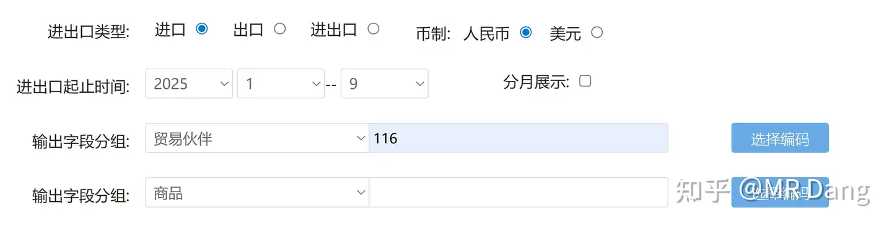

# 如何看待2025年11月17日A股行情？

---

**发布时间**: 2025-11-17 07:30  |  **原文链接**: https://www.zhihu.com/question/1972440537043809031/answer/1973654178028094061  |  **点赞数**: 559 人赞同

**作者信息**: MR Dang​独立投资人，不接广不卖课

---

## 正文内容

周末最大的事情是高市事件。

一般这种事情，直觉上是利好JG的。

但是JG股历来的表现就是渣男，所以这方面其实不好把握。

除非你提前布局了，不然其实冒然参与也是容易吃亏的。

也不知道我的JG不知道能不能喝口汤啊。

除此之外，也可以多做一些扩展的推理。

比如，东大和11区之间，东大是贸易逆差国。

逆差国一般都可以打经济牌，贸易牌的。

这个牌会怎么打？

站在东大这边，参考对西大的出牌选择，东大出牌都是有讲究的。

选的制裁标的，通常具有以下特点：

1.可替代性强。

2.产业从业人数多。

3.单位价值低。

原因其实很好理解，就是用最小的损失给对面造成最大的舆论压力。

比如对西大来说就是大豆。

那类比11区的话。

这个类似于大豆的物品就是水产品。

所以资本市场可能炒作这方面的预期，这方面本身也没几个标的，可能名字里带水产的会有一些共识吧。

但是需要提醒大家的是，水产品公司的质地都不怎么样。

而且水产品是今年6月多放开的。

在那之前的话，水产品公司业绩也很一般，意味着这种利好程度相当有限。

其中风险和收益，大家自行衡量。

至于怎么查询自日本进口的产品数据？

首先找到

然后找到：

接着：

日期勾选2025年1月到9月。

贸易伙伴输入日本的编码116

商品那里输入编码2位数，从01到99全部勾选。

结果按金额降序就行了，里面会有一些短期机会，比如电机什么的，但是没有很强的指向性，需要你自己有知识储备。

站在11区这边，可以打的牌其实也不是很多。

如果是我的话，出于限制东大的考量，

作为反击，可能会打出光刻胶和高纯氟化氢的牌。

当然也不一定，只是一种推理，可能利好国内的相关企业。

（本就红得发紫的氟化工又大赚一笔）

总的来说，作为投资者，是不希望地缘产生巨大的扰动的。

资本市场对不确定的东西是厌恶的。

但是硬要找机会的话，思路就是：

判断东大逆差还是顺差→如果是逆差，则贸易领域可能有机会→分析东大进口结构/对手国出口结构→机会可能在出口产品中的低附加值产品（我方出牌）/战略物资（对方出牌）

隔夜商品方面，距离上周五收盘，金银跌了不少，有色承压。

但是现在形式吃紧，金银说不定又会抬头。

东大不语，只是一味地囤油和囤金。

囤金大家都知道了，囤油的话，2025年10月的进口量超过了4835万吨，去年同期是4400多万吨。

囤金又囤油，背后的信号耐人寻味。

我的话，持有的ZJKY，一直只有一个判断，就是金价4500就止盈。

要说原因的话，就是我感觉可能金价4500会有反复，而且zjky在有色里是独一档的，拿着还比较踏实。

如果判断错了，那就为没有严格遵守30%止盈付出代价。

最近在看旅游板块，有一个标的看着挺舒服的，但是股息率比较低。

旅游替代这块儿的逻辑个人感觉不够硬。

旅游整个版块都没有预期股息率超过4%的东西，看着挺难受。

但是个别景区的财报数字看着属实诱人，还要进一步确认。

最后还是提醒大家注意风险，如果你拿着的标的让你周末睡觉不踏实，影响了你的睡眠质量。

那说明你的仓位重了。

一个喜欢保护韭菜的博主，希望大家少少踩坑，多多赚钱。

---

## 精选评论

| 用户 | 时间 | 内容 |
| :--- | :--- | :--- |
| 慎独 |  | 巴菲特说过如果你不打算持有一个股票十年，就连十分钟都别考虑买它。对我们普通人而言，合适的估值，清晰的基本面就是防止被割韭菜最好的保证至于投机的事还是交给量化和大佬们去干吧 |
| &nbsp;&nbsp;&nbsp;&nbsp;MR Dang |  | 对的，投机很难的 |
| 慎独 |  | 毕竟鄙人不善择时，dang哥你不擅长，我这抄作业的也没办法呀 |
| &nbsp;&nbsp;&nbsp;&nbsp;MR Dang |  | 是啊，跟着我投机得赔光光 |
| Raven |  | 投机很烧脑的，还是价投用着舒服，还能保护发量。 |
| 我有厌蠢症 |  | 每天就等“有的，兄弟，有的” |
| &nbsp;&nbsp;&nbsp;&nbsp;MR Dang |  | 有的，兄弟，有的 |
| 小妮 |  | 哈哈哈 |
| 蜗牛 |  | 取个好名字  好重要 哈哈哈哈哈哈哈 |
| 祝君 |  | 投资最重要的是晚上能睡得着觉 |
| &nbsp;&nbsp;&nbsp;&nbsp;MR Dang |  | 是的 |
| felipe dupont |  | 我看到一些说法，东大在沿海地区应该建了不少仓库屯油，每日进口量比沙特一天产油量还多10%，估计会屯到半年左右的量。另外就是粮食，粮食的话大概是2年，以上指的是没有生产没有进口，社会纯消耗可以维持的时间的量。还有金。大概就是粮+石油+黄金。电不用说，西北刚建好第四代核反应堆，小规模发电，验证以后应该会扩大规模和数量。未来就是(内+外)黄金+粮+油，加上西北发电(新一代核/风水电)+储能一体。 |
| felipe dupont |  | 另外，白银可能要被美国流入管制清单，东西大前后脚列入清单了 |
| 永夜的持灯人 |  | 就是再做战争准备，还有军工，电里面我比较看好风电和光电 |
| CCCUTE |  | 不妨碍跌麻 |
| 星星之火 |  | 恒哥早上好 |
| &nbsp;&nbsp;&nbsp;&nbsp;MR Dang |  | 闭嘴 |
| xjhxjh |  | 请问大佬，买了130手hx，长期持有。是不是不论股价高低，都不卖，股价高低只是股息低高，股价是加仓的依据，需不需要，盈利30%止盈？请大佬解惑。谢谢大佬，不胜感激 |
| &nbsp;&nbsp;&nbsp;&nbsp;MR Dang |  | 止盈是原则 |
| xjhxjh |  | 知道了。谢谢大佬 |

---

*本文件由自动脚本从MR Dang知乎页面提取生成*

---

**作者**: MR Dang
**链接**: https://www.zhihu.com/question/1972440537043809031/answer/1973654178028094061
**来源**: 知乎

*著作权归作者所有。商业转载请联系作者获得授权，非商业转载请注明出处。*