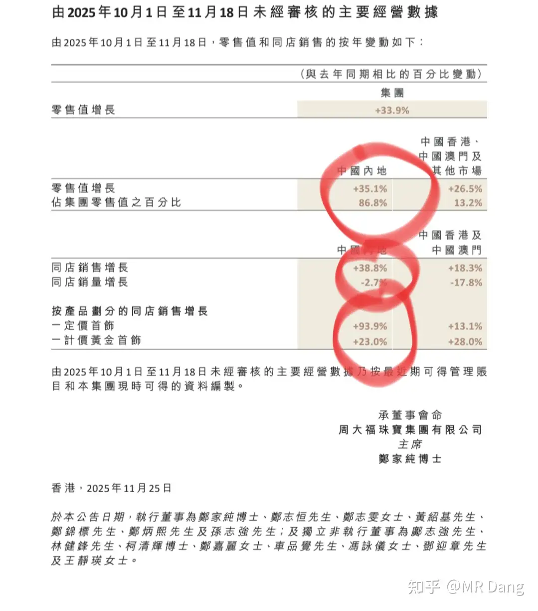
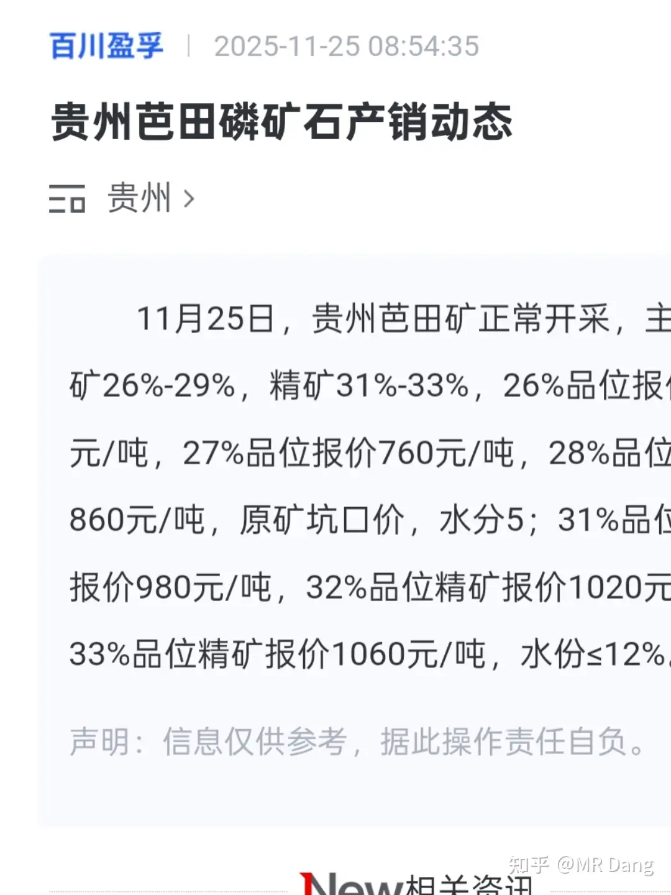
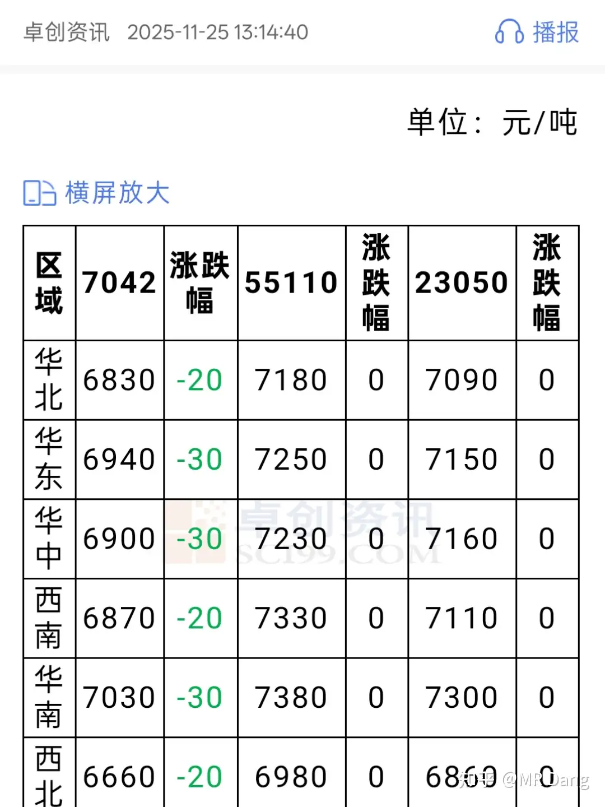
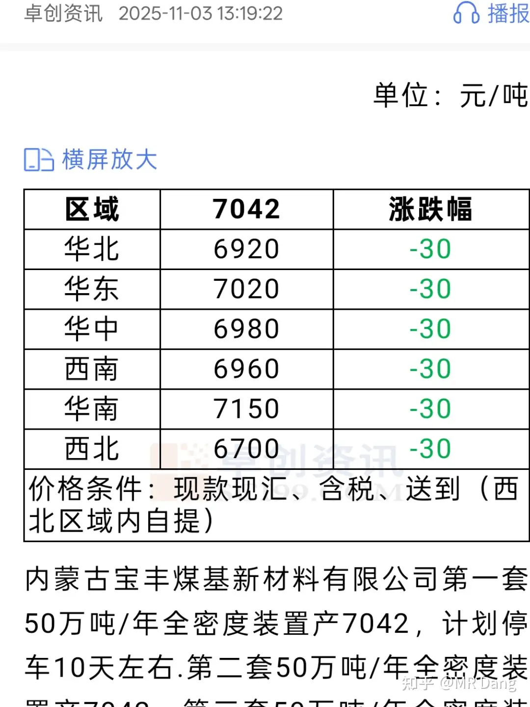
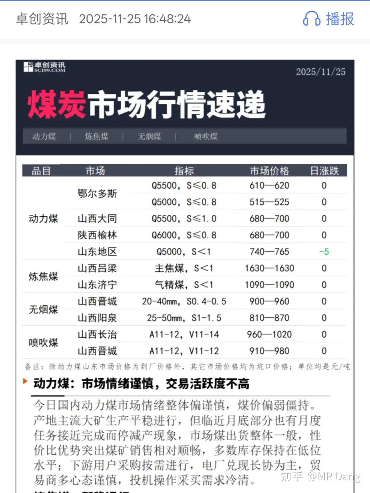

# 怎么看待2025年11月26日A股市场行情?

---

**发布时间**: 2025-11-26 07:27  |  **原文链接**: https://www.zhihu.com/question/1976427006389421075/answer/1976915054512326108  |  **点赞数**: 490 人赞同

**作者信息**: MR Dang​独立投资人，不接广不卖课

---

## 正文内容

想到哪聊到哪，主要是我跟踪的一些标的。

1，有关银行股。

银行股是防空洞，昨天大盘和个股反弹了不少，但是诡异的是银行股也涨了。

明明一片歌舞升腾的景象，却有人偷偷抢购防空洞的门票了，看来大家对牛市的信仰还是不足，随时想着跑路。

急需充值信仰，哈哈。

2，有关摩尔线程。

读者里真有中签的，羡慕嫉妒恨。早上起来一翻小纸条天塌了，流下了眼馋的口水。

说实在的，新股方面我可太有经验了，经我手卖出去的新股得有上千只了。

我的经验就是，主板的话，就盯着封单，封单＜200万股，扔出去。没时间盯盘的，发现开板的第一时间卖。

摩尔线程这种属于科创板的更简单，第一天集合竞价的时候报个中签价，随缘去，开到哪里算哪里，大概率比精心挑选的价位会要好。

当然对我来说，追求的是确定性，也有很多股卖了以后最后成大牛股了，但是没精力做判断和追踪，都是直接卖了完事。

3，有关C公司。

每次写完个股分析我都很心虚，就怕一个高开套一群人，压力真的挺大的。

还好，开的不是很高，这种公司流动性不是很足的，我不推荐大家一窝蜂的买，可以蹲回调的，便宜的时候买，股息率才高。

我是来搞价投的，不是带着家人们往里冲锋的，感觉有点解释不清了。

然后就是这个赛道的龙头企业zdf昨天发了三季报和10月以及11月的经营数据。

内地销售额增长了35%，同店销售额增长了38%，同店销量下滑了2.7%。

一口价首饰增长了94%，克价首饰增长了23%。

总结的话，就是高金价背景下，消费心理直接两极化了，要么就买投资金条，多一块的溢价都不想掏，要么就买一口价首饰，纯纯追求情绪价值。

只要算不出来克价是多少，就没有溢价，主打一个鸵鸟心态。

4，有关Bt公司

因为有想买回bt的想法，所以看了下数据。

28%品位坑口价还是860/吨，这一两个月一直是这个价，没涨没跌。

28%车板含税价可能在950左右，保持不动。

不过有个动态是同地区的其他矿厂表示磷矿紧张，少量发运。

像磷矿这种产品，挖了就有，所谓的紧张可能是这一段时间磷矿价格高，把今年的指标挖的差不多了，年底了没指标了。

如果这个推测成立的话，那可能大概也许12月份磷矿价格还有往上走走的可能性，利好还有指标的磷矿企业。

一直在蹲一个合适的价格。

5，有关BF公司

内蒙古基地在经历过检修后，目前满产，100万吨生产7042，50万吨生产9047。

宁夏基地一个价，生产的牌号除了7042还有55110和23050，也是满产。

对比月初的同牌号7042数据，每吨售价降低了大约80到90元，降幅1.5%左右。

原料端是长协煤，应该没什么变化，目前的煤价基本也没什么变动。

bf的成本优势最显著，我不担心价格跌，卷王不怕考试。

主要是新疆项目不知道什么时候落地，新疆项目落地的时候就是bf腾飞的时候。

6.有关D公司

最近流感比较猖狂，微微利好D公司。

上次媒体报道了D公司的负面新闻我一直没提。

主要是考虑到D公司干的事情全行业也在干，而且卡里的钱本来就是大家自己的，拿出来买个日用品好像也不是特别大的过错吧？

可能是我持有股票，屁股坐歪了，反正我是这么想的。

D公司我是非常看好的，客户粘性太强了，卖的东西是贵了点，但期情绪价值给的很到位。

哪位股东要是不幸中招了，也可以给dsl贡献点营业额，体验一下。

7，有关低价铝

很久没提了，自从止盈后就没碰过了。目前看价格还行，但不是很心动。可能除权后再跌一跌，回调到我之前上车的位置会重新考虑。

回调不到就算了，强扭的瓜不甜。

8，有关G公司

除权后又跌了一点，股息率更高了，很心动。

昨天的分红被我用来买了C公司，所以G的仓位相对就少了。

打算蹲一个好位置把仓位补到目标仓位。

虽然近期表现不佳，依然看好一品一证带来的估值提升和价值发现。

9，有关氯碱工业

一直在看相关公司，没有一个特别喜欢的。

这个行业目前的逻辑用一句话说就是电解盐水。

通电，电解盐水，产生氯气，氢气和烧碱。

烧碱可以用来电解铝，是低价铝的上游企业，也是这个行业的主要产品，目前价格走势很差，全行业基本都在亏损。

氯气的话可以用来做成液氯或者消毒水，因为是副产品，而烧碱在赔钱，开工率不足，氯气供应就少了，需求没减少，所以液氯的价格飞涨，短时间翻了一倍。

相对来说，可能液氯产量大的公司相对来说能好一点，也算这个行业的卷王。

目前在看的有三家，L公司以氯碱为名，液氯产量也高，基本面还是可以的。

但是有个问题是L公司有B股，而B股的估值只有A股一半都不到，性价比很高，相对来说L公司的A股吸引力就不太行了。

H公司液氯产量和估值还行，但是没有实控人，小非还在大量减持，看着就难受。

J公司我感觉基本面是最靠谱的，但是奇怪的是走势特别差，今年跌个没完没了，前三季度增长了25%，结果在牛市里全年还是跌的。

我在外面看着都感受到了里面散户的绝望。

一般这种情况，要么就是天上掉馅饼，要么就是天上掉陷阱。

还得多看看多研究研究，有点吃不准，没把握的东西就不出手。

以上就是问的比较多的标的，还是那句话，长期配置，谨慎补仓。

如果确实是好股，不补仓也可以盈利，长期配置即可。

如果基本面发生变化，补仓也没用，只会越陷越深。

如果套三五个点感觉很痛苦了，那就是高估了自己对风险的承受力，建议还是退出为好，换成银行股或者债券什么的。

一个喜欢保护韭菜的博主，希望大家少少踩坑，多多赚钱！

---

> [!comment]- 点击展开评论
>
>
> | 用户 | 时间 | 内容 |
> | :--- | :--- | :--- |
> | 化石的岁月 |  | 真的是简洁明快，每个都在关键点。不得不佩服 |
> | &nbsp;&nbsp;&nbsp;&nbsp;MR Dang |  | 哈哈，谢谢 |
> | 慎独 |  | dang哥这是对这段时间提及的股票又做了次分析啊，省的有的笨蛋一个劲问这个怎么样那个怎么样。估值不高，基本面好，长期持有就得了，套了一点也不怕，毕竟卷王不怕考试 |
> | &nbsp;&nbsp;&nbsp;&nbsp;MR Dang |  | 价投博主被赶鸭子上架了 |
> | 慎独 |  | 因为怀揣着对大家的爱，无私分享自己的知识体系和投资体系，还给大家做心理按摩，dang哥你这是新时代互联网精神的践行者啊 |
> | 我是一颗桃子吖 |  | 针不戳针不戳，喂饭还管插嘴 |
> | &nbsp;&nbsp;&nbsp;&nbsp;MR Dang |  | 你的输入法真糟糕 |
> | 我是一颗桃子吖 |  | 嘿嘿 |
> | 一点点晚风 |  | 哈哈哈🤣喂完就插 |
> | Solitude SisyphE |  | 插插word |
> | 黑猫杰克 |  | 多数都有了，之前没买BT，现在也来蹲一下。最大的问题还是择时，建仓后的补仓容易控制不住，牢记控制仓位、拉开距离、上涨不加。 |
> | Anna |  | BT是哪个呀 |
> | 离开im |  | 建仓点位多少合适啊？ |
> | 黑猫杰克 |  | BTGF |
> | 黑猫杰克 |  | 我觉得回到博主第一次发磷矿那期时候的价格应该差不多了 |
> | 策钟铭文 |  | 总之，看准股息，逢低买入，银行压仓，严格止盈，一支股不值得长拿三十年，那就一天也不要碰 |
> | 北海 |  | 30年夸张了吧，3-5年还差不多 |

---

*本文件由自动脚本从MR Dang知乎页面提取生成*

---

**作者**: MR Dang
**链接**: https://www.zhihu.com/question/1976427006389421075/answer/1976915054512326108
**来源**: 知乎

*著作权归作者所有。商业转载请联系作者获得授权，非商业转载请注明出处。*

---

## 相关阅读

**📈 每日行情评价：**
- [[20251127-怎么看待2025年11月27日A股市场行情?]] - W房企股债双杀
- [[20251125-怎么看待2025年11月25日A股市场行情?]] - 白银逼空与铜价突破

**📚 投资方法教育：**
- [[20251013-什么是投资思维？普通散户该如何培养？]] - 投资思维培养
- [[20251024-怎么全面的分析一支股票？]] - 股票分析方法

**📘 地阶功法：**
- [[20251022-《地阶功法卷一》投资者必须斩杀的三个妄念]] - 投资者心态建设
- [[20251023-《地阶功法卷二》价值投资三大误区]] - 价值投资核心理念

**🔙 返回：**
- [[每日行情评价]] - 每日行情评价全部内容
