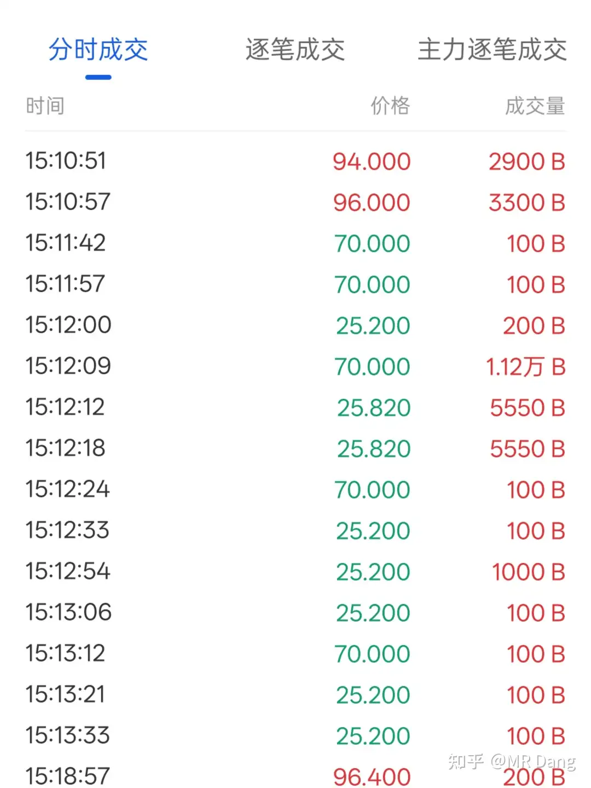
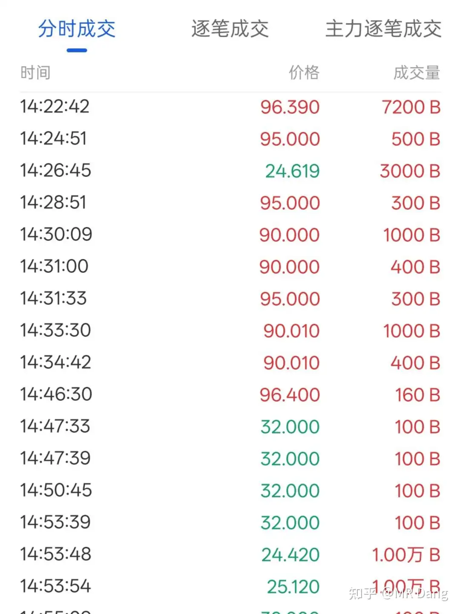

# 怎么看待2025年11月28日A股市场行情?

---

**发布时间**: 2025-11-28 07:29  |  **原文链接**: https://www.zhihu.com/question/1977151238584939599/answer/1977640326362596561  |  **点赞数**: 570 人赞同

**作者信息**: MR Dang​独立投资人，不接广不卖课

---

## 正文内容

昨夜美股感恩节，没有开盘，今天的a股就快要迷失方向了。

挑几个重点说吧：

景气度方面，我把所有商品过了一遍，大大小小几百种商品吧，除了硫磺硫酸磷矿这些方面的，剩下的高景气度商品里面，还有几个有意思的。

第一个是氩气，工业气体的一种。

氩气的下游企业是半导体和光伏，目前开工率很好，需求旺盛。

同时氩气是副产品，是分离氧气和氮气的副产品。

一般的工艺比如低温精馏法，根据三种气体的沸点不同分离不同的气体。

所以主产品是氧气和氮气。

氧气的下游企业是钢铁和玻璃之类的，房地产不行，玻璃和钢铁不行，需求不足，氧气价格就不行。

氮气可以用在食品工业，比如给零食充气。消费不行，氮气价格也不行。

氧气和氮气价格都不行，企业生产积极性就低，氩气作为副产品，供应量就低。

一边是作为副产品，供应低，一边是作为半导体的上游企业，需求高。

所以氩气的价格就蹭蹭蹭的上去了。

但是由于空气中氮气氧气氩气比例的关系，所以对生产企业来说，很难增加氩气的生产比例。

因此无解，没有什么特别好的投资机会，除非有期货可以单独投氩气。

气体公司的估值都很高，特别是有一些专门做电子特气的，比如光刻气什么的，叙事很宏大，财报很一般。

到是气体公司的上游，做空分设备的，估值还行。

某h公司从财报来看三季度重拾增长，估值略微超过了我20pe的承受能力，但是可以跟踪下，万一也许会有合适的机会。

第二个是木薯淀粉。

木薯国内种的少，全靠东南亚进口。

泰国的品质好，越南的价格低。

但是最近东南亚雨季，影响了木薯的上市，供应量就低。

咱们这边的下游企业，做粉条的，正好开工率还可以，一来一回价钱就上去了。

木薯淀粉的库存都在青岛港那边，大概十四五万多吨，占全国十七八万吨的80%以上。

因为粉条厂多。

但是也没啥投资机会，基本都是进口，没国内企业什么事，下游企业是粉条。而且有玉米淀粉作为替代品，翻不起太大的浪花。

emm，奇怪的知识又增加了。

第三个是Pvdf粉料。

这个属于氟化工产业链的，上游原料是萤石，整个产业链有限产规定，所以原料价格起不来。

下游的话，分锂电级和涂料级，锂电级不用说了，肯定价格坚挺，需求旺盛。

涂料级这几天厂家在联合涨价，有的一夜之间报价提高了近一万/吨，将近30%，太离谱。

但是下游厂家能不能接受这个报价就不好说了。

相关标的话我在看hk上市的准龙头D公司，关注度少，今年上半年增长了150%多，目前静态pe十一二倍，pb1.2，可能是这个行业估值最低的公司了。

近期回调不少，感觉性价比真的不错，看着很心动。

缺点是流通性不足，以及股息率不高，可以等一个安全边际更高的机会。

行业唯一龙头J公司也不错，流通性更好，在a股，估值刚过20pe，就是股息率依旧不行。

因为J公司有一个扩产的叙事，净利润要拿去扩大生产：2025和2026在产能上可以蹭蹭的涨。

和这两家比起来，其他几家的估值都显得太贵了，我个人就不考虑了。

更新一下昨天打算投机的w公司债券的情况，我的目标价是10块以内，目前最低价24，还没到我认为的投机区间。

大家看下面的k线图，如果以为长的跟心电图似的，没什么波动，就错的离谱了。

我给大家看看分时成交。

为什么这种企业债要设立一个500万专业投资者门槛？

要知道债券可是t+0的，这种成交价在20多和90多之间反复横跳的行情，搞得好了是一秒暴富，挣它个几倍，搞不好了就是一秒钟跳楼。

这已经不是刺激可以形容的了。

还有我为什么不建议很多投资者去做t？

如果有做t的能力，完全可以去港美股大展拳脚，t+0，波动大，可以不依赖于选股，就靠自己的择时能力赚钱。

但是以我的观察，平时再喜欢交易的人，到了港股都老实了，只是一味地低头不语。

昨天盘中还发生了一个不大不小的突发事件，就是陕西省的十六条改革。

其中有一个表述是要推进"主业不突出，经营效益差"的国企改革重组。

其实一看到这个表述，我心里已经有一些名单了，大多以西安或者曲江为名。

然后我立马把问题丢给ai，让ai也给了一个名单。

我和ai有三个公司是重叠的，我也懒得挑了，每家买了一点，总共决策用时大概45秒钟。

运气还不错，几乎没有额外的溢价，买入后大概半分钟就开始有资金拉升了，比他们快了半步。

今天看情况就要跑路了，投机这种事情，最怕夜长梦多，能赚一点就赚一点，赚多赚少无所谓。

现在甲流概念热度很高，没有把握的话还是谨慎参与，因为从投机的角度来说，现在布局已经有点晚了，风险和收益不太对等，容易挂在山顶。

哦对了，还有机器人，一个顶层表述是防止重复上市，平衡"泡沫"与"速度"。

按照我的理解，这是要车门焊死，提高行业集中度了。

还是那句话，普通投资者最好的策略就是多看少动，现在这个位置，不上不下的，多动多错，少动少错，不动不错。

一个喜欢保护韭菜的博主，希望大家少少踩坑，多多赚钱！

---

> [!comment]- 点击展开评论
>
>
> | 用户 | 时间 | 内容 |
> | :--- | :--- | :--- |
> | 花好月圆人长久 |  | 鄙人不善择时，也就比主力快半步 |
> | &nbsp;&nbsp;&nbsp;&nbsp;MR Dang |  | 哈哈，真不擅长 |
> | 天高气爽风飞扬 |  | 兄弟，撤回，让我发 |
> | 花好月圆人长久 |  | 兄弟，你今天不善择时啊 |
> | 海豹饲养员 |  | 天南择时第一人 |
> | 奋斗 |  | Dang大，fujian板块怎么看👀 |
> | 牛马协会副秘书长 |  | 先赞后看，每天来学习。Gemini告诉我H公司是杭氧股份、D公司 = 东岳集团 (港股)、J公司 = 巨化股份 (A股) |
> | &nbsp;&nbsp;&nbsp;&nbsp;MR Dang |  | 还得是ai |
> | 1111 |  | 省流总结：今天没机会，发这么多主要是为了吹一下我的投机战果 |
> | &nbsp;&nbsp;&nbsp;&nbsp;MR Dang |  | 哈哈哈，真相了 |
> | 都督上下诸琐事 |  | 那今年雨姐不用卖木薯粉条了。 |
> | &nbsp;&nbsp;&nbsp;&nbsp;MR Dang |  | 哈哈哈哈，笑的不行了 |
> | 田点什么 |  | 太带派了老铁 |
> | Dang佬的迷信马仔 |  | 我欲清仓归去，又恐迅速反弹，踏空不胜寒。与其储蓄负利，不如厮混其问，少追涨，勿杀跌，夜安眠，不应有恨，获利总在无意间。月有阴晴圆缺，股有横盘涨跌，此事总难全。但愿牛长久，你我共赚钱   锁仓麻将去了 |
> | 夏天 |  | 你还蛮有才 |
> | Dang佬的迷信马仔 |  | 哈哈 麻将一打 瞅一眼htfz板了 |
> | 夏天 |  | 羡慕 |
> | 热乎黏苞米 |  | 明年我看到10w粉丝 |
> | lucky与鱼 |  | 佬，今天早盘挂了两次海南橡胶，考虑到没有股息托底，大盘反弹有限，纠结一番还是虚虚的又两次撤回。结果它居然摸了一下涨停。以往我会拍断大腿，现在居然很平静，跟着老师学习修心功力见长。 |
> | 陈阿呆 |  | 早，礼问不同商品品种从哪些信息渠道入门做系统理解比较好？ |

---

*本文件由自动脚本从MR Dang知乎页面提取生成*

---

**作者**: MR Dang
**链接**: https://www.zhihu.com/question/1977151238584939599/answer/1977640326362596561
**来源**: 知乎

*著作权归作者所有。商业转载请联系作者获得授权，非商业转载请注明出处。*

---

## 相关阅读

**📈 每日行情评价：**
- [[20251129-怎么看待2025年11月29日A股行情？]] - 科创板与半导体
- [[20251127-怎么看待2025年11月27日A股市场行情?]] - 铜价突破与消费

**📚 投资方法教育：**
- [[20251013-什么是投资思维？普通散户该如何培养？]] - 投资思维培养
- [[20251011-下周一股市就要大跌了，作为投资者该如何应对？]] - 风险控制与心态管理

**📘 地阶功法：**
- [[20251022-《地阶功法卷一》投资者必须斩杀的三个妄念]] - 投资者心态建设
- [[20251023-《地阶功法卷二》价值投资三大误区]] - 价值投资核心理念

**🔙 返回：**
- [[每日行情评价]] - 每日行情评价全部内容
