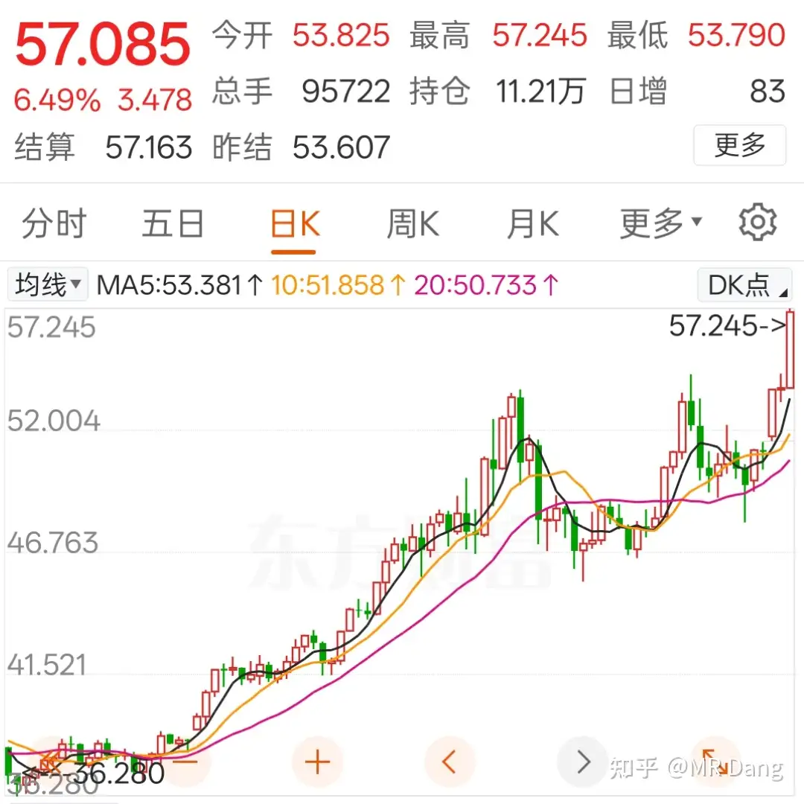

# 如何看待2025年12月1日A股市场行情?

---

**发布时间**: 2025-12-01 07:28  |  **原文链接**: https://www.zhihu.com/question/1977037179818632422/answer/1978727089977970840  |  **点赞数**: 404 人赞同

**作者信息**: MR Dang​独立投资人，不接广不卖课

---

## 正文内容

本年最后一个月了，希望今天来个12月的开门红。

周末调整了指数，半年一次的调整周期，相关情况我的整理如下：

指数调整点这里

隔夜商品方面，白银出现了强力逼空行情。

之前的白银叙事里，白银的作用主要是避险+工业+投机。

避险的话，是根据金银比对白银进行定价。

投机的话，就是根据库存和需求和对白银进行定价。

现在白银又新增了工业叙事，认为很多科技的关键技能树上都需要大量的白银，对白银的工业需求也会暴增。

各种因素之下，银价又创新高了。

相关的标的之前就分析过，A股就是X公司和S公司。

但是一般这种情况，开盘就是高开，5个点以内我会考虑是否参与。

5个点以上就算了，安全边际不够，要是高开低走得难受一整天。

除了白银还有铂金。

铂金的最主要的用途是催化剂，特别是在汽车尾气排放方面。

供应端方面，南非是主要产区，国内几乎没有单体矿藏。

所以国内相关标的都是做资源回收的，从三元催化器或者其他零部件里回收铂金，钯金之类的贵金属。

这个商业模式是比不上挖矿的，成本端虽然也比较稳定，但是无法控制在自己手里。

而且产量方面也很难扩产。

也就是，在价格和产量这最重要的两个方面，都没有话语权。

所以获益的话，有确定性的是存货部分的增值。

相关标的就是名字里带铂的G公司和另外一家创业板的H公司。

G公司目前的估值不贵，铂金行业唯一龙头，刚好20PE，没什么大的缺点，存货78亿，市值133亿。

但是G公司是一家铂金全产业链的公司，包括加工，制造，回收，销售，同时还开展了存货的套期保值业务。

铂金是它的商品，也是它的原材料，归类上应该分类为制造加工企业，存货多，但是做了套期。

受益程度很难讲，可能没有股票名字里那个铂字好使。

创业板的H公司，市值40亿，存货13.6亿，25PE。

缺点有两点，大股东在减持，以及流通市值太小。

财报看着挺好，但是也不排除是为了配合大股东减持做出来的。

这种小公司，我一般不会碰，除非特别优秀，H公司明显不属于此列。

铜也创了新高，黄金相对来说就还有点距离。

我的有色股由于人事变动，表现很差，希望能跟上其他有色兄弟，好歹是龙头，还是有信心的。

陈董是卓越的企业家和投资家，在企业管理和投资眼光上十分有见地，退居二线后肯定对股东的持股信心有影响。

但是zj是一家国企，是一家现代化的企业，不是家族企业。除了陈董外其他管理层也具有相当的水平。

等不到估值提升，就只能等待业绩兑现了，极低的税负(15个点左右)意味着zj拥有很高的业绩弹性。

其他热点的话，峨眉山有个股东免票的操作，热度很高。

很有话题度的操作，增加了知名度，增加了门票在其他收入，回馈了股东，三赢。

这波操作假如说是全面免票，其实也不会有这么高的热度。

但是给持股500股的股东免票，这话题都就上来了，为什么呢？

利用了人爱占便宜的心理。

普通的消费者，要的不是绝对的便宜，而是喜欢占便宜的过程。

要的是比别人便宜，比别人优惠，不患寡而患不均。

最主要的是还发了个公告，传播范围就增加了。

其他公司也有类似的优惠，但是没发公告，所以传播范围就没这么广。

我持有的旅游股和峨眉山定位上差不多，希望可以效仿跟进，也让佛光普照一下小股东。

但是要注意，这种事情能多大程度上改善业绩并不明朗，为了三瓜两枣的去参与的话，也容易被套哦。

还有就是电影股，谨慎，谨慎，谨慎！

电影股历来都是渣男，不管多爆的电影，最后都是一地鸡毛。

没上映就开始博弈了，点映的时候基本大资金都已经建好仓位了。

等正式上映，猫眼的数据一爆发，就开始启动行情，凸凸凸的涨。

然后票房数据还没凉，股票就凉了，只有散户一脸不忿，按计算器算业绩。

千万不要看口碑，票房，热度这些数据，想投电影股一定要提前埋伏，预判电影质量。

预判不了就不要一窝蜂的冲，非常容易挂在山顶。

到时候只能等下一部电影热卖，等下一波无脑冲锋的韭菜救命了。

究其原因，是因为电影这个行业没什么先发优势和品牌优势。

观众看的是电影本身的质量，而不是出品方制作方的品牌度。

没有哪个公司可以一直出爆款，最后股票就变成了互相掏口袋的博弈。

院线股也是一样的，运营成本高，票房分成少，主要靠卖爆米花和饮料盈利，是个很内卷的生意。

而且上限低，坐满了人就到头了，涨价很难，一年中就那么几天好日子。

不景气的时候，春节档能贡献全年一小半的业绩，剩下时间都在苟活。

国际局势方面，委内瑞拉和西大局势紧张。

委内瑞拉现在每天产油100万桶级别，其中80%卖给了神秘的东方大国。

东大日均进口是1000万桶级别，来自委内瑞拉的大概占进口总量的7%到8%左右。

委内瑞拉是欧佩克成员国，且石油储量号称全球第一，达到了3000亿桶。

但是委内瑞拉的石油多以重质石油为主，开采难度大，成本高，比不上以轻质石油为主的中东王爷。

综合成本和西大的页岩油差不多，50美元左右了。

全球目前的产油量是亿桶级，不到1.1亿桶。

全球已发现储量大概是1.7万亿桶，静态储产比在50年左右。

数据大概就这样，对油价会有多大影响可自行判断。

仅以目前的油价走势来说，没有任何这方面的定价在里面，可能预期中的规模和影响都不大，要么打不起来，要么就是摧枯拉朽，速胜。

一个喜欢保护韭菜的博主，希望大家少少踩坑，多多赚钱！

---

## 精选评论

| 用户 | 时间 | 内容 |
| :--- | :--- | :--- |
| 哈喽树先森 |  | 课代表来了，x是xyyx，s是sdzy，g是gyby，h是htkj，还有昨天说要重仓的tlgf，对不对 |
| &nbsp;&nbsp;&nbsp;&nbsp;MR Dang |  | 我不懂啊，我忘性大，胡言乱语，说过去的就忘了 |
| 丘陵的鱼 |  | 先套住再研究 |
| &nbsp;&nbsp;&nbsp;&nbsp;MR Dang |  | 哈哈哈，笑死 |
| 水银灯 |  | 早上套在gyby，中午已经研究上了 |
| cfnll |  | 油价回暖，但是宝丰涨不涨不好说，但是油价下跌，宝丰回跟跌。是这样的嘛 |
| &nbsp;&nbsp;&nbsp;&nbsp;MR Dang |  | 没那么敏感，股价涨跌是多种因素作用的 |
| cfnll |  | 学习 |
| 潘潘 |  | 有没有人跟我希望又菜又爱看又看不懂还整天ai的，呜呜呜 |
| &nbsp;&nbsp;&nbsp;&nbsp;MR Dang |  | 哈哈 |
| kangjie |  | 紫金今天这么凶的，上周埋少了 |
| 北上大人 |  | 紫金矿业今天爽吃 |
| 卖笑小哥 |  | 爽吃 |
| Gale |  | bf和dsl今天回了口大的，距离回本还有点距离 |
| 李二麻子 |  | 我也是，慢慢来不急 |
| pumpkin |  | 我距离回本还有3个点 |
| 阳台种芦荟 |  | 请问一下dsl是啥，迪生力？还是大参林？ |
| Gale |  | 大参林 |
| 晨风 |  | 老师厉害，华夏果然没跌。老师及时按摩，让我周末心情轻松。谢谢，谢谢 |

---

*本文件由自动脚本从MR Dang知乎页面提取生成*

---

**作者**: MR Dang
**链接**: https://www.zhihu.com/question/1977037179818632422/answer/1978727089977970840
**来源**: 知乎

*著作权归作者所有。商业转载请联系作者获得授权，非商业转载请注明出处。*
