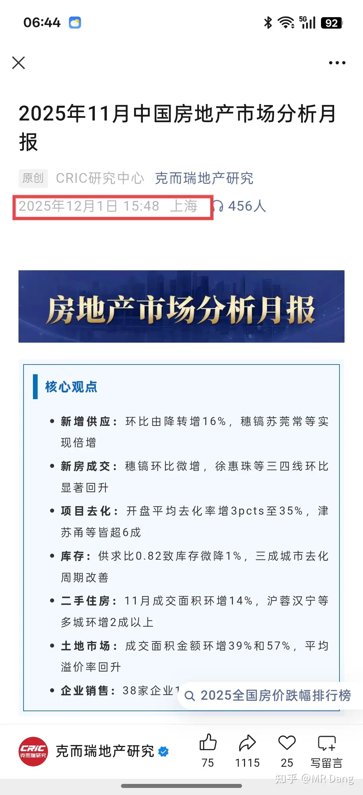
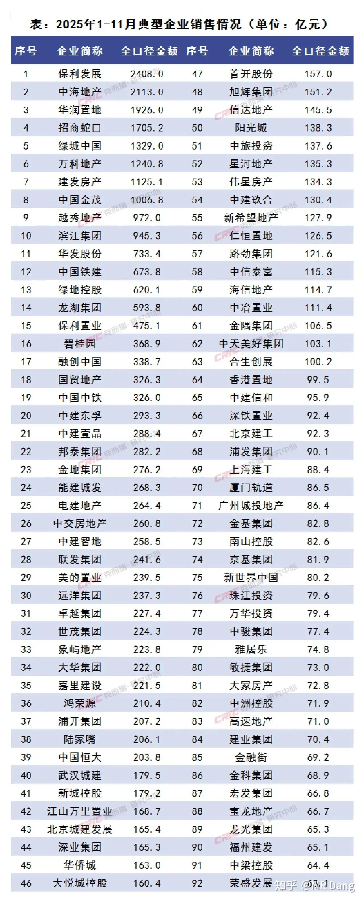
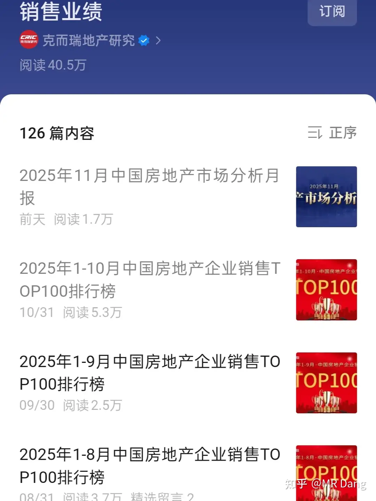

# 怎么看待2025年12月3日A股市场行情?

---

**发布时间**: 2025-12-03 07:28  |  **原文链接**: https://www.zhihu.com/question/1978953140117214446/answer/1979451995803910732  |  **点赞数**: 622 人赞同

**作者信息**: MR Dang​独立投资人，不接广不卖课

---

## 正文内容

日常唠嗑，想到哪写到哪。

昨天复盘的时候发现了某油运龙头暴跌，原来是opec+开会确定明年上半年不增产了。

油运股是要运输石油赚钱的，本来说好的石油增产落空了，业务量就会减少，股价就崩了。

opec开会分三种，一种是所有成员国部长参与的大会，半年一次，决定大的方向。

另外一种是关键成员国部长参加的中会，两个月一次，讨论执行情况。

最后一种是八个国家参与的小会，讨论自愿减产问题，每个月都开。

这次就是半年一次的大会召开后，决定不但不增产了，某些国家还要减产，把之前超过计划增产的部分吐出来。

我一般很少去预测油价，因为油价它不像其他大宗商品一样是市场化的供需关系。

石油的供应因为寡头垄断，为了保证自身利益，是会根据油价主动进行人为调控的。

根据目前的表态和油价，以及西大的页岩油综合成本，布油60美元应该算是平衡线，如果跌破55美元可能会继续减产人为干预。

这种事情也只能是随机应变，油价到哪了说哪的话，opec+那二十多个国家之间都吵得乱成一团了，想要预测他们的共识是很难的。

基于以上逻辑，bfny我依然是看好的，油价有中东王爷们托底，煤价长期宽松，油煤差价可以保持一段时间。

新疆项目可能今年年底或者明年初获批，到时候盯着fgw的文件就行了。

费托合成技术突破后，目前据传是可以减少二氧化碳排放，增加烯烃的产量，已经处在中试阶段，如果可行的话，一两内也是有可能上马的。

一个显而易见的事实上它现在是周期底部，还能过的这么滋润，如果到了上升周期，前途一片大好。

以后就不逐一回复什么还在不在，要不要拿的问题，觉得没把握就换一个有把握的拿着，让我来给大家扛着。

昨天卖了投机仓位后，冷静的想了想还是加成btgf了，有点贵，咬了很久的后槽牙。

剩下的仓位还是空着，万一手中哪个持仓暴跌，蹲一个进场时机。

目前所有上次从磷化工赚来的盈利都打进去，综合成本比第一次高了不少。

这么做的考量是和初次建仓时候相比，290万吨的扩产已经批复，确定性更高，因此多花七八个点的成本可以接受(安慰自己)。

落款日期是11月21日，距离年前有41天，可能马力全开有50万吨产量。

加上之前的200*1.2=240，今年最少生产290万吨。

如果抢跑，则最多生产350万吨。

按照股权激励条件来看，五五开吧，一半几率落在12亿净利润附近，一半几率落在9.6亿净利润附近。

假设刚好卡在中间，按照我的想法那就稍微控制一下结算周期，把收入放在明年结算一下，财报上更好看，明年的股权激励完成把握更大。

除了这两个公司，还要说下手里的zjky。

zjky今年a股年线比h股少涨了40个点，导致的结果是目前ah差价倒挂，h市场给的估值比a还高。

这种情况不多见，一般我印象中以前也就zsyh常年是这样，后来又多了宁王，迪子，美的，药明，恒瑞这些公司。

看后视镜的话在之前都是数一数二的好公司。

也从侧面说明港股的定价比a股更准确，市场更有效。

以上提到的三家持仓都极有可能在2026年1月31日前发布业绩预增公告，在此之前除非暴涨止盈，或者暴跌加仓，否则我不会有任何操作了。

消费仓位也已经调整好了，金店药店和佛光普照，这部分打算不动了，目前没有再增配消费板块的打算了，对消费整个行业还是心虚，只敢买刚需消费和有增长的东西。

买定离手，开！！

还有个机器人产业的事情。

众擎发布了新款的t800，售价18万，运动能力很强悍，搭载了固态电池，续航四五个小时，对标的应该是宇树的h2。

演示视频来看，t800明显更胜一筹，甚至可以腾空飞踹和表演个升龙拳。

但是依然有个机器人行业的最大难题，干活能力没有展示。

我个人觉得机器人这个东西，除了个别表演需求的，首批大规模落地的场景里，干活能力一定是要放在首位的。

机器人的竞争对手不是机器人，而是月薪5k，一天能干12个小时的打工人。

干活干不过这些打工人的话，说实在的，性价比还是差了那么一些，很难说服资本家大批量购买啊。

从这个角度来看，机器人公司里目前可以投的标的里我相对看好港股那家做工业机器人的，但是估值依然太贵了。

最后偷偷摸摸提几句房产的事情。

在某个境外新闻网站报道中，听说不允许某些第三方统计平台发布榜单了，我也不会翻墙，就只是道听途说哈。

我还是比较诧异的，像中指研究院和克而瑞都是多年的老机构了，房价跌幅最大的时候，榜单都没停。

现在突然把眼睛蒙起来，会让人有不好的猜测。

我就去查阅了一下。

榜单还在发布，内容不变，但是榜单样式不一样了，排行榜变成了分析月报。

说明这消息应该不是空穴来风，看样子是收到窗口指导了，但是没有到一刀切那么严重，应该留了一点余地。

建议要买房的，以及打算卖房的，查询房价整体情况的时候使用一个叫冰山指数的东西，小程序里有，长这样：

我也不懂什么技术分析和量能关系，大家觉得如果这是一只股票，现在是进场抄底的良机的话，就请出手吧。

隔夜市场方面，大宗商品几乎都是小幅回调。

现在有色股的涨幅比不上期货市场的原因之一就是资本市场对有色价格高位运行的时间长短方面还是不太看好。

也就是像白银的行情更多的看法还认为是短期的炒作和逼空行情，基本面上差点意思。

中概股也是小幅回调。

小鹏跌的多了一点，11月新车交付环比下滑12%，市场情绪崩了。

---

## 精选评论

| 用户 | 时间 | 内容 |
| :--- | :--- | :--- |
| 奥特之父 |  | 来进个小鹏，和我一起蹲战壕了 |
| &nbsp;&nbsp;&nbsp;&nbsp;MR Dang |  | 哈哈，可以买个车支持一波 |
| 闻道 |  | 两位老师请问怎么看小米?奥特老师我知道已经加仓了  后续ai的落地叙事和汽车购置税减半不知道哪个的权重更大 |
| 奥特之父 |  | 俺现在38成本持有一些。低位会大买 |
| 闻道 |  | 我也刚好抄在38左右了，粗略的认为似乎明年购置税减半的利空已经定价了，剩下的就是利好或者真空期。祝大佬发财 |
| 用杯子喝水 |  | 看党大发的文章，有一种秋裤扎进袜子的踏实感，早上好 |
| &nbsp;&nbsp;&nbsp;&nbsp;MR Dang |  | 哈哈哈，你是古希腊掌管比喻的神 |
| YOLO |  | 脚脖子好暖 |
| hahaha |  | 上衣都揣进秋裤了 |
| 明天 |  | 别忘了把秋衣也扎进裤子 |
| 唐小命儿 |  | 大佬的意思就是股票投资就是埋种子，等发芽，然后拔了买其他便宜点种子再埋，循环往复，你也不知道哪个先发芽，也不知道发芽的哪个先开花，等开花结果的时候收获就好 |
| &nbsp;&nbsp;&nbsp;&nbsp;MR Dang |  | 说得好 |
| 大梦 |  | dang大，我的理解对吗：对于国内和国外市场，国内市场适合低买高卖（对于大部分的股票），国外市场适合做价值投资，是这样的吗 |
| 一白先生 |  | 看了一下东北的冰山指数，调到6年，我就是在21年5月那个尖尖买的房子 |
| 高山仰止 |  | 请教一下D总，佛光普照是什么东东 |
| &nbsp;&nbsp;&nbsp;&nbsp;MR Dang |  | 昨天的标的，旅游的 |
| 猫南北 |  | 女先天霹雳布袋戏 |
| 高山仰止 |  | 谢谢党总 |
| 油条烧饼 |  | 老师辛苦了，看到你的文章让我持股好安心 |

---

*本文件由自动脚本从MR Dang知乎页面提取生成*

---

**作者**: MR Dang
**链接**: https://www.zhihu.com/question/1978953140117214446/answer/1979451995803910732
**来源**: 知乎

*著作权归作者所有。商业转载请联系作者获得授权，非商业转载请注明出处。*
