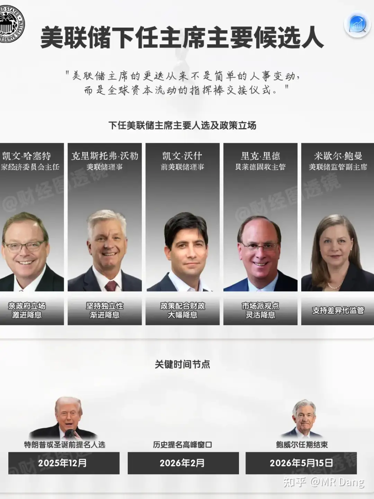
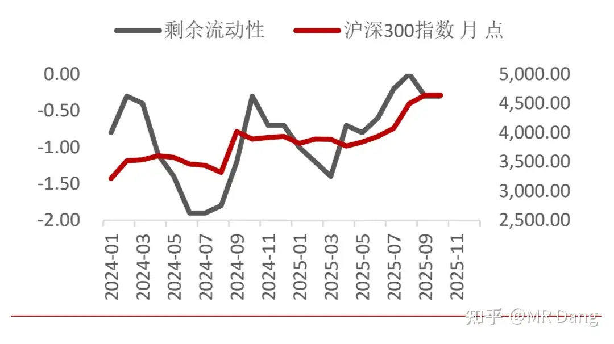
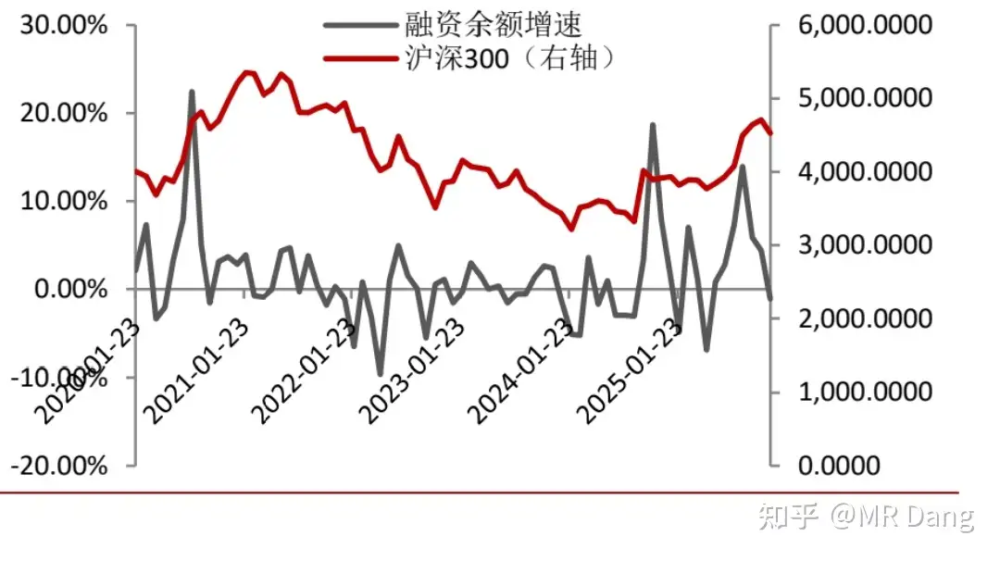
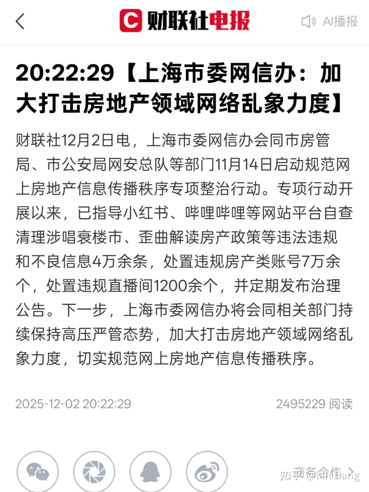
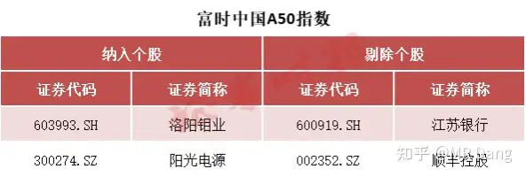
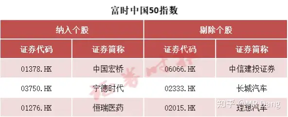
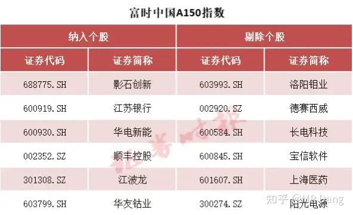
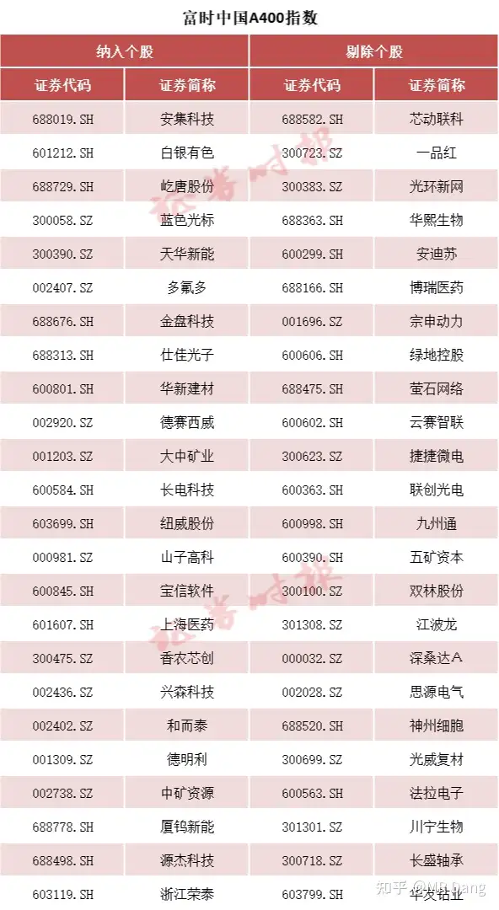

# 怎么看待2025年12月4日A股市场行情?

---

**发布时间**: 2025-12-04 07:28  |  **原文链接**: https://www.zhihu.com/question/1979325660980867399/answer/1979814333031674140  |  **点赞数**: 1360 人赞同

**作者信息**: MR Dang​独立投资人，不接广不卖课

---

## 正文内容

日常唠嗑，想到哪写到哪。

首先是美联储主席人选几乎敲定，借用一张图片：

哈赛特目前几乎板上钉钉了。

如果是他当选的话，那就不用研究他的货币主张了，因为他的主张就是懂王的主张。

中短期降息到3%应该是确定的，现在的很多交易已经按照3%定价了，比如汇率。

这里还可以联系11区的加息展开说说，不过感觉对投资没什么指导意义，算了。

西大如果利率下来，东大也不用和西大玩憋气的游戏了，kuku往下降。

现在只是大行停大额存单，以后中小行也会停。

不只大额存单会停，以后的保险产品，理财产品，都会往下降，降到1%以下都不是啥大惊小怪的事情。

银行股高股息的窗口会越来越小。

5%的东西，都是要靠抢的。

所有的资源类标的都会变成非卖品。

再谈点宏观的事情，不是我的观点，我只是转达这么一种观点。

直白的说，就是谨慎看好大盘指数。

理由一就是认为剩余流动性出现拐点了。

这个剩余流动性=m2增速同比—社融存量增速同比

啥意思呢？说人话就是闲钱。

m2看成总流动性，社融看成干正事的钱，比如办厂子。这部分从m2里减去以后，就是闲的没事干，可以投机炒股的钱。

当然剩余流动性不是绝对值的减法，而是求导一次以后再做减法，所以更加敏感。

理由二是两融余额增速的影响：

姑且一看吧，主要是从流动性方面的做出的预测。

我不主动预测指数，但是目前的仓位，已经做好了回调的应对准备。

有关地产的讨论，如图：

以后我会尽量避免讨论房地产了，该说的都说了，该教的也教了。

相信我们的房地产市场一定能稳中向上，欣欣向荣。

昨天热度比较高的事情是朱雀三号的发射。

我不太懂商业航天的事情，但是如果对比马斯克的猎鹰9的话，

我觉得这次发射有三大目标：入轨 ，关键技术验证和一级回收。

三个完成了两个，应该也是相当不错的。

我是局外人，只能为祖国航天事业喝彩了。

但是有的投资者，变成了局内人。

买的相关标的因为不可抗力直接跳水，最后损失惨重找我倾诉。

我也是可以理解的。

我的建议就是想想低空经济当时是什么盛景，现在又是什么境况。

这些东西肯定是未来，是需要有探索者和先驱的。

但是这个探索者和先驱并不一定非得是咱们。

家国情怀可以有，但是并不一定要谈钱嘛。

情怀是情怀，投资是投资，两码事。

作为投资者，一定要拎得清。

投资的步伐和节奏很重要。

比如，穿个牛仔裤，搞手机——生态——电车，节奏没搞好，抢跑了，就是贾回国。

你节奏踩对了，就是雷布斯。

隔夜商品方面，铜创历史新高，铝逼近新高，锡创三年内新高。

锡的主要用途是电焊的时候当焊料，可以用于半导体行业，以及马口铁，也就是制作罐头盒。

供应端方面，今年锡的几个大矿区，比如缅甸佤邦和刚果金受到地缘扰动，复工复产压力大。

全球2024年锡矿总共供应30万吨左右，精锡37万吨左右。

很多人看到这个数字第一反应是有问题吧，30万吨矿石里还能出37万吨锡？

其实这是因为矿石是按照里面含的锡折合成精锡进行统计的。

锡矿石原矿的品位只有1%左右，甚至都不到。

需要浮选到40%以上才能变成锡精矿进行交易。

而金属锡的来源除了矿石开采还有回收，所以造成精锡数量超过锡矿石。

2025年前三个季度，供应锡矿石22.3万吨，精锡26万吨，同期需求27万吨，有一万吨缺口。

现在这个行业因为缺矿石，所以冶炼产能都在抢矿石，加工费用是比较低的，而且越来越少。

相关标的的话，就三个。

xyyx，不用说了，我们的老朋友了，一脚踩银，一脚踩锡，运气来了真的挡不住。

目前600多亿市值，对应前三季度5600多万吨锡矿产量(矿产口径，不是精锡)。

xygf，全球锡王，储量第一，产量第一，销量第一，储量60多万吨，产量前三季度6.7万吨。

但是矿石自给率只有30%，折算下来的话，数据并没有那么夸张。

另外70%挣得是加工费，一吨只有1万二，还在往下走，和一吨动不动就30万的锡价比实在没什么诱惑力。

所以估值便宜，动态pe只有18。

按照今年每股收益1.5测算的话，可能真实估值只有17pe。

以我模糊的正确的判断，这公司估值给的低了，一眼大开门，感觉有搞头。

因为目前锡行业的储采比只有16，也就是静态开采16年枯竭。是所有已知矿产中最低的。

当然不是说16年以后就没锡用了，储量是会动态增加的，而且很大一部分可以回收利用。

但是也足以说明锡行业长期来看的供求关系是会趋紧的。

hxys，搞加工的，类似xygf的公司，但是全方位比不上，而且估值还贵，我个人就不考虑了，有兴趣的可以研究研究。

铜和铝的标的，我的审美大家都知道的。

隔夜市场方面，中概股又回调了一些，但是a50股指期货微微上涨。

没啥大的意义，只能说明外资押注今天大盘股走势会比较好。

富时也调整了指数成份，调整如下：

我发现很多读者持有其中的某个快递股，注意下短期风险吧，降级到a150了，谨慎加仓，控制仓位，不要赌气。

港股这个铝是真的好，真的香，我愿称之为铝王，a股还真没有比得上的。

电车我看空很久了，谨慎！谨慎！！明年购置s力度小了，补贴还不知道有多少额度，竞争压力很大的。

有两个是降级下来的，利空。

另外五个升上来的算小利好，其中有两个是次新股，没有全流通呢，解禁后再看。

名单大的，一般影响就小，随便看看吧。

一个喜欢保护韭菜的博主，希望大家少少踩坑，多多赚钱！

---

> [!comment]- 点击展开评论
>
>
> | 用户 | 时间 | 内容 |
> | :--- | :--- | :--- |
> | 奥特之父 |  | 送出一个礼物～ |
> | &nbsp;&nbsp;&nbsp;&nbsp;MR Dang |  | 老板大气 |
> | 晨风 |  | 省流；大盘谨慎，控制好仓位，降息预期加大，银行和资源类继续看好。房产心中有数，不能瞎唱空。 |
> | 苏志燮 |  | 看到了哥的文章更不着急买房了  听劝 |
> | Iris |  | 之前八成仓买的银行，BF，GG和药店不用减仓吧？ |
> | &nbsp;&nbsp;&nbsp;&nbsp;MR Dang |  | 不至于，有股息兜底 |
> | wowo |  | 做做t |
> | 一帆 |  | BF稳，没啥动静 |
> | 御风 |  | 现在银行股还算是高点吗？用不用考虑未来一段时间流动性紧张？ |
> | 下一季再说 |  | 我就是那个持有快递股的读者，大佬居然也提到了，谢谢大佬。早上好 |
> | 久下的雨 |  | 家里亲戚是xygf的，7月份时聊了一下，第二天就全抛了，现在腿都拍肿了。 |
> | &nbsp;&nbsp;&nbsp;&nbsp;MR Dang |  | 不识庐山真面目，只缘身在此山中。 |
> | 久下的雨 |  | 都觉得自己单位很垃圾 |
> | 广东顺德分Dang |  | 肾结石痛，在医院止痛也要看大佬更新 |
> | 那时灬烟雨 |  | 大佬 gggf价格可以加仓了吗？ 这两个星期对比了好四家农药公司  还是记得gg香  目前适合加仓了吗？ |
> | 为了这点醋做的包 |  | 这股票有说法，我已经套里面了 |

---

*本文件由自动脚本从MR Dang知乎页面提取生成*

---

**作者**: MR Dang
**链接**: https://www.zhihu.com/question/1979325660980867399/answer/1979814333031674140
**来源**: 知乎

*著作权归作者所有。商业转载请联系作者获得授权，非商业转载请注明出处。*

---

## 相关阅读

**📈 每日行情评价：**
- [[20251205-怎么看待2025年12月5日A股市场行情?]] - 新股交易与跨市场套利
- [[20251203-怎么看待2025年12月3日A股市场行情?]] - 油运股与CPI预测

**📚 投资方法教育：**
- [[20251013-什么是投资思维？普通散户该如何培养？]] - 投资思维培养
- [[20251024-怎么全面的分析一支股票？]] - 股票分析方法

**📘 地阶功法：**
- [[20251022-《地阶功法卷一》投资者必须斩杀的三个妄念]] - 投资者心态建设
- [[20251023-《地阶功法卷二》价值投资三大误区]] - 价值投资核心理念

**🏠 房产楼市：**
- [[20251008-买优质房源还是买优质公司股票？]] - 房产与股票的选择
- [[20251018-如果有四十万存款你打算先买车子还是先买房子 ？]] - 资产配置思考

**🔙 返回：**
- [[每日行情评价]] - 每日行情评价全部内容
