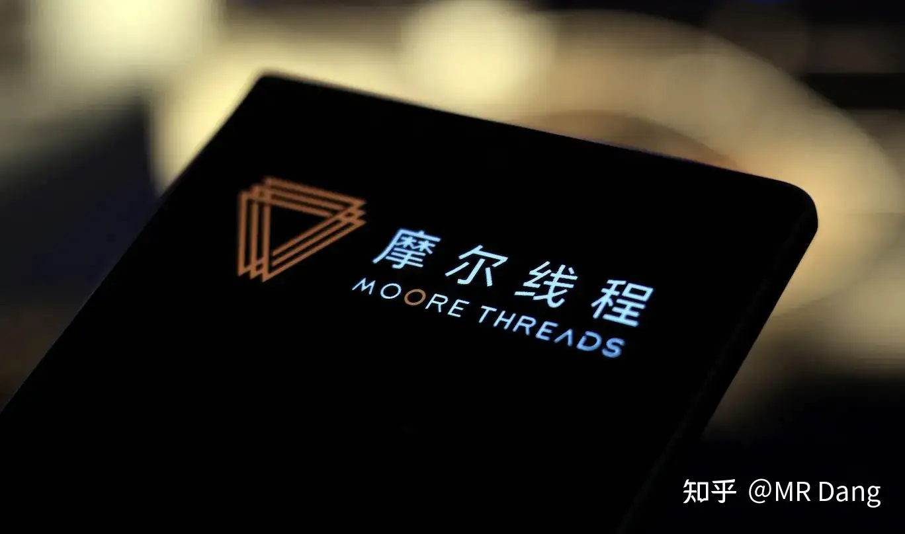
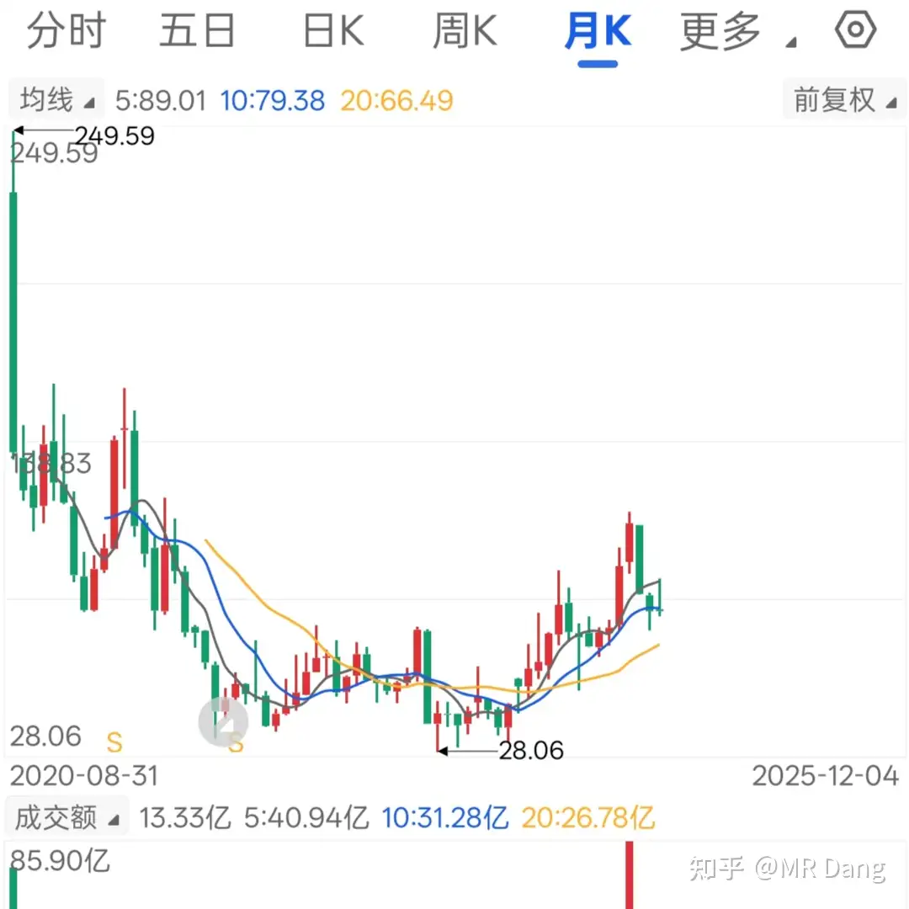
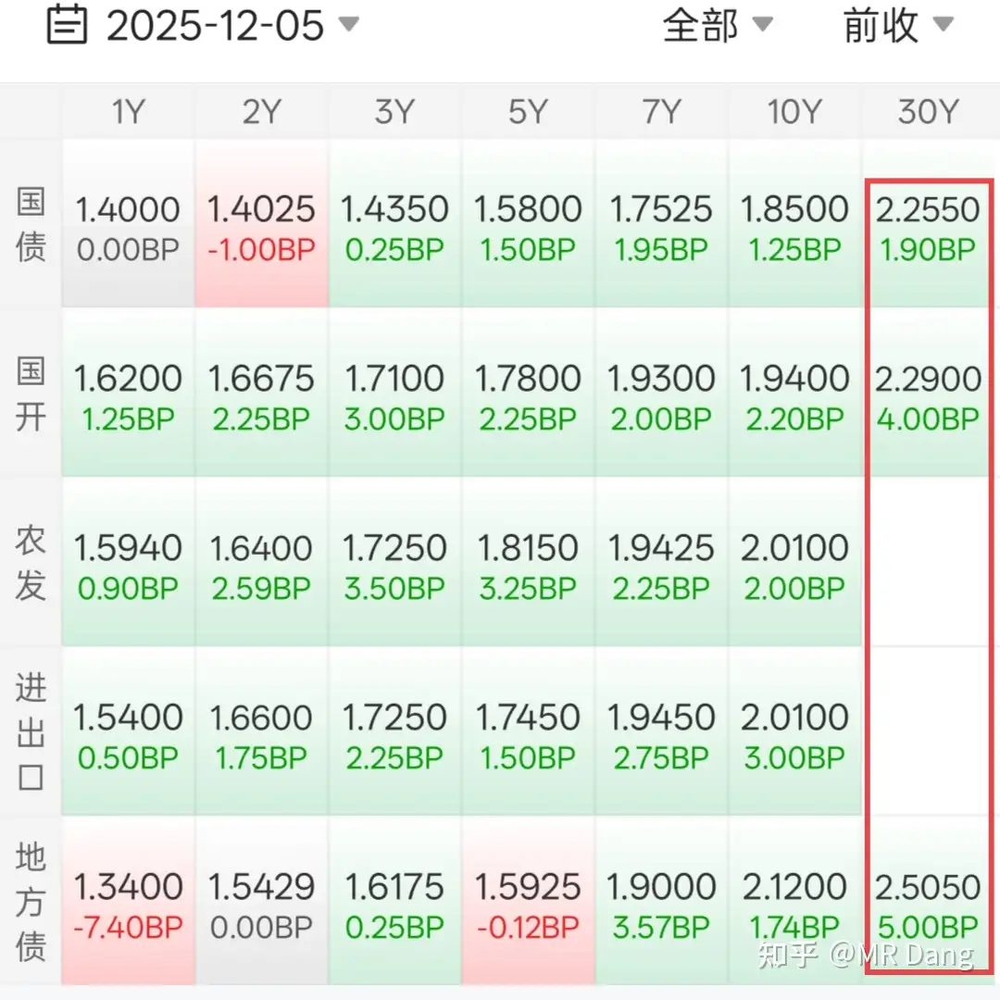
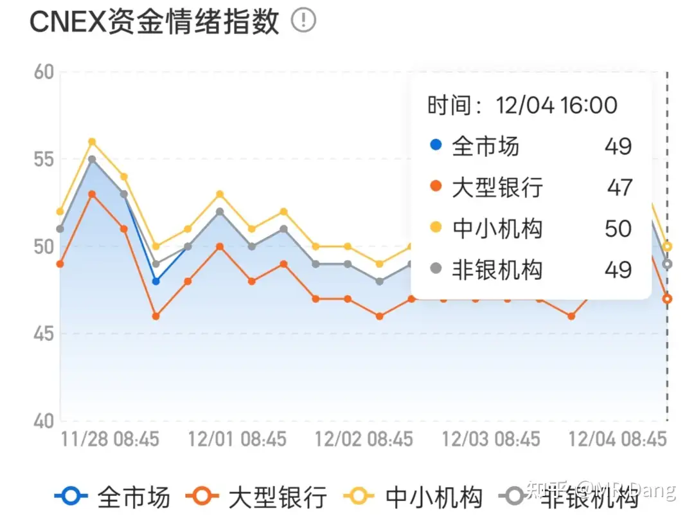
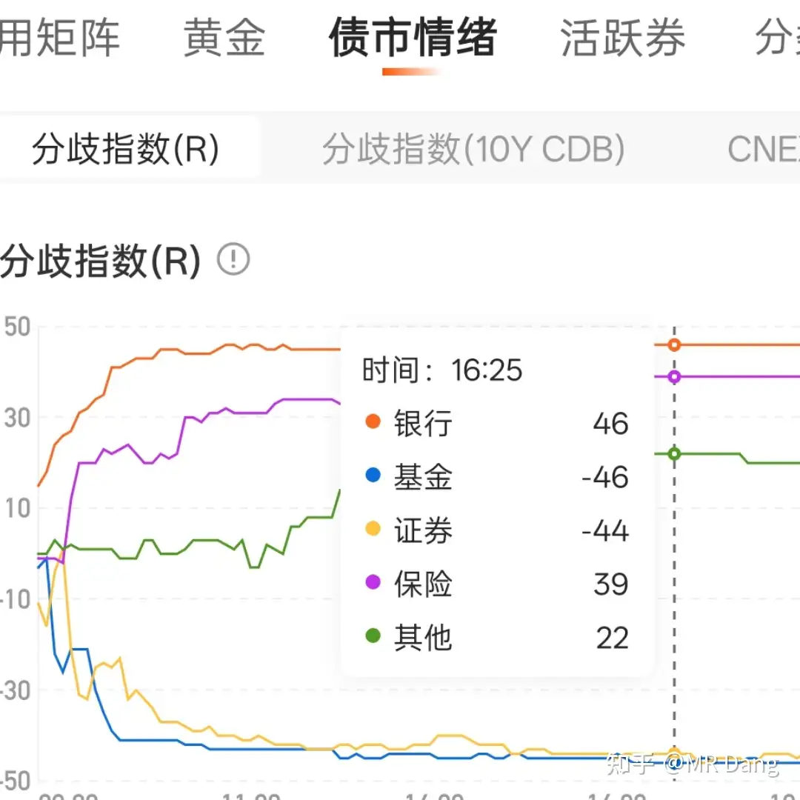
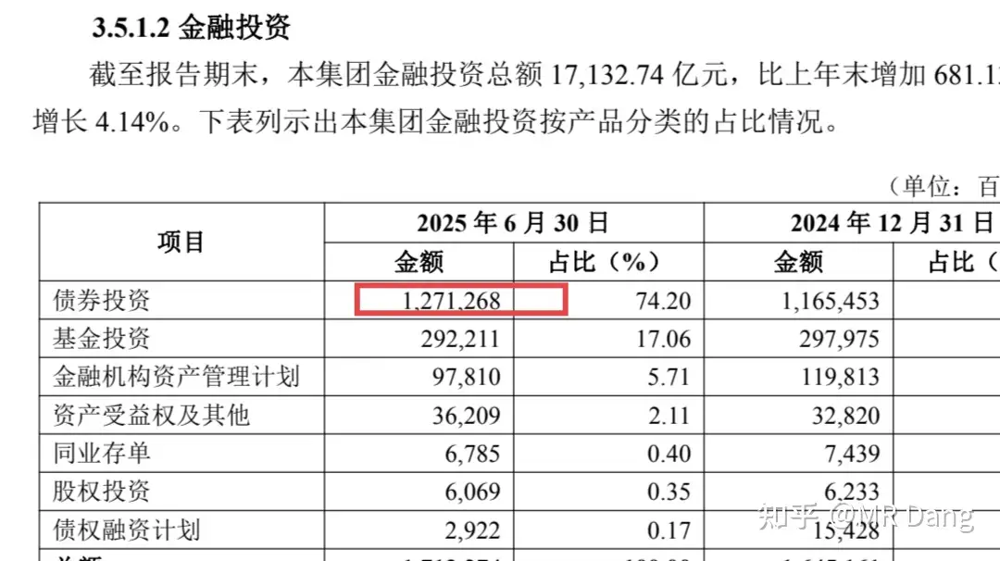
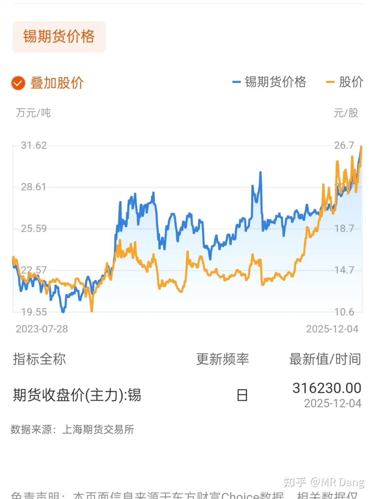
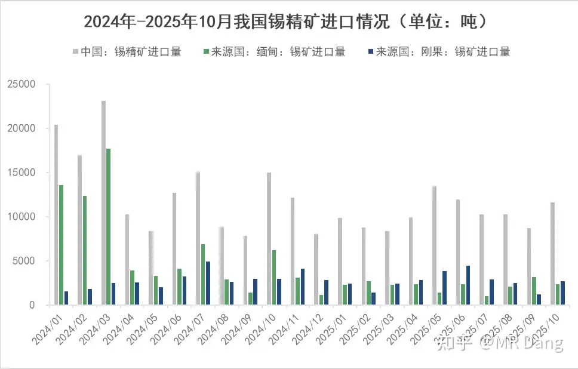
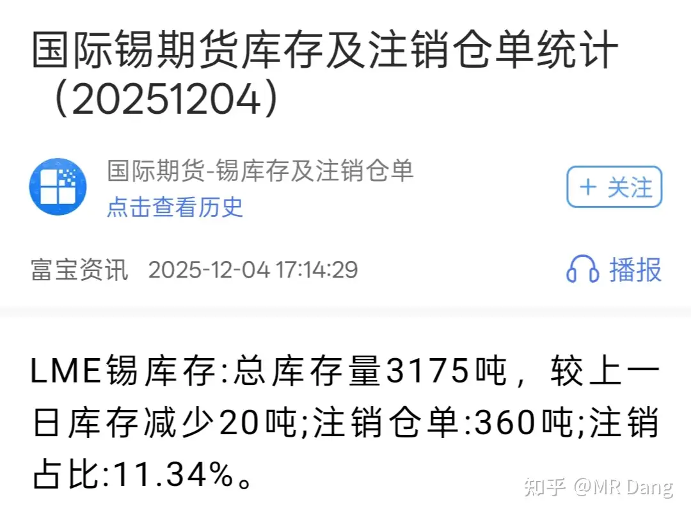

# 怎么看待2025年12月5日A股市场行情?

---

**发布时间**: 2025-12-05 07:28  |  **原文链接**: https://www.zhihu.com/question/1979689371675403857/answer/1980176661375893704  |  **点赞数**: 477 人赞同

**作者信息**: MR Dang​独立投资人，不接广不卖课

---

## 正文内容

本周最后一个交易日，希望能收红，让大家周末两天都好好放松下。

今天最热的事情应该是摩尔线程上市了。

我的读者里有好几个中签的，我对新股的认知就是竞价就卖。

不是针对谁，而是原则一向如此，只挣中签的钱。

实在不甘心的，也可以拿着蹲一个好卖点。

但是新股的择时非常难，随便波动一下就是二三十个点，普通投资者的小心脏承受不了。

我真的见过手忙脚乱，连滚带爬卖新股的。

肯定还有人摩拳擦掌的准备炒新股，我也多嘴提醒一下，炒新股多数是盘中富贵，哪怕盘中看着红彤彤的，第二天开盘都容易被套。

我踩过最大的，让我最意难平的坑就是炒次新股。

那个时候流行无线耳机概念，它正好是新股，科创板的，我开盘就卖出去了配售的部分，股价是228。

结果好巧不巧，鬼使神差的看到换手率很高，承接好，盘中冲高到近250，回落到230我就脑子一热冲进去了，买进去的钱是配售金额的上百倍。

买进去后没有哪怕一秒钟解套的机会。

第二天就傻眼了，套的死死的。

那个时候还有散户心理，套住死扛，结果半年就从230跌到70多，给我狠狠地上了一课，实在没办法七八十就跑了。

跑了以后偶尔还再去看它，股价最低的时候跌到了二十多，离谱，复权图长这样：

我印象中虽然也赔钱，但是赔的比例这么大，这么有效率，一秒钟解套机会都没有的，这是唯一一次。

一定要听劝呐，兄弟们，没经验的谨慎参与。

新股少卖一点问题不大，最多也就是少挣一点，要是脑子一热去炒新股，真的是只能双手合十跪地祈祷了。

说回宏观，昨天30年长债期货跌了不少，但是看其他久期的债券就还好，利率矩阵如图：

至于跌的原因，众说纷纭，有说银行保险等机构年末流动性紧张的，比如暂停了大额存单。

这个我不赞同，因为只有长债跌的多，不是普跌，而且隔夜利率显示并不紧张，资金情绪指数都没大于50的(这个指数50算中性，超过50是紧张，低于50是宽松)：

也有说是去年一窝蜂的提前定价，做空经济，把长债溢价炒的太高了，结果现在一看经济好像还行，就一窝蜂的又出来了。

怎么说呢？我觉得这说法差点意思。

按照我的观察的话，结合11区加息以及某些大资金的动向，我偏向于跨市场套利空间收窄假说。

简单的说，就是以前日元利率低，很多资金去11区借低成本的日元，换成咱们的钱，然后买入长债套利。

但是现在日元加息，就会造成息差减小，而且日元还会升值，汇率升值的部分都有可能覆盖减少后的息差，那套利就没有意义了。

所以这部分资金就会抛售债券，然后换回日元还钱。

就会造成债券市场动荡。

为什么偏偏是长债？

因为长债利率最高，套利空间最大。

根据分歧指数，基金和券商是卖出的主力军，银行和保险是买入方，数据更加支持套利说。

银行，是持有债券最多的人。

债券跌了，银行股就会跟着跌，很正常。

比如hxyh，持有债券12700亿。

折合每股80元。

你买进去一股银行股，不到7块钱，就相当于持有80元债券的头寸。

为什么说银行股=空仓？

债券算空仓吧，那持有银行股不就是空仓？

只不过股价波动稍微大了点而已。

综上所述，活期＜货币基金＜定存＜大额存单＜国债＜银行股=空仓，重新定义空仓。

乐视网发公告说要炒股，一半买银行股，真是深得我心，和我想到一块去了。

央妈宣布一万亿逆回购，同时到期1.3万亿，相当于净回笼3000亿资金，可能会引起短时间内对流动性的猜测。

个股方面，我持有的btgf有个小道消息是成立了个机器人公司。

有投资者问我怎么看？

我觉得乐呵一下就行了，一没技术优势，二没人员优势，三没资金优势，没钱没人没技术，难啊。

仅仅是个概念，要是真有人炒这个，我不介意在高位把筹码割爱给他。

不过这个消息也反映出bt的优势是有钱有闲，躺着数钱，闲得发慌。

缺点就是磷矿的储量有限，天花板不够高，不找出第二发展曲线的话，长期来看会有发展瓶颈。

与此同时，gggf也发了个公告，沟通了下方案的进展，简简单单一句比去年同期要好，也算给我吃了定心丸。

gggf的天花板要比bt高很多，属于一眼看不到头的那种，品种可以增加，价格可以提高，面积可以增加，渗透率可以增加，还能出海，还能替代，客户粘性也能增加。

除了最近股价表现差了点，没啥大毛病。

昨天提到的锡王，发现一张有意思的图：

按照一般人的想法，这不就是股价跟着期货走？

但是，假如，我说假如，锡王的销量占据了国内的一半，全球的四分之一。

锡王算不算是有了定价权呢？

那有没有可能是期货价格跟着锡王的现货价格走，比如：

锡王一夜之间报价就提了9000，相当于全国一半供应量提价了。

锡王上半年报价我算了下平均是26.3万/吨，三季度是27万/吨，现在现货价格直接到32万了，增加的除了税就是纯利润。

前三季度6.77万吨，除了加工的，属于公司的有两万吨左右，折全年2.7万吨。

一吨提价5万块，一年总共就增加利润13.5亿，减去15%税，大概增加净利润10亿。

所以问题的关键是锡的价格能到多少？

能不能维持住30万？

维持住那不得了，妥妥的印钞机。

对这方面我也没把握，但是我模模糊糊感觉锡价应该能创新高，也就是40万/吨上方。

短期内锡的价格看刚果金和缅甸的局势，但是中长期看：

2001年储采比是31，2011年储采比是21，2023年储采比是16，现在储采比是14。

多少年了，没发现什么大矿，25年间，从2032年延期到2039年，延期了7年而已。

地壳里，铝的丰度是82300，铁的丰度是56300，铜的丰度是60，锡的丰度是2，银的丰度是0.05。

铜的丰度是锡的30倍，锡是银的40倍。

铜价是9万/吨，银价算下来是将近1400万/吨，锡价40万也说不上有多离谱，按照丰度比例，100万/吨，也就是一元/克才是和铜银一样的定价。

考虑到需求没有铜银那么大，逻辑没那么硬，打个五折，50万/吨并不算高估。

锡的高品味矿也没了，缅甸以前5%到10%品位的露天高品味矿消耗殆尽，现在去挖地下1%品位的矿了，成本大幅度提高，缺口越来越大。

锡的用途都是高附加值的东西，各种pcb板和先进封装都需要用到，一台ai服务器最多能用到4到5公斤，单颗图灵芯片也要用到10克左右。

有点像工业里的大蒜，盘子小，必需品，容易被炒作，伦敦交易所总库存只有3000多吨，折合货值也就10个小目标。

大v都很爱惜羽毛，一般不会对特定的品种直接喊出确定的价格，容易翻车以后被反复打脸鞭尸。

不过我无所谓，因为我不是大v，哈哈。

隔夜市场方面乏善可陈，油价涨了些，白银回调了些，铜的话，据传有人在逼空。

但是看伦交所铜价，还没有什么大的波澜。

今天我没什么交易欲望，主要任务是蹲锡王那个跳空缺口，然后看摩尔线程的大戏。

锡王就是股息率太低了，管理层不太行，有点可惜。

我择时水平很差，不要学我，鄙人不善择时。

一个喜欢保护韭菜的博主，希望大家少少踩坑，多多赚钱！！

---

## 精选评论

| 用户 | 时间 | 内容 |
| :--- | :--- | :--- |
| k591998667 |  | 每天看老师的分析感觉自己就像猴子下山里的猴子，看到一个喜欢一个，而手只有一双 |
| &nbsp;&nbsp;&nbsp;&nbsp;MR Dang |  | 哈哈 |
| 愚人杰AI生活 |  | 猴友好！ |
| gugu |  | 一不小心连脚都用上，动弹不得 |
| k591998667 |  | 哈哈，能拿也不错，最怕就是拿了芝麻扔西瓜 |
| Iris |  | 昨天银行跌加了50个 |
| &nbsp;&nbsp;&nbsp;&nbsp;MR Dang |  | 好家伙 |
| 村妞在乌村 |  | 送出一个红包。早上看了Dang哥说竞价阶段出掉，我听进去了，650出了400股，开盘660出了100股，感谢大佬的指点 |
| &nbsp;&nbsp;&nbsp;&nbsp;MR Dang |  | 厉害了 |
| 勾人 |  | 早上好，dang老师，我理解的银行股🟰空仓是心态上的：涨了我高兴，市值增加了；跌了我更高兴，股息增加了，而且对我这种定投来说还有加仓机会。怎么都高兴，可不就是不玩股票看别人亏钱的感觉嘛（虽然很不地道） |
| 勾人 |  | 对了，dang老师，昨天给你回复被审核了，也不知道发出去没有，那就趁机再问一遍：您在银行股投资原理一文中提到的《货币金融学》和《商业银行学》是那个金融学教材吗？我在淘宝搜出来好几本，昨天想拿着图片问你的结果被审核了 |
| &nbsp;&nbsp;&nbsp;&nbsp;MR Dang |  | 是的 |
| 勾人 |  | 感谢🙏 |
| 坂田铖时 | 15年前 | Dang老哥，以后多讲讲你亏钱的经历，甚至可以开个专栏比如走火入魔或者功法反噬之类的。一次亏钱的警醒度深刻度比十次赚钱加起来都多。另外不知道粉丝里有多少二次元，看到11区的时候真的会心一笑，好像一下回到15年前买动感新势力这种杂志的时候。 |
| Raven |  | 从小看到老 |
| &nbsp;&nbsp;&nbsp;&nbsp;MR Dang |  | 你也买动新啊，我现在还惦记雪拉长啥样呢 |
| 不知道 |  | 老师这是喂饭还怕我们不消化，不时递一颗消化药 |
| &nbsp;&nbsp;&nbsp;&nbsp;MR Dang |  | 谢谢 |
| 开心童年加1岁 |  | 所有资源类标的都会成为非卖品，这句话值1万个赞，我思考的很久的，翻了无数个标的，选了几个好的 |

---

*本文件由自动脚本从MR Dang知乎页面提取生成*

---

**作者**: MR Dang
**链接**: https://www.zhihu.com/question/1979689371675403857/answer/1980176661375893704
**来源**: 知乎

*著作权归作者所有。商业转载请联系作者获得授权，非商业转载请注明出处。*