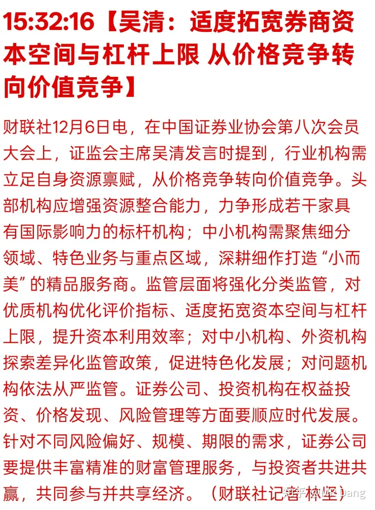
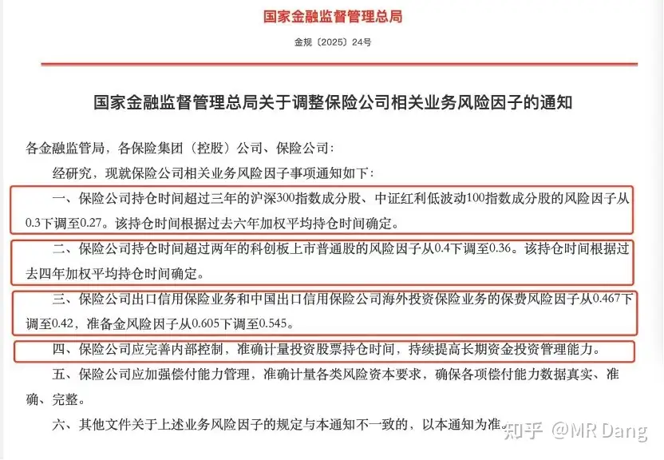
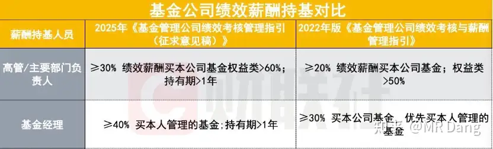
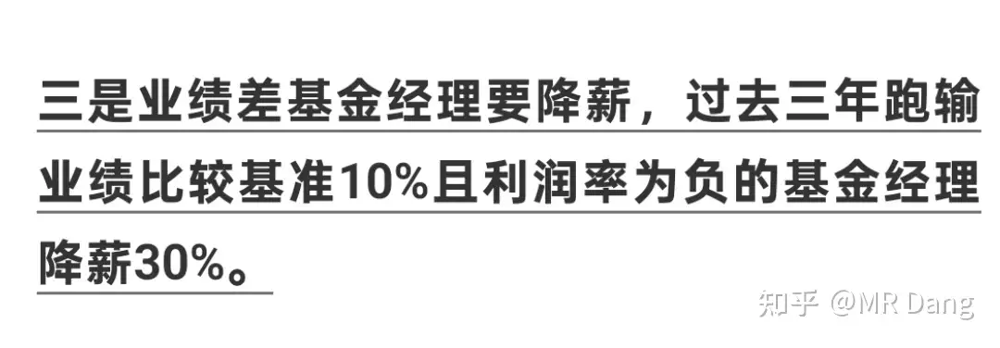
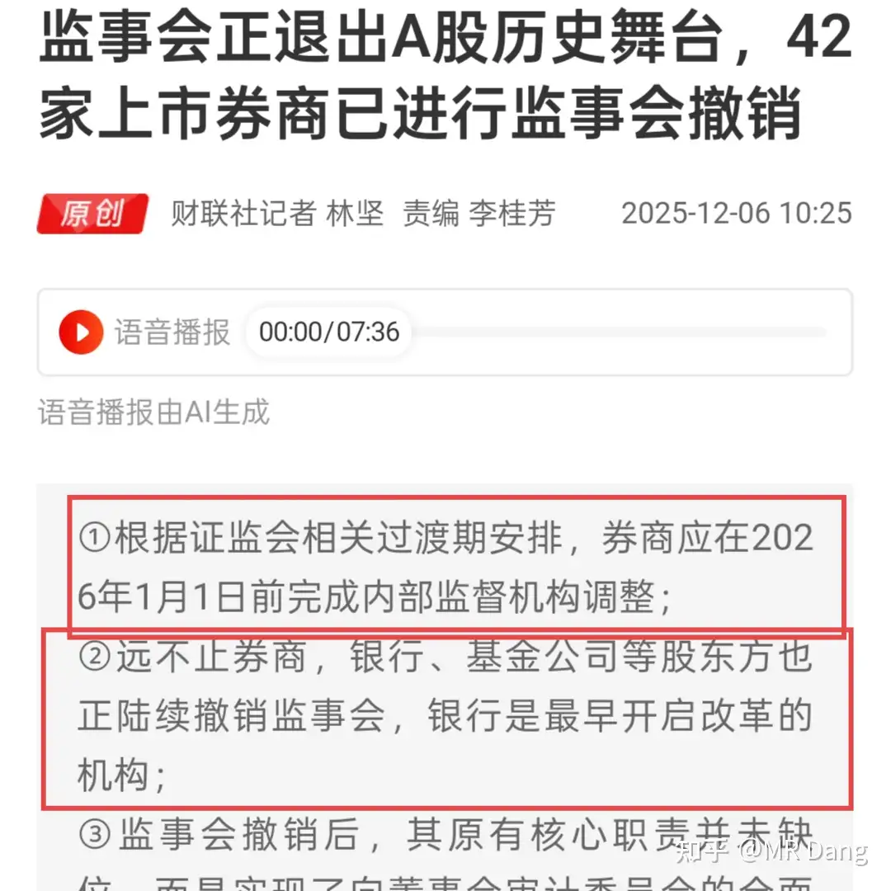
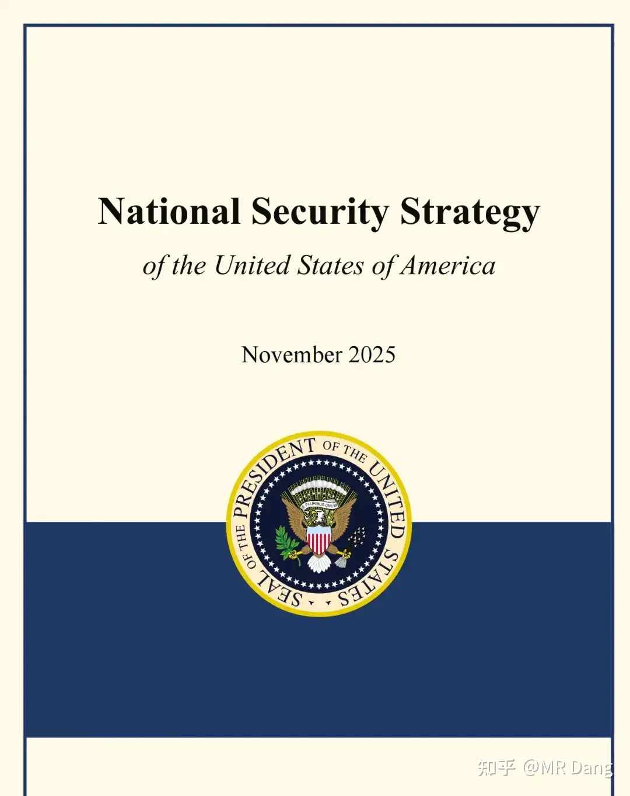
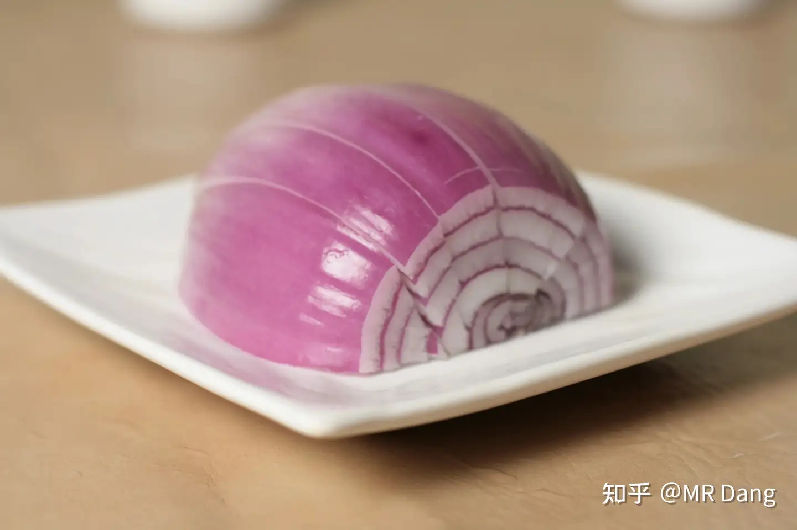
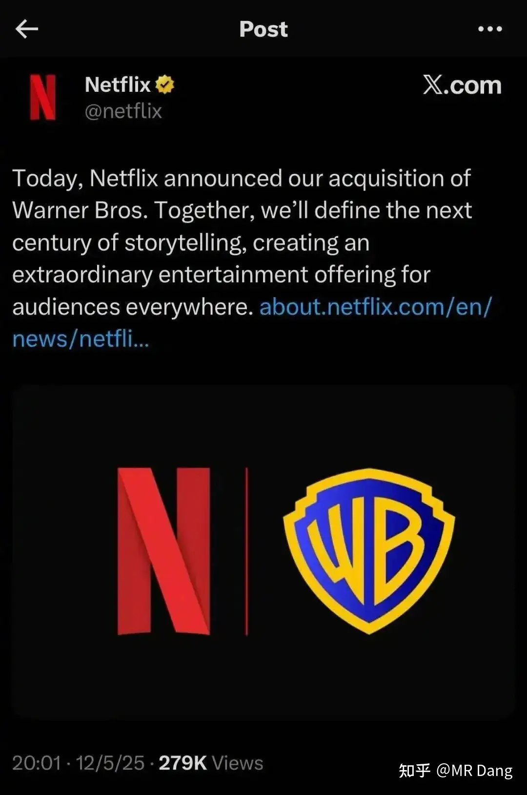
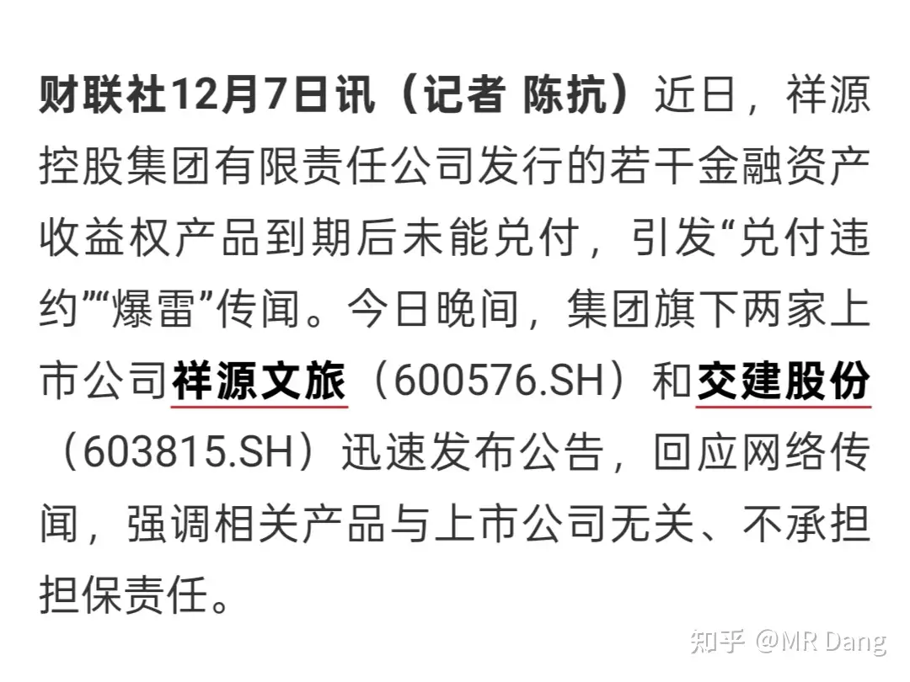

# 怎么看待2025年12月8日A股市场行情?

---

**发布时间**: 2025-12-08 07:28  |  **原文链接**: https://www.zhihu.com/question/1979952372806598700/answer/1981263790420009037  |  **点赞数**: 1058 人赞同

**作者信息**: MR Dang​独立投资人，不接广不卖课

---

## 正文内容

新的一周开始了，先把上周五收盘以后发生的重要事情过一遍。

国内方面，最出乎意料的是这个：

券商放在以前，每次都是牛市的旗手，弹性和波动都是最大的板块之一。

只有这次牛市是例外。

要说原因的话，一方面是因为里面的资金都是互掏口袋，互相预判走位的老派资金，有人敢拉就有人敢砸。

另一方面还是现在券商太内卷，整体成交量上不去的话，没什么太宏大的叙事，就算有些券商的估值并不贵，也没什么太大的吸引力。

现在提到杠杆上限，这个提法的想象空间其实挺大的。

另外别忘了还有三家券商还在停牌呢，如果放出来的时机能配合到一些这类的消息，还是有可能点燃市场的热情的，值得关注。

但是有个膈应人的地方是，上周五券商涨了以后就出了这个利好。。。今天要是高开太多，这部分抢跑的资金要干什么好难猜啊。

除了券商，还有保险：

这个也是类似的思路，给保险公司松绑，也相当于加杠杆。

如果和券商的那个表态结合起来看的话，隐隐约约有点2014年的味道了。

利好的话，险资配置的标的都是一些红利板块，标的直接问ai就行。

券商，险企都有了，怎么能少得了基金呢？

相关部门下发了基金业新的考核意见稿，主要变化如下：

主要是增加了高管需要购买本公司管理基金的比例，提高了总绩效的10%，增加了持有期规定，更加绑定了自身业绩。

三年跑输基准10%并且亏损的降薪30%。

也就是说降薪需要同时触发两个必要条件，亏损且跑输10%。

我个人觉得是利好价值投资的，因为做价值投资的话，在三年的时间长度上同时满足这两个条件也不容易。

能同时满足这两个条件的，降薪30%也是罪有应得，真的太菜了。

和上述新闻一起搭配食用的还有：

券商等机构的监事会要被干掉了。

当然不是不监管了，而是把监事会的职责放到董事会审计委员会了。

自行体会。

本周三会公布cpi和ppi数据，我个人预测由于化肥涨价，蔬菜水果可能同比涨幅在10%到15%区间，由此可能带动cpi同比增速1%到1.2%之间，ppi则是同比负增长2%左右。

这么大胆的预测目前还是比较少的，留待验证。

如果预测成立，那么cpi和ppi会形成剪刀差，上一次这种情况是2019的猪肉大涨导致的，上上次这种情况是2014年"一带一路"天量投资砸下去导致的。

后续的资本市场在这种剪刀差出现后都还算可以，特别是2014年。

cpi数据的超预期公布可能会利好消费板块吧。

央妈公布了最新储备，如图所示：

再次怒买3万盎司黄金，和前几个月节奏一致。

国际上的话，影响最深远的事情应当是：

简单的说，就是西大决定战略收缩了。

原因有很多，但是最本质的原因就一点：维持旧秩序所需要的边际成本太多，而边际收益又太少了，这本帐有点算不过来了。

与此同时，利用新的工具，比如算力，ai叙事，币圈叙事的收割边际成本非常低，所以最终就选择了战略收缩，划洋而治。

这个对资本市场的影响是深远的，因为货币是天生慕强的，所以在汇率这方面，大家懂的。

其实这一表态在几天前已经有预兆，当贝森特坐在镜头前说东大是西大的盟友的时候，不但在场的人懵了，屏幕前的人也懵了。

大宗商品方面，银和铜目前处在逼空阶段，银价和铜价都在近期高位。

不过需要注意一点，尽管周末情绪上发酵比较多，但实际上这些大宗商品的最新价格和上周五a股收盘时基本处在同一水平线，没有进一步涨太多，也就是目前的股价已经price in截止今天开盘前的期货价格了。

逼空行情里的大宗商品价格变化会很剧烈，持有相关仓位的择时难度很大。

由于货币宽松的预期，金银铜铝锡都有非常好的长期涨价预期。

还有一个非常小众的农产品品种，由于今年扩产严重，价格下跌很多，二三季度有很多种植户亏损。

但是根据最新数据好像有点回升的意思。

明年供应可能会减少，种植户改种其他，叠加成本端的压力，可能会走出涨幅不小的单边行情。

这个品种就是洋葱，特别是粉葱。

洋葱这个品种特别奇怪，是西大唯一立法不允许开立期货的品种，因为历史上被爆炒过，所以特别出了个《洋葱期货法案》，没用的知识又增加了。

不过没什么好的投资标的，喜欢吃洋葱的可以囤几斤，应该能省下个块八毛的。

个股方面有个大新闻是奈飞收购案，对a股貌似没什么直接影响，不知道那些柚子能不能找到什么相关标的。

本周还有沐曦摇号，今天点赞的兄弟将会获得中签率+100%的buff加成，哈哈。

资本市场有点像后宫，当一个新人进宫的时候，旧人就会失宠。

emm，刚进宫还没两天的摩尔马上就要变成老人了。

提前祝大家都中签吧，中签后依然建议开盘竞价就卖，省心省力。

百度发布公告，正在评估分拆昆仑芯。

百度这公司也算一大奇观了，每次都是起个大早，赶个晚集，这次不知道最后结果如何。

当然也不全是好消息，祥源系据传暴雷，相关a股公司可能会风险释放空间。

美联储在本周内会公布最新的利率决议，目前市场是按照89%几率降息25基点在进行交易。

降息本来是利好，但是如果鹰派降息，也就是在降息的同时发表鹰派观点，也有可能变成利空和资本市场的震荡。

总的来说，周末的消息面上总体还是相当不错的，情绪偏好。

我的策略是一向只做应对计划，不预测市场，我个人的应对策略如下：

1，整体仓位方面，今天如果高开太多（6%以上），则会考虑开盘减仓，如果卖飞则不追回，如果回调则顺势调整仓位结构。

2，高开一般多（2%-6%），则按兵不动，并且盘中有低吸机会加仓。

3，高开不多（2%以内），则考虑根据情况直接加仓。

(这里不是指大盘指数，是指我持有的相关杂毛仓位)

标的方面，按照目前的价位，我偏向于银行，农化，有色里的铝王和锡王。

锡王我上个交易日在回补跳空缺口时买了些，如果今天有合适的机会会继续加。

铝王不会买太多，买一点作为标记。

因为我有色仓位里有铜王，而且仓位重，除非铜王清仓后，才会考虑换仓位到银王/铝王/锡王。

鄙人不善择时，不要模仿哈。

一个喜欢保护韭菜的博主，希望大家少少踩坑，多多赚钱！

---

> [!comment]- 点击展开评论
>
>
> | 用户 | 时间 | 内容 |
> | :--- | :--- | :--- |
> | 花妖 |  | 点赞的兄弟会获得中签加成，那么点赞的姐妹会有加成不？ |
> | &nbsp;&nbsp;&nbsp;&nbsp;MR Dang |  | 必须有，姐妹加的更多 |
> | 花妖 |  | 哈哈，姐妹们赞起来 |
> | 长虹 |  | 懂了，最近多多囤点洋葱，麻辣香锅需要它 |
> | &nbsp;&nbsp;&nbsp;&nbsp;MR Dang |  | 哈哈哈哈 |
> | 瑞锐 |  | 紫金上周我全卖了，还准备等回调 |
> | &nbsp;&nbsp;&nbsp;&nbsp;MR Dang |  | 也不是没可能，股市谁说的好呢 |
> | Adam096 |  | 3万盎司什么概念呢，万分之3左右吧？13个月增持且13个月最低。什么意思其实很明显了，就是领导说要买黄金，但买的人觉得黄金价格太高了不划算，那咋办？划水定投呗，不能买多了，多了亏了要被领导骂，但是领导要你买你又不能不买。预测黄金横盘，但是铜在半年内会再涨一波。哪里的消息都会骗人，运费不会骗人，现货铜可是实打实的哐哐往纽约交易所运，华尔街炒铜之前先屯一波现货铜，熟悉的味道。 |
> | 喝人 |  | 感谢大哥分享，那是买铜王还是有色etf？ |
> | 何云 |  | 铜王是谁？哪个？ |
> | 小仟 |  | 紫金吧 |
> | Raven |  | 【今天不得不点赞了】记得2014、2015年也是先拉科技，再拉蓝筹，最后共振之后放烟花。西大收缩过程就看东大能否顺利接收了，特别是11区。 |
> | 尼古拉斯 |  | 11区是啥 |
> | 唐小命儿 |  | 佬对市场的敏感度、对趋势的把握力，真的无人能及，妥妥的大神级存在！希望这周红彤彤 |
> | 讨厌醋大蒜 |  | 今天怎么感觉大A在跟大佬对着干，感觉有种我预判了你的预判的氛围 |
> | 易凌顷 |  | 鄙人不才 几乎像是吃了蔬菜沙拉 |
> | k591998667 |  | 指数涨了，手里的票票绿了，银行本是唯一的安慰，可惜上周老师介绍了几个更好看的美女，被喜新厌旧的渣男卖了 |

---

*本文件由自动脚本从MR Dang知乎页面提取生成*

---

**作者**: MR Dang
**链接**: https://www.zhihu.com/question/1979952372806598700/answer/1981263790420009037
**来源**: 知乎

*著作权归作者所有。商业转载请联系作者获得授权，非商业转载请注明出处。*

---

## 相关阅读

**📈 每日行情评价：**
- [[20251209-如何看待2025年12月9日A股行情？]] - 重要会议解读
- [[20251205-怎么看待2025年12月5日A股市场行情?]] - 新股交易与跨市场套利

**📚 投资方法教育：**
- [[20251013-什么是投资思维？普通散户该如何培养？]] - 投资思维培养
- [[20251011-下周一股市就要大跌了，作为投资者该如何应对？]] - 风险控制与心态管理

**📘 地阶功法：**
- [[20251022-《地阶功法卷一》投资者必须斩杀的三个妄念]] - 投资者心态建设
- [[20251023-《地阶功法卷二》价值投资三大误区]] - 价值投资核心理念

**🔙 返回：**
- [[每日行情评价]] - 每日行情评价全部内容
