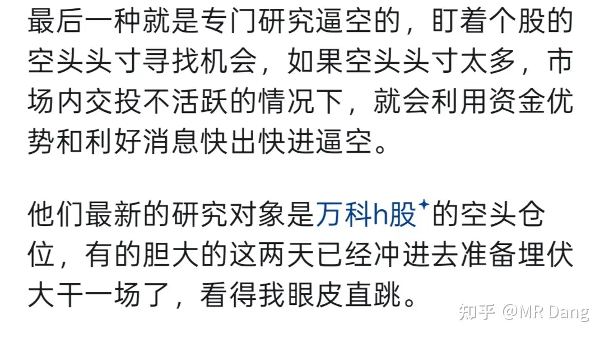
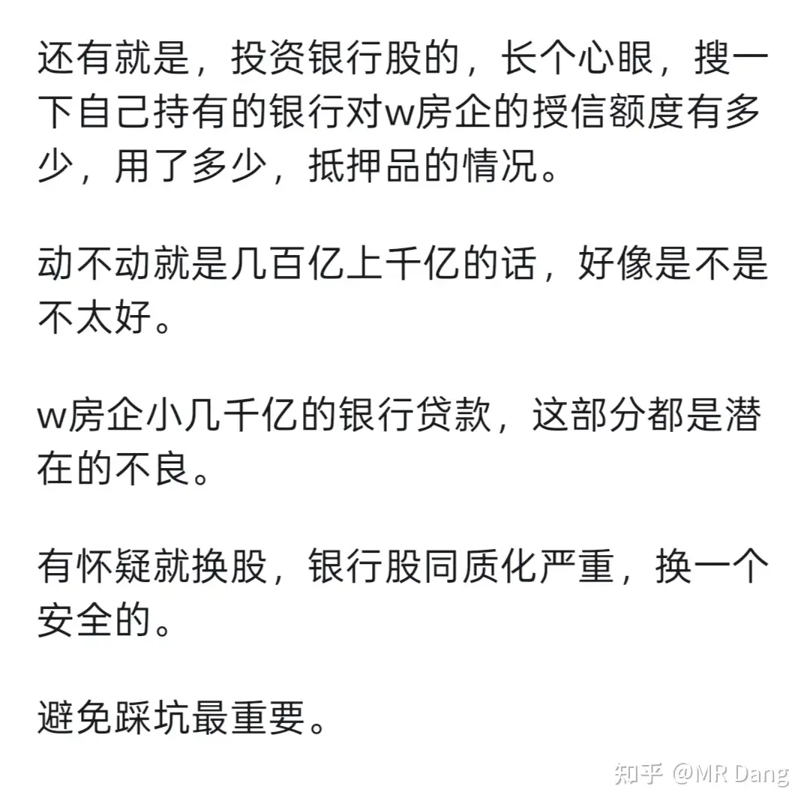
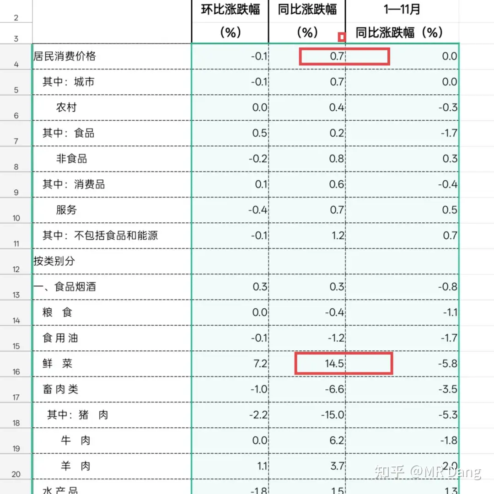
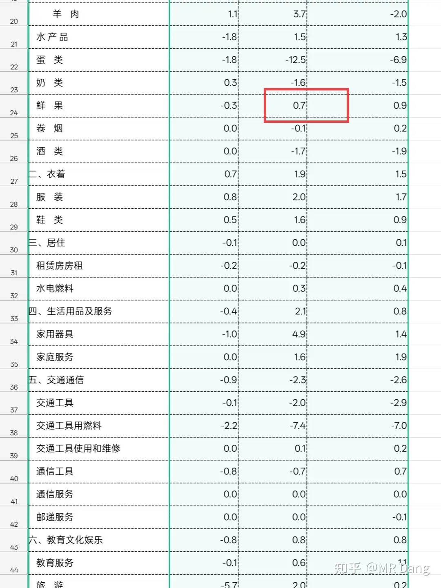
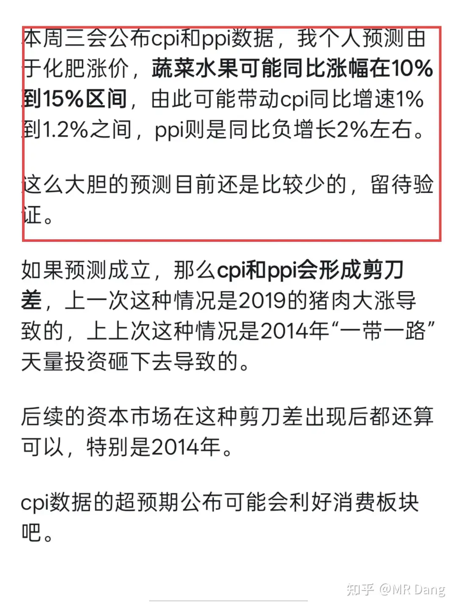
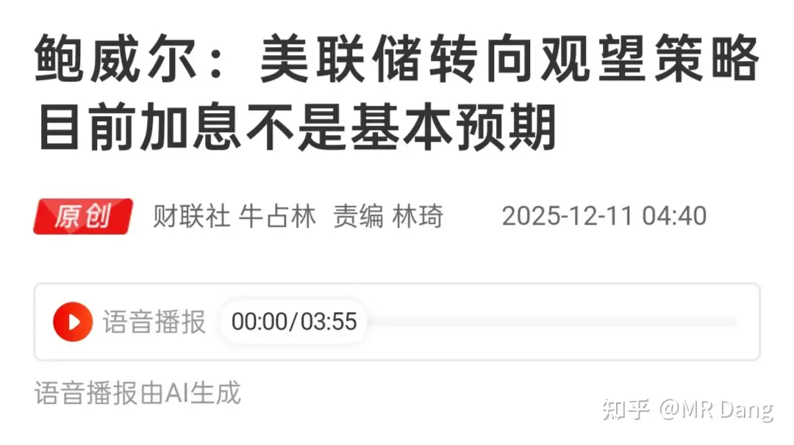
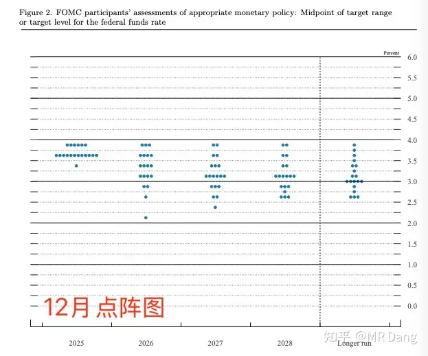
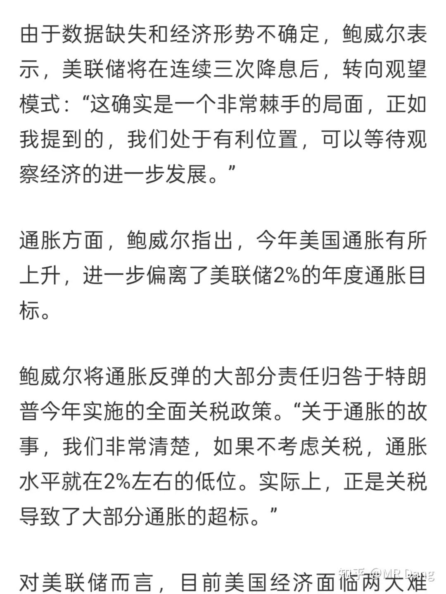
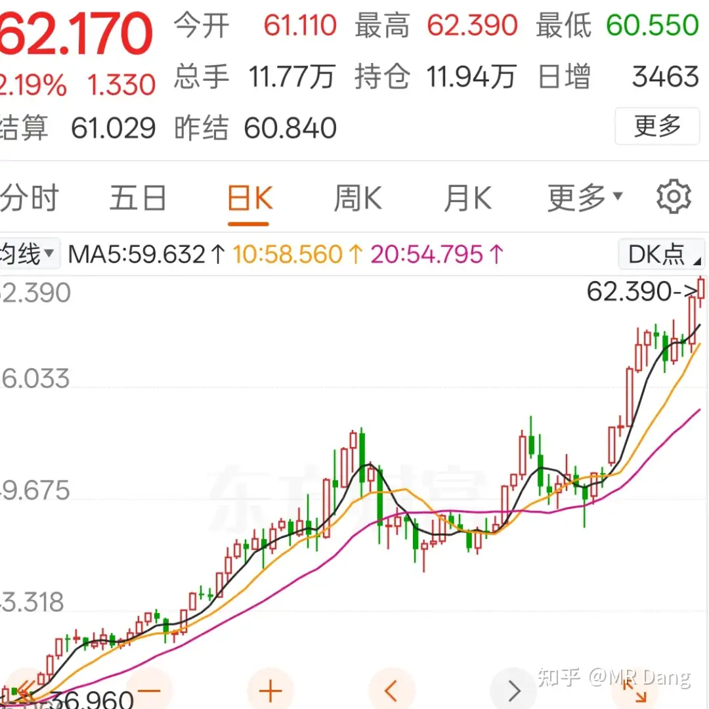
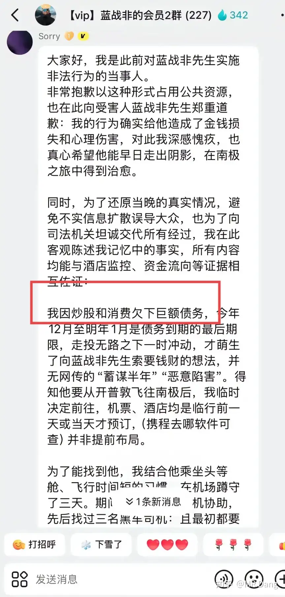

# 如何看待2025年12月11日A股行情？

---

**发布时间**: 2025-12-11 07:27  |  **原文链接**: https://www.zhihu.com/question/1981861489808791442/answer/1982350759392743479  |  **点赞数**: 548 人赞同

**作者信息**: MR Dang​独立投资人，不接广不卖课

---

## 正文内容

日常唠嗑，想到哪说到哪。

昨天的市场里比较显眼的是w企直线拉升，h股直线拉了十几个点。

这个我之前说过，有大资金潜伏进去了狙击空头，因为空头持仓太多了，市场流动性不够空投回补的。

像这种逼空行情，一般就是空头暴完了就算结束了。

这也是我为什么从来不做空，看空的东西你可以不参与，自己避坑就行了，做空是很危险的事情。

当然这是资金面的情况。

消息面的情况，就是传言要贴息什么的，还要展期。

贴息，我感觉不会贴存量，贴也是贴新增，而且出钱的是上头的，轮不到银行贴。

大家想想，如果新f有贴息，二手f在相同的情况下，价格会怎么走？

展期就麻烦了，w企的现有债权人按照对w企的债权规模一个一个来。

银行股里有一个跌的比较显眼的大行，和w的上涨形成鲜明对比。

关于这点我在11月27的帖子里提到过：

不过我还是要说一句，稳定压倒一切。

在咱们这片土地上，有两组关系比较复杂的经济体。

一组是煤炭和电，长期的博弈过程中，电是比较强势的一方，煤稍微弱一点。

另一组是房企和银行，极限二保一的情况下，一定是后者，不可能选前者，稳定压倒一切。

至于w企，还是要看以后它的销售能不能稳住，销售稳不住，借来多少钱都不好使，最多也就是强行续命一段时间。

昨天统计局发布了cpi数据和ppi数据：

上面是官方数据，cpi比我乐观预期的下限1%低了一些，ppi符合预期。

原因出在水果上了，蔬菜同比14.5%落在了10%到15%的区间，但是水果同比0.7%有点出乎我的意料。

我仔细复盘了一下，应该是水果的成熟周期比蔬菜更长，因此传导速度比蔬菜更慢，所以化肥的传导还没过来，目前的水果定价还以冷库中的库存为主。

最后导致的结果就是cpi测算结果出现偏差。

挨打要立正，好好总结经验，争取下次预测更接近一些。

尽管这样，cpi依旧和ppi形成了剪刀差，这是个值得重点关注的信号。

美联储降息25个基点，根据点阵图显示，明年只降一次。

有人说了这不鹰派么？说好的75个基点呢？

是这样的，这个点阵图看看就好，是为了管理预期的，如果哈塞特上来，这个点阵图就可以擦完屁股扔进废纸桶里了。

明年大概就是降息75个基点，多的话能到100个基点，现在的很多交易也是按照这个进行交易的。

鲍威尔的表态超过预期，我个人觉得算是鸽派了：

并且顺手把锅扣在了懂王头上。

受这些消息影响，白银再创历史新高，逼空继续：

大家老听我说逼空逼空，很多人估计还不知道什么叫逼空。

我举个例子吧，本来价值40块的东西，按照50块交易，这算正常波动。

本来40块的东西，因为短时期内库存原因，我赌你没有足够的现货，我炒到60，70甚至80，100，逼着你必须买了给我，这就叫逼空。

谁让你当初签了一份必须给我买东西的合同呢？

我不要钱，我就要货。

逼空的时候和基本面没关系，只和两样东西有关系，一个是逼空方的资金优势，另一个是做空方的认怂速度。

有些做空的投资者不甘心，还想着反抗一下，认怂认的比较慢，那就会产生巨大的烟花，价格就会被推到一个让人难以置信的地步。

这也是我不做空任何东西的原因，做空以后就脱离基本面了，只能祈祷做多的投资者枪里没有子弹。

黄金和铜、石油等大宗商品也都有略微上涨的表现。

懂王发售100万刀的润卡，引起抢购。

500万刀那个还在卖，待遇更好，还有免税期。

蓝战非的瓜有最新进展，居然是股民：

粉丝群里的狼人自爆，目前身份真实性可信度比较高，因为金额对的上。

但是细节方面和蓝战非的描述有比较大的出入。

比如刀。

比如金额。

比如取经。

---

## 精选评论

| 用户 | 时间 | 内容 |
| :--- | :--- | :--- |
| 败絮丶 |  | 周末看到讲万科逼空，看完只是想什么垃圾股票都有人接飞刀。结果昨天莫名其妙涨停了，才明白老师的含金量 |
| 似水年华 |  | 我也是觉得莫名其妙 |
| 小搬砖工 |  | 我觉得我真的是猪脑子。前天说cpi和ppi有剪刀差，我还想了想这个剪刀差利好哪个板块。后来下午看到饮料涨了，想着大佬预测cpi涨果断就买了牛奶。昨天一公布，百货涨停我怎么就是想不到。大佬能不能再明示一点，你买锡的时候一定要说啊 |
| &nbsp;&nbsp;&nbsp;&nbsp;MR Dang |  | 哈哈，不敢说了，都是抢跑的 |
| 下辈子还做猫 |  | 我想我邮储也没多少万科债啊，结果还是让踩的不得了，但是一看招商，哈哈哈，比我惨就好多 |
| 柠檬冰可乐 |  | 啥意思？我是说昨天招行怎么跌这么多？ |
| 潇洒 |  | 会回来的，莫慌 |
| 柠檬冰可乐 |  | 没有重仓，无所谓。观察。 |
| 村妞在乌村 |  | 招商总部深圳，深圳有这好事能少得了它 |
| hxsx |  | 老师，早。我发现很多同学都只会瞎抄老师你作业，至于老师写的那么多功法全然不顾，跌一点就心态崩了。 |
| &nbsp;&nbsp;&nbsp;&nbsp;MR Dang |  | 新投资者都会经历这个阶段，理解理解 |
| hxsx |  | 老师，你心是真善 |
| 善恶 |  | 格局 |
| 韩太阳 |  | 法布施，剩下看悟性和缘分了，同样的一只股票，同时买，最后也有大赚的，也有赔钱走的 |
| op666 |  | 你们跟着长线逻辑做价值投资，又是短线思维每天要盯盘看图形。所以说有的人根本没想好就忙着炒作业，赚钱了喊一声大神，被套了来问怎么办，你们不亏钱谁亏钱 |
| 哈基米南北路多 |  | 一群神人天天搁那分析技术图形，又是什么死叉，又是什么趋势，结果还来这看价值投资 |
| 瑞锐 |  | 急啥逻辑这么硬，难得的好价格，而且跌得也不算多 |
| 泽越止 |  | 做啥都是平或者亏，只有做白银赚到钱，我还是回去继续做多白银吧 |

---

*本文件由自动脚本从MR Dang知乎页面提取生成*

---

**作者**: MR Dang
**链接**: https://www.zhihu.com/question/1981861489808791442/answer/1982350759392743479
**来源**: 知乎

*著作权归作者所有。商业转载请联系作者获得授权，非商业转载请注明出处。*
