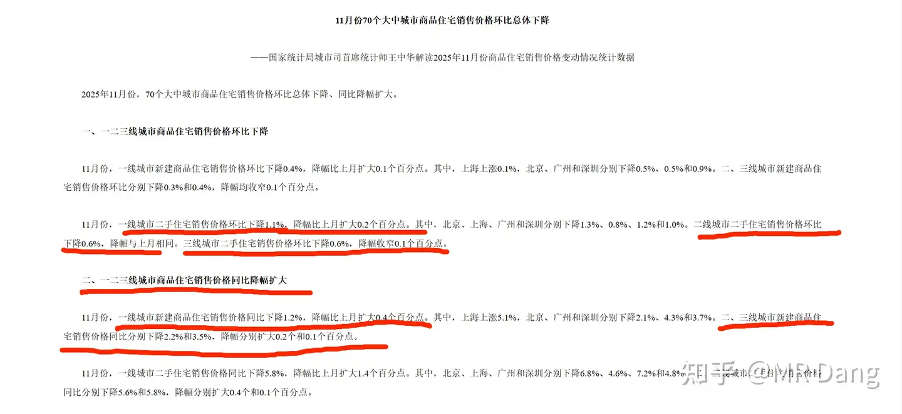
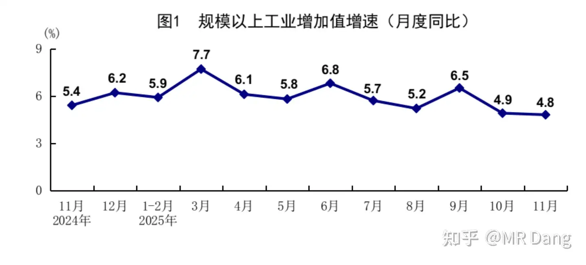
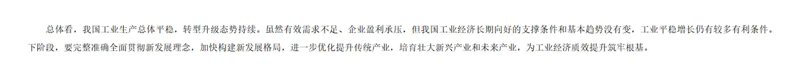
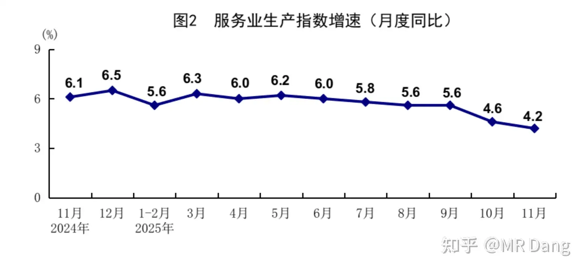
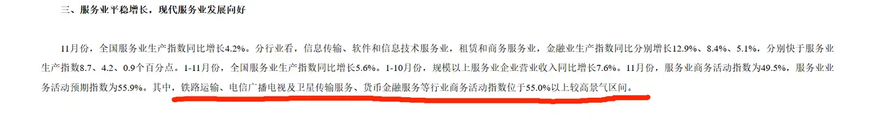
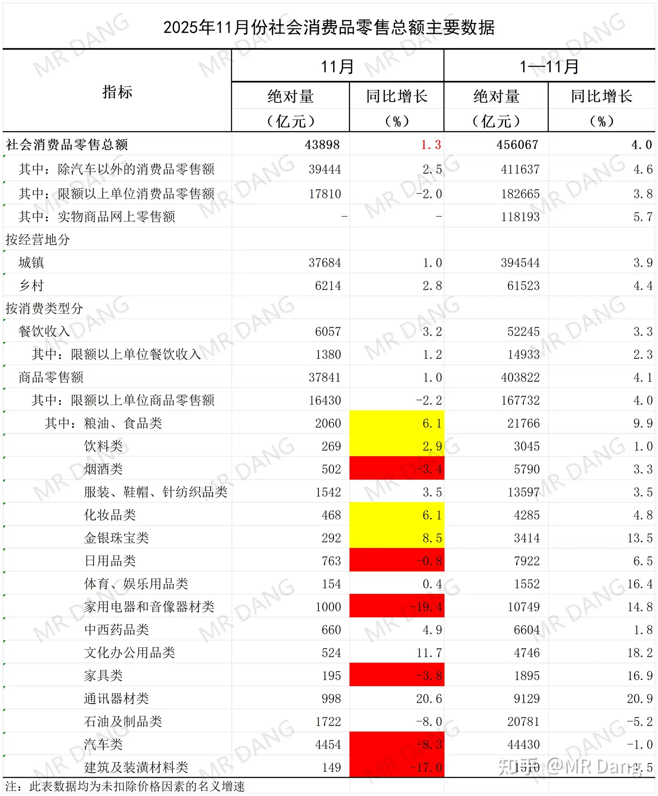
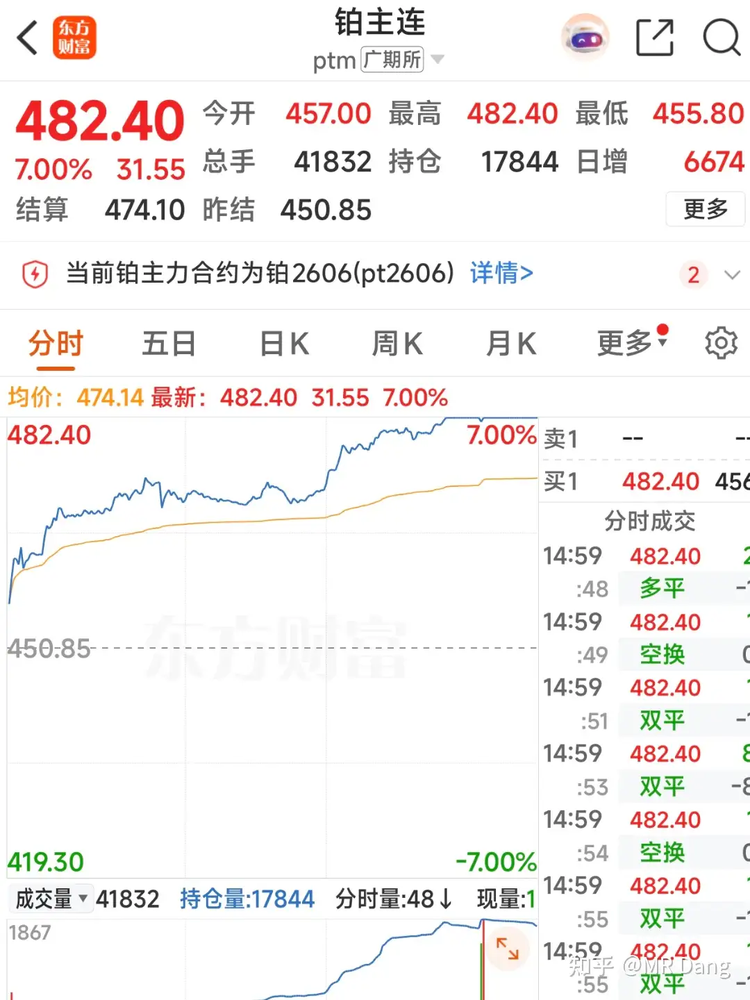
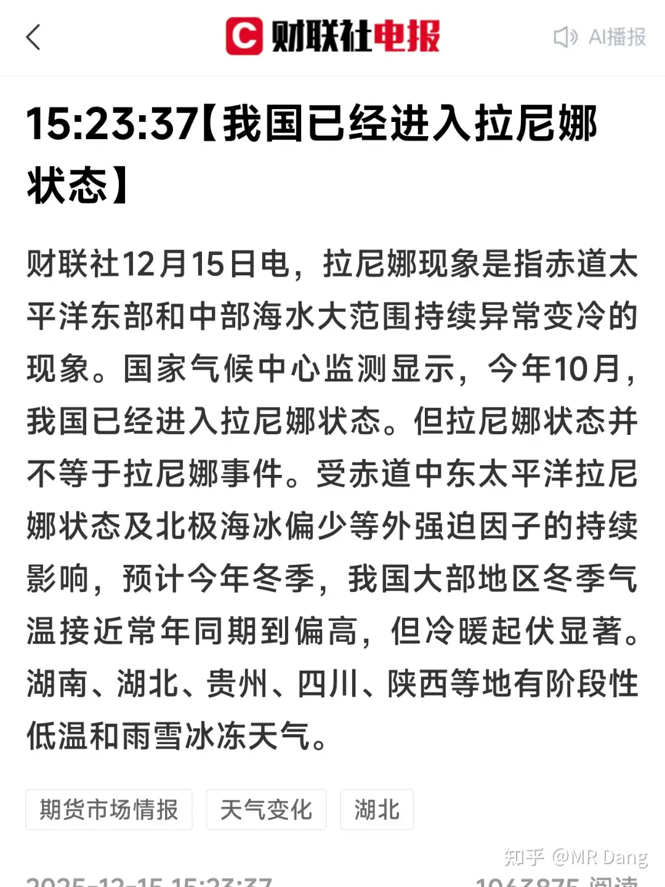

# 如何看待2025年12月16日A股行情？为何突然全线下跌？

---

**发布时间**: 2025-12-16 07:05  |  **原文链接**: https://www.zhihu.com/question/1983679610366468134/answer/1984157115741393444  |  **点赞数**: 653 人赞同

**作者信息**: MR Dang​独立投资人，不接广不卖课

---

## 正文内容

书接上回，先聊聊昨天发布的几组重磅数据：

一.F地产：

对价格有指导意义的是二手F的价格指数。

我一介博主，就不发表意见了，引用统计局首席统计师的表述：

环比下降，同比降幅扩大。

画成K线图的话，相信大家脑子都能画出来。

预期不是很好啊。

值得欣慰的是，有几个老读者在挂牌了两三个月、被砍了好几刀后终于传来了捷报。

二,工业，服务业，固投:

这个数据怎么理解呢？

"规模“以上是指多大规模？

2000万

”增加值“是什么意思？

这个增加值是扣除价格因素，扣除成本因素，对”产量“的描述，新增产量。

连在一起，反映的就是大企业的新增产出量，是供给端的数据。

也就是说比去年同期增加了4.8%的产量（而不是产出价值）。

总体结论的话，也有官方定论，我截取其中的一部分：

有效需求不足，企业盈利承压

服务业还行，主要是金融业撑着。

固投数据受到FDC的拖累，逆增长。

如果结合社零的数据看，就更有意思了。

三.社零：这个数据比较关键，1.3%的数据不太理想，如果再考虑CPI的话，以数量计算，可能是逆增长的。

表格来自统计局，我只是把其中不太理想的数据标了红，比较好的数据标了黄。

总的来说就是大额消费还有进步空间:

车，F，电器和酒。

表现还算可以的数据有：

吃的，喝的，首饰和化妆品。

口红效应显著。

代表了什么不言而喻。

之前的zc比较重生产，轻消费，重供应，轻需求。

现在统计数据出来后，最新的动向是也要扩大内需了，个别股票有所表现。

我的观点的话，我觉得一般人只有钱包鼓起来了才会考虑增加消费，收入问题是根本。

劳动性收入太卷了，那么多毕业大学生，不要指望太多，得靠资产性收入。

资本市场要有赚钱效应，上涨的个股数量就要够多。

盯着几个股票抱团就是自娱自乐，指数上去了也没用，股民又挣不到钱，消费就起不来。

F价也要企稳，不然早晨看着股市跌，晚上睡觉F价跌，第二天起来一看还降薪了，消费能起来才是有鬼了，指望贷款消费么？

回到国内事件，l3智驾正式落地：

l3智驾在重庆和北京正式落地，虽然有速度和区域的要求，但也是里程碑的大事件。

第一批吃螃蟹的车企是长安和北汽。

昨天白天铂期货涨停：

这个铂之前提过，没什么好的标的，因为国内没矿，都是回收利用，只有两家企业，一家g企业和一家h企业。

回收的时候，如果铂涨价了，相应的回收物也会涨价。

和有色矿涨价不是一个逻辑。

只有存货升值有可能受益，但是这两家企业还有期货套保，所以存货能升值多少也不好说。

真的很想参与，只有期货市场一个途径，不过期货的风险……emm，别说新手了，老手也要谨慎。

我国已进入拉尼娜状态：

拉尼娜状态≠拉尼娜事件

但是可以当成拉尼娜事件去分析。

---

## 精选评论

| 用户 | 时间 | 内容 |
| :--- | :--- | :--- |
| 麋鹿迷了路 |  | 早晨看着股市跌，晚上睡觉F价跌，第二天起来一看还降薪了，消费能起来才是有鬼了，指望贷款消费么？ |
| 映月 |  | 关于F和恒生科技，老师不厌其烦说过多次了，态度坚决，立刻跑路，长痛不如短痛，就看大家听不听得进去了 |
| 牛马攒股 |  | 恒科也跑？ |
| 上山找妖怪 |  | 恒生科技这东西，就是跌的时候慢慢分批建仓，涨的时候慢慢分批止盈，很考验资金管理能力的，一键启动和一键结束的，会被反复割 |
| 若星汉天空 |  | f是哪只啊 |
| 知乎用户Jet |  | 房子 |
| 唯依 |  | 老师早，恒科最近持股体验确实有些爆炸涨一天跌三天 |
| 百变先生 |  | 懂了，继续买银行，买俩，一个传给小，一个传给妮。 |
| 败絮丶 |  | 老师早，回答在关注页刷不到，点进主页才能刷到，可以关注下原因 |
| &nbsp;&nbsp;&nbsp;&nbsp;MR Dang |  | 限流了 |
| 菠萝落橘 |  | 同问 |
| felipe dupont |  | 我都点的特别关注 |
| 夏天 |  | 一直是这样的 |
| 瑞锐 |  | 恒生科技之前还好提前问了直接割掉了，房子挂出去大半个月有一人来看了下房，离成交遥遥无期 |
| &nbsp;&nbsp;&nbsp;&nbsp;MR Dang |  | 好不容易来个人要留住 |
| 三哥数签签 |  | 卖房子这个事情，要么不卖，要么就要坚决。如果别人降1万你也降1万，别人降2万你也降2万，可能永远都卖不出去。如果不看好了，别人降1万你就降3万，很快就成交了。股市一样的道理。 |
| po希希 |  | 严格执行早卖晚买策略，昨天把铂卖飞 |

---

*本文件由自动脚本从MR Dang知乎页面提取生成*

---

**作者**: MR Dang
**链接**: https://www.zhihu.com/question/1983679610366468134/answer/1984157115741393444
**来源**: 知乎

*著作权归作者所有。商业转载请联系作者获得授权，非商业转载请注明出处。*
