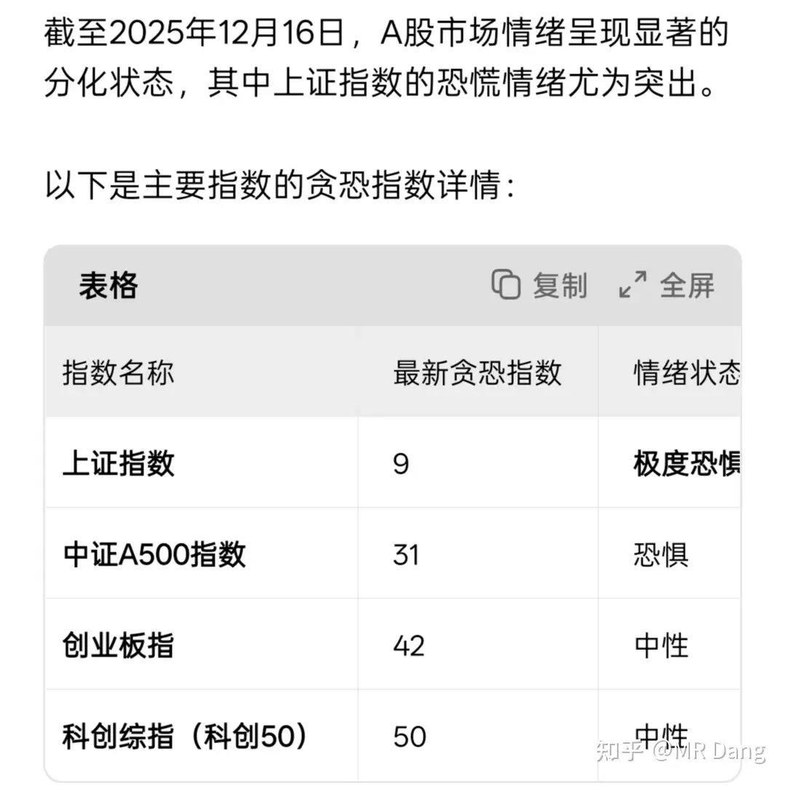
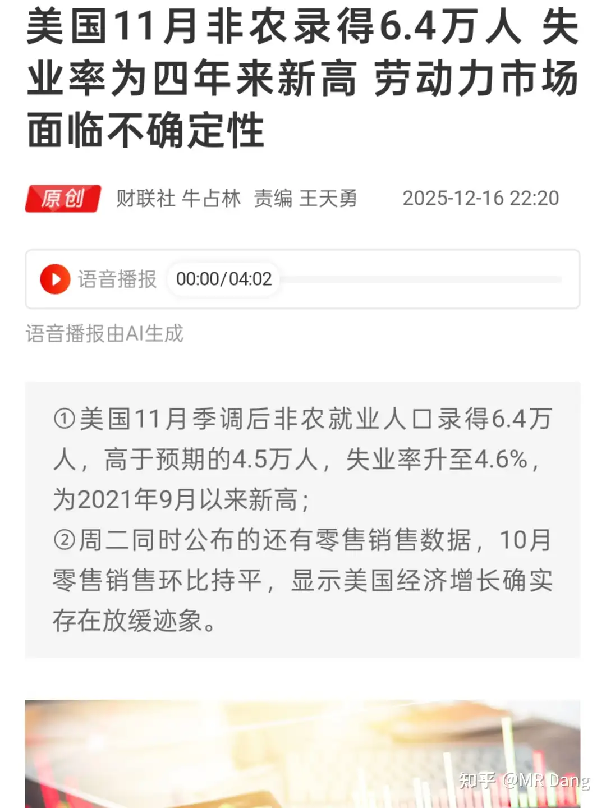

# 怎么看待2025年12月17日A股行情？

---

**发布时间**: 2025-12-17 07:10  |  **原文链接**: https://www.zhihu.com/question/1984039725871437634/answer/1984520861395485834  |  **点赞数**: 567 人赞同

**作者信息**: MR Dang​独立投资人，不接广不卖课

---

## 正文内容

昨天指数跌的不多，但是对情绪打击还是挺多的，一般这种时候不能让他白跌，投资者复盘的时候需要干三件事。

第一件事，是检查自己有没有感到十分的焦虑，比如睡不好觉，影响食欲，收盘后每时每刻惦记着仓位。

如果有这些症状，除了要调试心情外，说明仓位重了。

很多人在开仓的时候因为是牛市，完全高估了自己的风险承受能力，那么现在就是一个很好的机会去直面自己的承压能力。

患得患失对投资者来说是影响收益率的重要因素，很多投资者模拟盘或者轻仓的时候收益率尚可，一旦重仓或者满仓，动作就严重变形，最后的结果往往不好。

第二件事，是检查自己仓位的回撤和指数以及中位数的关系。

比如昨天上证指数-1.1%，中位数是-1.55%。

组合回撤在1%以内，说明组合的风险控制做的挺好，回撤在2%以上，就要反思是不是哪里布局的不对，太激进了。

我的有色部分回撤的多，有3%，但是消费部分的金店药店佛光普照都是红的，银行仓位大，回撤少，农化回撤1%，一众杂毛和邪修回撤0.5%，最后的结果就是持仓部分回撤1%以内，那说明这个1%属于系统性风险，忍不了也得忍。

我为什么一直强调配置，银行要重仓，哪怕有色行情很好的时候也在念叨着消费。

因为行情就是无法预测的，投资者能做的就是根据价格去配置一定比例的资产，持有生产资料，最后通过生产资料干活获得收益。

但是有些人get不到这些，满脑子都是互掏口袋，庄家，主力，吸货，出货这些。

这类投资者的市场观还停留在远古时代，认识不到市场是一个多元博弈的最终结果，也不相信价值投资什么的，整天想的是总有刁民想害朕。

把除了自己以外的投资者用一个庄家或者主力这样的词汇来描述，思考的就是怎么样打败主力/庄家，从庄家口袋里爆金币。

我认识很多这样的投资者，无论是现实生活中还是网络上。

以我的统计来看，由于这部分投资者的市场观已经落后于时代，无法适应现在的市场，所以可能以前有过辉煌的过去，但是目前普遍长期收益率都不太理想，也是怨气最大的一群人。

第三件事，就是检查自己的组合有没有起到预想中的对冲作用，比如我用c公司对冲铜王，那铜王跌了，c公司就得支楞起来，最后对冲不掉的部分就是系统性风险。

大概心算一下，大差不差，那说明找的这个对冲标的起码还有点用，c公司可以继续拿着用来对冲风险。

博主博主，你说的道理我都懂。

但是不说主力资金流入流出这些，怎么描述股票的资金流向呢？

有没有什么指标，最能反应市场真实的交易情绪，而不是那些交易软件的什么大单流入流出？

有的，兄弟，有的。

今天给大家安利一个指标，玩期权的投资者一般都了解，但是还有点很多股票投资者听都没听过。

这个指标就是贪恐指数。

什么是贪恐指数呢？

贪就是贪婪，恐就是恐惧。

这个指数的原理就是利用股指期权的升贴水情况，结合波动率和股债收益率的差距，综合考量市场内创新高股票数量，两融数据等，最后得到一个量化的指标，去衡量投资者的情绪。

总之，一个很科学很综合很量化的指标。

指数从0到100，0代表极致的恐慌，100代表极致的贪婪。

一般来说，指数10以下提示非常恐慌，是长期布局的好机会。

指数90以上代表过于狂热，是短期内的好卖点。

这个玩意儿，一般的软件看不到，只有专业的期权软件或者科学上网可以找到。

但是现在有了ai，直接问它“今天a股的贪恐指数是多少”就行，给的数据都挺准的。

昨天盘中看着锡王跌破25，曾经一度非常手痒，手指头已经在铜王的仓位上准备着了，但是一看到铜王价格距离我理想的位置还有一些，就作罢了。

锡王我重仓是必然的，就看什么价位。

但是我不太想单独发一篇文章，因为没有股息率作为保障，而且现在在高位，除非补上了前期那个21左右的跳空缺口，那我就写一篇。

我也可以简短分享一些我的一些理由，仅供参考。

首先，从产业格局来说，东大擅长卷，所以东大大量生产的产品我一般是回避的。

东大善于生产什么产品，什么产品价格就会崩。比如光伏电车，我虽然看好个别公司，但是也因为这个原因一直没动手。

反过来，东大需要进口的东西，都是我喜欢投资的行业，因为一般东大大量进口什么，什么东西价格就会稳住或者起飞。

其次，锡这个东西，是现代的电子胶水。

很多电子工业品，光伏，电器，机器人，ai，都需要它。

像机器人，ai，肯定是未来的主线之一，锡的需求一定是往上的。

用人均数据说的话，欧美人均用锡量是5kg，东大人均用锡量0.5kg。

还有很大发展空间，但是地球上的锡已经不够东大把人均提到5kg了。

它还不像石油和煤炭，铜和铝什么的，有替代品，它完全没有替代品。

东大锡的产量是18万吨左右，储量是110万吨左右，静态储采比也就是六年的事情，考虑到进口，这个时间能延长到12年。

很多人会拿石油举例子，说你这是贩卖焦虑，会边挖边发现新的。

其实锡和石油还不太一样，容易开采的砂锡矿在国内锡矿中只占12%，剩下的88%多都是共生矿，选矿难度大，开采成本高，多少年来没发现多少新增储量。

剩下的110多万吨储量，很多还是尾矿，经济价值低，品位低。

我老说锡王锡王，锡王的储量是68万吨，基本上超过全国一半，称得上一声王吧。

产量9万吨，也超过全国半壁江山。

就锡的储量和产量，是那种肉眼可见的在未来的供需关系会严重失衡的金属。

还有一个原因。

锡还不好回收，它没有特别集中使用的地方，一块电路板用几克，价格还比不上贵金属，没人专门为了锡去回收。

最后，说说为什么不做期货，要买锡王。

不做期货的原因是期货没有时间补偿。

比如锡价，如果一直维持在30万，那做期货就是0收益，如果移仓，还会有磨损。

---

## 精选评论

| 用户 | 时间 | 内容 |
| :--- | :--- | :--- |
| 败絮丶 |  | 老师，基本上满仓内心还是没啥波动，是病吗 |
| &nbsp;&nbsp;&nbsp;&nbsp;MR Dang |  | 是肉眼可见的天赋 |
| kangjie |  | 东大善于生产什么产品，什么产品价格就会崩。东大需要进口的东西，都是我喜欢投资的行业，因为一般东大大量进口什么，什么东西价格就会稳住或者起飞。   指导性思路 |
| &nbsp;&nbsp;&nbsp;&nbsp;MR Dang |  | 不然为什么对东大恶意这么大呢，这轮内存涨价，海力士想的是控量保价，要是东大的话，直接kuku扩产，用内存条把海都给填咯 |
| 卡夫卡卡 |  | 昨日回撤0.7%，55%仓位银行。 |
| 孙绍 |  | 昨天差点给我干红了，还好我机智，补了一手好仓！ |
| 先驱者 |  | 这就红温了 |
| 蚂蚱一小腿 |  | 最近几天农行股降了不少是个啥意思呢？长期持有的话应该现在进入？ |
| 一口毒奶 |  | 我买银行股 黄金ETF 白银期货了 谁都不能割我韭菜加息 我银行赢 降息 我黄金赢 无论怎么样我都赢 |
| Echo |  | 我仓位重，但我买的都是大佬推荐的，一点都不担心，吃的香睡得好 |
| 晨风 |  | 昨天浮亏一个点左右，对我来说，算比较大的亏损了，但显然比以前心态好了。昨天抄底抄早了，仓位有点重了，后面再跌，不看账户了。我昨天补了一手锡王，现在2手了。跟紧老师步伐，长期拿。 |
| &nbsp;&nbsp;&nbsp;&nbsp;MR Dang |  | 一手王 |
| 斜日寒林 |  | 同1手，随工资进账逐步补仓 |
| 檀木 |  | 请问锡王是哪个 |
| 夏天 |  | xygf |
| 斜日寒林 |  | 集成电路领域表示确实锡太重要了，简直在电子行业无处不在。低熔点、高导电、强润湿性以及相对低廉的价格，目前就是没有替代物 |

---

*本文件由自动脚本从MR Dang知乎页面提取生成*

---

**作者**: MR Dang
**链接**: https://www.zhihu.com/question/1984039725871437634/answer/1984520861395485834
**来源**: 知乎

*著作权归作者所有。商业转载请联系作者获得授权，非商业转载请注明出处。*
