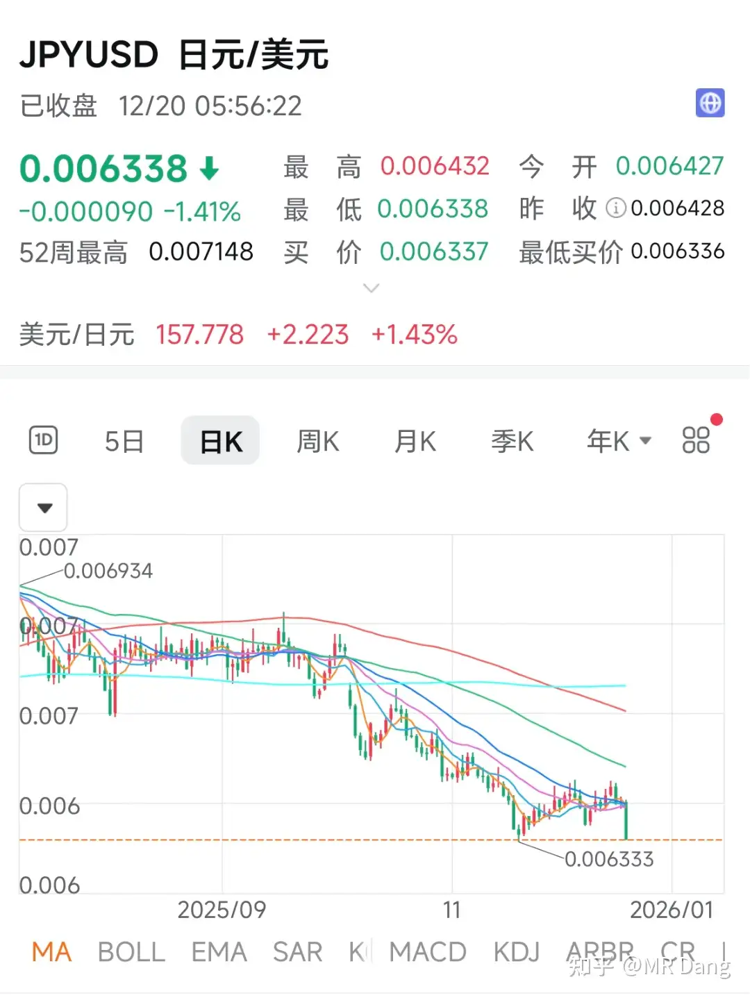
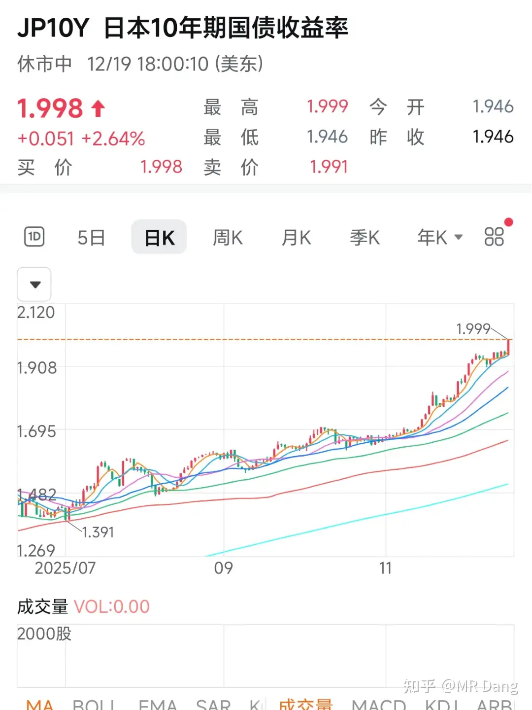
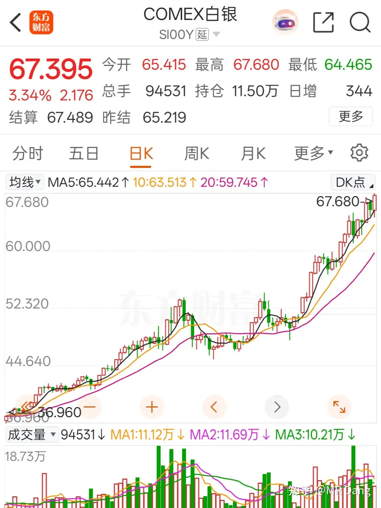
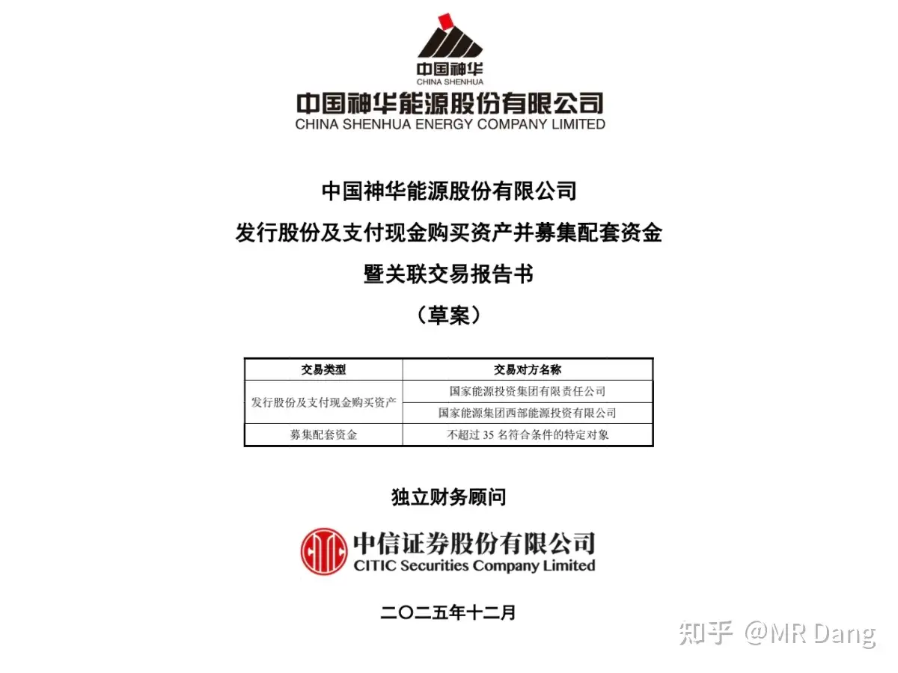
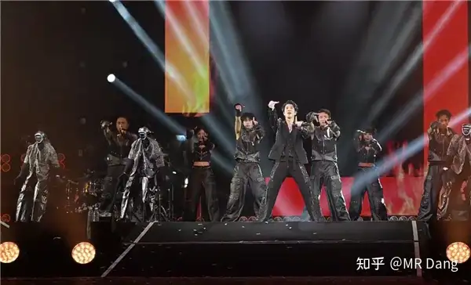
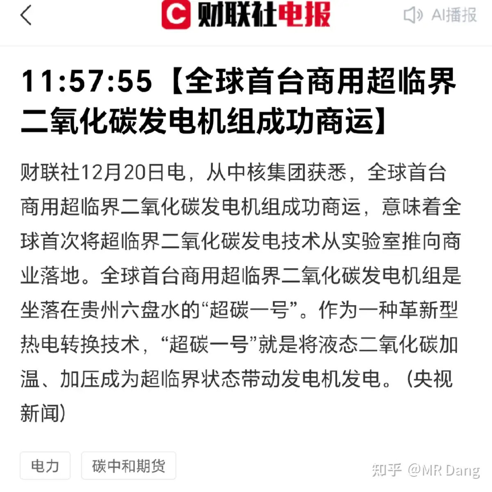
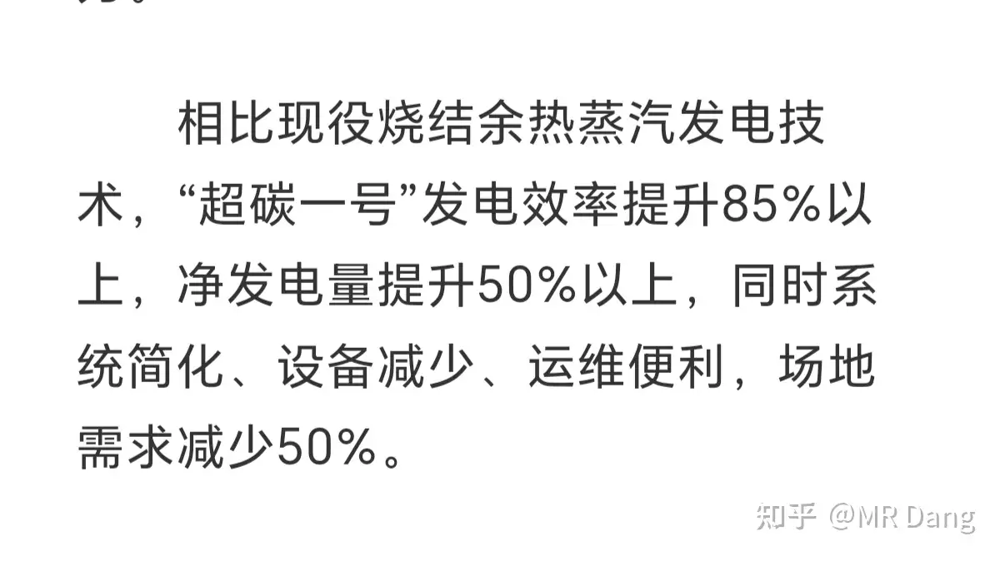
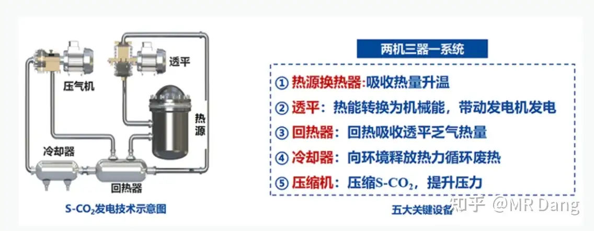
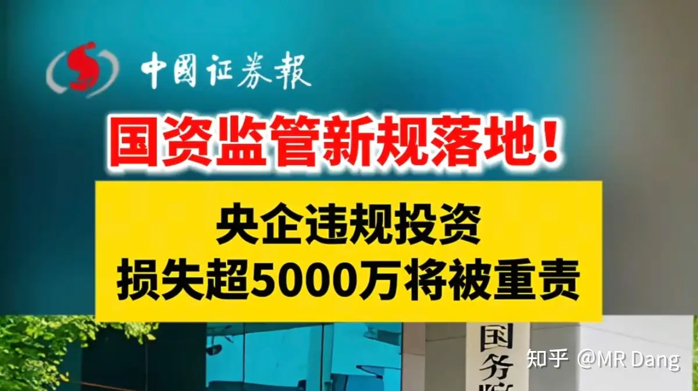
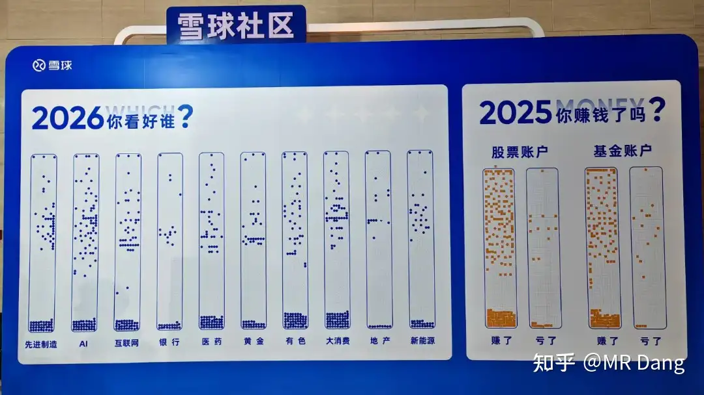

# 如何看待2025年12月22日A股市场行情？

---

**发布时间**: 2025-12-22 07:13  |  **原文链接**: https://www.zhihu.com/question/1985383889473135013/answer/1986333518863802472  |  **点赞数**: 655 人赞同

**作者信息**: MR Dang​独立投资人，不接广不卖课

---

## 正文内容

先回顾下上周的情况：

最主要的是几大央行的议息情况全部落地，全部都在预期内，资本市场几乎没有反应。

比如日本加息，早就被市场消化了，所以加息落地后对资本市场没有影响。

但是日本这次加息后，有一个现象比较反常，就是汇率反而崩了。

同时，长债端翘头，10年期接近2%的收益率。

种种迹象表明，日本失去的xx年又要来了。

汇率保不住，物价压不住，加息25个基点根本不行，所以明年，也就是2026年，日本还会有多次加息，以后加息很可能常态化。

而资本市场对相同的消息产生的反应是边际递减的。

比如俄乌，第一声枪响的时候还有点反应，现在再怎么打，除非掏出蘑菇蛋，都对资本市场没有多大的影响了。

日本加息也是，以后就习惯了，加就加了，还能怎么样呢？

国际市场，银价又创新高了：

逼空是这样子的。

有的机构已经看到三位数的银价了，也有机构认为实际价值在50美元左右，多空分歧剧烈，最后就是靠钱说话。

不过目前银价走势没有走出超出以往斜率的曲线。

假设这是一场逼空的大戏，目前还没到故事的高潮部分，还属于铺垫环节。

西大的资本市场反弹不少。

爆出了68张图片的猛料，就挺辣眼睛的。

（不好意思串台了，应当放到娱乐新闻。）

又清扫了一批典型的股票自媒体。

这种不正规的瞎写的自媒体太多了。

我记得以前某个大v看到腾讯还是哪个港股的热门股票停牌，开头就是《震惊！xxx深夜突发停牌》，然后一顿分析猛如虎，什么重组，业绩，合并，收购巴拉巴拉的。

我一看不对啊，这不港股挂风球了么？整个港股市场都停牌了啊。

一个连风球都不懂的大v，我甚至怀疑他有没有交易过港股都是问题，居然在那个平台混成了几万粉的大v。

这种分析能靠谱才是有鬼了，股票自媒体这行业入行门槛太低了，开局一张图，涨粉全靠P。

根据官方的表述，几个要素分别是：群聊信息，收益截图，预测走势，稳赚不赔，煽动买入。

大家根据这几条自行甄别，同时也是对我个人的警醒。

每天冒出来的股票自媒体可能数以万计，靠官方这种零星的整治是能忙不过来的，必须加强自身的防骗意识和安全理财意识。

煤王发布重磅公告：

简单的说，就是收购"优质"资产。

收购方式是现金和股权增发相结合。

比较良心的一点是，根据测算可以稍微增加每股收益。

但是动用了这么多现金，未来的潜在股息率可能受到影响。

还有就是有些投资者可能会联想到DQ铁路。

我没有股票，我觉得如果假设我有的话，我可能会稍微有些担忧。

我的评论区里煤炭股也是问的比较多的，有一些投资经验不是那么丰富的投资者还会问某某煤炭股，股息率十几个点，你怎么不买？

我想说的是，煤炭股的高股息率已经是过去式了，目前的煤炭股预期股息率高一些的也就5个点左右了，甚至都到不了。

而且从商品的角度来说，铜是铝的上位替代，油是煤的上位替代，现在油价都起不来，煤价就不要抱太大期望了。

含蓄的说法就是煤炭的供应在未来一段时间内会保持宽松。

宇树机器人在王力宏演唱会上大火：

主要是马斯克转发了相关消息，彻底引爆了舆论。

不过如果关注机器人产业链的，应该知道机器人的迭代速度非常快。

在性价比方面，前一段时间有一个万元以内的产品小布米机器人。

在性能方面，有一个众擎T800，运动能力甚至比宇树机器人更高。

在适用性方面，有云深处的全天候机器人DR02，防水能力max。

所以这不是一两家公司的问题，而是整个产业链的优势。

为满足广大投资者对优质半导体企业热烈期盼，又一家半导体企业即将ipo，融资额度75亿。

某水泥上市公司通过基金间接持有不到2%的股份，根据金融工具准则，对持有的部分应当归类为"交易性金融资产"，上市后市值上涨的部分计入"投资收益"，进入利润表。

成本大概是两亿多，假设上市后市值千亿，可能确认的投资收益在十亿左右的级别，折算下来大概每股一元左右。

看到没有，辛辛苦苦干一年，不如一级市场投芯片。

但是这个属于一次性收入，不能按照pe估值，要按照pb计算。

该公司目前市净率1.2，计算得知影响股价0.8元/股比较合适。

如果明天股价涨幅远小于这个数字，比如不到测算的一半，我个人考虑会进行投机套利。

如果涨幅巨大，那我就会忘了这茬事情，当做无事发生。

请勿模仿！！！刀尖舔血！！！

还得是大A，对半导体企业的估值又高，上的数量还多，通过杠杆效应还能让持仓的基金保持高净值和大比例浮盈，良性循环。

海南封关的消息，沸沸扬扬了。

这消息酝酿很久了，没有信息差，现在冲进去要注意风险。

要说利好的话，海南的交通运输，旅游类的感觉有一定的预期。

但是还是那句话，很久之前就有相关消息了，现在一定不是好的进入时机，一定要注意风险，谨慎！！！

超碳一号正式商用：

以后再也不能说"科学的本质就是烧开水了"，要改成"科学的本质就是烧二氧化碳了"。

性能上，宣传的十分炸裂，不过以我朴素的科学观，我对这个发电效率提升85%以上表示谨慎怀疑。

原理如图所示，相关标的可以自行问ai，我不是这行业的专业人士。

我只能说在那一长串名单里，我看到了几个熟悉的妖股身影，可能又要炒作了。

不建议参与哈，就一个原因，现在是消息落地的最后一棒，风险很大。

《中央企业违规经营投资责任追究实施办法》从2026年1月1日正式实施，损失超过5000万会被重责。

等下发布最新的lpr，预期的话是降准不降息，所以应该会保持不变，如果降息就算超预期利好。

今天智元机器人会发布一个租赁服务的大会。

hw新品发布会也在今天，不知道有没有出人意料的投资机会。

隔壁平台又在办嘉年华了，一堆大v共襄盛举，其中有个行业投票环节：

一开始画风是这样的：

后来投着投着，画风就变成了这样：

Ai行业和地产形成了鲜明对比，一个是一致性看多，一个是一致性看空。

这个投票怎么说呢？你可以理解为仓位摸底。

一般人不会投自己没有仓位的行业。

都在投ai代表了场内的大v都买了ai的股票，预期打的很满了，稍微不如预期，那表现就会崩。

同理，地产没人投，意味着没几个人有地产仓位，预期非常差，那万一地产跌的少了，比如明年f加只跌了五六个点，说不定就是超预期了，地产股表现也许还不会太差。

这有点逆向思维的意思在里面。

为什么东财热股是反向指标？因为大多数人都是屁股决定脑袋，如果市场上只有看多的声音，那就是屁股都进来了，是危险信号：

能买的都买了，没有潜在的接盘资金，那就是最后一棒了，不崩才怪。

去年让他们投，肯定不会有多少人投黄金/有色之类的，一个道理，今年投的也未必准。

不能迷信大v，只不过是声音大点的普通投资者而已，打开账户看收益率，未必有你的高。

话说知乎能不能跟进下也办个类似的，然后把我喊过去，颁发个2025年财经领域百大新人奖之类的给我？

美滋滋啊美滋滋。

新的一周又开始了，祝大家本周也有斩获。

一个喜欢保护韭菜的博主，希望大家少少踩坑，多多赚钱！

---

> [!comment]- 点击展开评论
>
> | 用户 | 时间 | 内容 |
> | :--- | :--- | :--- |
> | zsy |  | 不用知乎，我们4w关注给大佬颁奖，2025最佳新人心理按摩师 |
> | &nbsp;&nbsp;&nbsp;&nbsp;MR Dang |  | 那很有含金量了 |
> | 财运杠杠的中年男 |  | 大佬，怎么看待大参林解除质押的消息呢？是利好还是利空？ |
> | hejzhb |  | 煤炭的逻辑是油车不行要淘汰了，电煤的需求变大，煤化工又冲击了油化工，煤反而比油景气了。 |
> | bear white |  | 油不行是电车销量持续增加+国际原油价格低，不是煤化工冲击，煤化工成本高，只有部分副产品有价格优势。电煤是动力煤，而焦煤价格持续走低，钢铁行业大面积亏损，景气不知从何谈起 |
> | 再减十几斤 |  | 海南板块在封关前三个月就炒起来了，我国庆前进去吃了一口，十二月上旬出了，现在进去怕是要接盘 |
> | 樱木灬晴子 |  | 发了个早上好，然后说违规了 |
> | fear1ess |  | 老师在药店这块的持仓是哪个企业，dsl吗？ |
> | 木向阳 |  | 是的 |
> | 糖果 |  | 铜王涨了 |
> | kangjie |  | 早上好 |
> | 共你历年寻新诗 |  | Dang大早昨晚在演唱会现场，机器人跳舞配上《火力全开》效果比预期的还好 |
> | 唯依 |  | 老师早，4w粉快到了。等待中 |
> | 小小柳生 |  | 老师，我现在每个月定投两手华夏和江阴，小白这样操作可以吗 |
> | &nbsp;&nbsp;&nbsp;&nbsp;MR Dang |  | 可以 |

---

*本文件由自动脚本从MR Dang知乎页面提取生成*

---

**作者**: MR Dang
**链接**: https://www.zhihu.com/question/1985383889473135013/answer/1986333518863802472
**来源**: 知乎

*著作权归作者所有。商业转载请联系作者获得授权，非商业转载请注明出处。*

---

## 相关阅读

**📈 每日行情评价：**
- [[20251223-如何评价2025年12月23日A股行情？]] - 央行议息与市场观察
- [[20251219-怎么看待2025年12月19日A股行情？]] - 周末行情回顾

**📚 投资方法教育：**
- [[20251013-什么是投资思维？普通散户该如何培养？]] - 投资思维培养
- [[20251023-价值投资的误区有些什么？]] - 价值投资常见误区

**📘 地阶功法：**
- [[20251022-《地阶功法卷一》投资者必须斩杀的三个妄念]] - 投资者心态建设
- [[20251023-《地阶功法卷二》价值投资三大误区]] - 价值投资核心理念

**📊 万粉感言：**
- [[20251122-三万粉感言]] - 投资心得总结
- [[20251227-四万粉感言]] - 投资经验分享

**🔙 返回：**
- [[每日行情评价]] - 每日行情评价全部内容