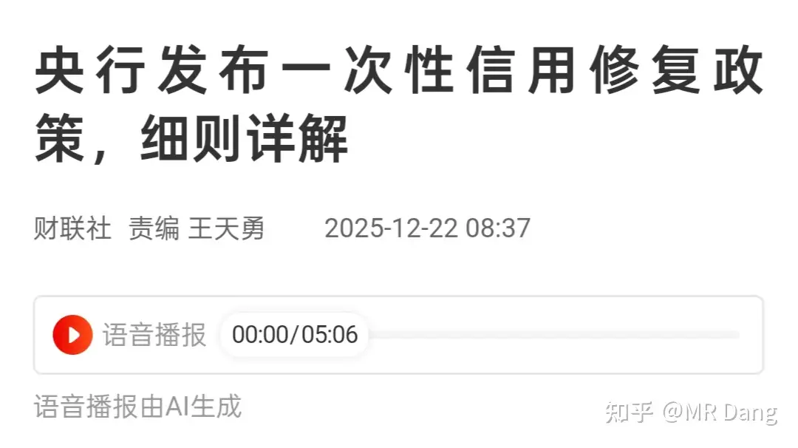
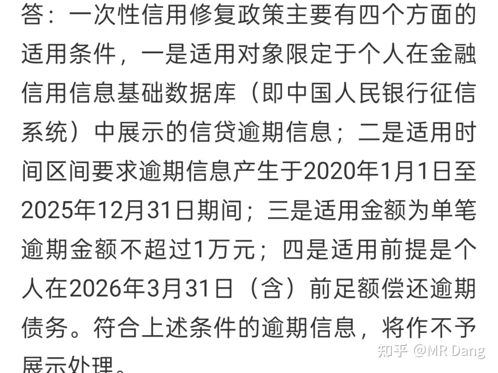
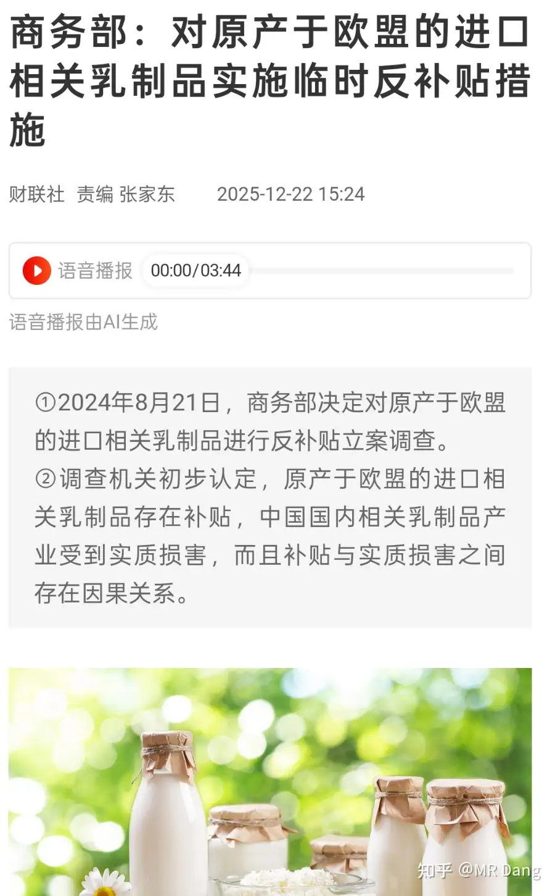
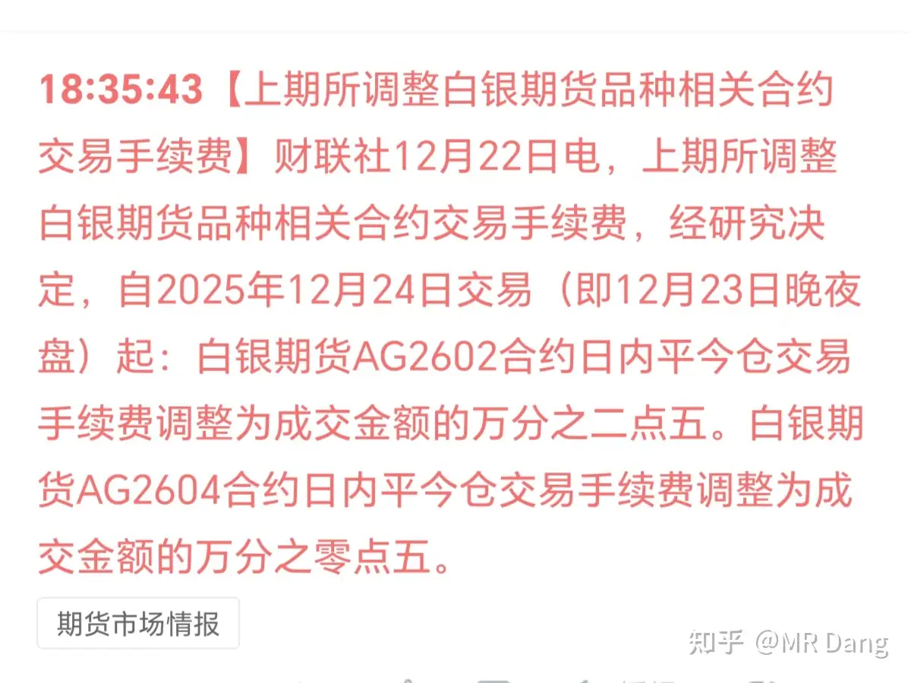
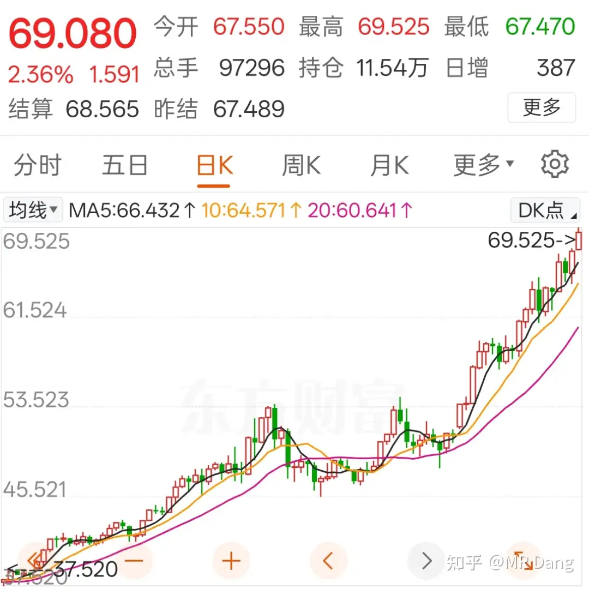
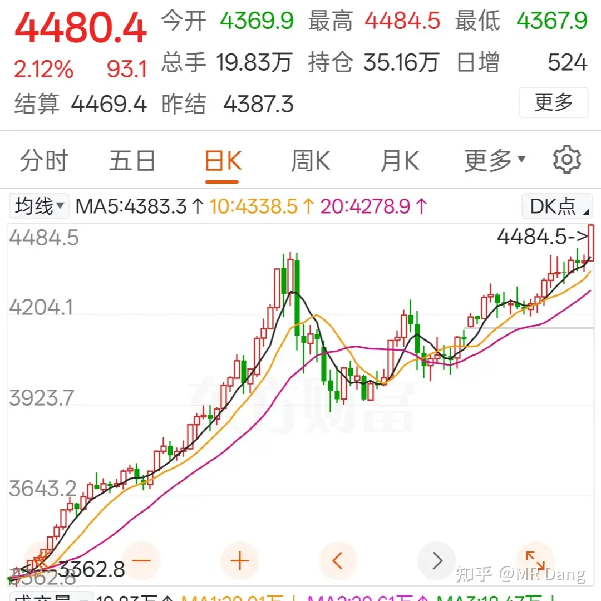
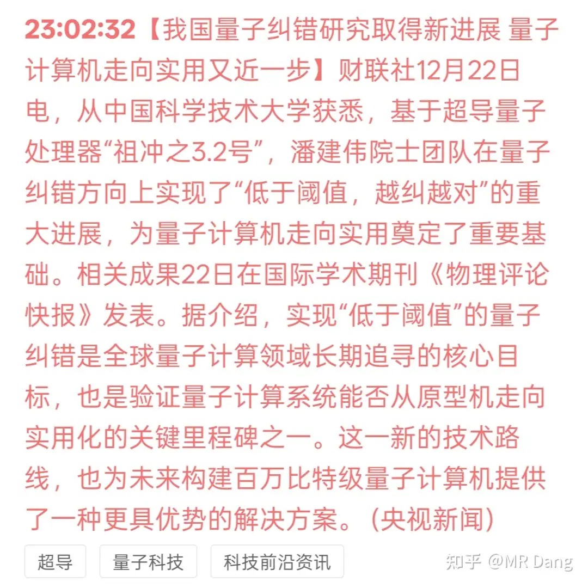
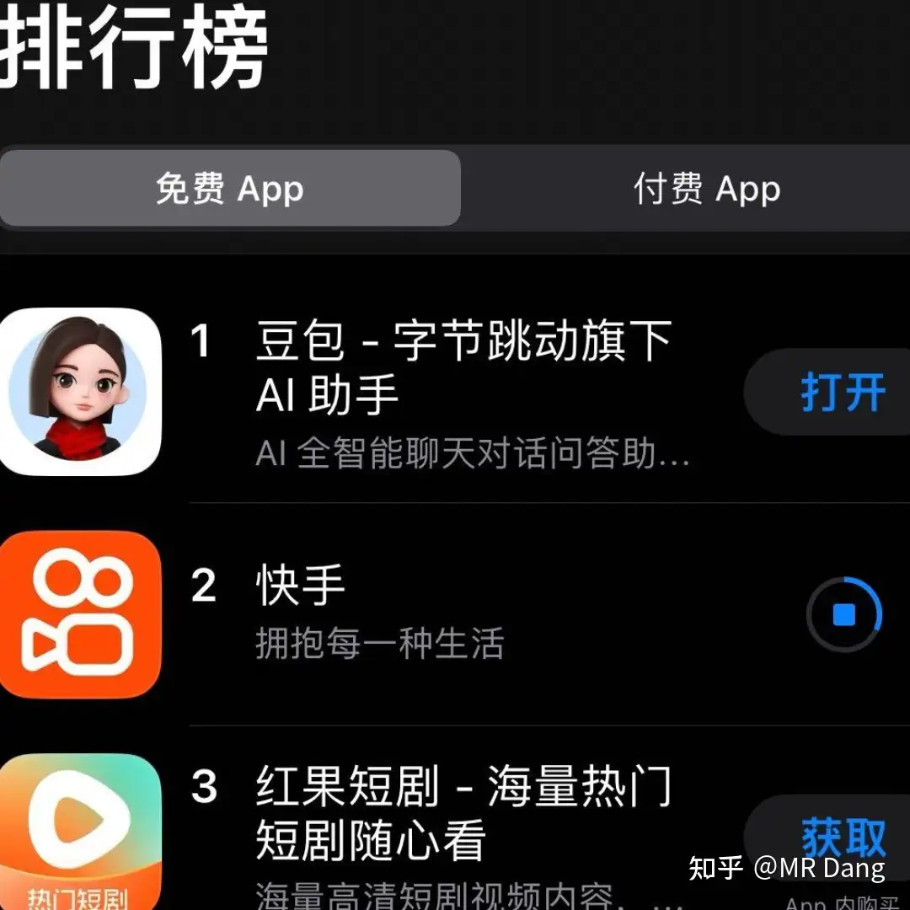

# 如何评价2025年12月23日A股行情？

---

**发布时间**: 2025-12-23 07:02  |  **原文链接**: https://www.zhihu.com/question/1986212900772283675/answer/1986693229744260469  |  **点赞数**: 449 人赞同

**作者信息**: MR Dang​独立投资人，不接广不卖课

---

## 正文内容

想到哪就说到哪，今天事情有点多。

昨天的lpr按兵不动，符合预期。

不过央妈出了个新Z：

修复个人信用，有四方面的条件：

1是对象限制：仅限个人，公司不行。

2是时间限制：2020年到2025年这六年间的。

3是金额限制：不超过1万元。

4是前提限制：足额偿还。

我个人的理解就是，特殊时期，因为一时周转不开，非主观故意的个人，给一次机会，就不要躺平了，赶紧起来还钱。

这个不用申请，符合条件自动执行。

对银行来说肯定是利好，这时间跨度挺大的，很多坏账说不定都核销了，这下子能转回来一些。

但是利好程度嘛，四个条件其实单独看都不算很苛刻，合在一起符合条件的就不好说了。

积极的影响是开了个好头，如果激活了更多躺平的普通人，以后可能在时间上和金额上还会有进一步的松绑。

不利的一面是，如果征信的威慑力下降，可能触发更多的人选择躺平。

所以这个需要更多的数据反馈来把握其中的力度。

总的来说目前理论上对银行和个人都是积极影响偏多。

讲道理，为了一万块把征信黑了确实不划算。

除非是那种穷途末路，无所畏惧了，不然把这钱还了才是最优解。

商务部对欧盟乳制品反补贴：

利好国内乳制品企业和新西兰等国的企业，国内的知名企业大家都耳熟能详，新西兰的安佳也是久负盛名。

但是冷静分析的话，去年乳制品进口依存度是27.9%，欧盟大概就是三分之一左右，合下来不到10%。

比较大，但也不是那么大。

消费的问题，主要是收入的问题，再准确的说是收入结构的问题。

富人再有钱，哪怕资产抵得上一万个中产，也只有一张嘴，喝牛奶不一定喝的过普通人。

就算喝的牛奶再贵，又能贵到哪里去，十倍就顶天了。

把他的财富匀一匀，大家一起喝能带动的消费远不是一张嘴可以比的。

emm，不能继续展开了，大家理解意思就行。

昨天的水泥公司更新一下：

昨天拍脑袋计算的时候有一个错误，计算估值影响的时候应该是×pb，结果我错误的使用了÷pb，低级错误，不应该。

因此可能对股价的影响在理论上大概是1.2块这样，留下50%安全阈值的话，股价涨幅0.6以内可能有利可图。

我昨天绿的时候一算，胜率和赔率还行，也算有点股息，就买了一些去投机，数量还不算少。

但是啥时候卖我还没想好，感觉空间也不是特别大。

因为上市确定性不是100%，上市以后套现也需要过了限售期才行，到时候股价啥样子谁也说不好。

业绩兑现起码到2027年以后了。

这种套利择时很难，如果今天给我一个好的价位，我可能今天就止盈了，夜长梦多，有利就走，积小胜为大胜。

还是那句话，比市场普通投资者算账算的稍微快那么一点点，自信那么一点点，动动手指就能有那么一点点的超额收益。

商品市场有新规：

简单的说，就是鼓励套保，限制投机，最近期货市场波动太大了，好多空头真的是一夜返贫，太吓人了。

说到期货，昨晚金银双双创新高：

白银站上69美元

黄金逼近4500大关。

按照之前的铜王止盈计划，已经马上到了我的止盈线。

我看了下浮盈比例，可能今天止盈的时候收益率在100%以上。

铜王我还打算留一点点，毕竟我还有c公司，等c公司止盈的时候把剩下的铜王一起出了。

铜王止盈容易，但是买什么就很难选。

想买锡王，锡王现在价格过于离谱，太贵了。

看了半天，有色全在高位，本来周末还看了个金矿，结果昨天一轮大涨又让人没欲望了。

琢磨了半天，今天打算一半买成磷王，一半空仓等锡王，在我这里空仓=银行股，不解释了。

等锡王回调到我可以接受的价格后，先把这部分空仓的打进去，继续回调就继续加，这样总仓位就会高一点点。

买磷王的原因是磷王比较稳，股息率尚可，相对有色来说现价也不贵。

要问为什么选4500这个位置止盈，我个人觉得站在4500的话，涨到5000和跌回4000的概率是55开，纯个人感觉。

所以，相对来说，值搏率不是那么诱人，综合考虑潜在的收益和风险后落袋为安。

但是你说铜王就到顶了？

不可能的事，铜王这样的生产资料，股价长期来看还是看涨的，依然是国内最好的有色企业，甚至没有之一。

不是不看好，是有我认为这个价位下有更好的选择。

提前做个止盈计划，盘中就不说那么细了，大家请勿模仿，鄙人不善择时哈。

量子方面有进展，这玩意儿我不懂，但是一看人名，这个我熟，利好量王：

国内某头部短视频平台k平台，据传由于被黑客攻破，大规模播了一些少儿不宜的片段，不利于儿童的身心健康。

目前影响还挺大。

可能利好网络安全方面的公司吧。

话说我是非常注意管理我家两个崽看手机的，除了给老师录制英语作业外，他们是不被允许接触手机的。

想玩游戏的话，我会和他们一起玩switch什么的，但是就是不能玩手机和刷短视频。

以k平台的用户体量，昨天肯定很多小孩打开了新世界的大门，手机都刷冒烟了。

k平台的下载量激增，也证明了大家对于这方面的需求：

这件事发生在美股收盘后，所以资本市场的情绪会在今天的港股释放，感觉影响不会小，注意相关风险。

今天有操作，所以得提前准备，主要是止盈铜王和有可能的投机仓位。

发早一点，不知道要审核多久。

话说昨天的评论区笑死我了，因为审核的原因，多出了一排排沙发，让大家也感受了一下新奇的体验。

一个喜欢保护韭菜的博主，希望大家少少踩坑，多多赚钱！

---

> [!comment]- 点击展开评论
>
> | 用户 | 时间 | 内容 |
> | :--- | :--- | :--- |
> | 小满 |  | 大佬早上好！昨天跟着您入了一点水泥，大概有三分之一的仓位。我真是从12月8号开户跟着您学习，慢慢接触股票的。本人认知有限，以前买基金的时候跟了一些广告博主，亏了一些，但是也算是有点经验和教训了。以前比较内耗，在知乎发现您这个宝藏博主后，感觉每天早上都有无限动力，仿佛生活中的恩爱情仇都与我无关了 |
> | &nbsp;&nbsp;&nbsp;&nbsp;MR Dang |  | 起手三分之一仓位，注意仓位管理啊 |
> | Sprite |  | 金银价格已经超出我的认知了 |
> | hejzhb |  | 好了，又一个大佬要止赢黄金，满仓多头的我瑟瑟发抖 |
> | &nbsp;&nbsp;&nbsp;&nbsp;MR Dang |  | 长期视角下黄金还是优质资产的 |
> | 愚人杰AI生活 |  | 昨天看黄金 4450 左右，想着自己也没法盯着 4500 的点，干脆把手里黄金先卖了 |
> | &nbsp;&nbsp;&nbsp;&nbsp;MR Dang |  | 有的赚都是好的，没人可以卖到顶 |
> | 小满 |  | 送出一个礼物～ |
> | &nbsp;&nbsp;&nbsp;&nbsp;MR Dang |  | 谢谢关注 |
> | Yesdito |  | 昨天以为网坏了，连刷了好多次 |
> | 燕归巢 |  | 那看的很舒服了 |
> | lucky与鱼 |  | 犹记得从泰国出差半夜落地天府机场，dd司机一路的愤愤不平这是个颠倒的世界上，生活困窘，嘚瑟自己早年无息贷款至今未还。 |
> | 开始运气 |  | 老师早 昨天也投机了一丢丢水泥然后看老师投票实物黄金 还奖励了自己一点金子 |
> | 夏天 |  | 老师早☕☕老师今天止盈铜王的话我也先卖出，以后择机买进吧 |
> | &nbsp;&nbsp;&nbsp;&nbsp;MR Dang |  | 我择时很差 |
> | 夏天 |  | 不擅择时 |
> | 小饱 |  | 铜王是zjky还是jxty？ |

---

*本文件由自动脚本从MR Dang知乎页面提取生成*

---

**作者**: MR Dang
**链接**: https://www.zhihu.com/question/1986212900772283675/answer/1986693229744260469
**来源**: 知乎

*著作权归作者所有。商业转载请联系作者获得授权，非商业转载请注明出处。*

---

## 相关阅读

**📈 每日行情评价：**
- [[20251224-如何评价2025年12月24日A股行情？]] - 调仓复盘与市场观察
- [[20251222-如何看待2025年12月22日A股市场行情？]] - 行情分析与投资策略

**📚 投资方法教育：**
- [[20251013-什么是投资思维？普通散户该如何培养？]] - 投资思维培养
- [[20251026-如何对企业进行估值？]] - 估值方法详解
- [[20251118-请通俗易懂的解释下前复权，不复权和后复权有什么区别？]] - 基础概念解析

**📘 地阶功法：**
- [[20251022-《地阶功法卷一》投资者必须斩杀的三个妄念]] - 投资者心态建设
- [[20251025-《地阶功法卷三》商业模式评估]] - 商业模式评估方法

**📗 天阶功法：**
- [[20251125-《天阶功法卷七》中国黄金第一家——C公司投资价值分析]] - 个股分析案例

**🔙 返回：**
- [[每日行情评价]] - 每日行情评价全部内容
