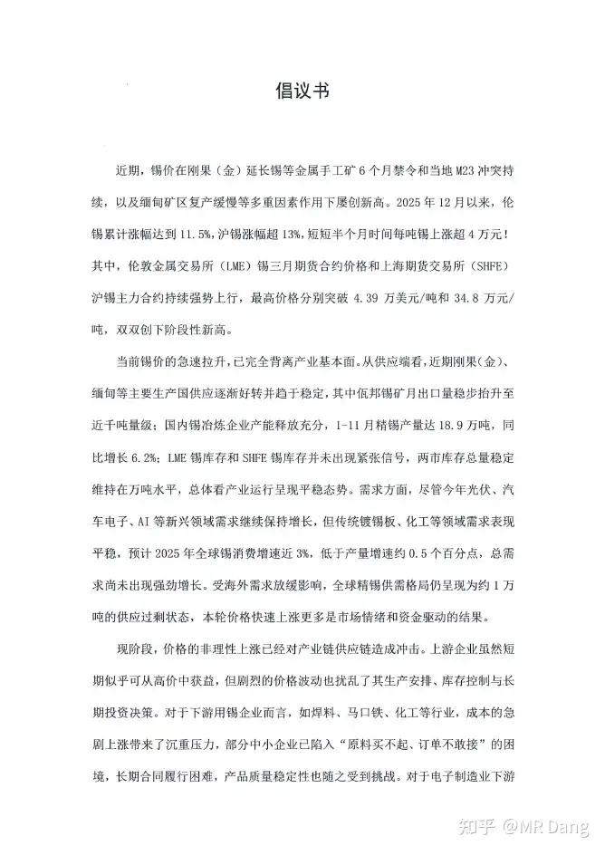
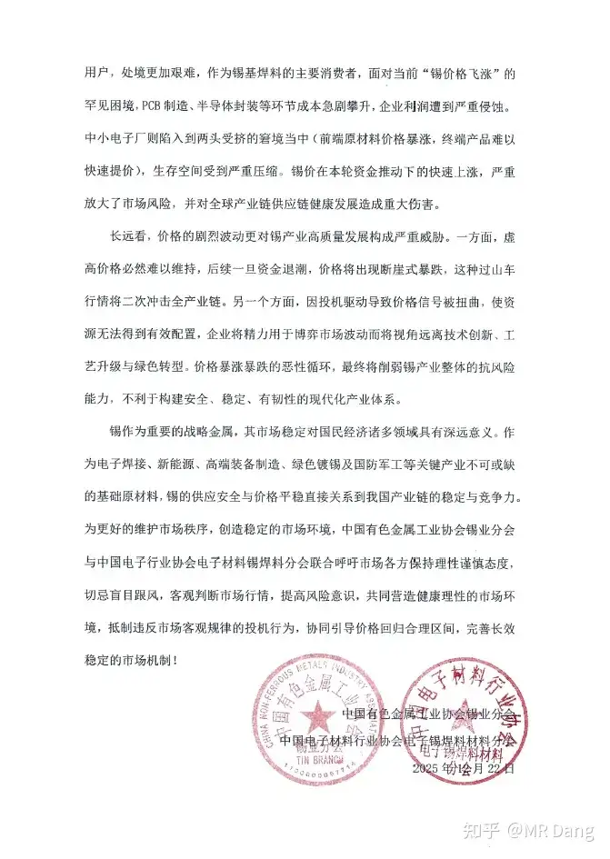
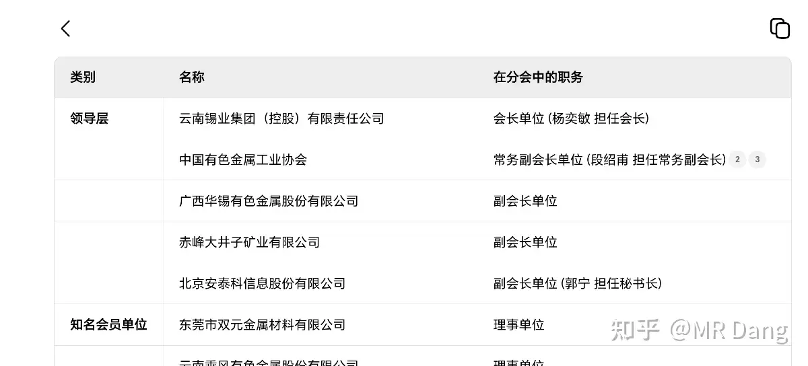
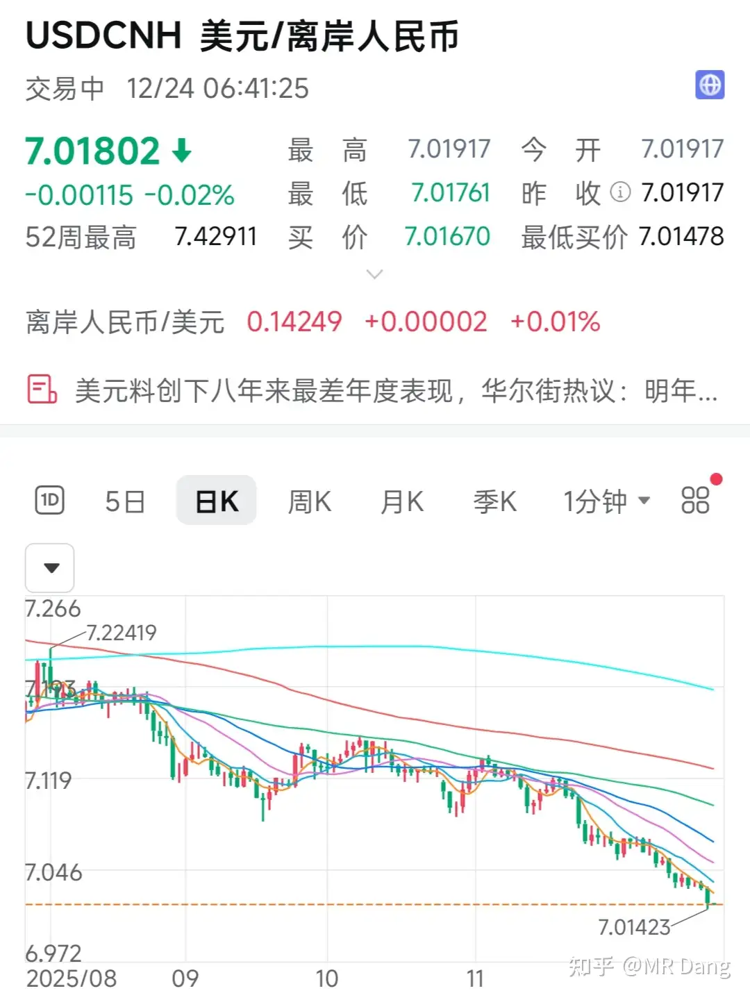

# 如何评价2025年12月24日A股行情？

---

**发布时间**: 2025-12-24 07:07  |  **原文链接**: https://www.zhihu.com/question/1986558300674875670/answer/1987056841243526423  |  **点赞数**: 535 人赞同

**作者信息**: MR Dang​独立投资人，不接广不卖课

---

## 正文内容

先复盘一下昨天的调仓吧，总得来说还是挺成功的。

我对调仓是否成功的判断不是卖了以后股价的涨跌，而是从几个纬度判断：

1.止盈前有没有周密的计划，是否有基本的逻辑？

2.止盈时是否严格按照计划来？有没有达成基本的战略目标？

比如放在这里面，基本的战略目标就是卖出去。

至于卖的价格不是最重要的，止盈目标的实现才是最关键的。

3.止盈后的仓位安排是否合理？持仓的股息率有没有变得更高？

那放在这里，磷王的价格还挺合适的，股息率肯定比铜王更高。

还有空仓在等锡王，相当于变相减仓了，目前这个位置的话，我也可以接受。

两个问题的答案都是肯定的。

有一个误区是，很多人非常关注自己卖出去后股价的走势，如果涨了就捶胸顿足，如果跌了就欢欣雀跃。

这是人之常情，但是一定要摒弃这种浅薄的，"我很厉害，我操作很准确"的自我催眠的想法。

我的择时能力很差，如果一直关注股价的话，我一定会得抑郁症的。

没有人可以一直卖到顶。

股票的买卖有点类似微积分的思想，每支股票都会让你的净值有一个斜率，你需要去思考，去找斜率最高的组合，无数个小的曲线的斜率就组成了你净值的总体斜率。

投资者的任务不是去找那个函数上的极值。

如果有人对你吹嘘他的抄底和逃顶的能力，意味着他还处在关注极值的阶段，殊不知可导函数极值点斜率为0，这种投资者的level不会特别高。

当然，还是说了很多遍的车轱辘话，鄙人不善择时，不要模仿哈。

评论区还有比较bt和磷王的。

bt比较干净，账好算，股息率高，可能在6个点左右，缺点是想象力不足，储量是硬伤。

磷王比较朦胧，账没那么好算，股息率相对低一点，大概在5个点左右，优点是储量，还有龙头地位。

磷王承担的任务比较重，战略地位重要，下限更高。

但是也意味着涨价这方面，得多考虑大局，不能凡事以利益为主，有点公共事业的味道在里面。

我两个都有，目前磷王稍微多点。

这两个我也都是30%止盈。

不要随便抄作业哈，注意风险。

银行业有新动向：

我觉得银行业才是最需要反内卷的行业，比券商同质化更严重，竞争更激烈。

目前的净息差和净利差是央妈划出的类似红线的东西，有些银行如果不听招呼，就会被指导。

银行也有公共事业属性，别看现在盈利能力已经很强了，但是这是在净息差低谷办到的，如果以后净息差上去了，那画面会怎么样？

当然很多银行的估值都很高了，所以我只是在低估值的银行里挑选。

锡也有新动向：

有色金属工业协会和电子材料行业协会电子焊件材料分会，发了个倡议，因为锡价上涨，很多小企业买不起锡了。

下游的电子企业被冲击了，倡议书表示上游企业虽然赚了钱，但是扰乱了企业的正常生产安排，把精力用在博弈市场波动（这两句话啥意思呢，可以品一品。）

总之，就是锡价涨太多了，呼吁不要涨了。

我是举双手赞成的，锡王价格太高了，赶紧给我打下来。

出于好奇我看了下这个协会的成员单位：

啊？原来会长单位是锡王啊，那没事了。

白银又又又创新高了（这是第几次说又了？）：

我之前说白银在逼空，虽然涨了很多，但是那根斜率依然在正常范围内，属于铺垫环节。

现在斜率有点不正常了，有加速上涨的趋势，这种就是大戏开演的信号，要放烟花了。

任何东西，看空可以，止盈也可以，但是不要去做空，像这种单边的逼空行情，不要去赌那唯一的一个拐点。

黄金也创了新高：

黄金也是同理，拿不住了可以止盈，或者减仓，但是不要做空。

做空意味着什么？

你的对手盘是美联储，是咱们的央妈，你确定可以战胜他们？

铜也创了新高：

前几天无聊想起来翻以前的回答，翻到今年9月份铜那篇的时候，下面看空铜的评论比看多的还要多。

这充分了证明了大多数人在面对常识级别的规律的时候并不能做到实事求是，冷静分析，更多时候都是脑子一热输出情绪。

京东在巴黎被偷：

媒体报道损失了三个小目标，京东表示有出入。

挺魔幻的新闻，不过想一想也合情合理，巴黎嘛，太正常了。

最近白银lof套利很火，每天套一杯奶茶美滋滋。

但是我在文章里没提，为什么呢，以我的读者体量基数，一定会有人忍不住只是套利，反而会直接下场参与的。

但是既然有这么多人已经参与套利了，我还是提个醒，套利就套利，千万别去搏傻。

人民币汇率升破7.02：

人民币升值速度越来越快，已经有专家看到1：6了，不是那种路边专家，是智库里有发言权，战绩可查的真专家。

有读者咨询买的境外理财要不要换回来，我个人建议趁早赶紧赎回。

一方面是美元降息势在必行，一方面汇率还在崩，根本划不来的。

当然其实我建议大家认真考虑港股的性价比。

一是，s这方面，很多开立港股账户的，如果盈利比较多的话，应该接到过催收电话。

二是，港股现在新股太多了，有点没节制了，夜夜笙歌，发的多了身体容易虚。

三是，如果考虑长期的汇率，比如远期目标1：6，这算下来汇率就要亏15%，这可不是小数字了。

我个人觉得港股明年跑不过大A。

等锡王的第一天，今天许愿26可以得到它。

一个喜欢保护韭菜的博主，希望大家少少踩坑，多多赚钱！

---

> [!comment]- 点击展开评论
>
> | 用户 | 时间 | 内容 |
> | :--- | :--- | :--- |
> | 夏天 |  | 老师早☕☕请老师一餐麦麦🍔🍔昨天小赚😊 |
> | &nbsp;&nbsp;&nbsp;&nbsp;MR Dang |  | 正在吃麦麦的我，本来想点两件套的，立马换成了三件套 |
> | &nbsp;&nbsp;&nbsp;&nbsp;MR Dang |  | 好大的红包，够吃两星期了，感谢榜一 |
> | 夏天 |  | 哈哈开心😊😊 |
> | 麋鹿迷了路 |  | 大气 |
> | 开始运气 |  | "至于卖的价格不是最重要的，止盈目标的实现才是最关键的。"老师我对这句话的理解是：我目标30%止盈是否达到是关键，至于我止盈后它会不会涨更多甚至翻倍都无所谓。这样理解对吗？ |
> | 更深的蓝 |  | 斜率往往意味着趋势，老师教的都是干货。我要从抓极值的赌博心态跳出来。 |
> | 小小梁公子 |  | 大佬早，中签新广益500股。圣诞快乐 |
> | &nbsp;&nbsp;&nbsp;&nbsp;MR Dang |  | 恭喜恭喜 |
> | 小小梁公子 |  | 第一次中签，小小紧张 |
> | 泽越止 |  | 我是不是漏看了几期？磷王是yth吗？ |
> | 小皮 |  | 老师 跌停价是27 为什么可以26得到呢 |
> | 小皮 |  | 我看错了 锡跟磷两个不同的标 |
> | 广东顺德分Dang |  | 锡王正在遭受猛烈打压，谢谢各位道友助力，让我有机会上车 |
> | 娃哈哈 |  | 老说不善择时，出手全是精准狙击 |
> | &nbsp;&nbsp;&nbsp;&nbsp;MR Dang |  | 巧合而已，被套住的仓位：为我发声 |

---

*本文件由自动脚本从MR Dang知乎页面提取生成*

---

**作者**: MR Dang
**链接**: https://www.zhihu.com/question/1986558300674875670/answer/1987056841243526423
**来源**: 知乎

*著作权归作者所有。商业转载请联系作者获得授权，非商业转载请注明出处。*

---

## 相关阅读

**📈 每日行情评价：**
- [[20251225-如何评价2025年12月25日A股行情？]] - 圣诞节行情分析
- [[20251223-如何评价2025年12月23日A股行情？]] - 调仓复盘与市场观察

**📚 投资方法教育：**
- [[20251013-什么是投资思维？普通散户该如何培养？]] - 投资思维与微积分思想
- [[20251024-怎么全面的分析一支股票？]] - 股票分析方法
- [[20251026-如何对企业进行估值？]] - 估值方法详解

**📘 地阶功法：**
- [[20251022-《地阶功法卷一》投资者必须斩杀的三个妄念]] - 投资者心态建设
- [[20251025-《地阶功法卷三》商业模式评估]] - 商业模式评估方法

**🔙 返回：**
- [[每日行情评价]] - 每日行情评价全部内容