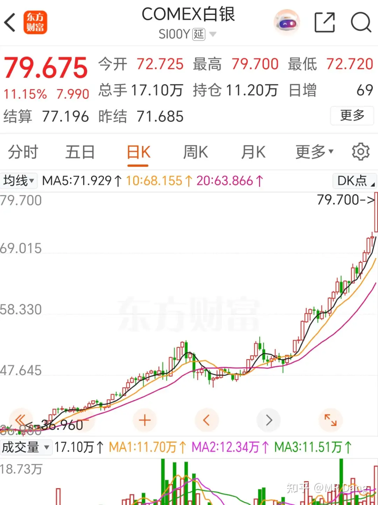
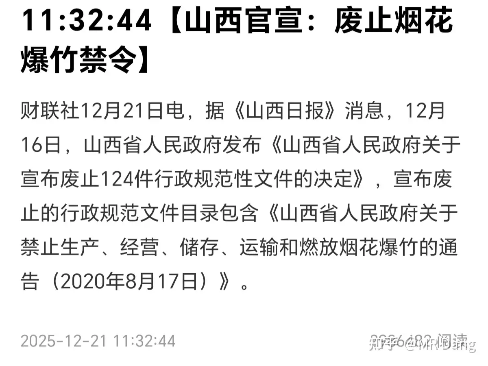
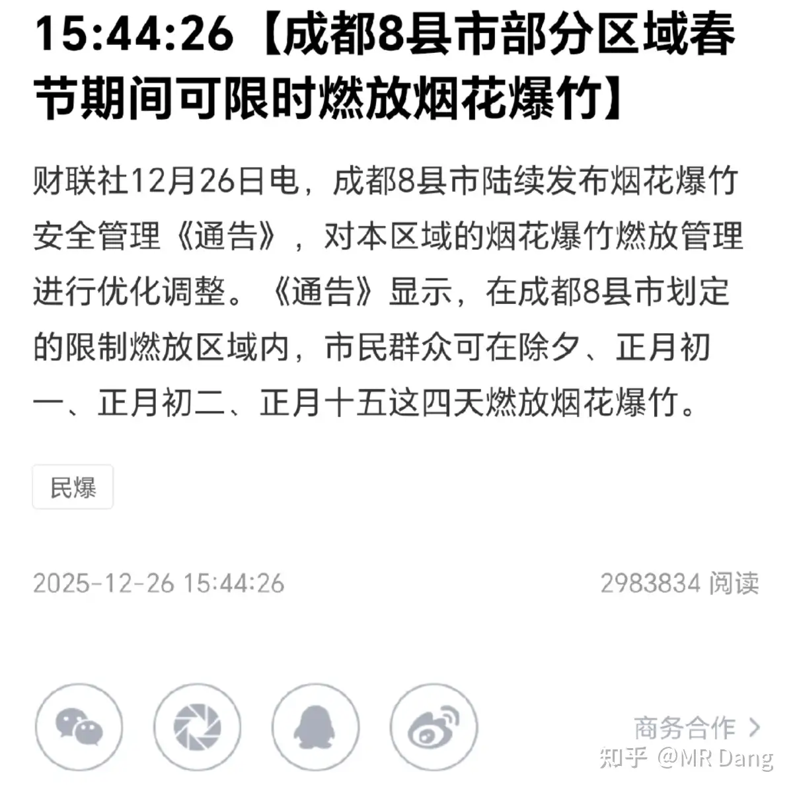
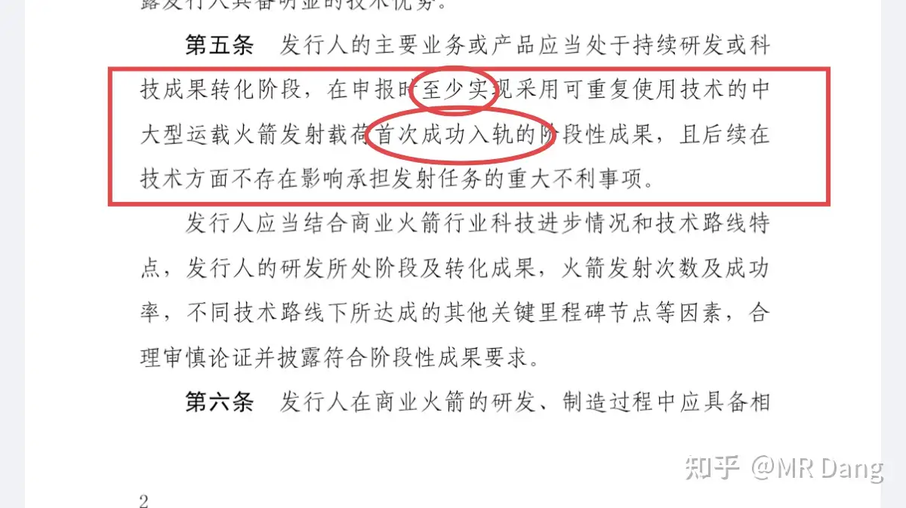
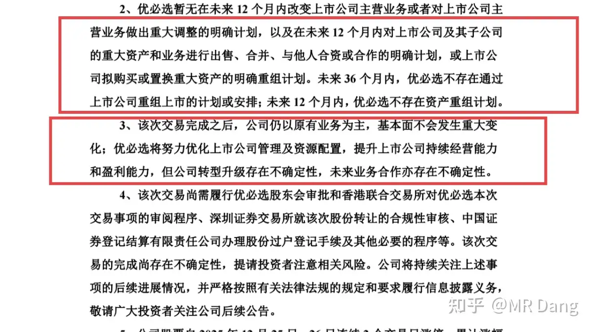
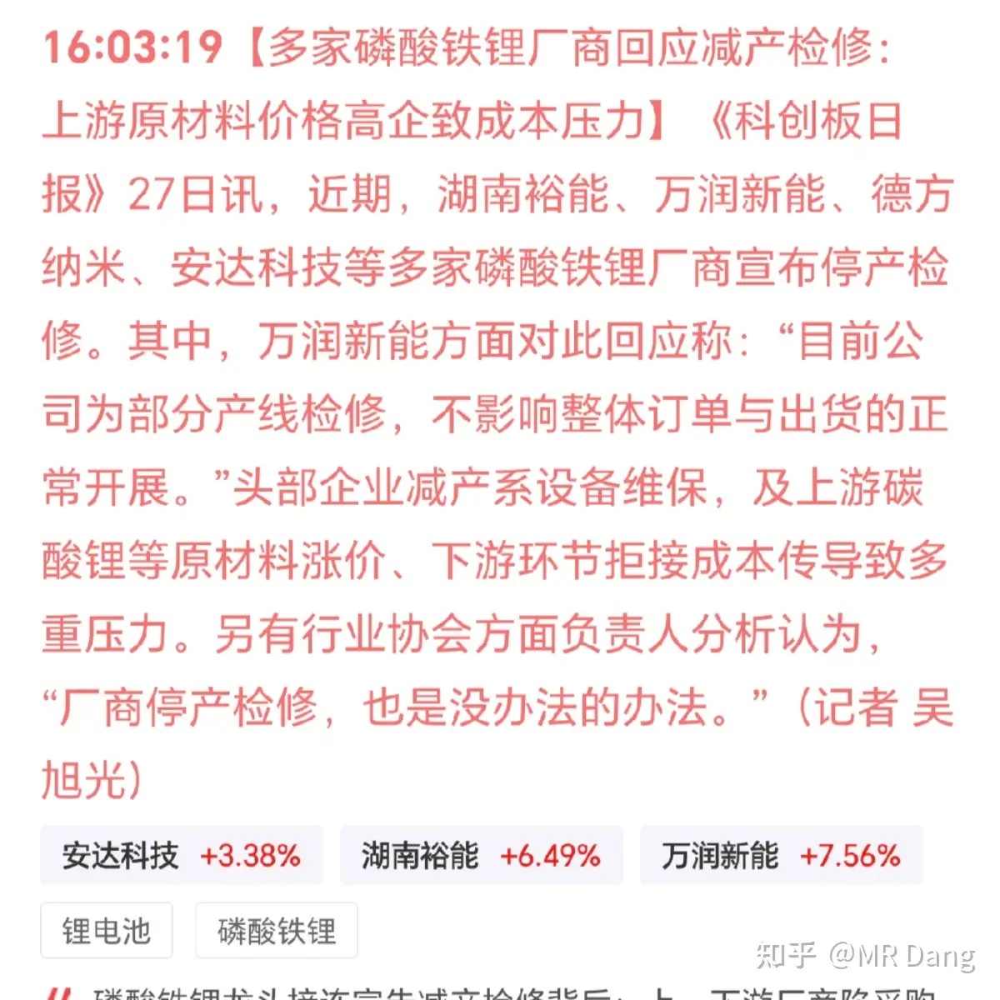
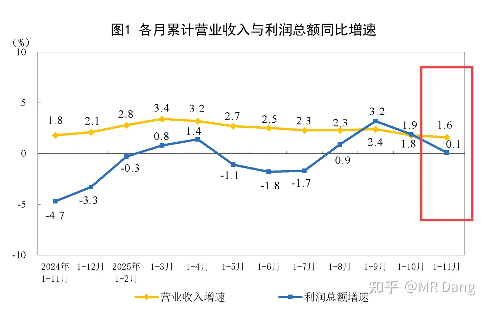
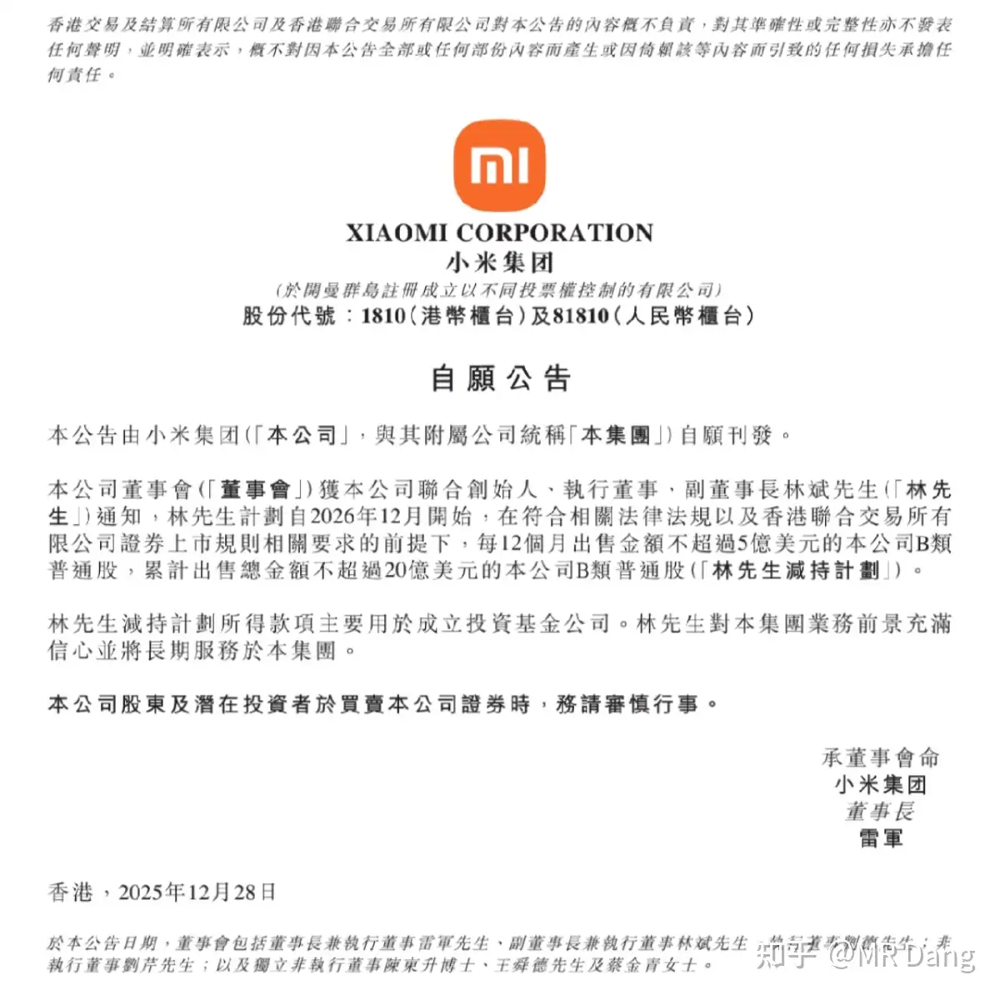

# 如何看待2025年12月29日A股市场行情？

---

**发布时间**: 2025-12-29 07:27  |  **原文链接**: https://www.zhihu.com/question/1987905756486444173/answer/1988873804362060837  |  **点赞数**: 773 人赞同

**作者信息**: MR Dang​独立投资人，不接广不卖课

---

## 正文内容

本年最后一周了，先过一遍周末发生的事情：

最最炸裂的还是白银的行情：

就在我们收盘后，国际银悄咪咪涨了11%.

我一直在说要放烟花了，现在这就是烟花开始放了。

这种历史性的时刻，可能很多人一生中也就能碰到那么一两回亲眼见证的机会，不可错过。

至于投资标的，就那两个银股sdzy和xyyx。但是那两个银股现在表现是不如白银的，里面隐含的意思就是市场不相信银价可以一直在高位横盘。

但是如果银价真的能在高位保持，这两个股就明显低估了。

问题是银价可以保持住么？

我个人还是偏保守，我对现在的银价中期表现有点看空的意思。

但是让我做空，我是坚决不参与，一分都不掏。经历过游戏驿站逼空大行情的，应该能理解我的意思，没听说的可以查下资料。

有人现在想投资实物银条或者银期货的话，我觉得不是好的时机，要注意风险。

如果你非要投资实物银条，这里有个小细节，你不要买1kg的银条，要去买15kg的板料。

为什么呢？因为一公斤的银条，不能直接入库，需要做成15kg的标准板料才能入库，最少一个星期。

银价到时候跳水，一天一个价，你这t+7的实物得赔死，流动性不好。

15kg的板料就不一样了，t+0直接出手，流动性好太多。

白银lof套利的事情昨天已经说过了，溢价不是很多了，想参与一下体验氛围的，也不用急着去卖，就那500块。

买个情绪价值还是不错的，拿着也亏不到哪里去，实在不行还可以赎回。

万一有人继续炒呢？

说到放烟花，最近有个政策可以关注下：

21号，山西官宣废止烟花禁令。

26号，成都跟上了。

为什么提这个呢，因为这个东西它指向性强。

一两个地方放开后，很可能有更多的地方会跟上。

老股民都知道，以前有个股叫xx花炮。

就这么直白的名字，它是两市唯一的烟花股。

如果要炒起来的话，共识是最强的。

当然现在改名了，业绩还很差，还st了。

纯粹的投机。

但是鉴于现在这个过节的氛围和消息面的配合，我觉得可能会有一波投机的行情。

商业航天出了新政策：

简单的说，就是可重复火箭要上市，你起码要入轨：

按照这个标准，目前市面上炒作的标的给他退市以后再重新上市，绝大部分是达不到这个标准的。

当然也有小道消息说入轨的基础上完成一次回收才是标准，不保真，还是以官方为准。

我对商业航天是有想法的，但是仅限于还没上市的蓝箭。

大家如果观察就会发现，现在很多热点，在重磅新股上市前，各种利好，所有的正宗的不正宗的概念都涨很多。

但是一旦这些新股上市以后，舆论突然就熄火了，比如前段时间沸沸扬扬的摩尔和沐曦，现在突然一下没讨论度了。

有点不太符合正常的舆论传播规律。

就有点感觉像某项使命完成以后，没利用价值了一样。

也可能是我多心了。

商业航天距离蓝箭上市还有一段时间，这中间一直猛涨的概率不大。

行业预期是不错的，但是现在这个估值，蹭概念的也涨了不少。

风险，你的，明白？

fl发布了一个公告：

基本宣布借壳短期内不存在了。

资本市场的反应不好预测，不过我不打算掺和了，没有套利逻辑了，变成资金博弈了。

锂产业链：

锂产业链的问题是，终端涨不了价，因为需求不足，这个目前来说短时间内无解。

上游因为其他金属带动，以及其他需求的增加，比如储能，有很强的涨价欲望。

前一段时间那个小作文就是上游厂商的心声。

所以中游厂商就很难受，受的是夹板气，现在在想破局的办法，希望把价格压力给上下游都传导一下。

僧多粥少，矛盾不断激化，体面也就无从谈起了。

锂没那么缺，闲置产能还可以释放，目前的价格基本也算博弈的动态平衡了，我觉得空间不是很大。

说到这里，大家知道外资投行对明年主流资源的看法是什么嘛？

看多金银铜，看空锂和铝，看空油和气。

理由是什么？

因为金银铜是东大的需求，锂和铝是东大的产品，油和气是大毛的产品。

分析了很多供需关系，最后的结论就是这么简单粗暴，朴实无华。

这个里面，我对银和铝稍微有点保留意见。

银在目前的涨幅上继续大幅上涨的可能性我觉得有，比如再涨50%也不是很稀奇，但是年终的时候能剩多少涨幅我持怀疑态度。

铝的话，虽然供应端会增加很多，但是需求端目前也在代替部分铜，价格大幅度下跌的可能性我个人觉得值得商榷（外资投行看跌20%）。

但是我觉得这个思路没问题，他不是意识形态的偏见，东大体量真的太大了，特别是在工业这块儿，需要的东西就是会涨价，输出的东西就是会挤压价格，这个已经是被多次验证的规律。

一个比较重要的表态：

感觉明年还是想在消费上发力。

我对消费的观点是不变的，消费是本能，是欲望。

欲望是需要环境配合的。

咯咯哒站在街上还知道开个小粉灯刺激路人的感官，而不是发满800减500的优惠券。

消费也一样，收入上来了，安全感上来了，获得感增加了，物欲自然就被激发了。

一个比较重要的数据：

统计局发布的工业企业利润：

不是很乐观

仔细看数据的话，主要是煤炭拖累了整体情况，这个不算利空消息，因为前十个月的数据也是如此，预期内。

煤炭今年大概平均就是利润腰斩。

明年的预期也不是非常好，布油油价如果按照预期保持在55美元，煤炭价格是受到压制的，利好火电。

很多投资者按照去年的股息率投资煤炭股，今年可能要失望了，去年如果股息率有10%，今年也就是5%左右，吸引力不是很高。

有一个行业环比数据比较好，就是"开采专业及辅助性活动"，可以理解成勘测，管理，油服这些配套服务，铲子行业。

前十个月不到26亿利润，第十一个月单月15亿利润。

米子创始人割爱筹码给市场：

不要慌，也就20亿，美元，一年后才开始。

减持的林先生表示对米子业务前景充满信心并将长期服务。

林先生五年前就说五年内不减持了，现在还提前一年发公告。

可以解读成做事很讲究。

也可以解读成一秒都等不及了。

米子的争议比较多，话题性高，我就不蹭流量了，只是陈述有这么一件事。

以我的经验，虽然公司回购是好事，但如果同时大股东在变现，会让小股东心里多少有点嘀咕回购的出发点，心里会有个小疙瘩。

周末其实还有个A500ETF九子夺嫡被指导的消息，简单的可以理解成小利空，但是不保真。

本周一共三个交易日，还有几天的假期，有些保守的资金也会趁行情好的时候锁定本年收益，回笼资金做几天逆回购，顺便躲一下假期有可能出现的不确定性。

展望2026第一周的话，懂王有可能公布美联储人选。

新能车的购置税减半开始实施，30万以内车型比目前要多掏5%的购置税，这个成本压力很多车厂自己认了，终端落地不涨价，叠加锂电成本上升，车企的紧日子才刚开始。

今天是等锡王的第四天，不抱希望了，大概率还是没戏，有色目前很强势。

但是我心态挺好，这个位置保留一部分空仓我觉得是没问题的。

走的远比跑得快更重要。

一个喜欢保护韭菜的博主，希望大家少少踩坑，多多赚钱！

---

> [!comment]- 点击展开评论
>
> | 用户 | 时间 | 内容 |
> | :--- | :--- | :--- |
> | 十六 |  | 作为烟花之乡的乡民，看好烟花，支持烟花 |
> | 土土由八 |  | "也可能是我多心了。"相信大佬的直觉，都是工具，用完就扔 |
> | &nbsp;&nbsp;&nbsp;&nbsp;MR Dang |  | 我有受害妄想症 |
> | 第五槐序 |  | 烟花有什么上游么，下游我知道是眼科医院和手外科 |
> | 期待victor |  | 感谢博主啊--看多金银铜，看空锂和铝，看空油和气。理由是什么？因为金银铜是东大的需求，锂和铝是东大的产品，油和气是大毛的产品。多么简单粗暴好理解啊，我最近几个月偶尔倒腾下大宗，各种资料消息AI去查，冷不丁地看到博主这句话，瞬间对于大宗的行情认知又上了一台阶 |
> | 一个89大叔 |  | 我看博主说个股仓位不超过20%，银行股算空仓，就是银行股个股仓位可以超过20%的意思吗？ |
> | 牛教授 |  | 感谢🙏 |
> | 陈书言 |  | dang大是资金量很大，必须要分散规避风险，我资金量很小，所以就集中在两三只我最看好的公司。 |
> | 乌获 |  | 早上好呀老师！看了一下熊猫 发现这个居然也要单独开通交易权限。又看了一下股价，感觉也是进不去的节奏，这次准备当观众啦。 |
> | 掘金工作者 |  | 早晨好。小米那个减持，一边坚定看好小米未来，一边减持去投资入股基金公司。挺好玩 |
> | &nbsp;&nbsp;&nbsp;&nbsp;MR Dang |  | 他的基金公司买小米我就承认他是真的看好 |
> | 时涵 |  | 明天应该能等到锡王了 |
> | Herr Z |  | 党大早，磷王刚打了个底仓就涨起来了，现在是直接加仓还是等等回调再进呀？ |
> | 冷开水好冷 |  | 我也是，30.5入了一手，现在不敢加仓 |
> | 我是你三姨 |  | 我是30.8的时候想建仓，脑抽了不小心多买了几手，当时还挺后悔，现在很舒服 |
> | 冷开水好冷 |  | 哈哈哈，我现在在犹豫要不要加仓 |
> | 最忆长安 |  | 每天早上拜读学可你的"财经早报+市场操作指南"，当老师辛苦了 |
> | 彷徨 |  | 在哪里看 |

---

*本文件由自动脚本从MR Dang知乎页面提取生成*

---

**作者**: MR Dang
**链接**: https://www.zhihu.com/question/1987905756486444173/answer/1988873804362060837
**来源**: 知乎

*著作权归作者所有。商业转载请联系作者获得授权，非商业转载请注明出处。*

---

## 相关阅读

**📈 每日行情评价：**
- [[20251230-如何评价2025年12月30日A股行情？]] - 本年倒数第二个交易日
- [[20251231-如何看待A股2025年12月31日 市场行情？]] - 本年最后一个交易日

**📚 投资方法教育：**
- [[20251013-什么是投资思维？普通散户该如何培养？]] - 投资思维培养
- [[20251011-下周一股市就要大跌了，作为投资者该如何应对？]] - 面对市场波动的心态

**📘 地阶功法：**
- [[20251022-《地阶功法卷一》投资者必须斩杀的三个妄念]] - 投资者心态建设
- [[20251023-《地阶功法卷二》价值投资三大误区]] - 价值投资核心理念

**📊 个股分析：**
- [[20250929-如何看待寒武纪股票的未来前景？]] - 个股分析案例

**🔙 返回：**
- [[每日行情评价]] - 每日行情评价全部内容