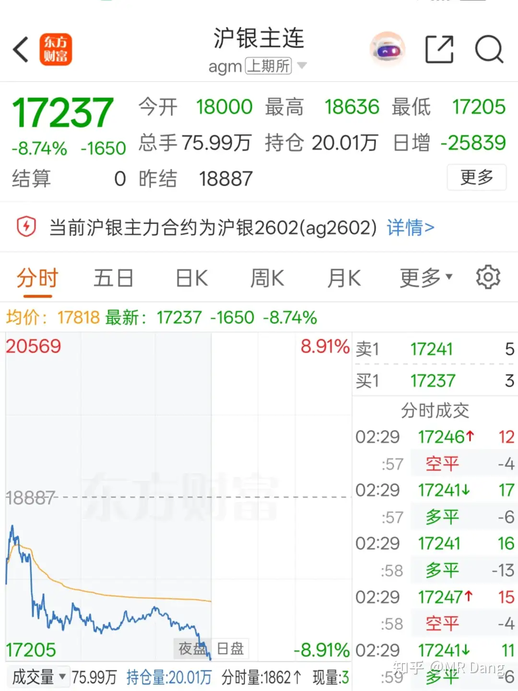
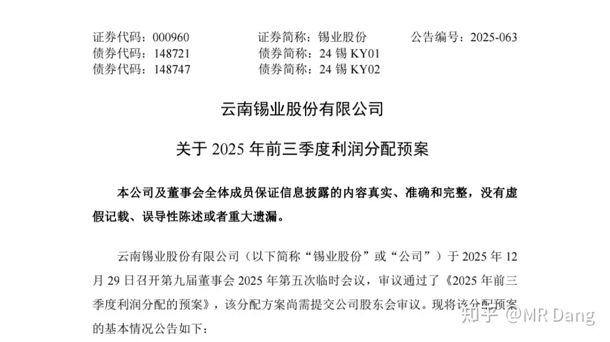
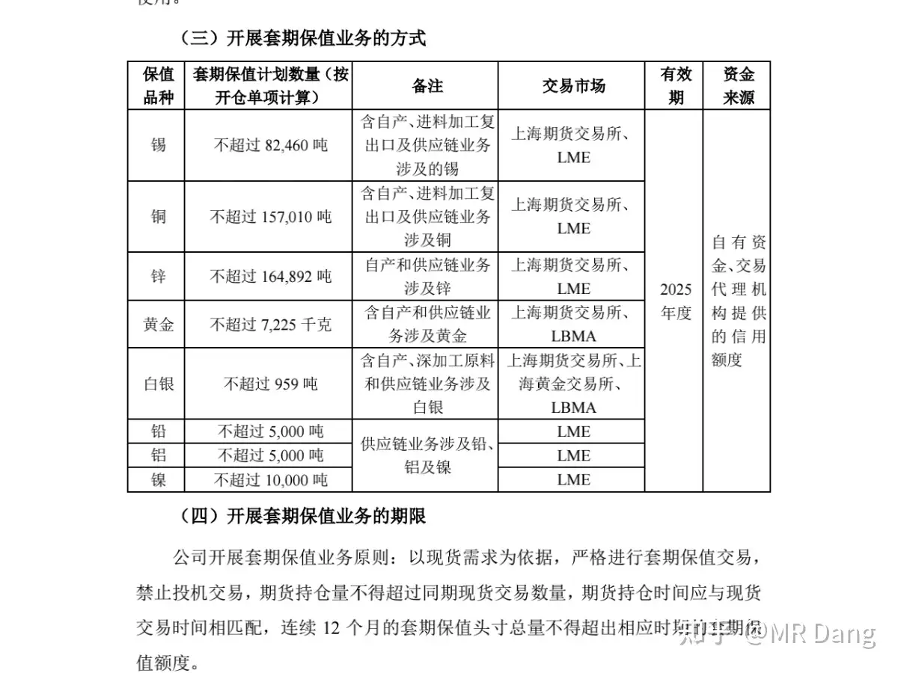
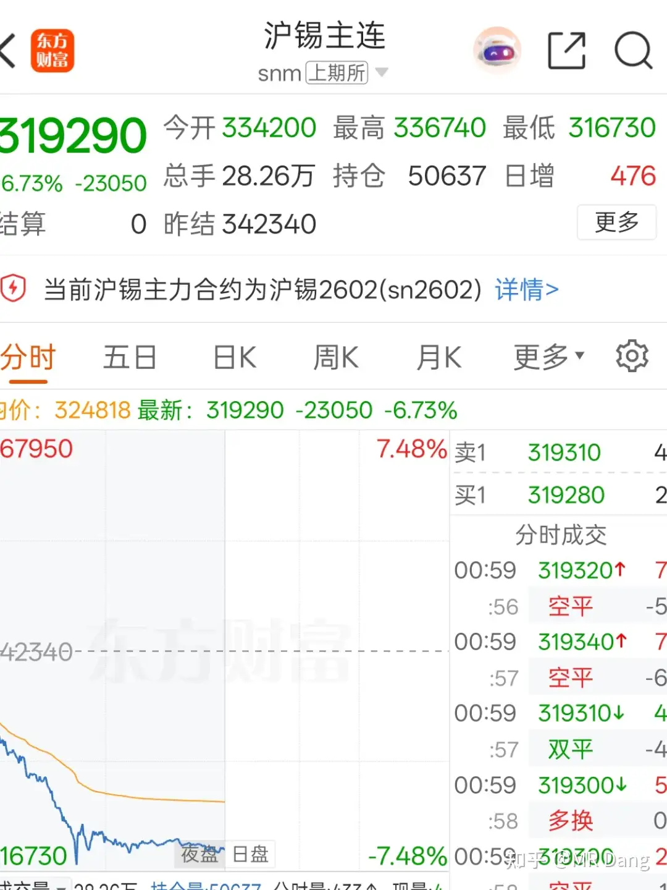
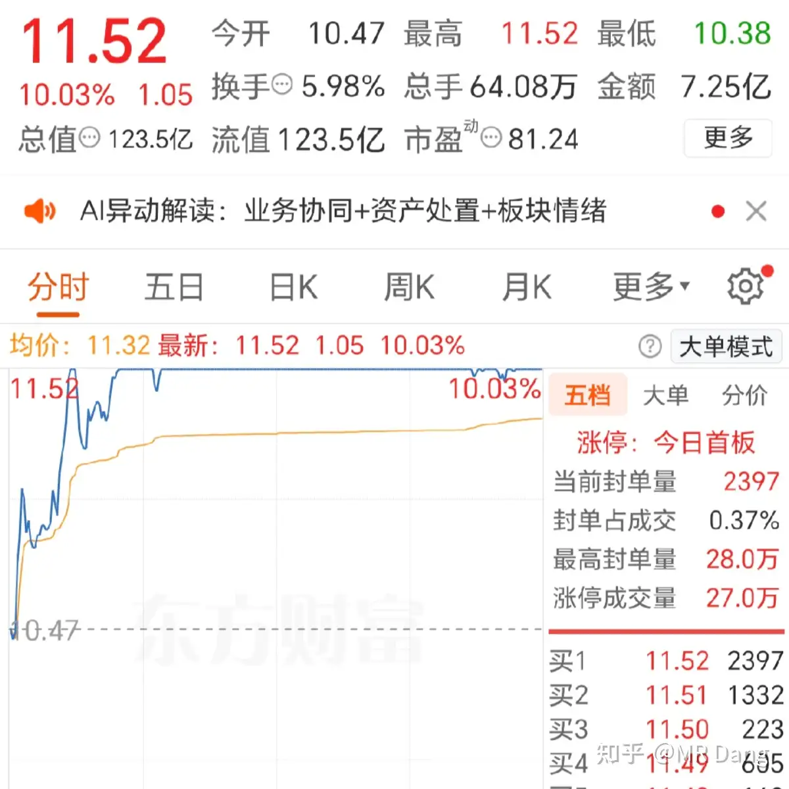
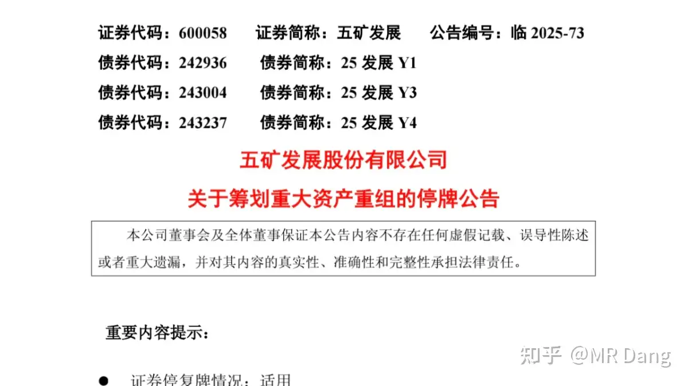

# 如何评价2025年12月30日A股行情？

---

**发布时间**: 2025-12-30 07:13  |  **原文链接**: https://www.zhihu.com/question/1988751206508676652/answer/1989232537118196905  |  **点赞数**: 651 人赞同

**作者信息**: MR Dang​独立投资人，不接广不卖课

---

## 正文内容

本年倒数第二个交易日了。

想到哪说到哪，有点乱。

昨天白天的白银多空大战格外精彩：

像这种剧烈的波动，仓位控制出现问题的人，不管是做多还是做空，都会被市场教育。

因为杠杆高，碰到这种双向波动，多头和空头一起扑街。

到了夜盘，白银直接跳水了：

和白银一起跳水的还有黄金：从4500跌到了4300。

黄金4500这里会有反复，我在几个月以前就有过猜测，也一直在叨叨，老粉应该都有印象，包括铜王的止盈计划也和黄金4500挂钩。

我对资本市场一般不猜测，只是被动的适应，因为资本市场是人情绪的投射，人心是难以揣测的，你猜不来人会有多疯。

黄金这种大宗不太一样，它是受供需影响的，所以猜对的几率会高那么一点点，偶尔在关键点位上猜测一下无伤大雅。

之前回答的链接：

一个多月前的回答

事实上我也按照计划进行止盈了，投资这种事情要把功课做在前头，坚决执行，知行合一。

最近一直在蹲的锡王发布了一堆公告，里面有两个比较重要的：

首先是锡王的三季度分红，0.11/股，比去年同期多一分。

数量上比较恶心，但是起码聊胜于无吧，态度上还是值得肯定的。

这个肯定算利好。

另一个公告是计划继续做套期保值。

这个公告比较重要，通过公告公布的套保计划数量，可以大概的看下风险敞口，对比2025数量：

除了锡的数量增加了一些，其他金属数量都少了，相对来说风险敞口应该会小一些。

这部分套保不透明，在2022年高位站岗就亏大发了，我对锡王管理层的能力和诚信度还是不信任，希望他们不要投机，以他们财务人员的专业能力，是不具备投机能力的。

总的来说属于中性公告。

锡昨晚的夜盘也跳水了，今天可以继续许愿了，等一个25开头的锡王。

正义使命-2025的新闻已经刷屏了：

我不是j迷，不太懂这些，只是觉得这次保密工作做得好，突然就宣布了，没一点预兆，如果是实战，那留给对面的反应时间不会很长。

说到这个我想起来一个很魔幻的事情，就是一个专业投资者交流圈里，有一个来自对面的投资者，他重仓了A股的Jg还有福建板块。

他平时对外展示的是deep green，比较激进的那种，然后背地里天天盼着快点动手，他的股票已经急得不行了，一心向钱。

他说这是风险对冲。

锂电：某龙头企业被移送起诉。

里面的投资者脑瓜子嗡嗡的。

这事本来就挺狗血的，之前gf的董事长因为想收购江特的事情内幕交易挣了一百来万。

前面已经行政处罚了，大家还以为这事就这么过去了。

没想到突然说移送起诉了，这就有可能涉及刑事犯罪了，说不定还会被st。

古语有云，伐冰之家不畜牛羊。

一个堂堂千亿级上市公司的董事长为了区区百十来万搞这事，真不知道脑子在想什么？

只是苦了里面的投资者了，替别人犯下的错误买单，真正的金融消费者。

锂产业链现在是多事之秋，各种矛盾激化，都摆到台面上了，目前来看我觉得综合考虑风险收益的话，不是很优秀的选择。

哦对了，昨天提到的某烟花股也因为信纰被立案了，它本身就是st了，倒是死猪不怕开水烫。

投机的注意风险。

重组消息又有抢跑的：

先涨停，后出利好，十分符合大A的特色。

没什么好说的，我之前就说过这种人为的不公平的游戏不要参与，游戏体验极差，让他们自己玩去。

一个重磅政策：

经评论区指正，这是续签，以前的回答存在事实错误，特此改正。

数字货币新动向：

《关于进一步加强数字人民币管理服务体系和相关金融基础设施建设的行动方案》

数字货币全新升级，以前的使用体验其实不太好，现在的话，从财务方面归类为银行的负债，进银行的资产负债表，还有利息可以拿。

怎么说呢，有点类似于变成了存款，但是流动性更好。

这个不用追了，昨天相关概念都飞了，现在去只能吃土了。

昨天电力板块表现不好，原因是长协电价出炉，不及预期，煤价格跌了，还有风光电的参与，所以长协电价就低了。

电力板块有点类似我持有的bfny，bf赚的是煤和油的差价，火电赚的是电和煤的差价。

现在煤价起不来，虽然电价不及预期，但是长协煤价也便宜了，盈利能力还是有的。

不用那么悲观。

说到bf，昨晚的原油期货又偷偷摸摸涨了点，到61美元了。

要是能一直保持现在的煤和油的差价，那真的很安逸了。

明年机构预期的原油中枢布油价格只有55美元。

懂王表态美联储人选"没有改变"

我理解的意思就是哈塞特稳了？

反正最终解释权归懂王，过几天看。

受局势紧张影响，中概表现不佳。

其实恒科也类似，我记得很早前在评论区就提过恒科的风险。

比较窝囊的地方在于，东大和西大谁看它不爽都会踢一脚，两边一紧张，就成了出气筒。

看好东大就买亲儿子，别买这些质子。

如果资金已经国际化布局，那你在西大就买点国际化的东西，别碰国内这些中概。好不容易跑出去了，再买成中概，那跑出去的意义是什么？

今天有操作计划，有色可能会大幅回调，我的有色仓位很少了，一直在蹲锡王，今天可能会蹲到一个好位置。

另外就是前几天老有人问要不要买黄金，他特别喜欢黄金。我觉得他可能是喜欢黄金的涨幅，而不是黄金本身，所以劝他冷静。

现在黄金开始回调了，是考验信仰的时候了，你不能只在上涨的时候才喜欢黄金。

一个喜欢保护韭菜的博主，希望大家少少踩坑，多多赚钱！

---

> [!comment]- 点击展开精选评论
>
> | 用户 | 时间 | 内容 |
> | :--- | :--- | :--- |
> | idle-key |  | 绿营买福建对冲，笑死我了🤣🤣🤣 |
> | &nbsp;&nbsp;&nbsp;&nbsp;MR Dang |  | 买了之后就不绿了，我觉得可以推行 |
> | 徐辉辉 |  | 你不能只在上涨的时候才喜欢黄金。 |
> | 一白先生 |  | 确实。这玩意难道不是越跌越好，长期看多，短期回调正是入手好时机呀 |
> | 一条咸鱼罢了 |  | 化妆烟草不免税那个，20年就出了，今年只是续签 |
> | &nbsp;&nbsp;&nbsp;&nbsp;MR Dang |  | 你说的对！ |
> | 宋知乎 |  | 按照大a的尿性，一般这种都会冲一波 |
> | 李杰 |  | 我还以为是新出的刺激消费的政策 |
> | k591998667 |  | 今天金属应该会大跌，大A今天想成就洪荒时期的十阳当空有点难了 |
> | &nbsp;&nbsp;&nbsp;&nbsp;MR Dang |  | 也不一定，股市很难猜的， |
> | 小仟 |  | 真强啊，下跌就拉起 |
> | 卡拉哈里 |  | 现在看 |
> | Muster |  | 跟着大师买的云天化，还是很给力啊加油，2026继续冲啊！ |
> | 咕噜咕噜change |  | yth多少止盈啊 |
> | Muster |  | 没有止的打算，等大师的指示吧 |
> | 大鲫大鲤 |  | 明显低估，继续拿就完了。以现有的股价算，至少盈利个30%~40%才考虑出局 |
> | Iris |  | 和锡王没缘分啊 |
> | 孙林 |  | 学习了一下上次答主提到了的用积分思想去理解投资：1. 多个股票（曲线）的加权求和组成了总体斜率，也就是资产总值。2. 投资就是追求正斜率，长时间持有斜率更高的资产组合，通过时间的积分，实现更大的面积（资产总值）。3. 单一股票是波动大的曲线，多条曲线才能形成稳定向上的曲线。以求在混沌的系统中，捕捉到确定性的向上的变化趋势。而不是试图寻找确定的坐标点。因为局部最小值（抄底）和局部最大值（摸顶）都对应着导数为零的点，也就是价格的变化率为0。如果炒股时致力于寻找顶和底，意味着在极致附近浪费了大量的时间。这就是大部分人炒股亏损的原因。第2条提到了，正确的方法是通过时间因子积分获取更大的资产面积。4. 其中最大的变量是主观选择的股票组合（动态的组合）能否维持高动量。如果其中某一条曲线（股票）的斜率变小，即使股价很高，也应该换成斜率更高的股票。也就是止盈。所以亏钱是选股能力差，而不是价投不对。5. 量化，如李新野说所，他感觉自己就像拿着现代武器（数学），在和古代士兵作战（第3条中浪费时间因子的投资者）。 |

---

*本文件由自动脚本从MR Dang知乎页面提取生成*

---

**作者**: MR Dang
**链接**: https://www.zhihu.com/question/1988751206508676652/answer/1989232537118196905
**来源**: 知乎

*著作权归作者所有。商业转载请联系作者获得授权，非商业转载请注明出处。*

---

## 相关阅读

**📅 每日行情评价（相邻日期）：**
- [[20251231-如何看待A股2025年12月31日 市场行情？]] - 2025年最后一个交易日
- [[20251229-如何看待2025年12月29日A股市场行情？]] - 白银行情分析

**📚 相关主题：**
- [[20251008-黄金涨的这么疯狂，是代表了纸币飞速贬值还是已经商品化了？]] - 黄金投资深度解析
- [[20251102-《天阶功法卷四》磷化工投资价值分析]] - 磷化工板块分析

**💡 投资方法教育：**
- [[20251020-交易策略只是第一步，重要的是仓位管理？如何科学设置仓位？]] - 仓位管理的重要性
- [[20251016-投资新手避坑指南之追热点]] - 避免追逐热点

**📖 系列文章：**
- [[天阶功法]] - 个股深度分析系列
- [[韭菜保护合集]] - 投资避坑指南
