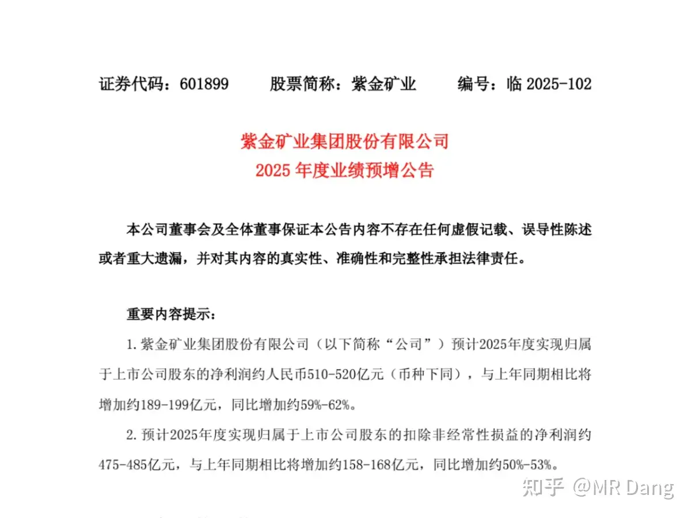
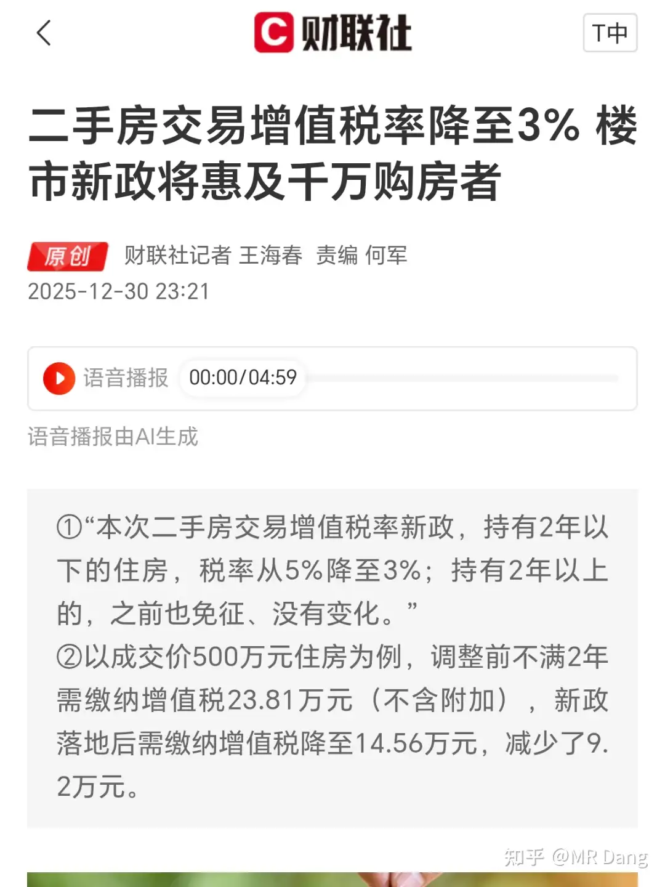
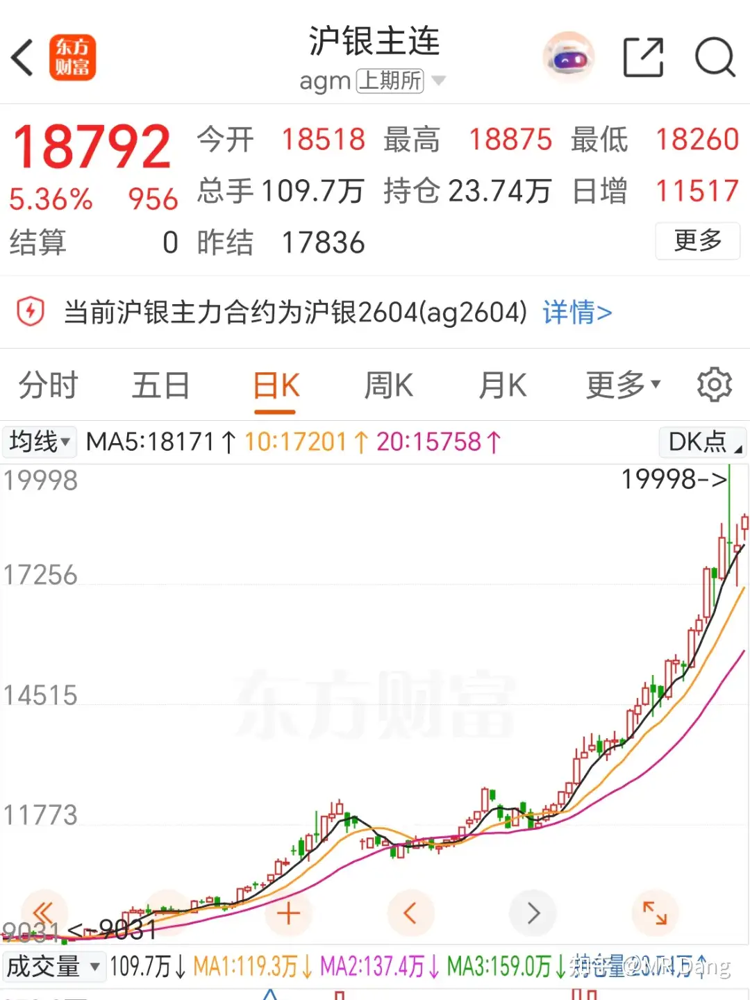
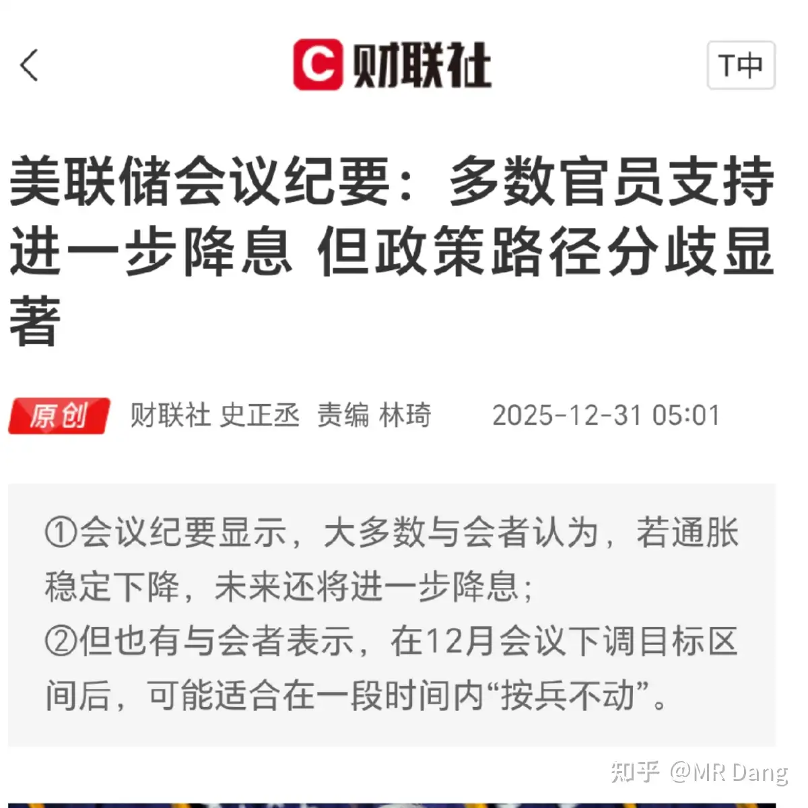
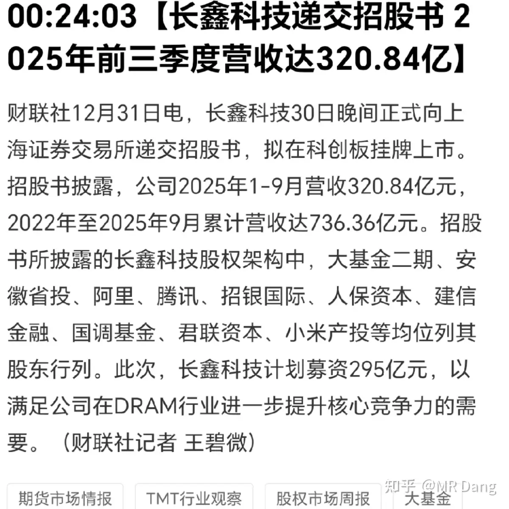

# 如何看待A股2025年12月31日 市场行情？

---

**发布时间**: 2025-12-31 07:14  |  **原文链接**: https://www.zhihu.com/question/1988901864406791026/answer/1989595338185671802  |  **点赞数**: 643 人赞同

**作者信息**: MR Dang​独立投资人，不接广不卖课

---

## 正文内容

本年最后一个交易日，希望可以给2025画一个完美的句号。

我也在梳理目前的持仓，我知道大家想问什么，一个一个来。

我持仓的gggf昨天中午发了个加急的公告，被缴了6000万的税，股价午后就跳水了。

这个公告很有意思，语焉不详，没有透漏具体补缴税款的原因。

但是如果你恰好懂那么一点财务知识，通过《28号准则》的使用，以及没有追溯调整的细节，可以看出公司选择了未来适用法。

排除掉会计差错和会计政策变更，那剩下的只有一种可能：会计估计变更。

另外据说这6000万是两年的税收优惠，那么每年就是3000万。

这6000万是确定要交了，问题的分歧在于以后还能不能适用税收优惠政策，是不是每年都要多交3000万。

如果是每年都要交3000万，按照之前16pe的估值，相当于估值就要减少4.8亿，合股价一块钱。

如果只是一次性的交6000万，按照之前4pb的估值，相当于估值要减少2.4亿，合股价的五毛钱。

情况就是这么个情况，但是蹊跷的地方在于公司之前都是符合优惠政策的，这一下突然说不符合了，只能说地方财政还是吃紧啊。

磷王其实一个月前也补了三个亿，补完以后就发了个采矿证，很巧。

我个人在综合评估后，由于股价已经跌到了我的第一补仓位置，成了今年第二只我买入后达成回撤10%的股，同时虑到股息率尚可，我把仓位又补到了建仓时的仓位比例。

这里要敲下黑板啊，补仓不是赌气，不是头铁，是为了更高的股息率。

你不能本来10%仓位，股票一跌直接补成50%了，那继续跌怎么办？补成全仓？

建仓时10%的仓位，跌到9%，你补回10%就行了，有股息打底，回本是时间问题，千万别赌气，指望加仓解套。

今年业绩是没指望了，股息方面今年应该会少一毛左右。

不过好处就是明年基数低，增速就上去了，

bfny回调的多的时候很多人问，我说我不怕跌，让我扛着。

现在差不多又涨回去了，那现在我觉得对这个股没信心的，或者对这个逻辑有疑虑的，你不必和我一样一直拿着，该止盈就止盈，趁着还有点盈利。

现在可真的给机会了，勿谓言之不预也。

投资者容易在股价上涨的时候过于乐观，在股价下跌的时候又过于悲观。

所以持股需要信心，需要对商业模式和公司盈利能力的了解，而不是哪个大v说了什么，看好什么。

磷王对我不薄，就是涨的太快了点，感觉车还没坐稳，就发车了，我倒不希望涨太快了，下一个标的还没想好。

锡王。。。我昨天是真买了，但是买的太少了。

集合竞价就抢了最后一笔，本来应该是能开到26下面的，但是我报的高了点。

除了开盘，后面一股都没买到。

距离我的目标仓位还挺远，以我这个臃肿的程度，不可能像大家一样一笔就进进出出，所以必须有组织有纪律。

在这里也给大家提个醒，如果有博主吹嘘自己多有多有实力，同时你看他的操作还身轻如燕，来去自由，那肯定有一方面是假的。

以我多年的交易经历，有一个规律是，如果你当天的交易金额超过个股成交金额的一半，你的均价一定会比当天的均价更吃亏。

（吃亏就是买的时候买的比均价贵，卖的时候比均价便宜。）

就和东大现在在工业领域一样，你超过50%就一定是吃亏的一方，要买就会涨价，要卖就会下跌，和你的择时能力没关系。

大象跳水坑，一定有水花，你别扯什么善于跳水，这是物理规律。

银行快分红了，开完会两个月内必须分，如果管理层不是太磨蹭的话，春节前应该能分下来。

目前没什么好的想法，到时候如果没有更好的选择就继续复投银行。

邪修三兄弟，本来Zh套了挺久，差点到补仓位置，后来慢慢就开始浮盈了。

消费三姐妹，表现凑合吧，消费本身不振，看明年能不能好一些。

还漏了个bt，它和磷王一个生态位的，最近磷王涨了，bt就有性价比了，如果到时候磷王止盈它还原地踏步，那我就全部换成它。

铜王业绩预告：

利益相关：我几日前刚止盈了大部分铜王，只剩一点。

我的看法：业绩环比略微下降，稍微不及预期，业绩只能给60分。

可能是成本费用方面比较高。

当然也有相当超预期的东西：

扩产计划里12万吨碳酸锂，这个数量肯定让其他友商压力山大啊，怪不得投行都在唱空锂价，铜王这冒出来的产量真的挺吓人的。

其他金银铜也产量增加了10到20个点不等。

扩产计划打100分，很炸裂。

二手f交易税费调整，主要是二年内变化，从5%降到3%，轻微利好吧，可能能提高一些流动性。

存量市场，利好两年内的=利空满二的，利好二手房=利空新房。

沪银夜盘涨了五个点，国际银价收复76美元。

之前看图形的话，有明显的偏离，现在经过这么一涨一跌，又回到那个斜率上了。

把我带入空头视角的话，感觉有点像鬼故事。

波动太大了，参与不了，只能摇旗呐喊。

锡也涨了点，昨天许的愿没把握住，今天更难了。

盐湖收购五矿盐湖。

作价90亿左右收了个7亿净利润的资产，pe也就13倍左右。

低于目前公司20多pe的估值，被收购的五矿盐湖按照业绩承诺还有增长。

很良心了，好事。

可惜已经止盈了，现在又可以重新加入观察池了，以后蹲到好位置再买一些。

最近几天恐怕蹲不到，刚出利好可能会有溢价，我是说以后如果有机会的话，多一个选择。

美联储会议纪要对明年降息有分歧。

现在结果不重要，都在等新的掌门人。说白了要是哈塞特上来，迟早到3%，现在讨论的这些结果都是废纸。

长鑫ipo:

这个是预期内，这两天如果不递交，放到明年递交就得更新财报。

它也算明星股了，上市热度不会低的，我个人觉得比沐曦摩尔之类的有投资价值。

我会适当关注的，但是感觉这种大热捡不到漏。

今天大家都等着放假了，也提前祝大家元旦快乐。

一个喜欢保护韭菜的博主，希望大家少少踩坑，多多赚钱！

---

> [!comment]- 点击展开精选评论
>
> | 用户 | 时间 | 内容 |
> | :--- | :--- | :--- |
> | 更深的蓝 |  | 向老师汇报一下，自从向您学习组合配置以来，单只股票的黑天鹅事件已经搞不了我大心态了。昨天gggf大跌，我看了一眼总体收益率浮亏还不到1%。今天gggf如果继续下跌到第一补仓价我就适当补一点仓。 |
> | &nbsp;&nbsp;&nbsp;&nbsp;MR Dang |  | 你学到真东西了 |
> | 宁静致远 | 5 小时前 | 国光股份？ |
> | ooo | 2021年前 | 推测税务机关认定不符合优惠条件的可能原因包括：一是主营业务收入占比未达到60%（2021年后标准）或70%（2021年前标准）的要求；二是主营业务可能不完全符合《西部地区鼓励类产业目录》的相关规定；三是业务结构发生变化导致不再满足优惠条件。 |
> | &nbsp;&nbsp;&nbsp;&nbsp;MR Dang |  | 几年了没发现这些，现在发现了 |
> | 开始运气 |  | 早安 老师控制仓位10%的意思是不是我有100w的话，个股金额控制在10w左右。如果它下跌了10%，变成市值9w，那我就再补到它10w左右。不知道我理解的对不对。 |
> | 小洋相 |  | 我也是这样理解 |
> | 开始运气 |  | 谢谢老师指点 |
> | 洗洗睡吧123 |  | 那我补多了 |
> | 熊熊熊 |  | 太有实力了，当天买入能有个股交易额一半是什么体验。 |
> | &nbsp;&nbsp;&nbsp;&nbsp;MR Dang |  | 体验就是只想等大单，为什么老有股民说大单必破，因为在比较大的资金看来简直是白给 |
> | Enzo Fernandez |  | 国光股份就可以，一天交易没多少，柚子随便买 |
> | 唐小刀 |  | 昨天开盘时真的是疯狂扫货大A总是给白捡钱的机会 |
> | &nbsp;&nbsp;&nbsp;&nbsp;MR Dang |  | 市场经常犯错 |
> | 巴巴多斯岛居民 |  | "你不能在股票大涨时才爱dang大"，坚定持有gggf，哥，早上好 |
> | 慎独 |  | gggf昨天也补了点，bf和nsly坚定持有。这两天又把你的天阶功法，地阶功法，玄阶功法重新学习了一下，立足宏观经济政策去分析个股，这几个还是非常稳定的。bt和盐湖有机会入一下，就是子弹快打光了 |
> | hxsx |  | 老师，我好像开窍了。我越来越喜欢银行了，越加越多还越拿越稳，想后续继续加仓。后面的人民币升值、低利率与高股息银行内在增长价值等等每一项，我终于看懂了您写的逻辑，现在七成仓，还想加。 |

---

*本文件由自动脚本从MR Dang知乎页面提取生成*

---

**作者**: MR Dang
**链接**: https://www.zhihu.com/question/1988901864406791026/answer/1989595338185671802
**来源**: 知乎

*著作权归作者所有。商业转载请联系作者获得授权，非商业转载请注明出处。*

---

## 相关阅读

**📅 每日行情评价（相邻日期）：**
- [[20260105-对2026年1月5日A股市场行情，大家有什么预测和看法？]] - 2026年第一个交易日
- [[20251230-如何评价2025年12月30日A股行情？]] - 2025年倒数第二交易日

**📚 相关主题：**
- [[20251106-怎么投资银行股，并获取银行股股息收入？]] - 银行股投资方法
- [[20251102-《天阶功法卷四》磷化工投资价值分析]] - 磷化工深度解析
- [[20251008-黄金涨的这么疯狂，是代表了纸币飞速贬值还是已经商品化了？]] - 贵金属投资逻辑

**💡 投资方法教育：**
- [[20251020-交易策略只是第一步，重要的是仓位管理？如何科学设置仓位？]] - 仓位管理的重要性
- [[20251031-你是怎么计算股息率的？ 关注股息率的哪些点？]] - 股息率计算方法

**📖 系列文章：**
- [[天阶功法]] - 个股深度分析系列
- [[韭菜保护合集]] - 投资避坑指南
