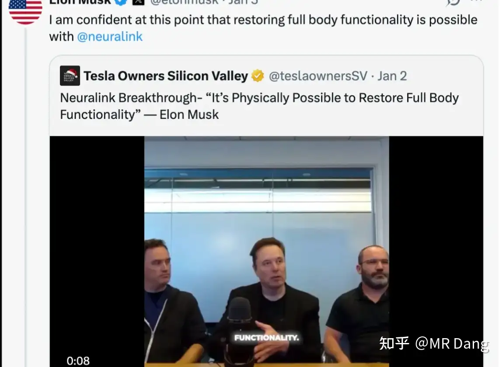
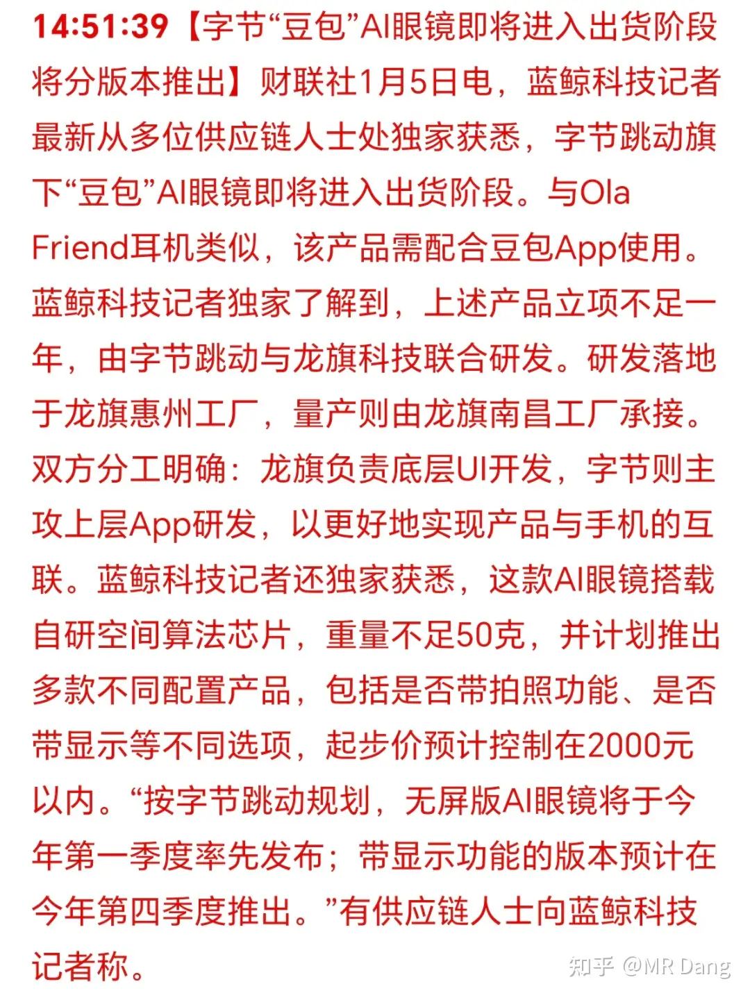
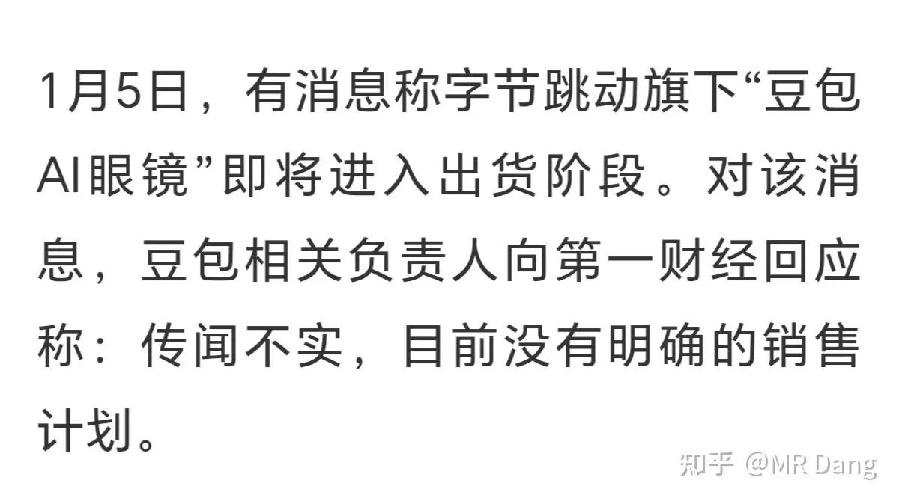
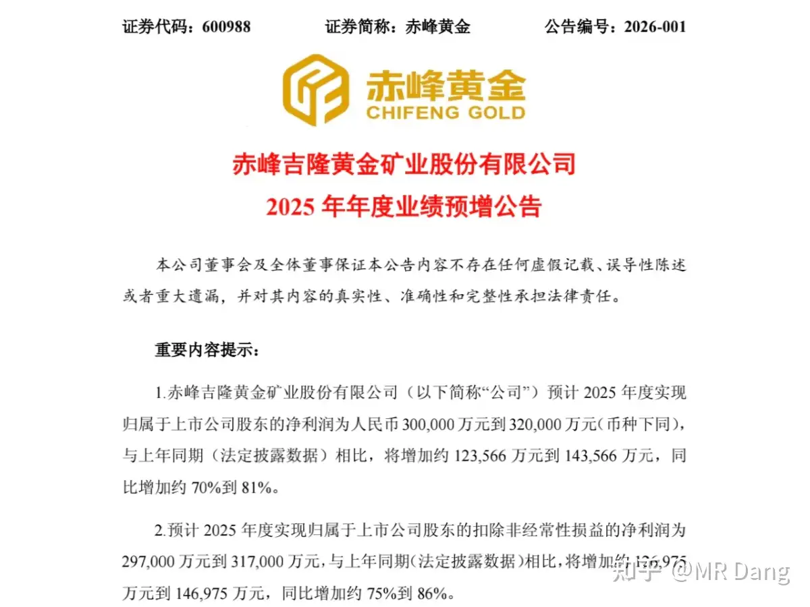
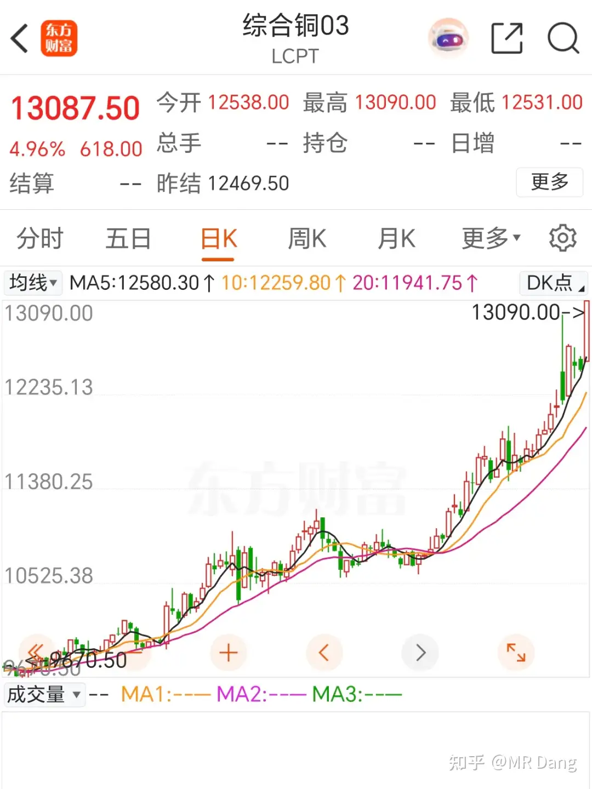
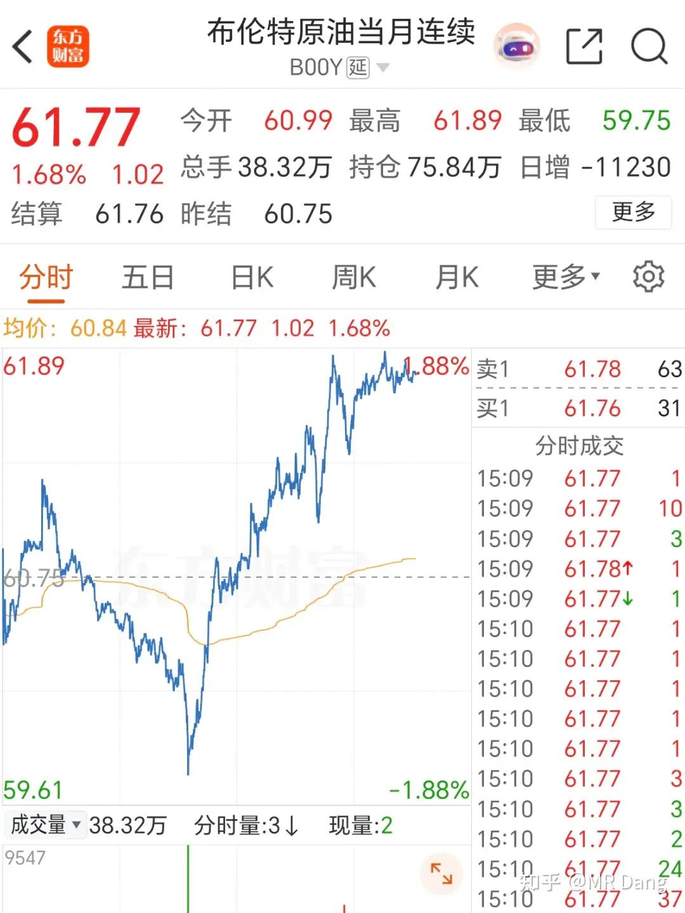
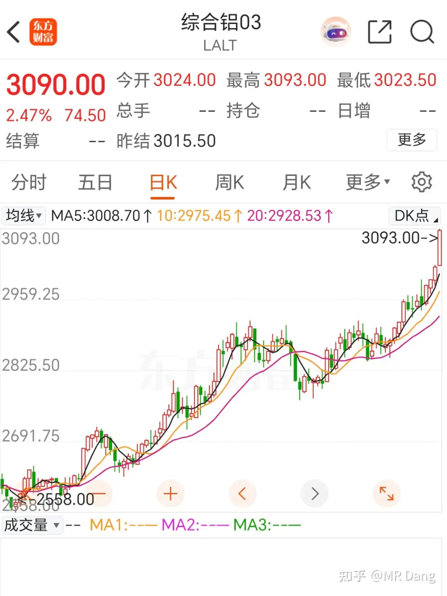
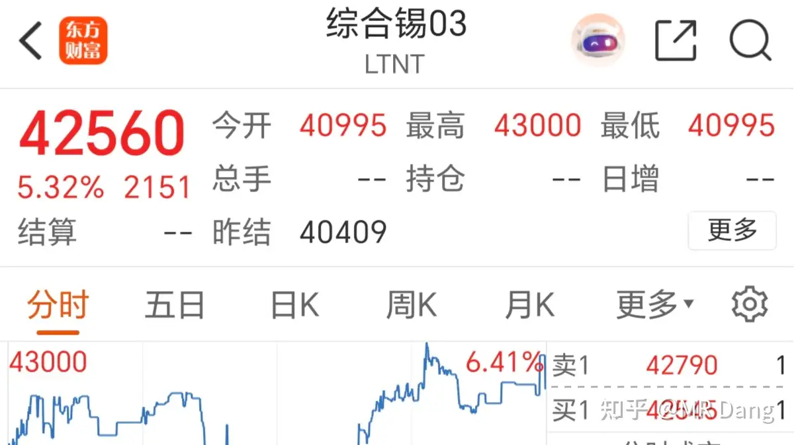

# 如何评价2026年1月6日A股行情？

---

**发布时间**: 2026-01-06 07:18  |  **原文链接**: https://www.zhihu.com/question/1991290572619658574/answer/1991770504453977821  |  **点赞数**: 734 人赞同

**作者信息**: MR Dang​独立投资人，不接广不卖课

---

## 正文内容

昨天A股迎来了开门红，指数又站上了4000点。

马斯克的脑机接口叙事点燃了市场热情，相关概念板块涨幅不小。

我怕遗漏了什么重要的信息，又仔细梳理了一遍，没找到确定性的机会。

包括铲子股，也没有找到合适的。

这玩意儿毕竟要接脑子，普通人会疑虑重重的，它的受众面目前还比较窄。

尽管听起来叙事很有未来感，但是考虑到商业落地的情况，以及中途可能碰到的种种障碍，我个人觉得性价比不高，不是一个好的商业模式，虽然确实很酷。

所以这方面的钱是一分都挣不到了，超出我的认知了。

我对马斯克是挺佩服的，作为企业家来说无疑是人类历史第一的存在。

但是老马也经常画饼，去年画的饼兑现的比例很低，今年画的饼这么大这么多，能兑现多少也是存疑的。

我都能想到若干天后，可能这个概念炒了一轮，最后又套进去一群散户，然后就会有人发帖群嘲，敢炒脑机接口的人才真的该去看看脑科。

昨天某湖涨停了，前几天不是算过了么，大概影响160亿市值，也就是一个涨停多一点。

开盘的时候一看没涨停，就咬着后槽牙买了一些高价票先上个车，一点点🤏 ，就纯粹买个参与感。

结果后面就涨停了，那再往上就是情绪溢价了，只能目送某湖起飞。

等它啥时候回30以内我才会再重新考虑了。

资本市场不缺机会，不怕错过，怕的是做错。

豆包ai眼镜在昨天收盘的时候爆出消息，相关股票直线封板。

结果盘后又被辟谣：

自从持有锡王仓位后，我现在对所有的电子消费品都是持开放态度

一想到几乎所有的电子产品里都要用到锡，人变得豁达了，所有的电子消费品都变得可爱起来了。

某黄金企业发布业绩预告：

我个人觉得不及预期，和另外几个不入流的金矿坐一桌去，抬走，下一位。

存储又涨价：

机构测算存储在2028年前都会紧平衡，新建产能可能落地要在2028到2029了。

这方面国内的标的不够正宗，寡头垄断，都在韩国那边。

说到韩国，他们的头头这两天来东大，时隔9年第一次有一把手来东大。

韩国的相关企业其实看着挺诱人的，和咱们这边一两百倍pe比起来的话，他们的海力士只有不到20pe的估值，也就是普通制造业的估值。

如果你真的看好储存，想买点便宜的东西，但是又没有买韩国股票的渠道。

那我建议你可以看看港股那边，有一个南方两倍单吊做多海力士的基金。

你看的一头雾水也没关系，这段话扔给ai，它会给你代码。

这玩意儿自带杠杆，风险很大很大，非专业人士不要碰，我也不推荐任何人购买，只是给你指个门路。

我为啥相对来说看好这个呢，因为它是铲子股的铲子股，管你什么ai大模型，都少不了存储。

竞争格局好，寡头垄断，互相一商量说涨价就涨价，商业模式好，确定性高，估值还低。

哦对了，这两年有换手机换pc打算的，现在这个时机还不错，趁着有补贴可以换。别到时候存储涨价了再换，高位接盘。

昨天资源类全体起飞，一时不知道该说哪个，捡着重要的说吧。

铜暴涨了五个点，一根光头大阳线。

不过这是白天和夜盘一块涨的，昨天a股收盘的时候就有三个点了，相当于收盘后又涨了两个点。

布油涨的不多，但是波动不小。原油应该属于多空博弈最激烈的品种之一了，做多的和做空的都觉得自己的理由十分让人信服。

铝创近期新高。

锡涨了五个点，不过这个品种看沪锡更准。

铂又涨了六七个点。

其他的金银也在昨天a股收盘的基础上涨了一两个点不等。

说回股票。

今天可能有色股又要日常吃肉，蹲锡王恐怕是蹲不到了，目前只能靠手头这点锡王了。

现在有些投资者一看指数4000点了，又开始焦虑着急了。

很纠结，追吧，怕追高，不追吧，怕踏空。

要我说，这个位置就不要追那些热点了，资源股握在手里才是最踏实的。

铜王某湖这些过于强势的品种我就不推荐了，好是好，但是不便宜，我自己都怕拿不住。

锡王属于一般强势的，咬咬牙也能买，买了也容易被套，55开吧，有赌的成分在里面。这个价位不是很推荐小白买。

磷王我觉得可以，虽然比我二次入手的价格涨了十多个点，但是算估值，算股息率的话依然不贵。

铝王昨天创新高后跳水，可能是有资金担忧资产注入稀释股权。我觉得这个价位不贵，喜欢铝的也可以考虑考虑。

非矿我还是推荐小白买股息率高的银行，真不贵，趁着几乎没怎么动，现在上车不吃亏。

前几天公布保险收入增速不错，保险股涨了一些，其实最后这些险资兜兜转转还是会买成银行股，还不如省去中间商赚差价。

消费可以看看白酒的头部几个，几乎在新低的位置，也有股息率。

开门红是好事，现在在整个A股历史上都算难得的好光景了。

但是需要小心谨慎，不能因为眼红就忘了仓位管理和风险控制。

很多人都是眼睛一红，账户就就绿了。

现在热点切换快，新的热点一出来，旧的热点就被遗忘了，比如几天前大热的海南板块，现在还有人提么？

牛市也是会套人的，一定要小心！

一个喜欢保护韭菜的博主，希望大家少少踩坑，多多赚钱！

---

## 精选评论

| 用户 | 时间 | 内容 |
| :--- | :--- | :--- |
| 乌获 |  | 1月6日A股行情1.马斯克脑机接口点燃市场热情，他虽然优秀但也会画饼。我甚至觉得就是因为他之前太优秀了，做成了很多别人认为做不成的事，所以他现在更容易画饼。可能也不是故意的，但是他自我认同达到一定程度了，就容易夸海口吧！我们则要保持理智！不要盲目崇拜！2.yh昨天没顾得上 后面蹲一个好位置（30以下）。不怕错过怕做错！3.虽然我锡王只有四手 但是我现在也觉得电子产品可爱起来了～hhh～4.赤峰黄金发布业绩预增，归母净利润&扣非归母净利润分别比上年同期增加70%和75%。老师觉得不及预期，和另外几个不入流的金矿算一桌。为什么会不及预期呢？可能是虽然公司净利润因金价上涨而大幅度增长，但关键的“量”和“本”两大核心经营指标均出现恶化。a.产量不增反降：2025年上半年矿产金量6.75吨，同比下降10.56%，公司将全年产量目标下调至16吨。降量原因：国内核心矿山因新增作业单元。掘进工程扰动正常产出；境外矿山遭遇雨季提前，影响采矿；处理低品位矿石的比例增加。导致入选矿石的平均品位降低（这其实会增加成本）。b.成本大幅攀升：单位销售成本同比上涨11.78%，至319.06元/克（真的龙头我记得成本是200多块钱一克）；单位全维持成本同比大幅上涨34.28%，至355.41/克。原因包括产量下滑（固定开支不变但产量下降）、为保障未来出矿而增加的前期投入、以及海外当地可持续发展税率从1%上调至3%。由此可见，整个行业上行的时候看着都赚钱，还增收了，但实际公司水平未必优秀！5.存储涨价 可以直接投资的标的是“南方东英SK海力士每日杠杆(2x)产品”。· 投资目标：寻求实现SK海力士普通股（000660.KS）每日表现两倍（2x）的投资回报（扣除费用前）。· 投资策略：通过以掉期为基础的合成模拟策略来实现上述目标。但是这个标的有很高的风险：a. “每日”杠杆与复利效应假设SK海力士正股价格经历了一个“过山车”行情，最终回到原点。第1天正股每日涨跌幅-10%正股价格（累计）902倍杠杆ETF每日涨跌幅-20%2倍杠杆ETF净值（累计）80第2天正股每日涨跌幅+11.11%正股价格（累计）1002倍杠杆ETF每日涨跌幅 +22.22%2倍杠杆ETF净值（累计）97.78结果就是：· SK海力士股价：从100元出发，经过波动，最终回到100元，不赚不赔。· 2倍杠杆ETF：从100元净值出发，最终却只剩下97.78元，亏损了2.22%。在缺乏明确方向的震荡市中，即使标的资产价格没变，杠杆ETF也会因为每日涨跌幅的几何计算（乘法而非加法）而持续亏损。因此它只适合短期交易。b. 极端波动与本金风险由于是单一个股、两倍杠杆且非多元化投资，其价格波动极为剧烈。在市场不利的情况下，可能会在一天内损失大部分甚至全部投资本金。c. 非持股关系投资该产品不等于直接持有SK海力士股票，投资者不享有股东投票权等权利。6.资源类标的 大宗全涨股指站上4000 避开热点 手握资源铜王 湖王 强势品要择时锡王能咬牙磷王 铝王可以入银行也适合上车 买保险不如买银行消费白酒龙头新低7.是好时候 但好时候也会收拾人的早上好呀老师 今天又跟着老师学到新东西啦！开心！ |
| &nbsp;&nbsp;&nbsp;&nbsp;MR Dang |  | 太认真了 |
| 奥特之父 |  | 脑机的铲子股是冠昊啊 |
| &nbsp;&nbsp;&nbsp;&nbsp;MR Dang |  | 铲子有，但是没便宜的铲子 |
| 奶片 |  | 哥虽然最近推荐的没买，但是bf赚了 |
| 心态要好 |  | 一样 |
| 化石的岁月 |  | 一样，一样。 |
| seeee |  | Bf是什么 |
| 馬颿 |  | 宝丰 |
| 馬颿 |  | 我宝丰接近9成仓，留了一层打野 |
| 南风 |  | 刷大佬的文章已经变成了通勤车路上的保留节目。 |
| 七月 |  | 俺也一样 |
| 南辰 |  | 老师，铜王是啥 |
| 淮南 |  | 锡王看不下去了，涨停价追一手，看我把锡王价格打下来 |
| nobody |  | 谢谢你 |
| 韩太阳 |  | 期待明天能借你光上车 |
| Knx |  | 先生早关于两倍做多我想补充一句：像两倍海力士这种杠杆类产品的交易属性要远多于投资属性，杠杆的磨损净值衰减特性不适合长持，血泪教训 |
| &nbsp;&nbsp;&nbsp;&nbsp;MR Dang |  | 是的，这个忘记提醒了，这个属于投机性质 |
| 机械之道 |  | 数学题，一个跌停一个涨停，小于一更别说加杠杆了 |

---

*本文件由自动脚本从MR Dang知乎页面提取生成*

---

**作者**: MR Dang
**链接**: https://www.zhihu.com/question/1991290572619658574/answer/1991770504453977821
**来源**: 知乎

*著作权归作者所有。商业转载请联系作者获得授权，非商业转载请注明出处。*