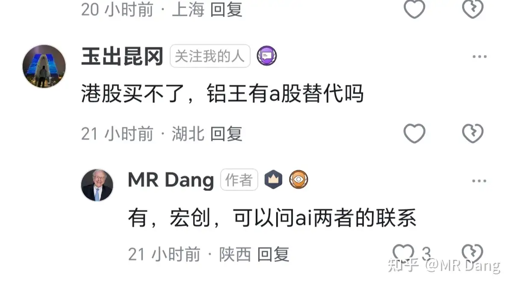
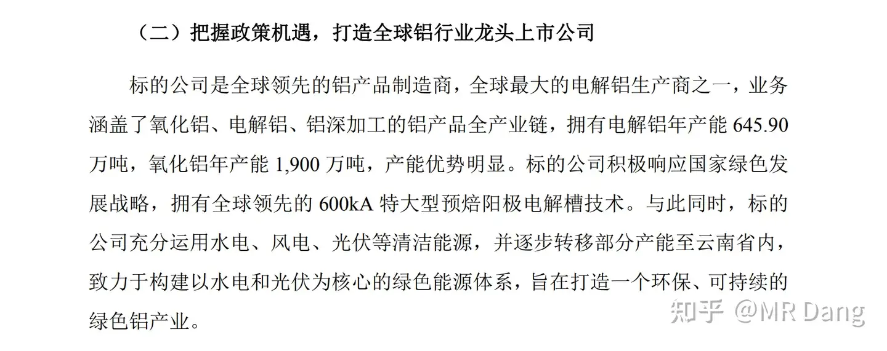
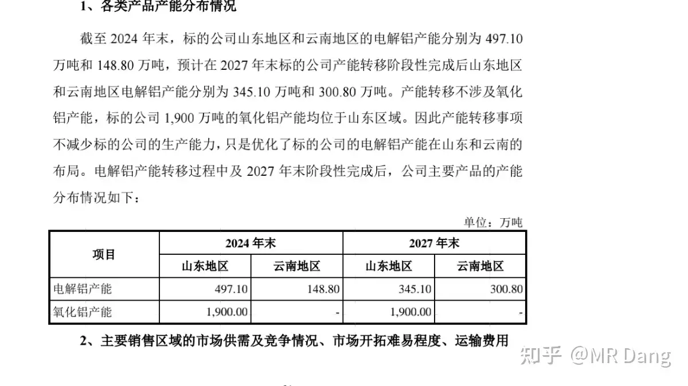
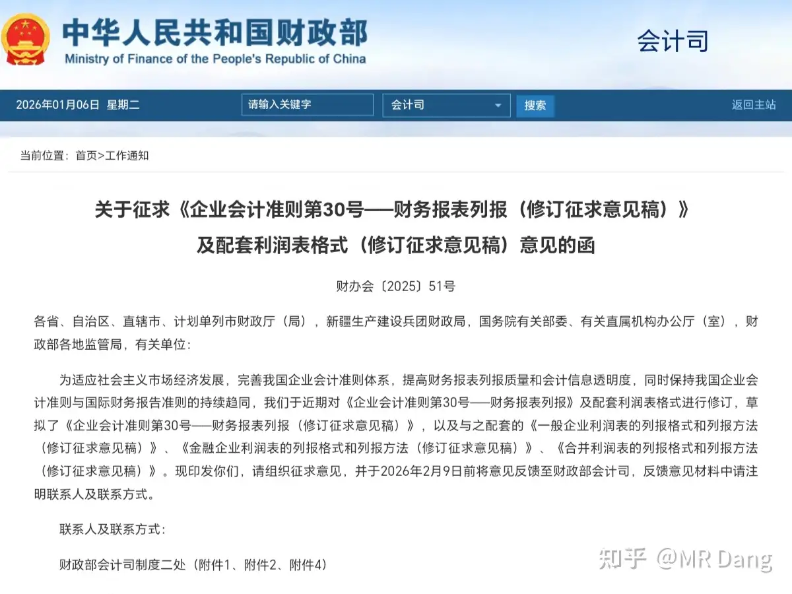
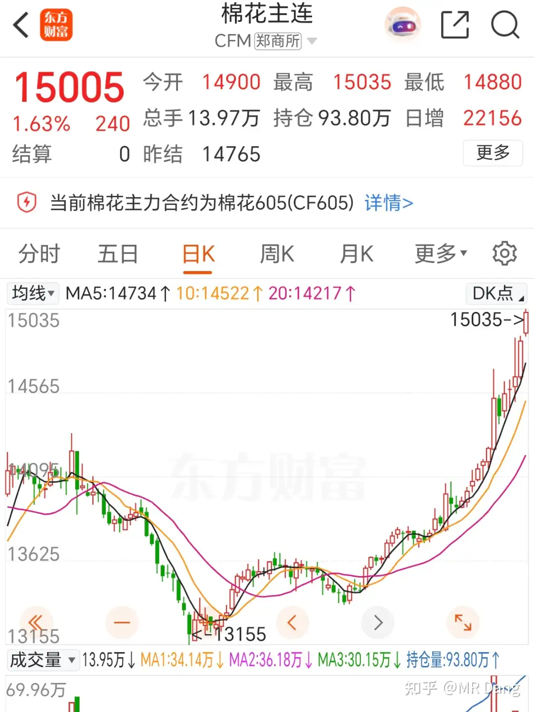
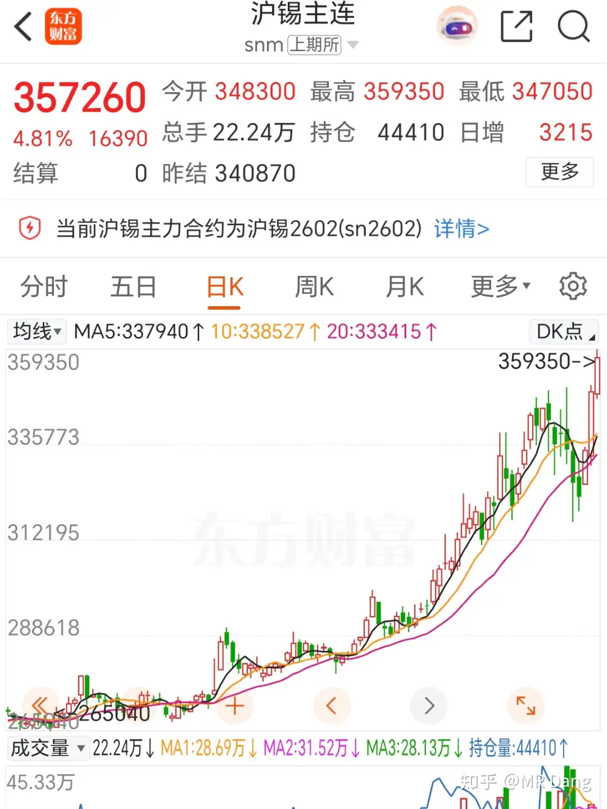

# 如何看待2026年1月7日A股行情？

---

**发布时间**: 2026-01-07 07:16  |  **原文链接**: https://www.zhihu.com/question/1991295694733063197/answer/1992132437917058906  |  **点赞数**: 862 人赞同

**作者信息**: MR Dang​独立投资人，不接广不卖课

---

## 正文内容

先回顾一下昨天的情况吧。

嗯。。。运气不错，净值又大幅刷新个人PB。

锡王涨停，磷王铜王金店塑料王铝王海金王这些资源股都有差不多半个涨停。

其中塑料王创了历史新高。

我对塑料王是有感情的，它是我写的第一篇天阶功法，写的相当认真，可能也是我读者里持有范围最广的一只。

我忘记了发文章的时候啥价格，反正不是很高，大概应该是18左右。

但是那个时候粉丝少，很多粉丝是后来的，他们看见文章的时候股价已经20了。

最后一窝蜂的冲进去，然后套住了就开始问，怎么办啊，怎么解套啊。

其实写文章的时候我就已经写的很清楚了，那个价位都是有风险的，何况20上面。

但是现在创历史新高的话，我也算松了一口气。

如果哪个读者觉得是跟风买进来的，后悔了，觉得上当了，那趁着现在历史新高赶紧卖，赚多赚少的问题了。

今年刚开始的时候，我说了今年给自己定的主线是锡磷钾银。

我想到了资源会抢手，但是没想到这么抢手，几乎是眨眼间就起飞了。

大家问啥时候止盈啊，这个我说不来，鄙人不善择时。

但是这三个我是区别对待的，锡王是只加不减，没有止盈线，非卖的珍藏品。

其他两个是30%止盈，目前都快到我止盈线了，我再给你推荐买点也不地道对不对。

那现在还有没有咬咬牙还能买一点点的资源股？

有的，兄弟，有的。

铝王。

昨天其实也说过，港股那边错杀了，创新高后跳水，真不贵。

很多读者一听港股，劝退了。

那我这里还有一个曲线救国的方案，其实是昨天盘前评论区有人问的，长这样：

这个算是铝王的A股平替吧。

很多人算不来账，所以我大概顺手给你一算，要不要参与自己把握，不是荐股！！

首先是这家公司为为什么是铝王平替？

准确的说就是它发新股，收了铝王旗下的主要资产，然后铝王的主要资产就成了它的全资子公司，就相当于在A股上市了。

大概类似于借壳上市，但是还不一样，借壳是铝王夺舍，这个操作是直接吃了铝王。

本身它有11.36亿股本，新发行118.9亿股本，相当于发行后总股本130亿。

目前它的股价是27.3，那么推测目前股价对应的估值是27.3*130=3549亿。

它之前的股价长期在五块左右，算50亿估值吧。

那也就是说铝王部分的估值是3500亿左右。

我们现在看看这3500亿的业务是什么：

简单的说，电解铝645.9万吨，氧化铝1900万吨。

这645.9万吨，有497.1万吨在山东，云南有148.8万吨。

后面因为云南电便宜20%，所以要往云南搬一半过去，搬的时候之前的瓶瓶罐罐就要扔了，叫固定资产减值损失。

大概损失了17个亿，在2024年年末计提，这个数字很重要，有用。

而铝王的子公司主要财务数据如下：

2024年归母净利润181.5亿，这个是算了17亿计提以后的，还原一下的话，大概就是181.5+17*0.75（考虑所得税）=194.25

2025年数据目前不详，半年报增速15%，

全年增速也这么算吧。

则2025的净利润大约就是194.25*1.15=223.4亿，取个整算225亿

对应20PE估值=225*20=4500亿

(对标云铝）

较目前有大约30%空间。

你也可以理解成，目前估值对应的是2024年的利润。

现在买进去相当于赚了公司一年的增速。

情况就是这么个情况，可能这股关注度低，或者说2024年账好算，2025年的不好算，有门槛，所以估值还停留在2024年业绩。

铝王低配版平替，不过就算这个平替的净利润也稳坐全球霸主的地位。

当然这其中也是有风险的，比如20pe是不是给高了，毕竟中铝是17pe。

见仁见智吧，但是这股潜在股息率高，可能有5%。

---

## 精选评论

| 用户 | 时间 | 内容 |
| :--- | :--- | :--- |
| 乌获 |  | 1月7日A股行情1.前日回顾锡王 xygf磷王 yth铜王 zjky金店 cbgf塑料王 bfny铝王zghq-港（平替hckg-大A）海金王 zjky-港虽然标的都在这里 但投资选对标的只是第一位择时、心态甚至更加重要而择时和心态建立在扎实可靠的买入逻辑之上也就是知道这个标的值多少钱，才知道买的时候贵不贵，卖的时候早不早，股价下行的时候拿得住。并且这个逻辑必须是来自自己，而不是来自别人（如果完全信任和认同他人的逻辑，那也算自己的。这个完全认同指的是“我坚定的这么认为 并且输了也心甘情愿”！）资源股基本都走势强劲 并不适合此时上车锡王长期持有 不设止盈2.咬牙能上车的铝王平替上车逻辑：hckg收购了zghq旗下的主要资产，意思是hckg多了一个特别能赚钱的亲儿子，zghq多了个A股户口。hckg本身股本11.36亿新发行股本118.9亿发行后总股本130亿目前hckg股价27.3，那么推测目前股价对应的估值是27.3*130=3549亿之前的股价长期在5块左右，估值算11.36*5‎ = 56.8亿即收购的铝王的资产估值3500亿左右这3500一的业务是电解铝645.9万吨，氧化铝1900万吨。其中电解铝有497.1万吨在山东，148.8万吨在云南。预计2027年末，zghq产能转移完成后电解铝在山东和云南的产能分别为345.1和300.8万吨。氧化铝1900万吨在山东不变。因为云南电便宜所以电解铝搬过去一半，搬的时候之前的瓶瓶罐罐有部分扔掉了有部分处置了，总的来说计提了17亿的固定资产减值损失，在2024年末计提。2024年归母净利润181.5亿，这个是算了17亿损失计提后的，还原一下就是181.5+17*0.75=194.25（考虑0.25点所得税）2025年全年增速按照半年增速14.63%（15%）算。则25年净利润大约为194.25*1.15‎ = 223.388亿，算225亿。对应20pe估值 就是225*20‎ = 4,500亿（我的理解是每年赚225亿，赚个20年能回本，本就是4500亿。就是股东们愿意给4500亿搞这个企业）这个20倍pe的估值 怎么来的呢？老师说是对标云铝这个云铝是lygf还是铝王？可能是ylgf（这个股票现在20倍pe 而且它因为“水电铝”的绿色属性享受估值溢价，而zghq在港股的估值是14pe左右）这个估值是个预估的变动值 实际值会受到经济、供需等多方因素影响 所以也有风险但是这个股潜在股息率高 想安全可以等回调则4500-3500=1000亿 较目前价位有大约30%上涨空间也可以理解为目前的估值对应的是2024年的利润，现在买进去赚得是公司一年的增速。意思是现在27.3股价即3549的市值，说一句2025年的盈利水平来定价的，这个“一年的增速”指的是公司盈利葱24年倒25年的预期增长率15%。即，现在买，市场是用24年的利润给你估值，如果真如你所料25年净利润增长15%（公司确实多赚钱了），且市场认可20pe的估值逻辑（给公司以20pe重新定价），那么你就会得到这个利润增长和估值切换带来的回报。电解铝是非常好的生意模式，电价持续走低。某些地方的交易电价出现发电机组倒挂的倒贴现象。我本来有点纳闷 怎么会有这样一招“蛇吞象”呢？zghq这么厉害为什么愿意被hckg买下最赚钱的子公司？原来这俩公司的实际控制人是一样的～～这次重组的目的之一就是价值重估！我上车了～3.东大制裁11区其中11区依赖度高且最重要的金属是铟和锗铟属于液晶产业链必需品 11区全靠进口而xygf生产了全球最多的铟 占全国的四分之一锡王 yyds 虽然我只有一丢丢 但是也开心 hh～4.下有保底 上不封顶的券商股老师留了个伏笔我经过学习 梳理一下“下有保底 上不封顶”可能的实现路径【下有安全垫】a.注销式回购：上市公司用真金白银从市场买回自己的股票并注销。直接减少总股本，能提升每股收益&每股净资产，相当于所有股东权益被增厚，对股价形成支撑。b.明确高分红：稳定的高现金分红是提供安全垫的重要方式c.涉及并购重组且有“现金选择权”条款的券商。“现金选择权”就是被并购方股东可以选择按一个约定价格（通常高于或接近当前市价）卖出股票，这构成了一个类似“保底”的权利。就是被狗方股东有一个确定的、有保障的卖出价格，理论上锁定了股价下跌的风险。这个约定价格的设定是关键，通常以并购停牌前一段时间的股票均价为基础，并给予一定的溢价。（但是我觉得这个可能性小吧。因为感觉主要是保护被购放股东的，而且还得看你的买入价是多少，所以严格来说不算保底吧～）【上涨有弹性】a.业绩高增：25年随着市场回暖，券商业绩普遍大幅增长，前三季度上市券商归母净利润同比增长超过60%b.估值低位：与火热的业绩相反，券商板块估值（PB）处于历史较低水平，形成“剪刀差”c.政策&市场预期：监管鼓励行业并购重组，财富管理、机构业务登新引擎在成长，如果市场走牛，作为“牛市旗手”的券商股弹性巨大。意思就是市场热，这利于券商业绩发展，但券商板块较冷，这利于捡一个好价格。期待老师揭晓 嘿嘿又是学到新东西的一天啊感谢老师 开心🥳 |
| &nbsp;&nbsp;&nbsp;&nbsp;MR Dang |  | 键盘给你，明天你来写吧，太认真了 |
| 子曰不语 |  | 我记得老师说要蹲个25开头的锡王，结果我从26眼睁睁看着它上去了 |
| Charon'D |  | 老师早，现在的行情有一种再不加仓就晚了，一加仓就完了的感觉 |
| Muster |  | 在哪里，在哪里见过你！25锡王现在在哪里？我翻遍了K线和记忆只在昨晚的梦里遇见你算了吧，算了吧锡王25就留给回忆下次再遇到机会我会少做梦，多点勇气乱写一通，纪念下 ！继续感谢老师，还是那句话，跟着老师操作可以吃点肉，锡王的车没买到票，至少上了磷王的车。再次祝福老师2026身体健康，多子多福！ |
| &nbsp;&nbsp;&nbsp;&nbsp;MR Dang |  | 谢谢 |
| CloudICE |  | 25.99买进过一手  就一手 |
| 唐小刀 |  | 昨天的心态打开有色、资源仓：就应该这样，早就该涨了。打开新建的化工仓账号：卧槽，怎么涨的比有色还凶？这合理吗？输入代码，查看易中天、寒武纪、新易盛、工业富联、摩尔线程、沐曦股份。看完安心了 |
| 唐小刀 |  | 庆祝一下万亿紫金，本次云南之行，由紫金矿业赞助！11月清仓了所有铝，加了招金、赤金和中金，赤金真是拉闸（反复鞭尸）完美错过一波云铝和宏桥的行情，还好有藏格 |
| 灰马 |  | 早上好！最喜欢的金句，没有之一：有的，兄弟，有的。 |
| 吴迪 |  | 从事行业涉及abs塑料，价格是这些年最低的。从而关注到塑料王。认可会有戴维斯双击，奈何还没学会价值投资，估值。设定17.5入手，一直没买进。如果早点看老师文章，就会有不一样的结局。投资永远有机会，关键是内功修炼。谢谢dang大受人以渔的分享 |
| 朱大头 |  | 兄弟萌，又要到饭啦！（笑 |
| &nbsp;&nbsp;&nbsp;&nbsp;MR Dang |  | 讲师 |
| melody |  | 先赞再看，早上好dang老师，因为关注的比较晚，并且学习投资并不久，所以完美错过。看着dang老师的文章，心里痒痒，忍了半天，还是让自己冷静。 A 股总是有机会的，错过就错过了。 |
| 未语 |  | 同感 要有耐心只要跟着D老师 |

---

*本文件由自动脚本从MR Dang知乎页面提取生成*

---

**作者**: MR Dang
**链接**: https://www.zhihu.com/question/1991295694733063197/answer/1992132437917058906
**来源**: 知乎

*著作权归作者所有。商业转载请联系作者获得授权，非商业转载请注明出处。*
