# 如何看待2026年1月9日A股行情？

---

**发布时间**: 2026-01-09 07:08  |  **原文链接**: https://www.zhihu.com/question/1991894215207191968/answer/1992855205113529675  |  **点赞数**: 1305 人赞同

**作者信息**: MR Dang​独立投资人，不接广不卖课

---

## 正文内容

今天的头版头条必须留给中国神油:

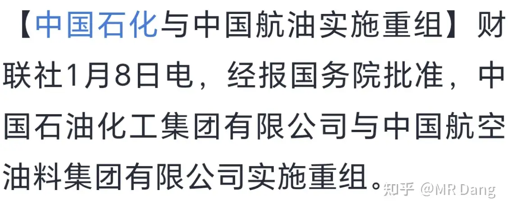

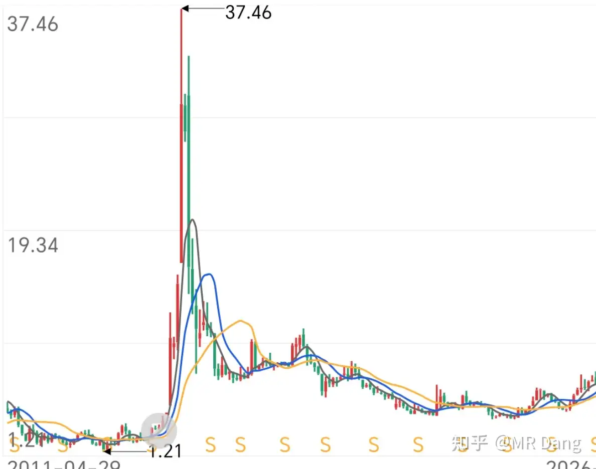

非常震憾的消息，对整个航油产业链是一次重塑，两家加起来近40万员工，三万多亿营收。

肯定是利好，也可以理解成垄断。

这让我想起来十多年前的故人，老股民应该都知道的中国神车。

不知道的我也可以给大家补个课，看图就行了：

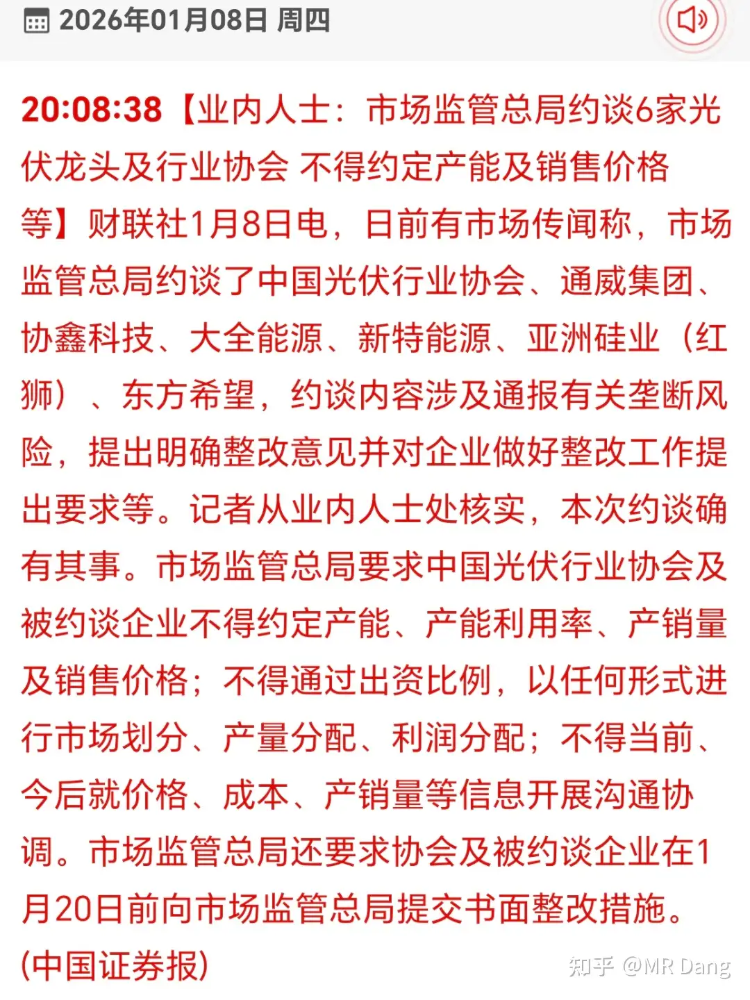

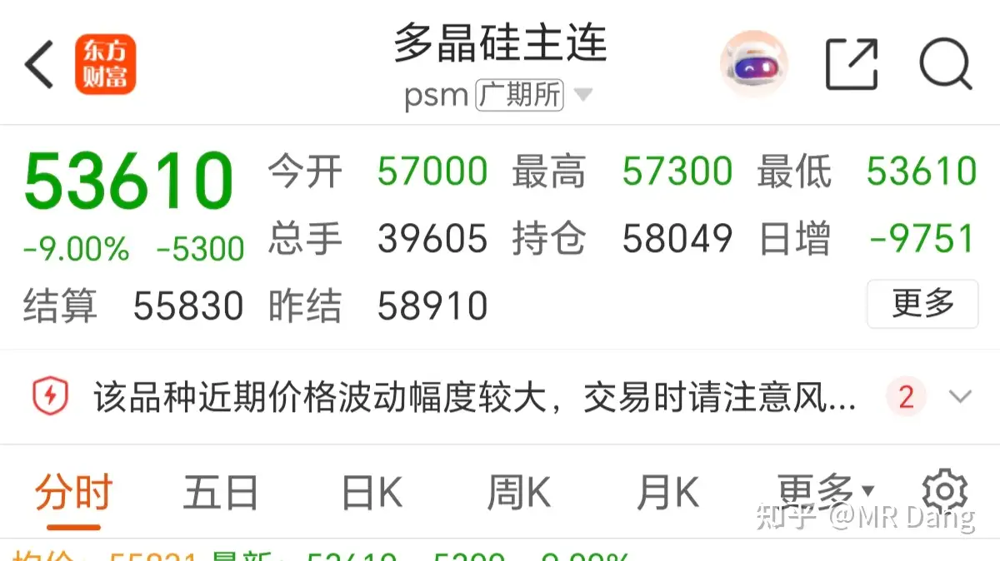

中间那个尖尖看见了么，当时南北车合并，股价天天涨停，比现在的这些商业航天还要猛。

给人的感觉就是买上就发财。

我的一个亲戚还买了，股价30多冲进去的，我劝了很久，我说危险，位置高了，她说她盯着呢，大事不妙第一个跑。

最后的结果就是传家宝拿到现在了，十年间年年加仓，目前还亏60%。

偶尔见面寒暄还会懊悔两句当初没听我的劝告，我也只好安慰她，以她的水平如果不是套在这个股上，只会赔的更多。。。。。。

不是讽刺她，她水平真的一言难尽，手里拿的全是热门股，喜欢在涨幅榜上找投资标的。

这股涨上去的时候是中国神车，后来跌下来，亏了一批又一批抄底的散户，被亲切的称为中国灵车。

我想表达啥呢？

想投机这类消息的，要么不信，要么早信，千万别半路上车，不然车门焊死，神油变辣椒水，刺激的很咧。

光伏产业链：

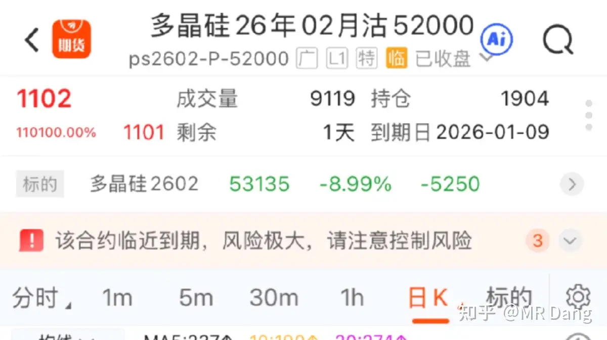

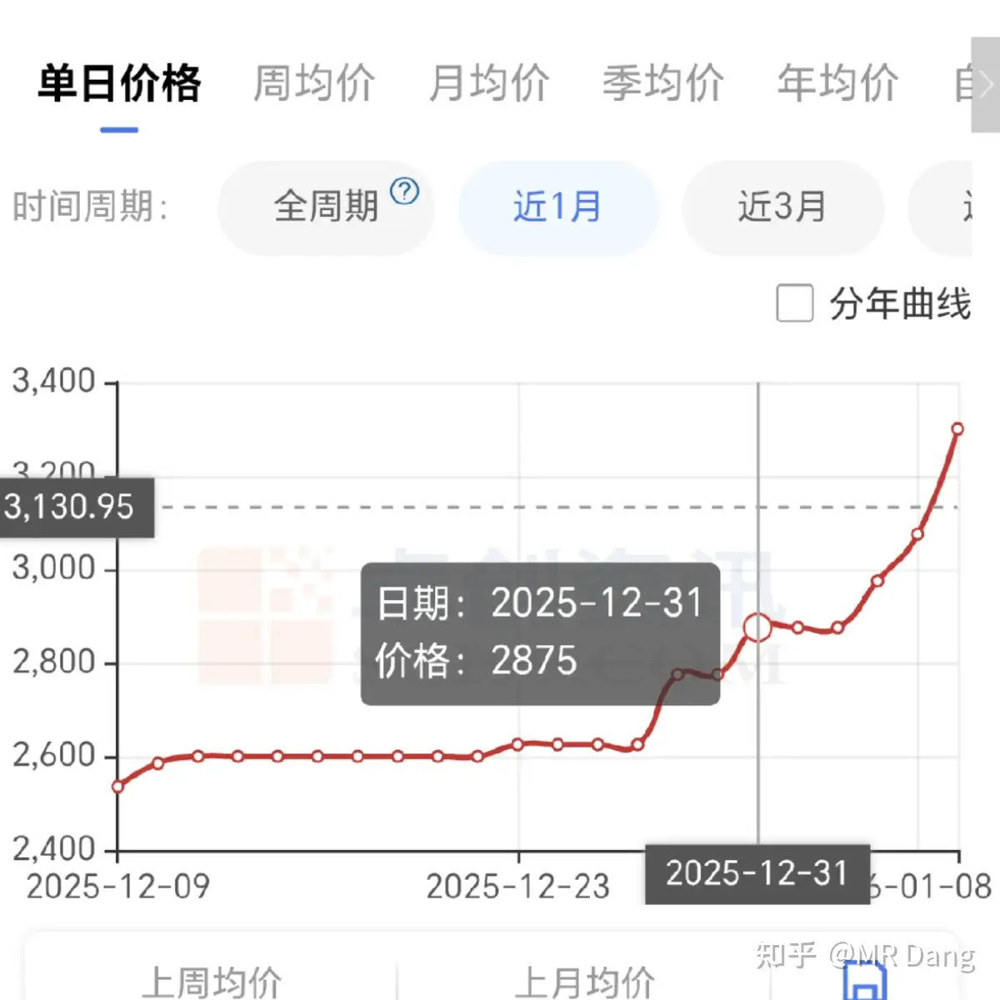

一说要市场化出清，多晶硅期货直接跪了。

所谓市场化出清，就是既分高低，也决生死。

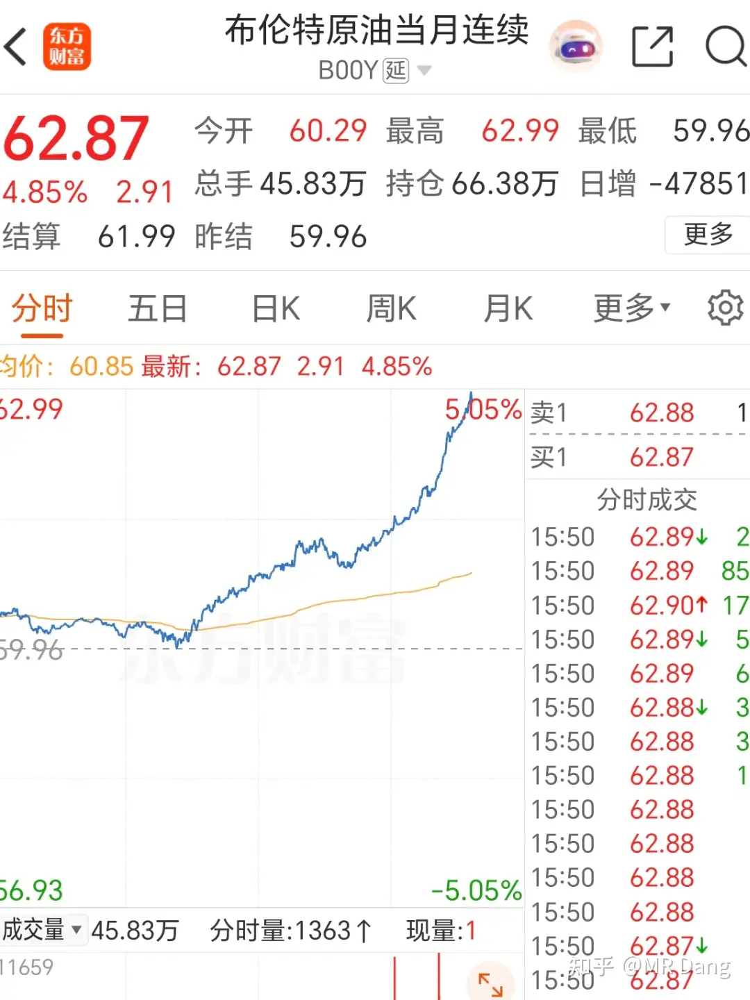

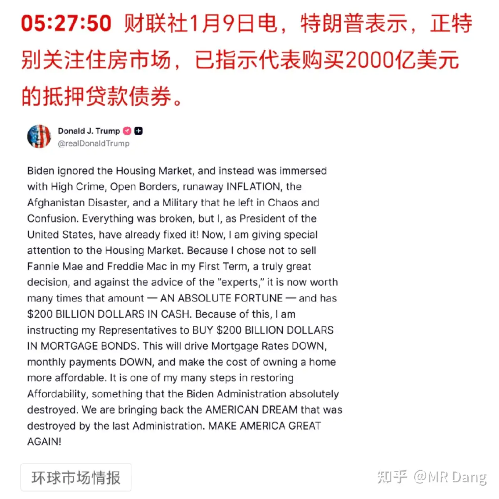

倒是便宜了末日期权的投资者，一天赚了110100%，折合1101倍。

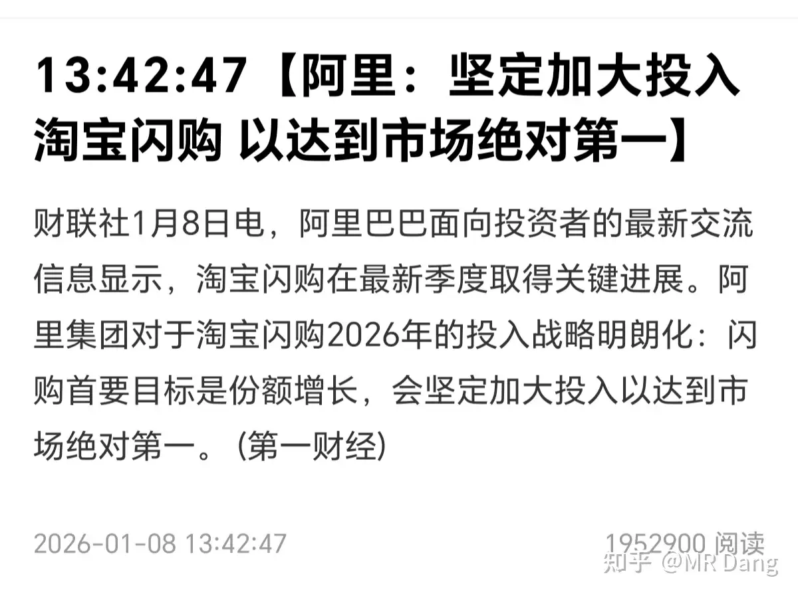

所以咯，市场从来不缺机会，暴富神话哪里都有。

认知跟不上，知识储备不够，就算机会摆在眼前也只会白白错过。

多晶硅是光伏的原材料，多晶硅跌了理论上利好光伏。

为什么说理论上？因为光伏现在太卷了，成本跌了，报价就会往下走。

光伏现在的产能，地球已经消化不了了，要上天。

字面意义上的上天。

国产戴森球游戏应该有不少人玩过吧，大概就是那个意思，太空光伏。

也只有宇宙才能消化东大的产能了。

对于光伏产业链，普通的投资者最好不要参与内卷严重的行业，聪明的玩家不打逆风局。

就算买也不能梭哈一个技术路线，这话我说过很多次了。

昨天提到的铟，涨了十个点左右，昨天市场唯一大幅上涨的金属：

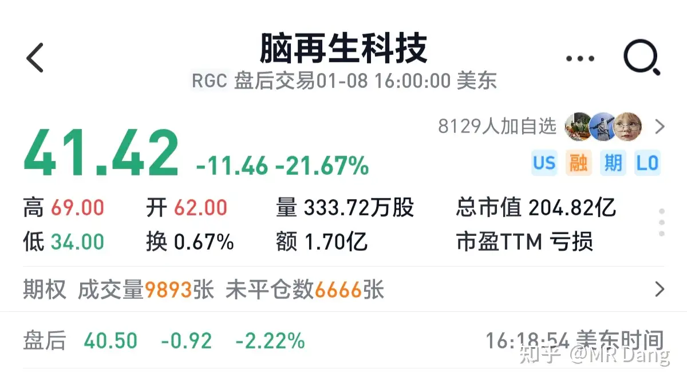

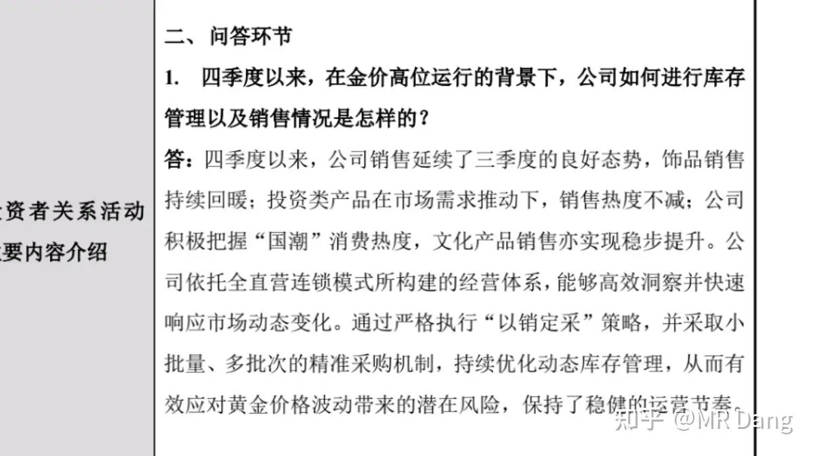

市场价一个月就涨了800/公斤，折合80万/吨。

锡王的年产量一百多吨，算下来全年能增加毛利一个亿左右，净利润七八千万。

铟有个好处，规模小，没期货，锡王那帮饭桶管理层不会没事干去做什么期货对冲，价格上涨的部分除了税，就是纯利润。

锡就不一样了，管理层喜欢做套保，画蛇添足，多此一举。

至于为什么这么做，在tz内呆过的应该都知道，不做套保，万一有损失管理层得担责。

但是做了套保，哪怕再怎么损失，只要程序没问题，管理层就没任何问题，股东的谴责对他来说没任何影响。

说来说去，管理层考虑的是怎么样把自己摘出去，而不是利润最大化，这是通病，不能指望每个管理层都像以前的铜王一样有远见能抗事。

海贼王大统领在公海海域扣了几艘"幽灵船"。

所谓幽灵船，就是偷偷摸摸帮委内瑞拉运石油的船。

这些船通常被认为是大毛家的，但是不悬挂国旗。

还是老样子，不讨论立场，只说影响。

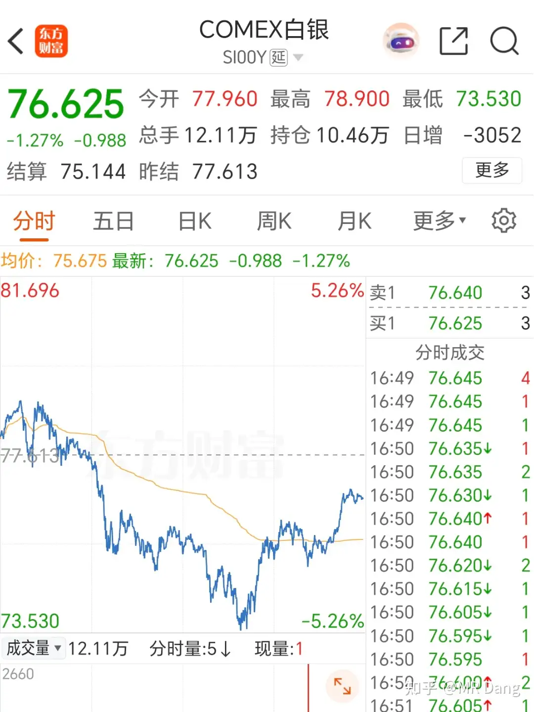

影响如图：

叠加神油合并的消息，今天油气股有的看的了。

懂王表示西大的房地产市场太贵了，房地产脱离了实际使用的价值，很多资金都在炒作房价，年轻人买房太难了，并把这口黑锅丢在了拜登头上。

不是，这个难道是西大版本的。。。房。。住。。不。。。炒？？？？

我一定是没睡醒，等我冷水洗把脸先。

某半导体大股东减持：

套现区区40亿，是看不起我们基民，半导体etf股民的实力么？

以后这种情况越来越多，因为基金和etf的规模，会把这种伤害均匀的分摊到每个人身上，相对来说每个人的痛感就没那么强烈了。

我们的征途是星辰大海，大股东你能不能别跑那么快？

蓝马甲继续卷：

比较出人意料的表态，把黄马甲股票又干崩了。

美股的脑机接口妖股脑再生开始回调了，A股炒概念的投资者注意风险吧。

万一套住了不说百年大套吧，套个几年那是轻轻松松，不开玩笑，现在这个位置真的风险大于收益了，特别是那些不正宗的标的。

昨天盘后，我持仓的金店发了个公告：

听话里的意思，四季度业绩不错，饰品销售应该比三季度好，投资类产品更不用看了，统计局数据更能说明问题。

紫菜组合最近回调了一些，再涨我真的要拿不住了，铜王40或者金店19我会考虑清仓紫菜组合，提前吱一声。

今天bcom要展开年度再平衡，白银仓位比例从9.6%降低到3.94%，很多被动追踪该指数的基金将会抛售白银。

受此影响，银价下跌。

但是这种情况下也不要轻易去猜测白银是否见顶，因为白银的工业需求是真实存在的。

这种属于短期影响，不要去强势品种上做空，赌那个唯一的拐点，会出大事的。

其他有色品种互有涨跌，波动不大。

最近的指数越来越稳了，关键时刻不能掉链子啊，咳咳。

我的锡王磷王铜王铝王都开始高位回调了，有的投资者手痒的很，一直想问能不能买。

就用磷王举例吧，我30块多一点儿二次建仓的，现在这个价比我的成本高不少，我如果给你说你去买吧，它不贵，有分红，就有点瓜田李下的感觉，总感觉哪里不对劲。

过几天到我止盈线了，我跑路了，万一有些人没来得及止盈，后面又套住了，指不定说些什么话呢。

所以，我的顾虑你们应该能理解，而且这个价位确实不便宜，风险不小的，如果有人想参与，那你象征性的买个一两手打个底仓，后面涨了也算赚了个奶茶钱，如果跌的多了，再考虑一下是否上仓位。

唯有一个例外，就是铝王平替，这个我手里没有，所以心理负担没那么大。

这股从基本面上来说，是铝王最优质的一块资产，盈利能力极强，是全球铝的天花板。毛利率能干到25%上面，云铝这种才15%，差很多。

从商业模式来说，电走低，铝走高，这两个都是大趋势，电解铝是非常好的生意，我说过很多次了。

从预期来说，它还有产能置换，目前业绩不算明朗，但是能让人觉得模糊的正确。

从大宗商品的角度，铝目前没涨多少，这里面也是有空间的。

缺点就是前期涨幅巨大，所以想参与顺周期的投资者，不妨可以等回调阶梯建仓，比如开始买1%的仓位，然后每跌一块钱就加1%仓位这样，还是比较安全的。

最怕的就是回调一点点就梭哈的投资者，我是真的怕，大家一定要把仓位管理重视起来，不要养成all in的习惯，不管什么股。

哦对了，昨天我把存储基金止盈了，当时就发帖了，怕有些人没看到，再说一次。

运气比较好，标标准准的30%收益，有点侥幸。

依然看好存储的基本面，但是衡量风险和收益后决定不参与了。

这部分钱连本带利都进银行了，最近银行回调，我个人觉得性价比很高，股息率都快6个点了。

一个喜欢保护韭菜的博主，希望大家少少踩坑，多多赚钱！

---

> [!comment]- 点击展开评论
> | 用户 | 时间 | 内容 |
> | :--- | :--- | :--- |
> | 千寻 |  | 每次看，都觉得自己是个学渣，只懂浅显的，其他的靠评论和ai |
> | &nbsp;&nbsp;&nbsp;&nbsp;MR Dang |  | 慢慢来 |
> | 往往雪饼 |  | 大佬早。一到办公室立马先开知乎进行学习，领导问我在干嘛我让他滚开别耽误我赚钱，我做的对吗 |
> | 乌获 |  | 1月9日A股行情1.中石化重组-"从炼厂到机翼"的全链条一体化中石化-国内第一大航油生产商中航油-亚洲最大的航油服务保障企业（新加坡上市）重塑航油产业链-关键看重组后的整合成效·终端-加注 减少中间环节 降低供应成本·提升航油产业整体国际竞争力·技术➕网络 加速可持续航空燃料的研发&商业化·抓住航空燃料的长期需求增长，保障核心产品的销售渠道绝对畅通。预计"十五五"期间需求年均增长约4%，2040年消费量可达7500万吨。我生产（中石化产能）➕我加注（中航油渠道）：更稳定的利润、更强的市场话语权&抗风险能力具体重组以何形式开展 关注上市公司公告（中国石化旗下有9家上市公司：中国石化-核心主体、石化油服-工程技术服务、中石化炼化工程-炼化工程设计建设、上海石化-炼油化工一体化、石化机械-装备制造、中石化冠德-仓储物流、泰山石油-成品油销售、岳阳兴长-精细化工、四川美丰-化肥化工）重组对航空燃油价格的长期影响：·从源头降低燃油成本 利于缓解航空公司成本压力·合体后的巨无霸在国际油品采购手机，议价能力显著增强，有助于平抑国际油价波动带来的冲击，提升国内供应稳定性（相对的下游议价能力削弱）。·SAF便宜之前 航空公司成本还是贵 甚至因为强制使用 成本更贵则航空燃油价格的曲线应该是低-高-低·综合定价：合体后的巨无霸、国际油价？国家政策、下有航空公司整合度SAF（可持续航空燃料）：用可再生资源或废弃物（废弃食用油、农林废弃物秸秆木屑、城市垃圾、工业废气、二氧化碳、非食用植物油等）生产的、能够显著减少碳排放的航空燃料-"绿色燃油"。无需改造现有发动机与设施。目前因为原料有限&太贵，应用率不高。正因如此，中石化与中航油的重组才极具战略意义，打通生产-使用全链条，有望加速SAF在中国的规模化生产&商业化应用。目前全球主要经济体已设定强制混掺目标，国际航协目标是到2025年实现航空业净零排放。而全球航油年需求约3亿吨，目前SAF占比不足1%，市场需求存在巨大增量空间。目前我国SAF生产已经具备利润空间（利润4000元➕/吨）。现在的瓶颈：价格贵；原料限制产能（25年产量预测下调至190万吨）；强制政策制造刚需但产能低反而推高价格而政策试图用行政手段创造市场时若没有同步建立起保障原料供应、鼓励技术创新、公平分配成本的完整生态，反而容易扭曲价格信号，导致市场暂时失灵（合体也是突破这个问题的举措）；区域性结构问题（亚太地区新建产能集中但应用率较低，短期内恐有产能过剩风险，而欧美市场更为成熟，强制政策先行确保稳定需求量，但本地供应不足需要进口）。＊那么产业投资可能面临短期市场波动，要建立全球供应链中的先发优势&出口竞争力，同时为本地未来强制性政策的实施储备充足的产能&技术经验。我自己的持仓中有一些石油股，中石化也在列，委内瑞拉事件之后清掉了部分盈利的，也包括中石化。我清仓后中石化价格下跌，在当时看来卖出是ok的，但是昨天发布了重组消息。再一次切实的感受到市场变换瞬息万变波谲云诡啊！并不后悔当时清仓，但也觉得中石化是个值得入手的好标的。2.光伏：市场不缺机会 暴富哪里都有聪明的玩家不打逆风局我感觉自己越来越不企图暴富了在认知范围内赚钱 并努力提高自己的认知3.锡王管理层喜欢做套保套保：套期保值意识就是害怕未来产品价格下跌提前约定一个销售价格。但是如果产品处于明显的上涨周期中，这个约定的免责价格就等于为了免责而少赚钱，伤害了股东的利益。唔～一言难尽4.油价又涨咯还好我只清仓了部分石油股 还留有后手没有太冲动行事值得表扬～5.蓝马甲继续卷这个不知道跟摩根士丹利下调阿里巴巴股价有没有关系6.紫菜组合清仓预告zjky 40cbgf 197. 今天bcom要展开年度再平衡，白银仓位比例从9.6%降低到3.94%，很多被动追踪该指数的基金将会抛售白银。bcom（彭博大宗商品指数）：许多大型投资机构、养老基金和公共基金如果想投资大宗商品这个资产类别，往往会选择投资于追踪bcom指数的基金，而不是自己去买卖各种期货。因此该指数的任何调整都会引发巨大的资金流动。年度再平衡：指数运行核心规则每年1月初，bcom根据预设的规则&最新的市场数据，对指数中各种商品的权重比例进行一次全面的审查&调整。调整依据主要是该商品的全球产量&市场流动性（交易额）等。曾在上年度产量大增or交易额暴涨的商品，在指数中的权重可能会被调高。bcom下调了白银的比例，意味着所有被动复制bcom指数的基金，为了让自己持有的资产比例与指数的新比例完全一致，必须在短时间内卖出大量的白银期货合约，以达到降低白银仓位的目标。短期会导致白银价格承压下跌，且其他市场参与者在预判这一抛售而提前行动或者趁机低位接盘，会放大价格波动。长期来看，这一抛售并非看空白银的基本面，而是规则驱动的强制性的调仓行为，一旦再平衡调整完成，白银价格最终会回到由自身供需基本面、宏观经济、货币政策等因素决定的轨道上。这就是老师说的"不要盲目做空白银"8.铝王平替-值得买但是要控制仓位循序渐进老师喂到嘴里的今日份早餐一如既往的营养又丰盛早上好 嘿嘿 |
> | &nbsp;&nbsp;&nbsp;&nbsp;MR Dang |  | 有一点有问题，对航空公司来说，一个垄断的上游企业并不是一个好的议价对手，巨无霸合并可不是来做慈善的 |
> | 我是叶大侠 |  | 中国神车，当年停止上涨。源于那个用杠杆配资200万，然后跳楼的。好像是杭州的。2015年那一波。场外配资，制造了无数时代富豪。也制造了N个跳楼的。我当时5月份，三周就赚了一个A6。然后，以买个科鲁兹。。。。 |
> | &nbsp;&nbsp;&nbsp;&nbsp;MR Dang |  | 就算不出事也不可能涨到天上去啊，说到底还是估值太离谱了 |
> | 我是叶大侠 |  | 2015年的那一波。东方财富。同花顺。大智慧。神车。当然。还有为梦想窒息的。乐视。时间点不一样啊。。那会论上天。神车也就是个溜达鸡。哈哈 |
> | 哈啰 |  | 随老师学习这段时间，买了银行，国光，磷王，锡王，低价铝，胆子小，除了银行都只买一手两手的，金属这几个都有盈利了，银行和国光暂时亏了一点，但波动不大，心态很平稳。考虑我买的不是最低点，也很难卖到最高点，打算20%利润就卖掉。感恩遇见老师，初入股市就赚了钱，虽然不多，但仓位控制，加仓方法，价值投资的方法，受益匪浅，还有评论区的朋友们，很多不明白的地方，在评论区也会得到解答，感谢 |
> | &nbsp;&nbsp;&nbsp;&nbsp;MR Dang |  | 厉害了 |
> | 慎独 |  | 别追不懂的热股，因为等你知道的时候多半是需要你来接盘了；别接下跌的飞刀，你以为是底结果是马里亚纳海沟；别买整个商业模式处于下行期的行业，很可能会迎来戴维斯双杀，越跌估值越高。 |
> | Poov1995 |  | 很多热股的商业模式完全看不懂，我们这种普通人投机只能靠认知，靠技术压根没用，主力筹码在手完全看心情。 |
> | 温酒酒不是温洒洒 |  | 十月底接的赛力斯，直接亏了我账户好几个月的收益 |
> | 宗介 |  | 大佬的饭，喂的很细，一直默默点赞，默默抄作业，默默学习 |
> | 小皮 |  | 一、今日核心消息速览1. 石化重组：中石化与中国航油重组获批，利好油气但警惕"中国神车"式套人走势 。2. 光伏监管：市监局约谈6家光伏龙头，多晶硅大跌、末日期权暴涨，行业产能过剩，规避内卷 。3. 稀有金属：铟价一月涨80万/吨，无期货、无套保，收益直兑净利，相关企业盈利弹性大 。4. 能源：扣查委内瑞拉"幽灵油船"，布伦特原油涨4.85%，油气股有交易机会 。5. 半导体减持：中微公司大股东拟减持2%（套现约40亿），基金/ETF分摊冲击，减持或成常态 。6. 指数调仓：BCOM再平衡，白银仓位从9.6%降至3.94%，被动抛售致COMEX白银跌1.27%。7. 资金流向：存储基金止盈（30%收益），转向高股息银行（股息率近6%）。二、可买标的（低风险优先，分批建仓）- 银行板块：估值低、股息率近6%，止盈资金首选，回调后性价比高，适合风险厌恶者。- 油气股：原油涨价+石化重组，关注有基本面支撑的龙头，逢低轻仓，不追高 。- 小金属（铟相关）：铟价上涨无套保对冲，收益直兑净利，优选有资源储备的企业，轻仓打底 。- 黄金消费：金店四季度销售回暖，"以销定采+小批量多批次"对冲金价波动，设止盈线（如19元），不追高。- 铝业优质标的：毛利率超25%（高于云铝15%），铝价涨、电价跌，有产能置换预期，每跌1元加仓1%。三、不可买标的（规避风险，坚决不碰）- 光伏高位股：监管约谈+产能过剩，多晶硅大跌，末日期权暴涨属极端行情，普通投资者勿参与 。- 重组题材半路跟风：以"中国神车"为鉴，重组利好后短期暴涨易套人，不追高接盘 。- 高位纯题材股：如脑机接口、连板妖股，美股同类股大跌，A股回调风险大，换手率超15%且无业绩支撑的坚决回避 。- 半导体减持标的：中微公司大股东减持，短期抛压大，不盲目抄底，等减持落地后再看 。- 白银短期做空：指数调仓属短期冲击，工业需求有支撑，不猜顶做空，警惕逼空风险。四、操作与风控注意事项1. 仓位管理：维持5-6成，预留现金，4100点上方不盲目加仓，跌破4070点减至4成以下。2. 建仓策略：采用"阶梯建仓"，如铝业优质标的每跌1元加仓1%；小金属轻仓打底，跌后再加仓。3. 止盈止损：黄金设19元清仓线，磷王等有色龙头临近止盈线离场，存储基金止盈（30%收益）不贪多。4. 规避陷阱：不追高换手率超15%的题材股，不碰无业绩支撑的ST股和小盘股，远离高杠杆操作。5. 海外联动：关注美国房地产政策、国际原油供给，警惕外部冲击传导至A股 。五、核心策略总结- 低风险偏好：优先银行、黄金消费、高股息铝业标的，分批建仓，严格止盈止损。- 中等风险偏好：轻仓布局油气、铟相关小金属，不追高，设回调加仓点。- 风险规避：远离光伏高位、重组跟风、纯题材股，控制仓位，不碰高杠杆。 |
> | 念头通达 |  | 课代表呢都多久了，还不出来 |
> | 淮南 |  | 中石化上海石化泰山石油各买了点，都挂山顶上了，看来投机果然不适合我，纯当交学费了 |

---

*本文件由自动脚本从MR Dang知乎页面提取生成*

---

**作者**: MR Dang
**链接**: https://www.zhihu.com/question/1991894215207191968/answer/1992855205113529675
**来源**: 知乎

*著作权归作者所有。商业转载请联系作者获得授权，非商业转载请注明出处。*

---

## 相关阅读

**📅 每日行情评价（相邻日期）：**
- [[20260108-如何评价2026年1月8日A股行情？]] - 1月8日行情回顾
- [[20260112-如何看待2026年1月12日A股行情？]] - 1月12日行情分析

**📚 相关主题：**
- [[20251008-黄金涨的这么疯狂，是代表了纸币飞速贬值还是已经商品化了？]] - 贵金属投资逻辑
- [[20251106-怎么投资银行股，并获取银行股股息收入？]] - 银行股投资方法
- [[20251015-什么是煤化工？有哪些好的a股投资机会？为什么？]] - 化工产业链分析

**💡 投资方法教育：**
- [[20251020-交易策略只是第一步，重要的是仓位管理？如何科学设置仓位？]] - 仓位管理的重要性
- [[20251016-投资新手避坑指南之追热点(万粉特别奉献)]] - 追热点避坑指南
- [[20251031-你是怎么计算股息率的？ 关注股息率的哪些点？]] - 股息率计算方法

**📖 系列文章：**
- [[韭菜保护合集]] - 投资避坑指南
- [[投资方法教育]] - 投资方法系列