# 如何看待2026年1月12日A股行情？

---

**发布时间**: 2026-01-12 07:14  |  **原文链接**: https://www.zhihu.com/question/1992744653557088711/answer/1993943881348322661  |  **点赞数**: 1018 人赞同

**作者信息**: MR Dang​独立投资人，不接广不卖课

---

## 正文内容

新的一周又开始了。

大家的情绪都很亢奋，但是还是得把周末的消息过一遍。

宏观层面：

统计局发布了12月的CPI，同比增长0.8%，比较乐观的一个数据。

这个乐观不是我硬给数据贴金，确实可以的，发布前一天还有读者问过：

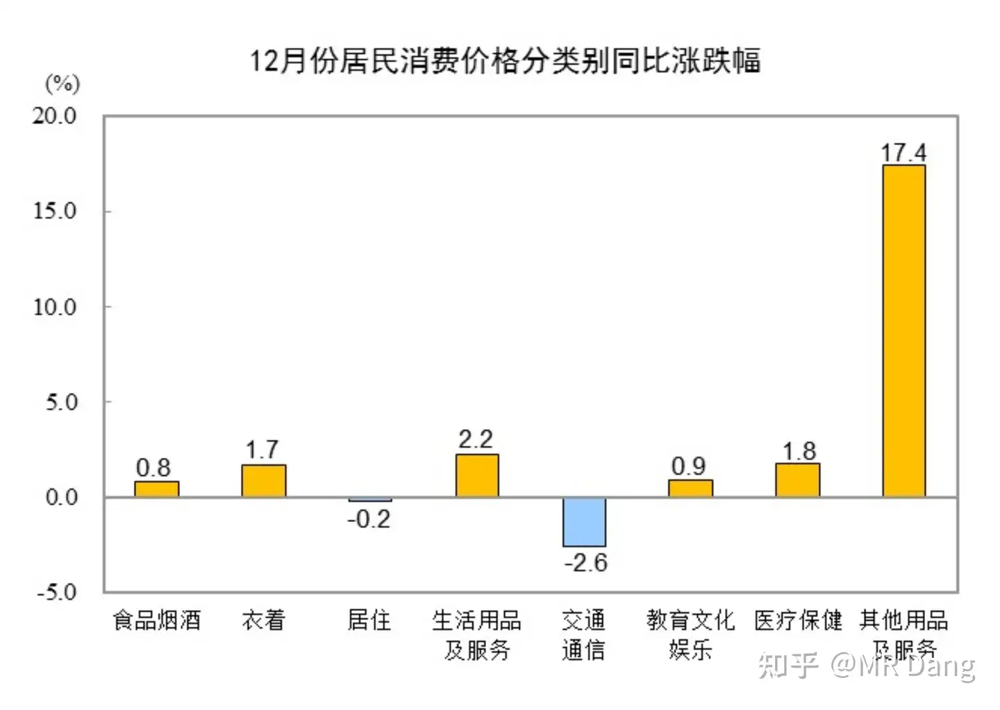

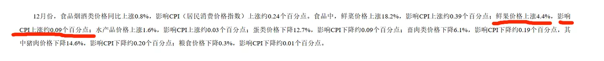

至于原因的话，有一个很显眼的数字：

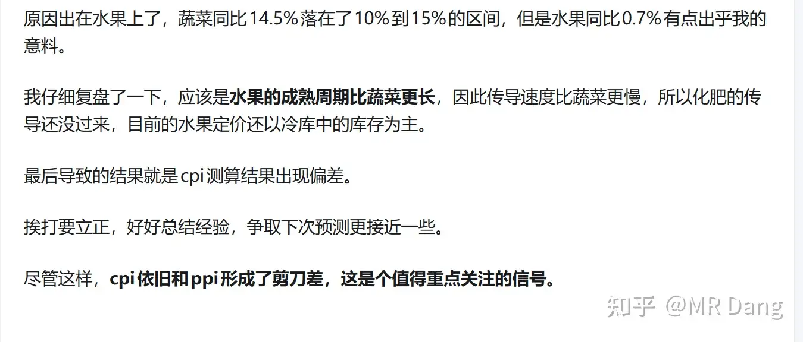

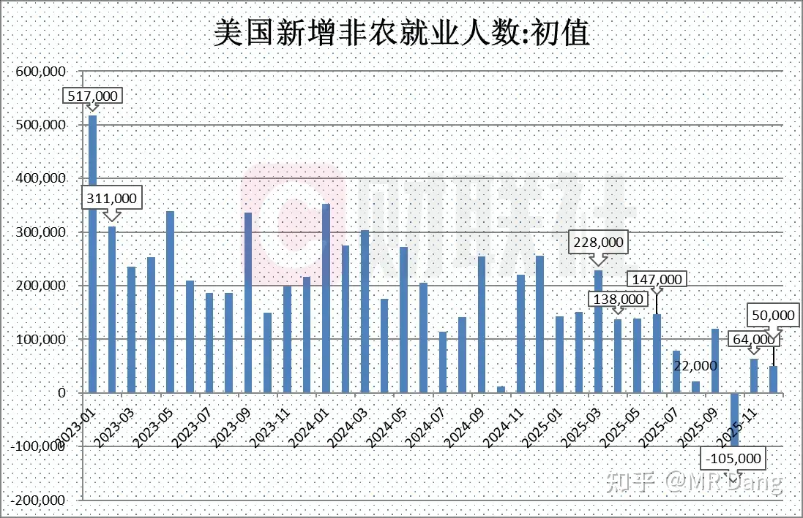

“其他用品及服务”，同比增长17.4%。

至于什么是其他用品及服务，想必大家已经猜的八九不离十了，包含珠宝首饰，丧葬用品，手表箱包什么的，所以是哪个涨了这么多，不言而喻。

在重要品类上，水果终于发力了，同比4.4%，超过上个月的0.7%。

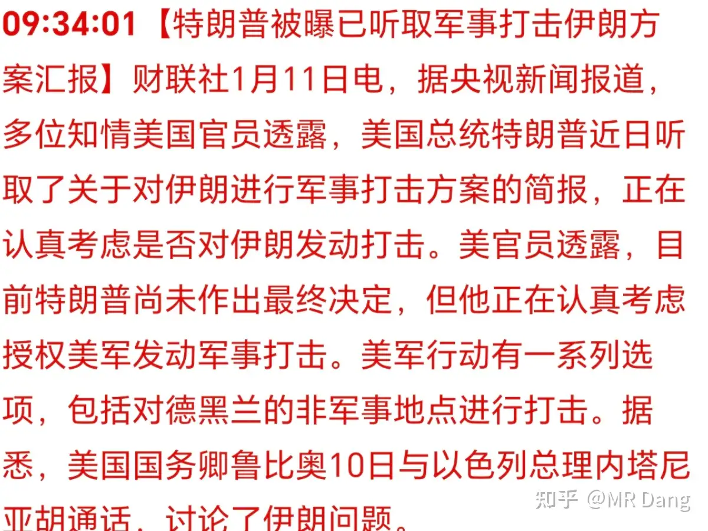

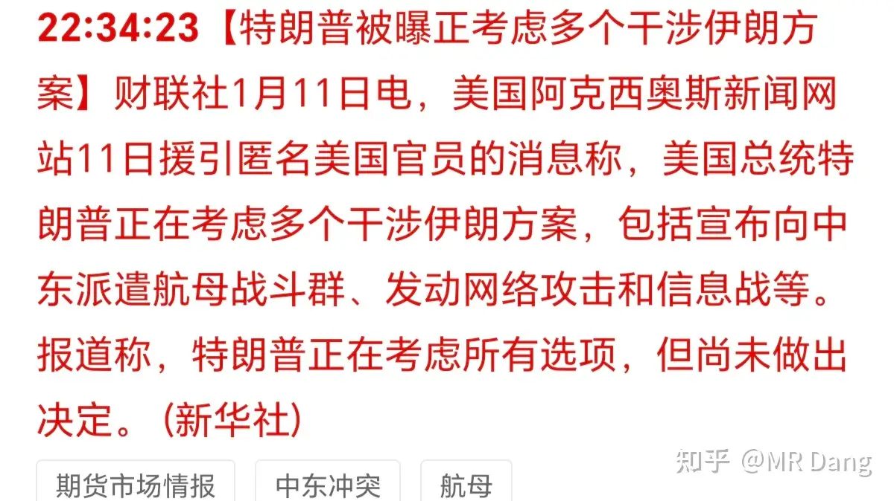

我上个月做CPI预测的时候，水果这部分和蔬菜不同步，有滞后性，当时也解释了原因：

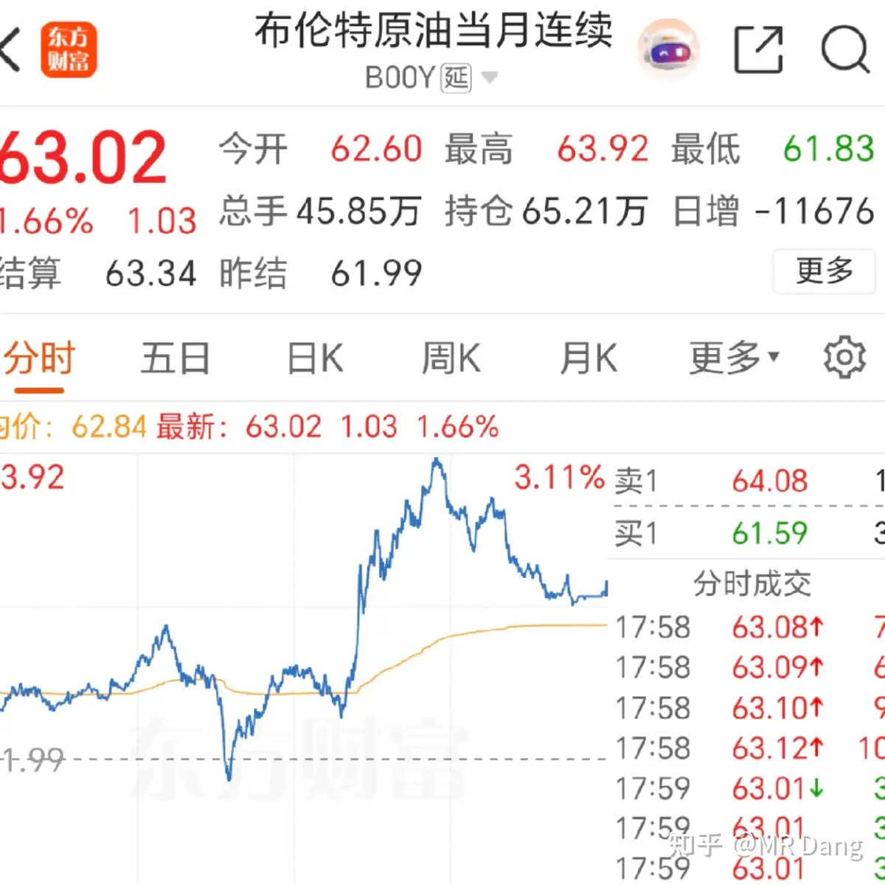

现在看来，化肥端已经开始慢慢向水果传递了，可能春节前后的CPI会因此更加乐观些。

西大发布的非农经济数据不理想：

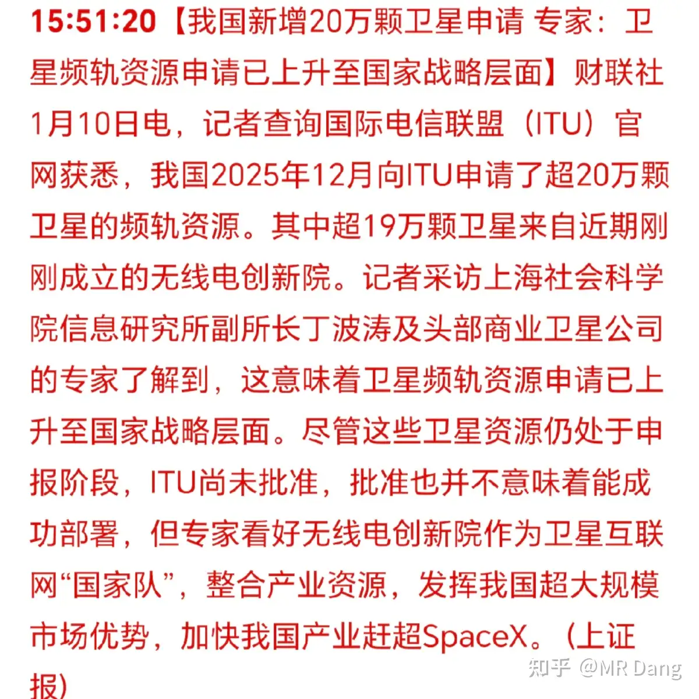

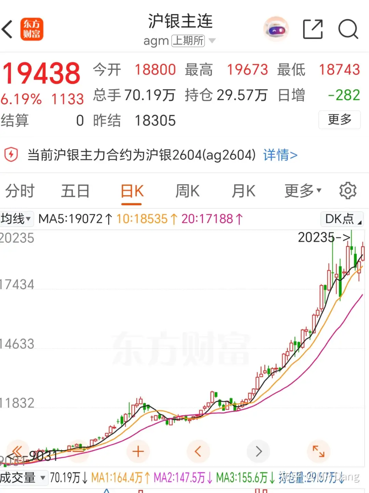

尽管数据一般，但是并不影响降息预期，目前市场一致性预期一月份降息概率几乎为0，还是要等新的美联储掌门人尘埃落地。

懂王威胁对波斯以及墨西哥动手：

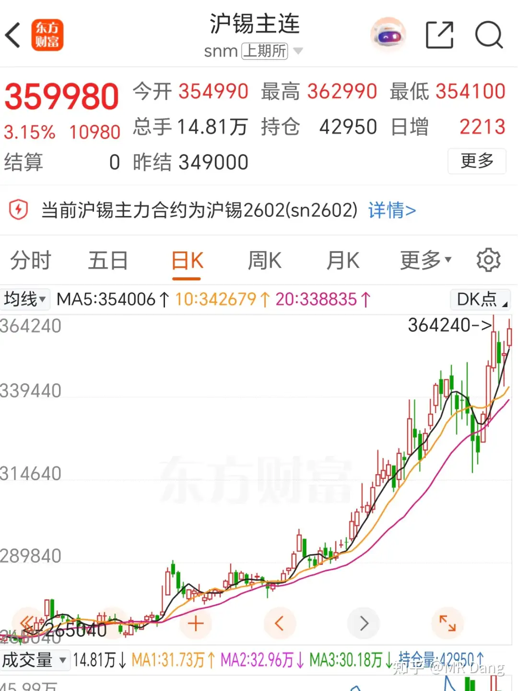

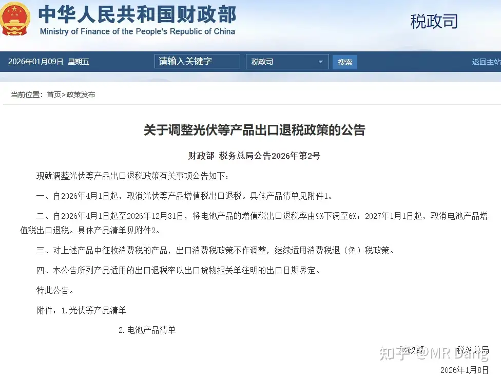

后续又有进一步消息：

波斯的特产是石油，老墨的特产是卖树叶的富翁。

以懂王无利不起早的性格，还是有可能的，不过他可不想要一群裹着头巾饿着肚子的难民，只是为了oil。

到时候估计还是代理人收拾烂摊子。

至于oil，见面分一半。

对老墨也是，打击树叶是假，搜刮树叶卖家才是真的。

石油在上周五又涨了点：

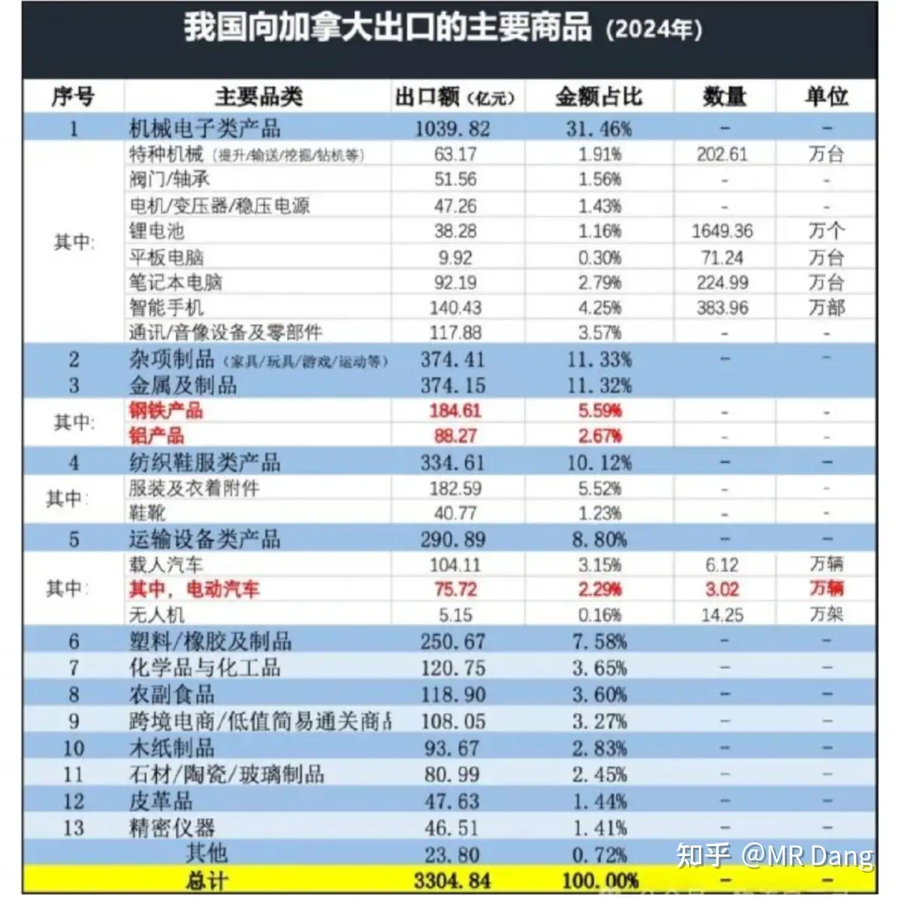

以目前的紧张态势和油价位置，我个人对油价是短期偏乐观，长期偏谨慎的。

油价在大宗商品里是最难预测的，受个人影响最大。

东大的能源安全问题值得关注，来者不善呐，最廉价的石油供应端都不太平。

行业动态：

存储涨价蔓延到电子产品，前两天我还在提醒大家有换电子产品打算的，不妨现在就换。

投资标的上A股没有特别合适的，倒是有个中韩半导体etf，大概两边各一半，勉强凑合。

或者我已经止盈过一次的香港存储基金，适合短期投机，不适合长期持有，自身磨损大。

我国新增20万颗卫星申请：

这个数量足够震憾，老马现在一年也就发射三四千颗，申请的数量大概是四五万颗。

但是申请≠要发射，这有点像抢注域名一样，管他用不用，先抢注了再说。

对我有吸引力的商业航天标的还是蓝箭这样的东西，现在很多蹭概念的商航概念股已经估值很高了，而且热度有点溢出。

啥叫热度溢出呢，就比如我昨天去海底捞，和看台服务员攀谈的时候得知她和她的同事已经开好户了，就等着冲进商业航天发财了，用她的话说，就是人类之光，千年大计，弯腰捡钱，闭眼挣钱。

白银在上周五收盘后暴涨6个点：

锡涨了三个点：

其他金铜铝铂等主要有色金属也都涨了一两个点。

还是那句话，可以不买，不要做空，太危险了。

今天的有色资源类可能会有表现，资源类在2026整年的表现都值得期待。

光伏和电池退补取消：

这个问的人还挺多的。

其实大方向上很简单，如果有人认为这个对行业是利好，那么你就得承认补贴是利空。

总不能补贴是利好，退补也是利好，只要买了股票，干啥都是利好。

---

## 精选评论

| 用户 | 时间 | 内容 |
| :--- | :--- | :--- |
| 小M会守约 |  | 这十六连阳和成交量太恐怖了，感觉就是要把老乡骗进来割的，风险控制我都想逐步出了，等回调 |
| &nbsp;&nbsp;&nbsp;&nbsp;MR Dang |  | 够谨慎 |
| 万小倍 |  | Dang大，答应我永远不要停更啊，新人已经习惯每天早上来看一眼 |
| &nbsp;&nbsp;&nbsp;&nbsp;MR Dang |  | 谢谢支持 |
| 哈皮 |  | 没想到现在被套的最劳的是恒科 |
| 张熊好呆萌 |  | 希望大家还是冷静下，特别是补票的，可以补一些春节板块还处在低位的，或者安全垫够高的，安全第一，平安过节。感觉都已经很高了 |
| 往往雪饼 |  | 大佬早，商业航天板块跟火箭一样不停飞天，一直在动摇道心，但我属于半路才信的，不敢碰，听大佬的谨慎点，还是看看乐子吧 |
| 孟孟 |  | 看了老师的文章磷王锡王都是闭眼冲的，短短时间内已经比自己瞎研究持股三个月的涨幅大了 |
| 夏天 |  | 我看了一下抖音号那个“勇闯股市的阿伟”，他确实是全部在老师这里抄的，还说锡王只加仓不止盈（原话） |
| hxsx |  | 老师，早上好。我按着老师你教的思路，学着写了一篇分析文章，想请老师有空帮忙指正一下。 |
| &nbsp;&nbsp;&nbsp;&nbsp;MR Dang |  | 有空了我学习学习 |
| 小透明bingo |  | 果然铝王平替，和老师说的一样，如果是高开，就很危险、和上周的中石化一样。 |
| 西西 |  | dang总 新手时期关注的你 感恩 |
| 木向阳 |  | 真厉害 |

---

*本文件由自动脚本从MR Dang知乎页面提取生成*

---

**作者**: MR Dang
**链接**: https://www.zhihu.com/question/1992744653557088711/answer/1993943881348322661
**来源**: 知乎

*著作权归作者所有。商业转载请联系作者获得授权，非商业转载请注明出处。*
