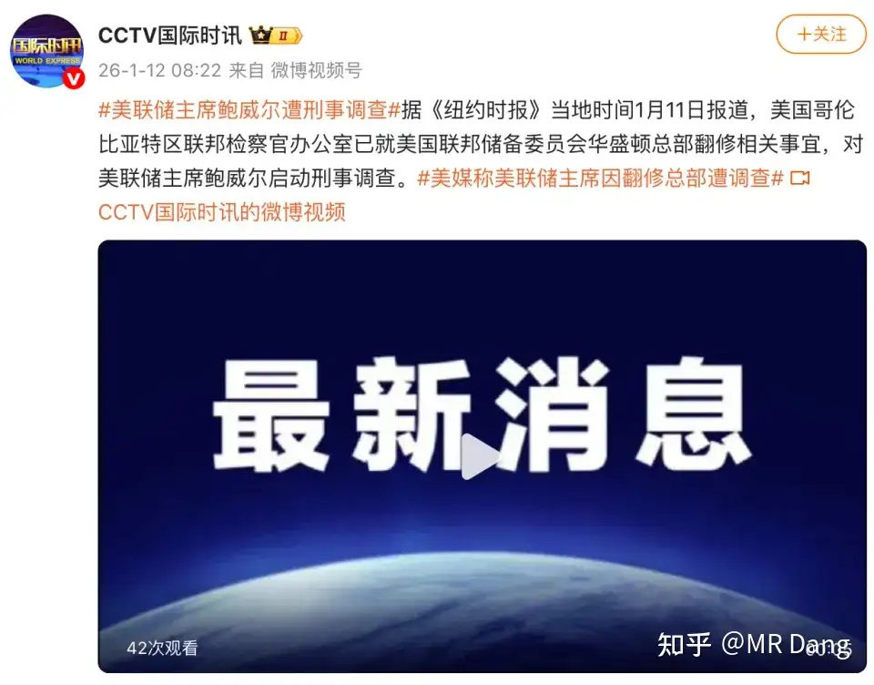
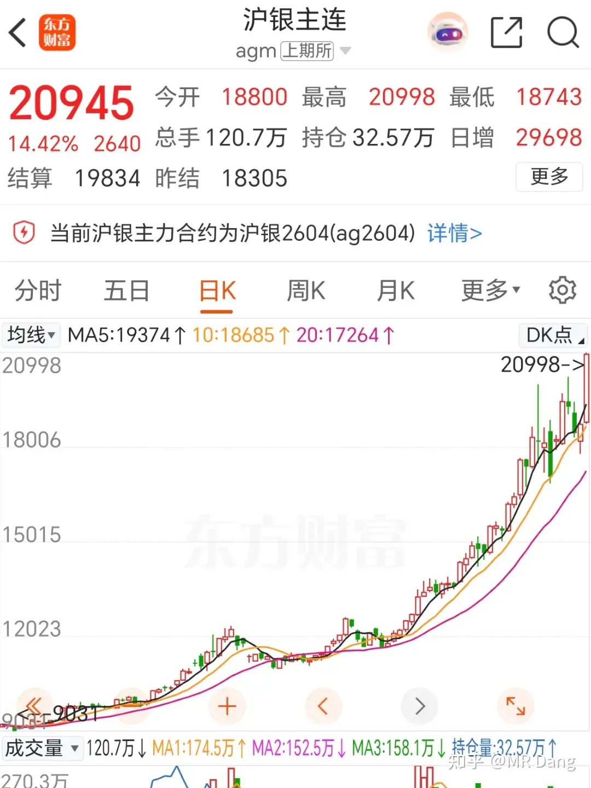
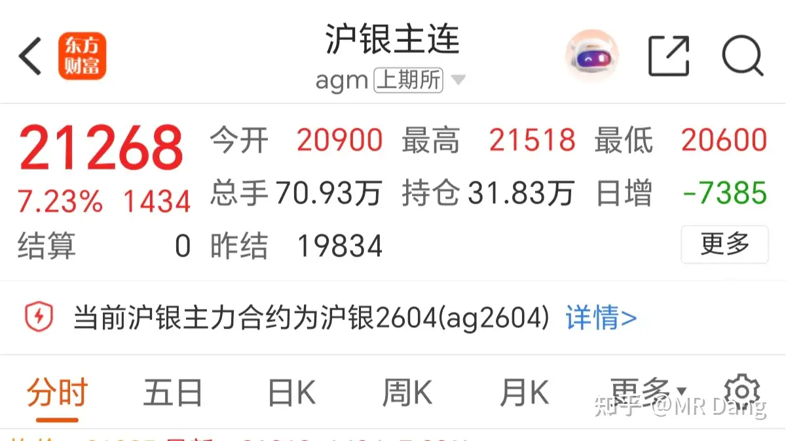
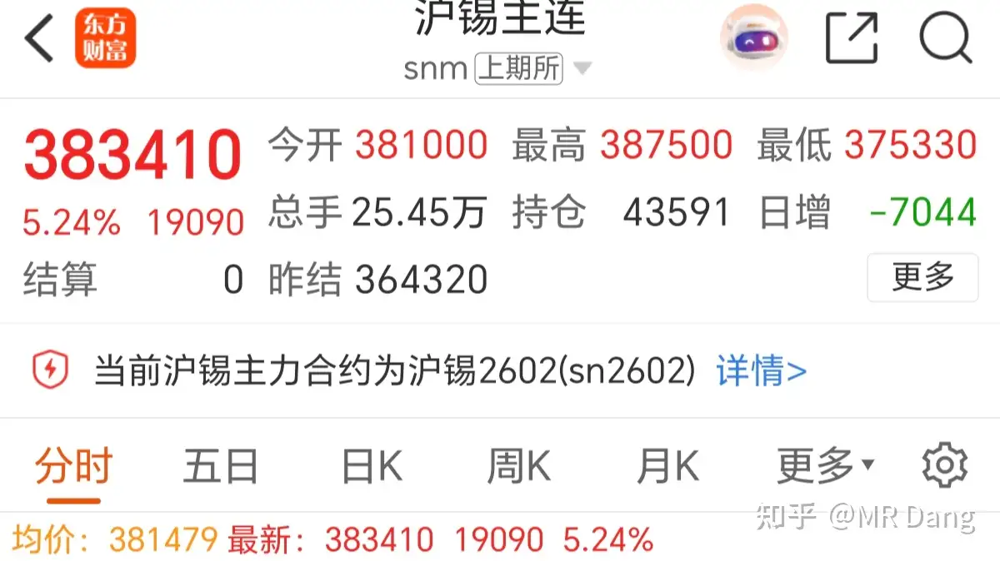
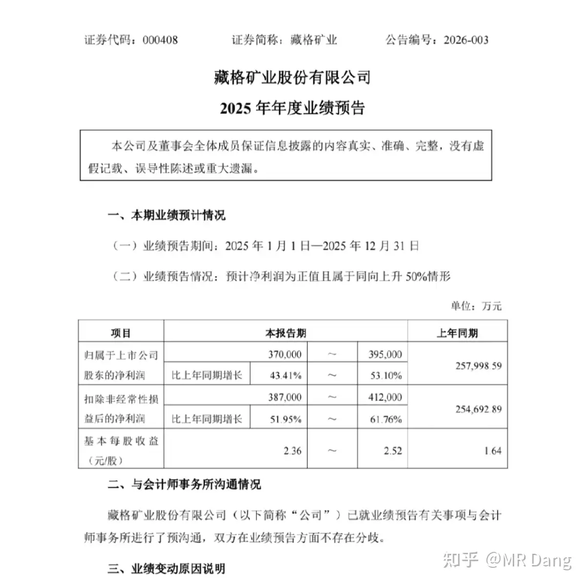
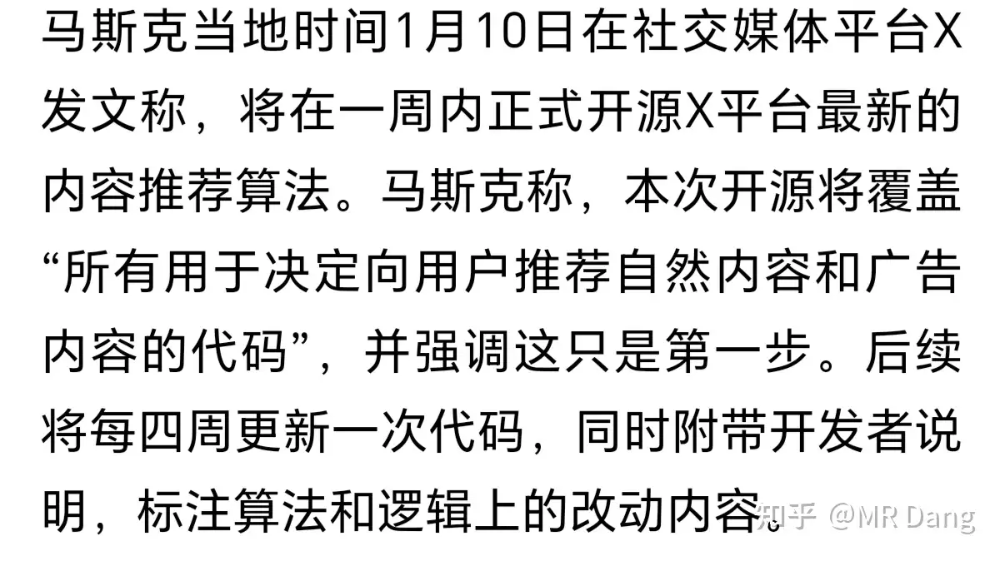
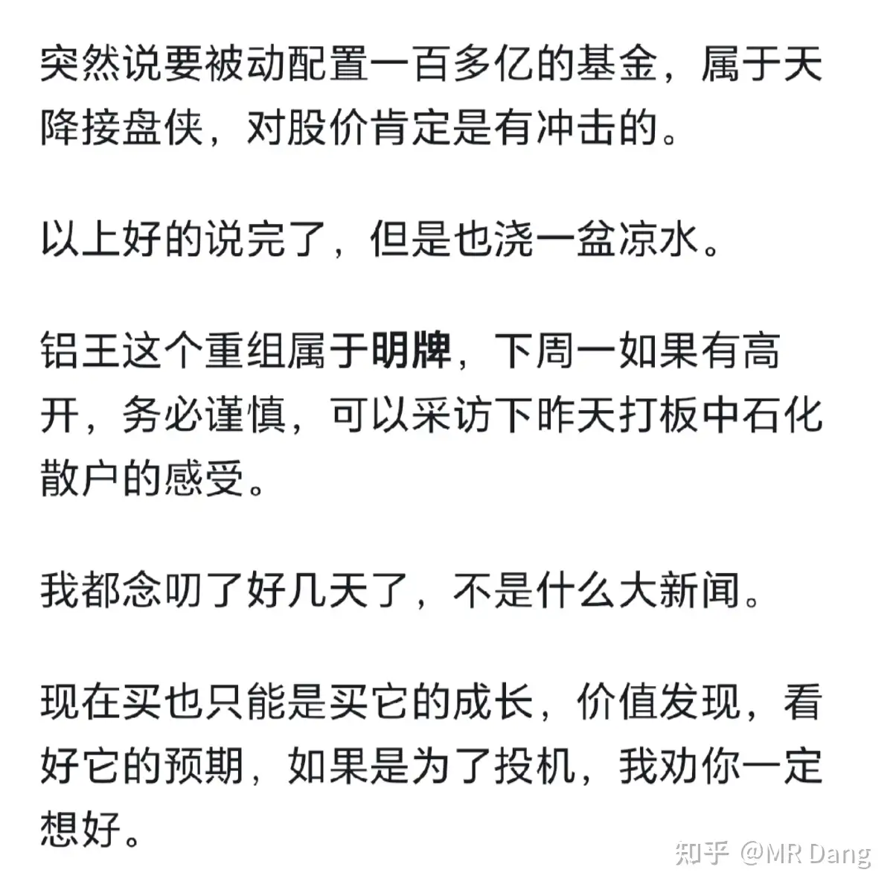
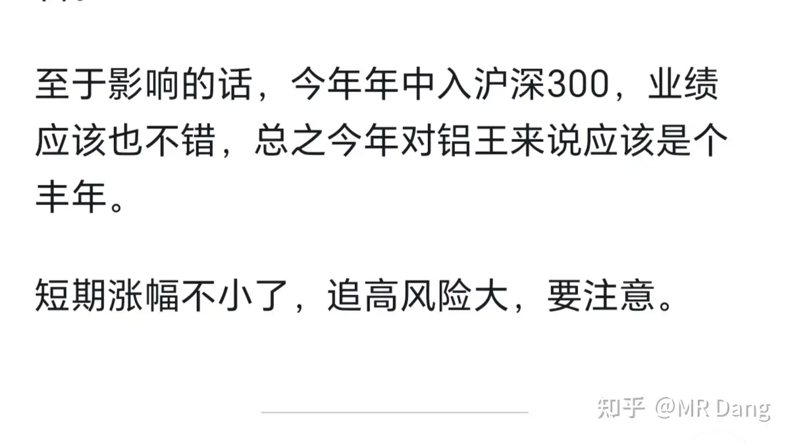

# 如何评价2026年1月13日A股行情？

---

**发布时间**: 2026-01-13 07:12  |  **原文链接**: https://www.zhihu.com/question/1993829198062715519/answer/1994305695571530115  |  **点赞数**: 1087 人赞同

**作者信息**: MR Dang​独立投资人，不接广不卖课

---

## 正文内容

行情放最后说，过一下动态：

头条新闻给到鲍威尔：

鲍威尔要被刑事调查，之前美联储掌门人还被评为世界上含权量最高的职位之一，现在居然落到如此境地。

鲍威尔的回应肯定还是欲加之罪那一套。

这是美联储的独立性受到质疑的标志性事件。

无论结果如何，外界对独立性的怀疑一旦产生，那个裂隙就都很难弥合了。

而美联储独立性一旦变成皇帝的新装，那美元和美债的含金量就会大打折扣，它不会说像股票一样跌了还能涨回去，回不去了。

怀疑的种子一旦种下，就会不断的生根发芽。

所以，美股会出现很多股票虽然看起来价格涨了，但是涨的还没美元贬值的多，成为典型的货币计价幻觉。

当然这里不是针对美股，所有货币超发严重的国家都会发生这种情况。

昨天白银创历史记录，空头血本无归：

这个真的太吓人了，期货都是带杠杆的，有人一夜暴富，有人一夜返贫，上期所已经上了很多措施了，波动不单没减少，还加剧了。

在白天暴涨以后，昨天夜盘的白银又：

同样强势的还有锡：

昨天白天锡期货涨停，夜盘继续上涨：

锡已经站稳了38万，但是我依然认为这个价格在中远期来说，可能不是山顶，也不是半山腰，而是山脚。

长期看好锡的基本面。

碳酸锂涨停，这个昨天盘前说过了，抢出口会推高价格，偷个懒，把昨天的文章拿过来用就行了：

其他金铂铜铝也都有所表现，就不一一盘点了，总之有色很强。

为什么这么强？

其实现在这些硬资产在脱离美元锚后，价值处于重新定价的阶段，在新的锚出现前，为了减少重新定价对资产的损失，就会有资金源源不断的去锚定资源，从而锁定自己的资产。

如果把美元崩塌比做美元的末日，那这些资产就像诺亚方舟，在想登船的人都上船之前，船票会一直涨价。

当然这不是全部的原因，不过肯定是最重要的原因之一。

又一家有色企业发布业绩预告：

这家在去年涨幅不小的，这个业绩让我说的话，和某湖相比，不太够看，估值打的有些高了。

老马宣布X平台开源，带火了a股影视板块。

很多人估计都懵了，这都哪和嘛啊。

简单的说，以前的互联网用户是主动搜索，会用度娘这样的网站。

商业公司为了自己的排名靠前，除了直接给度娘氪金，就得给自己刷数据，假装自己的网站很热闹，这叫seo。

现在时代变了，假设老马开源了，那很可能就是ai自动算法推荐，就需要给ai喂语料，你不喂ai，你的品牌连ai的语料库都进不了，ai自然不会推荐你。

这一连串的给ai洗脑的动作就叫geo。

但是目前没有专门做这个的公司，影视传媒可能这方面的想象力大，资本市场就一拥而上了，

"我知道你没有，但请你先闭嘴，说你有你就有。"

前几天我还推荐过电影板块补票，包括etf什么的，最近也涨了不少，昨天居然涨停了。

就目前这个情况，哪怕投机我也不太推荐了，涨太快了，crazy。

说回股市行情，昨天资本市场最大的特点就是成交量，3.6万亿的成交额见证历史，17连阳也是我所经历的唯一。

也就是说，目前的a股虽然指数还没创新高，但是已经和老股民经历过的任何股市都不一样了。

你用历史经验去套它，没有相匹配的模板，没有这么长的连阳，也没有这么大的成交量，所以很多经验其实已经失效了，不能再去刻舟求剑。

但是有一点，成交量就意味着佣金，券商的业绩和成交量是直接挂钩的，如果成交量可以一直这么大，对券商来说肯定是利好。

我还是那个观点，现在的风险不小，如果要补票，你补小东这样的券商，是最稳妥的。

下有保底，亏不了大的。一直拿着还可以套利，万一券商有行情，也不会被扔下车，综合考虑潜在的风险和收益，是比较稳妥的选择。

不喜欢券商啊？

就想补个资源股？

鄙人不善择时，丑话说在前面，盈亏自负。

不过你要想听我说两句的话，我可以勉强说一说我的部分持仓。

锡王我现在是完全不建议。

虽然我说过锡会涨很多，虽然我说过锡王不止盈，拿到天荒地老。

但是现在这个价位我完全不建议任何人买锡王，我蹲25还得纠结半天，现在可是35，这中间差的很多了，风险和收益不太对等，它如果回调到30以内我不会有什么痛感，但是你心态会炸的！！！

锡期货涨这么多，万一那群管理层有什么骚操作，还是得防一手的。

我不止盈仅代表我自己，你们该止盈就止盈，短期涨幅不小了，讲真的，按照大部分人26到28之间的成本，这都三四十个点了，万一再往上冲一冲，这短短几天赚这么多该知足了，bro。

磷王现在我觉得还算可以考虑。

前几天涨的高的时候，我说我不推荐大家来给我接盘，我得避嫌，给大家推荐铝王平替，因为没有利益相关，我放的开。

那现在这个价位距离我的二次建仓位置并不远，我觉得目前的价格在整体大环境下还是挺有性价比的，起码从股息率来说，可以接受。

在这里我特别想给一些老登股，比如煤，比如电，重仓这种类型的投资者小小的安利一下：做电有关的，就做储能和电网，不要做发电的标的。

煤和电都是宽松预期，说人话就是总体往下走，很多长协价已经打的很低了。储能电网总体往上走，它们虽然在同一个产业链里，但是预期完全不一样。

所以从这个角度来说，磷王是比煤，电这些要高一个纬度的投资方向，看似八竿子打不着，其实是更好的上位替代品，股息率也有，确定性也有。

还有就是铝王平替，这个昨天没人挂旗杆吧？

提醒两天了，打板就太不应该了。

但是铝王平替相对来说，即使不小心挂旗杆了，以目前的估值情况和未来的预期，问题也不太大，还是有投资价值的，长期电价下行和铝提升的剪刀差逻辑依然很硬。

目前还是朦胧美阶段，所以以价格博弈为主，后面业绩明朗了，分红确定了，就到了按计算器的时候。

吃一堑长一智，再吃一堑再长一智，下次可千万别打板了，学费掏到啥时候是个头啊。

最近行情已经是等不到春节就想把估值打到天上然后分行李散伙各回各家了，杀个年猪过大年。

我比较担心的是有些人兴冲冲的去杀年猪的时候被人五花大绑给按在地上啊。

今天有个操作，提前预告下，量王快到止盈线了，盘中根据情况择机止盈，加哪个还没想好，到时候根据价格再评估，大概率是磷王/铝王平替，取决于价格。

量王真的太省心了，对它业绩也没预期，没有丝毫投资价值，全靠情绪输出，不知不觉就到止盈线了，这钱赚的不明不白，都快止盈了还没搞清楚量子是个啥。

一个喜欢保护韭菜的博主，希望大家少少踩坑，多多赚钱！！！

---

> [!comment]- 点击展开评论
> | 用户 | 时间 | 内容 |
> | :--- | :--- | :--- |
> | 勇闯股市的阿伟 | 13 小时前 | 刚刷大佬评论区，发现昨天有刷到了我的抖音，本人来澄清一下没想到有大佬的粉丝刷到了，我前几天刚把知乎名字改了，之前的ID是半醒的树，经常在大佬评论闲逛的朋友可能有印象。幸遇良师，拨开迷雾，愿与同路人共赴山海这个抖音是刚起步的小账号，目前只有一千来播放、几个粉丝，更像是我记录股市成长的一方自留地。属于自娱自乐，希望坚持后能小有起色，给大佬在知乎增加一些粉丝。在遇见DANG大之前，我就是股市里最懵懂的小白。追热点、扒消息，别人说哪只票好就跟风冲，完全没有自己的逻辑。东百集团25个点的盈利，是偶然的；而平潭发展19个点、合富中国18个点的亏损，才是常态。那些日子，我每天泡在网上刷各种利好利空，盯着各路博主的分析熬到深夜，神经绷得像拉满的弓弦，连睡觉都不踏实，满脑子都是红绿K线的浮沉。直到有幸遇上DANG大，才算真正拨开了眼前的迷雾。我曾忐忑地和他沟通做账号的想法，他非但没有介意，还温和地提点我——别把他和任何个股绑定。这句话，我一直牢牢记在心里。跟着DANG大学习的日子里，我才知道原来炒股可以有"自上而下"的逻辑，不用苛求每一次操作尽善尽美，只要找准方向上的确定性就够了。如今的我，再也不用被繁杂的消息裹挟，不用在深夜里焦虑难眠，属于自己的时间变多了，连睡觉都变得安稳踏实。我总觉得，能遇见这样一位良师，是我莫大的幸运。他总谦虚地说自己不善择时，所以我想借着这个小账号，仔仔细细记录每一次买入卖出的时机，写下当时最真实的想法，为日后复盘留存一份清晰印记。欢迎在大佬的知乎评论区里畅所欲言，如果大家也想跟着一起交流学习，看看一个股市新手的成长轨迹，不妨来我的这个短视频账号逛逛。咱们结伴而行，在这条满是荆棘的股市路上，互相提点，一起进步。最后，衷心祝愿大佬和每一位朋友，账户长虹，日日新高，也愿我们都能得偿所愿，万事顺遂。 |
> | &nbsp;&nbsp;&nbsp;&nbsp;MR Dang | 12 小时前 | 祝自媒体之路一路顺风！！ |
> | 卧龙凤雏 | 12 小时前 | 经查，鲍威尔理想信念丧失，纪法底线失守，违规收受礼金；在职务调整中为他人谋取利益并收受财物；利用职务便利，为他人在工程承揽、款项结算等方面谋取利益，并非法收受巨额财物；"靠联储吃联储"，致使联邦利益遭受特别重大损失。且在联邦第47届选举后不收敛、不收手，性质严重，影响恶劣，应予严肃处理。 |
> | &nbsp;&nbsp;&nbsp;&nbsp;MR Dang | 10 小时前 | 哈哈哈哈 |
> | 夏天 | 8 小时前 | 老师评论区也是人才众多 |
> | 想养一只猫 | 4 小时前 | 我一下就能听懂他老鲍干了啥坏事儿了 |
> | 丫米 | 3 小时前 | 是该加还是该减还是观望 |
> | Luiz | 13 小时前 | 大佬早。昨天加了点磷王，因为磷王是你元旦提到的今年主线，跌了几天就加了。塑料王想再等等回撤，因为你在估值那篇提到18块钱是个安全位置，我就想等到18开头再补。锡王在你第一次提到标记那天就买了，当时就套上了后来跌又加过两次，目前25块多的成本，已经浮盈40%+了，但也不想卖，等大幅回调再加仓 |
> | &nbsp;&nbsp;&nbsp;&nbsp;MR Dang | 13 小时前 | 厉害的 |
> | 寻常 | 13 小时前 | 哈哈，好喜欢那句：兴匆匆跑去杀年猪，结果自己被五花大绑按在地上 |
> | 想养一只猫 | 3 小时前 | 属实经典 |
> | 乌获 | 11 小时前 | 26年12月13日行情1.美联储主席鲍威尔遭刑事调查含权量最高的职位：美联储主席对全球货币、金融市场有巨大影响力。其若因政治原因被调查，则表示美联储独立性受到政治干预。这会导致美元&美债含金量下降：独立性受损会让市场担忧美元因政治目的被过度超发导致贬值。重点是不管事实如何，人们已经有此怀疑且难以清除。金融市场：美股会出现表面上涨实际收益为负的情况。此前已有货币超发严重的国家提供案例。美元信誉减值是人民币逆势上涨的外部原因，二者都会导致全球资金流出美国、流入中国，利好A股市场。并且由于美元贬值，我们央行在施行宽松的货币政策时面临的资本外流&汇率贬值压力将变小（相对美国），从而有利于支持国内经济复苏，这对A股基本面也是利好。另外截至25年中期，全球央行持有的黄金储备占比已超过美债。2.为什么有色金属这么强？当全球市场对美元的信任下降时，被视为"硬资产"的有色金属等实物资产，就像"诺亚方舟"一样，成为资金避险&保值的去处。在找到新的、公认的价值"锚"之前，资金会持续涌入这些资产以锁定价值，从而推高其价格。除此之外，有色金属也受到"供需紧平衡""AI等新型需求崛起"和"中国宏观经济复苏力度"等多方面影响。3.Zgky业绩预告利润预增没有某湖多，价比某湖高。其预增在业务方面比如氯化钾、碳酸锂的产量都不如某湖，另外其利润增加很大一部分来源于投资收益，它投了西藏巨龙铜业，赚了26.8亿~干一年活儿不如买一只好票……我感觉这不太好~4.马斯克开源SEO：搜索引擎优化，意思是用户带着目的去搜索引擎找东西，商家为了被找到，主要是优化自己网站的内容、关键词、外链接等，让搜索引擎的算法认为自己的网站最相关、最权威，从而在搜索结果中排名靠前（氪金玩家除外）。GEO：管家印象优化（这我自己起的）在用户没有表达需求的情况下，AI算法变身一个管家，主动猜测用户的喜好&推送内容。则商家的核心认为变成了优化自身内容在AI模型眼中的形象&相关性，让自己成为AI认为用户会喜欢的东西。开源之后：一要想办法让自己的内容大量地、高质量的被收录进训练AI的语料库中，二要根据公开的算法逻辑来设计自己的内容，确保算法能够准确的给自己分类、打标签，从而和相关用户深度关联。那么之前刷点击、刷评论那一套不合用了，不仅会被识别为作弊，也无益于被管家收录和分类，而是需要创造能引发高质量互动的内容。这是好事~为什么"影视传媒"被老师认为想象力大呢？首先内容即语料：影视、综艺、短视频、音乐本身就是最丰富、最结构化、最具情感冲击力的AI训练语料。二是塑造认知能力强：一个成功的影视角色或IP能极大地塑造公众认知&流行文化。如果能喂给AI，就能让AI在理解相关话题时，天然地带上该IP的视角或关联。三是可操作空间大：影视公司可以系统地在作品中植入品牌、价值观或话题，使其成为高质量语料的一部分。这比普通品牌单点做内容更高效、更底层。未来可能会出现"为AI训练而定制内容"的新业态。比如制作旨在定义某个行业标杆、或塑造某种社会观念的"教材级"影视内容，专门用于影响AI的认知基础。鉴于最后一点，我觉得有点塑造意识形态那个味儿了。资本市场追逐未来价值&稀缺性，老师指出了一个新的稀缺性方向：语料资产稀缺。在未来AI驱动的世界里，能持续产生高质量、高影响力、能塑造AI认知的内容IP和版权库，可能像今天的石油、数据一样成为核心战略资产。谁先理解并布局"GEO"逻辑，谁就可能在新规则下有先发优势。影视传媒公司坐拥海量"历史语料"和持续产生"未来语料"的能力，于是被视为目标标的。5.标的小东可投 磷王可投 铝王平替可投不可追高 不可打板 长线思维我是没有子弹了 祝老师和大家多多发财老师辛苦啦！感恩老师孜孜不倦的原创分享！学习笔记 如有错漏 恳请指出-昨天的学习笔记发到老师评论区 到现在都没给放出来 |
> | &nbsp;&nbsp;&nbsp;&nbsp;MR Dang | 9 小时前 | 我终于明白那些作家做自己的阅读理解题是啥感受了 |
> | 坂田铖时 | 14 小时前 | 重生之我在恒科躲牛市 |
> | &nbsp;&nbsp;&nbsp;&nbsp;MR Dang | 14 小时前 | 今天能吃口好的 |
> | 我是你三姨 | 10 小时前 | 上周大佬说完电影后买了一万块博纳，今天把过年全家的电影票钱赚回来了 |
> | &nbsp;&nbsp;&nbsp;&nbsp;MR Dang | 10 小时前 | 执行力强 |
> | 夏天 | 9 小时前 | 执行力好强，那天是涨的 |
> | 哈基米南北路多 | 8 小时前 | 我就买了两手，昨天还出了一手 |

---

*本文件由自动脚本从MR Dang知乎页面提取生成*

---

**作者**: MR Dang
**链接**: https://www.zhihu.com/question/1993829198062715519/answer/1994305695571530115
**来源**: 知乎

*著作权归作者所有。商业转载请联系作者获得授权，非商业转载请注明出处。*

---

## 相关阅读

**📅 每日行情评价（相邻日期）：**
- [[20260112-如何看待2026年1月12日A股行情？]] - 1月12日行情回顾
- [[20260114-如何看待2026年1月14日A股行情？]] - 1月14日行情分析

**📚 相关主题：**
- [[20251008-黄金涨的这么疯狂，是代表了纸币飞速贬值还是已经商品化了？]] - 贵金属投资逻辑
- [[20251004-铜价暴涨，A股有哪些好的标的值得够买？]] - 有色金属投资机会
- [[20251106-怎么投资银行股，并获取银行股股息收入？]] - 银行股投资方法

**💡 投资方法教育：**
- [[20251020-交易策略只是第一步，重要的是仓位管理？如何科学设置仓位？]] - 仓位管理的重要性
- [[20251016-投资新手避坑指南之追热点(万粉特别奉献)]] - 追热点避坑指南
- [[20251011-下周一股市就要大跌了，作为投资者该如何应对？]] - 市场波动应对策略

**📖 系列文章：**
- [[韭菜保护合集]] - 投资避坑指南
- [[投资方法教育]] - 投资方法系列
