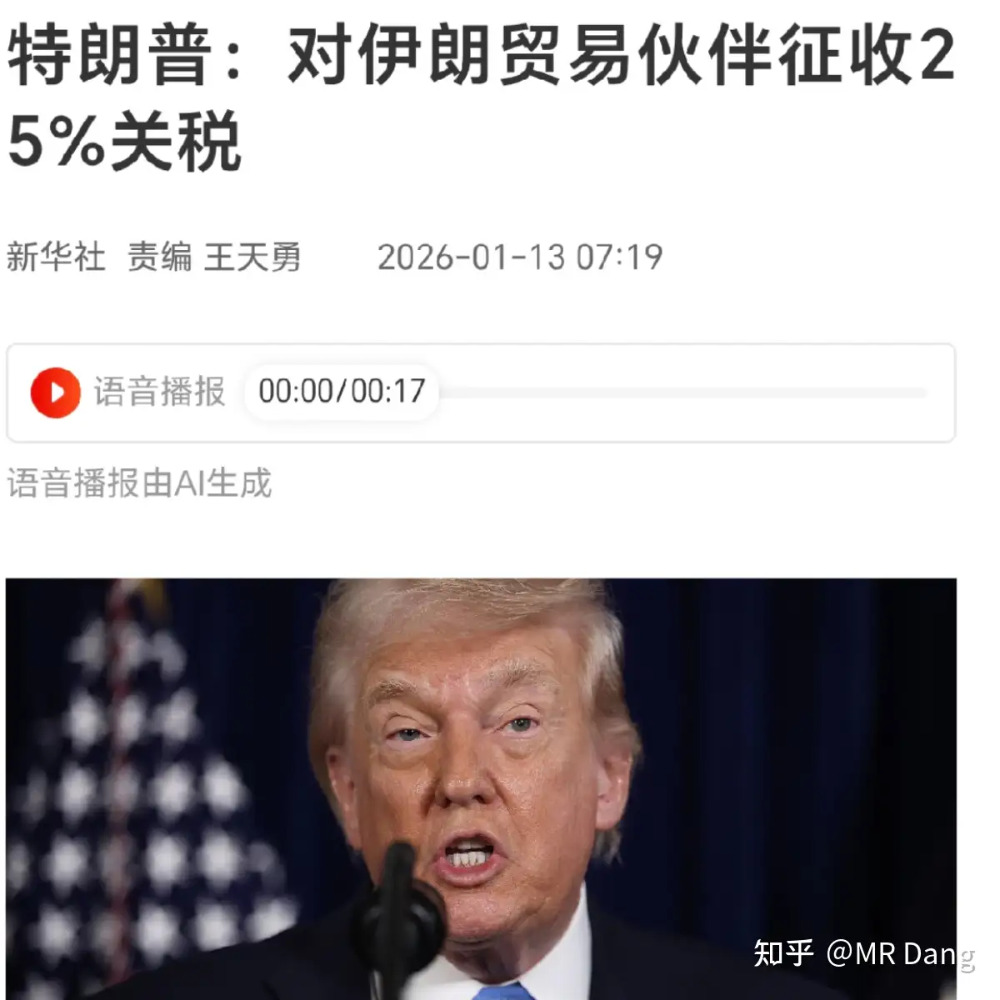
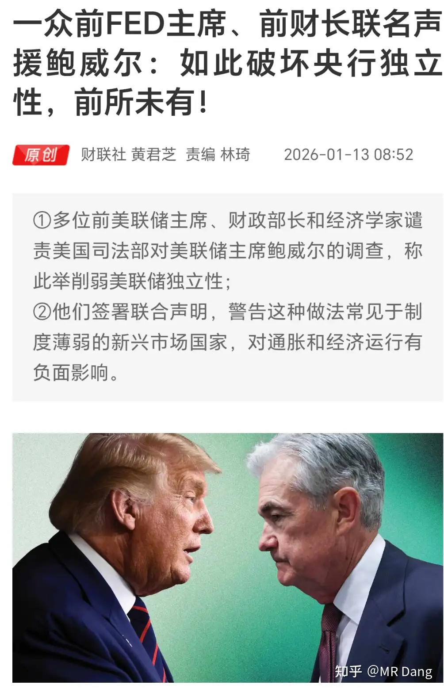
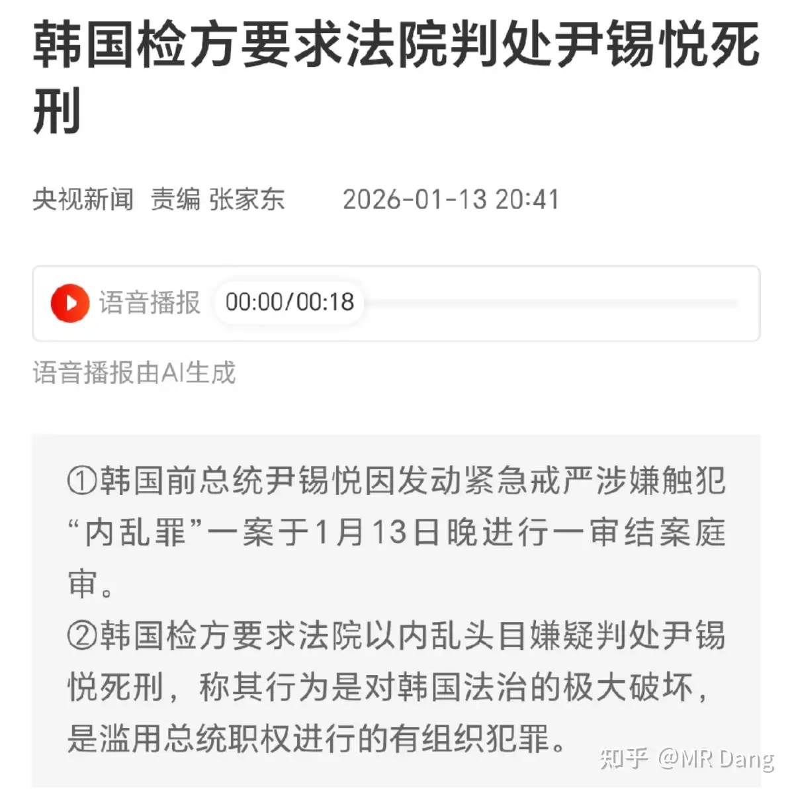
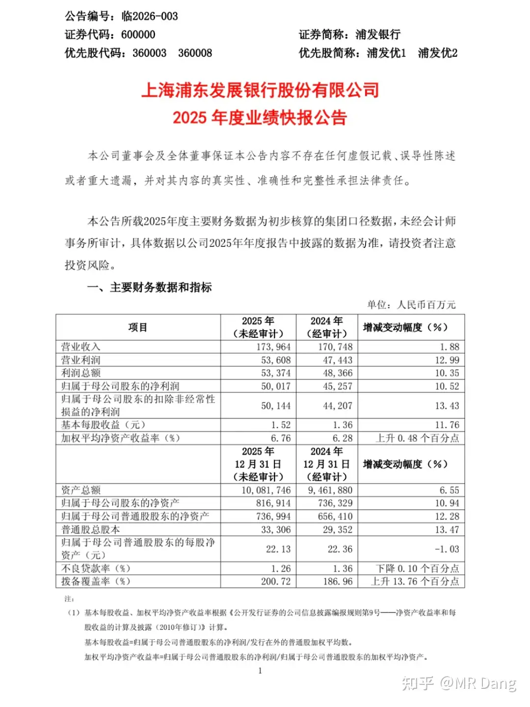
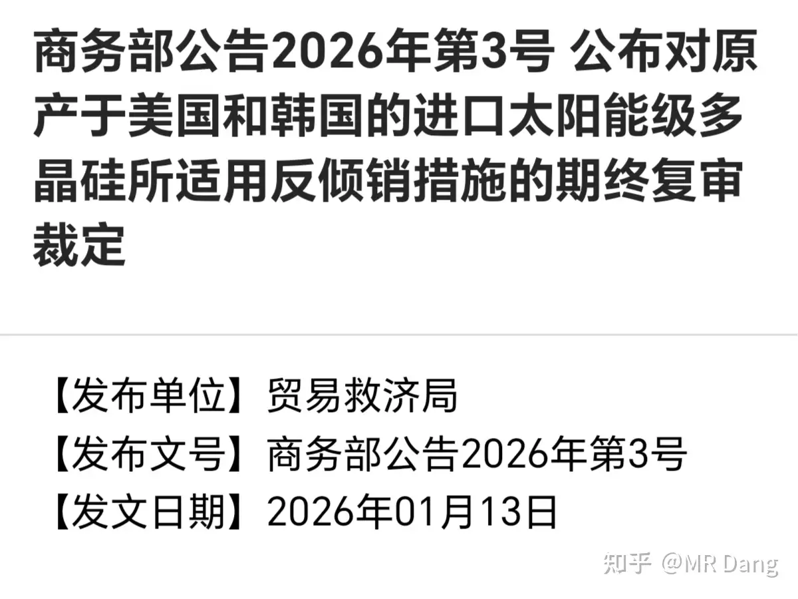
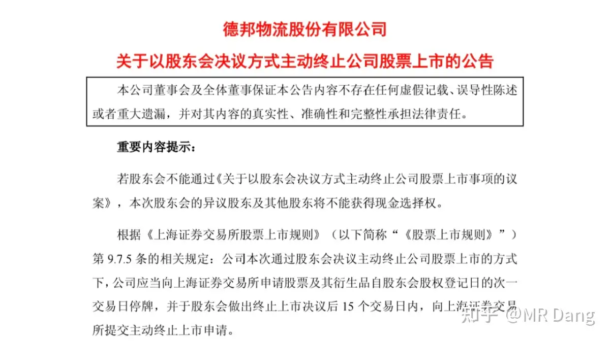
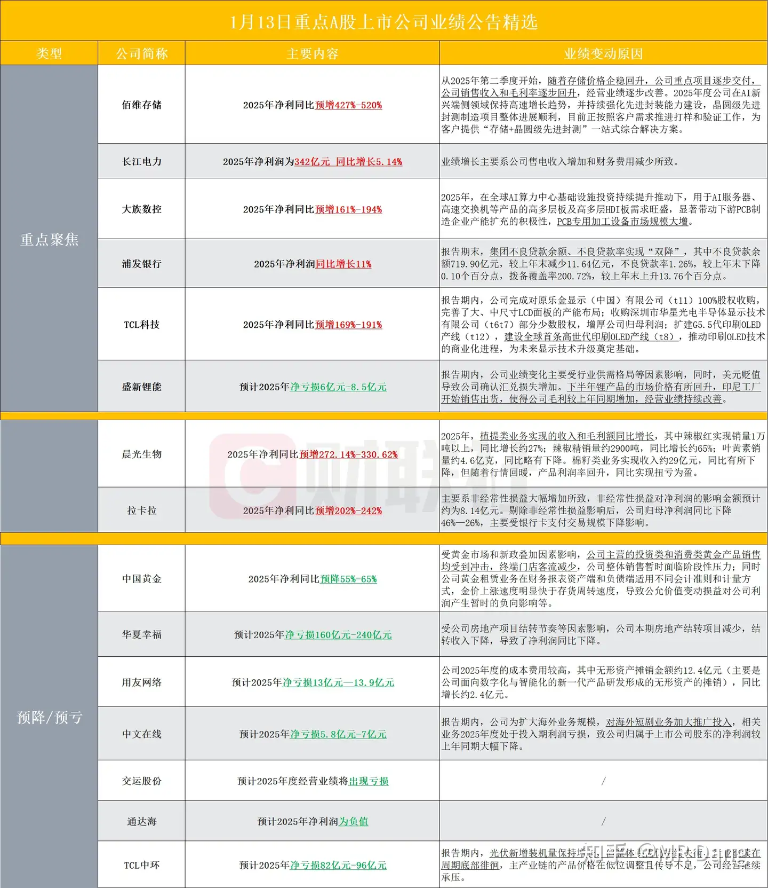
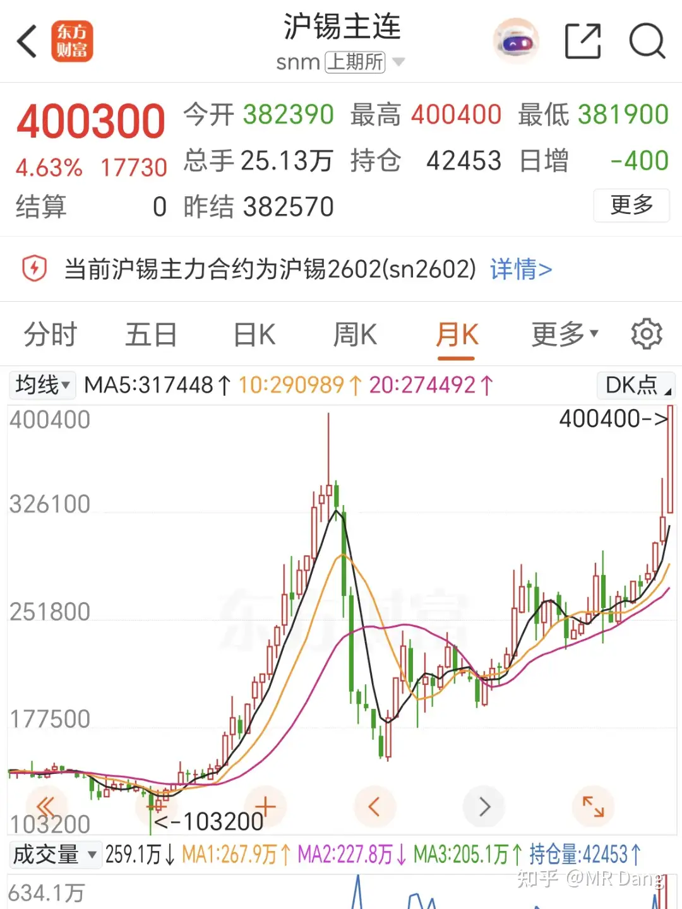
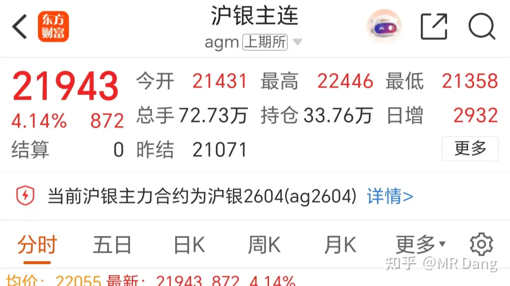

# 如何看待2026年1月14日A股行情？

---

**发布时间**: 2026-01-14 07:01  |  **原文链接**: https://www.zhihu.com/question/1993851110277010630/answer/1994665457026872766  |  **点赞数**: 1260 人赞同

**作者信息**: MR Dang​独立投资人，不接广不卖课

---

## 正文内容

兄弟萌还好么？红的绿的？

应该没有嗷嗷冲进去然后被五花大绑按在地上被迫玩绳子艺术的吧？

如果有的话应该冷静下啦，先过一遍时事：

懂王威胁对波斯贸易伙伴收钱：

同时西大从波斯撤人：

懂王动手概率很大了，几乎手指头按在扳机上了。

造成的结果就是：

顺带着塑料王这几天的主要产品：

话说塑料王也该发业绩预报了吧，快一点可能本周内就发了，别拖到下周或者下下周了。

和懂王相关的事还没完，昨天的鲍威尔获得了西大前任们和其他各国人士的声援：

这事很微妙，也不知道鲍威尔的前任们是怎么想的，按照咱们的历史观来看，这种行为无疑于把老威子架在火上烤，生怕送不走老威子。

现在懂王哪怕停手了，独立性也回不来了，咱们都是历史的见证者。

另外给尹锡悦一个镜头，对投资没帮助，纯属娱乐：

第一家银行业绩快报发布：

总体来说挺不错的，符合预期，甚至略超预期。

为什么这么说呢？只看基本每股收益的话，市场预期1.53左右，实际1.52，看似少了点。

但是拨备和不良都有改善。

虽然这些数字本身的可信度也就那样，但是在没有更进一步数据的情况下，只能暂时参考。

（其他综合收益没提，大概算下来可能不太好）

再加上今年以来，它是跌的最多的银行股，以股价表现配合这个业绩快报来说，这个业绩是配的上的。

唯一的槽点就是股息率还是低，按照目前的业绩和股价，可能预期股息率在4%左右，作为银行股来说，属实有点低了，让人提不起兴趣。

光伏反倾销：

很多被光伏套了很久的投资者比较激动，终于等来好消息了。

是利好没错，不过这个反倾销大概相当于禁止往中东卖石油。。。

又一个套利机会：

现金选择权19，当前股价14.04，存在明显套利机会。

如果是我的话，看到这里第一时间先打开交易软件，挂个涨停单抽抽奖，千万别错过了捡钱的机会，万一抽中了呢？

这个价真可以了，很厚道了。

昨天晚上发帖了，不知道开盘后有没有有缘人能抢到。

我看昨晚的评论区挺有意思的，有说停牌的，有不会挂单的。

（战术扶额）

这股早停牌了，这是马上要复牌了，所以才让大家去叫号排队，赶个早。

挂单就是报单，你只管报就行，按照系统给的涨停价/跌停价来。

实在不行，一旦不对劲，九点20之前可以撤单。

逃命的时候也是，股灾来了，跌停跑不掉，连夜挂，能捡回来一条命。

希望大家用不上，但是这技能必须学会。

还有人好奇这种事情会不会有人卖？

有的，兄弟，有的。

以我多年打新股卖新股的经历，我可以明确的告诉你，任何新股，哪怕是那种闭着眼睛赚二三十个涨停板的新股，都会有人在第一个板就急吼吼的往外卖，无一例外。

对，就是任何新股，无一例外。

资本市场太大了，总有神人存在。

不但会有人卖，而且还不少，不信收盘了去看成交额，绝对让你对A股生态有全新的认知。

这种事情排不到队是常态，抢到了才是意外，重在参与，总有运气好的时候，不参与可一点机会都没有。

至于要参与几次，我个人觉得除了今天的行情，收盘后也可以挂个隔夜单参与明天的，以后就不要参与了。

（仅供参考，也不是说就一定没风险，自行衡量）

部分企业业绩预告：

那家存储的业绩不错，虽然估值很贵很贵很贵，但是可能不妨碍继续涨，没办法，顺周期，起风了。

这玩意儿就是太贵了，最低两手也要三万。

如果配置比例不高于2%。也要150万以上的资金才有买两手玩玩的必要。

你一看股价笑了，博主真是糊涂了，买两手分明只需要两万七就够了。

额。。要不开盘你再看看吧。。。。。

隔夜商品方面：

锡创历史新高，站上40万大关。

一个多月前的回旋镖正中眉心，写下这些文字的情景还历历在目：

这也太快了，昨天还38万呢，今天就40万了，两万两万的涨，这谁顶得住？

我看好锡是看好长期供需基本面，可没能想到短期这么涨。

感觉短期有些超买了，这是想把空头宰了过年呀。

白银：

银也创新高了，涨幅还行。

其他有色品种互有涨跌，幅度不大。

最近的风有点邪门。

昨天我说看好电网什么的，是基于长期配置来说，不是就预料到了特xx工之类的就涨停或者什么样，那不是人能做到的事情，真有那本事我自己就梭哈了。

什么叫长期配置？这是基于产业分析和上下游情况得出的推理，是长期大方向。

比如和电有关的，储能就是大方向，至于谁做的更好，不好说，我不是业内人士不了解很正常。

但是我知道你做储能就要用磷酸铁锂，包括宁王现在很多电池也转向磷酸铁锂，产能早就超过迪子了。

我就抓住这个磷，投你磷矿，买磷王，逻辑很硬，估值也不贵，比锂便宜的多。

电网也是大方向，但是这个大方向里需要你有点专业背景。据我所知，gdnr这方面做的还可以，以前也提过，估值咬咬牙就过去了，喜欢电网的也可以研究研究，我个人没有配置一分钱，所以也不是荐股。

还有就是收到小纸条问我是不是短线投机的博主。

没有的事啊，只是运气好，有些个别标的涨的比较快，按照原则止盈了。还有很多持仓套住了等着吃股息呢，比如gggf什么的，挨打才是常态。

还有问为什么要止盈？比如铜王这样的标的，涨的好好的，止盈干什么？价值投资不都是拿着不动么？

其实这算是对价值投资最大的误解之一了，长期持有和价值投资二者之间没有任何必然关系。

不是说你随便选一个名字烂大街的白马蓝筹，然后抱在怀里不撒手自称价值投资就是价值投资了。

人的价值观是会变的，环境是会变的，所以价值的内涵也是会变的。

价值投资不是投过去什么什么东西最有价值，也不是投当下什么东西最有价值，而是投未来什么东西最有价值，一定要用发展的眼光看问题。

沉浸在过去的荣光中无法自拔才是最危险的。

止盈就是回避其中的风险，不断按照最新的参数去调整潜在风险和收益，每一次决策都是独立思考。

最后的结果就是大幅减少回撤。

我自从严格执行止盈的原则后，净值基本上是一条缓慢向上的斜线，最大回撤已经好几年没超过5%了，甚至3%都少见，一方面是运气使然，另一方面也是执行比较到位，除了锡王，管你什么股，短时间内涨30%，直接走你。

不是我们不适合，而是我遇到更好的了。

昨天指数终于跌了，这几天涨的太多了，我差点以为要分行李散伙了。

成交量依然很大。

至于是不是见顶了，这个不好说，预测不了的，作为投资者能做的只有应对。

哪些应对呢，比如总仓位，不应该超过4000点以下时的仓位。

比如持仓组合，不应该梭哈一只股。

比如持仓风格，不应该重仓高位热门股。

比如杠杆，有杠杆的应该适当减少杠杆，没杠杆的不要新增杠杆。

昨天的量王没找到机会止盈，看来是缘分未尽，还没到说各自安好，一别两宽的场面话的时候。

目前按照股价来说，紫菜组合，量王都在止盈射程范围内了，如果到了的话，我随时止盈。

一个喜欢保护韭菜的博主，希望大家少少踩坑，多多赚钱！！！

---

> [!comment]- 点击展开精选评论
>
> | 用户 | 时间 | 内容 |
> | :--- | :--- | :--- |
> | JasonAlpaca |  | 很难想象这个内容是免费的….. |
> | 如意 |  | 笑喷了，不是我们不适合，而是我找到更好的了……我真没瞎想 |
> | 坤坤 |  | 什么渣男发言 |
> | 小洋相 |  | 数学天才，文字的应用也得心应手 |
> | 勇闯股市的阿伟 |  | 昨天听取了大佬的建议，短期止盈了锡王，分别在27.5和34.38加仓了铝和磷等锡回调在买进去 |
> | 心形脑袋 |  | 大佬前两天说可以考虑布局春节档院线股票，然后我就入了博纳影业，昨天猝不及防就板了 |
> | &nbsp;&nbsp;&nbsp;&nbsp;MR Dang |  | 买这个的人还挺多的 |
> | Raven |  | 浦发是我第一个成本为负的生产资料，纯给我打工，扔一旁吃股息没管好久，没想到也出业绩预告 |
> | 资本主义必将消亡 |  | dang老师马上就五万粉啦，小小的许一个愿：有没有兴趣分享一下自己炒股路上的心理路程呀？您已经穿越过牛熊，一点小小的感想就对我这种新韭菜有着莫大的帮助，这都是我没经历过也没感受过的内容。如果这个请求有点冒昧的话，提前给您道个歉，不好意思，说的有点语无伦次 |
> | &nbsp;&nbsp;&nbsp;&nbsp;MR Dang |  | 啊？？这么快了？？哦我的天哪，压力山大 |
> | 奋斗 |  | 我的预言要来了，哈哈哈 |
> | 资本主义必将消亡 |  | 这一轮A股上涨，您的粉丝数也跟着起飞了昨天把最后一点子弹打到云天化上了，居然没钱套利了看来不管啥时候都得留出点钱捏住 |
> | 韩太阳 |  | 是的，讲讲心路历程 |
> | 芒果 |  | 老师，必须要给压力，谢谢老师，上峰水泥吃了一板就跑了，再次感谢 |
> | 我只知道这些了 |  | 又能带我们套利，又带我们价投，手把手喂饭啊，i了i了 |

---

*本文件由自动脚本从MR Dang知乎页面提取生成*

---

**作者**: MR Dang
**链接**: https://www.zhihu.com/question/1993851110277010630/answer/1994665457026872766
**来源**: 知乎

*著作权归作者所有。商业转载请联系作者获得授权，非商业转载请注明出处。*

---

## 相关阅读

**📅 每日行情评价：**
- [[20260115-如何看待2026年1月15日A股市场行情走势？]] - 逆周期调节与市场降温
- [[20260116-如何评价2026年1月16日A股行情？]] - 央妈政策工具解读
- [[20260113-如何评价2026年1月13日A股行情？]] - 美联储独立性危机
- [[20260112-如何看待2026年1月12日A股行情？]] - CPI数据与宏观分析

**🏭 行业板块分析：**
- [[20251024-《天阶功法卷二》BFNY估值方法]] - 塑料王估值分析
- [[20251102-《天阶功法卷四》磷化工投资价值分析]] - 磷王投资逻辑

**🔙 返回：**
- [[每日行情评价]] - 全部行情评价文章
- [[MR Dang 知乎文章总览]] - 返回主目录
