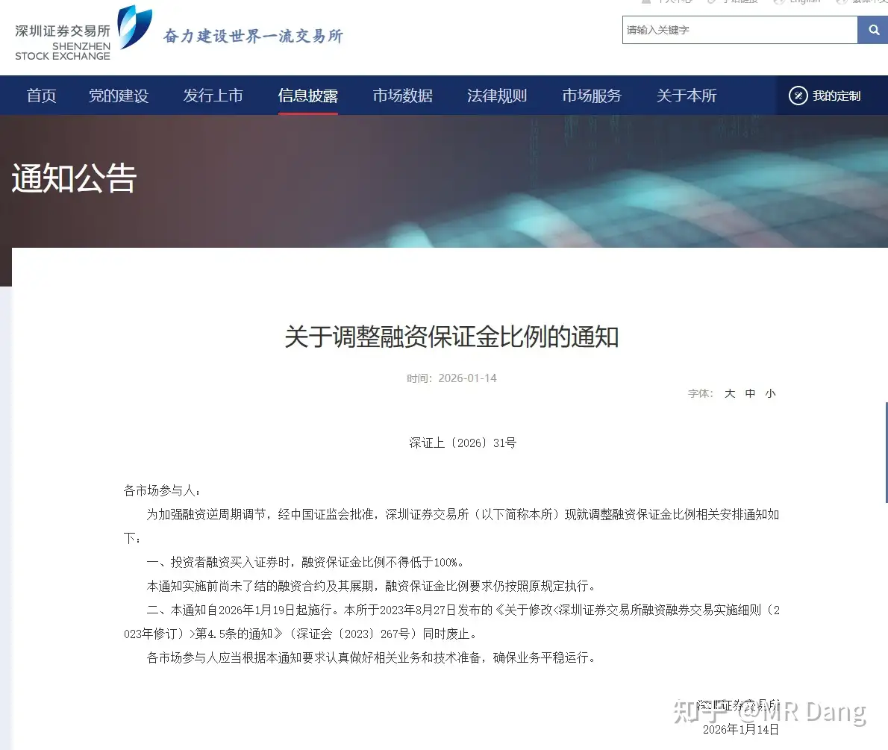
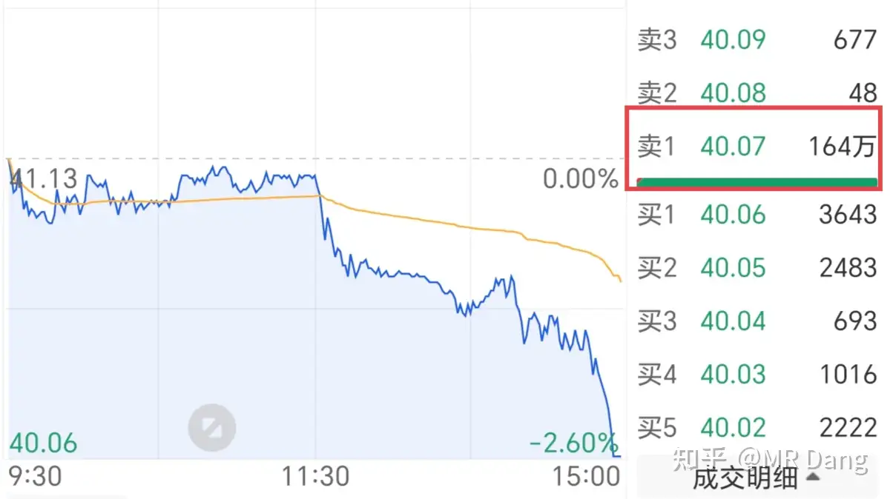
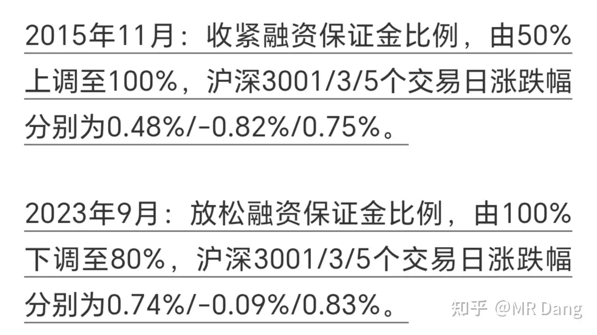
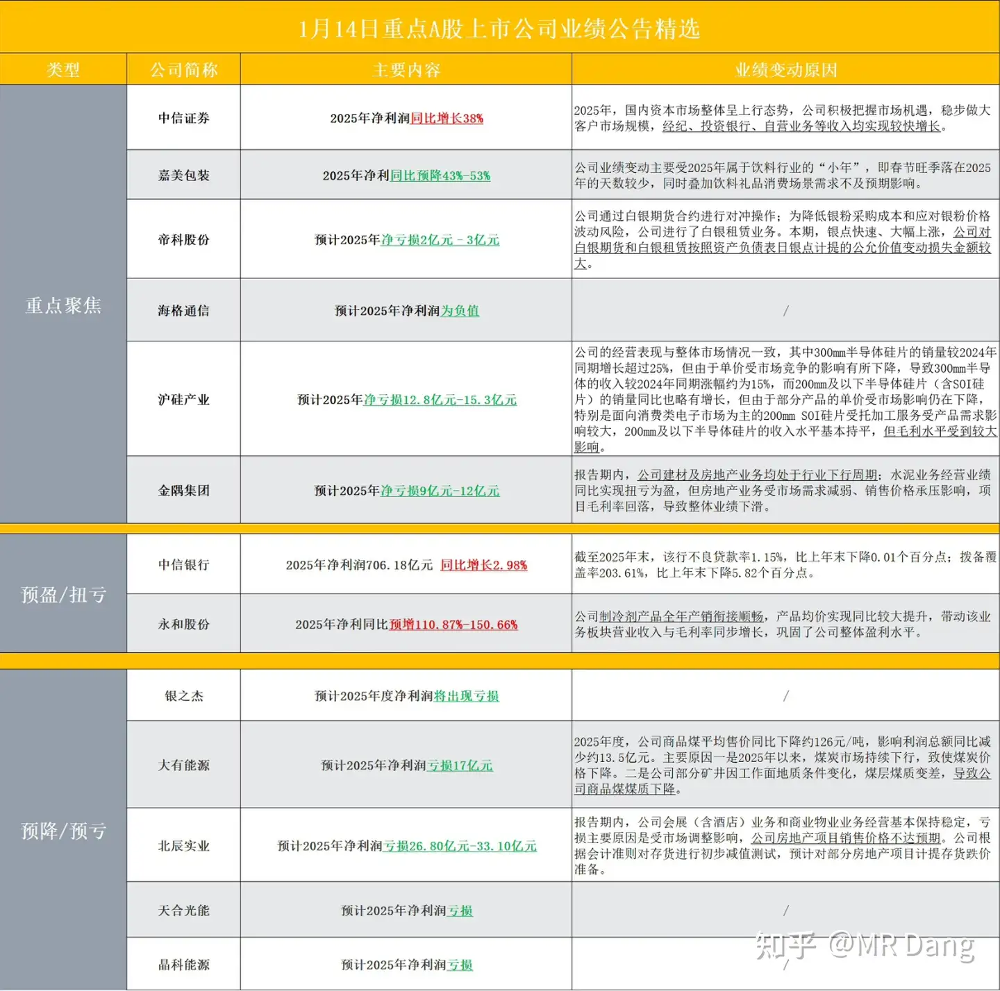
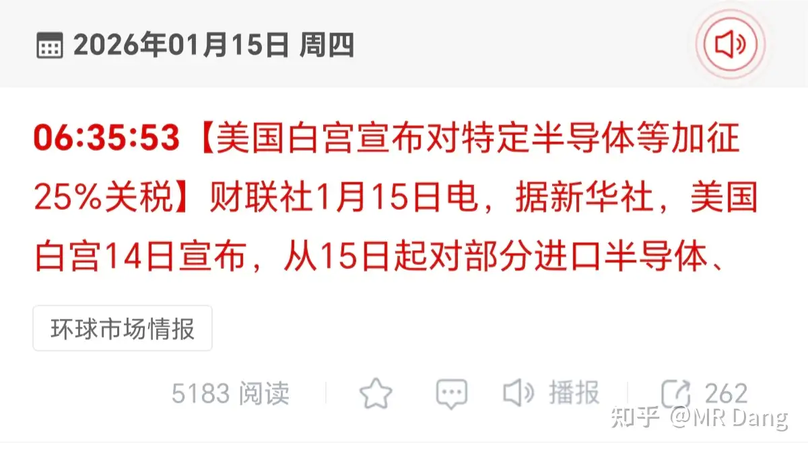
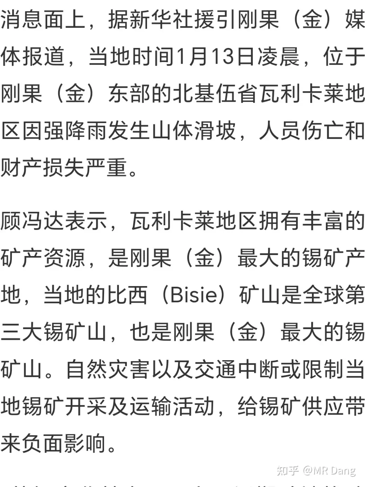
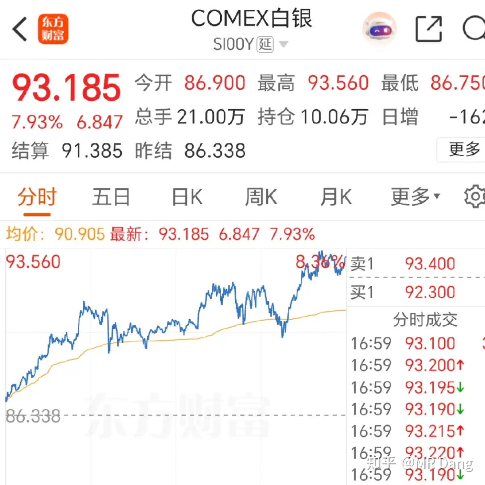
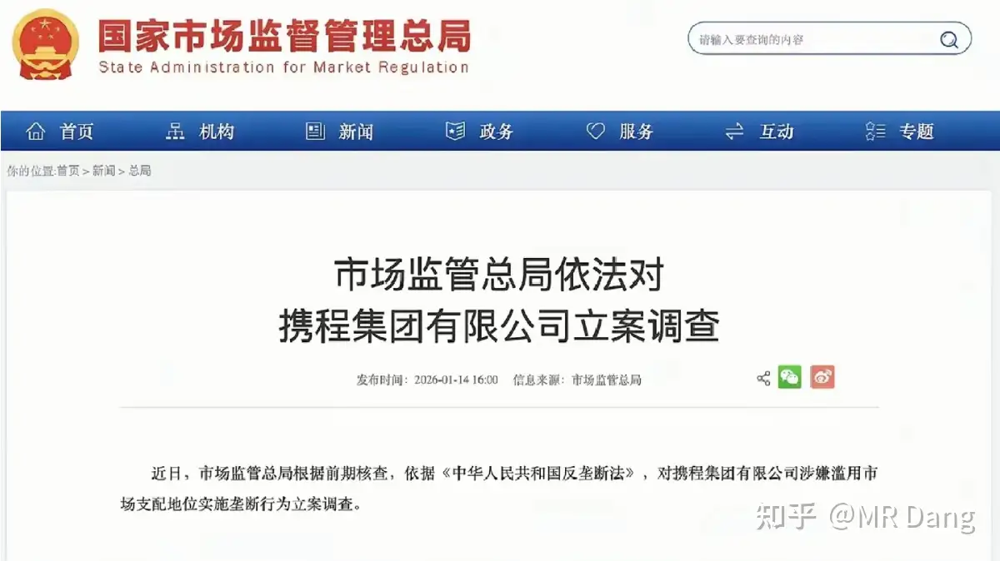
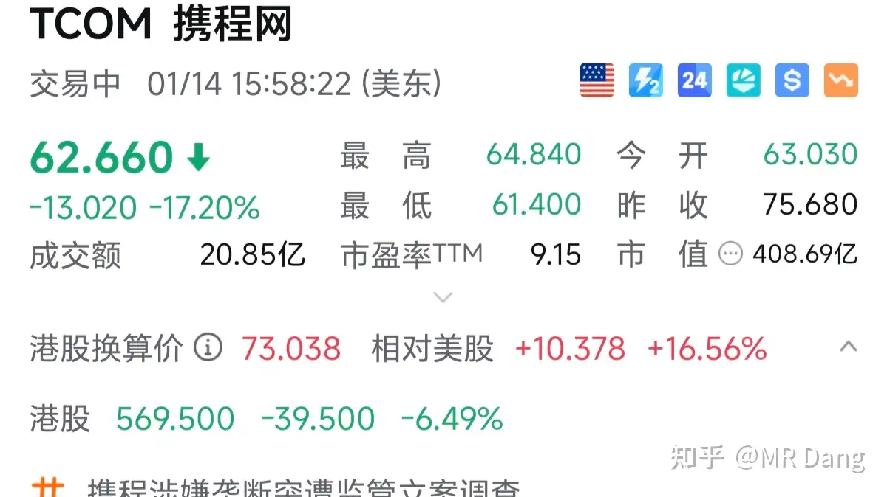

# 如何看待2026年1月15日A股市场行情走势？

---

**发布时间**: 2026-01-15 07:02  |  **原文链接**: https://www.zhihu.com/question/1994690953026508208/answer/1995028050522419702  |  **点赞数**: 2148 人赞同

**作者信息**: MR Dang​独立投资人，不接广不卖课

---

## 正文内容

昨天是不平凡的一天，所有新闻往后靠，最重要的只有这条：

调整保证金比例，80%调整为100%，相当于降杠杆。

“逆周期调节”这几个字眼特别醒目，消息是中午发布的，水是下午跳的：

为什么投资者用脚投票？因为上次杠杆牛的时候，股灾就是从去杠杆开始的。

资本市场对杠杆是极度敏感的，会给人带来不好的联想。

与此同时，银行电力等板块集体雪崩。

我持有的银行也没少跌，给我昨天整体收益差点拉绿。

不但杀人，还要诛心，在最后集合竞价的时候，秀了一把肌肉：

比如：

某银行直接摆出了市值六七十亿的压单。

查了一下股东，最后是谁能摆出这样的压盘并不难猜，秀肌肉的也没打算遮着藏着。

除了秀肌肉，还有一部分压力来自被政策误伤的稳健性投资者。

这类投资者的特点是资金体量大，追求确定性和稳定，所以偏爱银行股和长电这类标的。

但是这类标的的波动性都比较小，所以为了更高的收益率，一般都会加杠杆，有些杠杆还加的特别大。

虽然这次逆周期调节没有对原来合约动手，但是有些人会有不好的联想，与其被逼着去杠杆，不如自己先降一部分杠杆，整体市场的流动性就被压制了。

ok，到这里会有一个比较大的 bug，既然这样，为什么不去热门股秀肌肉，而在这些蓝筹里扬武耀威呢？

就是有没有一种可能。。。秀肌肉的股才是他们有仓位的股，而那些天上飞的股他们倒是想秀肌肉，但是没仓位啊。

那这种工具，在工具箱里属于什么等级的呢？

大概属于中等偏上一点厉害的工具，在此之上分别还有降低折算比例，打击场外配资，直接减持，印花税调节，讨论资本利得税，下场抓人，厉害程度排名依次提高。

搞上来不容易，想搞下去那可有的是手段。

说这么多，其实就是表达一个意思：目前银行之类的下跌并不是基本面不行或者有什么黑天鹅，而是人为的，所谓的逆周期调节导致的。

一般根据经验，这种程度的调节并不会直接改变大的方向，反而由于短期内的超卖会形成一个性价比高的买入窗口。

说人话就是，可以买，不贵，但是不保证是底部。

按照收盘价计算，我的银行股息率又上了6%，所以我在反复斟酌后，决定放弃部分在看的标的，用止盈的资金，继续加注银行。

补仓的技巧再重复一遍，拉开距离，控制仓位，八字真言，牢记在心。

中期分红就在春节前后，年度分红就在半年之后，这个估值这个股息率，没有害怕的理由。

在东大这块土地，你可以永远相信银行。

买银行股买的不是股价涨跌，买的是持续不断的现金流，银行的分红与否甚至不受银行自己说了算，得问问大股东答不答应。

又一批公司业绩预告：

业绩好的红颜色的那两个大家伙最近被砸的稀巴烂，其他的业绩差的绿色的股票倒是有很多涨的相当不错的妖股。

怪不得资本市场重塑人的三观呢，这样的市场呆久了，多多少少会影响人的认知。

昨天止盈了紫菜组合，止盈了量王，事前有通过气，事后也说的清，都是30%就收手了，紫菜组合里的菜不够30%，差10个点，但是紫远超30%，最后的结果是超过30%。

紫菜组合是我最满意的组合，太稳了，虽然我止盈了，但依然看好，这个价位并不是很贵，有想买有色+消费的，可以考虑，我已经清仓了，所以不算利益相关，我觉得行那就是真心话。

至于说为什么刚好卖到顶，那都是巧合，之前分享过我的择时大法，很笨但是挺管用，简单又粗暴，用过都说好。

昨天说打算加储存，我又看了下科创板那个发了业绩预报的公司。

它是属于存储产业链中游的企业，做模组的，商业模式大概是1求到2求之间，算是中等吧，和友商比起来定位中高端，客制化程度高。

细节上看不太清，比如业绩预报里有多少业绩是因为之前库存的低成本晶圆引起的一次性业绩，又有多少是可持续的盈利。

计算器不太好按，如果粗暴的按照第四季度平均8亿左右的扣非净利润计算，那估值只有20pe，太震撼了，无脑冲。

所以按pe估值不太靠谱，假设按照营收的话，四季度单季度40亿左右，和同类型的模组龙头企业jbl比较，也很便宜了。

问题就出在第四季度上了，不知道这个业绩怎么做到的，有没有持续性。

抛开计算器，只看它的行业前景和目前的经济环境，无疑是超级周期的前段，弹性巨大，大有可为。

综合考虑，目前这个位置大概73开吧，我买这些东西追求的是模糊的正确，不去计算精准的错误。

赢面稍微大一些，我打算今天补银行的时候顺手买一些丢那里，现在手里大把的现金，手里没邪修心里空落落的。

但是风险挺大的，创新高的股，看图形我很慌，而且这也算人为的消息，搞不好就中了圈套了，不推荐你们买，风险不比量王小，量王我买进去以后最多的时候也套不少的。

写到这里，蹦出来一条半导体新闻：

懂王又要收钱啦。

锡更新一条新消息：

锡的供应本来就紧，需求端又旺盛，现在第三大矿山比西又出问题了。这个矿山也不是第一次出问题了，修复需要很久。

而且锡的供应很集中，那些地方大部分都不太平，供应链很脆弱，稍微有个风吹草动，全球的供求关系就变了，空头就会被拉出来祭天，比如这样；

但是目前这个位置，我说实在的，我把握不了一点，包括锡王，业绩如何，是否对得起估值？管理层有没有作妖？有没有意外的黑天鹅？

我和你们一样，都是开盲盒，但是我成本低，而且忍受力强，所以我不走。

我是说过锡价要去百万，要按克卖，但不是这样一天一个涨停的走法，crazy。

锡王如果以后在40块上面，我不会再次主动提及，除非我止盈的时候。

我怕提的多了，有人看着心痒难耐就买了，万一套住了，那就坏菜了。

我也不需要反复提他来显白自己的远见和水平，我啥水平，大家心里都有杆秤，用不着给自己搞形象工程。

不要买不要买不要买，重要的事情说三遍。

白银创新高，昨天收盘后涨了四个点左右。

其他金铜铂等小幅上涨，受懂王最新表态，原油宽幅震荡。

不锈钢最近挺强势的，我研究研究怎么个事，按道理来说就算星舰一艘也就几百吨总量，在东大4000万吨产能前完全不值一提，炒商业航天能炒到不锈钢去？这脑洞是不是有点太大了，算它一万艘星舰大小的也就那样吧。

又一家平台被反垄断，股价瀑布：

恒科的家人们小心了，一个同程，一个携程，双倍快乐。

哦对了，塑料王也到了我止盈射程了，我成本低，目前的价位快到了，但是还没等到业绩预告，我打算再看一看，根据基本面选择去留，有点不甘心。

还有大家关心的五万粉感言，这个不会跳票的，但是实在是暂时忙不过来，这粉丝涨的太猛了，一晚上几千，顶不住，小博主没见过这阵仗，吓尿了。

这样吧，暂定周六早晨更新（如果能写好的话），然后周日休息一天，周一恢复更新，实在是肝不动了。

我本职毕竟是职业投资者，博主只是第二身份，大家见谅，鞠躬。

一个喜欢保护韭菜的博主，希望大家少少踩坑，多多赚钱！！！

---

## 精选评论

| 用户 | 时间 | 内容 |
| :--- | :--- | :--- |
| 摸会儿鱼 |  | 知乎十多年用户，含金量最高的博主，没有之一。对，我说的 |
| &nbsp;&nbsp;&nbsp;&nbsp;MR Dang |  | 哈哈哈，好高的评价，太夸张了，感谢 |
| 败絮丶 |  | 大佬真是善良，还给持有银行的做心理按摩。昨天根据市值一个一个看有哪些压单的股票，也算一大奇观了。 |
| 败絮丶 |  | 你们评论啥了，全给删了 |
| noahhaon |  | 只是武器库展示而已 65E的筹码也是有成本的 再远就不说了 过去两年看 65E成本可能也要去到33-35 真砸砸下来换成韭菜进去 韭菜肯定是笑嘻了。 |
| 乌获 |  | 早上好 老师辛苦啦之前笔记发评论都被按了估计是因为我话太多了今天来个简要版笔记-1.上面通过抑制流动性给股市降温。鉴于之前的“杠杆牛市”在此法之后直接下行，所以普通投资者也主动卖出融资标的来自我去杠杆了。再加上有肌肉的大卖单，对股价形成压力。那为什么在蓝筹股里下卖单呢？因为高热度板块里他们没票。所以银行不仅不用恐慌还是个加仓好时机！但是加仓一定要“拉开距离➕控制仓位” 这八字箴言老师每天都在说，是持仓原则性技巧第一条！ |
| 亦蓑烟雨任平生 |  | 心痒难耐的人可以像我一样先买1手，至少有点参与感，涨跌都舒服 |
| &nbsp;&nbsp;&nbsp;&nbsp;MR Dang |  | 机智 |
| 009号大西瓜 |  | 昨天重仓磷王，今天就起飞，不然今天要被金风坑惨。近十年知乎两次改变我命运，一次是十年前转到IT，这次是在IT干了十年有点积蓄准备入市就碰到了佬。叫声义父不过分 |
| 长命百岁 |  | 辛苦了，党师！确实不需要这么肝，五万粉后就十万粉感言吧，然后二十万三十万这样，毕竟粉丝增长越来越快 |
| &nbsp;&nbsp;&nbsp;&nbsp;MR Dang |  | 我考虑考虑怎么设置区间 |
| 老司机 |  | 塑料王真是个好企业，舍不得跟它说再见 |
| &nbsp;&nbsp;&nbsp;&nbsp;MR Dang |  | 是啊 |
| 王了个去 |  | 我有三个被压了，不，加银行，四个，真刺激 |
| 猕猴桃 |  | 我才惨，华夏银行，招商银行，中国移动，长江电力，中国平安，我都有，我太惨了 |
| 吃葡萄不吐籽儿 |  | 我长江电力，中国移动 ，上午刚加过仓，下午就死给我看 |
| 回笼觉主 |  | 上午卖了科创，挂单银行移动长电这些准备看戏，结果下午就被啪啪啪啪啪啪扇了六巴掌。收盘科创反而是红的，小丑居然是我自己。 |

---

*本文件由自动脚本从MR Dang知乎页面提取生成*

---

**作者**: MR Dang
**链接**: https://www.zhihu.com/question/1994690953026508208/answer/1995028050522419702
**来源**: 知乎

*著作权归作者所有。商业转载请联系作者获得授权，非商业转载请注明出处。*
