# 如何评价2026年1月16日A股行情？

---

**发布时间**: 2026-01-16 07:02  |  **原文链接**: https://www.zhihu.com/question/1994911795786319813/answer/1995390513898087685  |  **点赞数**: 1303 人赞同

**作者信息**: MR Dang​独立投资人，不接广不卖课

---

## 正文内容

本周最后一个交易日了，事情还挺多的，快速过一遍，然后重点说下塑料王的业绩预告。

今天的头条新闻必须给到央妈：

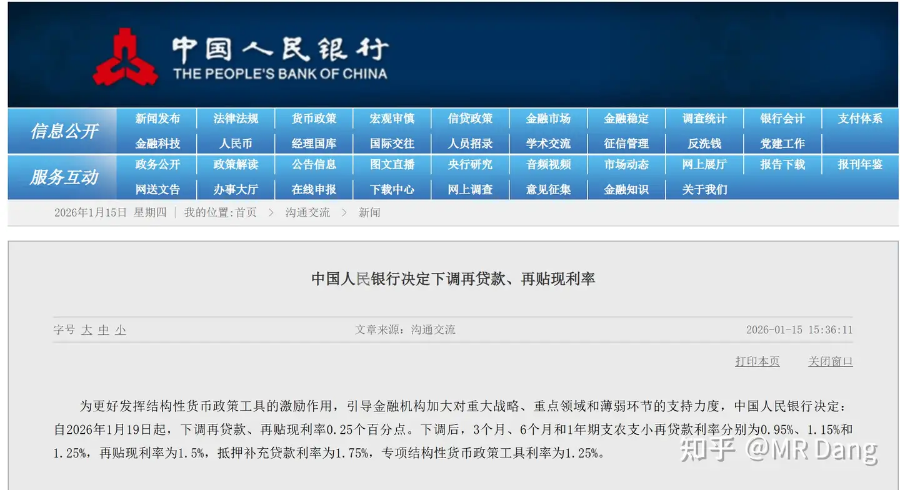

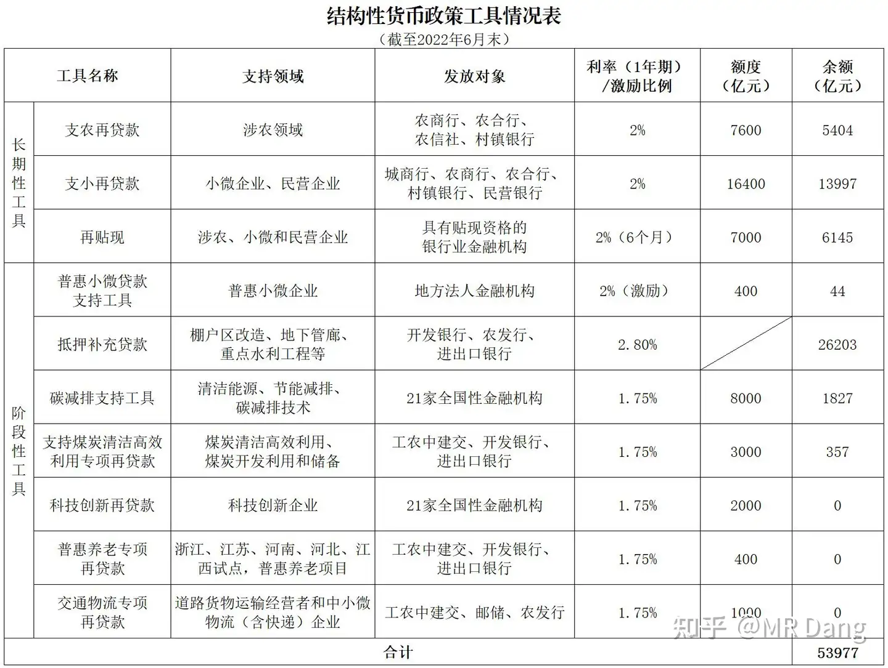

这个新闻属于字少事大，很多人在纠结，这个属不属于降息？

在这里我先不说结论，咱们先补一下基础知识：

什么是结构性货币政策工具？

这个东西你不用去猜，也不用争论，直接看权威解答就行了，央妈在2022就有过定义：

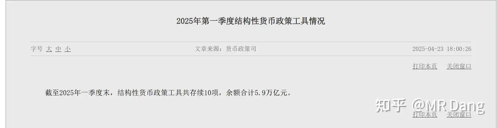

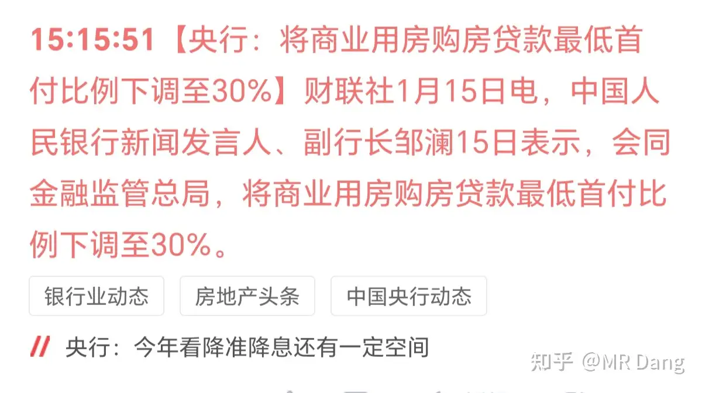

央妈定义

省流版：

图中是2022年6月时候的规模，大概5.4万亿。

最新公布的数据是：

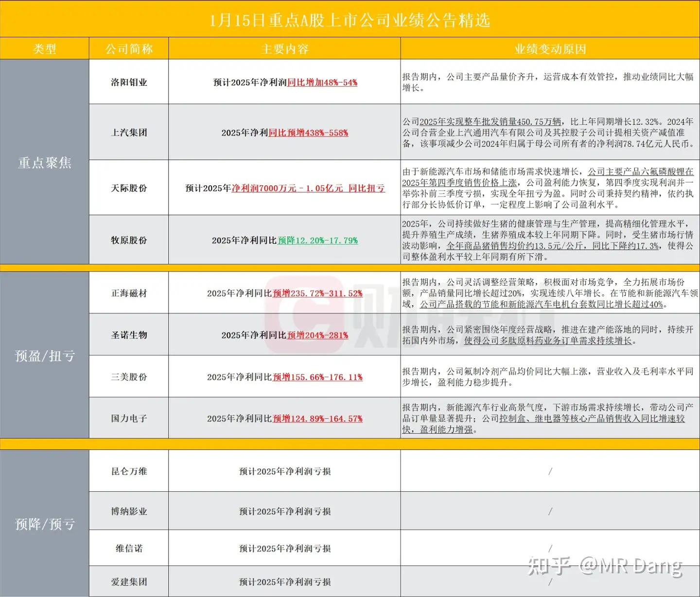

截止去年一季度大概是5.9万亿，可见增速不高，那目前这个时间点，就按6万亿左右测算，应该是可以的。

直接影响大概有以下几点；

影响一：央妈对存量结构性货币政策工具大概直接让利=6万亿*0.25%=150亿/年

影响二：降低结构性货币政策工具的相关领域资本成本，大头是涉农，科技，民生，中小微。

影响三：降低银行资金成本，提高银行放贷意愿，增加增量贷款，所以可以增加银行的收入，降低成本。

影响四：向外界传递”降息“的信号，降低实际无风险利率，花小钱办大事。

往年银行的”开门红“都是抓存款，今年有在银行系统上班的应该注意到了，开门红的重点强调理财产品，优质贷款，存款的重要性没有那么前了。

另外对银行有所了解的应该会发现，五六万亿里占比接近一半都是“抵押补充贷款”。

这个也就是所谓的Psl，主要是支持三大工程，分别是保障性住房，平急两用和城中村改造。它们不是通过商业银行，而是通过三大政策行发放的。

间接影响就多了，比如债券价格，比如那三个字的行业，不展开了，咱们不是搞理论研究的，专心搞钱就行。

再次给大家推一下银行，你如果嫌弃我的银行比较差，那你买其他股息率高的也ok，这个位置最坏的结果无非是亏时间不亏钱，适合稳健的投资者。

在央妈的一堆其他表述里，我比较关注的是这个：

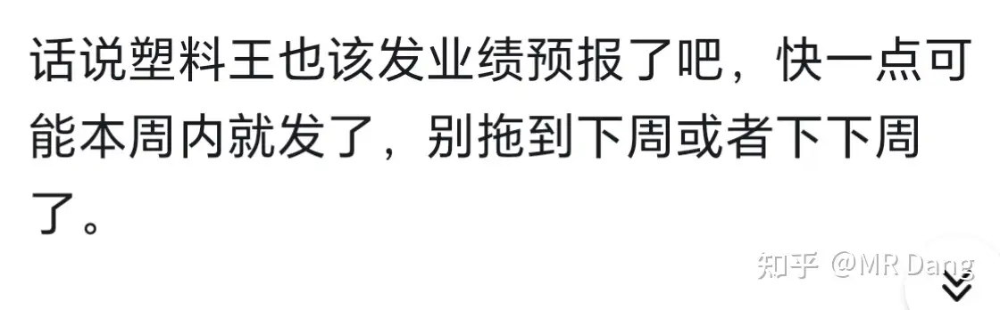

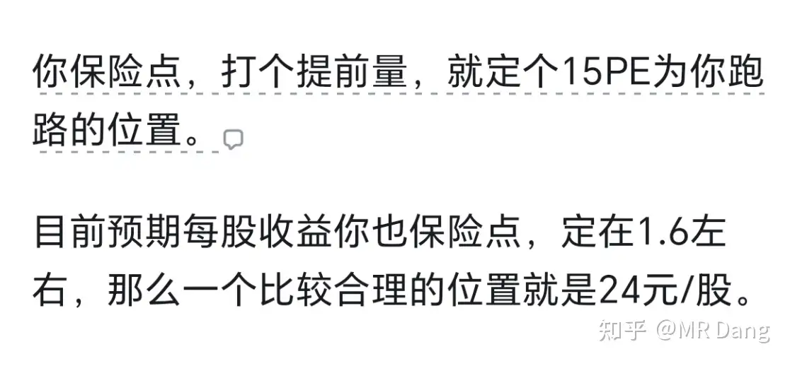

这个行业怎么说呢，现在不乐观，特别是办公和一些老的商业，被综合体打的抬不起头。

综合体之间的竞争也很激烈，万达和吾悦，还有天街，万象，大悦城，印象城，有些差一点的出租率都掉到90%甚至80%下面了。

指望这个措施救活商用房是不现实的，很困难，但是这个措施有可能让一些综合体附带的金街变得更好卖，从而让综合体企业受益。

包括目前正在推的商业综合体reits，也会让个别企业的综合体退出更顺畅，最后打通资金循环，降低有息负债和资金成本，修复报表。

所以可能个别这类企业存在预期差和估值修复的机会。

这属于粪坑里找巧克力豆吃，需要很高的财务分析能力和商业模式理解能力，一不小心就会吃一嘴热乎的。

代码就别问了，我先吃一口尝尝咸淡，确定是巧克力了再和大家唠唠，如果不是的话。。。等我刷牙。。。。

上次说的套利，今天不要报单了！！

为什么呢？今天对应的涨停价都快接近18.7了，而现金选择权只有19，这中间是有不确定性的，所以其真实价值一定小于19。

一边是18.7，一边是＜19，没套利空间了，不要参与了，划不来。

如果打开涨停，回落到18以内才算有套利的空间，到时候再考虑。

部分企业业绩预告：

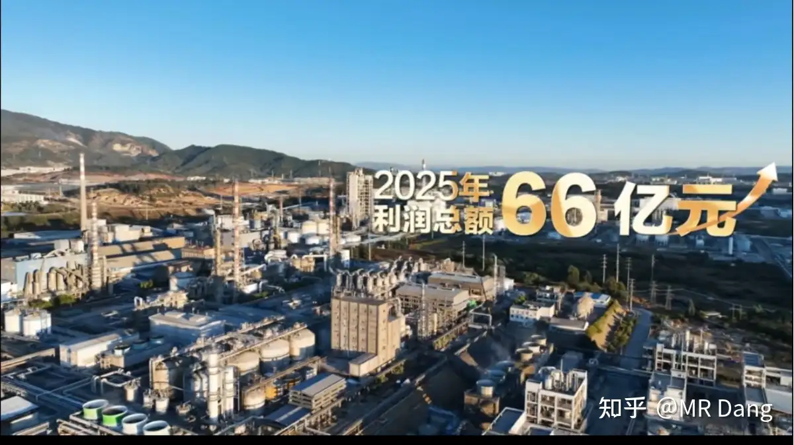

螺母业绩不错，满手的现金。

养猪的也可以，猪价摆在这了，不能要求太多，就看啥时候能把同行熬过去。

但是我个人不喜欢这个生意模式，属于先天有缺陷。

氟化工那个稍微有点一般般，相比之下我更喜欢港股那个氟化工的标的。

塑料王发布业绩预告：

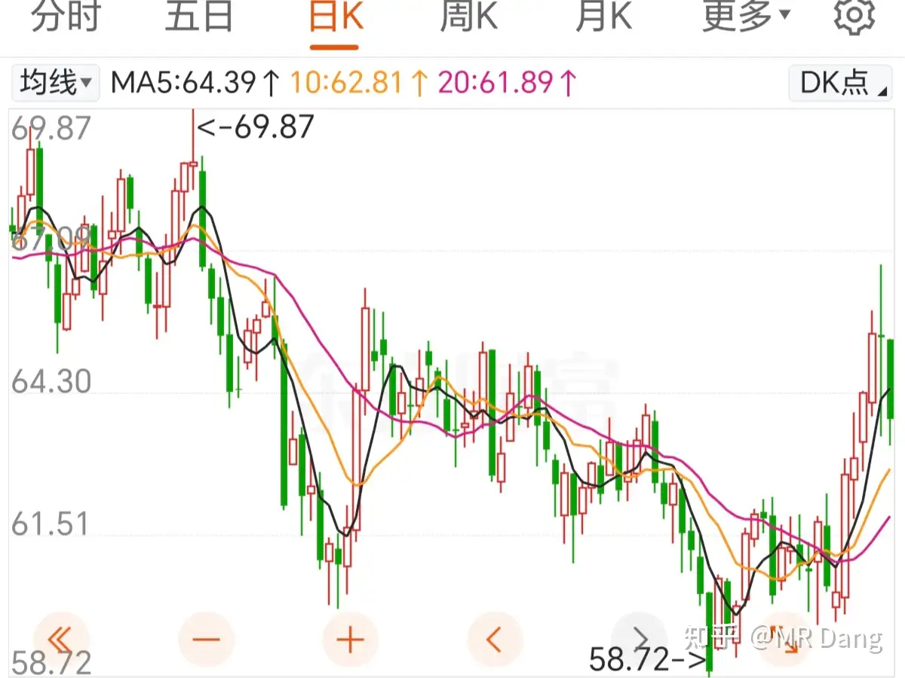

总的来说，符合我的预期。

符合预期体现在两方面。

第一方面是预告的时间，我在前天还念叨过：

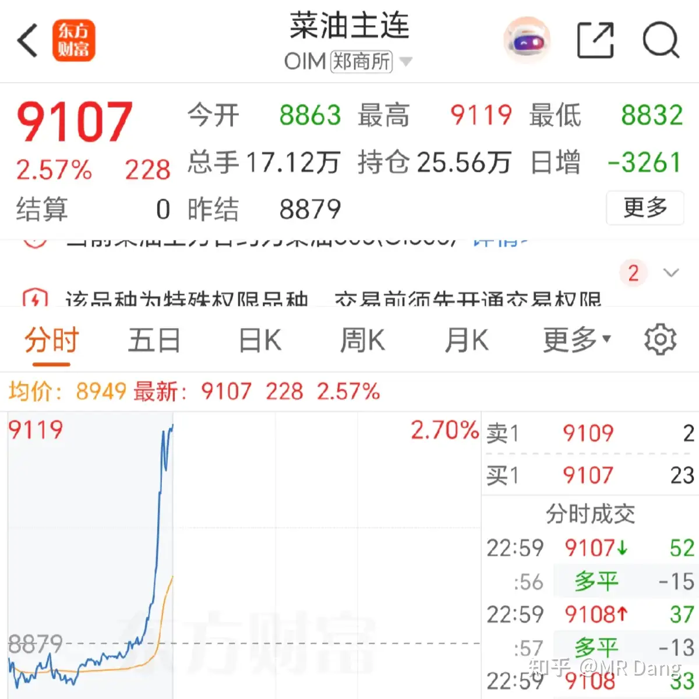

就效率这方面，塑料王真的顶，收盘之后第一时间就发了。

不像有的企业，发个公告都要卡在晚上十点或者十一点，也不知道藏着掖着有啥好处，搞得投资者大晚上的还要守在屏幕前。

第二方面是预告的业绩：

110亿到120亿之间，取中位数115亿吧。

则折合每股收益=115/73.3=1.57元/股

而我在去年10月份的天阶功法里计算估值的时候，用的是1.6的预期：

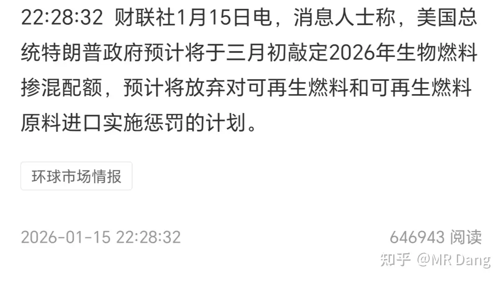

所以这份业绩预告，对我来说总体属于中性消息。

至于我的话，看市场情况吧，主要是目前还没想好下一站去哪里，止盈的话东西太多，一时有点懵，周末有空了好好合计下。

展望未来的话，如果新疆项目获批，那就属于二次创业了，要重新按计算器，重新估值。

如果那样我可能会继续拿着，但是为了降低风险，会再配置一个因为原油价格降低而明确受益的标的做对冲，比如做长丝的企业。

类似紫菜组合的逻辑，左手卖雨伞，右手卖太阳伞。

要是在重新按计算器之前市场就给了合适的报价，那我也会考虑止盈，我的执行力还是可以的。

磷王母公司发布宣传片：

集团66亿利润，对应磷王大概是56亿左右，鉴于磷王四季度还补税了，所以这个业绩算是符合预期吧。

今年没有补税影响，业绩会在原有增速上更好看。

磷王最主要的任务是保供，赚钱不是第一要务，如果放开出口让磷王自由飞翔，分分钟利润能翻一倍都不夸张。

磷王有点像咱们的基础设施一样，对国计民生有很重大的意义。

商品市场 ：

懂王最新表态缓和，波斯好像又有救了，原油价格应声而落：

上期所对锡提保，限制开仓：

锡价有所回落：

根据历史经验，一般这种情况对短期内走势有影响，但是中长期还是要回归供需基本面，不会改变大的趋势。

其他有色品种互有涨跌，幅度不大。

菜油价格直线拉升：

原因是：

菜油是生物燃料重要组成部分，若西大放弃惩罚计划，则会提高需求端。

投资港美股的注意下：

不方便多说，以官方消息为准。

昨天的行情成交量缩量，热门股回调。

手里有仓位的，如果净值大幅度回调，要看看是不是热门股买太多了，风险控制没做好，控制回撤可是一门大学问。

我昨天按计划加仓了银行，并且顺手建仓了点存储，均价150左右，止盈线可能也就是200附近。

反反复复的看了以前的财报，还是看不太清细节，但是大方向上没问题。

可能买的有点少了，能蹲到便宜的位置就再加一点仓位，现金有点多了，不买成股票心里难受。

还有就是收盘之后一整理发现我的佛光普照也到了止盈射程了，差不多还有一个涨停的距离，提前吱一声，万一哪天暴涨到止盈线我就止盈了。

一个喜欢保护韭菜的博主，希望大家少少踩坑，多多赚钱！！！

---

## 精选评论

| 用户 | 时间 | 内容 |
| :--- | :--- | :--- |
| 天高气爽风飞扬 |  | DANG总早！5.2万粉了，我也算是最早一批老粉了，被一句”兄弟，有的，兄弟”种草，在这既学到不少知识，又被DANG总幽默的文风每天乐呵乐呵的，祝DANG总及其粉丝投资继续赚赚赚！ |
| &nbsp;&nbsp;&nbsp;&nbsp;MR Dang |  | 就你小嘴甜 |
| 托米 |  | 坐标110国有行，开门红确实没有存款指标了，目前重点是战略理财，还有……社保卡！！ |
| &nbsp;&nbsp;&nbsp;&nbsp;MR Dang |  | 我猜你能在评论区找到同事 |
| 好像没有读过书 |  | 每天天不亮就更新，这自律，想不赚钱都难。 |
| 郁杏子 |  | 俺的空仓银行成亏损最严重的票了( ; _ ; )/~~~浮亏股息都包不住了！需要党大的心理按摩了！ |
| 瘦坨坨 |  | 这次分红少点，等6月份年中分红应该就可以了 |
| 唐小刀 |  | 说个暴论银行这东西很微妙，当下看很难赚到市场的钱。做不到大资金量以年为单位拿着（或者以攒股为目的持续买入），还是不要把银行当空仓，就安心逆回购吧。短期如果空仓难受，就想买点啥，把云天化或者中海油h当空仓也挺好的。 |
| &nbsp;&nbsp;&nbsp;&nbsp;MR Dang |  | 银行的择时更难 |
| 八月 |  | 真真是宝藏大佬，睿智又可爱，看枯燥财经文章都能给你逗笑，一定不能停更啊 |
| &nbsp;&nbsp;&nbsp;&nbsp;MR Dang |  | 包的兄弟 |
| 八月 |  | 大佬，看来要换个头像了，不然大佬又叫我兄弟了！ |
| 勇闯股市的阿伟 |  | 天晴了，雨停了，觉得自己又行了大佬提示过风险的传媒还是没忍住参与了，最后被毒打一顿，眼神都清澈了。在昨天的视频中已经给大佬鞠躬道歉了。后面还是老老实实等锡王回调。 |
| 牛教授 |  | 用大佬文章里的一句神评：眼一红，股票就绿了。 |
| &nbsp;&nbsp;&nbsp;&nbsp;MR Dang |  | 啊这。。。 |
| Iris |  | 158入了佰维 |
| 晨风 |  | 存储一万多一手，我颤颤巍巍准备来一手。一买，发现小白科创买不了。心里一下释然了。 |
| 最后的宿命 |  | 铝王有点东西啊 |
| 钞能力 |  | 铝王还能进吗？ |

---

*本文件由自动脚本从MR Dang知乎页面提取生成*

---

**作者**: MR Dang
**链接**: https://www.zhihu.com/question/1994911795786319813/answer/1995390513898087685
**来源**: 知乎

*著作权归作者所有。商业转载请联系作者获得授权，非商业转载请注明出处。*