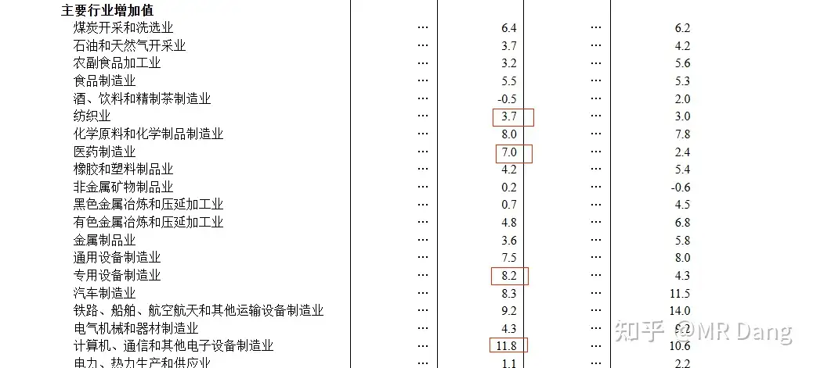
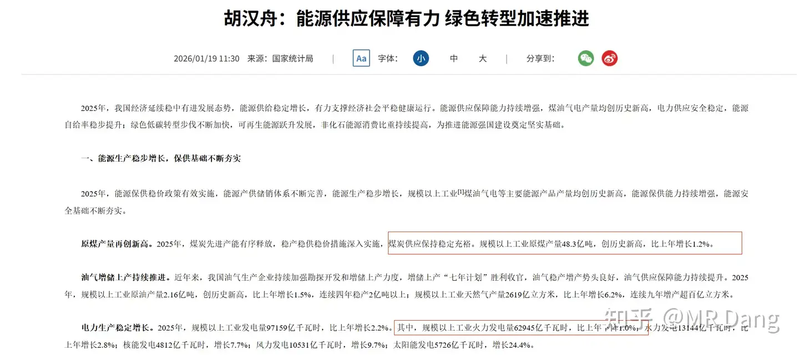
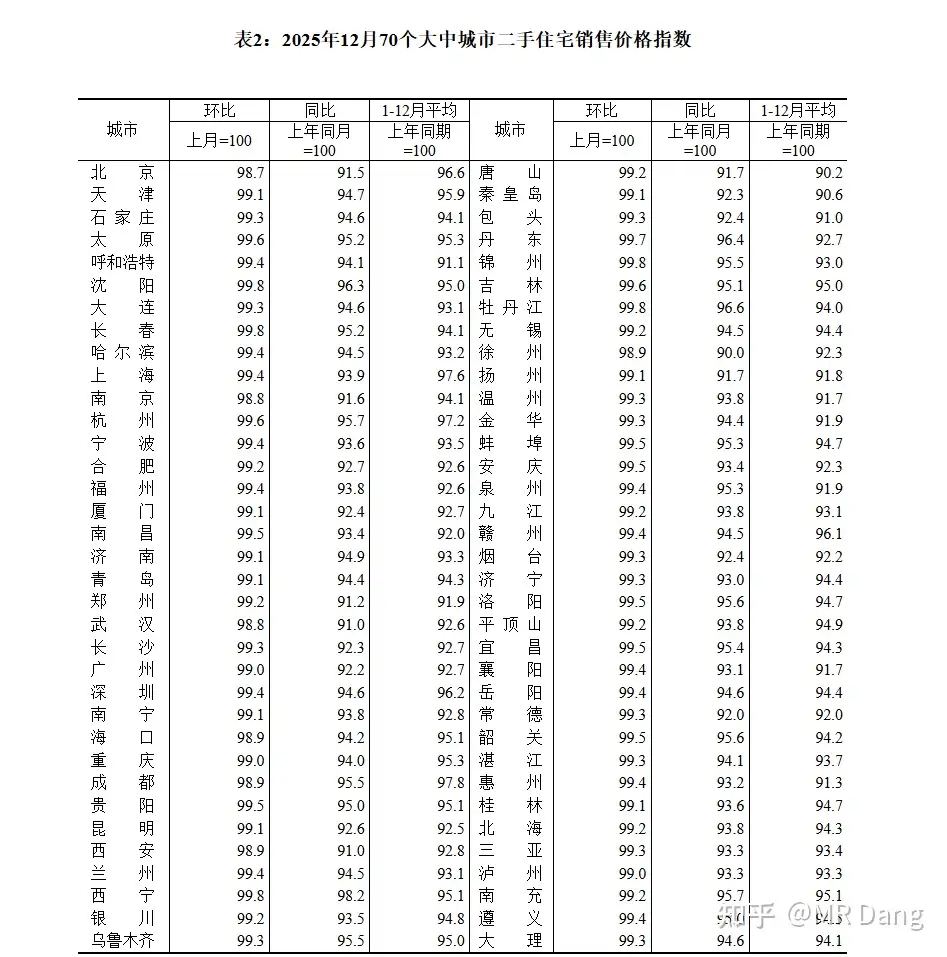
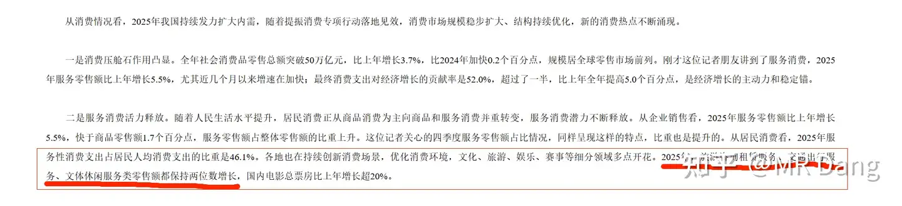
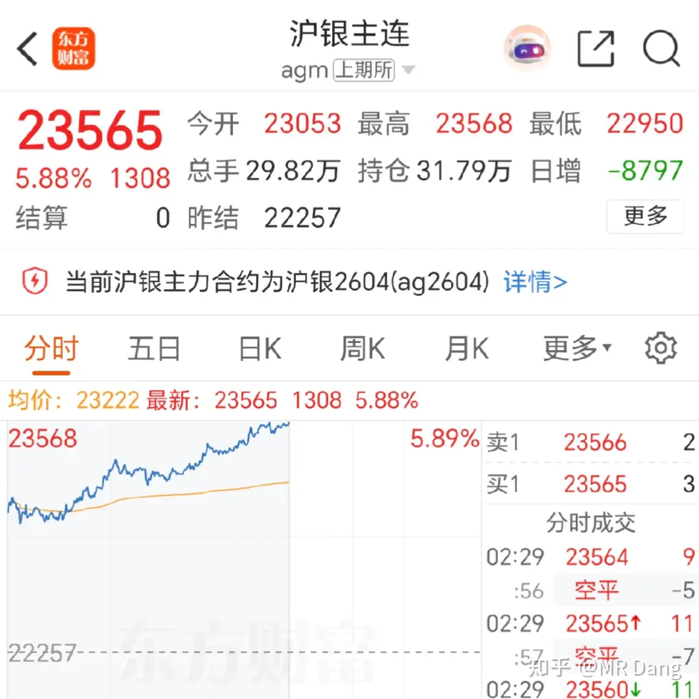
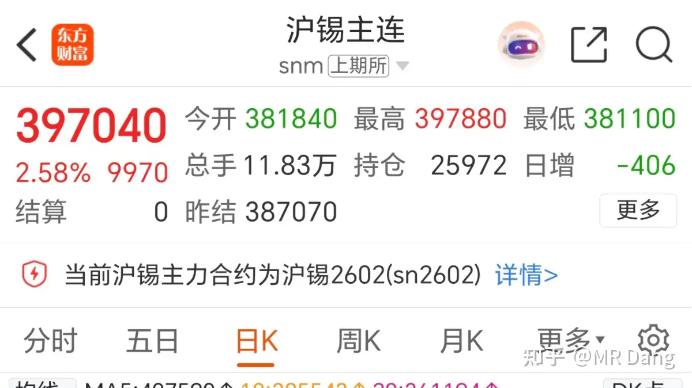
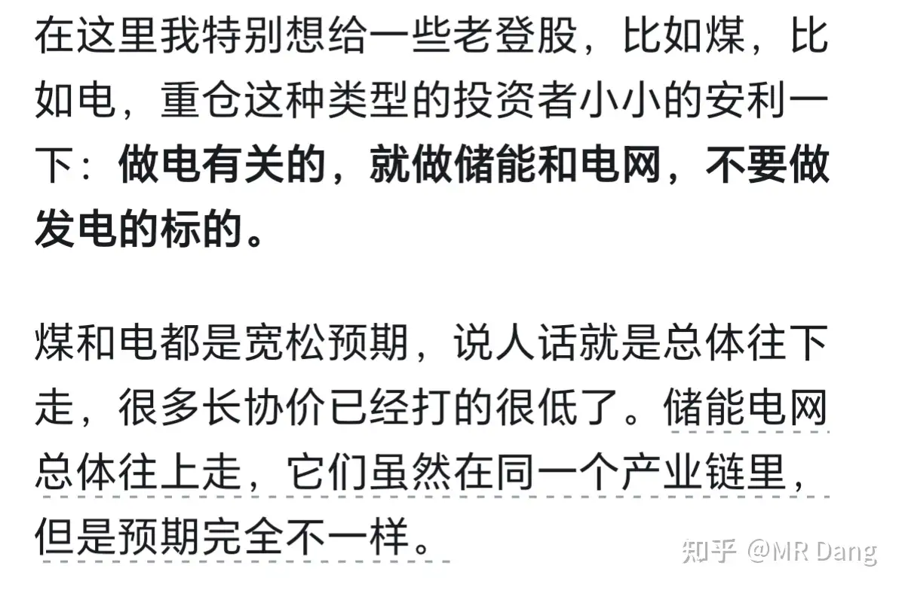
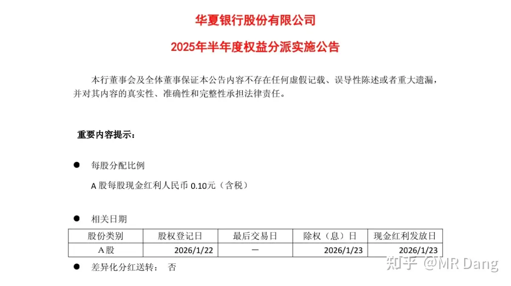
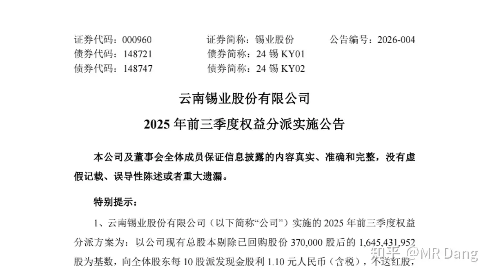
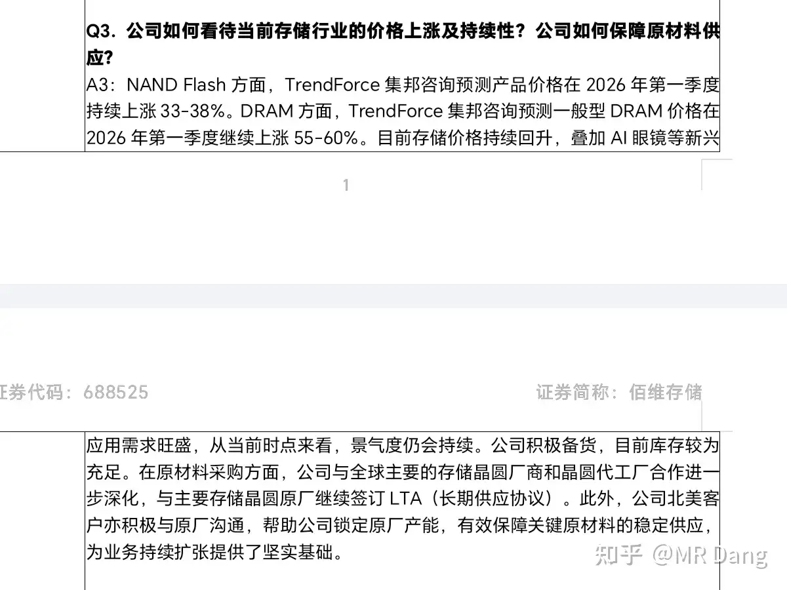

# 如何评价2026年1月20日A股行情？

---

**发布时间**: 2026-01-20 07:06  |  **原文链接**: https://www.zhihu.com/question/1996354948166866724/answer/1996840941349250647  |  **点赞数**: 1157 人赞同

**作者信息**: MR Dang​独立投资人，不接广不卖课

---

## 正文内容

最大的新闻属于公布的各项宏观数据。

对于这种宏观数据，咱们作为投资者，应该做到有的放矢，关注值得关注的数据。

不要去拿着数据搞站队，搞JZ那一套，我对评论区一向很宽容，但是如果涉及到这些还是会主动删的。

1.工业数据：

前面一列是12月单月同比增速，后面一列是全年同比增速。

那很明显，如果前一列数据比后一列数据高的比较多的话，说明当月边际改善不错。

对应的就是纺织业，医药制造业，专用设备制造业，电子设备制造业。

这个数据对我个人的投资意义就是投资布王有了更明确的宏观指引，供应端和需求端都比较明确。

也就是说怎么看数据取决于你持有的标的是什么。

再比如我持有塑料王，那我就关注塑料王的煤炭供应紧不紧张，我怎么从这份数据里看出端倪呢？

还是官方权威数据里看，原煤产量增长1.2%，火力发电下降1%。

煤除了发电，就是煤化工这些，现在煤产的多了，电发的少了，那给煤化工供应的煤会宽松呢还是会紧张呢？这个不难判断吧。

2.那个行业：

环比就是和上月比，一眼看过去都是逆增长的，对普通人的教育意义就是左侧交易要不得哦。

3.社零和社服：

一眼看过去不是特别乐观，分行业的话，化妆品貌似还看的过去，这个行业目前估值挺低的，叠加口红效应，有捡烟蒂的机会。

就是数据还不够细，彩妆和护肤还有医美没有分类，这三个完全是不同的标的，还得琢磨琢磨。

社服的话，看官方发布:

这个我之前在写佛光普照的帖子里提过类似的逻辑：

九华分析点这里

所以数据一发布，昨天恰好在资本市场有点表现，我恰好一止盈，认知变现，完美闭环。

这不是什么高深的武功秘籍，只要用心看，人人都能看的懂，学得会。

另外预告下，今天10点有个官方的会，介绍十五五的情况，下午三点有个会，介绍财政。

感兴趣的可以搜一搜，蹲一蹲，一堆数据里说不定就有可以指引方向的东西。

昨天发布的一些企业的业绩预报：

看了一圈，没有特别关注的，业绩预增的估值都不低了，光伏再次扑街。

昨天夜盘，几乎所有有色都在涨：

白银涨的最多，国际银价创新高了，沪银接近新高。

锡金铜铝之类的都有不同幅度上涨。

除此之外，商品市场比较重要的品种里，价格振幅大的还有天然气：

主要是西大那边暴雪，然后那边的天然气就涨了。

所以想在A股找机会的，掂量下合不合适。

一起来吃个大v的瓜：

两个关键词，雪球和“抢帽子操纵”。

前者就不多说了，以专业著称，但是里面如果有坑，就一定是大坑，比如这次查处的属于十万粉的大v。

至于抢帽子操纵，就是自己买进去，然后吹票，第二天就卖掉，赚家人们的钱。

这个大v还有别的平台，除了知乎啥平台都有，特别是那几个什么所谓的实盘啥的。

这也是我为什么劝诫大家不要信那些东西，只有说在前面的判断才是可信的，马后炮一律当骗子，一定要保护自己。

对很多博主都有警示教育意义，好好做价值投资，吃股息是ok的。如果妄图利用影响力扰乱市场，玩掏口袋，特别是粉丝口袋的套路，就做好被铁拳的准备。

昨天的行情没啥好说的，莫名其妙净值就创新高了，这个我说过很多次了，通过合理的组合，净值最后就是不断的创新高，虽然不会大幅度上涨，但是很稳，回撤小，持股体验很不错。

板块的话，电网比较热，但是我不想谈，因为我反感在一个板块过热的时候去讲它，电网储能这方面我在一个星期前已经提醒过持有电力板块的了：

那个时候位置低，我可以讲，你换了就占了大便宜。

现在贵了就很难讲了，涨跌的事情谁都说不好，万一到时候套一堆人，这事情就做的不漂亮了。

但是话又说回来了，以后电网如果又跌回来，你刚好拿的又是发电的东西，记得换过来，大的方向上就是预期更好。

持有的两个标的发布派息公告：

有萌新投资者会问，现在买进去有没有分红？

当然有了，去找“股权登记日”，只要那天收盘的时候你有股票，就有分红。

还有就是有没有税？

这个要看你的持股时间，超过一年就不用交了，一个月到一年是分红的10%，一个月以内是20%。

这里有个魔鬼细节是，这个持股时间按收盘时持股数量计算。

比如你拿了一万股，然后盘中你卖了一万股，在当天收盘前又买回来一万股，那就不用补税，因为你收盘时股数没减少。

持有的存储标的发了个交流信息：

对2026业绩有个表述是持续改善，这个表述比较含糊，因为同比改善也能叫持续改善，环比改善也是持续改善，但是两者差远了，同比改善就一般般了，环比改善那业绩就炸了。

对市场比较关心的库存，表述是库存较为充足，签了lta。那这样的话，说明短期内可以吃到部分的终端涨价利润，去年四季度也没有竭泽而渔。

好的说完了，再说点不好的，这份交流是一个星期前就和机构沟通过的，这中间的时间差不小了，信息差比较大。

让我想起了以前去某公司考察的时候，一群机构和公司接待人员就在车间里转悠，然后人人看着手机，耳朵听着介绍，手指头就在交易界面上。

而且面对面交流获得的信息是远超这种纪要的，语气，面部表情，肢体语言，用来掩饰尴尬的笑容，都会传达出远超纪要的信息。

交流的内容都是合规的，程序也是合规的，依然会有很大的信息差，这就是先天优势，无解。

因此对大部分投资者来说做实地调研是很有必要的，可以缩小信息差，除非你的认知属于那种从上而下，纬度高于公司层面的认知。

以上非荐股，目前价格不便宜，注意风险，不是格式条款，是真心话，不懂的东西不要买。

今天等下会有lpr的消息，95%可能性保持不变，也就是一年期3.5%，五年期3%。

如果和这个预期不一样，比如降了，那就是远超预期。

至于我个人的话，根据目前的态势，讨论止盈好像是可以的，止盈也算保护韭菜嘛。

但是建仓什么的，我会继续模糊处理，大家也别问这个能不能买，那个能不能买，主要是要衡量风险和收益，需要自己考虑清楚潜在的风险和收益。

咱们主要是讨论企业经营层面的，交易的事情我不太懂，鄙人不善择时。

我只能说就目前的经济形势而言，钾，磷和铝的预期中短期内还行，某些化工品种也可以，锡的波动大，但是远期预期好。

一个喜欢保护韭菜的博主，希望大家少少踩坑，多多赚钱！！！

---

## 精选评论

| 用户 | 时间 | 内容 |
| :--- | :--- | :--- |
| 知乎用户齐 |  | 鄙人极善择时，买进必备套牢 |
| 十六 |  | 这是涨粉的后果吗？ |
| 阑干 |  | 老师，早上好～再次默念：投资就是在深入研究分析后，保障本金的安全的同时，追求理想的收益。今日温习：1.宏观数据是基本面，从趋势看供求关系2.投资组合稳增长，安全又稳健3.股权登记日收盘计量有分红4.老师帮大家做了最最重要的标的物对比和分析，交易是每个人自己的事情（有不同的境遇（成本）） |
| &nbsp;&nbsp;&nbsp;&nbsp;MR Dang |  | 总结的精辟 |
| 想养一只猫 |  | 给课代表点个赞 |
| 乌获 |  | 1月20日A股行情（部分笔记）1.宏观数据A.工业数据-tkgf前一列是12月单月同比增速：指的是25年12月和24年12月相比的增长率。后一列是全年同比增速：指的是25年全年与24年全年相比的增长率。当月边际改善：我们把25年比24年的“全年同比增速”看作是25年一整年经济增长的平均成绩单，就是一个“基准线”。那么12月数据>全年数据就说明，在年底这个时点，该行业企业的生产活动比全年平均水平更活跃，需求可能更旺盛，该行业呈现回暖、走强的态势。高的越多说明改善的力度越强、动能越足。*边际改善：“边际”指的是新增的、额外的、最后那一单位的，强调新增变化，而不是绝对水平（比如全年增速-1%，12月增速-0.5%，这也叫边际改善）。边际改善就是指“在最新的、增量的变化中，情况正在变好”。描述的不是现状好不好，而是趋势最近有没有变好。在此处的理解就是“在12月这个最新时间点上，与过去一整年的平均水平相比，经济增长的动力出现了额外的、积极向好的变化。”对应的就是纺织业、医药制造业、专用设备制造业、电子设备制造业。这个数据对老师来说，就是投资布王（tkgf）有了更明确的宏观指引，供应端和需求端都比较明确。供应端我的理解是tkgf以pta、聚酯和涤纶纤维制造业为主，其涤纶长丝产能自2009年起位居全球第一并保持至今，也就是要多少有多少。另外纺织业整体生产活跃，也意味着行业的产能利用率在提升，而不是整体萧条。需求端的话，tkgf收入绝大部分来自化纤业务，产品以内销为主，那么其下游的服装、家纺等终端生产商景气度回升也意味着需求增加。另外tkgf于2025年在取得了储量约5亿吨的优质煤矿，计划建设年产500万吨的煤矿项目。此举旨在向上游产业链延伸，打造成本优势。也就是油价跌了，我有成本优势，油价涨了，我用煤替代，也有成本优势～B.统计局数据-煤炭供应-bfny·原煤产量再创新高：2025年，煤炭先进产能有序释放，稳产稳供稳价措施深入实施，煤炭供应保持稳定充裕。规模以上工业原煤产量48.3亿吨，创历史新高，比上年增长1.2%。·电力生产稳定增长：2025年，规模以上工业发电量97159亿千瓦时，比上年增长2.2%。其中规模以上工业火力发电量62945亿千瓦时，比上年下降1.0%。水力发电12144亿千瓦时，比上年增长2.8%；核能发电4812亿千瓦时，增长7.7%；风力发电10531亿千瓦时，增长9.7%；太阳能发电5726亿千瓦时，增长24.4%。煤除了发电，就是用于煤化工，现在煤产量增加了，用于发电的少了，那煤化工的煤供给就会宽松，则煤更实惠了，煤油差价也会更大或者保持，利好bfny。2.FDC行业这个主要看二手F的数据（主要由买卖双方自由协商定价，更加体现市场实际供需），数据显示逆增长，切忌左侧交易（不要以为便宜了想抄底，下跌不言底～我吃过这个亏～）3.社会消费品零售总额&社会服务数据A.社零化妆品行业12月单月同比增长8.8%，较25年全年同比增长5.1%有增加，跟前面几个行业类似，是边际改善了。目前该行业估值较低，叠加口红效应，有捡烟蒂的机会。化妆品行业包含彩妆、生活美容、医学美容几个分支，老师表示要细致研究一下。借鉴老师之前的思路，我想到的是上游原料行业以及铲子行业。原料行业（上游）：不管是生活美容还是医学美容都需要用到的原料，比如玻尿酸、胶原蛋白。这个行业的公司比如hxsw、jzsw、jbsw，并且这些公司自产自研原料的同时，在医美、生美领域都有布局。原料行业是高毛利行业，我认为主要看研发&技术壁垒。铲子行业（中游）：主要是代工厂以及包材厂。比如化妆刷代工（sykj)、护肤品代工（bwgf、qsgf)以及包装瓶（xgkj、jsxc、jhjh）。其中化妆刷生产是美妆工具中最大的细分品类，我自己觉得是不管哪个牌子的彩妆，都要用化妆刷。铲子行业毛利相比较低，我认为主要看规模&成本控制另外还有个相关行业是代运营。主要是销售渠道搭建、品牌运营，比如sygf。个人比较青睐上游行业。目前的上游行业的几个比较厉害的公司已经是研发、生产销售一体化了，不需要代工和代运营。我所了解的竞争的点主要是两个，一个是新材料的研发&落地（这个需要的时间比较长，尤其是三类医疗器械的批准），一个是销售渠道的搭建，比如下面四个公司：·jbsw：经销为主，25年引进了yst（农夫山泉的母公司）做战略合作，除了资金投入之外，一部分考虑就是借助yst的渠道。·amk：深度专业直销，25年收购了韩国的REGEN，等于同时拿到了一个拳头产品（爱苏菲俗称“童颜针”）以及该公司自有的全球销售渠道。不过这笔收购目前存在一些法律纠纷，amk被这个产品原来的国内独家代理商起诉了～·jzsw：与孩子王联合收购了专业养发机构“丝域实业”，该公司拥有超过2500家门店（含176家直营店）和超200万会员。等于瞬间获得了一张覆盖全国的线下渠道网。·hxsw：在韩国有子公司，与lg生活健康共同研发抗衰老技术，与COSMAX聚焦口服抗衰新材料的研发，目的不再是提供原料，而是凭借其全球最大的合成生物研发制造平台，与韩国企业共同开发新产品、制定标准。另外jzsw目前也在优化渠道建设，提升直销占比，并且线下开设了体验店、旗舰店，提升服务、增强终端售价的控制力以及降本增效（省了很多“流量费”和主播直播间的“坑位费”），2025年上半年，其“渠道及推广宣传费”同比削减37%。就是能生产的出来 也要能更方便的更低成本的卖出去。又来跟老师学习啦 嘿嘿如有错漏 恳请指出 |
| &nbsp;&nbsp;&nbsp;&nbsp;MR Dang | 22 小时前 | 学习了，到时候写一份心得体会给你，嘿嘿 |
| 瑞布克 |  | 朴素的道理：合理的组合，对冲的布局，不求追板，回撤小，净值最后就能稳步新高。 |
| 周周家的周 |  | 大佬新粉，也是10多年的老韭菜。以前一直觉得股市就是一个盲盒，不知道从哪下手。那天读到大佬的人遛狗说法，豁然开朗。之前看一堆人在分析k线，各种划线。我就在想，你能划线划出来，别人不也能吗。现在明白了，这就是在猜狗的路线，没啥意思。价值投资组合才是王道 |
| &nbsp;&nbsp;&nbsp;&nbsp;MR Dang |  | 一朝顿悟 |
| 三哥数签签 |  | 我是个软件工程师，这种看k线找什么压力、支撑、金叉、死叉，对计算机来说不就是毫秒级的事情吗？如果靠这个可以挣到钱，程序员都应该是世界首富了。 |
| 白羽 | 23 小时前 | 好量化确实能赚钱啊 |
| 陈书言 | 22 小时前 | 量化出来后那些看k线炒股的就没有意义了。钱没量化机构的多，规则没量化的落实严格，反应还没量化的快，还怎么和它玩？所以我在b站上看到那些研究k线，还整出一个个唬人的名词，我就想笑，留给散户的只有价值投资一条路 |
| 三哥数签签 | 19 小时前 | 一个好字太难了，做量化，挨打的比吃肉的多得多。 |
| 豆豆 |  | 昨天还想着买点化工etf，结果一看yth、ktgf、bfny、gggf沾边的不知不觉已经占了仓位3成。顿时感觉近期hxyh和gggf是最近唯二赶补仓的了。 |
| 蛮王石头人 |  | 大佬早，说起大v荐股的这个，我个人深有感触，也算是吃了一个不大不小的亏，这里简单的说一下，大家也可以看看有没有碰到相似的情况。19底年，初入市场，一开始学的是长投，里面买的是基金，当时通过里面学习的各类基金筛选方法，投了中证500的基金，后面也觉得来钱太慢，就慢慢的开始看股票，也许是知乎上跟股票相关的话题刷的太多了，一时间打开知乎，里面刷新的全是和股票相关的内容，也正是在知乎上看到几个讲股票的，里面讲的各种龙头啥的，贴了很多趋势图，买卖点啥的，看起来非常厉害，最下面有一个免费加群，就加了。加是免费群，大约有七八十号人，但是只有一个群管理和两三个人说话，每天上午和下午都会发复盘消息，晚上八点或者九点还会有什么老师直播讲技术分析的，当时沉迷技术分析，看的津津有味，也学着其讲的方法，去通达信里面筛选股票。免费群只有一个月的时间，一个月的时间过了，群管理就回来私信你，说马上到期了，要么把你移出去，要么你可以参加实盘群，这是实盘群里面有很多牛散，一两个月可以翻一倍的那种，实盘群会实时更新这些牛散的操作，里面的人可以跟着操作。但是实盘群是有费用的，3500一个月，三个月是9800，半年15000。我当时一个月工资才6400，看到这个吓我了一跳，我说不了，我没有那么多钱，群管理就说，给你打个折，你可以先500体验一下，要是好，只要再补3000体验两个月个月试试，我自己给你贴补一个月的费用，要是不好，你就花500，也亏不了多少，还说自己是什么广东经济日报下面的机构，我看收款也是那个，然后那边就发来收款码，我扫了后，进去，群里面有一个公告，里面贴着一个牛散的排行版，我看第一个的收益是半年翻了3倍，一下子给我整高潮了，觉得自己只要马上跟着操作，一定也可以翻三倍，到时候，一个月3500的费用算什么，然后就是跟着买的第一个票，三角防务，不到一个星期赚了30%，给我高兴的，马上找群管理续了一个月的，然后就是继续跟着群管理操作，之后的票有金冠股份、远望谷、双龙股份、银邦股份、杭氧股份、数字认证、金丹科技、中科海迅，买了很多的票，就两个月的时间，我工作存了两年才存的10万块钱，就给我亏了四万八千多，期间群管理还来各种安慰说，牛散也会操作失误，下一个票一定会赚回来的，当时也是着了魔，也是傻傻的信了，直到第二个月末，群管理说时间到了，还继续跟不？我把亏损的截图发给他看，他还是说人都会失误，慢慢再赚回来就行了，我又气又恼，气的是我怎么这么蠢，恼的是我怎么这么傻。之后那一两个月晚上怎么都睡不着，整个人都被泄了气一样，好在后续真的是上天眷顾，中了一个新股，中船汉光，一下子给我回了一大口，回了一万一，然后又狗屎运的买了华兰生物和金徽酒，两个每个回了将近5000，才一下子让我缓过来，后面就是中证500基金，赚了2000多，这下净亏只有26000左右了，才稍微好点儿，想了一下，自己蠢，炒股我不是那块儿料，再加上有买房的需求，就当是买个教训，就一键清仓退市认亏。前车之鉴，后事之师，这也是我现在在知乎上看到任何讲投资的也只是看看的原因，尽管其讲的真的很有道理。，这里附一个当时的付款截图 |

---

*本文件由自动脚本从MR Dang知乎页面提取生成*

---

**作者**: MR Dang
**链接**: https://www.zhihu.com/question/1996354948166866724/answer/1996840941349250647
**来源**: 知乎

*著作权归作者所有。商业转载请联系作者获得授权，非商业转载请注明出处。*