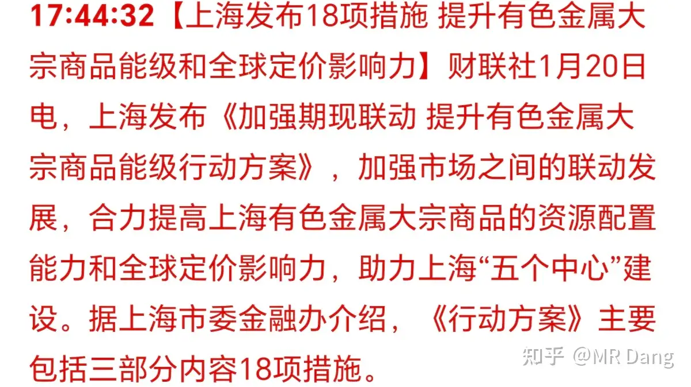
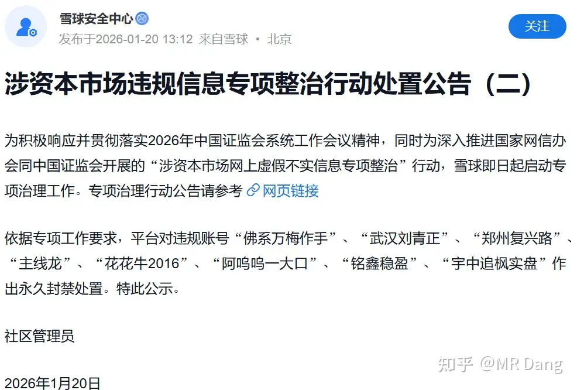
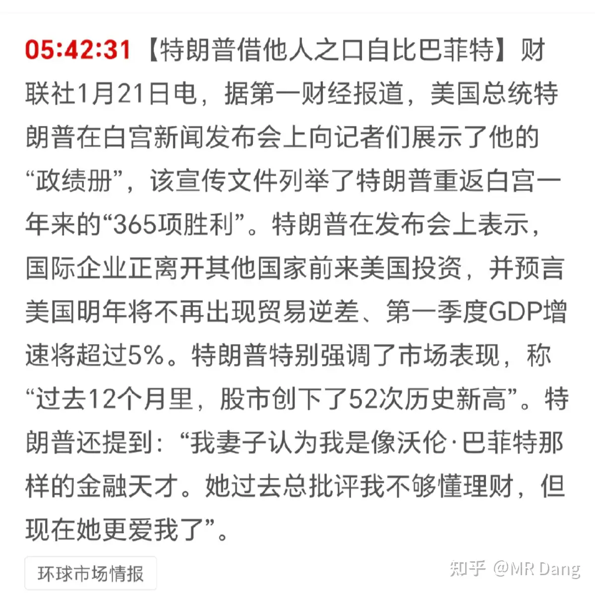
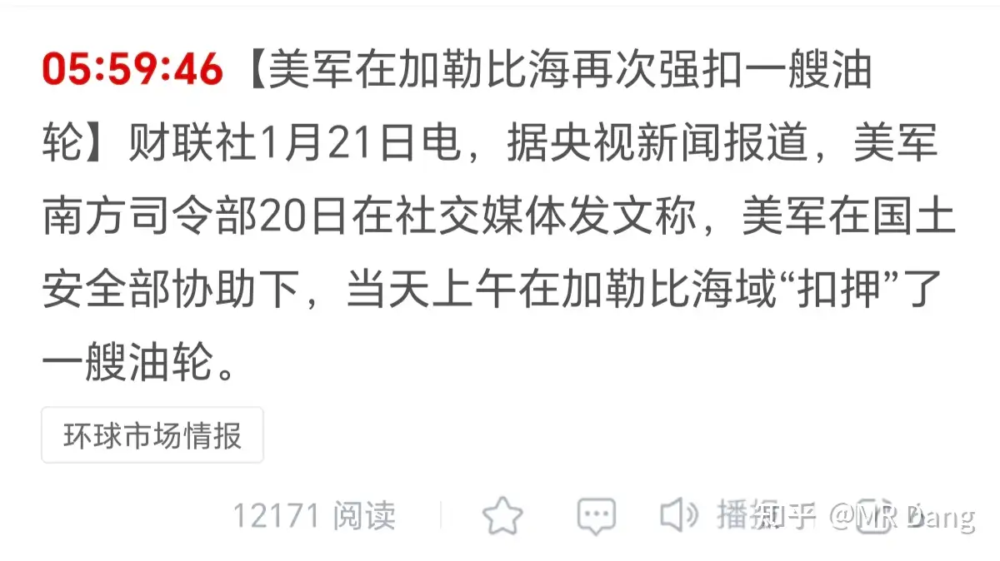
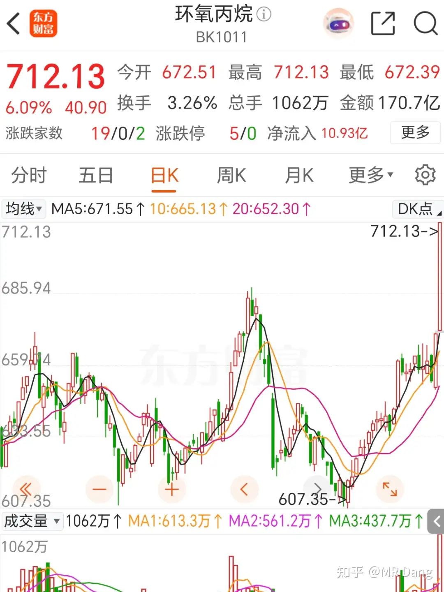
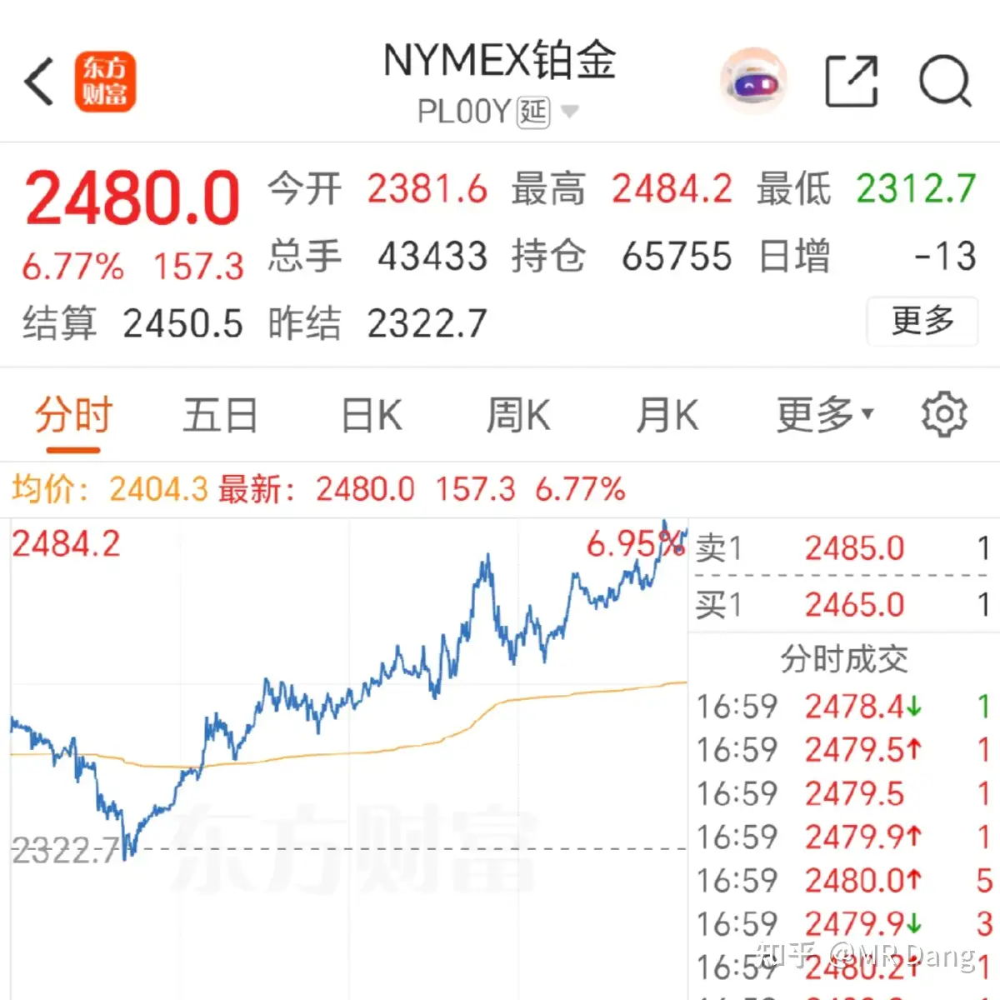
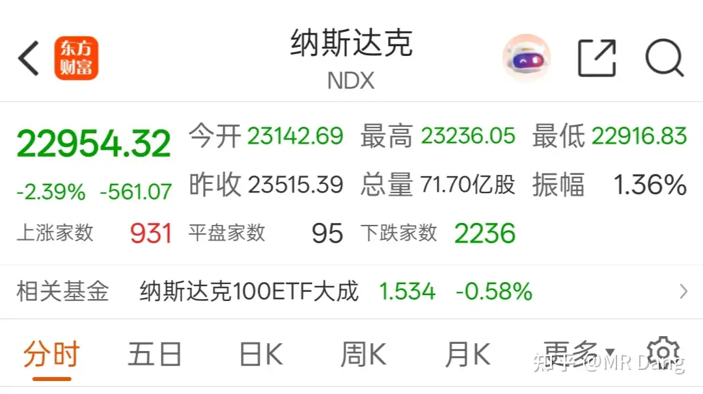
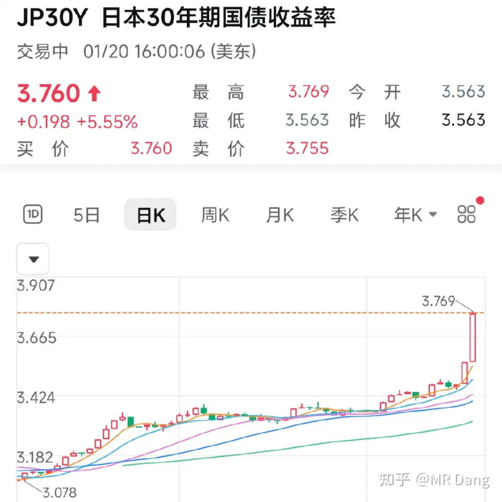
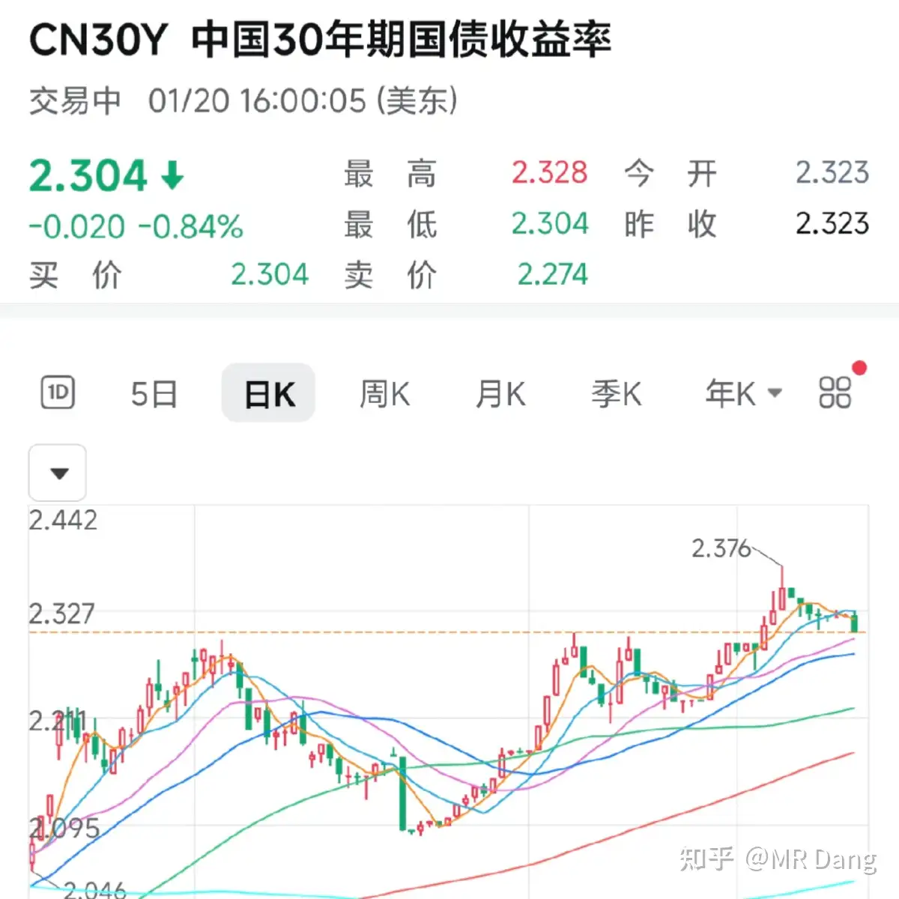
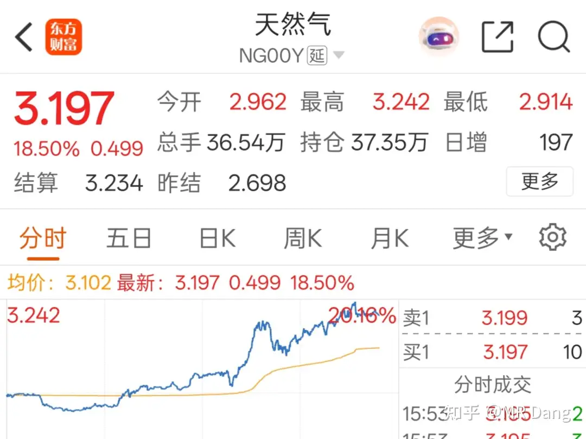

# 如何评价2026年1月21日A股行情？

---

**发布时间**: 2026-01-21 06:59  |  **原文链接**: https://www.zhihu.com/question/1996700990360023657/answer/1997201676138988276  |  **点赞数**: 1104 人赞同

**作者信息**: MR Dang​独立投资人，不接广不卖课

---

## 正文内容

今天头条给到u23国足吧，半决赛中3：0战胜越南，与日本会师决赛。

以前玩梗的时候说白天当股民，晚上当球迷，买国足输无风险套利。

现在真是好起来了，股市支愣起来了，连足球都有进步了，恭喜国足从小组赛不失一球挺进决赛。

相关投资标的能扯上的主要是做人造草坪的，有两家，我看了下估值不贵，业绩还行，这也算铲子股吧。

（笑，说着玩的，别当真）

上交所要大宗的定价权：

这啥意思呢？就是咱们是很多大宗商品的第一大买家和第一大卖家，结果这东西值多少钱咱们说了不算，要看伦敦和纽约的成交情况。

咱们现在腰杆硬了，这事不能就这么下去，所以要夺回定价权，要让咱们说了算，自己来定游戏规则。

昨天的瓜继续吃：

隔壁平台一些黑灰产的已经被处理了。

与之相关的还有几个和大v深度绑定的标的。

持有的人注意风险，树倒猢狲散，到时候可没人来接盘了。

懂王自比巴菲特：

要我说懂王还是谦虚了，巴菲特可画不了k线图，在择时方面懂王称得上人类历史第一。

谈笑间，海贼王在加勒比海又抢了艘船：

现在加勒比海盗的装备未免也太精良了，这谁顶得住。

商品市场有新动静：

昨天环氧丙烷价格大幅上涨：

很多人不知道环氧丙烷是干啥的，简单的说就是用来做泡沫的，软的硬的都有，以下我们简称泡沫来代替环氧丙烷。

泡沫的生产工艺大体上有三个路线，氯醇法，共氧法，hppo法，先进性依次提高。

产量二三十万吨以上的，有四家主要企业在做，分别是w，z，b， q。

w是行业龙头，工艺先进，做的比较杂，泡沫在它的业务里占比不是最高的，我个人排除。

z和q工艺也可以，但是业绩一般，估值有点贵。

b估值便宜，财务可以，产能可以，只是工艺落后。

以上这段话看不懂没关系，交给ai，让ai分析，我不推荐的哈。

受海贼王夺岛奇兵事件影响，有色里黄金和铂金携手大涨：

黄金创新高：

波兰计划新购150吨黄金，从550吨提高至700吨，占全国外汇30%以上。

铂金也不差：

其他有色品种表现一般（相对于昨天收盘价），小幅调整。

纳指调整，除存储外其他品种跌多涨少。

恒科的家人们说不得今天又得吃瘪了。。。

电车我劝了很久了，快劝不动了。

因为电车行业有一个很危险的事情，就是所有的电车掌门人都认为今年电车行业没增长。

但是几乎所有的管理层定的目标都是增长的。

这很像几年前的光伏，都觉得自己能卷死对面。

最后的结果就是绞肉机，大家一起被绞成肉泥。

这么多预期好的赛道不做，非要做一个马上要开始疯狂卷的行业，非智者所为。

美债日债迎来大规模抛售：

很多人会看的有点懵，这不明显上涨么？怎么叫抛售？

其实图中的是国债收益率，不是国债价格。

国债收益率上升意味着需要给债券持有人更多的利息，你不加钱，人家就不要你的债，明显的嫌弃。

所以国债收益率上升等同于债券被抛售。

两边都是疯狂发债，债券持有人担心还不上钱，就开溜了。

再看金价和有色价格，大规模资金的迁徙路线非常明确。

可能还有人好奇东大的债券，我也贴一张：

把这个当做估值模型中的无风险收益率也没问题。

西大暴雪继续，时有车祸发生，天然气价格大幅上涨：

天然气板块持股体验也是挺差的，有些股在牛市里也没少跌。

持有的BT发布了业绩预报：

中位数9.35亿，折合每股0.965。

按60%派息，则每股分红大约0.58左右。

对应目前股价股息率不到5%。

按照之前的激励方案，感觉可能就是刚好卡着9.6亿的线。

对公司没研究的人可能会觉得是利好，增长这么多，但是像我这样持有的人来说，我觉得也就能给个60分，勉强及格或者刚好不及格。

那个90万吨还是批复的晚了，去年来不及了，留一些业绩到今年结算，看能不能到100分档。

以股息率为锚的话，这个价位可能相比磷王优势没那么大了。

但是如果赌增速的话，2026也不是不能赌一把，如果落到100分档，能有50%增速，还是挺不错的。

去留看自己，我只是客观陈述一下这个事情。

除此之外的业绩预告也给大家贴一下：

这个榜单里稍微超预期一点的是榜三。

比较让人失望的是超市，调改后的门店我去看过，其实讲道理真的可以，服务，体验，产品，除了价格贵也没什么大的槽点。

他是商业模式不行，无解。

投资它属于典型的价值毁灭，而且因为知名度的原因里面会有很多散户，最后可能会出现非常惨烈的结局。

我的读者里一定有人持有它的仓位，谨慎考虑吧。

昨天的行情平平无奇，收盘一看还不错，净值继续创新高，增长的还可以。

除了空仓市值涨了不少，剩下的变态组合，存储邪修都表现的挺亮眼，其他的也没怎么拖后腿。

这里我提个醒，如果按照我没有组合的情况下，这个位置我塑料王就止盈了，现在之所以不止盈，是因为押注化工的大周期，而且有了对冲，拿着踏实。

你们没有搞成组合的，16块多17块多进的那批，该止盈就止盈，不用担心会砸到我，我身板还算硬朗，扛得住。

存储也是一个道理，很多人应该也到止盈线了，该跑就跑，30%了还有啥不满意的，赚钱的机会哪里都有，实在舍不得也可以止盈一部分。

安全第一，风险控制，仓位管理。

看看隔壁宇航员，惨烈程度，触目惊心。

咱们虽然没有相关标的，也应该有所警惕，间接经验也是经验。

还有就是，一定一定一定，不要想着去抄底热门股，一看回调二三十个点自以为聪明去捡便宜，一旦失手，几年翻不过身的。

记心里，不然到时候又来评论区忏悔，我也无能为力啊。

哦对了，多说一句，最近有几个名字里有银，但是没什么银矿的股票炒的比较凶，我建议大家回避，风险不小。

君子不立危墙之下。

一个喜欢保护韭菜的博主，希望大家少少踩坑，多多赚钱！！

---

> [!comment]- 点击展开精选评论
>
> | 用户 | 时间 | 内容 |
> | :--- | :--- | :--- |
> | 卡夫卡卡 | 8 小时前 | 党师早，昨天涨薪14.5%，股票也开始回正了。报喜。 |
> | 愚人杰AI生活 | 8 小时前 | 想了想，还是不点赞了，嫉妒 |
> | 牛教授 | 7 小时前 | 你说的"b"对应的是滨化股份（601678），它完全符合图中描述的特征：- 产能规模：环氧丙烷产能约51万吨/年，是国内最大的氯醇法环氧丙烷生产企业之一，产量在二三十万吨以上，属于头部企业。- 工艺类型：以传统氯醇法为主，是图中所说的"工艺落后"的典型代表，面临环保升级压力。- 估值与财务：​https://市净率仅0.90，处于行业低位，财务状况稳健，符合"估值便宜，财务可以，产能可以"的描述。补充对应关系- w → 万华化学（600309）：行业龙头，工艺先进，业务多元，环氧丙烷占比不高- z → 卫星化学（002648）或维远股份（600955）：工艺较优，但估值偏高- q → 齐翔腾达（002408）：HPPO法工艺，产能规模大，但业绩表现一般以上全部来自豆包ai |
> | 更深的蓝 | 8 小时前 | 老师早安最近村里在清理坐庄吹票的大V，老师千万小心别被误伤了 |
> | &nbsp;&nbsp;&nbsp;&nbsp;MR Dang | 8 小时前 | 不能，我一向不碰，没群没圈子 |
> | 飘在豫西北 | 7 小时前 | 地产突然拉升  什么情况 |
> | &nbsp;&nbsp;&nbsp;&nbsp;MR Dang | 7 小时前 | 股价波动太正常了 |
> | 一灯 | 8 小时前 | 这么多股里我捡了芭田和国光，自己选的，慢慢等 |
> | &nbsp;&nbsp;&nbsp;&nbsp;MR Dang | 8 小时前 | 不差的，风水轮流转 |
> | 香蕉就是布呐呐 | 8 小时前 | 做梦梦见大佬今天的更新是对着中国地图讲每个省份的矿产分布，特色企业，发展定位。又谈到天文地理，比如降水线移动，黄历对股市的影响。美其名曰价投的必备修养。把我这个小脑瓜"唬"的一愣一愣的。 |
> | &nbsp;&nbsp;&nbsp;&nbsp;MR Dang | 8 小时前 | 做梦都能梦到我？？啊，不是冒犯，没异性朋友么 |
> | 牛马协会副秘书长 | 7 小时前 | 根据公开行业数据，中国环氧丙烷（即你文中简称的"泡沫"主要原料 propylene oxide）的大型产能企业主要集中在几家化工/石化集团及其上市公司身上。下面是结合市场产能、公布产量规模和上市公司布局，对原话中提到的W、Z、B、Q的较合理对应判断（不构成投资建议，仅为行业知识整理）：🧪 可能对应关系分析W — 万华化学（600309.SH）万华化学是中国大型化工企业，在环氧丙烷领域产能上规模较大，并且技术布局较全面（包括多种工艺路线），业务多元化。符合"行业龙头，工艺先进，做的比较杂，泡沫占比不是最高"的描述。Z — 齐翔腾达（002408.SZ）齐翔腾达在行业内拥有较大产能（例如有30万吨/年装置）且是HPPO等工艺的代表企业之一。业绩表现中规中矩。可能是这里所指的"工艺也可以但业绩一般，估值有点贵"。B — 滨化股份（601678.SH）滨化是传统环氧丙烷产能较大的一家，过去多采用落后工艺，但产能规模不小，且估值较为便宜、业绩财务相对稳健，符合"估值便宜、财务可以、产能可以、工艺落后"。Q — 怡达股份/南京依达（300721.SZ）怡达股份也是环氧丙烷生产企业之一，产能相对中等，市场表现平平，估值偏贵可能与市场预期有关。这里"Q"更可能指这类中等规模、业绩一般的上市公司。 |
> | MR.保护伞 | 8 小时前 | 苏超火的时候，还干过共创草坪 |
> | 牛教授 | 7 小时前 | 苏超火之前，我看场边广告，搞了江苏bank和龙蟠，小赚了一笔 |
> | 屁兜 | 7 小时前 | 都是小能手 |
> | MR.保护伞 | 7 小时前 | 机灵鬼 |
> | st枫林听雨 | 3 小时前 | 那时候好可惜 启动前看了没买 |
> | huhu | 8 小时前 | 又要的饭了，等我研究下怎么送咖啡，给大佬送点心意！ |

---

*本文件由自动脚本从MR Dang知乎页面提取生成*

---

**作者**: MR Dang
**链接**: https://www.zhihu.com/question/1996700990360023657/answer/1997201676138988276
**来源**: 知乎

*著作权归作者所有。商业转载请联系作者获得授权，非商业转载请注明出处。*

---

## 相关阅读

**📅 每日行情评价：**
- [[20260122-如何评价2026年1月22日A股行情？]] - 懂王夺岛奇兵后续
- [[20260123-该怎样评价2026年1月23日A股行情？]] - 央妈降准降息空间
- [[20260120-如何评价2026年1月20日A股行情？]] - 有色板块延续强势
- [[20260119-对2026年1月19日A股市场行情预测]] - 市场前瞻

**🏭 行业板块分析：**
- [[20251105-黄金投资突然上了枷锁]] - 黄金投资政策解读
- [[20251102-《天阶功法卷四》磷化工投资价值分析]] - 磷化工板块深度解析

**💰 投资方法教育：**
- [[20251023-价值投资的误区有些什么？]] - 避免价值投资陷阱
- [[20251016-投资新手避坑指南之追热点]] - 热点炒作的风险警示

**📊 宏观与资产配置：**
- [[20251027-男子囤积500万枚5美分硬币对冲通胀]] - 通胀对冲策略分析
- [[20260112-如何看待2026年1月12日A股行情？]] - 债券抛售与资金迁徙

**🔙 返回：**
- [[每日行情评价]] - 全部行情评价文章
- [[MR Dang 知乎文章总览]] - 返回主目录
