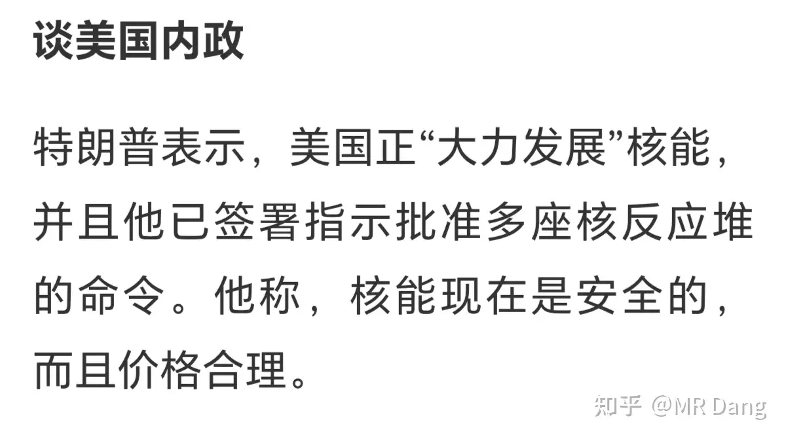
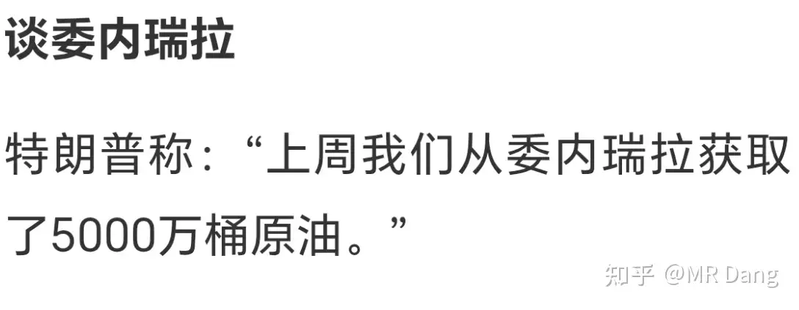
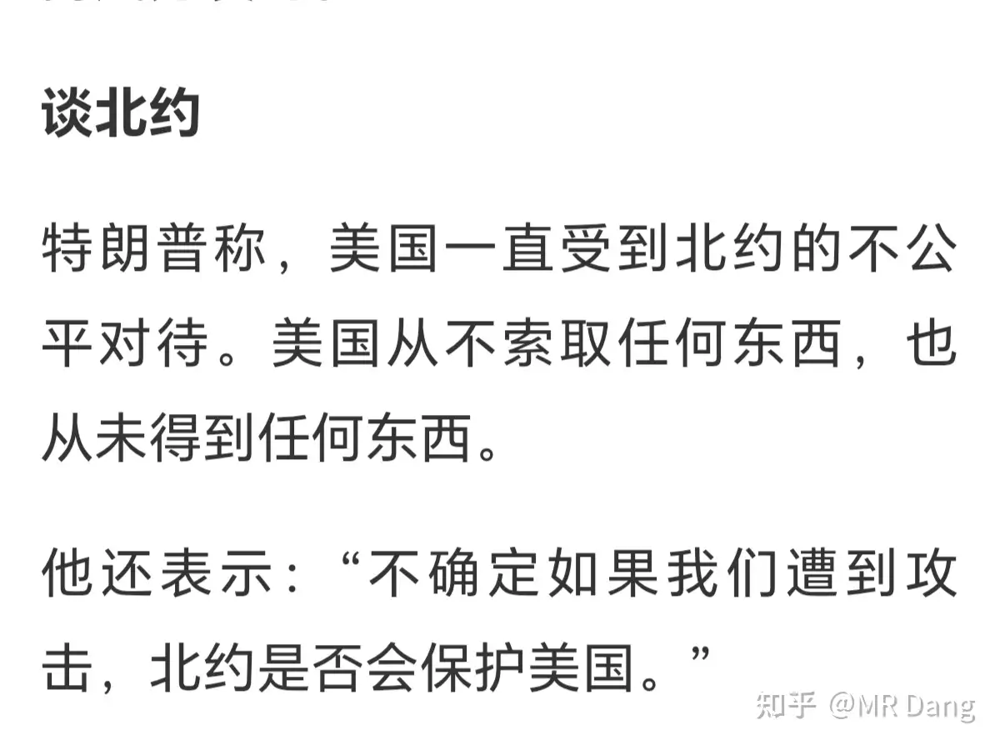
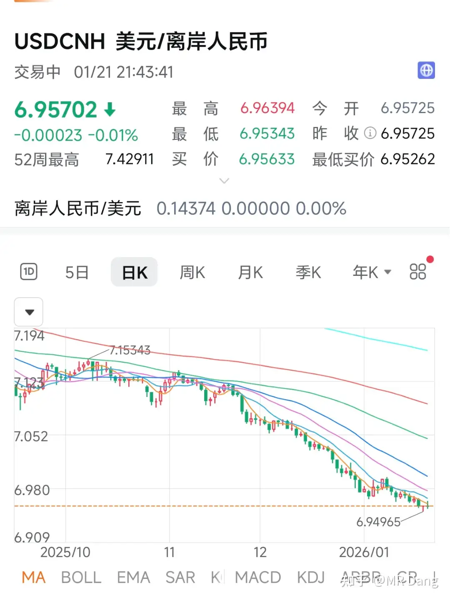
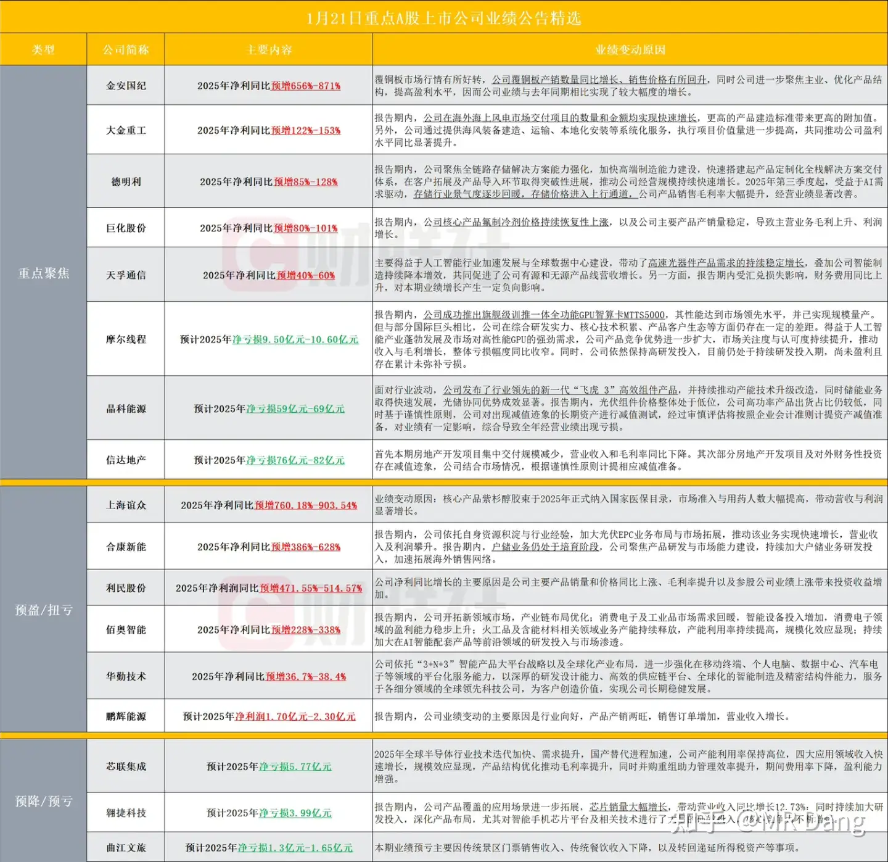
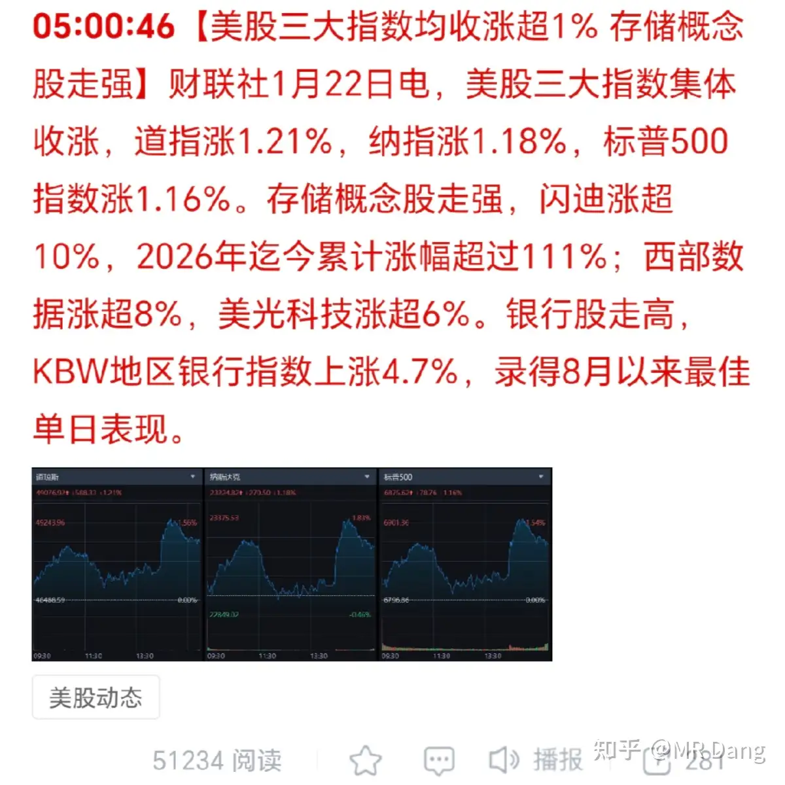
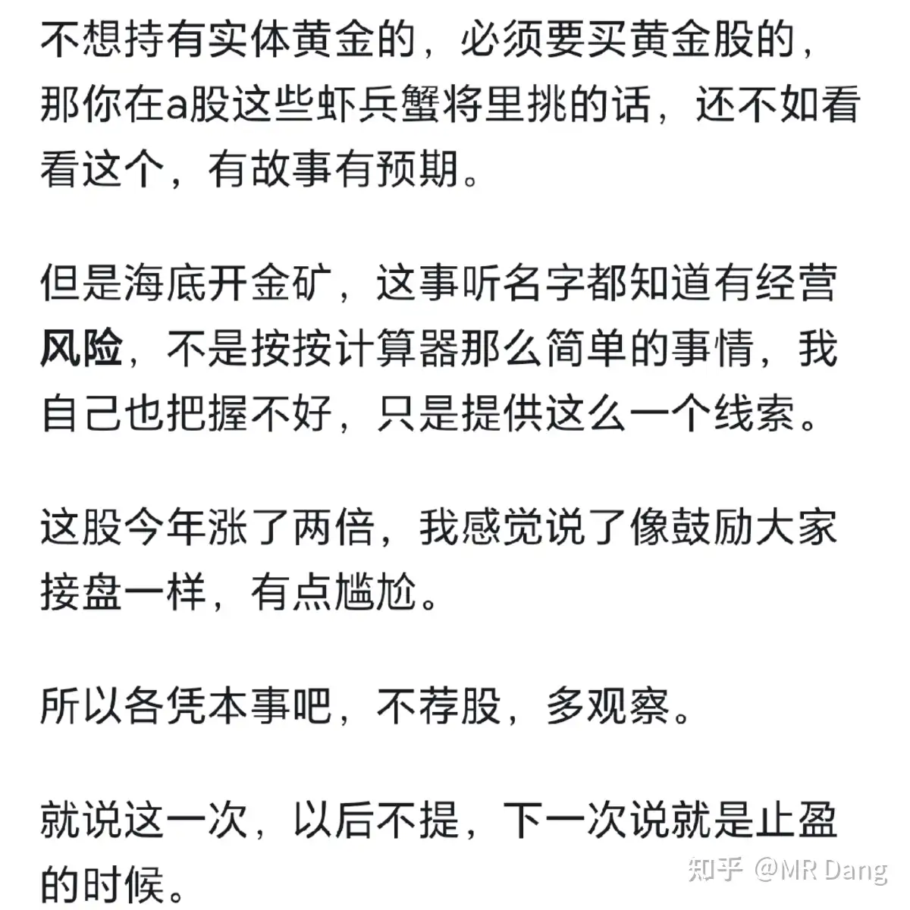

# 如何评价2026年1月22日A股行情？

---

**发布时间**: 2026-01-22 07:15  |  **原文链接**: https://www.zhihu.com/question/1997095052229502010/answer/1997567933845639475  |  **点赞数**: 1778 人赞同

**作者信息**: MR Dang​独立投资人，不接广不卖课

---

## 正文内容

头条必须给懂王，不愧是一己之力养活了全球一半的自媒体的男人，太有活了。

夺岛奇兵有新进展：

这图居然是懂王自己发的你敢信？

后面发言时说自己还是想买：

海贼王原话是：this is our land

我听这话里的意思是把岛上原住民当印第安了？

除此之外懂王还有金句爆出：

受此影响，美核能股上涨。

对委内瑞拉原油点了个赞：

吐槽北约对美不公：

这个倒是不意外，以前有过类似的表述。

瑞典在此之前已经一键清仓：

这不是丹麦威胁要抛售，而是瑞典已经抛售，据报道规模大约77到88亿美元之间。

这钱怎么说呢，对国家来说不算大钱，但是这个代表了一种态度。

对我们A股也会有深刻的影响，影响如下：

1，欧美之间的联系是紧密的，互相之间都有投资。

如果这种信任被破坏，则会互相抛售手中持有的债券甚至股票。

但是钱是不会消失的，只会换一种方式存在。

目前看除了黄金，各种饼之外，a股也是可能的选项。

那么就会出现，抛售外币资产，购买人民币资产，造成汇率的波动：

这种汇率的波动会进一步增强a股的吸引力，提升a股的估值。

2.由于这些资金是新进来的资金，所以他们的审美偏好就会引领资本市场短期内的审美。

那么他们的审美是什么呢？

美股什么板块估值最高，炒的最高，那就是他们的审美，按照最近的行情，那就是半导体，存储之类的。

所以接下来的一段时间内，如果夺岛奇兵事件越闹越大，不但贵金属会继续涨，A股也会吸引来一批洋韭菜，A股一段时间内可能出现和美股审美趋同的可能。

但是需要提醒的是，以上只是理论上可能存在的风格漂移，对价值投资来说，如果只盯着基本面，那基本属于无事发生。

一批企业的业绩预报：

榜三和我持有的存储一样，都是做模组的，目前整个行业是超级周期，不意外。

榜四是做氟化工的，这个业绩有点不及预期，持有仓位的注意风险。

摩王亏损了，这属于利好，因为亏损的话，估值用市梦率，梦想有多大，市值就有多大。

如果盈利了就麻烦了，得按市盈率pe了，以它的业绩恐怕很难支撑得住。

榜七是光伏出货王，老板在年终总结中慷慨激昂的讲了半天给宇宙卖光伏的宏图大业，没过几天就和其他友商坐一桌了。

业绩其实还行吧，比起其他同行亏的不算很多，区区60多亿，皮外伤啦。

商品市场：

白银回调：

锡昨天涨回40万上方，带动相关标的上涨：

其他有色品种互有涨跌，波幅不大。

外围表现：

今天恒科说不定能回口大血。

昨天我的话，净值基本原地打转。

尽管有锡王带头冲锋，磷王铝王海金王之类的也都不错，但是银行又跌了些，所以又看了一天热闹。

说到铝王，我发现A股的铝王平替回调的还不少。

这种肯定不是基本面的问题，因为两边可以简单的划等号，港股涨A股跌，那就是估值的问题。

鉴于此的话，我决定慢慢的从铝王换成铝王平替，感觉两边做的好可以套利。

按照目前的监管力度，既然说这话，那我自觉的在五个交易日内不做出任何相反的操作，以后被监管请去喝茶也能面不改色。

我能说的就是，铝王的基本面看不出大的问题，现在这个位置我觉得值搏率还不错。

还有就是海金王到止盈线了，我打算今天止盈，这个我在评论区只见过一次有人问，我自觉风险大，当时说的时候就是说下次提到就是止盈。

我看了下当天还说了和黄金有关的事情，恰好最近黄金热度又起来了，翻出来估计看的人多，我自觉写的还挺用心的：

周末聊黄金

今天就是最后一次提到它了，确实弹性大，能赚钱纯属侥幸，区间黄金涨幅10%，股票涨幅30%+，远远跑赢黄金。

哦对了，昨天有个小插曲，布王集合竞价的时候有异动。

很多新投资者没见过这阵仗，吓哭了。

我给新手科普一下，9点15到9点20之间的集合竞价不用看，没有任何参考价值，因为可以撤单。

利用这个规则，有些别有用心的人就会做出相反的引导：

比如他想引诱散户接盘，就会在这期间挂出天量买单，让股价看起来很红，吸引散户跟风，快到9点20的时候再撤单，然后反手卖出。

再比如他想低价买入，就会在这期间挂出天量卖单，让股价看起来很绿，迫使散户止损，然后撤卖单，反手再买入，一气呵成。

所以9点20之前的盘口不要看，看了也是白看，还容易被误导。

要我说，即使过了九点二十，散户也不该看盘，对收益没啥帮助，看了还老是控制不住自己的手。

我现在很少看盘，除非有标的到止盈位置了，就会留点心。

今天主要就是止盈海金王，铝王换成铝王平替，港股那边就越来越少了，一方面是仓位调整的需要，另一方面也是在汇率上的一些考量。

我之前在港股做的还蛮多的其实，因为港股之前估值特别低，有很多股息率10%，20%，甚至30%，40%的品种。

但是现在去的资金多了，港股那边的股息率就下来了，我觉得考虑到汇率问题和摩擦成本，还有税务问题，就逐渐减少仓位。

最后还是提醒大家，买有色品种得看矿，不要看名字，很危险的，不开玩笑。

看名字追那些热门有色股，本质上和买什么xx发展没什么区别。

万一有什么突发利空，到时候埋在里面，也不少亏钱的。

连续第二天提示相关风险了，勿谓言之不预也，上次这么提示的还是商业航天。

一个喜欢保护韭菜的博主，希望大家少少踩坑，多多赚钱！！！

(评论区貌似开审核了，大家不要抢沙发了，今天可能回不过来，到时候就选择性的挑一些回复了，抱歉）

---

## 精选评论

| 用户 | 时间 | 内容 |
| :--- | :--- | :--- |
| 乌获 | 15 小时前 | 1月22日 部分学习笔记1.懂王带来的影响·瑞典养老基金已抛售其持有的绝大部分美国国债（77-99亿美元）。这部分主要跟美欧地缘政治紧张以及美元在降息中走弱有关。对A股会产生的影响如下：a.欧美之间信任破坏，互相抛售手中持有的债券、股票，这些钱会流向其他更稳定或者收益更好的资产，比如黄金、各种币、A股。并且这些新资金会保持之前的审美偏好，青睐高科技板块。b.这件事也有B面一个是购买人民币资产，美元对人民币的汇率会下跌，人民币被动升值，这个不太利于出口企业。二个是美债遭到抛售则会贬值，那么美债利率则相对上升（100元得5%的美债变成50元得5%的美债了），那么这个无风险利率等于大幅提高，又会引发资金回去购买美债（我承担股市的高风险赚个8%，但是美债无风险赚6%呢？），进而资金从快速流入转为快速流出，对A股是利空。那么鉴于这种潜在的负面影响，央妈可能会出手干预，一个是限制或者缓和人民币的被动升值，另一个是避免这些外面的热钱过快流入股市，也就是让外资热钱流入我国A股市场的节奏放缓。c.还有就是抛售美债（导致美债收益率飙升）会从三方面对全球股市（风险资产）形成压力。·提升所有资产的折现率：股票等风险资产的价值，是其未来所有现金流的现值，计算现值时，需要用一个“折现率”把未来的钱“打折”到今天。美债收益率被视为“无风险利率”的基准。那么这个基准利率急速上升，会导致折现率提高，那么未来公司盈利的现值会大幅缩水。这会导致整个股票市场的合理估值中心下移。高估值的成长股（依赖远期现金流的）对此尤其敏感。我的理解简单来说就是，考虑到一个公司未来值得10块钱，所以我现在愿意花5块钱去买，那么中间这个比率就是贴现率，你未来值得10块钱这个没变，但贴现率高了，那么我现在就只能给你5块以下的价格了。·抬高资金成本，压制增长：美债收益率是全球借贷成本的定价基准。收益率急升意味着企业和个人贷款利率随之上升，这会抑制企业投资和居民消费。那么市场可能会下调未来经济增长和企业盈利预期，对实体没信心，对股市自然。·资金回迁：就是前面说过的，既然无风险利率很不错，为什么要在高风险的股市中冒险~这部分总结一下，就还是老师说的，对价值投资来说，永远紧盯投资标的的基本面，不要跟着热钱走。跟热钱相对的是冷钱，就是来我国投资实业、搞研发合作、产业升级的钱。这些对实体经济是有好处的，是招商引资的那个“资”。2.铝王的移仓【首先捋一下同一控制人群的这两家公司】A股HCKG：·重组前：单一铝深加工业务（铝板带箔的研发、生产、销售），产品附加值不高，上市以来已有年报14份，亏损年份6次。·重组后：以发行股份的方式收购山东宏拓实业有限公司（港股ZGHQ旗下孙公司），交易对价635亿元。向集电解铝、氧化铝及铝深加工的全产业链业务于一体的公司转型。而在这个正式收购之前，宏拓实业已经完成了“增资-减资-增资”的操作，以达到注册资本匹配资产规模，并且剥离非核心资产、分割历史债务的目的，变成一个资产干净、产业链完整、没啥历史遗留问题的公司，来吸引战略投资者。那么现在A股HCKG就成为了一个覆盖“氧化铝-电解铝-铝深加工”的全产业链铝业集团，总资产大幅增加，且扭亏为盈（我解读为短期利好）。H股ZGHQ：老师眼中的铝王目前是全球最大一体化电解铝巨头，最新市值超过3100亿港币。得益于近两年电解铝维持高价，同时公司自身降本增效成果显著，使得利润增长强筋。而且这个公司在海外直接参股铝土矿，年产能搞到5000万-5500万吨，不仅能满足自用，还可以卖。100%自己生产氧化铝，无需外购。HCKG虽然不直接持有铝土矿，但其铝土矿（氧化铝原料）有母公司供应。也就是这俩的氧化铝都自己搞得定。【然后是捋一下行业前景】国内电解铝产能严格受4500万吨“天花板”约束（国家规定），但是电网投资、新能源汽车等方面对电解铝还有需求，于是导致电解铝供需持续偏紧，铝价维持强势。但是，2025年电解铝上游的重要原料氧化铝由于供应充足，价格出现了持续回落，目前价格大约为2700元每吨，机构普遍预计26年继续维持弱势，而氧化铝在电解铝成本结构中占比30%。也就是说一方面是生产电解铝的成本低（氧化铝价格），另一方面是产成品电解铝的售价高，再加上源头资源基本100%自给，那直接就是赚钱。·中信建投近期将2026年至2028年电解铝行业利润预期调高至5000、5500、6000元每吨，对应铝价分别为21500、22000、22500元每吨。·华安期货研究报告把27年电解铝价格中枢上提到了2.4-2.5万元每吨。宏拓实业24年财报数据测算电解铝每吨成本仅1.32万元，显著低于同行。那么按照机构的研判空间，ZGHQ和HCKG有很不错的上涨空间。那么这样一来，自己没有铝土矿的比不过这俩公司，因为外购原料怎么也不太可能比资产便宜。然后只做上游，没有电解铝这块业务的也比较弱势，一方面氧化铝没钱赚，另一方面这个没钱赚可能会传导到铝土矿。全产业链公司还是更有优势吧。【再捋一下A股铝王估值】这个1月7日捋过了【最后回答几个我自己产生的疑问】重组之后，HCKG和ZGHQ的关系是啥？二者会否产生竞争（这个集团之前有过同业竞争）？市场的投资重心会否从港股转移到A股？结论：市场投资重心不是简单的“转移”，而是“重塑与放大”；两家公司之间是内部重组，不存在竞争关系，更像是分工协作的兄弟公司。并且这次收购彻底解决了同业竞争，港股搞资源、贸易、战略投资&管理，A股搞全产业链生产。HCKG通过收购核心资产，从小型铝加工企业跃升为总资产、营收双千亿的全产业铝业巨头，投资价值飙升。ZGHQ并未“失去”核心资产，而是通过持有重组后HCKG约89%的股权，依然间接持有这些资产，并且是控股股东。那么A股平台估值提升、融资能力增强，最终会也会反映在港股ZGHQ的持股价值上，可能带动其整体价值重估。那么我对老师港股转A股的理解就是，A股有增速，并且股价回落了（不是刚传出重组消息那会儿了，那会儿价格高），是个布局的时机，并且考虑到港股汇率的摩擦（港股现在价格也是高于A股的），决定移仓。至于两个市场套利什么的我现在不懂。我自己的话，我港股只有几手，就先不动了，A股的话也择机布局（今天补了一点点，但是价格比我成本高 希望后面有更好的补仓时机）学不完啊 根本学不完今天笔记又没写完不怕老师和各位同学笑话我今天才明白所谓的“铝价”指的就是电解铝的价格感谢老师为我打开一扇又一扇知识的大门个人理解 如有错漏 恳请指出 |
| 再回首 | 15 小时前 | 感谢课代表 |
| 怡红公子 | 13 小时前 | 感谢课代表 |
| Jacob |  | 感觉投资类话题的答主都被限流了木秀于林风必摧之，党老师涨粉这么快还是低调点好 |
| 夏天 |  | 我们评论区要注意言辞，保护好老师 |
| 阑干 |  | 老师早上好1.白宫里来了个“魔丸”，还要当“神笔马良”2.九点二十前竞价不用看设好止盈 讲纪律 |
| 山边小屋 |  | 送出一个礼物～一看没有评论挺担心党老师的，但愿没事 |
| 夏天 |  | 老师早☕☕疯狂星期四😋😋 |
| &nbsp;&nbsp;&nbsp;&nbsp;MR Dang |  | 破费破费 |
| 季小白 |  | 洋韭菜和市梦率笑死了喜欢大佬的幽默 |
| 脆皮手枪腿 |  | 终于审核出来了，太不容易了大佬早上好！！！ |
| 哈基米南北路多 | 22 小时前 | 大家别看了一篇文章就直接问啊，多去翻翻以前的回答和评论区。答案都在里面 |
| 蛮王石头人 |  | 大佬早上好啊，今天成都天气好冷。路上感觉寒气都隔着裤子往骨头缝里渗 |
| 牛教授 | 16 小时前 | 分红到账了，明天6.34希望能调回来不要再砸了。 |
| 瘦坨坨 | 15 小时前 | 那么快？ |
| 夏天 | 15 小时前 | 到了😊😊 |

---

*本文件由自动脚本从MR Dang知乎页面提取生成*

---

**作者**: MR Dang
**链接**: https://www.zhihu.com/question/1997095052229502010/answer/1997567933845639475
**来源**: 知乎

*著作权归作者所有。商业转载请联系作者获得授权，非商业转载请注明出处。*