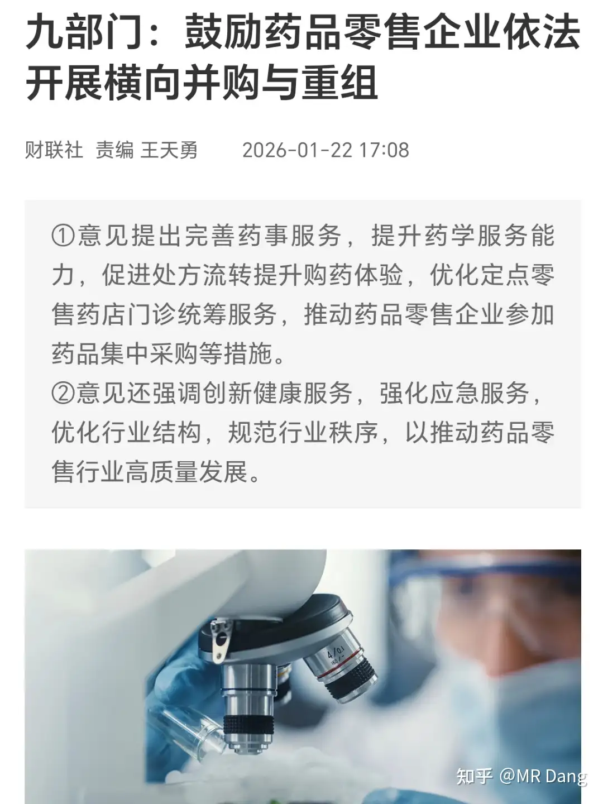
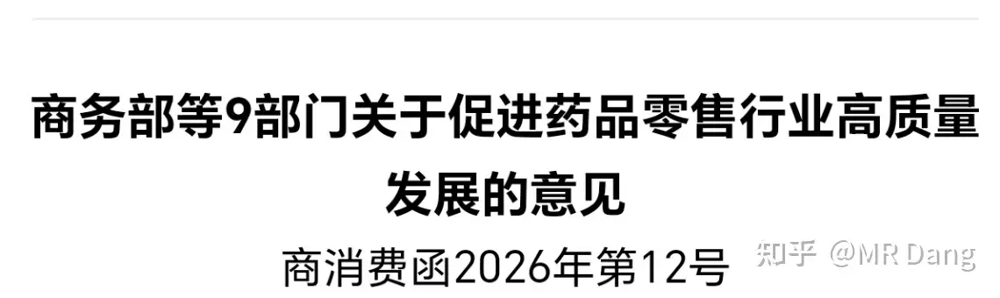
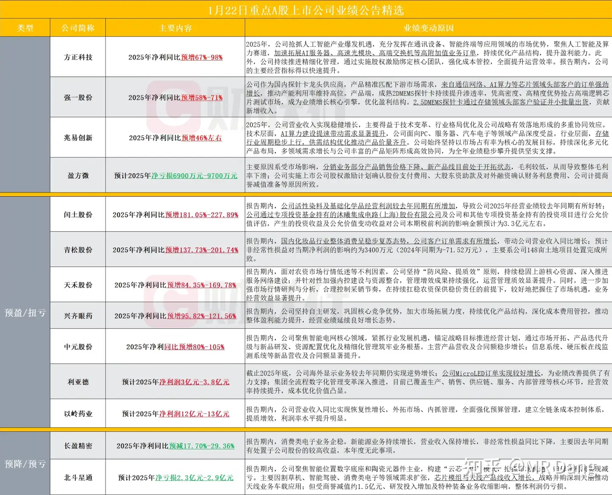
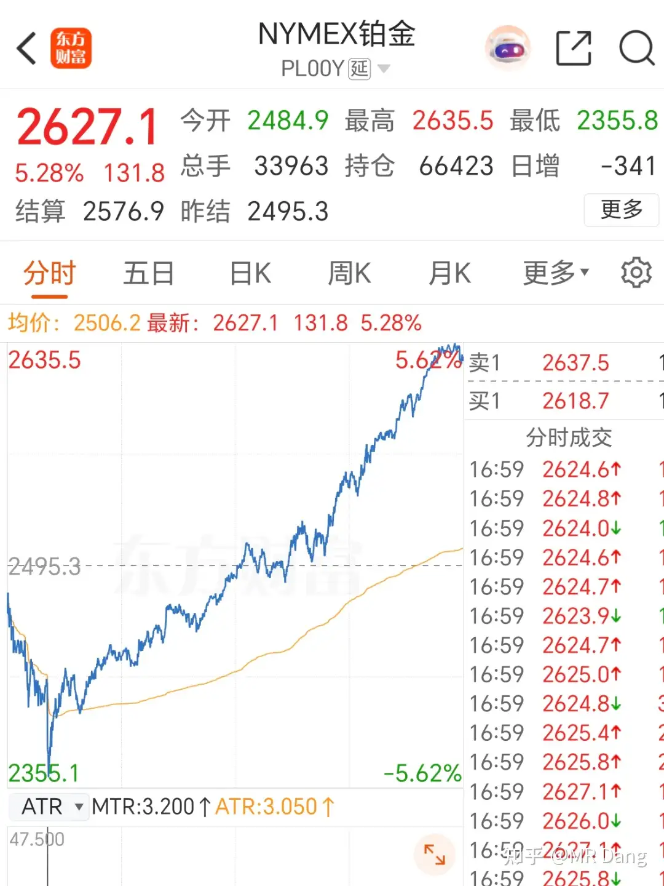
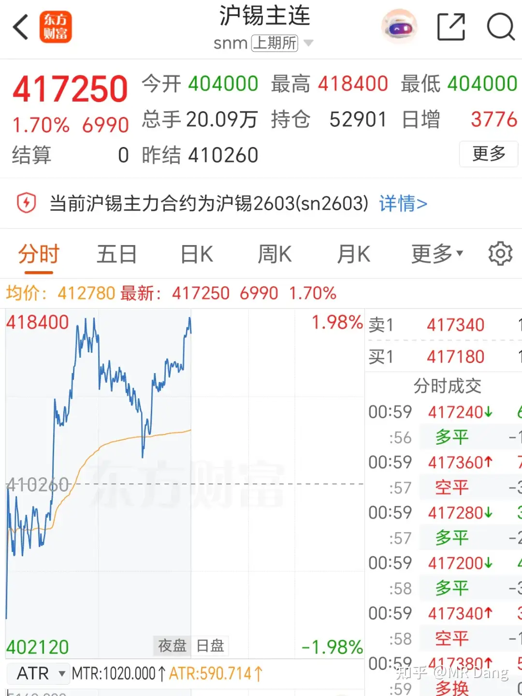
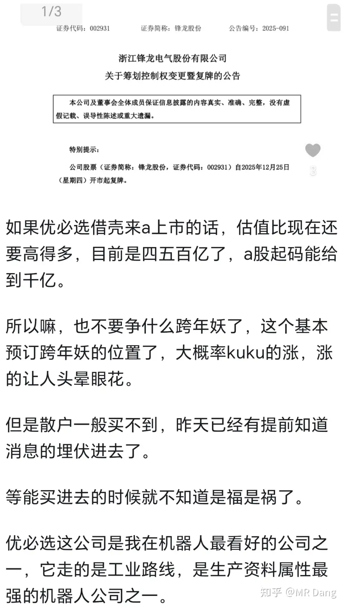

# 该怎样评价2026年1月23日A股行情？

---

**发布时间**: 2026-01-23 06:44  |  **原文链接**: https://www.zhihu.com/question/1997435835788842919/answer/1997922674077356451  |  **点赞数**: 1492 人赞同

**作者信息**: MR Dang​独立投资人，不接广不卖课

---

## 正文内容

今天的头条给央妈吧：

全文很多信息，但是主要说的就是降准降息还有空间。

很多小伙伴可能不懂什么叫还有空间，空间怎么看，空间有多大。

我教大家一个量化的办法，就是看汇率，汇率顶不住了就没空间，汇率升值了就有空间。

7.5之内都有空间，接近7.5就没了。

当然以上是个人长期观察的结果，不是央妈的意思，我不是经济学家，仅仅提供一个观点。

央妈肯定考虑的多，gdp，cpi，就业率，银行净息差等等，但是目前这个空间主要来自汇率。

一条和持有标的有关的新闻：

原文：

鼓励横向兼并和重组，肯定是利好头部的，特别是本来门店数量还在增加的，这一鼓励，市占率蹭蹭蹭的涨啊。

这个行业我之前提过，规模效应和马太效应最强，门店数量越多，成本越低，议价能力越强，利润多了就能吸引来更多的加盟，最后就是越滚越大。

之前提的头部药店top3，dsl谦虚一点说在资本市场跑赢另外两家20%是有的，我没仔细统计，仅凭印象说的，如有错误，评论区可以指出。

我的读者里广东读者占比那么高，我觉得对这家药店应该是有清晰的认知的，生意如何，密度有多高，人流量如何，价格有多贵，比在财报上看还是要直观的。

我现在发愁的是万一止盈了，我消费该买啥，今年消费股普遍表现不好，我选的这三个表现这么好也是出乎我自己意料的，有点匆忙，还没准备好下一个顶替它的生态位。

目前在看的是化妆品方向和食品方向的，但是总有点不满意，总感觉哪里差一点。

美联储掌门人不确定性增加：

这是之前的一张图，外界普遍认为哈塞特和沃勒二选一，前者概率更大。

但是最新的市场押注Rick Rieder，也就是红框里的里德当选概率飙升。

里德有20年雷曼兄弟工作经验，后来在贝莱德做固收，是典型的华尔街精英。

核心主张是认为3%为中性利率。

如果他当选，降息就很快了，毕竟3%才是中性。

但是美联储独立性也就名存实亡了，和华尔街谈独立性纯属招笑。

部分企业预增公告:

大热赵姨不及预期，不知道市场会不会选择“当然是原谅她啦”（手动绿色）。。。持有的注意风险吧。

眼药也一般吧，硫酸阿托品不太行，院内制剂不能在网上销售限制销量，治疗虹膜炎角膜炎是乙类目录，但是治疗近视没在目录里，这块才是大头。

这业绩可能要抬走了。。也注意风险吧。

我最感兴趣的是榜6，刚好是做化妆品的，估值业绩看着都不错，也算是顺周期了，有空了研究研究怎么个事。

商品市场 ：

铂价巨震后，惊天深v创出历史新高：

振幅超过十个点，要是按照股票的话，我的铂条该止盈了，浮盈30%了。

但是依然看好铂的后市，这玩意儿太稀缺了，丰度低，用途广，性质稳定，一旦被价值发现，经不起大资金的冲击，就这南非还没出啥事，一旦南非出事，铂超过金都有可能。

金价站上4900，创出历史新高。

银价也创出历史新高：

相比之下锡这点涨幅就不算什么了：

铜铝之类的也分别有一定程度上涨。

没什么好说的，不要轻易做空任何东西，血的教训哦，管你是谁，敢做空就要做好上绞刑台的觉悟。

我看空过很多东西，但没做空过任何东西。

今天提醒的风险是flgf。

其实很早之前就提过，复牌的时候还试图去排过队，老粉应该有印象，当时是这么说的：

现在就是以前说的“能买进去的时候不知道是福是祸”的节点。

你真的是喜欢机器人的话，隔壁优必选又不是不能买（这句话真不是鼓励你买），整这么大风险的东西孰为不智。

我自己给自己立下的职业道德就是妖股涨之前可以提，涨的时候不蹭热度，有风险了及时提醒。

感觉最近快开板了，提前说一下，危险的地方不要去。

昨天我的话，净值小幅度回落。

银行拉胯，其他也互有涨跌，要不是bt组合和磷矿双雄奋勇向前，估计回撤就要接近一个点了，对我来说属于比较严重的回撤。

主要是带头大哥又在砸权重了，隔壁孩子不听话，先把自家的屁股拍烂再说，吓一吓不听话的。

布王的持股体验太好了，虽然浮盈也就那么十来个点，但是掐指一算，貌似bt组合距离止盈也不远了，感觉还没坐稳就要到站了。

铝王平替入手了，看到高开给我整笑了。

不要抢跑哈，我不是那种带头往热门股里冲，然后反手掏粉丝口袋的博主。

做的是宏观研究，预测业绩，价值发现，长期布局，理论指导实践。

今天有事，分红到账了，不小的一笔钱，我得复投进去，要提前准备准备，所以评论区翻到八点半就不翻了，等有空了再翻。

很多人担心银行股跌什么的，其实银行股有个规律，就是只要你拿的久，小跌小赚，大跌大赚，暴跌暴赚，前提是你的银行股股息率得够高，然后没有买的特别贵。

这是我一点不算经验的经验，仅供参考。

看见银行股跌使你感到兴奋，那说明你的level已经上去了，要么是投资的境界突破了，要么是财富的位数上去了。

所以有人在牛市里压盘或者说砸盘，从另一种角度来看是提供了一个非常好的机会，就看能否把握住了，抓住市场先生犯错的机会。

至于我为什么选了一个目前看起来似乎最烂的银行，是因为它的便宜是确定的，是客观事实，而烂是暂时的，是主观看法。

现在叫它最烂，不挑理。

等一季报出了，再看怎么说吧。

最近新人很多，稍微恳求大家一下，不要在评论区贴脸开大，比如问xxxx能不能买。

首先，对于我没有的标的，我的原则是不讨论，因为对收益没帮助。

特别是从别的大v那里抄作业，又担心抄错了，然后到我来这求证。

这让我怎么说啊，但凡想帮人避坑，肯定得说风险。最后截个图扔回别的大v的粉丝群，这。。。。不太好吧，我只是想帮你避坑，你这给玩匹配赛呢。

不带这么玩的。

其次吧，现在管的严，我为了合规，什么小圈子都没有，咱们之间的沟通速度可以说是毫无障碍。

在评论区不能功亏一篑，你有什么想问的，可以问的委婉点，我可以答的隐晦点，不能对他人的买卖造成影响，或者暗示股价会怎么样。

最后就是，人都是有能力圈的，我虽然能力圈稍微大那么一丢丢，也不过区区一介凡人，对很多标的其实认知水平也不高，问了也是白问。

而且择时水平很一般，鄙人不善择时。

谢谢大家的配合，共同维护评论区的和谐氛围。

我很珍视这一点。

一个喜欢保护韭菜的博主，希望大家少少踩坑，多多赚钱！！！

---

## 精选评论

| 用户 | 时间 | 内容 |
| :--- | :--- | :--- |
| 毛毛 | 6 小时前 | 大佬早，我们不抄作业，只是交流逻辑 |
| &nbsp;&nbsp;&nbsp;&nbsp;MR Dang | 6 小时前 | 对头 |
| 超人M | 5 小时前 | 爱您 |
| 追风筝的狗 | 5 小时前 | 大佬早，我们不讨论逻辑，借我200个，我要梭哈银行 |
| 机械之道 | 4 小时前 | 一波回撤直接本金归零是吧 |
| 追风筝的狗 | 3 小时前 | 本金？哪有本金，dang佬借我的怎么能算我的本金呢 |
| 败絮丶 | 6 小时前 | 之前一直觉得分红是卖自己的股票，最近终于大彻大悟。除了分红稳定必然填权之外，从股票数量角度也有本质区别。分红之后股票数量不变，而卖出之后股票数量会减少。分红复投之后，股票数量会增加，进而得到更多分红。 |
| 余幼时即嗜学 | 5 小时前 | 大佬早，希望大家理性发言，多看，少说话，珍惜大佬！ |
| 小乙 | 5 小时前 | 顶上去 |
| 哈基米南北路多 | 5 小时前 | dang老师，看到一个提问“知乎大v Mr.dang的投资水平如何”。看来dang老师真的火了 |
| 蓝莓吐司 | 4 小时前 | 好烦，能不能给他删了这种八卦文，不想引起议论和纷争，我还要天天跟老师学习呢！！，万一把老师能丢了可咋整？ |
| &nbsp;&nbsp;&nbsp;&nbsp;MR Dang | 5 小时前 | 瑟瑟发抖的点进去，瑟瑟发抖的点出来，不敢出一言以复 |
| 不当鸵鸟 | 5 小时前 | 每天都来看看，最近人越来越多了，为减少大佬的工作量没特别要说的我打算只看不评，评论区翻翻也能长不少知识，大佬要坚持更啊 |
| &nbsp;&nbsp;&nbsp;&nbsp;MR Dang | 5 小时前 | 好的 |
| POWERFUI | 4 小时前 | 我也是 |
| 西饼驴 | 2 小时前 | 我都看了1个月了 第一次留言 眼睁睁的看着人越来越多 有点恐慌啊 |
| 白日梦韭菜 | 19 分钟前 | 我就是，每天坚持看但是不评论 |

---

*本文件由自动脚本从MR Dang知乎页面提取生成*

---

**作者**: MR Dang
**链接**: https://www.zhihu.com/question/1997435835788842919/answer/1997922674077356451
**来源**: 知乎

*著作权归作者所有。商业转载请联系作者获得授权，非商业转载请注明出处。*