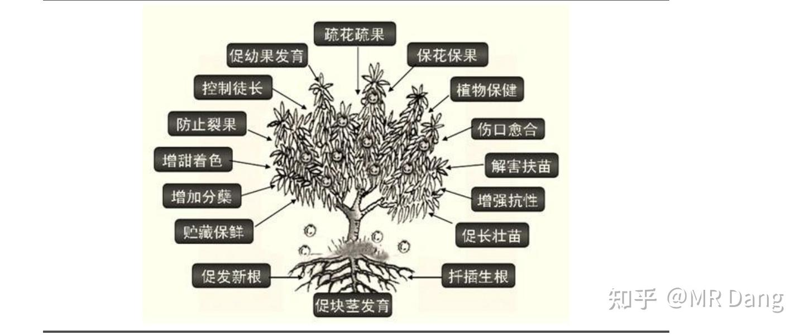
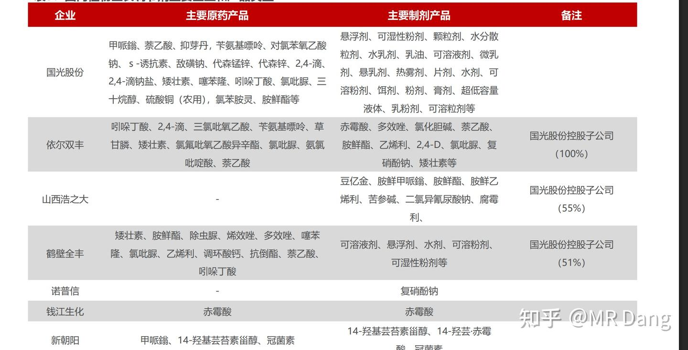
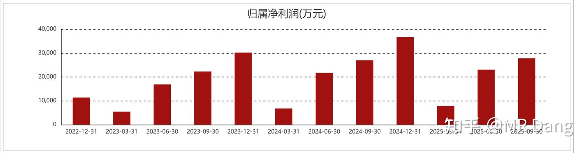
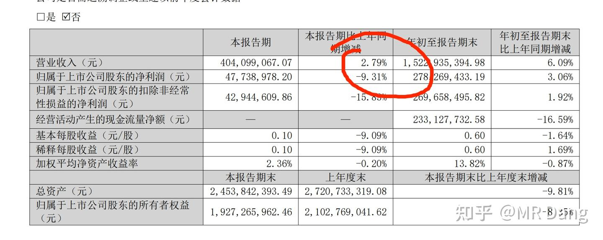
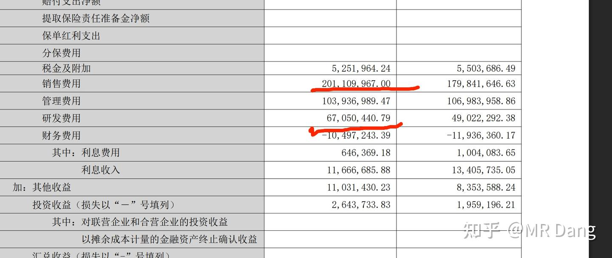
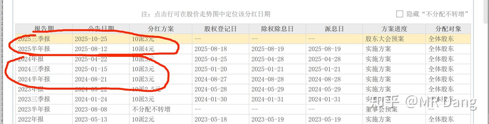
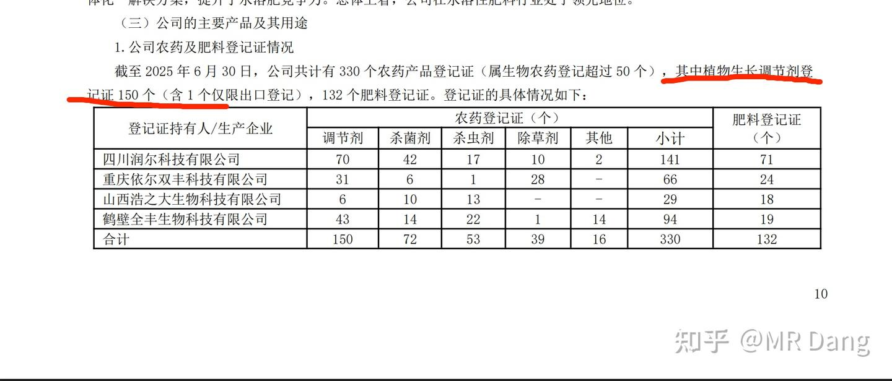
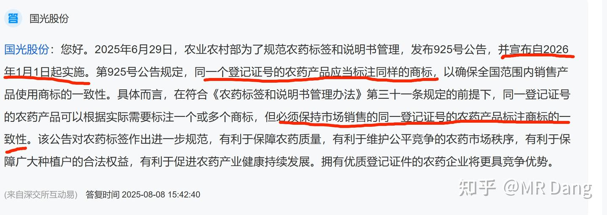
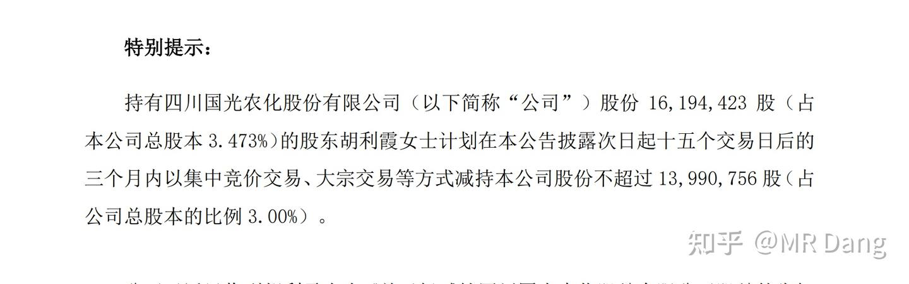

# 《玄阶功法卷一》农业茅台GGGF投资价值分析

---

**发布时间**: 2025-11-12 09:55  |  **原文链接**: https://zhuanlan.zhihu.com/p/1971536147298615875  |  **点赞数**: 534 人赞同

**作者信息**: MR Dang​独立投资人，不接广不卖课

---

## 正文内容

之前的定位上：

天阶是看好的我觉得可以放心的长期配置的投资标的。

地阶是配套的心法和方法论。

邪修是投机倒把，搏弹性的东西。

那么其实还有一类，就是有一定投资价值，但是某些方面达不到天阶的标的。

划分到天阶，降低天阶的含金量。

划分到邪修，又有点说不过去，所以就推出了本玄阶功法系列。

天阶功法的选股思路是自上而下，投资的视角是俯视，所以讲的是大开门和一眼知胖瘦。

而玄阶功法的思路是由此及彼，旁推的方法，讲的是类比逻辑。

从格局上来说，天阶功法的格局要大的多，确定性要高的多，建议主修。

但是确实对个人的逻辑思维和社会经验有一定的要求。

很多读者反应，太难了，不好学，学不会。

但是这《玄阶功法》它就要简单的多，但是做不到天阶功法那样确定性高，同时股票的瑕疵也更多，风险相对更大。

先说一下目前的化工类行业是个什么情况：

由于储能需求的增加，导致了对磷需求的增加。

而磷矿是有瓶颈的，所以市场都在做磷矿相关的标的。

磷矿这块儿，以前介绍过了，BT我这边都获利换成YTKG了，速度之快我自己也有点蒙圈。

然后YTKG，说实在的我没把握，因为炒的是预期，这事没人可以打包票，有人想看的话，也可以做一期玄阶的文章。

除了磷之外，硫磺的价格也是涨的飞快，甚至比磷要夸张的多。

但是硫磺目前没有相关的标的，因为大多数产能是石化企业的副产物，除非你去炒ZGSY，ZGSH。

也有说含硫铁矿的，但是我看了下，含硫铁矿那个企业明确表示没有相关业务，额，跑题了。

大家能GET到吧，目前的情况就是硫磺和磷肥比翼双飞。

而且这边的供应端基本是没有太大的增长的，磷矿卡死了，现在某些产地还在倒查十几年的产能批复问题，形势比较严峻，可以查阅相关新闻，不展开了。

需求端的情况，就是储能带动，这个确定性很强，十拿九稳不为过。

所以长期来看，化肥的价格是会缓慢上行的。

农业方面，农产品的价格也是会上涨的，最后通过食品价格把CPI抬起来。

现在问题就是，我们需要找出一个化肥价格上涨，可以受益的东西。

最直接的其实农产品价格，特别是果蔬类，因为水果蔬菜对化肥的需求比主粮类大的多。

比如苹果期货，我之前在一个回答的评论区说过这玩意儿，确定性很高。

但是期货是零和博弈，杠杆也高，不符合我的审美，看多不做多。

那股票这块儿，其实按照一般的思路，要找的是果蔬库存多的企业。

但是果蔬这类东西，损耗太高，没有哪个企业平白无故的囤一堆水果，还不如直接买期货。

那找种植类企业行不行呢？

我感觉要看企业的价格转嫁能力。

化肥价格是刚性的，用量是刚性的。

农产品是大宗商品，价格不由企业自主定价，还有大量的进口农产品进行比价。

这中间的价格转嫁能力实在令人怀疑。

问题又回到了原点，化肥涨价，受益标的除了果蔬类农产品，似乎其他的确定性不足。

但是如果你换一种思路，比如化肥涨价，提高化肥的使用效率如何？

有没有哪个公司，可以提高一种方案，让我精准的按照时间，按照作物的生长规律，精准的使用化肥，从而提高农产品产量？

有的，兄弟，有的。

接下来登场的是：

连续多年多次分红

稳坐农药化工行业毛利率第一把座椅

国内植物生长调节剂无冕之王

一品一证的最大受益者之一

GGGF

简单的拉一下，这企业的优势有什么：

1.GGGF，是搞植物生长调节剂的，在国内是绝对龙头一哥，龙头低位体现在——品种最多，销售额最大，登记证最多。

2.商业模式：推广“作物全程解决方案”，客户粘性极强。

什么是这个字数很多的方案呢？

就是分品种，对不同的农作物提供个性化的使用化肥，植物生长调节剂的方案。

保证农作物的坐果率和产量。

3.这个商业模式好在哪里？

因为植物生长调节剂的特性是成本低，效果大，用的好了有奇效，用的不好是毒药。

所以很多种植户对这方面是一知半解，不敢自己用。

就需要一个企业，提供一站式的解决方案，这个方案直接对标的是种植户自己施肥。

在以前——方案价格高，自己施肥成本低，中间差价大，种植户就要仔细衡量。

但现在——如果自己施肥成本也高，那么方案相对于自己施肥的溢价率就会降低，价格优势就体现了出来。

同时——这个方案目前的渗透率很低，因为咱们的国情决定了目前的种植还是比较分散的，对种植知识的普及还不够，对价格的承受能力比较低。

所以——如果未来土地集约化，由专业的种植大户进行规模化种植，那么会更愿意学习种植知识，从而大大提高植物生长调节剂的渗透率。

博主，停停停，你说了这么多，什么是植物生长调节剂呢？

这个名字可能对刚从高中毕业的同学很熟悉吧。

赤霉素，生长素，乙烯，细胞分裂素。

是不是这些熟悉的名词已经开始攻击你模糊的记忆了，哈哈。

大概的作用都在这张图里，不过其实也不需要仔细分辨。

作为投资者我们只需要知道它作用很丰富就行了。

在这个细分赛道里，竞争格局是这样的：

也不用仔细看，反正是一个比较分散的行业，GGGF已经是这个超级细分的赛道里的王者了。

从营收和利润看，有明显的季节特征，第二和第四季为旺季，第一和第三季为淡季。

三季报比较一般，单季度营收增加，但是净利润下滑，原因主要是：

前三季度销售费用大增，研发费用大增，合计增加了大约4000万。

增加的费用有没有效果呢？

观察官方新闻稿的密度，比往年高了很多。今年开展了很多对比实验说明综合方案的优越性：

比如示范区玉米增产率23.3%。

又比如生姜增产43.7%。

同时还招聘了大量的校招生：

根据行业的性质，我合理怀疑招聘的基本全部是销售岗位。

什么意思呢？

这些销售费用的增加是用在了实处的，这个综合方案本来就有优越性，只是价格贵了些。

如果现在化肥价格上涨，那么溢价率就会下降，叠加本身的客户粘性，和铺天盖地的销售策略。

前景可期啊，前景可期。

最后说一下为什么给了它一个农药茅台的美名，因为它的毛利率特别高：

按照营业收入TOP10排名，GGGF的毛利率是独一档的，46%

大家可能对46%没概念，那么我说单第三季度的白酒企业，比如YHGF的毛利率只有50%出头你就知道这个毛利率的含金量了。

同时这个分红不能说是慷慨了：

每年三次的分红直接把我给拿捏了。

如果第四季度再分三毛，今年的分红就是1块，按照现在的价格股息率直接快到7%了。

凭什么？为什么整个行业都在吃糠，就你GGGF吃的这么好，活的这么滋润？

把一个农药企业的经营数据搞得比白酒还好？

凭证！

农药行业是个管制行业，经营都需要证书。

根据半年报数据，整个植物生长调节剂500家企业，一共1900个证书，平均一家企业不到4个。

而GGGF一家就占了150个证。

证多意味着什么？意味着产品全，可挑选余地大。

意味着在综合方案这个领域，一个能打的对手都没有。

别的企业要模仿，产品的数量和种类就不够，就一两个产品何来的综合方案？

在这个极为细分的领域，GGGF就是植物生长调节剂的KING。

同时，农药行业的反内卷也会在2026年的1月1日正式落地。

所谓一证一品，一个产品证对应一个商标，整个行业没证的挂靠产能就要被清退。

对有证的企业是大利好，GGGF满手的证，简直不要太舒服。

GGGF的优势大概就这么多，总的来说非常符合我的审美，内卷能力MAX，毛利率超高，无惧原料波动，对下游议价权强，客户忠诚度极高，是罕见的2求企业。

而且更重要的是，国内植物生长调节剂的渗透率特别低，预估的市场规模在600亿以上。

目前GGGF的营收才二十亿级别，天花板高的一眼看不到头。

分红还特别慷慨，赚的钱还没捂热，就迫不及待的全分给股东。

它就是我要找的生产资料，是我的梦中情股。

而且受益于行业回暖，和政策的支持，是那种感觉已经在跑道上热身，马上要起飞的感觉。

但是，凡是都有个但是，这么好的东西，估值不会无缘无故的这么低。

风险提示一定看完：

1.控股股东和配偶离婚了，配偶正在减持股票，减持期还有几天：

至于真离还是假离，不予置评，反正在减持是事实，减持期没到也是事实，其中风险自行考虑。

2.实控人没有参与管理层。

实控人当然肯定是对管理层有影响的，但是自身没有参与管理。

而且你看十大股东，很多都是实控人的家里人。。。。

所以这个公司分红这么慷慨的原因大家能理解吧。

我是比较喜欢这种公司的，就像NSLY，大股东缺钱，咱们买进去算是占了大股东的便宜。

这个公司也是这样，一群人嗷嗷待哺等着分红呢。

但是啊，实控人确实没有参与管理也是事实。

说来说去，这家企业就是家族企业，要怎么经营，怎么分红，人家说了算。

如果对实控人不信任，那就一票否决，不要参与。

3.目前的预期分红金额大于净利润，持续性存疑。

今年的预期分红可能是1块，前三季度已经分了7毛了，第四季度如果是3毛，就有一块。

但是今年的每股收益可能只有0.9左右。

明年如果每股收益增加不到1元以上，维持这种接近7%的股息率的持续性有一定疑问。

总的来说，我觉得逢低可入，高看跨年的农业行情一眼。

如果小非的减持砸下来一个大坑，那就真的太好了。

一定注意风险！！

不要当耳旁风！！

一个喜欢保护韭菜的博主，希望大家少少踩坑，多多赚钱！！

---

## 精选评论

| 用户 | 时间 | 内容 |
| :--- | :--- | :--- |
| 小搬砖工 |  | 看懂了。大佬研究的是大宗商品的周期律。天阶功法其实关注的是直接受益于相关商品的标的，侧重于储量、产量、利润剪刀差等预期，这个确定性非常强，匹配股息率，当前估值等确认投资机会。玄阶功法适用某些无法直接受益与大宗周期上涨，但是与大宗上涨有强关联的标的，但也是需要配套研究股息率、估值来确认投资机会。只是这个关联性在市场的认可程度存疑，所以配不上天阶功法。学习了，其实股息率，估值，财报这些都好分析，这个行业覆盖面、行业研究深度以及思维发散性是不好学习的。强烈建议大佬出一门相关的课程。 |
| &nbsp;&nbsp;&nbsp;&nbsp;MR Dang |  | 总结的很到位 |
| 灰马 |  | 依据我最近抄作业的经验：大佬新推的公司，但凡我犹豫想观察几天捡个好价时都会错过或被迫以更高价接盘，凡是立即上手的，短期两三天内股价都会下跌随后再拉升。btgf,dsl,bfny，hxyh，zhkj都是这样的，刚才又立即入了点gggf。今天我又以身入局，有我这个反向指标，各位可以等几天以更低价再入。 |
| &nbsp;&nbsp;&nbsp;&nbsp;MR Dang |  | 玄学加持 |
| 勾人 |  | 认同dang佬的地方就在于愿意推荐股票以后讲道理摆事实，判断留给读者自己，大部分看到的什么投资人要么就是吹自己年化多少，然后不痛不痒的给几个大方向，要么就是推荐很多股票但原因写的和那些自媒体上一模一样，没有说服力。当然，最有说服力的还是跟着dang佬赚钱了（虽然dang铺里我只进货了hxyh） |
| &nbsp;&nbsp;&nbsp;&nbsp;设置个人信息 |  | 认可作者的思维逻辑，但就本文里举的例子来说，可能只是一个臆想的传导链条。不过无妨，只要认可这个逻辑的资金够多而又未被证伪依然可能赚钱。说回农业现实，宏观的东西个人能力不足分析不了，从微观农业生产来说，农产品的成本转嫁能力几乎是0，植物生长调节剂只是一个单价高用量低市场总需求很有限的东西，并且低价格的农作物品种也可以承担这份成本，用不用完全取决于提升效果，并不存在一种化肥价格低所以高价的生长调节剂被压制的状态。化肥价格上涨对植物生长调节剂的刺激作用也不大，植物生长调节剂是个宽泛的概念，有很多不同类型，它可以是促植株生长也可以是抑制植株生长，可以是促进分蘖也可以是抑制分蘖，还有保果的，上色的，不一而足。仅有促生长一类勉强可以和化肥价格上涨扯上点关系。 |
| 祝君 |  | 很理智的分析 |
| 有一个小朋友 |  | 核心是这套逻辑客户认不认，农户不认的话，就无法传导到业绩上，那就被证伪，客户认的话，业绩有增长，股价一定会有反应。还有就是化肥这个品种长期的涨价预期在不在。 |
| 逆天唯我 |  | 不明觉厉 |
| 闷声装大死 |  | 化肥涨价确实和植物生长调节剂在关联逻辑上没那么强，但是后面的逻辑应该是没问题的。包括反内卷下的一品一证，挂靠产能清场，还有当前植物生长调节剂市场渗透率低，总体有市场扩容，业绩提升的预期，但是这两年分红都是超过纯利润的，股息率虚高，按照股息率来算股价还不算便宜，和高毛利强关联的应该是上游化工原料的价格，受益石油煤炭价格一直较低。可以多关注上游化工原材料的价格，越低越利好 gggf。 |
| 田心梅西西 |  | 大哥，DSL等我加仓了您再拉好不好。 |
| 知了也睡了 |  | 就说呢 我昨天忘买啦 要拉先拉zhkj啊 |
| 北雁归 |  | dang老师今天某铝帮我顶住了调整 |
| 田心梅西西 |  | 云图控股？我们湖南人J和G差不多发音，我买的永太科技啊。 |
| solo |  | 我卖了宝丰能源换了国光，仔细研究了下，我觉得这个大股东减持有问题，完全没有流通性的情况下坚持几个亿，又没有私募机构配合，基本不可能，马上时间到了，我怀疑是用减持利空做局了，打压股价，吸筹码，后期估计有大运动配合明年一月的一证一照的炒作。个人愚见。 |
| 南辰 |  | 股票界的鹰之一手 |
| 鲍大师傅 |  | 现在回头看看，肠子都青了吧 |
| 轻度失语 |  | 过分了，过分了，看完文章再一看股票，直线上拉了…都是粉丝们给买上去了？ |

---

*本文件由自动脚本从MR Dang知乎页面提取生成*

---

**作者**: MR Dang
**链接**: https://zhuanlan.zhihu.com/p/1971536147298615875
**来源**: 知乎

*著作权归作者所有。商业转载请联系作者获得授权，非商业转载请注明出处。*
