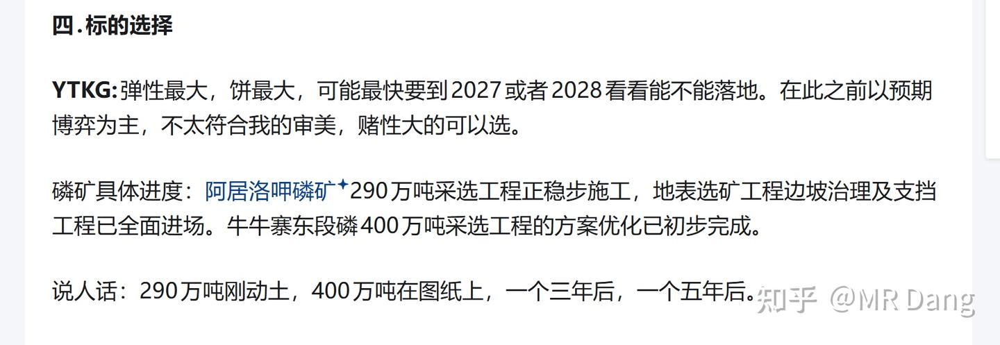
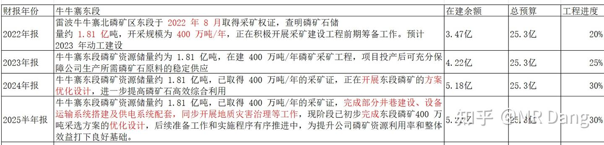

# 《玄阶功法卷二》谨慎吃饼——YTKG投机价值分析

---

**发布时间**: 2025-11-14 07:27  |  **原文链接**: https://zhuanlan.zhihu.com/p/1971976018966319236  |  **点赞数**: 371 人赞同

**作者信息**: MR Dang​独立投资人，不接广不卖课

---

## 正文内容

前置功法：

[[20251102-《天阶功法卷四》磷化工投资价值分析|天阶卷四]]

省流不看版：

做交易啊，要讲一个实事求是，客观理性，最怕脑袋跟着屁股走。

不能拿着BTGF的时候吹BTGF，

拿着YTKG就吹YTKG。

大家要知道，一个公司的基本面不会因为股票的任何波动发生变化。

更不可能因为一个投资者的买入或者卖出发生变化。

无论你持有还是不持有，公司就在那里。

这也是为什么BTGF是天阶，而YTKG就只能是玄阶的原因，确定性不足。

前面的行业什么的，参照之前的就行了，就从YTKG的业务直接开始吧。

YTKG目前的业务是复合肥+纯碱+贸易。

按照一般的预测，可能全年净利润落在9亿到10亿之间，取个中间值9.5亿。

估值的话，这部分业务保守点就给个YTH以前的10倍估值算，这部分估值是95亿。

目前的市值是150亿，减去95亿的合理估值，相当于磷矿的期权市场给了55亿左右的估值。

至于很多人吹的湖北应城项目，我觉得没什么叙事。

我要买全产业链，我直接梭哈YTH，没有YTKG什么事。

要抓重点。

那么YTKG的磷矿期权到底值不值55亿就是现在需要考虑的问题。

首先是400万吨的牛牛寨饼：

东段：

根据这个图中的历年表述，可以看到在2024年报中表示开展优化设计。

2025半年报，是完成优化设计，中间的进度近乎停滞。

又提到了同步开产地质灾害治理工作。

猜测可能是客观因素，比如地质水文条件限制了勘探进度，目前吃饼进度30%。

乐观估计可能最快最快2028年落地。

悲观的话2030年以后落地。

西段：

增加大概2.3亿的储量。

吃饼进度5%吧，这玩意儿落地可能。。。。2035年？2040年？

期货中的期货。

博主博主，那到底有没有能吃的饼了？

有的，兄弟，有的。

正在落地的是饼是：阿居洛呷磷矿

按照在建的进度条可能不到10%。

但是根据目前的官网消息，以及工程矿的情况，可能实际吃饼进度在50%以上。

估值的话：

参考YTKG自己参股49%的公司拍卖得到的二坝磷矿，评估价8亿，平均品位23.37%，储量2900万吨，产能50万吨。

最后YTKG通过433次加价拿下，成交价7.87亿。

几个关键数字，2900万吨储量，产能50万吨，品位23.37%，成交价7.87亿。

日期是2025年9月16日。

那我大概放大个10倍：

2.9亿吨储量，产能500万吨，品位23.37%，大约估值是78亿。

换算成品位20的矿，目测一下，可能打个7折比较合适：

也就是2.9亿吨储量，产能500万吨，品位20%，对应大约估值55亿，把这个称为估算基准。

YTKG的总储量是5.3亿吨，产能超过690万吨，品位20%，大概是基准的140%

折算的估值大约就是77亿左右。

不过9月到现在两个月了，磷涨了不少，现在肯定不止77亿了，按照80亿算吧。

搞清楚这个，你就知道YTKG的交易逻辑是什么了：吃饼逻辑

基础业务估值95亿+饼的总值*吃饼率=市场估值

举个例子，目前饼的总值是80亿。

市场估值是150亿。

150亿=95亿基础业务+80亿饼*X

解得X≈70%

也就是目前市场给了70%的吃饼率。

在这个逻辑里面，吃饼率的下限是实际工程进度30%，上限是100%。

所以按照目前的磷价：

对应的估值=95+80*0.3=119亿

对应股价大约10元

低于这个价买入，就是价值投资。

同时若预期打满100%吃饼进度，则：

市值=95+80=175亿

对应股价大约14.6元。

10到14.6之间交易的就是吃饼进度。

当然随着时间的流逝，基础业务的估值和工程进度也会缓慢增加，从而提高价值底线。

而我，你们知道的，不可能等到预期打满再跑的

以目前的基本面，止盈价格大概就在14左右，对应30%的止盈原则。

除非磷矿石价格疯涨，带动饼的总值提升。

当然以上很多依赖于估算，比如品位20%相对于品位23.37%，打几折合适，可以有更多的声音，取决于你的认知。

风险提示：

1.目前的价格是投机阶段，风险不小，看不懂不要跟！

2.即使到了有投资价值的估值，股息率不够高，还是不要跟！

3.前期涨了一些了，还有一个跳空缺口，我不懂技术，不懂图形，鄙人不善择时。

但是也知道这很危险。

4.我套住了我会等大饼兑现的那一天，被动价值投资，少则一两年，多则三五年。

你们套住了不一定受得了酷刑！！！

不要买，有投资价值的东西多着呢，这种游戏不适合散户！！！

14块只是一个理想的价格，这不是投资，我也不会严格遵守30%止盈。

我这会儿手就在一件清仓按钮上准备着呢，随时逃跑。

已经提前声明了，接了盘可不能赖我哦！！！

一个喜欢保护韭菜的博主，希望大家少少踩坑，多多赚钱。

---

## 精选评论

> [!comment]- 点击展开评论

| 用户 | 时间 | 内容 |
| :--- | :--- | :--- |
| 化石的岁月 |  | 起床练功法，挂单HX，接着回笼补觉～ 仗着多年自媒体摸爬滚打的经验，昨天专门研究了知识星球、公众号这些平台，不得不说，它们在私域裂变和深度运营上太能打了。就咱老祖这财商眼光、辨识度拉满的文风和骨子里的魅力，去某球绝对是独一份的顶流，妥妥独断万古的存在！ |
| &nbsp;&nbsp;&nbsp;&nbsp;MR Dang |  | 还在研究平台规则，怕收了钱没有高质量产出 |
| 大力果冻 |  | 鄙人不善择时 |
| 快活王 |  | 鄙人饥不择食 |
| &nbsp;&nbsp;&nbsp;&nbsp;MR Dang |  | 鄙人不善择时 |
| 晨风 |  | 党老师，早上好！YTKG就二手，昨天清仓了，赚了，非常知足，感恩。现在把它放自选里，如果价格合适，我再买回两手。如果继续上涨，我就不买了，在老师这里，还怕没机会吗? |
| &nbsp;&nbsp;&nbsp;&nbsp;MR Dang |  | 明智 |
| 广东顺德分Dang |  | 昨天去登山看云海了，当时许了个愿，跟着大佬的票，都能涨到云端 |
| &nbsp;&nbsp;&nbsp;&nbsp;MR Dang |  | 好景色 |
| 小搬砖工 |  | 现在都12.5了，跟不了了。期待天阶。今天宝丰怎么看 |
| &nbsp;&nbsp;&nbsp;&nbsp;MR Dang |  | 长期看好，塑料有见底迹象 |
| 夏天 |  | 老师早，还是没蹲到前排，昨天晚上偶然找到了令人心动的"价值Dang铺"，好期待，先赞后看，老师辛苦啦 |
| &nbsp;&nbsp;&nbsp;&nbsp;MR Dang |  | 正在研究怎么搞呢，一头雾水，等以后搞好了看怎么落地。。 |
| 边城 |  | 听当老师的，ytkg止盈了，虽然我就买了200手，赚了6个点，也能吃顿好的了 |
| &nbsp;&nbsp;&nbsp;&nbsp;MR Dang |  | 不少啦 |
| 落花流水 |  | 200手，20多万，不少了，你这一顿真奢侈 |
| 边城 |  | ?一手10多块 |
| 落花流水 |  | 我们一手是100股 |
| 边城 |  | 是我小白了 |
| 不知道 |  | 老师，有人看好大豆期货，预计磷矿石疯涨。 |

---

*本文件由自动脚本从MR Dang知乎页面提取生成*

---

**作者**: MR Dang
**链接**: https://zhuanlan.zhihu.com/p/1971976018966319236
**来源**: 知乎

*著作权归作者所有。商业转载请联系作者获得授权，非商业转载请注明出处。*

---

## 相关阅读

**📖 玄阶功法系列（方法论基础）：**
- [[20251022-《地阶功法卷一》投资者必须斩杀的三个妄念|地阶功法卷一]] - 投资心态建设
- [[20251023-《地阶功法卷二》价值投资三大误区|地阶功法卷二]] - 价值投资误区
- [[20251025-《地阶功法卷三》商业模式评估|地阶功法卷三]] - 商业模式评估方法

**📚 天阶功法系列（实战案例）：**
- [[20251102-《天阶功法卷四》磷化工投资价值分析|天阶功法卷四]] - 磷化工行业分析

**🔙 玄阶功法系列：**
- [[20251112-《玄阶功法卷一》农业茅台GGGF投资价值分析|玄阶功法卷一]] - GGGF投资价值分析

**💡 投资策略：**
- 吃饼逻辑与期权思维
- 磷矿期权估值方法
- 投机与投资的区别
