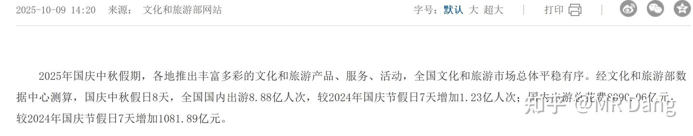
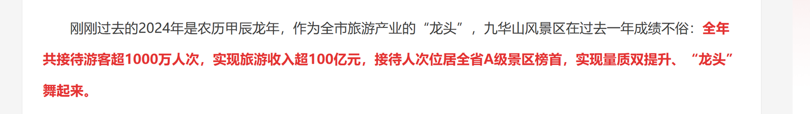
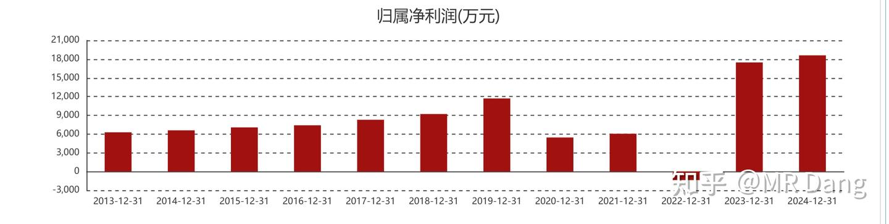
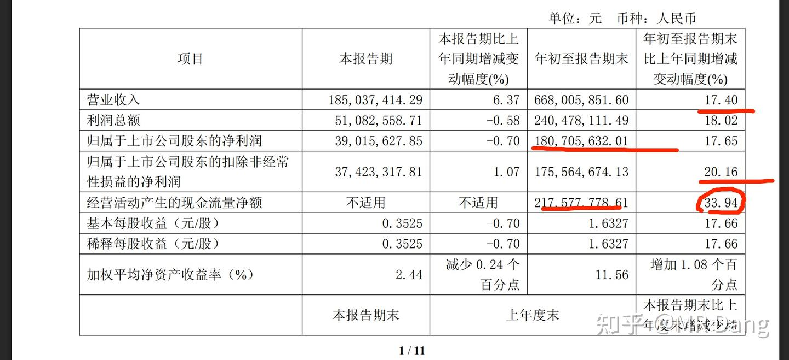
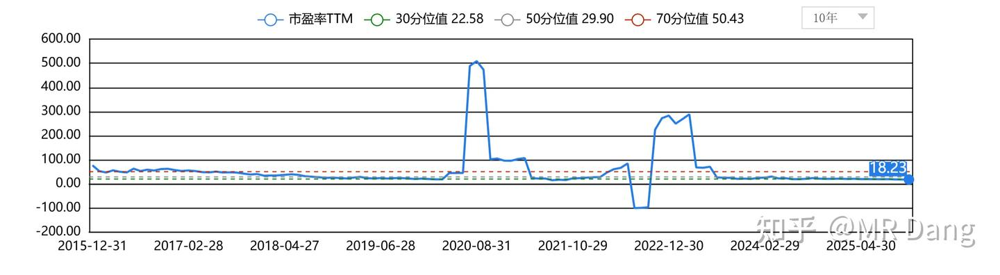
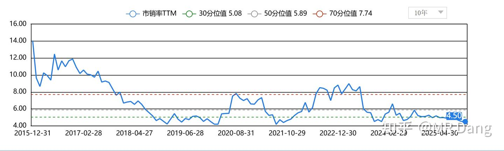

# 《玄阶功法卷三》秒有分二气，灵山开九华——J公司投资价值分析

---

**发布时间**: 2025-12-02 07:26  |  **原文链接**: https://zhuanlan.zhihu.com/p/1978783266518623695  |  **点赞数**: 310 人赞同

**作者信息**: MR Dang​独立投资人，不接广不卖课

---

## 正文内容

一直念叨着想买个旅游股，但是找不到合适的。

想买个旅游股的原因是增加消费配置的多样性。

现在我在消费这块配置的是药店和金店，属于比较刚性的需求。

还缺乏一个吃喝玩乐的东西。

但是现在的经济形势下，消费者相当谨慎，钱袋子捂得很紧。

想从消费者指缝里抠一点钱出来真的不容易。

有没有哪个公司在如此严峻的形势下还能稳定增长，扛起消费这杆大旗呢？

有的，兄弟，有的。

今天一起走进有着"莲花佛国"之称的九华山。

一.旅游业情况

根据统计结果：

2025前三季度出游人次近50亿人次，同比增加+18%

其中城镇人口出游人次+15.9%，农村人口+25%，增速还是农村人口快。

一季度人均旅游消费1005，同比下降6.2%。

二季度人均旅游消费903，同比下降2.8%。

三季度人均旅游消费992，同比下降7.3%

三季度以后，就是国庆。

国庆8.88亿人次，总花费8090亿元，人均消费911元，同比下降0.5%。

去年国庆是916元。

总体来看的话，大的趋势是，人次增加，消费降级。

大家还是喜欢玩的，但是兜比脸干净，只能降低餐标和住宿标准，勒紧裤腰带过日子了。

所以需要寻找的标的最好是找那种按照人头或者人次收费的，价格低，频次高的消费场景。

然后数人头就行了，简单粗暴。

比如门票，船票，索道票，观光车票，索道票这样的，低成本提供情绪价值的东西。

二.相关标的

大家知道我选择的标准，预期5%股息，20PE以内，有增速。

有人还问过为什么是5%和20PE。

因为20PE以内，如果全部分红，可以保证那个5%股息是可持续的。

再加上有增速，那5%也是可以增加的，他就是安全的。

三个都符合，再加上其他条件，比如行业景气度和顶层设计，才有可能是天阶功法。

如果有一个不符合，就是玄阶以下。

比如ZJ，很好，我很喜欢，但是按照现价，是进不了天阶的，股息率不行。

那很明显，旅游板块就没有预期5%股息率的东西，所以最多给到玄阶。

最好财报干净一些，账好算一点。

20PE以下的旅游股，总共就那么两三家，有增速的只有两家。

另外几家都是做酒店的，不符合我数人头的投资方向。

所以很好挑，我选择了J公司。

三,J公司

J公司的主要旅游资源是和峨眉山并列于佛教四大名山的九华山。

佛教四大名山是普陀，五台，九华，峨眉，分别对应四大菩萨的道场。

这个应该属于热知识了。

J公司之所以财务表现好，就是因为九华山的旅游资源过于独特。

搜索指数同比+23%，和千篇一律的其他景点相比，玄学加持MAX。

2024年，接待人次超1000万人次，旅游收入超100亿元。

2025上半年， 游客人次/收入增加至 565 万人 /76.5 亿元，同比+12%/15%。

算下来人均1350元，远高于全国平均水平。

玄学加持下，"寺庙"旅游热度比较高，而且令人意外的是增量来自于年轻人。

根据搜索指数分析，各APP上搜索"寺庙"旅游的人群中，90后和00后人数超过50%。

J公司主要有四大业务，分别是索道，酒店，旅行社和客运业务。

其中酒店和旅行社虽然营收贡献的多，加起来占总营收的近40%，但是只贡献了一成左右的毛利。

这也和我们前面的宏观判断是相符的，消费降级趋势下，谨慎投酒店类业务。

索道和客运占总营收的60%，但是贡献了9成左右的毛利，是J公司最核心的业务。

值得一说的是，J公司并没有九华山的门票业务。

图中两条绿色的虚线，表示的是J公司的两大印钞机，天台索道和花台索道，单程85元，每小时单向运力合计3600人，毛利率86%。

满负荷印钞速度=3600*85=30.6万

30.6万*0.86=26.5万/小时

除此之外还有百岁宫缆车，单程55元，每小时运力760人。

满负荷印钞速度=55*760=4.18万

4.18*0.86=3.6万/小时

合计约30万/小时的毛利。

当然这个是理想情况，没有算折扣票，而且假设满载，实际上是达不到的。

只是用来说明两条索道的暴利程度。

除此之外还有52%毛利的客运业务。

J公司有150到170个大巴和4000多个停车位，2024年收入约1.6亿。

酒店业务看着热热闹闹，从200多到2000多的房型都有，而且酒店众多，但是毛利率也就十几个点，没看的必要。

国企做酒店就没有做的好的。

同理还有旅行社业务，属于引流入口，本身挣不了几个钱，不赔钱就不错了。

J公司特殊的地方在于，九华山的游客客户粘性高，有礼佛的，有还愿的，也有观光的，很多游客都是二刷三刷。

J公司的增速在于新的狮子峰项目，投资金额3.2亿左右。

建成后预计大概好的时候营收1.1亿/年，净利润3700万，2026年，也就是明年落地。

但是建成初期折旧多，游客少，需要培育几年才行，狮子峰那边比较偏，景色也一般。

财务数据过一遍：

除了特殊时期，是少数几个经营数据比2019年还好的旅游公司之一。

2025前三季度营收6.68亿，同比+17.4%。

归母净利润1.8亿，同比+18.02%。

经营性现金流2.17亿，超过了归母净利润，同比+33.94%。

现金流极好，净利润含金量十足。

就这个财务数据和干净程度，放在旅游公司里属于一股清流。

看着非常舒服，可以激发人阅读财报时候的愉悦感。

估值方面：

市盈率TTM18.23，小于10年30分位值22.58，若以50分位值的30PE为目标价，则低估30%以上。

市销率4.5，低于10年30分位值5.08，处于历史估值的极端低值，若以50分位值的5.89为目标估值，也低估30%左右。

风险提示（必读）：

基于业务的简单程度，生活常识，以及控股股东的情况。

我个人有理由相信J公司之前的报表，水分不大，比较真实。

J公司的负债也很少，没有什么财务杠杆，安全性上很有保障。

因此J公司的风险点不在于过去已经发生的事情。

索道是一个自带风险的东西，容易发生安全事故。

之前有过定向增发的意图，后来撤销了，存在继续增发稀释股权的可能。

未来有比较大额的资本支出，包括狮子峰项目，综合体项目，酒店项目，收购股权，总金额可能在十亿级别。

可能拖累现金流，增大资本开支，增加折旧。

且项目建成初期，折旧多，营收少，会拖累当期业绩，折旧和利润之间有一个时间差。

短期走势上有个跳空缺口，极有可能回补。

不要一窝蜂的抢跑，容易买到高位，然后又问套住了怎么办，不好。

加入自选，等估值便宜的时候再适度配置一点，安全边际更高。

管理层水平有限，老想着搞事情，花钱。

酒店资产的管理水平不行。

预期股息率仅2%

一定要读风险提示啊，不要随意抄作业。

总的来说J公司属于躺着赚钱的公司，仅看那些索道缆车运营，是一门很好的生意，商业模式上是少有的3求业务。

排队送钱，垄断经营。

酒店业务折旧大，竞争激烈，还要后续增加资本开支，不好。商业模式只有1求。

增长是比较确定的，但是增长的天花板不太高。

我自己可能目标仓位在2%左右，作为补齐消费板块的一个拼图。

一个喜欢保护韭菜的博主，希望大家少少踩坑，多多赚钱！

---

## 精选评论

> [!comment]- 点击展开评论

| 用户 | 时间 | 内容 |
| :--- | :--- | :--- |
| malloc |  | 买这个被套可以加功德吗 |
| &nbsp;&nbsp;&nbsp;&nbsp;MR Dang |  | 可以吧 |
| 孔工 |  | 九华山大和尚最灵了 |
| 依韵执迷 |  | 我佛慈悲 |
| Andy |  | 别糊涂啊哥们，这功德不要也罢 |
| Yesdito |  | 习惯于吃四五个股息率以上的票了，没这个总感觉没底 |
| &nbsp;&nbsp;&nbsp;&nbsp;MR Dang |  | 是的，所以也可以不配旅游股，不是必需品 |
| 艾卡西亚暴雨 |  | jhly 现在大佬只发一个字母我有点虚 还是以前发全字母心里踏实一点 虽然已经很明显了 |
| &nbsp;&nbsp;&nbsp;&nbsp;MR Dang |  | 合规，只分析过程。不推荐股票 |
| 鼎哥 |  | 旅游景区这种我也关注了，自己也在峨眉山读过书，还是了解一些。这玩意最大的风险就是乱投资搞一些项目你懂不，就是明明可以躺着过好日子，非要折腾，你不知道所在政府换个领导人或者景区某个一把手，突然要在景区做什么项目，结果出来以后收益极低。所幸主业不错，慢慢又恢复元气。等荷包里有钱了，换个领导人，又来这么一次，循环往复 |
| 吉闸 |  | 旅游酒店大多数都一个走势，其实干哪个都差不多。 |
| 晨风 |  | 先买一手，涨就不管，跌多了，补一手。 |
| 蟑螂恶霸 |  | 嚯，差点给你买涨停了 |
| felipe dupont |  | j=山名。想请教下这种旅游股按周期来说几月提前跑路比较合适呢 |
| &nbsp;&nbsp;&nbsp;&nbsp;MR Dang |  | 我是按照30%止盈的，时间不好算，我感觉这个波动也不大 |
| felipe dupont |  | 收到！严格遵守纪律 |
| 嗷哧 |  | 我一般10个点就跑了30%根本拿不住 |
| 亦蓑烟雨任平生 |  | 老祖，旅游人数多消费低的话，是不是还可以考虑交通工具类的，例如渤海轮渡，中国民航信息网络这种，按人头收费，基本面也还好。 |

---

*本文件由自动脚本从MR Dang知乎页面提取生成*

---

**作者**: MR Dang
**链接**: https://zhuanlan.zhihu.com/p/1978783266518623695
**来源**: 知乎

*著作权归作者所有。商业转载请联系作者获得授权，非商业转载请注明出处。*

---

## 相关阅读

**📖 玄阶功法系列（投机性分析）：**
- [[20251112-《玄阶功法卷一》农业茅台GGGF投资价值分析|玄阶功法卷一]] - GGGF投资价值分析
- [[20251114-《玄阶功法卷二》谨慎吃饼——YTKG投机价值分析|玄阶功法卷二]] - YTKG投机价值分析与吃饼逻辑

**📚 地阶功法系列（方法论基础）：**
- [[20251022-《地阶功法卷一》投资者必须斩杀的三个妄念|地阶功法卷一]] - 投资心态建设
- [[20251023-《地阶功法卷二》价值投资三大误区|地阶功法卷二]] - 价值投资误区
- [[20251025-《地阶功法卷三》商业模式评估|地阶功法卷三]] - 商业模式评估（"三求"理论）

**💡 投资策略：**
- 30%止盈原则
- 股息率与估值标准
- 消费板块配置思路
