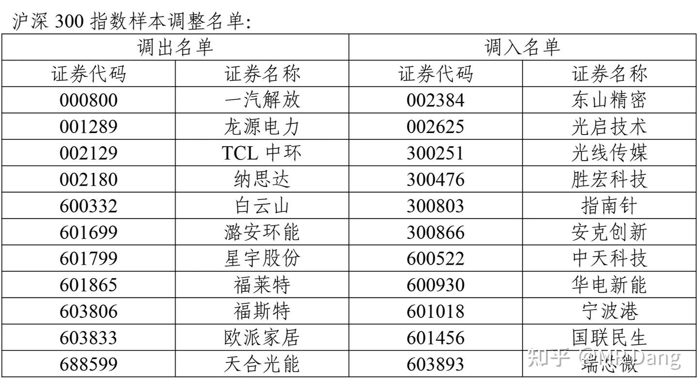
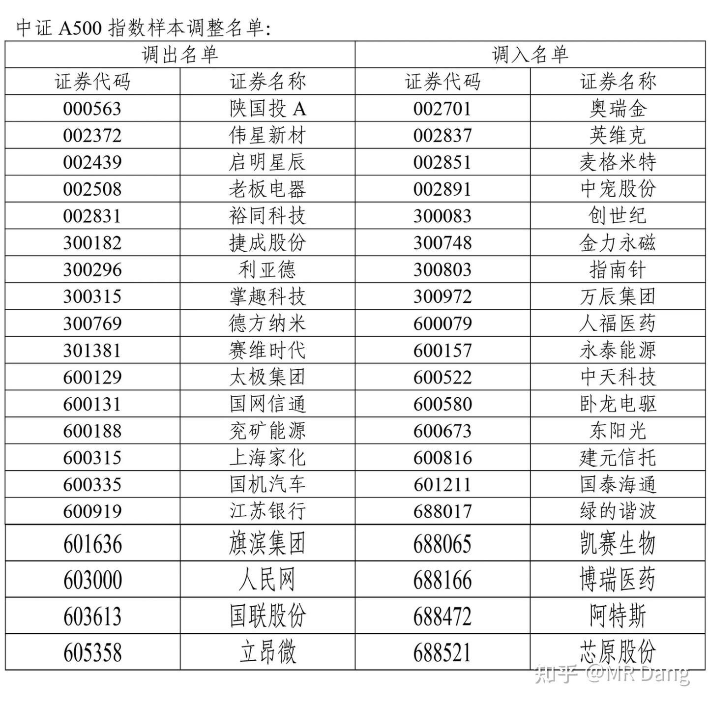

# 《疯狂动物城2影评》&指数调整

---

**发布时间**: 2025-11-30 07:29  |  **原文链接**: https://zhuanlan.zhihu.com/p/1978199221250303889  |  **点赞数**: 394 人赞同

**作者信息**: MR Dang​独立投资人，不接广不卖课

---

## 正文内容

昨天带着一家四口去看了《疯狂动物城2》，为了降低配音对整体观感的影响，以及顺带给两儿子学学英语，选的是原版配音。

我不是专业的影评人，国内的电影我爱看葛优参与的作品，还有《我不是药神》之类的。

国外的电影话，几乎豆瓣评分前100的都挺喜欢，特别喜欢《楚门的世界》。

就是很普通的欣赏水平。

花了钱的电影我没有半场离席过，尊重我花出去的每一分钱。

总的来说，我个人可以给到7分这样子，作为比较，第一部的话我可以给到8.5。

剧情内核方面，不考虑那些zz正确的私货，其实我给的分数还挺高的，能给到9分。考虑一些不喜欢的私货的话，只有7分。

整个剧情里，新出的角色猞猁二代非常亮眼，不是一味地洗白和天降正义，而是屁股决定脑袋，立场决定态度，很现实，很好，对两小崽子很有教育意义。

如果不是这个角色的行动逻辑的话，剧情分数最多给到6分，我个人不喜欢jz。

叙事节奏方面，大概6分吧，不够紧凑，有些地方的处理过于拖沓了，对于一部合家欢类型的动画片来说，剧情的推进有些慢了。

感觉减去10到20分钟的时长会更商业。

小于7岁的孩子很难长时间的集中注意力去理解一些背景故事。

画面表现给到8分吧，没有那种特别亮眼的作画，能让人一眼就感受到满满的震撼。但是也没有任何硬伤，细节方面做的很到位。

不如前几天看的鬼灭作画让人印象深刻，分镜和打击感的处理都十分完美(但是不适合带小孩看)。

情怀加持给到8分吧，彩蛋特别多，数不过来了，可能有上百处。两主角的戏份以及树獭的出场都让人梦回2016。

音乐配音给到6分吧，出现了两次比较集中的唱跳，和冰雪奇缘不是一个档次的。旋律上有一个问题是为了表达更加明快的主题，两次直接进的副歌，没有一个递进的过程。少了一些铺垫的。

整体7分，属于值回票价，不算坑，不反感动画电影的可以去看，但是我个人不会二刷的片子。

我是冲着合家欢和爆米花去看的，就想嘻嘻哈哈没心没肺的感受下现代电影工业的松弛感。结果偷偷摸摸给我带私货，小孩看不懂，大人看着又有点幼稚。

家里有小孩的可以带着去看(学习)。

两小崽子出电影院的时候意识到被骗了，拉着我说，爸爸，不对啊，这不就是换了个地方学英语么？

指数成分调整了。

按照数字从小到大来。

最重要的是上证50指数的调整。

地产最后的黄昏也要落幕了。

接下来是中证A50的调整：

科技股冲锋。

这两个A50有什么区别呢？

中证A50和上证A50都是咱们本土的指数。区别是中证A50涵盖深交所和上交所，而上证A50只有上交所。

选取样本的时候，中证A50更全，讲究每个行业选一个龙一。而上证50更大，就简单的看市值大小，而银行都是庞然大物，所以上证A50里银行多。

还有个富时A50，是外资的指数。选取样本的时候，结合了中证A50选取沪深两市的选取范围以及上证50以大为美的审美方式。

导致的结果就是里面变成了沪深两市的银行大本营。

创业50：

好几个老面孔，比如曾经的大牛股爱美客，依稀就在昨天。

科创50：

最后是北证50完整名单：

这个得说一下，我关注的卖小车车的t公司在名单里，而且t公司又跌回到我关注时候的价位了，目前估值挺低，我觉得值搏率不错，打算加了，甚至有加成重仓的打算，提前吱一声。

等以后北交所基金越来越多了，就会被动买入我的t公司，然后我再高价出给基民，嘿嘿，想想还有点小激动呢。

50完了，该100了，深证100。

调入的是新质生产力和有色，调出的是一些傻大黑粗和cxo。

比100再大就是上证180：

低价铝被踢出去了。

比较重要的沪深300：

这个名单里我比较意外的是宁波港。

上证380：

低价铝降级到这里了，同时还看到了我的邪修被调入，我一直在等300多的机会，不知道能不能等到，还有个我关注的地产股被挪进去了，很意外。这年头地产股能调入的独一份了。

中证500：

调出的有些是升级到中证50了，有些是降级了。这个里面我认识的还不算少，调入名单里有一家做手游的我关注很久了，分红很大方了，做出来的手游品质相当稳定，不可思议迷宫什么的，游戏审美很不错。

中证A500：

中证A500和中证500是两个指数！

中证500主要看大小和流通性，而中证A500更全面。

调入的科技股居多，调出的多是传统行业。

名单最长的中证1000：

调入名单里有我持仓的bt，算是价值发现了吧，守得云开见月明，但是就是持仓数量还不满意，远没到我的理想仓位。

有点意外的是进了几家钢企，一看财报好像都还不错，有空再仔细看看，这几家我挺熟的，可能是我对钢企偏见比较大，很久没仔细看过了。

深成指：

这个名单我看到差点笑了，里面有个倒霉蛋比音勒芬，拿着这个股的人这两年可能睡觉说梦话都在骂娘，持股体验太差了。

这个品牌的衣服登味太重了，还贵的离谱。

现在又被调出，可怜。

创业板指：

大概就这些，可能还有些遗漏的。

如果仔细观察的话，可以发现，调入的大多数是近期涨的多的股票，科技股居多。

调出的大多数是近期跌的多的。

但是这些调出的股票，当年也是这么进来的，也曾经是一时的牛股。

指数的编制就是损不足而奉有余，所以不能简单的认为调入就一定是利好，调出就一定是利空。

凡事没有绝对，这些调入的股票，下次调整时被调出的也不会在少数的。

还是老生常谈的，普通投资者千万不能反其道而行之，去强留弱，逆势而为，螳臂当车。

一个喜欢保护韭菜的博主，希望大家少少踩坑，多多赚钱！

---

## 精选评论

> [!comment]- 点击展开评论
>
>
> | 用户 | 时间 | 内容 |
> | :--- | :--- | :--- |
> | 化石的岁月 |  | 正看影评呢，忽然看了20分钟表格。 |
> | &nbsp;&nbsp;&nbsp;&nbsp;MR Dang |  | 哈哈哈，就是这么猝不及防 |
> | Raven |  | 涨高了调入指数，不就由etf被动去追高么 |
> | &nbsp;&nbsp;&nbsp;&nbsp;MR Dang |  | 是的，基民扛下了所有 |
> | 爱大梨的土豆子 |  | 哟西，基民原来是这么接盘的啊 |
> | kangjie |  | 原来如此 |
> | 蔚蓝无色 |  | 然后指数一直在高位，你看，股市根本就没有跌 |
> | 冰棍空调知了叫 |  | t公司是不是tlgf，卖矿车的 |
> | 唐小命儿 |  | 现在大家需要几个神秘的6位数号码了，哈哈哈 |
> | &nbsp;&nbsp;&nbsp;&nbsp;MR Dang |  | 鄙人不善择时 |
> | xjhxjh |  | 先赞后看，出了一部分盈利基金，还有一部分基金被套，等解套出来，再也不买基金了 |
> | 夏天 |  | 被套+1，要多久能解套哦 |
> | Koperic |  | 套了5年了，每年管理费，托管费2.5个点，总亏了35%左右。还没决定切不切。 |
> | kangjie |  | 可真准时！两小只这么早去培训班了，大人小孩都天天高三 |
> | hfjs |  | 原来基民就是在后面吃土的，再也不买基金了 |
> | 边城 |  | 同力股份估值10.45，接近70分位了，为啥说现在还在低估值区间？ |
> | 叮当 |  | 正看影评，怎么突然变股市了~~~ |

---

*本文件由自动脚本从MR Dang知乎页面提取生成*

---

**作者**: MR Dang
**链接**: https://zhuanlan.zhihu.com/p/1978199221250303889
**来源**: 知乎

*著作权归作者所有。商业转载请联系作者获得授权，非商业转载请注明出处。*

---

## 相关阅读

**📖 社会热点系列：**
完整电影评论与指数调整分析

**💡 投资策略：**
- 指数调整的影响机制
- ETF被动投资的陷阱
- "损不足而奉有余"的指数编制
- 何时调入/调出是利好或利空

**📊 相关指数分析：**
- 上证50指数调整
- 中证A50vs富时A50
- 北证50投资机会
- 各大指数成分股变化